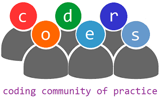

# coders

This the code repository for the Coding Community of Practice ("coders"), 
founded in 2019 by the Department of Environmental and Occupational Health 
Sciences (DEOHS) at the University of Washington (UW) School of Public 
Health (SPH).

This community fosters a culture of coding excellence by encouraging coders 
to improve their skills and the quality of their code. We meet regularly to 
provide coding demonstrations, engage in workshops, and participate in code 
review. We also share our experience and knowledge through a mentoring program 
for UW students.

This repository contains some demonstrations (listed below). Additional 
resources may be found in the [wiki](wiki).

## R onramp

To help you get a head start, we created an "onramp" series designed to teach 
you the basics, from navigating the RStudio interface to creating figures. 
We cover R language basics, data wrangling, creating scripts and more!

- [R onramp](https://github.com/deohs/r_onramp)

## Demos

Here are some slide presentations from earlier meetings...

* Getting and Cleaning data with Regex in R Part 1 ([WA WQI with Tidyverse](demos/data_import/wa_wqi/get_wa_wqi.md))
* Getting and Cleaning data with Regex in R Part 2 ([WA WQI Alternate Dataset](demos/data_import/wa_wqi/get_wa_wqi_alt.md) and [Base-R Variations](demos/data_import/wa_wqi/get_wa_wqi_2013_with_base_R.md))
* Web Scraping with rvest in R Part 1 ([NOAA Smoke Shapefiles](demos/data_import/noaa_smoke/get_noaa_smoke.md), [WA WQI Stations](demos/data_import/wa_wqi/get_wa_wqi_stations.md))
* Web Scraping with rvest in R Part 3 ([WA WQI per Station](demos/data_import/wa_wqi/get_wa_wqi_per_station.md))
* Web Scraping with rvest in R Part 3 ([EPA AQI](demos/data_import/epa_aqi/getAQI.md))
* Web Scraping with RCurl and jsonlite in R (_Historical Pollen Index_)
* Using a web API with jsonlite in R (_EPA AQS API_)
* Plotting in R with ggplot2 ([Earthquake Events in the PNW](demos/data_viz/ggplot2%20Presentation/ggplot_presentation_output.md))
* Mapping with R ([Measles Outbreak 2019](demos/data_viz/mapping_wa_measles_outbreak_2019/wa_measles_outbreak_2019.Rmd)) - [slides](https://staff.washington.edu/high/wa_measles_outbreak_2019.html)
* R Markdown Presentations ([with Custom Themes](demos/pres/pres_demo/Presentations_with_R.md))
* Many Models ([in Base-R](demos/models/bootstrapping/chicago_pollution.md)) and background processing
* Building R Packages ([with RStudio and Roxygen](demos/packages/building_packages/building_r_packages.md))
* Parallel Processing in R (on a single machine with [forking and sockets](demos/hpc/parallel_processing/Parallel_Example_CrossPlatform.md))
* Cluster Computing with R (with [forking, sockets, and MPI](demos/hpc/parallel_processing/Cluster_Computing.md))
* Plotting logistic regression (with [`glm` and facets](demos/models/plotting_logistic_regression_with_glm_and_facets.md))
* Running many models (with [`lmer`](demos/models/many_models_with_lmer.md))
* Network graphs (with [`qgraph`](demos/data_viz/network_graphs_with_qgraph/grant_awards.md))

