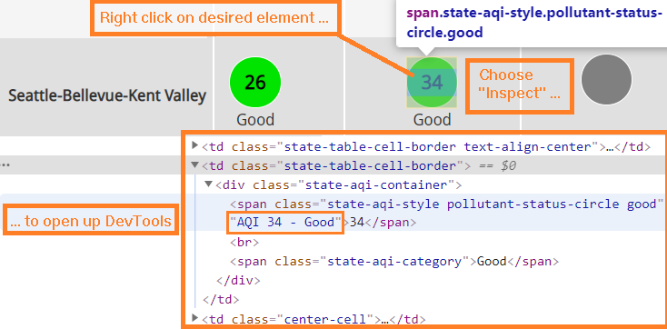
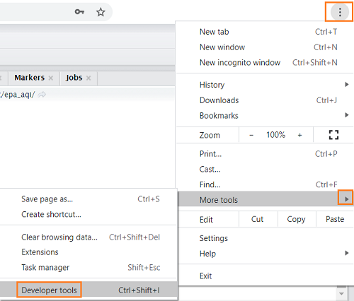
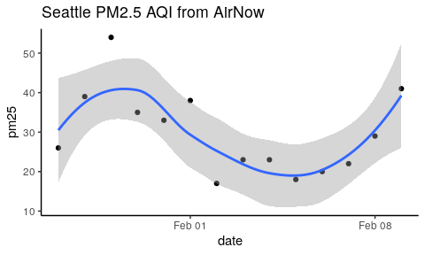
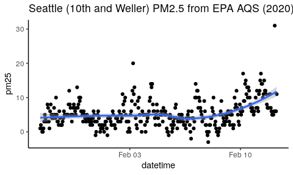
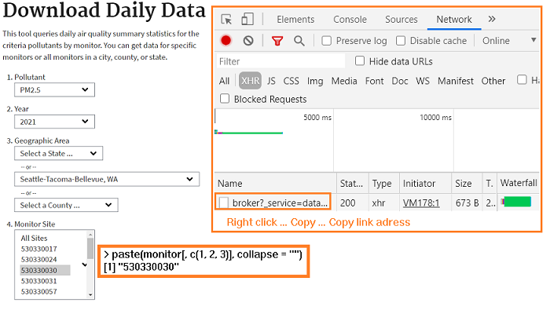
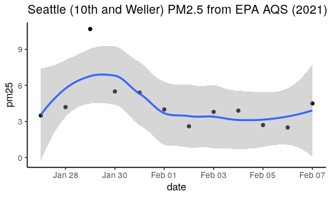
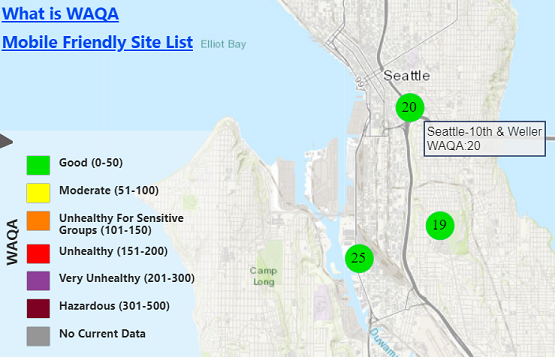
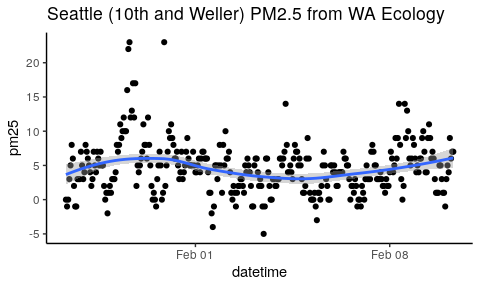
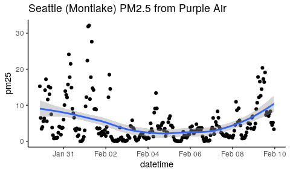

<style>
.forceBreak { -webkit-column-break-after: always; break-after: column; }
</style>


## Get air quality data from web sites

This demo is an example of how to automate data collection from the 
web using R.

We will get recent PM2.5 data from Seattle sampling stations from three web sites: 

* EPA's "Airnow" site: https://airnow.gov/
* EPA's AQS site: https://www.epa.gov/outdoor-air-quality-data
* WA Ecology's Air Monitoring Network site: https://enviwa.ecology.wa.gov/
* Purple Air: https://www.purpleair.com/

## Setup

Load packages with `pacman` to auto-install any missing packages.


```r
# Load packages.
if (! suppressPackageStartupMessages(require(pacman))) {
  install.packages('pacman', repos = 'http://cran.us.r-project.org')
}
pacman::p_load(dplyr, tidyr, ggplot2, lubridate, httr, jsonlite, rvest, styler)
```

We are loading:

* `dplyr` -- `mutate()`, `select()`, `filter()`, etc. -- for data cleanup
* `tidyr` -- `unnest()`, `pivot_wider()`, etc. -- for data reshaping
* `ggplot2` -- `ggplot()` -- for plotting
* `lubridate` -- `as_datetime()` -- for date manipulation
* `httr` -- `GET()`, `POST()` -- for sending requests to web servers
* `jsonlite` -- `fromJSON()` -- for extracting JSON from web responses
* `rvest` -- `read_html()`, `html_node()`, `html_attr()` -- for web-scraping
* `styler` -- `style_text()` -- to format R code for better display

## Airnow air quality data

We will get historical air quality data from this page: 

- https://www.airnow.gov/state/?name=washington


## Should web "web-scrape"?

We could use Chrome's "Inspect" feature to open the "DevTools" window to the 
HTML element we want. Then we might extract the data using a package like `rvest`.



## Getting structured data

Instead of web-scraping the web page, we can download the data in JSON format, 
which is better structured for automated data extraction.

Here are the first 250 characters of the JSON data used by that web page.


```r
url <- 'https://airnowgovapi.com/andata/States/Washington/2021/1/22.json'
substr(prettify(fromJSON(url)), 1, 250)
```

```
## {
##     "state": "Washington",
##     "fileWrittenDateTime": "20210125T160551Z",
##     "reportingAreas": [
##         {
##             "Ritzville": {
##                 "pm25": 12.0,
##                 "pm10": -999.0,
##                 "ozone": -999.0
##             }
## 
```

## Open "Developer tools"

To find the web address, open the "DevTools" window in your web browser.



## Get the web address for JSON data

Use the Network tab of the DevTools feature after loading the "Historical Air Quality" page for [Washington](https://www.airnow.gov/state/?name=washington). Click XHR to filter results. Look for JSON files. 


## Airnow data by date

The "Historical Air Quality" tab has a place to enter a date. This date is also 
present in the URL for the JSON data. Here is an example:

- https://airnowgovapi.com/andata/States/Washington/2021/1/22.json

We will need to create a sequence of dates to get the data for each date.


```r
# Calculate date sequence
n_days <- 14
today_date <- Sys.Date()
start_date <- today_date - n_days
end_date <- today_date - 1
dates <- seq(from = start_date, to = end_date, by = 1)
```

We will use these dates to query the Airnow "API" by incorporating the date
into the URL we use to get the data.

## Get Airnow data

We will use this date sequence to automate the extraction of data using `lapply()`. 
This allows us to repeat the request for each date in a sequence.

The data is in JSON format so we will use `fromJSON()` to parse the JSON into
a list. Then we can use `lapply()` again to transform the list items into 
dataframes. Finally, we combine the dataframes with `rbind()`.


```r
# Get AQI data for each date and combine into a single dataframe
base_url <- 'https://airnowgovapi.com/andata/States/Washington'
df <- do.call("rbind", lapply(dates, function(my_date) {
  try({
      date_url <- format.Date(my_date, format = '/%Y/%-m/%-d')
      url <- paste0(base_url, date_url, ".json")
      json_dat <- fromJSON(fromJSON(url), simplifyDataFrame = FALSE)
      do.call("rbind", lapply(json_dat$reportingAreas, function(x) {
        data.frame(reportingArea = names(x), date = my_date, x[[1]])}))
      }, silent = TRUE)
}))
```

This is a base-R approach. We could do this with the `tidyverse` 
function `map()` instead of `lapply()` and `bind_rows()` instead of `rbind()`.

## Plot Airnow PM2.5 data for Seattle

We obtained data for several sites in Washington. We can subset the results for
Seattle and view them as a scatter plot.


```r
plot_df <- df[grepl("Seattle", df$reportingArea), ]
plot_title <- "Seattle PM2.5 from AirNow"
ggplot(plot_df, aes(date, pm25)) + geom_point() +  ggtitle(plot_title) + 
  geom_smooth(formula = "y ~ x", method = "loess") + theme_classic()
```

<!-- -->

## Get EPA AQS Data

The EPA offers data for [download](https://aqs.epa.gov/aqsweb/airdata/download_files.html) as annual 
"zip" archives from previous years. You can download files for the year and 
geographic area you want and then extract the data you want from those files.

If you want to be more specific in what you download, you can use their 
[API](https://aqs.epa.gov/aqsweb/documents/data_api.html) to 
get data in JSON format for, e.g., a specific site and parameter. But you can't 
get recent data from this API, as far as we can tell.

We will get PM2.5 data for the "Seattle-10th & Weller" site for a two week 
period from this time last year.


```r
# Calculate start and end dates
start <- format.Date(Sys.Date() - 379, "%Y%m%d")
end <- format.Date(Sys.Date() - 365, "%Y%m%d")
```

## Get EPA AQS Metadata

To get our data, we will first need to download some metadata:

- State FIPS code
- County code
- State code
- Site number
- Parameter code


```r
# Find FIPS code for Washington
url <- "https://aqs.epa.gov/data/api/list/states?email=test@aqs.api&key=test"
states <- fromJSON(url)[['Data']]
fips_code <- states %>%  filter(value_represented == "Washington") %>% pull(code)

# Get monitor info (site number and parameter code)
url <- "https://aqs.epa.gov/data/api/monitors/byState"
query_list <- list(email = "test@aqs.api", key = "test", 
                   bdate = start, edate = end, state = fips_code)
monitors <- fromJSON(content(GET(url, query = query_list), "text"))[['Data']]
monitor <- monitors %>% filter(local_site_name == "Seattle-10th & Weller",
         parameter_name == "PM2.5 - Local Conditions") 
```

## Get data with EPA AQS API

Now we can get our hourly PM2.5 data from "Seattle-10th & Weller" from last year.


```r
# Get PM2.5 data
url <- "https://aqs.epa.gov/data/api/sampleData/bySite"
query_list <- list(email = "test@aqs.api", key = "test", 
                   bdate = start, edate = end, state = fips_code,
                   county = monitor$county_code, site = monitor$site_number, 
                   param = monitor$parameter_code)
df <- fromJSON(content(GET(url, query = query_list), "text"))[['Data']]

# Prepare data for plotting
plot_df <- df %>% 
  mutate(datetime = 
    as_datetime(paste(date_gmt, paste0(time_gmt, ':00')), tz = "UTC")) %>%
  select(datetime, pm25 = "sample_measurement")
```

## Plot EPA AQS PM2.5 data for Seattle


```r
plot_title <- paste("Seattle (10th and Weller) PM2.5 from EPA AQS", 
                    paste0('(', year(plot_df$datetime[1]), ')'))
ggplot(plot_df, aes(datetime, pm25)) + geom_point() +  ggtitle(plot_title) + 
  geom_smooth(formula = "y ~ x", method = "loess") + theme_classic()
```

<!-- -->

## Current data from EPA AQS

The EPA offers current data with it's [download daily data](https://www.epa.gov/outdoor-air-quality-data/download-daily-data) page.

You can fill out that form and get the data link using DevTools as shown earlier, 
but you will need the Monitor Site ID.



## Get EPQ AQS Daily Data

We can obtain the Monitor Site ID from our previous EPA AQS example.


```r
paste(monitor[, c(1, 2, 3)], collapse = "")
```

```
## [1] "530330030"
```

If you load the URL in your web browser, you see that it returns HTML with a
temporary link that expires in 10 minutes. So, we need to "web-scrape" to extract 
that link.


```r
url <- 'https://www3.epa.gov/cgi-bin/broker?_service=data&_debug=0&_program=dataprog.ad_data_daily_airnow.sas&querytext=&areaname=&areacontacts=&areasearchurl=&typeofsearch=epa&result_template=2col.ftl&poll=88101%27%2C%2788502&year=2021&state=-1&cbsa=42660&county=-1&site=530330030'

# Get temporary CSV download URL
csv_url <- read_html(url) %>% html_node("a") %>% html_attr("href")
```

## Get EPQ AQS Daily Data

Now we can use that link to get the data.


```r
# Calculate start and end dates
start <- Sys.Date() - 14
end <- Sys.Date() - 1

# Prepare data for plotting
plot_df <- read.csv(csv_url) %>% 
  select(date = "Date", pm25 = "Daily.Mean.PM2.5.Concentration") %>% 
  mutate(date = as_date(as.character(date), format = "%m/%d/%Y")) %>% 
  filter(date >= start, date <= end)
```

## Plot EPA AQS PM2.5 daily data for Seattle


```r
plot_title <- paste("Seattle (10th and Weller) PM2.5 from EPA AQS", 
                    paste0('(', year(plot_df$date[1]), ')'))
ggplot(plot_df, aes(date, pm25)) + geom_point() +  ggtitle(plot_title) + 
  geom_smooth(formula = "y ~ x", method = "loess") + theme_classic()
```

<!-- -->

## Get WA Ecology data

WA Ecology also has airquality data on their [web site](https://enviwa.ecology.wa.gov/home/map). Let's get hourly PM2.5 data from the "Seattle-10th & Weller" sampling station. 



## Making the site report request

Launch WebTools and go to Reports > Sites in the [web site](https://enviwa.ecology.wa.gov/home/map). Fill out the form:


## Where do we get the request format?

We want to duplicate this task in R. So, we need to find out how to send the 
form data from R. We do this with "Copy as cURL (bash)" in DevTools.


## What is "Copy as cURL (bash)"?

This is the cURL command you could paste into a Bash prompt to make the request.

```
curl 'https://enviwa.ecology.wa.gov/report/GetStationReportData' \
  -H 'Connection: keep-alive' \
  -H 'sec-ch-ua: "Google Chrome";v="87", " Not;A Brand";v="99", "Chromium";v="87"' \
  -H 'Accept: */*' \
  -H 'X-Requested-With: XMLHttpRequest' \
  -H 'sec-ch-ua-mobile: ?0' \
  -H 'User-Agent: Mozilla/5.0 (Windows NT 10.0; Win64; x64) AppleWebKit/537.36 
  (KHTML, like Gecko) Chrome/87.0.4280.141 Safari/537.36' \
  -H 'Content-Type: application/json; charset=UTF-8' \
  -H 'Origin: https://enviwa.ecology.wa.gov' \
  -H 'Sec-Fetch-Site: same-origin' \
  -H 'Sec-Fetch-Mode: cors' \
  -H 'Sec-Fetch-Dest: empty' \
  -H 'Referer: https://enviwa.ecology.wa.gov/report/SingleStationReport' \
  -H 'Accept-Language: en-US,en;q=0.9' \
  -H 'Cookie: Enviwadev.ecology.wa.gov=dlmljqqniqiq2u20x4nnsfve' \
  --data-binary '{"StationId":163,"MonitorsChannels":[32],
  "reportName":"station report","startDateAbsolute":"1/23/2021 00:00",
  "endDateAbsolute":"1/23/2021 23:00","startDate":"1/23/2021 00:00",
  "endDate":"1/23/2021 23:00","reportType":"Average","fromTb":60,"toTb":60}' \
  --compressed
```

## Request parameters as a list

The cURL command shows the request parameters are sent in a JSON string.

We can convert this to a list that we can more easily use this in our script.


```r
json <- '{"StationId":163,"MonitorsChannels":[32],
  "reportName":"station report","startDateAbsolute":"1/23/2021 00:00",
 "endDateAbsolute":"1/23/2021 23:00","startDate":"1/23/2021 00:00",
  "endDate":"1/23/2021 23:00","reportType":"Average","fromTb":60,"toTb":60}'
style_text(deparse(fromJSON(json)))
```

```
## list(
##   StationId = 163L, MonitorsChannels = 32L, reportName = "station report",
##   startDateAbsolute = "1/23/2021 00:00", endDateAbsolute = "1/23/2021 23:00",
##   startDate = "1/23/2021 00:00", endDate = "1/23/2021 23:00",
##   reportType = "Average", fromTb = 60L, toTb = 60L
## )
```

You will notice the dates are supplied in M/D/YYYY format. In R this is '%-m/%-d/%Y'.

The StationId (163) and channel (32) could be modified for other sensor stations 
or test parameters.

## Getting a Station and parameter list

To get a list of available sensors and test parameters, we can download another
JSON file and search it. First we find the URL using the browser's DevTools feature. 


Right click the "Name" -> then "Copy" -> then "Copy link address".

## Getting the StationId and channel

With that link, we can download the station list and search for the StationId and channel we want.


```r
url <- 'https://enviwa.ecology.wa.gov/ajax/getAllStationsWithoutFiltering'
enviwa_df <- fromJSON(url)
sea_df <- enviwa_df %>% filter(name == "Seattle-10th & Weller")
StationId <- sea_df %>% pull(serialCode)
channel <- sea_df %>% select(monitors) %>% unnest(monitors) %>% 
  filter(name == "BAM_PM25") %>% pull(channel)
paste("StationId =", StationId, "; channel =", channel)
```

```
## [1] "StationId = 163 ; channel = 32"
```

Although we already had these values for one station and parameter, now we have 
a more efficient way to find other stations and parameters if we need to modify 
our request.

## Format query dates

We will request data for the past two weeks. We need to calculate the start and 
end dates of this time period and format them as the web site expects.


```r
today_date <- Sys.Date()
n_days <- 14
start_date <- format.Date(today_date - n_days, format = '%-m/%-d/%Y')
end_date <- format.Date(today_date - 1, format = '%-m/%-d/%Y')

start_date
```

```
## [1] "1/12/2021"
```

```r
end_date
```

```
## [1] "1/25/2021"
```

## Create list of request parameters

This web site expects our request parameters to be sent as "data". We can 
create a list to help accomplish that.


```r
# Create a list of query parameters
body_lst <- list(StationId = StationId,
                 MonitorsChannels = channel,
                 reportName = "station report",
                 startDateAbsolute = paste(start_date, "00:00"),
                 endDateAbsolute = paste(end_date, "23:00"),
                 reportType = "Average",
                 fromTb = 60,
                 toTb = 60)
```

Through experimentation, we find that we can omit "startDate" and "endDate", 
since "startDateAbsolute" and "endDateAbsolute" appear to be sufficient.

## Get WA Ecology JSON

Now that our request is in a list, we can send that list to the web site.


```r
# Get data as JSON
response <- POST(
  "https://enviwa.ecology.wa.gov/report/GetStationReportData",
  config = list(content_type("application/json")), 
  body = body_lst, encode = "json"
)

json_txt <- content(response, "text")
```

By experimenting with the cURL command found earlier, we find that no other
special request headers, such as "Cookie" or "Referer", will be needed. If they
were, we would send them using the POST function.

We use `encode = "json"` to convert the "body" (parameter list) to JSON.

## What does this JSON look like?

Here are the first 400 characters of this JSON data string.


```r
substr(prettify(json_txt), 1, 400)
```

```
## {
##     "StationId": 163,
##     "data": [
##         {
##             "datetime": "2021-01-12T00:00:00-08:00",
##             "Originaldatetime": "/Date(-62135568000000)/",
##             "channels": [
##                 {
##                     "DisplayName": "BAM_PM25",
##                     "id": 32,
##                     "name": "BAM_PM25",
##                     "alias": null,
##                     "value": 1.0,
## 
```

## Clean up the data

Now we just need to format the data as a dataframe and clean it up for plotting.


```r
# Clean up data
json_df <- fromJSON(json_txt)$data
df <- bind_rows(json_df$channels)
df$datetime <- json_df$datetime
df$StationId <- json_df$StationId

# Prepare for plotting
plot_df <- df %>% filter(status == 1) %>%
  mutate(datetime = as_datetime(datetime)) %>%
  select(datetime, name, value) %>% 
  pivot_wider() %>% rename("pm25" = "BAM_PM25")
```

## Plot WA Ecology PM2.5 data for Seattle


```r
plot_title <- "Seattle (10th and Weller) PM2.5 from WA Ecology"
ggplot(plot_df, aes(datetime, pm25)) + geom_point() +  ggtitle(plot_title) + 
  geom_smooth(formula = "y ~ x", method = "loess") + theme_classic()
```

<!-- -->

## Purple Air sensor data

Similar to WA Ecology's website, Purple Air also has a nice map interface where 
you find a sensor and click on it to see the current data. Here's data from "Montlake":


## Finding data download links

It is usually easy to download data as files, but it can be hard to 
find the download links or buttons.

If we "mouse over" the "Get This Widget" text we see a popup with links to 
"Download", "JSON", and "DATA.JSON". 


## Data collection on a schedule

We can use the JSON link to get current data into R, but we see no immediately 
obvious way to get historical data from the JSON link.

However, we could run this R code hourly to collect PM2.5 data over time:


```r
df <- jsonlite::fromJSON("https://www.purpleair.com/json?show=84023")$results
df <- df[df$Label == "Montlake", c('Label', 'PM2_5Value', 'LastSeen')]
df$LastSeen <- lubridate::as_datetime(df$LastSeen)
readr::write_csv(df, file.path("data", "seattle_84023_pm25.csv"), append = TRUE)
```

We could save this to a script file and then execute that file hourly using 
the "cron" utility. Here is an example "crontab" entry which would do this.

```
00 * * * * (cd ~/Documents/coders/demos/data_import/epa_aqi; Rscript get_pm25.R)
```

## Historical JSON data using Thingspeak's API

Although it's not immediately obvious, there is a way to automate collection of 
Purple Air historical data as JSON.

If you read the [FAQ](https://www.purpleair.com/faq) and study the 
[API documentation](https://www.mathworks.com/help/thingspeak/readdata.html), 
you will find we can get historical data with a carefully crafted query.

We can query the Montlake station with this information:


```r
# Get dataframe of information we need to query Thingspeak's API
url <- "https://www.purpleair.com/json?show=84023"
df <- jsonlite::fromJSON(url)$results
df <- df[df$Label == "Montlake", 
  c('ID', 'Label', 'THINGSPEAK_PRIMARY_ID', 'THINGSPEAK_PRIMARY_ID_READ_KEY')]

# Extract values we need from dataframe
ts_id <- df$THINGSPEAK_PRIMARY_ID
ts_key <- df$THINGSPEAK_PRIMARY_ID_READ_KEY
```

## Get JSON data from Thingspeak

Now we can get the past two weeks of hourly data from the Montlake sensor.


```r
# Calculate start and end dates
start <- paste(Sys.Date() - 14, "00:00:00")
end <- paste(Sys.Date() - 1, "23:59:59")

# Make web request
url <- paste('https://thingspeak.com/channels', ts_id, 'feeds.json', sep = "/")
query_list <- list(api_key = ts_key, start = start, end = end, timescale = "60")
response <- GET(url, query = query_list)

# Extract data from JSON into a dataframe
json_txt <- content(response, "text")
df <- as_tibble(fromJSON(json_txt)[['feeds']])

# Get names for "field1" through "field8" from metadata list
meta_lst <- fromJSON(json_txt, simplifyVector = FALSE)[[1]] 
field_names <- meta_lst[grepl('^field\\d+$', names(meta_lst))]
names(df)[names(df) %in% names(field_names)] <- unlist(field_names)

# Prepare data for plotting
plot_df <- df %>% select(datetime = "created_at", pm25 = "PM2.5 (ATM)") %>%
  mutate(datetime = as_datetime(datetime), pm25 = as.numeric(pm25))
```

## Plot Purple Air PM2.5 data for Seattle


```r
plot_title <- "Seattle (Montlake) PM2.5 from Purple Air"
ggplot(plot_df, aes(datetime, pm25)) + geom_point() +  ggtitle(plot_title) + 
  geom_smooth(formula = "y ~ x", method = "loess") + theme_classic()
```

<!-- -->

## Plot a map of PM2.5 AQI for Seattle

We can plot PM2.5 AQI for multiple sensor locations in Seattle using the 
[ggmap](https://cran.r-project.org/web/packages/ggmap/index.html) package. The 
[Air quality Index (AQI)](https://www.airnow.gov/aqi/aqi-basics/) is 
calculated using the [con2aqi](https://cran.r-project.org/web/packages/con2aqi/index.html) package. 


The code for the plot is rather long, so it is stored in 
[a separate script file](https://github.com/deohs/coders/blob/master/demos/data_import/epa_aqi/pa_multi_station_plot_current_seattle.R).

## Exercises 

### A. Get historical CSV data from Purple Air

1. Use the DevTools in your web browser to find the link used to deliver the 
CSV download files when you follow a Purple Air "Download" link from the 
"Montlake" sensor (Seattle).
2. Modify the link to pull the past two weeks of data as a single CSV file.
3. Is this better than getting JSON data? Why or why not?

### B. Get more parameters from multiple sensor locations

1. Modify WA Ecology example provided here to get "Temp Amb 10m" and "BC_633" 
as well as "BAM_PM25" from a single web request. 
2. Then modify further to collect from multiple sites, one request per site, 
using a loop, lapply, etc. to avoid copying and pasting code. 
3. Assemble the results into a single dataframe and save as a CSV file. Include 
the current date in the filename in ISO format (YYYY-MM-DD). 
