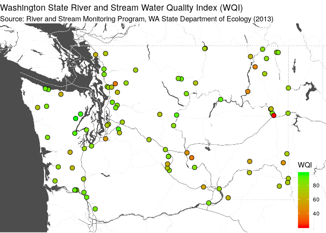

## Data Import and Cleanup Demo

Today's example demonstrates these objectives:

* Use a public dataset freely available on the web.
* Automate data processing from start to finish (importing to reporting).
* Explore alternatives to "base" functions.
* Use data "pipelines" for improved readability.
* Use "regular expressions" to simplify data manipulation.
* Use of "literate programming" to provide a reproducable report.
* Use of a consitent coding [style](https://google.github.io/styleguide/Rguide.xml).
* Share code through a public [repository](https://github.com/deohs/coders) to facilitate collaboration.

We will be using the R language, but several other tools could do the job.

## WA Water Quality Index Scores

We would like to get fecal coliform environmental data and visualize it.

We will download [Annual 2013 Water Quality Index Scores](https://catalog.data.gov/dataset/annual-2013-water-quality-index-scores-4d1fd) from `data.gov`, 
import, clean and plot on a map.

To find the data, we can search this page: https://catalog.data.gov/dataset

... for these terms: `washington state annual freshwater coliform`

The result for "Annual 2013 Water Quality Index Scores" provides a link to a 
CSV file. 

We will use this [link](https://data.wa.gov/api/views/h7j9-vgr3/rows.csv?accessType=DOWNLOAD) to import the data into R.

## Access & Use Information

The data page says:

* Public: This dataset is intended for public access and use.
* Non-Federal: This dataset is covered by different Terms of Use than Data.gov.
* License: No license information was provided.

The data page also says:

    For temperature, pH, oxygen, and fecal coliform bacteria, the WQI is based 
    on criteria in Washington’s Water Quality Standards, WAC 173-201A.

## Setup

Load packages with `pacman` to auto-install any missing packages.


```r
if (! suppressPackageStartupMessages(require(pacman))) {
  install.packages('pacman', repos = 'http://cran.us.r-project.org')
}
pacman::p_load(readr, dplyr, tidyr, ggmap)
```

We are loading:

* `readr` for `read_csv()` -- a [tidyverse](https://www.tidyverse.org/) replacement for `read.csv()`
* `dplyr` for `mutate()` -- a [tidyverse](https://www.tidyverse.org/) function for data modification
* `tidyr` for `separate()` -- a [tidyverse](https://www.tidyverse.org/) function for column splitting
* `ggmap` for `ggmap()` -- a function, similar to `ggplot()`, to create maps

## Get the Data

Import the data with `read_csv()` as an alternative to `read.csv()`.


```r
url <- 'https://data.wa.gov/api/views/h7j9-vgr3/rows.csv?accessType=DOWNLOAD'
wa_wqi <- read_csv(url)
```

```
## Parsed with column specification:
## cols(
##   ID = col_double(),
##   STATION = col_character(),
##   `STATION NAME` = col_character(),
##   `OVERALLWQI 2013` = col_double(),
##   WQIFC = col_double(),
##   WQIOXY = col_double(),
##   WQIPH = col_double(),
##   WQITSS = col_double(),
##   WQITEMP = col_double(),
##   WQITPN = col_double(),
##   WQITP = col_double(),
##   WQITURB = col_double(),
##   CORE = col_character(),
##   CAT = col_double(),
##   `Location 1` = col_character(),
##   Counties = col_double()
## )
```

## View the Location Data

Look at some of the values of `Location 1`.


```r
head(wa_wqi$`Location 1`)
```

```
## [1] "POINT (-122.3352 48.4451)" "POINT (-122.3382 48.5458)"
## [3] "POINT (-121.429 48.5268)"  "POINT (-122.247 48.21)"   
## [5] "POINT (-122.2101 48.1969)" "POINT (-122.119 48.2007)"
```

We will want to split out the longitude and latitude into their own variables.

## Cleanup the Data

Parse location column to get latitude and longitude columns using a "pipeline". 

* Use `mutate()` to create a "cleaned" `Location.1` variable.
* Use a "regular expression" with `gsub()` to remove unwanted text.
* Use `separate()` to split `Location.1` into `lon` and `lat` variables.
* Use `convert = TRUE` to auto-convert the `character` values to `numeric`.


```r
wa_wqi <- wa_wqi %>% 
  mutate(Location.1 = gsub('POINT |[()]', '', `Location 1`)) %>%
  separate(col = Location.1, into = c('lon', 'lat'), sep = ' ', convert = TRUE)
```

Note: the `sep` parameter of `separate()` will also accept a "regular expression".

## Our Regular Expression

We used a [regular expression](https://www.rstudio.com/wp-content/uploads/2016/09/RegExCheatsheet.pdf) to split the location variable.

The expression was: `POINT |[()]`

* The `POINT ` is a literal string (including a literal space after it).
* The `|` (vertical bar) symbol means "or" in this context.
* The `[` and `]` (angle brackets) defines a character set in this context.
* The `(` and `)` (parenthesis) are the characters in that set.

Translating the whole expression we have:

* Either `POINT ` or `(` or `)`.

When used in `gsub()` for replacement, we replaced matching character strings 
with `''`, which is the same as removing them.

## View the Cleaned Data

View some of the location data.


```r
options(pillar.sigfig = 7)
wa_wqi %>% select(`Location 1`, lon, lat) %>% head()
```

```
## # A tibble: 6 x 3
##   `Location 1`                    lon      lat
##   <chr>                         <dbl>    <dbl>
## 1 POINT (-122.3352 48.4451) -122.3352 48.44510
## 2 POINT (-122.3382 48.5458) -122.3382 48.5458 
## 3 POINT (-121.429 48.5268)  -121.429  48.5268 
## 4 POINT (-122.247 48.21)    -122.247  48.21   
## 5 POINT (-122.2101 48.1969) -122.2101 48.1969 
## 6 POINT (-122.119 48.2007)  -122.119  48.2007
```

## Create a Map

Define a boundary box.


```r
height <- max(wa_wqi$lat) - min(wa_wqi$lat)
width <- max(wa_wqi$lon) - min(wa_wqi$lon)
bbox <- c(
  min(wa_wqi$lon) - 0.15 * width,
  min(wa_wqi$lat) - 0.15 * height,
  max(wa_wqi$lon) + 0.15 * width,
  max(wa_wqi$lat) + 0.15 * height
)
names(bbox) <- c('left', 'bottom', 'right', 'top')
```

Make a map base layer of "Stamen" tiles.


```r
map <- suppressMessages(
  get_stamenmap(bbox, zoom = 8, maptype = "toner-background"))
```

Make the map image from the tiles using `ggmap`.


```r
g <- ggmap(map, darken = c(0.3, "white")) + theme_void() 
```

## Add to the Map

Add points, a legend, and a title to the map.


```r
g <- g + geom_point(aes(x = lon, y = lat, fill = WQIFC), 
               data = wa_wqi, pch = 21, size = 3) + 
  scale_fill_gradient(name = "FCI", low = "green", high = "red") + 
  ggtitle(label = paste("Washington State", 
                        "Freshwater Fecal Coliform Index (FCI)", sep = " "),
          subtitle = paste("Source: River and Stream Monitoring Program,", 
                           "WA State Department of Ecology (2013)")) +
  theme(legend.position = c(.98, .02), legend.justification = c(1, 0)) 
```

## View the Map

<!-- -->
