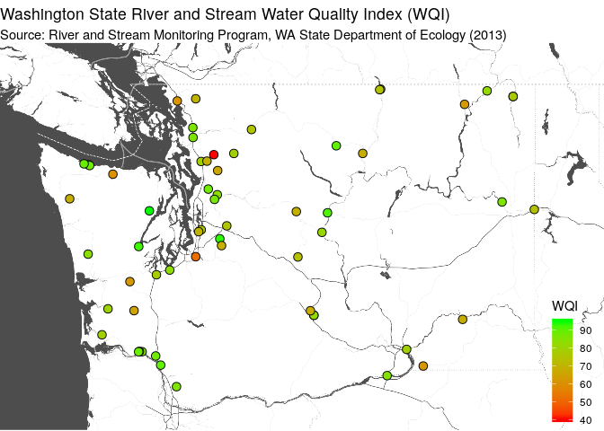

## Data Import and Cleanup Demo

Today's example demonstrates these objectives:

* Use a public dataset freely available on the web.
* Automate data processing from start to finish (importing to reporting).
* Explore alternatives to "base" functions.
* Use data "pipelines" for improved readability.
* Use "regular expressions" to simplify data manipulation.
* Use "literate programming" to provide a reproducable report.
* Use a consitent coding [style](https://google.github.io/styleguide/Rguide.xml).
* Share code through a public [repository](https://github.com/deohs/coders) to facilitate collaboration.

We will be using the R language, but several other tools could do the job.

The code and this presentation are free to share and modify according to the 
[MIT License](https://github.com/deohs/coders/blob/master/LICENSE).

## WA Water Quality Index Scores

We would like to get Washington water quality index (WQI) data and visualize it.

We will download [WQI Parameter Scores 1994-2013](https://catalog.data.gov/dataset/wqi-parameter-scores-1994-2013-b0941) from `data.gov`, 
import, clean and plot on a map.

To find the data, we can search this page: https://catalog.data.gov/dataset

... for these terms: `WQI Parameter Scores 1994-2013`

The result for "WQI Parameter Scores 1994-2013" provides a link to a 
CSV file. 

We will use this data.wa.gov [link](https://data.wa.gov/api/views/dn4d-x42e/rows.csv?accessType=DOWNLOAD) to import the data into R.

## Access & Use Information

The data.wa.gov page says:

* Public: This dataset is intended for public access and use.
* Non-Federal: This dataset is covered by different Terms of Use than Data.gov.
* License: No license information was provided.

The data page also says:

* The WQI ranges from 1 (poor quality) to 100 (good quality).

Lastly, the authors of the `ggmap` package ask that users provide a citation:

    D. Kahle and H. Wickham. ggmap: Spatial Visualization with ggplot2. The R Journal, 
    5(1), 144-161. URL http://journal.r-project.org/archive/2013-1/kahle-wickham.pdf

## Setup

Load packages with `pacman` to auto-install any missing packages.


```r
if (! suppressPackageStartupMessages(require(pacman))) {
  install.packages('pacman', repos = 'http://cran.us.r-project.org')
}
pacman::p_load(readr, dplyr, tidyr, ggmap)
```

We are loading:

* `readr` for `read_csv()` -- a [tidyverse](https://www.tidyverse.org/) replacement for `read.csv()`
* `dplyr` for `mutate()` -- a [tidyverse](https://www.tidyverse.org/) function for data modification
* `tidyr` for `separate()` -- a [tidyverse](https://www.tidyverse.org/) function for column splitting
* `ggmap` for `ggmap()` -- a function, similar to `ggplot()`, to create maps

## Get the Data

Import the data with `read_csv()` as an alternative to `read.csv()`.


```r
url <- 'https://data.wa.gov/api/views/dn4d-x42e/rows.csv?accessType=DOWNLOAD'
wa_wqi <- read_csv(url)
```

```
## Parsed with column specification:
## cols(
##   Station = col_character(),
##   `Station Name` = col_character(),
##   Year = col_double(),
##   `Overall WQI` = col_double(),
##   `WQI FC` = col_double(),
##   `WQI Oxy` = col_double(),
##   `WQI pH` = col_double(),
##   `WQI TSS` = col_double(),
##   `WQI Temp` = col_double(),
##   `WQI TPN` = col_double(),
##   `WQI TP` = col_double(),
##   `WQI Turb` = col_double(),
##   `Location 1` = col_character(),
##   Counties = col_double()
## )
```

## View the Location Data

Look at some of the values of `Location 1`.


```r
head(wa_wqi$`Location 1`)
```

```
## [1] "POINT (-123.1771 47.3098)" "POINT (-123.1771 47.3098)"
## [3] "POINT (-123.1771 47.3098)" "POINT (-123.1771 47.3098)"
## [5] "POINT (-123.1771 47.3098)" "POINT (-123.1771 47.3098)"
```

We will want to split out the longitude and latitude into their own variables.

## Cleanup the Data

Parse location column to get latitude and longitude columns using a "pipeline". 

* Use `mutate()` to create a "cleaned" `Location.1` variable.
* Use a "regular expression" with `gsub()` to remove unwanted text.
* Use `separate()` to split `Location.1` into `lon` and `lat` variables.
* Use `convert = TRUE` to auto-convert the `character` values to `numeric`.


```r
wa_wqi <- wa_wqi %>% 
  mutate(Location.1 = gsub('POINT |[()]', '', `Location 1`)) %>%
  separate(col = Location.1, into = c('lon', 'lat'), sep = ' ', convert = TRUE)
```

Note: The `sep` parameter of `separate()` will also accept a "regular expression".

## Our Regular Expression

When we used `gsub()` for cleaning the `Location 1` variable, we replaced 
matching character strings with `''` in order to remove them.


```r
gsub(pattern = 'POINT |[()]', replacement = '', x = `Location 1`)
```

The **pattern match** was made using a [regular expression](https://www.rstudio.com/wp-content/uploads/2016/09/RegExCheatsheet.pdf).

The expression was: `POINT |[()]`

* The `POINT ` is a literal string (including a literal space after it).
* The `|` (vertical bar) symbol means "or" in this context.
* The `[` and `]` (angle brackets) defines a character set in this context.
* The `(` and `)` (parenthesis) are the characters in that set.

Translating the whole expression we get:

* Either `POINT ` or `(` or `)`.

So, any character strings which matched these patterns were removed.

## View the Cleaned Data

View some of the location data. Show the first few rows.


```r
options(pillar.sigfig = 7)
wa_wqi %>% select(`Location 1`, lon, lat) %>% head()
```

```
## # A tibble: 6 x 3
##   `Location 1`                    lon     lat
##   <chr>                         <dbl>   <dbl>
## 1 POINT (-123.1771 47.3098) -123.1771 47.3098
## 2 POINT (-123.1771 47.3098) -123.1771 47.3098
## 3 POINT (-123.1771 47.3098) -123.1771 47.3098
## 4 POINT (-123.1771 47.3098) -123.1771 47.3098
## 5 POINT (-123.1771 47.3098) -123.1771 47.3098
## 6 POINT (-123.1771 47.3098) -123.1771 47.3098
```

## Check Ranges: Summary


```r
wa_wqi %>% select(Year, `Location 1`, lon, lat) %>% summary()
```

```
##       Year       Location 1             lon              lat         
##  Min.   :-119   Length:971         Min.   :-124.2   Min.   :  45.81  
##  1st Qu.:1998   Class :character   1st Qu.:-122.3   1st Qu.:  47.31  
##  Median :2004   Mode  :character   Median :-121.9   Median :  47.91  
##  Mean   :1838                      Mean   :-108.2   Mean   : 200.84  
##  3rd Qu.:2009                      3rd Qu.:-119.7   3rd Qu.:  48.55  
##  Max.   :2014                      Max.   :  47.7   Max.   :2013.00
```

It looks the Min. `Year` is a longitude, the Max. `lon` is a latitute and 
the Max. `lat` is a Year. 

## Check Ranges: Count

Count the number unique `lon` per `Station` where Year is less than zero.


```r
wa_wqi %>% filter(Year < 0) %>% group_by(Station, Year, lon) %>% 
  summarize(Count = n()) %>% knitr::kable()
```


Station         Year       lon   Count
--------  ----------  --------  ------
32A070     -118.7664   46.0376      19
33A050     -119.0242   46.2165      19
35A150     -117.0446   47.6985      19
35B060     -118.1555   46.5376      19

There are 4 Stations with 19 rows (Years) per location that have values in
the wrong columns.

## Investigate Errors: List Stations

Get a list of the Stations with values in the wrong columns.


```r
error_sta <- wa_wqi %>% filter(Year < 0) %>% select(Station) %>% unique() %>% 
  pull(Station)
error_sta
```

```
## [1] "32A070" "33A050" "35A150" "35B060"
```

## Investigate Errors: List Locations

List the affected stations and their locations in a table. Show the first 
few rows.


```r
wa_wqi %>% filter(Station %in% error_sta) %>% 
  select(Year, `Location 1`, lon, lat) %>% head() %>% knitr::kable()
```

      Year  Location 1                  lon    lat
----------  ---------------------  --------  -----
 -118.7664  POINT (46.0376 1995)    46.0376   1995
 -118.7664  POINT (46.0376 1996)    46.0376   1996
 -118.7664  POINT (46.0376 1997)    46.0376   1997
 -118.7664  POINT (46.0376 1998)    46.0376   1998
 -118.7664  POINT (46.0376 1999)    46.0376   1999
 -118.7664  POINT (46.0376 2000)    46.0376   2000

## Fix Errors

For these Stations, it appears that we need move `lat` values to `Year`, 
`Year` to `lon`. and `lon` to `lat`.


```r
wa_wqi[wa_wqi$Year < 0, c('Year', 'lon', 'lat')] <- 
  wa_wqi[wa_wqi$Year < 0, c('lat', 'Year', 'lon')]
```

## Verify Changes: List Locations

List the affected stations and their locations in a table. Show the first few 
rows.


```r
wa_wqi %>% filter(Station %in% error_sta) %>% 
  select(Year, `Location 1`, lon, lat) %>% head() %>% knitr::kable()
```


 Year  Location 1                    lon       lat
-----  ---------------------  ----------  --------
 1995  POINT (46.0376 1995)    -118.7664   46.0376
 1996  POINT (46.0376 1996)    -118.7664   46.0376
 1997  POINT (46.0376 1997)    -118.7664   46.0376
 1998  POINT (46.0376 1998)    -118.7664   46.0376
 1999  POINT (46.0376 1999)    -118.7664   46.0376
 2000  POINT (46.0376 2000)    -118.7664   46.0376

## Verify Changes: Summary

Show a summary of the ranges of values for the affected variables.


```r
wa_wqi %>% select(Year, `Location 1`, lon, lat) %>% summary()
```

```
##       Year       Location 1             lon              lat       
##  Min.   :1995   Length:971         Min.   :-124.2   Min.   :45.81  
##  1st Qu.:2000   Class :character   1st Qu.:-122.3   1st Qu.:47.06  
##  Median :2005   Mode  :character   Median :-121.9   Median :47.70  
##  Mean   :2004                      Mean   :-121.1   Mean   :47.63  
##  3rd Qu.:2009                      3rd Qu.:-119.7   3rd Qu.:48.28  
##  Max.   :2014                      Max.   :-117.0   Max.   :48.94
```

## Create a Map

Define a boundary box.


```r
height <- max(wa_wqi$lat) - min(wa_wqi$lat)
width <- max(wa_wqi$lon) - min(wa_wqi$lon)
bbox <- c(
  min(wa_wqi$lon) - 0.15 * width,
  min(wa_wqi$lat) - 0.15 * height,
  max(wa_wqi$lon) + 0.15 * width,
  max(wa_wqi$lat) + 0.15 * height
)
names(bbox) <- c('left', 'bottom', 'right', 'top')
```

Make a map base layer of "Stamen" tiles.


```r
map <- suppressMessages(
  get_stamenmap(bbox, zoom = 8, maptype = "toner-background"))
```

Make the map image from the tiles using `ggmap`.


```r
g <- ggmap(map, darken = c(0.3, "white")) + theme_void() 
```

## Add to the Map

Add points, a legend, and a title to the map.


```r
wa_wqi_2013 <- wa_wqi %>% filter(Year == 2013)
g <- g + geom_point(aes(x = lon, y = lat, fill = `Overall WQI`), 
               data = wa_wqi_2013, pch = 21, size = 3) + 
  scale_fill_gradient(name = "WQI", low = "red", high = "green") + 
  ggtitle(label = paste("Washington State", 
                        "River and Stream Water Quality Index (WQI)", sep = " "),
          subtitle = paste("Source: River and Stream Monitoring Program,", 
                           "WA State Department of Ecology (2013)")) +
  theme(legend.position = c(.98, .02), legend.justification = c(1, 0)) 
```

## View the Map

<!-- -->

## Excercises

A. Look more carefully at this dataset and see if there are other errors which 
you could fix. For example, we did not examine all of the variables. Are there
other variables which have unexpected values? How would you fix those?

B. What alternatives to the regular expression `POINT |[()]` could we use?

C. Instead of reading the file directly from the web, how could we download 
the file first? How could we code so we only download the file if we do not 
already have a local copy of it?

D. Consider downloading a different dataset and import, clean, and plot the data.

For example, compare your results with the [Annual 2013 Water Quality Index Scores](https://catalog.data.gov/dataset/annual-2013-water-quality-index-scores-4d1fd) 
dataset from `data.gov`. Do you see any differences? How would you account for them? Check for incorrect values as we did earlier in this tutorial. Try to 
fix any obvious errors. What errors did you find and how did you find and fix 
them? Or were there no errors? How can you be sure?
