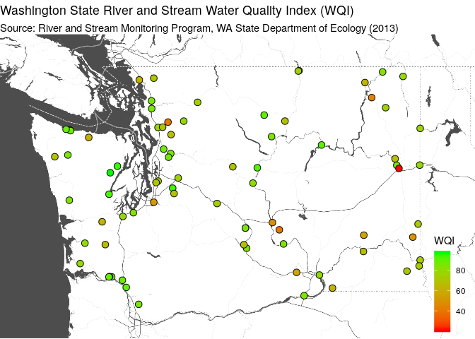

## Automated Data Extraction from HTML

Today's example demonstrates these objectives:

* Use a public data freely available on web pages.
* Automate data processing from start to finish (importing to reporting).
* Use "web scraping" techniques to extract data from web pages (HTML).
* Create functions to modularize code and facilitate automation.
* Use "regular expressions" to match patterns and filter data.
* Read from locally-cached data files to avoid needlessly repeating downloads.
* Use "literate programming" to provide a reproducable report.
* Use a consistent coding [style](https://google.github.io/styleguide/Rguide.xml).
* Share code through a public [repository](https://github.com/deohs/coders) to 
  facilitate collaboration.

We will be using the R language, but several other tools could do the job.

The code and this presentation are free to share and modify according to the 
[MIT License](https://github.com/deohs/coders/blob/master/LICENSE).

## Get data from WA Dept. of Ecology

Get all Washington Water Quality Index Scores for all available years from 
all freashwater stream and river stations from the WA Department of Ecology. 

We will extract HTML tables from multiple web pages and combine into a 
single WQI dataset. Each web page fetched represents data for one station.

Finally, we will create a map for the most recent year of data available.

Note: Data files will be cached to save time when re-running the code.

## Setup

Load packages with `pacman` to auto-install any missing packages.


```r
# Load packages.
if (! suppressPackageStartupMessages(require(pacman))) {
  install.packages('pacman', repos = 'http://cran.us.r-project.org')
}
pacman::p_load(dplyr, tidyr, rvest, mgsub, readr, purrr, ggmap)
```

We are loading:

* `dplyr` (several functions) and `tidyr` (`separate()`) for data cleanup
* `rvest` (and `xml2`) for web-scraping with `read_html()`, etc.
* `mgsub` for multiple-pattern search/replace with `mgsub()`
* `readr` for reading files with `read_csv()`
* `purrr` for `set_names()`, like `colnames()` but for use in a pipeline 
* `ggmap` (and `ggplot2`) for plotting a map of the results

## User-defined functions

We will define the following functions to facilitate automation.

`get_list_of_stations()` - Gets station list to follow when getting more data.

`get_station_details()` ... (wrapper) - Orchestrates station details collection.

* `get_station_details_ns()` - Gets XML nodeset for station details tables.
* `extract_stn_details_from_ns()` - Extracts data from tables.
* `extract_stn_qual_from_ns()` - Extracts overall station quality level.
* `clean_station_details()` - Cleans up dataset.

`get_wa_wqi_per_station()` ... (wrapper) - Orchestrates WQI data collection.

* `get_wa_wqi_table_ns()` - Gets XML nodeset for WQI data tables.
* `extract_wa_wqi_from_ns()` ... - Extracts data from tables.
   * `clean_wa_wqi_data()` - Cleans up dataset.

`create_wqi_map()` ... - Creates the map, including base map, points, legend, etc.

* `create_bbox()` - Creates boundary box for base map.

## Function: Get list of stations


```r
get_list_of_stations <- function () {
  # Get XML nodeset of table(s) of class "list" containing a list of stations.
  url <- 'https://fortress.wa.gov/ecy/eap/riverwq/regions/state.asp?symtype=1'
  xmlns <- read_html(url) %>% html_nodes("table.list")
  
  # Extract station type from img class and station ID and name from table text.
  stn_type <- xmlns %>% html_nodes("img[class $= 'sta']") %>% 
    html_attr("class") %>% mgsub(., c('Rsta', 'Dsta'), c('Long-term', 'Basin'))
  stations <- xmlns %>% html_table(fill = TRUE) %>% bind_rows() %>% .[, 2:3] %>% 
    set_names(c('Station', 'Station Name')) %>% mutate(`Station Type` = stn_type)
  return(stations)
}
```

## Function: Get station details


```r
get_station_details_ns <- function(Station = '') {
  # Get station details table XML nodeset for a station ID.
  url <- 'https://fortress.wa.gov/ecy/eap/riverwq/station.asp'
  qstr <- paste('sta=', Station, sep='')
  url <- paste(url, qstr, sep = '?')
  xmlns <- read_html(url) %>% html_nodes("table")
  return(xmlns)
}
```

## Function: Extract station details


```r
extract_stn_details_from_ns <- function(xmlns) {
  # Get station details from two tables and combine them.
  lst <- xmlns %>% 
    html_nodes(xpath='.//table[contains(@width, "396")]') %>% 
    html_table(fill = TRUE, header = TRUE)
  df <- bind_cols(lst[[1]][1,], lst[[2]][1,])
  names(df) <- gsub('\\W', '.', names(df))
  df$LLID <- as.character(df$LLID)
  df$`waterbody.id` <- as.character(df$`waterbody.id`)
  return(df)
}
```

## Function: Extract station quality


```r
extract_stn_qual_from_ns <- function(xmlns) {
  # Get station overall water quality text comment from table XML nodeset.
  stn_qual <- xmlns %>% 
    html_nodes(xpath='.//td[contains(@align, "center")]') %>% 
    html_text()
  stn_qual <- grep('Overall water quality', stn_qual, value = TRUE)
  return(stn_qual)
}
```

## Function: Clean station details


```r
clean_station_details <- function(df) {
  # Rename variables. Force longitude to be negative. Split overall quality.
  df <- df %>% rename('lat' = 'latitude', 'lon' = 'longitude') %>% 
    mutate(lon = ifelse(lon > 0, -lon, lon)) %>% 
    mutate(overall.quality = gsub('^.* (\\w+) concern.*water-year (\\d+).*$', 
                                  '\\1,\\2', overall.quality)) %>% 
    separate(overall.quality, c('quality.level', 'quality.year'), ',', 
             convert = TRUE, remove = FALSE) %>% 
    select(-map.detail)
  names(df) <- gsub('[.]+', '.', names(df))
  return(df)
}
```

## Function: Get station details (wrapper)


```r
get_station_details <- function(Station = '') {
  col_names <- c("type", "Ben.Use", "uwa", "ecoregion", "county", "contact", 
                 "lat", "lon", "LLID", "Route.Measure", "river.mile", "substrate", 
                 "flow", "gaging", "mixing", "elevation", "surrounding", 
                 "waterbody.id", "location.type", "overall.quality", 
                 "quality.level", "quality.year", "Station")
  
  # Get station details table XML nodeset for a station ID.
  xmlns <- get_station_details_ns(Station = Station)
  
  # Extract station details from table nodeset.
  df <- extract_stn_details_from_ns(xmlns)
  
  # Add a variable for the note about overall water quality.
  stn_qual <- extract_stn_qual_from_ns(xmlns)
  df$overall.quality <- ifelse(length(stn_qual) > 0, stn_qual, NA)
  
  # Add a variable for the station.
  df$Station <- Station
  
  # Clean up station details data frame.
  df <- clean_station_details(df)
  return(df[, col_names])
}
```

## Function: Clean WA WQI data


```r
clean_wa_wqi_data <- function(df) {
  # Use first row as column names
  df_col_names <- c('year', df[1, -1])
  df_col_names <- gsub('[^A-Za-z0-9_.]', '.', df_col_names)
  names(df) <- df_col_names
  
  # Remove rows missing the year and columns missing a column name.
  df <- df[grepl('^\\d{4}$', df$year), df_col_names[df_col_names != '']]
  
  # Add missing variables with NA values.
  if (!'overall.WQI' %in% names(df)) df$overall.WQI <- NA
  if (!'adjusted.for.flow' %in% names(df)) df$adjusted.for.flow <- NA
  
  # Convert all values to numeric.
  df <- suppressWarnings(
    mutate_all(df, function(x) as.numeric(as.character(x))))
  return(df)
}
```

## Function: Get WA WQI table


```r
get_wa_wqi_table_ns <- function(Station = '') {
  # Fetch web page.
  url <- 'https://fortress.wa.gov/ecy/eap/riverwq/station.asp'
  query <- list(theyear = '', tab = 'wqi', scrolly = 262, wria = 03, 
                sta = Station)
  qstr <- paste(names(query), query, sep = "=", collapse = "&")
  pg <- read_html(paste(url, qstr, sep = '?'))
  
  # Extract year of most recent data. To be used for pages with only one year.
  text.year <- pg %>% html_nodes(xpath = "//ol/li/a") %>% html_text()
  year <- as.numeric(gsub('^.*(\\d{4}).*$', '\\1', text.year))[1]
  
  # Attempt to get one or more "twocolumn" tables from the page.
  xmlns <- pg %>% html_nodes("table.twocolumn")
  return(list(xmlns, year))
}
```

## Function: Extract WA WQI


```r
extract_wa_wqi_from_ns <- function(xmlns, Station = '', year = NA, col_names = c()) {
  if (length(xmlns) == 0) {
    # Create an empty data frame if no matching table was found.
    mat <- matrix(ncol = length(col_names), nrow = 0)
    class(mat) <- 'numeric'
    df <- setNames(data.frame(mat), col_names)
  } else {
    # Select the "twocolumn" table containing WQI and convert to a data frame.
    if (length(xmlns) > 1) {
      lst <- xmlns %>% `[`(2) %>% html_node("table") %>% html_table(fill = TRUE)
    } else {
      if (length(xmlns) == 1) {
        lst <- xmlns %>% html_node("table") %>% html_table(fill = TRUE)
        lst[[1]] <- rbind(data.frame(
          X1 = '', X2 = year, stringsAsFactors = FALSE), lst[[1]])
      }
    }
    
    # Convert to a data frame, clean up, and add station ID column.
    df <- as.data.frame(t(lst[[1]]), row.names=FALSE, stringsAsFactors=FALSE)
    df <- clean_wa_wqi_data(df)
    df$Station <- Station
  }
  return(df)
}
```

## Function: Get WA WQI (wrapper)


```r
get_wa_wqi_per_station <- function(Station = '') {
  # Define column names to be returned in resulting data frame.
  col_names <- c('year', 'fecal.coliform.bacteria', 'oxygen', 'pH', 
                 'suspended.solids', 'temperature', 'total.persulf.nitrogen', 
                 'total.phosphorus', 'turbidity', 'overall.WQI', 
                 'adjusted.for.flow', 'Station')
  
  # Get table XML nodeset WA WQI data for a station.
  lst <- get_wa_wqi_table_ns(Station)
  
  # Extract data from nodeset and clean up.
  df <- extract_wa_wqi_from_ns(lst[[1]], Station = Station, year = lst[[2]], 
                               col_names = col_names)
  
  # Return the data frame with the columns in a consitent order.
  return(df[, col_names])
}
```

## Function: Create bounding box


```r
# Create a bounding box for the map.
create_bbox <- function(lat, lon, pad = 0.15) {
  height <- max(lat) - min(lat)
  width <- max(lon) - min(lon)
  bbox <- c(
    min(lon) - pad * width,
    min(lat) - pad * height,
    max(lon) + pad * width,
    max(lat) + pad * height
  )
  names(bbox) <- c('left', 'bottom', 'right', 'top')
  return(bbox)
}
```

## Function: Create WA WQI map


```r
# Create a ggmap for a year given a data frame with lat, lon, and WQI.
create_wqi_map <- function(df, year) {
  if (all(c('lon', 'lat', 'overall.WQI') %in% names(df))) {
    # Define a boundary box and make a map base layer of "Stamen" tiles.
    bbox <- create_bbox(df$lat, df$lon)
    map <- suppressMessages(
      get_stamenmap(bbox, zoom = 8, maptype = "toner-background"))
    
    # Make the map image from the tiles using `ggmap` and add points, legend, etc.
    g <- ggmap(map, darken = c(0.3, "white")) + theme_void() 
    g <- g + geom_point(aes(x = lon, y = lat, fill = overall.WQI), 
                        data = df, pch = 21, size = 3) + 
      scale_fill_gradient(name = "WQI", low = "red", high = "green") + 
      ggtitle(label = paste("Washington State", 
                            "River and Stream Water Quality Index (WQI)"),
              subtitle = paste0("Source: River and Stream Monitoring Program, ", 
                               "WA State Department of Ecology (", year, ")")) +
      theme(legend.position = c(.98, .02), legend.justification = c(1, 0)) 
    return(g)
  } else {
    warning("Missing required variables in df passed to create_wqi_map().")
  }
}
```

## Using the functions: Get stations


```r
# Define variables.
data_dir <- 'data'

# Create data folder if it does not exist.
dir.create(data_dir, showWarnings = FALSE)

# Get list of stations. Use a cached data file, if present.
file_name <- file.path(data_dir, 'stations_primary.csv')
if (!file.exists(file_name)) {
  stations <- get_list_of_stations()
  write.csv(stations, file_name, row.names = FALSE)
} else {
  stations <- suppressMessages(read_csv(file_name))
}
```

## Using the functions: Get station details


```r
# Get station details for all stations. Use a cached data file, if present.
file_name <- file.path(data_dir, 'station_details_primary.csv')
if (!file.exists(file_name)) {
  station_details <- bind_rows(lapply(stations$Station, get_station_details))
  write.csv(station_details, file_name, row.names = FALSE)
} else {
  station_details <- read_csv(file_name) %>% 
    mutate(LLID = as.character(LLID),
           `waterbody.id` = as.character(`waterbody.id`))
}
```

```
## Parsed with column specification:
## cols(
##   .default = col_character(),
##   lat = col_double(),
##   lon = col_double(),
##   LLID = col_double(),
##   Route.Measure = col_double(),
##   river.mile = col_double(),
##   quality.year = col_double()
## )
```

```
## See spec(...) for full column specifications.
```

## Using the functions: Get WQI data


```r
# Get WQI data for all stations. Use a cached data file, if present.
file_name <- file.path(data_dir, 'wa_wqi_primary.csv')
if (!file.exists(file_name)) {
  wa_wqi <- bind_rows(lapply(stations$Station, get_wa_wqi_per_station))
  write.csv(wa_wqi, file_name, row.names = FALSE)
} else {
  wa_wqi <- read_csv(file_name)
}
```

```
## Parsed with column specification:
## cols(
##   year = col_double(),
##   fecal.coliform.bacteria = col_double(),
##   oxygen = col_double(),
##   pH = col_double(),
##   suspended.solids = col_double(),
##   temperature = col_double(),
##   total.persulf.nitrogen = col_double(),
##   total.phosphorus = col_double(),
##   turbidity = col_double(),
##   overall.WQI = col_double(),
##   adjusted.for.flow = col_double(),
##   Station = col_character()
## )
```

## Prepare data for plotting


```r
# Prepare dataset for plotting. Join with station details to get lat and lon.
wa_wqi <- wa_wqi %>% 
  inner_join(station_details %>% select(Station, lat, lon), by = 'Station')

#Use the most recent year of WQI data available.
#map_year <- max(wa_wqi$year)

# Use 2013 for comparison with datasets from data.gov.
map_year = 2013

# Filter dataset by year. 
df <- wa_wqi %>% filter(year == map_year)
```

## Plot the data as a map


```r
# Create a map from lon, lat, and overall.WQI variables in df for map_year.
g <- create_wqi_map(df, map_year)
```

## View the map

<!-- -->
