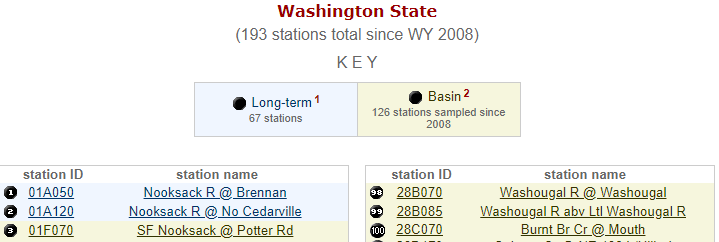

```{r header, include=FALSE}
# Filename: get_wa_wqi_stations.Rmd
# Copyright (c) University of Washington
# License: MIT https://opensource.org/licenses/MIT (See LICENSE file.)
# Repository: https://github.com/deohs/coders
```

```{r setup, include=FALSE}
knitr::opts_chunk$set(echo = TRUE)
```

```{r get_template, include=FALSE}
# Copy template from package folder to work around Pandoc bug on Windows.
# If file is missing from template_dir, then first rendering attempt may fail.
template_pkg <- file.path(system.file(package = 'rmarkdown'), 
                          'rmd', 'ioslides', 'default.html')
if (.Platform$OS.type == "windows" & length(grep(' ', template_pkg) > 0)) { 
  template_dir <- file.path('..', '..', '..', 'templates')
  dir.create(template_dir, showWarnings = FALSE)
  template_loc <- file.path(template_dir, 'ioslides_template.html')
  if (!file.exists(template_loc)) {
    file.copy(template_pkg, template_loc, copy.mode = FALSE)
  }
}
```

## Extracting Data from Web Pages

Today's example demonstrates these objectives:

* Use a public data freely available on web pages.
* Automate data processing from start to finish (importing to reporting).
* Use "web scraping" techniques to extract data from web pages.
* Create functions to modularize code and facilitate automation.
* Use "regular expressions" to match patterns and filter data.
* Use "literate programming" to provide a reproducable report.
* Use a consistent coding [style](https://google.github.io/styleguide/Rguide.xml).
* Share code through a public [repository](https://github.com/deohs/coders) to 
  facilitate collaboration.

We will be using the R language, but several other tools could do the job.

The code and this presentation are free to share and modify according to the 
[MIT License](https://github.com/deohs/coders/blob/master/LICENSE).

## WA WQI Station List

We would like to obtain a dataset containing a complete list of WA WQI stations.

We will extract the WA WQI [station list](https://fortress.wa.gov/ecy/eap/riverwq/regions/state.asp?symtype=1) 
from a web page. The web page lists the stations in two columns, with `station ID` 
and `station name`. The `station ID` value is a hyperlink to a station details 
page for each station. There is also a legend with a color-coded key for 
`station type`. We want to extract the tabular data including the 
`station type` ("Long-term" or "Basin"), and a `url` column for 
the hyperlink (web address).



## Setup

Load packages with `pacman` to auto-install any missing packages.

```{r}
# Load packages.
if (! suppressPackageStartupMessages(require(pacman))) {
  install.packages('pacman', repos = 'http://cran.us.r-project.org')
}
pacman::p_load(dplyr, rvest, readr)
```

We are loading:

* `dplyr` for `bind_rows()`, `bind_cols()` and `inner_join()`
* `rvest` for `read_html()`, `html_nodes()`,  `html_table()`, `html_attr()` and `html_text()`
* `readr` for `read_csv()`

## Function: get_station_list()

Define a function to get the station list.

```{r}
get_station_list <- function() {
  # Get the list of stations in a web page from an HTML table of class "list".
  url <- 'https://fortress.wa.gov/ecy/eap/riverwq/regions/state.asp?symtype=1'
  xmlns <- read_html(url) %>% html_nodes("table.list")
  df <- xmlns %>% html_table(fill = TRUE) %>% bind_rows() %>% 
        as_tibble(.name_repair = 'universal') %>% select(2, 3)
  
  # Get links of class ending with 'sta' and remove duplicates (even-numbered).
  links <- xmlns %>% html_nodes("a[class $= 'sta']")
  links <- links[c(TRUE, FALSE)]
  
  # Extract variables from links: station ID, type and URL.
  type <- ifelse(links %>% html_attr('class') == 'Rsta', 'Long-term', 'Basin')
  url <- links %>% html_attr('href')
  station.ID <- links %>% html_text()
  df.extra <- bind_cols(station.ID = station.ID, type = type, url = url)
  
  # Join extra variables with station.ID and station.name by station.ID.
  return(inner_join(df, df.extra, by = 'station.ID'))
}
```

## Function: load_station_list()

Define a function to read the data from a file, if present, or extract it from
the web if not.

```{r}
load_station_list <- function(data_dir = 'data', data_file = 'stations.csv') {
  # Get list of stations. Use a cached data file, if present.
  data_file <- file.path(data_dir, data_file)
  if (file.exists(data_file)) {
    stations <- read_csv(data_file)
  } else {
    stations <- get_station_list()
    dir.create(data_dir, showWarnings = FALSE)
    write.csv(stations, data_file, row.names = FALSE)
  }
  return(stations)
}
```

## Examine the station list

We can compare the number of rows with the number of stations listed on the 
web page (193 as of June 2019). Compare the number of Basin and Long-term 
stations with the numbers listed (126 and 67, respectively, as of June 2019).

```{r}
stations <- suppressMessages(as_tibble(load_station_list()))
print(stations, n = 4)
table(stations$type)
```

## Exercises

1. This was a lot of work just to parse one web page. When would this technique 
   be worth the effort? Describe a few scenarios.
2. Find a way to extract the color-code key from the web page. This will allow 
   us to avoid hard-coding this information into our script. The benefit is 
   that a change in the `class` names of the table elements would not break 
   our script. Web scraping is fragile in that a small change to a web page
   can completely break your ability to extact data. Why would this matter once 
   you have obtained your data? Why would we care about future changes to the page?
3. Find an alternate way to extract the station data from the station list web 
   page using different CSS selectors, xpath expressions, or a different approach 
   to combining the variables. Compare your results to the method provided using 
   the `identical()` function or a similar method. Explain any mismatches.

## Advanced Exercises

1. Compare the station lists between those used in [get_wa_wqi.Rmd](get_wa_wqi.Rmd) 
   and [get_wa_wqi_alt.Rmd](get_wa_wqi_alt.Rmd) examples, where we read in two 
   different datasets and plotted 2013 WA WQI on a state map. Merge the datasets 
   from those examples with the station list of this example and use the `table` 
   function to compare the numbers of stations of each type represented in those 
   WQI datasets. Find the differences in the stations lists with the `setdiff()` 
   function or similar. List the station names of those present in one dataset
   but missing from the other, and vice-versa, using the `filter()` function and 
   the `%in%` operator or a similar approach. (Datasets are 
   [wa_wqi.csv](data/wa_wqi.csv) and [wa_wqi_alt.csv](data/wa_wqi_alt.csv).)
2. Write a function to read the station details for a specific station from the 
   station URL we obtained from the station list. Use a looping method (either 
   sapply, lapply, etc. or a for-loop, etc.) to get all station details from all
   stations and combine them into a single dataset. Write a function to load this 
   from a file if present or from the web if not, as we did for the station list.
   Compare the station types from the station list with those reported in the 
   individual station details pages to make sure they match.
