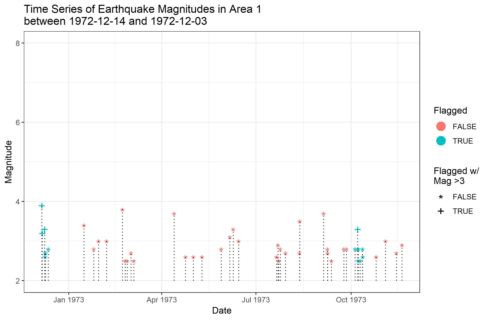

```{r setup, include=FALSE}
knitr::opts_chunk$set(echo = FALSE)
```

## Getting Started
-We need to install "ggplot2" in order to use ggplot

-We will also be useing "dplyr" for some data manipulation
```{r, message=FALSE,echo=TRUE}
if(! "ggplot2" %in% row.names(installed.packages())){
  install.packages("ggplot2")
}
if(! "dplyr" %in% row.names(installed.packages())){
  install.packages("dplyr")
}
library(ggplot2)
library(dplyr)
```

## Data
-We will use the dataset "avgs" which contains earthquake events in the PNW.

-"quakes" will be used for excercises

```{r, echo = TRUE}
quakes <- read.csv("earthquakes_ggplot_demo.csv", stringsAsFactors = FALSE) %>% 
  mutate(magGroup = as.factor((mag > 3) + (mag > 4))) %>% 
  mutate(date = as.Date(regmatches(time, regexpr("\\d{4}-\\d{2}-\\d{2}", time)))) %>% 
  arrange(magGroup) %>% select(date, latitude, longitude, depth, mag, mag, nst, gap,
    horizontalError, depthError, magError, magGroup)
avgs <- quakes %>% 
  select(depth, mag, depthError, magGroup) %>% 
  group_by(magGroup) %>% summarize_if(is.numeric, list(~mean(., na.rm = TRUE))) %>% 
  arrange(magGroup)
head(avgs)
```

## Advantages to ggplot

- _**Much more customizable than base R graphing functions**_
- Automation of different aspects such as legend generation
- More robust in its handeling of NAs and missing data
- The ability to save your plots as objects

```{r, out.width= "70%", out.height="70%"}

```

## ggplot Structure

- Very Similar to dplyr
    - "+" replaces "%>%"
- "ggplot()" is the basis of the plot
- Add geoms to give the graph what you actually want
- Miscelaneous functions help customize the plot to your needs

## ggplot()

- ggplot() creates the space in which the plot is created
- all parts of your graph are "added" to ggplot()
- Common Parameters
    - data - The data for your plot
    - aes() - Set inheritable aestetic traits for your graph
    
## ggplot()
```{r empty, echo = TRUE}
ggplot()
```

- Right now our plot is just blank since we have not told it what to plot

## geoms

- Common geoms
    - geom_line()
    - geom_point()
    - geom_bar()
    
- geoms are what actually make up your plot

- Multiple geoms can be added to the same plot
    - The first geom added will be the bottom layer

## geoms
```{r geoms, echo = TRUE}
ggplot() +
  geom_bar() +
  geom_errorbar()
```

-Our plot is still blank since we have not given it any data


## Aesthetics

- Denoted by aes()
- Aesthetics are used to define how your geoms should look
    - Set the x, and y, positions 
    - Other common variables
        - size
        - color
        - shape
- Anything that is not defined by a variable can be set outside of the aesthetics

## Aesthetics
```{r aesth-1, message=FALSE, echo = TRUE}
ggplot() +
  geom_bar(aes(x = avgs$magGroup, y = avgs$depth), stat = "identity") +
  geom_errorbar(aes(x = avgs$magGroup, ymin = avgs$depth - avgs$depthError, 
                    ymax = avgs$depth + avgs$depthError))
```

## Aesthetics

-There's a better way to write this!
```{r aesth-2, message = FALSE, echo=TRUE}
ggplot(data = avgs, aes(x = magGroup)) +
  geom_bar(aes(y = depth), stat = "identity") +
  geom_errorbar(aes(ymin = depth - depthError, ymax = depth + depthError))
```

## Non-Essential Aesthetics

- Aesthetics that vary based on the data go inside aes()
    - aes(x = magGroup, y = depth, fill = magGroup)
- Static aesthetics go inside the geom, but outside the aes().
    - geom_histogram(aes(x = magGroup, y = depth), fill = "red")
- Easiest way to add axis labels or a title is through labs()
    - Add labs as if it were another geom
    - labs(x = "Magnitude Group", y = "Depth", main = "Depth vs. Magnitude Group")
  
## Non-Essential Aesthetics
```{r non-ess-aesth, message=FALSE, echo=TRUE}
ggplot(data = avgs, aes(x = magGroup)) +
  geom_bar(aes(y = depth), stat = "identity", fill = "skyblue", color = "black") +
  geom_errorbar(aes(ymin = depth - depthError, ymax = depth + depthError), 
                width = .4, color = "orange", size = 1.5) +
  scale_x_discrete(labels = c("Low Magnitude", "Medium Magnitude", "High Magnitude")) +
  labs(x = "Magnitude Group", y = "Depth (km)") + 
  ggtitle("Average Depth by Magnitude Group") +
  theme_bw()
```

## Exercises

1. Using the "quakes" dataset, create a scatterplot of magnitude against depth. Create a title, axis labels and assign a new color to the points.

```{r e1, message = FALSE, include = FALSE}
ggplot(data = quakes, aes(x = mag, y = depth)) +
  geom_point(col = "blue") +
  labs(x = "Magnitude", y = "Depth (km)", title = "PNW Earthquakes Magnitude vs. Depth") +
  theme_bw()
```

2. On the same graph, vary a point's color base on its Magnitude Group. Be sure to also modify the legend.

```{r e2, message= FALSE,  include = FALSE}
ggplot(data = quakes, aes(x = mag, y = depth, col = magGroup)) +
  geom_point() +
  labs(x = "Magnitude", y = "Depth (km)", title = "PNW Earthquakes Magnitude vs. Depth", col = "Magnitude Group") +
  scale_color_discrete(labels = c("Low Magnitude", "Medium Magnitude", "High Magnitude")) +
  theme_bw()
```

3. Suppose we want to emphasize the point for which we are most confident about the magnitude accuracy. Make the opacity of the point proportional to the magnitude error. If you can, remove the legend for opacity.

```{r e3, message = FALSE, include = FALSE}
ggplot(data = quakes, aes(x = mag, y = depth, col = magGroup, alpha = 1 - (magError / max(magError, na.rm = TRUE)))) +
  geom_point() +
  labs(x = "Magnitude", y = "Depth (km)", title = "PNW Earthquakes Magnitude vs. Depth", col = "Magnitude Group") +
  scale_color_discrete(labels = c("Low Magnitude", "Medium Magnitude", "High Magnitude")) +
  scale_alpha(guide = "none") +
  theme_bw()
```

4. *Challenge* Recreate the \"lollipop\" graph from the beginning of the presentation. Make the color the magnitude group, and come up with your own variable for the shape. Note: the y axis must be in the range [2,8], the title should include the date range of included earthquakes
```{r e4, message = FALSE, include = FALSE}
#Note, I chose the color to represent a latitude >= or < -122. 
ggplot(data = quakes, aes(x = date, y = mag)) +
  geom_point(aes(col = magGroup, shape = longitude >= -122), size = 5) +
  scale_shape_manual(values = c("*", "+")) +
  geom_segment(aes(xend = date, y = 2, yend = mag), linetype = "dotted") +
  ylim(2, 8) +
  labs(x = "Date", y = "Magnitude", color = "Magnitude Group", shape = "Longitude >= -121") +
  ggtitle(paste0("Time Series of Earthquake Magnitudes\nbetween ",  min(quakes$date)," and ", max(quakes$date))) +
  scale_color_discrete(labels = c("Low Magnitude", "Medium Magnitude", "High Magnitude")) +
  theme_bw()
```

```{r eExtra, echo=TRUE}
head(quakes, n = 2)
```