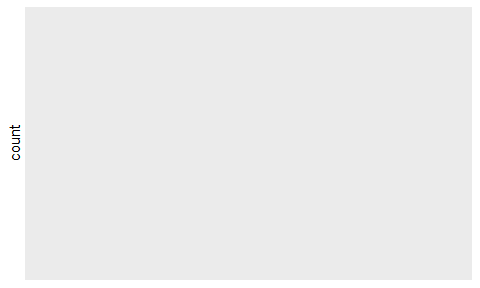
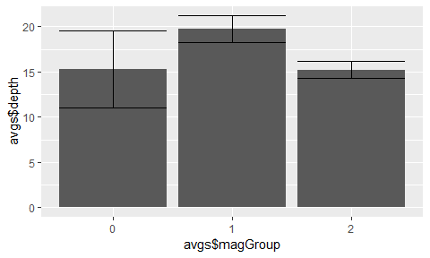
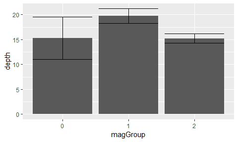
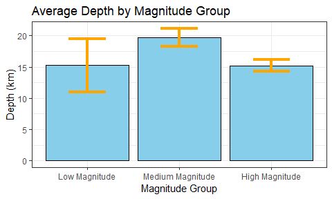

## Getting Started

```r
if(! "ggplot2" %in% row.names(installed.packages())){
  install.packages("ggplot2")
}
library(ggplot2)
```

-We will use the "diamonds" dataset that comes with ggplot2


```r
head(diamonds)
```

```
## # A tibble: 6 x 10
##   carat cut       color clarity depth table price     x     y     z
##   <dbl> <ord>     <ord> <ord>   <dbl> <dbl> <int> <dbl> <dbl> <dbl>
## 1 0.23  Ideal     E     SI2      61.5    55   326  3.95  3.98  2.43
## 2 0.21  Premium   E     SI1      59.8    61   326  3.89  3.84  2.31
## 3 0.23  Good      E     VS1      56.9    65   327  4.05  4.07  2.31
## 4 0.290 Premium   I     VS2      62.4    58   334  4.2   4.23  2.63
## 5 0.31  Good      J     SI2      63.3    58   335  4.34  4.35  2.75
## 6 0.24  Very Good J     VVS2     62.8    57   336  3.94  3.96  2.48
```

## Advantages to ggplot

- _**Much more customizable than base R graphing functions**_
- Automation of different aspects such as legend generation
- More robust in its handeling of NAs and missing data
- The ability to save your plots as objects


## ggplot Structure

- Very Similar to dplyr
    - "+" replaces "%>%"
- "ggplot()" is the basis of the plot
- Add geoms to give the graph what you actually want
- Miscelaneous functions help customize the plot to your needs

## ggplot()

- ggplot() creates the space in which the plot is created
- all parts of your graph are "added" to ggplot()
- Common Parameters
    - data - The data for your plot
    - aes() - Set inheritable aestetic traits for your graph
    
## ggplot()

```r
ggplot()
```

<!-- -->

- Right now our plot is just blank since we have not told it what to plot

## geoms

- Common geoms
    - geom_line()
    - geom_point()
    - geom_bar()
    
- geoms are what actually make up your plot

- Multiple geoms can be added to the same plot
    - The first geom added will be the bottom layer

## geoms

```r
ggplot() +
  geom_histogram() +
  geom_density()
```

<!-- -->

-Our plot is still blank since we have not given it any data


## Aesthetics

- Denoted by aes()
- Aesthetics are used to define how your geoms should look
    - Set the x, and y, positions 
    - Other common variables
        - size
        - color
        - shape
- Anything that is not defined by a variable can be set outside of the aesthetics

## Aesthetics

```r
ggplot() +
  geom_histogram(aes(x = diamonds$carat, y = ..density..)) +
  geom_density(aes(x = diamonds$carat))
```

<!-- -->

## Aesthetics

-There's a better way to write this!

```r
ggplot(data = diamonds, aes(x = carat)) +
  geom_histogram(aes(y = ..density..)) +
  geom_density()
```

<!-- -->


## Non-Essential Aesthetics

- Aesthetics that vary based on the data go inside aes()
    - aes(x = diamonds$carat, y = ..density.., fill = ..density..)
- Static aesthetics go inside the geom, but outside the aes().
    - geom_histogram(aes(x = diamonds$carat, y = ..density), fill = "red")
- Easiest way to add axis labels or a title is through labs()
    - Add labs as if it were another geom
    -labs(x = "Carat", y = "Density", main = "Density of Diamond Carats")
  
## Non-Essential Aesthetics

```r
ggplot(data = diamonds, aes(x = carrat)) +
  geom_histogram(aes(x = carat, y = ..density..), 
                 fill = "purple", col = "black") +
  geom_density(aes(x = carat), size = 1, col = "blue") +
  labs(x = "Carat", y = "Density", title = "Density of Diamonds' Carats") +
  theme_bw()
```

<!-- -->

## Exercises

1. Create a scatterplot of price against carat. Make it look nice, that is, create a title, axis labels and assign a new color.


2. Modify the scatterplot such that the color of the points is linked to the cut. If you can, modify the legend labels so that they look a little nicer than the default.


3. There seems to be a little problem with overplotting; change the opacity of the points so that we can get a better idea of where the major point clusters are located.


4. **Challenge** Adjust the color scheme of the points, to something you prefer more than the current one.

