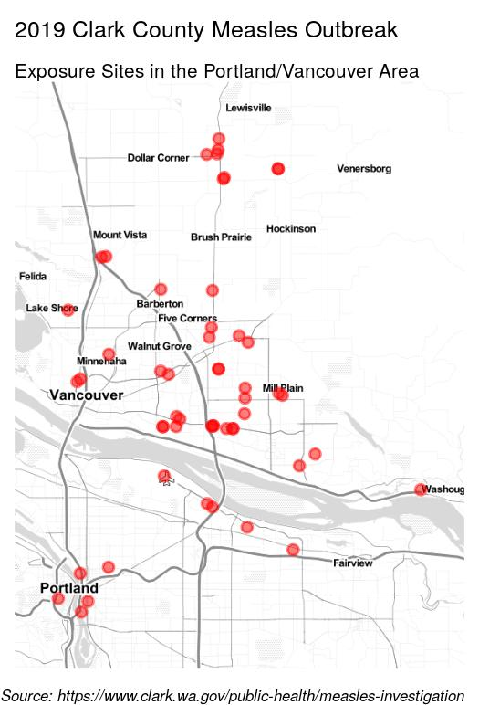
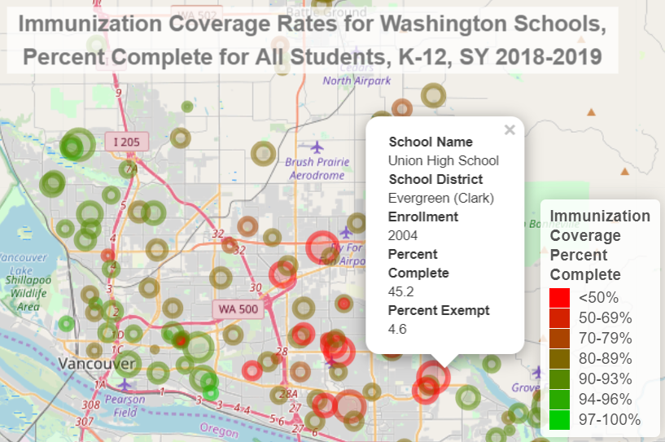

  
  ```{r header, include=FALSE}
# Filename: wa_measles_outbreak_2019.Rmd
# Copyright (c) University of Washington
# License: MIT https://opensource.org/licenses/MIT (See LICENSE file.)
# Repository: https://github.com/deohs/coders
```

```{r setup, include=FALSE}
knitr::opts_chunk$set(echo = TRUE)
```

```{r get_template, include=FALSE}
# Copy template from package folder to work around Pandoc bug on Windows.
# If file is missing from template_dir, then first rendering attempt may fail.
template_pkg <- file.path(system.file(package = 'rmarkdown'), 
                          'rmd', 'ioslides', 'default.html')
if (.Platform$OS.type == "windows" & length(grep(' ', template_pkg) > 0)) { 
  template_dir <- file.path('..', '..', '..', 'templates')
  dir.create(template_dir, showWarnings = FALSE)
  template_loc <- file.path(template_dir, 'ioslides_template.html')
  if (!file.exists(template_loc)) {
    file.copy(template_pkg, template_loc, copy.mode = FALSE)
  }
}
```

## Mapping with R

Today's example demonstrates these objectives:

* Use various packages in R to create static and interactive maps.
* Use an API key to use Google's geocoding API.
* Use public datasets freely available on the web.
* Use "web scraping" techniques to extract data.
* Use "literate programming" to provide a reproducable report.
* Use a consistent coding [style](https://google.github.io/styleguide/Rguide.xml).
* Share code through a public [repository](https://github.com/deohs/coders) to 
facilitate collaboration.

The code and this presentation are free to share and modify according to the 
[MIT License](https://github.com/deohs/coders/blob/master/LICENSE).

## Washington Measles Oubreak of 2019

We will use public data to generate:

* A choropleth map showing K-12 immunization rates in WA counties.
* A map showing exposure sites involved in the outbreak.
* An interactive map showing immunization rates for all WA schools.

## Mapping with `ggplot2`

We will use `ggplot2` to plot a choropleth map of K-12 immunization coverage in 
Washington counties.


## Setup

Load packages with `pacman` to auto-install any missing packages.

```{r}
# Load packages.
if (!suppressPackageStartupMessages(require(pacman))) {
  install.packages("pacman", repos = "http://cran.us.r-project.org")
}
pacman::p_load(dplyr, tidyr, maps, ggplot2)
```

We are loading:

* `dplyr` and `tidyr` for data management
* `maps` for getting county polygons
* `ggplot2` for plotting the map

## Get and clean data

Get the K-12 immunization coverage by county for Washington State. Since this 
[data](https://www.doh.wa.gov/DataandStatisticalReports/HealthDataVisualization/SchoolImmunization/CountySchoolImmunization) 
cannot be downloaded directly from our R script, we had to get this data using 
the [School Immunization Dashboards](https://www.doh.wa.gov/DataandStatisticalReports/HealthDataVisualization/SchoolImmunization) tool hosted by the [Washington State Department of Health](https://www.doh.wa.gov) 
and save it as a CSV file.

```{r}
data_fn <- paste0('wa_state_counties_k-12_immunization_status', 
                  '_data_2018-2019.csv')
data_path <- file.path('..', 'mapping_with_ggplot2', data_fn)
wa_coverage <- read.csv(data_path, stringsAsFactors = FALSE) %>% 
  filter(State == "Washington") %>% 
  select(county = Name, Measure, Percent) %>% 
  spread(key = Measure, value = Percent) %>% 
  mutate_at(.vars = c('Complete', 'Exempt'), 
            .funs = ~as.numeric(sub('%', '', .)))
```

## Prepare data for mapping

Convert immunization percent complete variable to a factor with 5 bins. This 
will allow us to limit the number of colors showing on the map and control 
the values they represent. Since most of the counties have immunization 
rates over 75%, we will will use more bins in the high end of the range 
for better differentiation.

```{r}
wa_coverage$Complete_fct <- factor(
  cut(x = wa_coverage$Complete, 
      breaks = c(0, 75, 85, 90, 95, 100), 
      labels = c("<75%", "75%-85%", "85%-90%", "90%-95%", "95%-100%"),
      ordered_result = TRUE))
```

## Get county polygons and labels

To plot the counties, we need the polygons that define their borders. We can 
get them using the `maps` package. 

```{r}
# Get Washington counties.
counties <- map_data("county")
wa_county <- subset(counties, region == 'washington') %>%
  mutate(county = tools::toTitleCase(subregion)) %>% 
  select(long, lat, county, group) %>% 
  left_join(wa_coverage, by = 'county')
```

We also need to create a dataframe of labels with county names and their 
locations so we can label the counties on the map. The location for each label
will be the center of the county's polygon.

```{r}
# Create a dataframe for county labels.
county_names <- wa_county %>% group_by(county) %>% 
  summarise_at(.vars = c('long', 'lat'), .funs = ~ mean(range(.)))
```

## Create the choropleth map

Use `ggplot()` to combine the polygons, color them, and add labels.

```{r create_measles_choropleth}
# Plot map.
g <- ggplot() +
  geom_polygon(data = wa_county, 
               aes(x = long, y = lat, group = group, fill = Complete_fct),
               color = "gray50", alpha = 0.4) + 
  scale_fill_brewer(palette = "YlOrRd", direction = -1) + 
  geom_text(data = county_names, aes(long, lat, label = county),
            size = 2, color = "gray10") +
  coord_quickmap() + theme_void() +
  labs(x = NULL, y = NULL, fill = NULL,
       title = "School Immunization Coverage in Washington Counties",
       subtitle = "Percent complete for all students, K-12, 2018-2019",
       caption = paste("Source: School Immunization Dashboards,", 
                       "Washington State Department of Health")
  ) + theme(plot.caption = element_text(face = "italic"))
```

## Immunization Coverage in Washington

```{r show_measles_choropleth, echo=FALSE}
g
```

## Mapping with `ggmap`



We will use the `ggmap` package to create maps with detailed basemaps.

`ggmap` allows us to a few different sources for the basemap tiles.

Our first map will use the "toner-lite" tiles from the "stamen" source.

The [2019 measles outbreak in Washington](https://www.doh.wa.gov/YouandYourFamily/IllnessandDisease/Measles/Measles2019) 
affected Clark County the most, with 71 cases as of August 2019. The state total was 86.

We will plot a map of exposure sites from the [Clark County Public Health measles 
investigation of 2019](https://www.clark.wa.gov/public-health/measles-investigation). 
We will restrict the map to the Portand/Vancouver area.

## Setup

Load packages with `pacman` to auto-install any missing packages.

```{r}
# Load packages.
if (!suppressPackageStartupMessages(require(pacman))) {
  install.packages("pacman", repos = "http://cran.us.r-project.org")
}
pacman::p_load(rvest, dplyr, tidyr, maps, ggmap)
```

We are loading:

* `rvest` for web scraping
* `dplyr` and `tidyr` for data management
* `maps` for geocoding
* `ggmap` for creating the map with a detailed basemap

## Get data

We will get exposure sites from Clark County Public Health using "web scraping", 
then get the geolocations for these sites with geocoding using the Google API. 
To use the geocoding API, you need an API key from Google.

```{r}
data_fn <- file.path("..", "mapping_with_ggmap", "clark_co_measles_locations.csv")
if (!file.exists(data_fn)) {
  url <- 'https://www.clark.wa.gov/public-health/measles-investigation'
  exposure_site <- read_html(url) %>% html_nodes(".field-content") %>% 
    html_nodes("li") %>% html_text() %>% gsub('^\n', '', .) %>% 
    gsub('(?: from |\n| on | Tuesday|,? ?[0-9]+:).*', '', .) %>% 
    grep('^[0-9]|^They|^Noon|^$', ., value = TRUE, invert = TRUE)
  key_fn <- '~/google_api.key'
  if (file.exists(key_fn)) {
    register_google(key = readLines(key_fn))
    if (has_google_key()) {
      locations <- geocode(location = exposure_site)
      locations$site <- exposure_site
      write.csv(locations, data_fn, row.names = FALSE)
    }
  }
} else { locations <- read.csv(data_fn, stringsAsFactors = FALSE) }
```

## Create the map

Restrict map to the Portand/Vancouver area by removing those in Bend.

```{r create_stamen_map}
locations <- locations %>% filter(!grepl('Bend', site))

stamen_basemap <- suppressMessages(get_stamenmap(
  make_bbox(lon, lat, locations, f = .15), zoom = 10, maptype = "toner-lite"))

g <- ggmap(stamen_basemap) + 
  geom_point(mapping = aes(x = lon, y = lat), data = locations, 
             color = 'red', size = 2, alpha = 0.5) + 
  theme_void() +
  labs(x = NULL, y = NULL, fill = NULL,
       title = "2019 Clark County Measles Outbreak", 
       subtitle = "Exposure Sites in the Portland/Vancouver Area",
       caption = paste(
         "Source: https://www.clark.wa.gov/public-health/measles-investigation"
       )
  ) + theme(plot.caption = element_text(face = "italic", size = 7))
```

## Clark County Measles Outbreak

```{r show_stamen_map, echo=FALSE}
g
```

## Mapping with `leaflet`

`leaflet` is a Javascript library for making interactive maps. It can be used 
from various programming languages, including R.



We will make a leaflet map showing the location of all of the K-12 schools in 
the state. 

We will plot these as circles where the color indicates the relative 
enrollment in the school and the color indicates the immunization rate.

## Setup

Load packages with `pacman` to auto-install any missing packages.

```{r}
# Load packages.
if (!suppressPackageStartupMessages(require(pacman))) {
  install.packages("pacman", repos = "http://cran.us.r-project.org")
}
pacman::p_load(dplyr, tidyr, leaflet, htmlwidgets, htmltools)
```

We are loading:

* `dplyr` and `tidyr` for data management
* `leaflet` to create the map visualization
* `htmlwidgets` and `htmltools` to place the title on the map

## Get data

We have to download the data files manually from the [WA DoH website](https://www.doh.wa.gov/DataandStatisticalReports/HealthDataVisualization/SchoolImmunization/SchoolBuildingImmunization) 
since their site does not support automated downloads from R.

```{r}
data_fn <- file.path('..', 'mapping_with_leaflet',
      'wa_state_schools_k-12_immunization_status_data_2018-2019.csv')
wa_coverage <- read.csv(data_fn, stringsAsFactors = FALSE, check.names = FALSE)

ex_data_fn <- file.path('..', 'mapping_with_leaflet',
      'wa_state_schools_k-12_immunization_exemption_data_2018-2019.csv')
wa_ex <- read.csv(ex_data_fn, stringsAsFactors = FALSE, check.names = FALSE)
wa_ex <- wa_ex %>% mutate(Exempt = as.numeric(gsub('%', '', Percent))) %>% 
  filter(Enrollment > 0) %>% select(`School Name`, `Bldg No`, Exempt)

wa_coverage <- wa_coverage %>% 
  left_join(wa_ex, by = c('School Name', 'Bldg No')) %>%
  rename('lat' = 'Latitude', 'lon' = 'Longitude') %>% 
  select(`School Name`, `School District`, 
         Enrollment, Percent, Exempt, lat, lon) %>%
  mutate(Percent = as.numeric(gsub('%', '', Percent))) %>% 
  filter(Enrollment > 0) %>% drop_na(lat, lon)
```

## Prepare variables for plotting

When you click on a point (circle) in our `leaflet` map, we want a popup to 
show some details about the school.

```{r}
wa_coverage <- wa_coverage %>% 
  mutate(Popup = paste0(
    '<dl><dt>School Name</dt>', 
    '<dd>', `School Name`, '</dd>',
    '<dt>School_District</td>', 
    '<dd>', `School District`, '</dd>',
    '<dt>K-12 Enrollment</dt>', 
    '<dd>', Enrollment, '</dd>',
    '<dt>Percent Complete</dt>', 
    '<dd>', Percent, '</dd>',
    '<dt>Percent Exempt</dt>', 
    '<dd>', Exempt, '</dd></dl>'))
```

Cut the continuous variable "Percent complete" into bins making factor levels.

```{r}
wa_coverage$Percent_complete_fct <- 
  cut(wa_coverage$Percent, 
      c(0, 25, 50, 60, 70, 80, 85, 90, 95, 100), include.lowest = TRUE, 
      labels = c('<25', '25-50', '50-60', '60-70', '70-80', 
                 '80-85', '85-90', '90-95', '95-100'), ordered_result = TRUE)
```

## Make a map title

Leaflet makes a web visualization so we need to use some CSS and HTML to 
make the title.

```{r}
tag.map.title <- tags$style(HTML("
  .leaflet-control.map-title { 
                                 transform: translate(-50%,20%);
                                 position: fixed !important;
                                 left: 50%;
                                 text-align: center;
                                 padding-left: 10px; 
                                 padding-right: 10px; 
                                 background: rgba(255,255,255,0.75);
                                 font-weight: bold;
                                 font-size: 20px;
                                 }
                                 "))
title <- tags$div(
  tag.map.title, 
  HTML(paste("Immunization Coverage Rates for Washington Schools,<br>", 
             "Percent Complete for All Students, K-12, SY 2018-2019"))
) 
```

## Make the map

```{r}
# Assign a palette to this using colorFactor.
completeCol <-
  colorFactor(palette = colorRamp(c("red", "green3"), interpolate = "spline"),
  wa_coverage$Percent_complete_fct)

# Create the leaflet visualization.
g <- leaflet(data = wa_coverage) %>% addTiles() %>% 
  addCircleMarkers(lng = ~lon, lat = ~lat,
                   color = ~completeCol(Percent_complete_fct), 
                   popup = ~Popup,
                   radius = ~sqrt(Enrollment) * .3) %>% 
  addLegend("bottomright", pal = completeCol, values = ~Percent_complete_fct,
            title = "Immunization<br>Coverage<br>Percent<br>Complete",
            opacity = 1) %>% 
  addControl(title, position = "topleft", className="map-title")
```

## Immunization Coverage in Washington

```{r show_leaflet, echo=FALSE}
g
```

## Publishing `leaflet` maps on the web

Since `leaflet` maps are made for the web, they can be published as web pages.

```{r}
saveWidget(g, file = "wa_immunization_coverage_leaflet_map.html")
```

This has been published on a [UW staff](https://staff.washington.edu/high/wa_immunization_coverage_leaflet_map.html) page.
