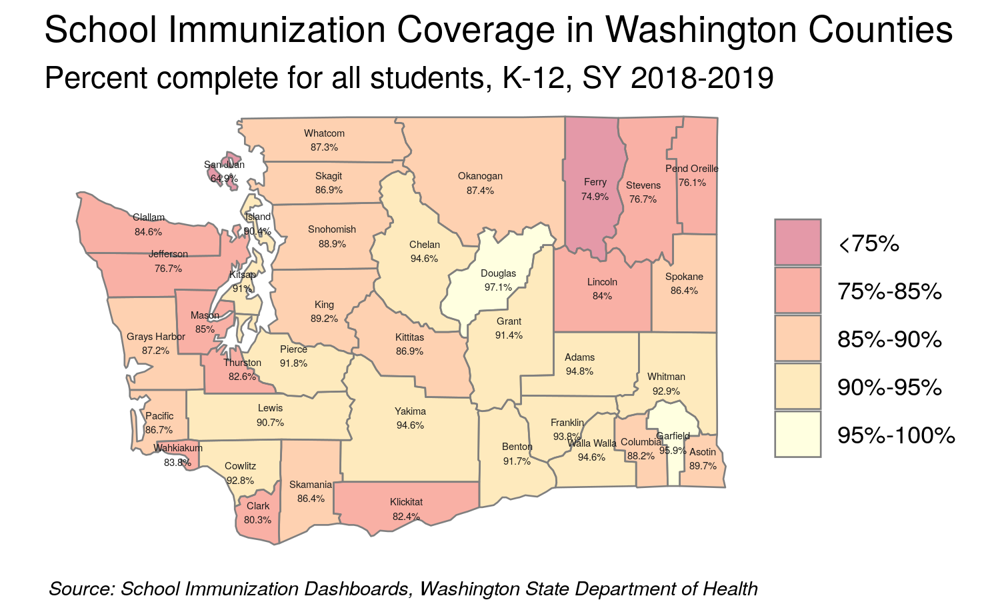

```{r header, include=FALSE}
# Filename: wa_measles_outbreak_2019.Rmd
# Copyright (c) University of Washington
# License: MIT https://opensource.org/licenses/MIT (See LICENSE file.)
# Repository: https://github.com/deohs/coders
```

```{r setup, include=FALSE}
knitr::opts_chunk$set(echo = TRUE)
```

```{r get_template, include=FALSE}
# Copy template from package folder to work around Pandoc bug on Windows.
# If file is missing from template_dir, then first rendering attempt may fail.
template_pkg <- file.path(system.file(package = 'rmarkdown'), 
                          'rmd', 'ioslides', 'default.html')
if (.Platform$OS.type == "windows" & length(grep(' ', template_pkg) > 0)) { 
  template_dir <- file.path('..', '..', '..', 'templates')
  dir.create(template_dir, showWarnings = FALSE)
  template_loc <- file.path(template_dir, 'ioslides_template.html')
  if (!file.exists(template_loc)) {
    file.copy(template_pkg, template_loc, copy.mode = FALSE)
  }
}
```

## Mapping with R

Today's example demonstrates these objectives:

* Use various packages in R to create static and interactive maps.
* Use an API key to use Google's geocoding API.
* Use shapefiles to add features to maps.
* Use web and PDF "scraping" techniques to extract data.
* Use public datasets freely available on the web.
* Use "literate programming" to provide a reproducable report.
* Use a consistent coding [style](https://google.github.io/styleguide/Rguide.xml).
* Share code through a public [repository](https://github.com/deohs/coders) to 
facilitate collaboration.

The code and this presentation are free to share and modify according to the 
[MIT License](https://github.com/deohs/coders/blob/master/LICENSE).

## Washington Measles Outbreak of 2019

In early 2019 there were a two [outbreaks](https://www.doh.wa.gov/YouandYourFamily/IllnessandDisease/Measles/Measles2019) of measles in Washington State:

* Outbreak #1: January through May with 72 confirmed cases.
* Outbreak #2: May 9th through August 28th with 14 confirmed cases.

There were also some notable responses by state and local governments:

* Clark County declared a [local public health emergency](https://www.clark.wa.gov/public-health/county-declares-public-health-emergency-due-measles-outbreak) on Jan. 18.
* The Washington governor declared a [state of emergency](https://www.governor.wa.gov/sites/default/files/proclamations/19-01%20State%20of%20Emergency.pdf) on Jan. 25.
* In May, Washington passed a [bill](https://www.doh.wa.gov/CommunityandEnvironment/Schools/Immunization/ExemptionLawChange) to limit measles vaccination exemptions.
  - Took effect on July 28th for public and private schools and daycare centers.
  - Removed the personal and philosophical exemptions for the MMR vaccine.

## Washington Measles Outbreak of 2019

Here are some [details](https://www.doh.wa.gov/YouandYourFamily/IllnessandDisease/Measles/Measles2019) about the 86 confirmed cases in the outbreaks:

* Most were in Clark County (71 cases) and King County (12 cases).
* Most were in children ages 1 to 10 (52 cases) and 11 to 18 (17 cases).
* Most had a vaccination status of "0 doses" (66) and "unknown" (11).

Here are some questions we may have about these findings:

* Were Clark County and King County especially susceptible?
* Why were children aged 1 to 10 years infected the most?

Can you think of other interesting questions? 

How can data visualization, particularly mapping, help answer these?

## Washington Measles Outbreak of 2019

Using public data, we will use mapping techniques to visualize the status of 
immunization in schools throughout the state and the outbreak exposure locations 
associated with these events. 

* A choropleth map showing school (K-12) immunization rates in WA counties.
* A map showing exposure sites involved in the measles outbreak.
* An interactive map showing immunization rates for all WA schools (K-12).
* An interactive map showing school districts, schools, and exposure sites.

## Mapping with `ggplot2`

We will use `ggplot2` to plot a choropleth map of K-12 immunization coverage in 
Washington counties.



## Setup

Load packages with `pacman` to auto-install any missing packages.

```{r}
# Load packages.
if (!suppressPackageStartupMessages(require(pacman))) {
  install.packages("pacman", repos = "http://cran.us.r-project.org")
}
pacman::p_load(dplyr, tidyr, maps, ggplot2)
```

We are loading:

* `dplyr` and `tidyr` for data management
* `maps` for getting county polygons
* `ggplot2` for plotting the map

## Get and clean data

Get the K-12 immunization coverage by county for Washington State. Since this 
[data](https://www.doh.wa.gov/DataandStatisticalReports/HealthDataVisualization/SchoolImmunization/CountySchoolImmunization) 
cannot be downloaded directly from our R script, we had to get this data using 
the [School Immunization Dashboards](https://www.doh.wa.gov/DataandStatisticalReports/HealthDataVisualization/SchoolImmunization) tool hosted by the [Washington State Department of Health](https://www.doh.wa.gov) 
and save it as a CSV file.

```{r}
data_fn <- paste0('wa_state_counties_k-12_immunization_status', 
                  '_data_2018-2019.csv')
data_path <- file.path('..', 'mapping_with_ggplot2', data_fn)
wa_coverage <- read.csv(data_path, stringsAsFactors = FALSE) %>% 
  filter(State == "Washington") %>% 
  select(county = Name, Measure, Percent) %>% 
  spread(key = Measure, value = Percent) %>% 
  mutate_at(.vars = c('Complete', 'Exempt'), 
            .funs = ~as.numeric(sub('%', '', .)))
```

## Prepare variables for plotting

Convert immunization percent complete variable to a factor with 5 bins. This 
will allow us to limit the number of colors showing on the map and control 
the values they represent. Since most of the counties have immunization 
rates over 75%, we will will use more bins in the high end of the range 
for better differentiation.

```{r}
wa_coverage$Complete_fct <- factor(
  cut(x = wa_coverage$Complete, 
      breaks = c(0, 75, 85, 90, 95, 100), include.lowest = TRUE, 
      labels = c("<75%", "75-84%", "85-89%", "90-94%", "95-100%"),
      ordered_result = TRUE))
```

## Get county polygons and labels

To plot the counties, we need the polygons that define their borders. We can 
get them using the `maps` package. 

```{r}
# Get Washington counties.
counties <- map_data("county")
wa_county <- subset(counties, region == 'washington') %>%
  mutate(county = tools::toTitleCase(subregion)) %>% 
  select(long, lat, county, group) %>% 
  left_join(wa_coverage, by = 'county')
```

We also need to create a dataframe of labels with county names and their 
locations so we can label the counties on the map. The location for each label
will be the center of the county's polygon.

```{r}
# Create a dataframe for county labels.
county_names <- wa_county %>% group_by(county) %>% 
  summarise_at(.vars = c('long', 'lat'), .funs = ~ mean(range(.)))
```

## Create the choropleth map

Use `ggplot()` to combine the polygons, color them, and add labels.

```{r create_measles_choropleth}
# Plot map.
g <- ggplot() +
  geom_polygon(data = wa_county, 
               aes(x = long, y = lat, group = group, fill = Complete_fct),
               color = "gray50", alpha = 0.4) + 
  scale_fill_brewer(palette = "YlOrRd", direction = -1) + 
  geom_text(data = county_names, aes(long, lat, label = county),
            size = 2, color = "gray10") +
  coord_quickmap() + theme_void() +
  labs(x = NULL, y = NULL, fill = NULL,
       title = "School Immunization Coverage in Washington Counties",
       subtitle = "Percent complete for all students, K-12, 2018-2019",
       caption = paste("Source: School Immunization Dashboards,", 
                       "Washington State Department of Health")
  ) + theme(plot.caption = element_text(face = "italic"))
```

## Immunization Coverage in Washington

```{r show_measles_choropleth, echo=FALSE}
g
```

## Mapping with `ggmap`


We will use the `ggmap` package to create maps with detailed basemaps.

`ggmap` offers a selection of sources and styles of basemap tiles.

Our first map will use the "toner-lite" tiles from the "stamen" source.

The [2019 measles outbreak in Washington](https://www.doh.wa.gov/YouandYourFamily/IllnessandDisease/Measles/Measles2019) 
affected Clark County the most, with 71 cases as of August 2019. The state total was 86.

We will plot a map of exposure sites from the [Clark County Public Health measles 
investigation of 2019](https://www.clark.wa.gov/public-health/measles-investigation). 
We will restrict the map to the Portand/Vancouver area.

## Setup

Load packages with `pacman` to auto-install any missing packages.

```{r}
# Load packages.
if (!suppressPackageStartupMessages(require(pacman))) {
  install.packages("pacman", repos = "http://cran.us.r-project.org")
}
pacman::p_load(rvest, dplyr, tidyr, ggmap)
```

We are loading:

* `rvest` for web scraping
* `dplyr` and `tidyr` for data management
* `ggmap` for geocoding and creating the map

## Get data

We will get exposure sites from Clark County Public Health using "web scraping", 
then get the geolocations for these sites with geocoding using the Google API. 
To use the geocoding API, you need an API key from Google.

```{r}
data_fn <- file.path("..", "mapping_with_ggmap", "clark_co_measles_locations.csv")
if (!file.exists(data_fn)) {
  url <- 'https://www.clark.wa.gov/public-health/measles-investigation'
  exposure_site <- read_html(url) %>% html_nodes(".field-content") %>% 
    html_nodes("li") %>% html_text() %>% gsub('^\n', '', .) %>% 
    gsub('(?: from |\n| on | Tuesday|,? ?[0-9]+:).*', '', .) %>% 
    grep('^[0-9]|^They|^Noon|^$', ., value = TRUE, invert = TRUE)
  key_fn <- '~/google_api.key'
  if (file.exists(key_fn)) {
    register_google(key = readLines(key_fn))
    if (has_google_key()) {
      locations <- geocode(location = exposure_site)
      locations$site <- exposure_site
      write.csv(locations, data_fn, row.names = FALSE)
    }
  }
} else { locations <- read.csv(data_fn, stringsAsFactors = FALSE) }
```

## Create the map

Restrict map to the Portand/Vancouver area by removing those in Bend.

```{r create_stamen_map}
locations <- locations %>% filter(!grepl('Bend', site))

stamen_basemap <- suppressMessages(get_stamenmap(
  make_bbox(lon, lat, locations, f = .15), zoom = 10, maptype = "toner-lite"))

g <- ggmap(stamen_basemap) + 
  geom_point(mapping = aes(x = lon, y = lat), data = locations, 
             color = 'red', size = 2, alpha = 0.5) + 
  theme_void() +
  labs(x = NULL, y = NULL, fill = NULL,
       title = "2019 Clark County Measles Outbreak", 
       subtitle = "Exposure Sites in the Portland/Vancouver Area",
       caption = paste(
         "Source: https://www.clark.wa.gov/public-health/measles-investigation"
       )
  ) + theme(plot.caption = element_text(face = "italic", size = 7))
```

## Clark County Measles Outbreak

```{r show_stamen_map, echo=FALSE}
g
```

## Mapping with `leaflet`

`leaflet` is a Javascript library for making interactive maps. It can be used 
from various programming languages, including R.


We will make a leaflet map showing the location of all of the K-12 schools in 
the state. 

We will plot these as circles where the size indicates the student enrollment 
and the color indicates the immunization coverage rate.

## Setup

Load packages with `pacman` to auto-install any missing packages.

```{r}
# Load packages.
if (!suppressPackageStartupMessages(require(pacman))) {
  install.packages("pacman", repos = "http://cran.us.r-project.org")
}
pacman::p_load(dplyr, tidyr, leaflet, htmlwidgets, htmltools, rgdal, rgeos, 
               knitr, kableExtra)
```

We are loading:

* `dplyr` and `tidyr` for data management
* `leaflet` to create the map visualization
* `htmlwidgets` and `htmltools` to add HTML titles and to sanitize data
* `rgdal` for reading and manipulating shapefiles
* `rgeos` for finding the center of a polygon
* `knitr` for table formatting with `kable()`
* `kableExtra` for specifying options for `kable()`

## Get data

We have to download the data files manually from the [WA DoH website](https://www.doh.wa.gov/DataandStatisticalReports/HealthDataVisualization/SchoolImmunization/SchoolBuildingImmunization) 
since their site does not support automated downloads from R.

```{r}
data_fn <- file.path('..', 'mapping_with_leaflet',
      'wa_state_schools_k-12_immunization_status_data_2018-2019.csv')
wa_coverage <- read.csv(data_fn, stringsAsFactors = FALSE, check.names = FALSE)

ex_data_fn <- file.path('..', 'mapping_with_leaflet',
      'wa_state_schools_k-12_immunization_exemption_data_2018-2019.csv')
wa_ex <- read.csv(ex_data_fn, stringsAsFactors = FALSE, check.names = FALSE)
wa_ex <- wa_ex %>% mutate(Exempt = as.numeric(gsub('%', '', Percent))) %>% 
  filter(Enrollment > 0) %>% select(`School Name`, `Bldg No`, Exempt)

wa_coverage <- wa_coverage %>% 
  left_join(wa_ex, by = c('School Name', 'Bldg No')) %>%
  rename('lat' = 'Latitude', 'lon' = 'Longitude') %>% 
  select(`School Name`, `School District`, County, 
         Enrollment, Percent, Exempt, lat, lon) %>%
  mutate(Percent = as.numeric(gsub('%', '', Percent))) %>% 
  filter(Enrollment > 0) %>% drop_na(lat, lon)

# Manually set coordinates for school records with errors.
wa_coverage[grepl('Tukes Valley Middle School', wa_coverage$`School Name`), 
            c('lat', 'lon')] <- c(45.772453, -122.495864)
```

## Prepare variables for plotting

When you click on a point (circle) in our `leaflet` map, we want a popup to 
show some details about the school. 

```{r}
wa_coverage <- wa_coverage %>% mutate(Popup = paste0('<dl>', 
    '<dt>', 'School Name', '</dt><dd>', htmlEscape(`School Name`), '</dd>',
    '<dt>', 'School District', '</dt><dd>', htmlEscape(`School District`), '</dd>',
    '<dt>', 'Enrollment', '</dt><dd>', htmlEscape(`Enrollment`), '</dd>',
    '<dt>', 'Percent Complete', '</dt><dd>', htmlEscape(`Percent`), '</dd>',
    '<dt>', 'Percent Exempt', '</dt><dd>', htmlEscape(`Exempt`), '</dd>', '</dl>'))
```

When you "hover" over a school circle, show a small popup "tooltip" with the 
school name and immunization rate.

```{r}
wa_coverage <- wa_coverage %>% 
  mutate(label = paste0(`School Name`, ': ', Percent, '%'))
```

Cut the continuous variable "Percent complete" into bins making factor levels.

```{r}
wa_coverage$Pct <- 
  cut(wa_coverage$Percent, c(0, 50, 70, 80, 90, 94, 97, 100), include.lowest = TRUE, 
      labels = c('<50%', '50-69%', '70-79%', '80-89%', '90-93%', '94-96%', 
                 '97-100%'), ordered_result = TRUE)
```

## Make a map title

Leaflet makes a web visualization so we need to use some CSS and HTML to 
make the title.

```{r}
tag.map.title <- tags$style(HTML("
  .leaflet-control.map-title { 
                                 transform: translate(-50%,20%);
                                 position: fixed !important;
                                 left: 50%;
                                 text-align: center;
                                 padding-left: 10px; 
                                 padding-right: 10px; 
                                 background: rgba(255,255,255,0.75);
                                 font-weight: bold;
                                 font-size: 20px;
                             }
  "))

title <- tags$div(tag.map.title, 
  HTML(paste("Immunization Coverage Rates for Washington Schools,<br>", 
             "Percent Complete for All Students, K-12, SY 2018-2019"))
) 
```

## Make the map

```{r}
# Assign a palette to this using colorFactor.
pal <-
  colorFactor(palette = colorRamp(c("red", "green3"), interpolate = "spline"),
  wa_coverage$Pct)

# Create the leaflet visualization.
g <- leaflet(data = wa_coverage) %>% addTiles() %>% 
  addCircleMarkers(lng = ~lon, lat = ~lat, 
                   label = ~htmlEscape(label),
                   color = ~pal(Pct), 
                   popup = ~Popup,
                   radius = ~sqrt(Enrollment) * .3) %>% 
  addLegend("bottomright", pal = pal, values = ~Pct,
            title = "Immunization<br>Coverage<br>Percent<br>Complete",
            opacity = 1)
g1 <- g %>% addControl(title, position = "topleft", className="map-title")
```

## Immunization Coverage in Washington

```{r show_leaflet, echo=FALSE}
g1
```

## Add exposure sites

We can also add markers for the Clark County measles outbreak exposure sites.

```{r, add_markers}
title <- tags$div(tag.map.title, 
  HTML(paste("Clark County 2019 Measles Outbreak Exposure Sites<br>",
             "and K-12 Immunization Coverage, SY 2018-2019"))
)

locations <- unique(locations) %>% mutate(site = htmlEscape(site)) %>% 
  mutate(label = gsub('^([^,]*),.*$', '<b>Exposure Site:</b> \\1', site))

g2 <- g %>% addMarkers(~lon, ~lat, data = locations, group = "exposure", 
                       icon = list(iconUrl = 'biohazard.svg', 
                                   iconSize = c(20, 20)), 
                       label = ~lapply(label, HTML), 
                       labelOptions = labelOptions(
                         style = list('background-color' = 'yellow'))) %>% 
  setView(-122.5487, 45.65366, zoom = 11) %>% 
  addControl(title, position = "topleft", className="map-title")
```

## Clark County Measles Outbreak

```{r show_leaflet_add_markers, echo=FALSE}
g2
```

## Coverage by school district

It looks like many of the large, red circles are clustered together. This same 
region is where many of the exposure locations are. Let's look at immunization 
coverage by school district to see if there are any districts which stand out.

```{r}
# Create a dataframe for districts.
wa_coverage_by_dist <- wa_coverage %>% 
  mutate(`School District` = gsub('\\s+', ' ', `School District`)) %>% 
  group_by(County, `School District`) %>% 
  summarise(
    Percent = round(100 * (sum(0.01 * Percent * Enrollment)/sum(Enrollment)), 1))
kable(wa_coverage_by_dist %>% filter(County == 'Clark') %>%  arrange(Percent)) %>% 
  kable_styling(full_width = F) %>% row_spec(1, bold = T, color = "red")
```

## Get school district polygons

We can import a shapefile from [census.gov](https://www2.census.gov/geo/tiger/TIGER2019/UNSD/) 
to see which schools are in each district. We must transform the map projection 
from [NAD83](https://gisgeography.com/geodetic-datums-nad27-nad83-wgs84/) to [WGS84](https://gisgeography.com/wgs84-world-geodetic-system/) to match `leaflet`.

```{r, message=FALSE}
# Get compressed shapefile archive and etract to the "gis" folder.
shp_fn <- 'tl_2019_53_unsd.zip'
if (!file.exists(shp_fn)) {
  url <- paste0('https://www2.census.gov/geo/tiger/TIGER2019/UNSD/', shp_fn)
  download.file(url, destfile = shp_fn)
  unzip(zipfile = shp_fn, exdir = "gis")
}

# Import shapefile from the "gis" folder and view the projection string.
shapeData <- readOGR("gis", verbose = FALSE)
CRSargs(shapeData@proj4string)

# Transform shape data to the projection of the map (from NAD83 to WGS84).
# See: https://rstudio.github.io/leaflet/projections.html
shapeData <- spTransform(shapeData, CRS("+proj=longlat +datum=WGS84 +no_defs"))
```

## Prepare variables for plotting

```{r}
# Make a factor to use for fill color of polygons.
wa_coverage_by_dist$Pct <- 
  cut(wa_coverage_by_dist$Percent, 
      c(0, 50, 70, 80, 90, 94, 97, 100), include.lowest = TRUE, 
      labels = c('<50%', '50-69%', '70-79%', '80-89%', '90-93%', '94-96%', 
                 '97-100%'), ordered_result = TRUE)

# Filter to include only Clark County school districts.
wa_coverage_by_dist_clark <- wa_coverage_by_dist %>% filter(County == 'Clark')
shapeData$NAME <- gsub(' School District| Public Schools| Community Schools', 
                       '', shapeData$NAME)
shapeData_clark <- shapeData[
  shapeData$NAME %in% wa_coverage_by_dist_clark$`School District`, 'NAME']
shapeData_clark <- shapeData_clark[order(shapeData_clark$NAME), ]

# Add coverage percent and factor for color bins.
shapeData_clark$Percent <- wa_coverage_by_dist_clark$Percent 
shapeData_clark$Pct <- wa_coverage_by_dist_clark$Pct

# Create labels and popups for school districts.
centers <- data.frame(gCentroid(shapeData_clark, byid = TRUE))
centers$NAME <- paste0(shapeData_clark$NAME, ': ', shapeData_clark$Percent, '%')
```

## Add school district polygons to map

```{r}
# Create map as before, but add polygons and labels before other elements.
g3 <- leaflet(data = wa_coverage) %>% 
  setView(-122.5487, 45.65366, zoom = 11) %>% 
  addControl(title, position = "topleft", className ="map-title") %>% 
  addTiles(group = "map-detail") %>% 
  addLegend("bottomright", pal = pal, values = ~Pct,
    title = "Immunization<br>Coverage<br>Percent<br>Complete",
    opacity = 1, group = "legend") %>% 
  addPolygons(group = "districts", data = shapeData_clark, weight = 4, 
    color = 'gray', opacity = 0.4,stroke = TRUE, smoothFactor = 0.2, 
    fillOpacity = 0.3, fillColor = pal(shapeData_clark$Pct)) %>% 
  addLabelOnlyMarkers(group = "dist-labels", data = centers, lng = ~x, lat = ~y,
    labelOptions = labelOptions(textsize='12px', opacity = 0.8, noHide = TRUE, 
      direction = 'top', textOnly = FALSE), label = htmlEscape(~NAME)) %>% 
  addCircleMarkers(group = "schools", lng = ~lon, lat = ~lat, color = ~pal(Pct), 
    radius = ~sqrt(Enrollment) * .3, popup = ~Popup, label = ~htmlEscape(label)) %>% 
  addMarkers(lng = ~lon, lat = ~lat, data = locations, group = "exposure", 
    icon = list(iconUrl = 'biohazard.svg', iconSize = c(20, 20)), 
    label = ~lapply(label, HTML), labelOptions = labelOptions(
                         style = list('background-color' = 'yellow'))) %>% 
  addLayersControl(baseGroups = c("map-detail", "no-map-detail"), 
    overlayGroups = c("legend", "districts", "dist-labels", "schools", "exposure"),
    options = layersControlOptions(collapsed = TRUE))
```

## Clark County Measles Outbreak

```{r show_leaflet_add_polygons, echo=FALSE}
g3
```

## Exposure locations per school district

Count the number of exposure locations in Clark County per school district 
using the `over()` function from the `sp` package.

```{r}
coordinates(locations) <- ~ lon + lat
proj4string(locations) <- proj4string(shapeData_clark)
over(locations, shapeData_clark) %>% drop_na() %>% group_by(NAME) %>% 
  summarise(Count = n()) %>% arrange(desc(Count)) %>% 
  kable() %>% kable_styling(full_width = F) %>% 
  row_spec(1, bold = T, color = "red")
```

## Publishing `leaflet` maps on the web

Since `leaflet` maps are made for the web, they can be published as web pages.

```{r}
saveWidget(g1, file = "wa_immunization_coverage_leaflet_map.html")
saveWidget(g3, file = "clark_co_measles_outbreak_leaflet_map.html")
```

To publish, you simply need to copy the HTML output file to a web server and 
configure the file to be accessible, as you would for any static HTML web page.

The following interactive maps from the presentation have been published on the web:

* [WA Immunization Coverage Map](https://staff.washington.edu/high/wa_immunization_coverage_leaflet_map.html)
* [Clark County Measles Outbreak 2019 Map](https://staff.washington.edu/high/clark_co_measles_outbreak_leaflet_map.html)

## Exercise 1: Choropleth with `ggplot2`

Create a choropleth map of K-12 Immunization Rates for Oregon Counties for the 
2018-2019 school year. You can download a [PDF](https://www.oregon.gov/oha/PH/PREVENTIONWELLNESS/VACCINESIMMUNIZATION/Documents/RatesK12ImmandExmptbyCounty.pdf) containing the necessary data. This PDF is linked from the [Oregon School Immunization Data](https://www.oregon.gov/oha/PH/PREVENTIONWELLNESS/VACCINESIMMUNIZATION/Pages/researchschool.aspx) page. Use the "Complete for All Required Immunizations (%)" values for the county 
"fill" colors. To extract the data from the tables in the PDF, you may wish to 
use the `tabulizer` package:

```{r, eval=FALSE}
library(dplyr)
library(tabulizer)
url <- paste0('https://www.oregon.gov/oha/PH/PREVENTIONWELLNESS/', 
              'VACCINESIMMUNIZATION/Documents/RatesK12ImmandExmptbyCounty.pdf')
mat <- do.call('cbind', extract_tables(file = url))
mat <- mat[, -c(2, 3, 21, 22)]
mat[1, 1] <- 'County'
tmat <- t(mat)
col_names <- tmat[1, ]
df <- as_tibble(tmat[2:nrow(tmat),], .name_repair = 'unique')
names(df) <- col_names
char_percent_to_numeric <- function(x) as.numeric(gsub('%', '', x))
df <- df %>% mutate_at(.vars = col_names[3:length(col_names)], 
                       .funs = char_percent_to_numeric)
data_fn <- file.path('..', 'mapping_with_ggplot2', 
                     'or_counties_k-12_immunization_status_2018-2019.csv')
write.csv(df, data_fn, row.names = FALSE)
```

## Exercise 2: `ggmap`

There are two parts: A and B. Choose to do either A or B or both.

A. Pierce County, WA

There were two confirmed cases of measles in the Tacoma / Pierce County area 
in May, 2019.

The points of the exposure locations are provided at this link: [Pierce County Measles Investigation](https://www.tpchd.org/healthy-people/diseases/measles/pierce-county-measles-investigation). Create a map with `ggmap` which plots the points of these locations.

Here is code you can use to get the location names (and some addresses):

```{r, eval=FALSE}
library(dplyr)
library(rvest)

url <- paste0('https://www.tpchd.org/healthy-people/diseases/measles/', 
              'pierce-county-measles-investigation')
locations <- read_html(url) %>% html_nodes(xpath ="//table[2]") %>% 
  html_table(header = TRUE) %>% .[[1]] %>% as_tibble()
data_fn <- file.path('..', 'mapping_with_ggmap', 
                     'pierce_co_measles_locations.csv')
write.csv(locations, data_fn, row.names = FALSE)
```

## Exercise 2: `ggmap`, cont.

B. Oregon

The Multnomah Health Officer published a list of [exposure locations](https://multco.us/health-officer/measles-outbreak-winter-2019-oregon-exposures) 
for the Winter 2019 measles outbreak. Create a map with `ggmap` which plots the 
points of these locations.

Here is code you can use to extract the locations from that page:

```{r, eval=FALSE}
library(dplyr)
library(rvest)

url <- paste0('https://multco.us/health-officer/', 
              'measles-outbreak-winter-2019-oregon-exposures')
pg <- read_html(url)
site <- pg %>% html_nodes(xpath = '//p/strong') %>% 
  html_text() %>% grep('UPDATED', .,value = TRUE, invert = TRUE)
address <- pg %>% html_nodes('p[style="margin-left:40px"]') %>% 
  html_text() %>% grep('^Date: |Update: |^$', ., value = TRUE, invert = TRUE)
address <- append(address, '7000 NE Airport Way, Portland', 9)
address <- append(address, '2207 NE Broadway Ste 200, Portland', 17)
locations <- tibble(site = site, address = paste(address, 'OR', sep = ', '))
data_fn <- file.path('..', 'mapping_with_ggmap', 'oregon_measles_locations.csv')
write.csv(locations, data_fn, row.names = FALSE)
```

## Exercise 2: `ggmap`, cont.

Notes:

You can either use the `geocode()` function in `ggmap` to get the coordinate 
points for those locations or you can use whichever web sites, etc., you need 
to (such as [https://www.latlong.net/](https://www.latlong.net/)). Since there 
are only a few locations, this can be done manually without too 
much effort, but automating with an R function is preferred. 

You can use any basemap you like, but try to choose one which will not obscure 
the points marking the exposure locations.

For reference, see the following script which maps the King County exposure 
locations: 

* [King County Measles Exposure Sites](https://github.com/deohs/coders/blob/master/demos/data_viz/mapping_with_ggmap/king_co_measles_exposure_sites_map.R)

## Exercise 3: `leaflet`

The state of Oregon has published an [Excel data file](https://www.oregon.gov/oha/PH/PREVENTIONWELLNESS/VACCINESIMMUNIZATION/GETTINGIMMUNIZED/Documents/SchK-12.xls) with the immunization 
rates for all K-12 schools in the state.

This XLS file is linked from the [Oregon School Immunization Coverage](https://www.oregon.gov/oha/PH/PREVENTIONWELLNESS/VACCINESIMMUNIZATION/GETTINGIMMUNIZED/Pages/SchRateMap.aspx) page.

Create a `leaflet` map plotting these locations using the same method as 
was used for the Washington example earlier in this presentation. That is,
make the size of the points indicate school enrollment and make the color 
indicate the percent immunization coverage.

A modified data file with geolocations for (most of) these schools has been 
provided for you: [or_k12_immunization_coverage.csv](https://github.com/deohs/coders/blob/master/demos/data_viz/mapping_with_leaflet/or_k12_immunization_coverage.csv).

The code which generated this file is in the next section of this document.

Bonus points if you add markers for the exposure sites from Exercise 2-B and 
add [polygons for the Oregon school districts]("https://www2.census.gov/geo/tiger/TIGER2019/UNSD/tl_2019_41_unsd.zip).

## Exercise 3: `leaflet`, cont.

```{r, eval=FALSE}
# Geocode the Oregon K-12 school locations
library(readxl)
library(ggmap)

data_dir <- file.path('..', 'mapping_with_leaflet')
data_fn <- file.path(data_dir, "or_k12_immunization_coverage.csv")
if (!file.exists(data_fn)) {
  xls_fn <- file.path(data_dir, 'or_coverage.xls')
  if (!file.exists(xls_fn)) {
    download.file(paste0('https://www.oregon.gov/oha/PH/PREVENTIONWELLNESS/',
                         'VACCINESIMMUNIZATION/GETTINGIMMUNIZED/Documents/',
                         'SchK-12.xls'), xls_fn)}
  or_coverage <- read_xls(xls_fn) %>% 
    mutate(site = paste(SiteName, paste(County, 'County'), 'OR', sep = ', '))
  or_k12_site <- unique(or_coverage$site)
  register_google(key = readLines('~/google_api.key'))
  locations <- geocode(location = or_k12_site)
  locations$site <- or_k12_site
  locations <- locations %>% drop_na() %>% 
    filter(lat < 47, lat > 41, lon < -116, lon > -125)
  or_coverage <- or_coverage %>% left_join(locations, by = 'site')
  names(or_coverage) <- gsub('[:\n]+', ' ', names(or_coverage))
  write.csv(or_coverage, data_fn, row.names = FALSE)
} else { or_coverage <- read_csv(data_fn) }
```

## Want more?


There is a book on this topic published online (2019) for free and also on paper.

* [https://geocompr.robinlovelace.net/](https://geocompr.robinlovelace.net/)

Note: This book was written using R Markdown and Bookdown. The source is 
maintained in [Github](https://github.com/Robinlovelace/geocompr).

A similar, but slightly older book (2016-2019) is also available for free online:

* [Spatial Data Science with R](https://www.rspatial.org/index.html)

