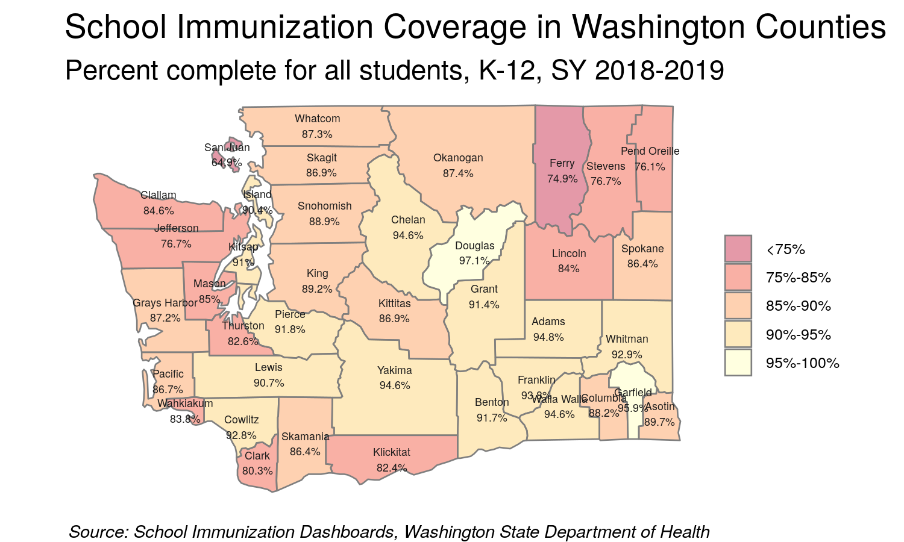
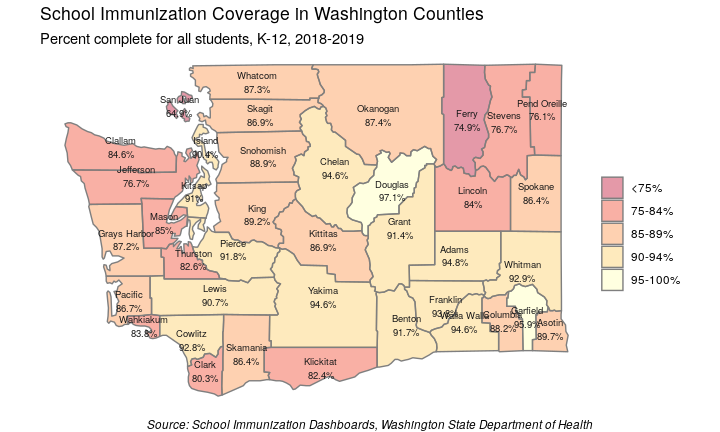

  
  


## Mapping with R

Today's example demonstrates these objectives:

* Use various packages in R to create static and interactive maps.
* Use an API key to use Google's geocoding API.
* Use public datasets freely available on the web.
* Use "web scraping" techniques to extract data.
* Use "literate programming" to provide a reproducable report.
* Use a consistent coding [style](https://google.github.io/styleguide/Rguide.xml).
* Share code through a public [repository](https://github.com/deohs/coders) to 
facilitate collaboration.

The code and this presentation are free to share and modify according to the 
[MIT License](https://github.com/deohs/coders/blob/master/LICENSE).

## Washington Measles Oubreak of 2019

We will use public data to generate:

* A choropleth map showing K-12 immunization rates in WA counties.
* A map showing exposure sites involved in the outbreak.
* An interactive map showing immunization rates for all WA schools.

## Mapping with `ggplot2`

We will use `ggplot2` to plot a choropleth map of K-12 immunization coverage in 
Washington counties.



## Setup

Load packages with `pacman` to auto-install any missing packages.


```r
# Load packages.
if (!suppressPackageStartupMessages(require(pacman))) {
  install.packages("pacman", repos = "http://cran.us.r-project.org")
}
pacman::p_load(dplyr, tidyr, maps, ggplot2)
```

We are loading:

* `dplyr` and `tidyr` for data management
* `maps` for getting county polygons
* `ggplot2` for plotting the map

## Get and clean data

Get the K-12 immunization coverage by county for Washington State. Since this 
[data](https://www.doh.wa.gov/DataandStatisticalReports/HealthDataVisualization/SchoolImmunization/CountySchoolImmunization) 
cannot be downloaded directly from our R script, we had to get this data using 
the [School Immunization Dashboards](https://www.doh.wa.gov/DataandStatisticalReports/HealthDataVisualization/SchoolImmunization) tool hosted by the [Washington State Department of Health](https://www.doh.wa.gov) 
and save it as a CSV file.


```r
data_fn <- paste0('wa_state_counties_k-12_immunization_status', 
                  '_data_2018-2019.csv')
data_path <- file.path('..', 'mapping_with_ggplot2', data_fn)
wa_coverage <- read.csv(data_path, stringsAsFactors = FALSE) %>% 
  filter(State == "Washington") %>% 
  select(county = Name, Measure, Percent) %>% 
  spread(key = Measure, value = Percent) %>% 
  mutate_at(.vars = c('Complete', 'Exempt'), 
            .funs = ~as.numeric(sub('%', '', .)))
```

## Prepare data for mapping

Convert immunization percent complete variable to a factor with 5 bins. This 
will allow us to limit the number of colors showing on the map and control 
the values they represent. Since most of the counties have immunization 
rates over 75%, we will will use more bins in the high end of the range 
for better differentiation.


```r
wa_coverage$Complete_fct <- factor(
  cut(x = wa_coverage$Complete, 
      breaks = c(0, 75, 85, 90, 95, 100), 
      labels = c("<75%", "75%-85%", "85%-90%", "90%-95%", "95%-100%"),
      ordered_result = TRUE))
```

## Get county polygons and labels

To plot the counties, we need the polygons that define their borders. We can 
get them using the `maps` package. 


```r
# Get Washington counties.
counties <- map_data("county")
wa_county <- subset(counties, region == 'washington') %>%
  mutate(county = tools::toTitleCase(subregion)) %>% 
  select(long, lat, county, group) %>% 
  left_join(wa_coverage, by = 'county')
```

We also need to create a dataframe of labels with county names and their 
locations so we can label the counties on the map. The location for each label
will be the center of the county's polygon.


```r
# Create a dataframe for county labels.
county_names <- wa_county %>% group_by(county) %>% 
  summarise_at(.vars = c('long', 'lat'), .funs = ~ mean(range(.)))
```

## Create the choropleth map

Use `ggplot()` to combine the polygons, color them, and add labels.


```r
# Plot map.
g <- ggplot() +
  geom_polygon(data = wa_county, 
               aes(x = long, y = lat, group = group, fill = Complete_fct),
               color = "gray50", alpha = 0.4) + 
  scale_fill_brewer(palette = "YlOrRd", direction = -1) + 
  geom_text(data = county_names, aes(long, lat, label = county),
            size = 2, color = "gray10") +
  coord_quickmap() + theme_void() +
  labs(x = NULL, y = NULL, fill = NULL,
       title = "School Immunization Coverage in Washington Counties",
       subtitle = "Percent complete for all students, K-12, 2018-2019",
       caption = paste("Source: School Immunization Dashboards,", 
                       "Washington State Department of Health")
  ) + theme(plot.caption = element_text(face = "italic"))
```

## Immunization Coverage in Washington

<!-- -->

## Mapping with `ggmap`


We will use the `ggmap` package to create maps with detailed basemaps.

`ggmap` allows us to a few different sources for the basemap tiles.

Our first map will use the "toner-lite" tiles from the "stamen" source.

The [2019 measles outbreak in Washington](https://www.doh.wa.gov/YouandYourFamily/IllnessandDisease/Measles/Measles2019) 
affected Clark County the most, with 71 cases as of August 2019. The state total was 86.

We will plot a map of exposure sites from the [Clark County Public Health measles 
investigation of 2019](https://www.clark.wa.gov/public-health/measles-investigation). 
We will restrict the map to the Portand/Vancouver area.

## Setup

Load packages with `pacman` to auto-install any missing packages.


```r
# Load packages.
if (!suppressPackageStartupMessages(require(pacman))) {
  install.packages("pacman", repos = "http://cran.us.r-project.org")
}
pacman::p_load(rvest, dplyr, tidyr, maps, ggmap)
```

We are loading:

* `rvest` for web scraping
* `dplyr` and `tidyr` for data management
* `maps` for geocoding
* `ggmap` for creating the map with a detailed basemap

## Get data

We will get exposure sites from Clark County Public Health using "web scraping", 
then get the geolocations for these sites with geocoding using the Google API. 
To use the geocoding API, you need an API key from Google.


```r
data_fn <- file.path("..", "mapping_with_ggmap", "clark_co_measles_locations.csv")
if (!file.exists(data_fn)) {
  url <- 'https://www.clark.wa.gov/public-health/measles-investigation'
  exposure_site <- read_html(url) %>% html_nodes(".field-content") %>% 
    html_nodes("li") %>% html_text() %>% gsub('^\n', '', .) %>% 
    gsub('(?: from |\n| on | Tuesday|,? ?[0-9]+:).*', '', .) %>% 
    grep('^[0-9]|^They|^Noon|^$', ., value = TRUE, invert = TRUE)
  key_fn <- '~/google_api.key'
  if (file.exists(key_fn)) {
    register_google(key = readLines(key_fn))
    if (has_google_key()) {
      locations <- geocode(location = exposure_site)
      locations$site <- exposure_site
      write.csv(locations, data_fn, row.names = FALSE)
    }
  }
} else { locations <- read.csv(data_fn, stringsAsFactors = FALSE) }
```

## Create the map

Restrict map to the Portand/Vancouver area by removing those in Bend.


```r
locations <- locations %>% filter(!grepl('Bend', site))

stamen_basemap <- suppressMessages(get_stamenmap(
  make_bbox(lon, lat, locations, f = .15), zoom = 10, maptype = "toner-lite"))

g <- ggmap(stamen_basemap) + 
  geom_point(mapping = aes(x = lon, y = lat), data = locations, 
             color = 'red', size = 2, alpha = 0.5) + 
  theme_void() +
  labs(x = NULL, y = NULL, fill = NULL,
       title = "2019 Clark County Measles Outbreak", 
       subtitle = "Exposure Sites in the Portland/Vancouver Area",
       caption = paste(
         "Source: https://www.clark.wa.gov/public-health/measles-investigation"
       )
  ) + theme(plot.caption = element_text(face = "italic", size = 7))
```

## Clark County Measles Outbreak

<!-- -->

## Mapping with `leaflet`

`leaflet` is a Javascript library for making interactive maps. It can be used 
from various programming languages, including R.


We will make a leaflet map showing the location of all of the K-12 schools in 
the state. 

We will plot these as circles where the color indicates the relative 
enrollment in the school and the color indicates the immunization rate.

## Setup

Load packages with `pacman` to auto-install any missing packages.


```r
# Load packages.
if (!suppressPackageStartupMessages(require(pacman))) {
  install.packages("pacman", repos = "http://cran.us.r-project.org")
}
pacman::p_load(dplyr, tidyr, leaflet, htmlwidgets, htmltools)
```

We are loading:

* `dplyr` and `tidyr` for data management
* `leaflet` to create the map visualization
* `htmlwidgets` and `htmltools` to place the title on the map

## Load packages and get data

We had to download the file manually from the [WA DoH website](https://www.doh.wa.gov/DataandStatisticalReports/HealthDataVisualization/SchoolImmunization/SchoolBuildingImmunization) 
since their site does not support automated downloads from R.


```r
# Data file downloaded as CSV export
data_fn <- file.path('..', 'mapping_with_leaflet',
      'wa_state_schools_k-12_immunization_status_data_2018-2019.csv')
wa_coverage <- read.csv(data_fn, stringsAsFactors = FALSE, check.names = FALSE)

wa_coverage <- wa_coverage %>% 
  rename('lat' = 'Latitude', 'lon' = 'Longitude') %>% 
  select(`School Name`, `School District`, Enrollment, Percent, lat, lon) %>%
  mutate(Percent = as.numeric(gsub('%', '', Percent))) %>% drop_na() %>% 
  filter(Enrollment > 0)
```

## Prepare variables for plotting

When you click on a point (circle) in our `leaflet` map, we want a popup to 
show some details about the school.


```r
wa_coverage <- wa_coverage %>% 
  mutate(Popup = paste0(
    '<dl><dt>School Name</dt>', 
    '<dd>', `School Name`, '</dd>',
    '<dt>School_District</td>', 
    '<dd>', `School District`, '</dd>',
    '<dt>K-12 Enrollment</dt>', 
    '<dd>', Enrollment, '</dd>',
    '<dt>Percent Complete</dt>', 
    '<dd>', Percent, '</dd></dl>'))
```

Cut the continuous variable "Percent complete" into bins making factor levels.


```r
wa_coverage$Percent_complete_fct <- 
  cut(wa_coverage$Percent, 
      c(0, 25, 50, 60, 70, 80, 85, 90, 95, 100), include.lowest = TRUE, 
      labels = c('<25', '25-50', '50-60', '60-70', '70-80', 
                 '80-85', '85-90', '90-95', '95-100'), ordered_result = TRUE)
```

## Make a map title

Leaflet makes a web visualization so we need to use some CSS and HTML to 
make the title.


```r
tag.map.title <- tags$style(HTML("
  .leaflet-control.map-title { 
                                 transform: translate(-50%,20%);
                                 position: fixed !important;
                                 left: 50%;
                                 text-align: center;
                                 padding-left: 10px; 
                                 padding-right: 10px; 
                                 background: rgba(255,255,255,0.75);
                                 font-weight: bold;
                                 font-size: 20px;
                                 }
                                 "))
title <- tags$div(
  tag.map.title, 
  HTML(paste("Immunization Coverage Rates for Washington Schools,<br>", 
             "Percent Complete for All Students, K-12, SY 2018-2019"))
) 
```

## Make the map


```r
# Assign a palette to this using colorFactor.
completeCol <-
  colorFactor(palette = colorRamp(c("red", "green3"), interpolate = "spline"),
  wa_coverage$Percent_complete_fct)

# Create the leaflet visualization.
g <- leaflet(data = wa_coverage) %>% addTiles() %>% 
  addCircleMarkers(lng = ~lon, lat = ~lat,
                   color = ~completeCol(Percent_complete_fct), 
                   popup = ~Popup,
                   radius = ~sqrt(Enrollment) * .3) %>% 
  addLegend("bottomright", pal = completeCol, values = ~Percent_complete_fct,
            title = "Immunization<br>Coverage<br>Percent<br>Complete",
            opacity = 1) %>% 
  addControl(title, position = "topleft", className="map-title")
```

## Immunization Coverage in Washington

<!--html_preserve--><div id="htmlwidget-5dd5c2d3b23e32a79885" style="width:720px;height:432px;" class="leaflet html-widget"></div>
<script type="application/json" data-for="htmlwidget-5dd5c2d3b23e32a79885">{"x":{"options":{"crs":{"crsClass":"L.CRS.EPSG3857","code":null,"proj4def":null,"projectedBounds":null,"options":{}}},"calls":[{"method":"addTiles","args":["//{s}.tile.openstreetmap.org/{z}/{x}/{y}.png",null,null,{"minZoom":0,"maxZoom":18,"tileSize":256,"subdomains":"abc","errorTileUrl":"","tms":false,"noWrap":false,"zoomOffset":0,"zoomReverse":false,"opacity":1,"zIndex":1,"detectRetina":false,"attribution":"&copy; <a href=\"http://openstreetmap.org\">OpenStreetMap<\/a> contributors, <a href=\"http://creativecommons.org/licenses/by-sa/2.0/\">CC-BY-SA<\/a>"}]},{"method":"addCircleMarkers","args":[[47.66369,46.57162,46.80218,47.04281,48.11587,47.73906,47.62867,47.56836,47.67022,47.55161,47.7226,47.66398,47.62384,47.57792,47.76155,47.72244,47.69953,47.18153,48.41436,48.3007,48.29837,48.49978,47.91152,47.80686,47.88145,48.64814,48.64856,47.66137,47.65311,47.64239,47.64685,47.66383,47.41454,47.41454,47.7399,47.7659,47.7338,47.72341,47.8267,47.62769,47.67522,47.69916,47.66671,47.66214,47.67882,47.72216,47.6752,47.74269,47.63854,47.63902,47.72111,47.69623,47.65283,47.68525,48.56214,48.46472,48.56133,46.72355,46.98869,46.59559,46.40662,46.33094,46.33103,46.57051,46.59625,46.58329,46.58698,46.60624,46.6059,46.59625,46.61938,46.40998,45.762,45.75746,45.76682,45.74061,45.61683,45.59513,45.67703,45.6811,45.63282,45.65641,45.61773,45.67921,46.1403,46.16588,46.1322,46.14775,45.7214,46.97996,46.99119,47.2063,46.70224,46.72532,46.65633,46.66199,47.23743,47.01569,47.04932,47.04932,47.04056,47.02386,47.0373,47.06244,47.03326,47.03009,47.04011,47.04011,47.03601,47.03122,47.05595,46.96862,46.89791,48.09486,48.11151,48.13002,48.03271,48.11703,47.56669,47.60697,47.58661,47.63611,47.73569,47.73091,47.69271,47.4167,47.53303,47.52533,47.60026,47.34997,47.32329,47.28018,47.28037,47.30664,47.36649,47.63674,47.56974,47.56685,47.62929,47.63411,47.59075,47.62633,47.58739,47.62657,47.5608,47.5475,47.60909,47.61596,47.55748,47.63213,47.57223,47.62751,47.61535,47.61331,47.62301,47.62301,47.62472,47.63569,47.6212,47.30209,47.36865,47.30069,47.32832,47.33506,47.29886,47.27366,47.28252,47.4664,47.48257,47.47778,47.40462,47.51291,47.50252,47.48855,47.43875,47.52854,47.56532,47.59977,47.34997,47.45208,47.66536,47.66999,47.67213,47.67265,47.64367,47.7135,47.67356,47.6827,47.69493,47.65332,47.68052,47.64839,47.60877,47.56874,47.57806,47.57618,47.74464,47.76946,47.76946,47.76797,47.74571,47.75245,47.761,47.75099,47.47914,47.4563,47.4419,47.46374,47.75107,47.61645,47.55052,47.69421,47.66513,47.60931,47.56477,47.59874,47.51172,47.59931,47.63242,47.6601,47.67102,47.71406,47.6327,47.72132,47.51123,47.6906,47.66297,47.61827,47.6387,47.69318,47.53912,47.55638,47.67961,47.64854,47.54257,47.63121,47.66513,47.50963,47.67761,47.70124,47.64323,47.66483,47.53712,47.68539,47.58839,47.56636,47.68642,47.70893,47.6741,47.68998,47.60752,47.59592,47.61313,47.71862,47.68673,47.62524,47.71862,47.66439,47.62261,47.62544,47.61708,47.7319,47.56232,47.61281,47.66988,47.68051,47.61563,47.62159,47.56616,47.76937,47.73571,47.75721,47.75614,47.73959,47.56892,47.40839,47.46527,47.47392,47.62669,47.62683,47.66397,47.64003,47.67943,47.62135,47.09674,47.15586,47.15952,47.24994,47.2361,47.14459,47.29083,47.28644,47.31922,47.3268,47.18423,47.18765,47.18447,47.18472,47.16972,47.25423,47.20425,47.23349,47.20625,47.19913,47.26815,47.24372,47.26828,47.24984,47.24205,47.17012,47.20755,47.20031,47.78012,47.79134,47.78594,47.82019,46.82589,46.41147,46.18378,46.20228,46.20568,46.31945,46.28248,46.28565,46.272,46.23841,46.27238,46.23577,46.24233,46.04573,46.04673,46.03838,46.07813,47.59448,47.83591,47.41668,47.4168,47.40475,47.42803,47.42419,47.31931,47.31081,47.22257,48.29837,48.03987,47.7641,48.70041,48.5344,48.47921,48.42114,48.40651,48.42669,48.17672,47.81393,47.81556,47.83612,47.83938,47.80332,47.82137,47.79812,47.78469,47.80165,47.87964,47.98448,47.91993,47.96339,47.98823,48.02598,48.05315,48.07236,47.84998,47.85109,47.84343,47.94625,47.93022,48.758,48.77467,48.74211,48.75214,48.76182,48.77018,48.72249,48.79595,48.77102,48.85863,48.84404,48.96216,48.9821,48.97061,48.94952,46.91683,47.77307,47.6769,47.6502,46.7383,47.94647,47.41674,47.6512,47.72014,47.52641,47.15802,47.15802,47.17911,47.25351,47.25548,46.14082,48.00877,47.38736,48.44164,48.52988,48.55772,48.53137,47.93215,48.24318,48.99403,46.8692,46.8692,47.08801,46.8692,47.08801,47.12587,46.76166,48.30148,48.30148,48.30148,47.95942,48.64839,48.64839,48.64839,47.78048,47.77651,47.77651,47.64912,47.65083,47.38424,47.38424,47.2687,47.2687,47.31973,47.31973,47.77609,47.77609,48.42627,48.03827,48.03827,48.03827,48.03827,48.73205,48.73205,48.90068,47.66547,47.65595,47.64556,47.49813,47.48953,47.48091,47.49594,47.47773,47.47876,47.48953,47.59631,47.59631,47.9498,47.9498,47.95096,47.95096,47.95065,47.95065,47.95483,47.94578,47.94578,47.70855,47.69942,47.69915,47.70017,47.68465,47.70047,47.68716,47.69236,47.70238,47.51702,47.51702,47.51702,47.68699,47.38829,47.80977,47.81101,47.83547,47.78346,47.79924,47.77103,47.75805,47.73675,47.77626,47.7635,47.73541,47.77469,47.74571,47.76768,47.77538,47.59022,47.59022,47.78064,47.73173,47.77946,47.89216,47.97252,47.97252,47.97252,47.96901,47.66506,47.69892,47.69928,47.67172,47.67306,47.65939,47.62083,47.72422,47.65192,47.65011,47.67471,47.72109,47.69501,47.70831,47.70977,47.6313,47.71879,47.62102,47.64678,47.66937,47.6787,47.70462,47.708,47.64114,47.65579,47.67629,47.69752,47.67717,47.65245,47.67123,47.74586,47.67989,47.6917,47.62166,47.68896,47.72311,47.69794,47.69755,47.63403,47.68713,47.69182,47.64269,47.61842,47.60074,47.71276,47.70654,47.69518,47.71058,47.71572,47.59589,47.71733,47.62196,47.62549,47.65375,47.67474,47.67474,47.65997,47.68296,47.67167,47.66615,47.68402,47.68313,47.69736,48.22772,48.22772,48.1697,48.54259,48.54259,48.53516,48.53516,48.5506,48.5506,48.53624,48.53624,48.54742,48.54742,48.31073,48.62118,48.62118,48.62118,48.06957,48.03997,48.03997,47.83107,47.81473,47.81125,48.91558,48.91558,48.29529,48.17018,48.17018,47.87049,47.87049,47.87049,46.89179,46.89311,47.00731,46.56636,46.92262,46.99192,46.99192,46.91213,46.81383,47.1878,47.12892,47.12892,46.91213,46.72771,46.71669,46.73929,46.71932,46.7336,47.2293,47.0905,47.0905,47.29223,47.29223,46.89797,46.89797,46.89797,46.89797,46.7383,46.7383,46.7383,46.7383,46.7383,47.18938,47.18938,47.18938,47.18938,46.96194,47.23295,46.99475,46.99048,47.00634,46.99472,46.99237,46.99148,46.98499,46.98499,47.0711,47.0711,45.97161,45.80199,45.81948,45.81365,45.81704,46.54714,46.61065,46.57148,46.57148,46.57148,46.25487,46.25486,46.25355,46.25487,46.25494,46.25129,46.34924,46.34924,46.34924,46.20774,46.20774,46.40662,46.36596,46.36596,46.99217,46.99217,46.766,46.65592,46.66018,46.66035,46.31749,46.32398,46.31749,46.31749,46.31749,46.31749,46.31849,46.31749,46.37843,46.38049,46.37964,46.37737,46.38409,46.37843,46.55593,46.43394,46.43797,46.43394,46.43929,46.43511,46.44073,46.4446,46.58803,46.55062,46.59654,46.59757,46.58754,46.57471,46.58574,46.57856,46.57475,46.57475,46.58962,46.61244,46.61781,46.59698,46.59153,46.59036,46.60359,46.58547,46.59859,46.60758,46.60522,46.5831,46.57351,46.58963,46.61442,46.57085,46.58148,46.59541,46.58845,46.57431,46.59859,46.59336,46.41114,46.40328,46.40655,46.40066,45.79235,45.79235,45.79235,45.78426,45.79235,45.79235,45.79235,45.79235,45.79235,45.79235,45.79235,45.79235,45.79235,45.72707,45.72054,45.86813,45.60217,45.59417,45.61256,45.60734,45.63053,45.59884,45.59,45.6073,45.60914,45.5938,45.5915,45.61594,45.62455,45.62121,45.63873,45.61864,45.66892,45.64093,45.63575,45.68048,45.61203,45.63838,45.64162,45.62708,45.61705,45.68466,45.67634,45.65645,45.61834,45.61511,45.60604,45.62715,45.6726,45.63138,45.69069,45.68948,45.60595,45.62757,45.59409,45.63668,45.65439,45.64171,45.67768,45.64347,45.67854,45.61251,45.63842,45.65645,45.94786,45.73954,45.73394,45.74544,45.87807,45.87807,45.87807,45.79954,45.76692,45.81728,45.79938,45.64233,45.62419,45.69474,45.63037,45.63742,45.72426,45.64055,45.64759,45.63603,45.6365,45.64055,45.64322,45.62276,45.70287,45.6526,45.64055,45.65993,45.67103,45.62979,45.71368,45.68845,45.64055,45.6545,45.66277,45.64264,45.68834,45.64279,45.6436,45.64403,45.72251,45.62669,45.65303,45.70867,45.68355,45.72406,45.69577,45.66728,45.7073,45.69507,45.58494,45.58113,45.58459,45.57608,45.57608,46.27052,46.00704,46.00704,46.07159,46.09858,46.14302,46.14745,46.14549,46.13453,46.15008,46.16019,46.15013,46.14479,46.15375,46.1795,46.13908,46.13143,46.145,46.12845,46.15706,46.13927,46.15436,46.16646,46.16438,46.17142,46.13904,46.15538,46.14059,46.14437,46.32288,46.32288,45.99443,45.9016,45.90478,45.92677,45.90419,45.93089,45.90284,45.7509,46.00663,46.01923,45.69442,45.69442,45.69442,45.97507,45.97507,45.74651,45.743,45.73409,45.743,45.75849,46.3659,46.37561,46.29462,46.29462,46.37906,46.3684,46.50187,45.75849,45.56394,45.62373,45.62373,45.62373,45.61029,45.61029,46.19537,46.97107,46.96727,46.98624,46.9768,46.97173,46.96675,46.96419,46.9794,46.95154,47.00331,47.00331,47.04729,47.00331,46.98063,46.99132,46.97608,46.98126,46.98222,46.98129,47.04978,46.98553,46.98521,46.97016,46.97016,46.77602,46.84368,46.84368,46.86724,47.00128,47.29487,46.57132,46.55404,46.73478,46.70608,46.70911,46.72174,46.74251,46.72701,46.64357,46.64079,46.64079,46.65013,46.53987,46.56487,46.56487,46.53128,46.53128,46.57474,46.57474,46.59899,46.59899,46.59899,46.57132,46.56526,46.44678,46.44678,46.44678,46.44678,46.52145,46.5381,46.48834,46.48834,46.49259,46.49259,47.33258,47.33258,47.19935,47.19935,47.25742,47.23286,47.23286,47.20899,47.20899,47.21582,47.21457,47.21457,47.20148,47.20148,47.22919,47.22919,47.2271,47.2271,47.23286,47.23286,47.19903,46.68557,46.68557,46.56324,46.56324,46.56324,46.51462,46.51462,46.92843,47.05574,47.05228,47.00608,47.00162,47.02868,47.04745,46.99138,47.00596,46.98605,47.01921,47.02882,47.05892,47.04756,47.08701,47.01441,47.08271,47.05404,47.04757,47.05108,47.04357,47.13565,47.01822,47.03719,47.03107,47.02871,47.04301,47.01899,47.04906,47.07088,47.05641,47.06137,47.0646,47.01984,47.05258,47.0631,47.00499,47.01961,46.98269,46.88537,46.88537,46.88537,46.82274,46.79736,46.8035,46.79434,46.79493,46.85748,46.85748,46.85748,46.85748,46.90237,46.98821,46.96046,46.98704,46.98269,47.01489,46.98803,47.00573,46.99201,46.96829,46.97712,46.94202,46.94202,46.94202,46.94202,46.94202,46.94202,46.94202,46.94202,46.94202,46.94202,48.17431,48.36713,48.36713,48.18315,48.18315,48.10123,48.11041,48.11266,48.12808,48.10251,48.10296,48.11629,47.63398,47.94647,47.94945,47.94794,47.95267,48.08486,48.08641,48.08648,48.08279,47.69686,47.97894,47.97894,47.97894,47.97894,48.02831,48.12826,48.11765,48.11124,47.83053,47.57293,47.56393,47.56953,47.57564,47.59379,47.57099,47.5924,47.55725,47.58251,47.62715,47.64148,47.63226,47.59694,47.63115,47.61305,47.65839,47.64295,47.59558,47.58932,47.68957,47.65166,47.66279,47.68302,47.67486,47.64454,47.68394,47.66279,47.65839,47.79819,47.80816,47.79819,47.80919,47.79695,47.79957,47.73373,47.73081,47.70514,47.73132,47.76177,47.73355,47.7348,47.53919,47.51828,47.43262,47.50681,47.46876,47.55208,47.4983,47.43952,47.50567,47.52946,47.53163,47.50509,47.52233,47.41674,47.45982,47.40721,47.41674,47.27553,47.34096,47.26245,47.30791,47.30765,47.3171,47.28696,47.29812,47.32028,47.28833,47.279,47.31884,47.33926,47.30928,47.32994,47.27679,47.325,47.26468,47.32848,47.29257,47.32743,47.27053,47.57138,47.61437,47.609,47.60762,47.57027,47.63128,47.6013,47.59094,47.63124,47.63876,47.55266,47.57145,47.61142,47.61354,47.62751,47.63187,47.61586,47.59267,47.60007,47.55601,47.57387,47.60569,47.61719,47.56246,47.58888,47.5495,47.63108,47.61734,47.33353,47.19362,47.18815,47.22822,47.21026,47.21218,47.22332,47.18677,47.4289,47.34346,47.33478,47.27985,47.32571,47.33318,47.35217,47.27891,47.32591,47.3645,47.31712,47.27946,47.32903,47.29331,47.31529,47.31033,47.30062,47.32522,47.30956,47.32952,47.2923,47.29232,47.3089,47.28712,47.27164,47.32049,47.34197,47.3562,47.33329,47.29917,47.36202,47.3344,47.32051,47.27824,47.32158,47.38075,47.36263,47.4668,47.4366,47.47223,47.48481,47.45748,47.4575,47.49909,47.48495,47.40082,47.40097,47.40439,47.4255,47.38059,47.40164,47.42471,47.45294,47.43527,47.41931,47.43897,47.43447,47.49576,47.43875,47.50218,47.51198,47.51023,47.5005,47.49428,47.50564,47.51316,47.4994,47.51993,47.56974,47.56306,47.56052,47.52892,47.52169,47.57633,47.57234,47.53742,47.58951,47.52892,47.54611,47.58062,47.52264,47.528,47.47215,47.48072,47.46234,47.49814,47.48236,47.59977,47.60125,47.59423,47.57872,47.58177,47.32543,47.37078,47.35983,47.37047,47.37726,47.39991,47.33129,47.37268,47.41591,47.36465,47.36472,47.4059,47.3722,47.34318,47.35197,47.39425,47.35386,47.42369,47.37976,47.38683,47.42484,47.42296,47.40869,47.35409,47.37222,47.39215,47.35978,47.38152,47.40856,47.37956,47.35817,47.40191,47.39035,47.37548,47.43941,47.45343,47.43911,47.43749,47.43038,47.71895,47.71839,47.67532,47.72445,47.71839,47.71839,47.70047,47.72601,47.6646,47.72587,47.71517,47.72443,47.67561,47.66085,47.65575,47.66686,47.68603,47.7273,47.68954,47.68642,47.71895,47.71517,47.6646,47.65575,47.65575,47.68983,47.66716,47.69298,47.66799,47.67375,47.69288,47.70365,47.67514,47.69942,47.67494,47.64835,47.63842,47.66167,47.68474,47.64627,47.66799,47.67156,47.67156,47.6168,47.61622,47.61923,47.62936,47.64186,47.62458,47.62194,47.62348,47.71878,47.53839,47.571,47.55426,47.53297,47.57237,47.57402,47.75857,47.76804,47.76899,47.76946,47.74367,47.74367,47.74057,47.73705,47.76751,47.73811,47.77526,47.72695,47.7712,47.74327,47.75199,47.74077,47.75443,47.76886,47.76808,47.7667,47.53939,47.53939,47.54095,47.54095,47.45709,47.45709,47.48122,47.48122,47.45687,47.45687,47.45631,47.45631,47.50071,47.50071,47.47439,47.45687,47.45687,47.46642,47.45162,47.46642,47.45162,47.49413,47.49413,47.45971,47.45971,47.49665,47.49665,47.45921,47.45921,47.48739,47.48739,47.43565,47.43565,47.51447,47.51447,47.5167,47.5167,47.48425,47.48425,47.50304,47.48476,47.48476,47.49211,47.49211,47.49972,47.49972,47.49737,47.49737,47.49306,47.49306,47.65179,47.6512,47.65125,47.69916,47.6426,47.74731,47.73991,47.73639,47.65091,47.53441,47.58417,47.65691,47.68295,47.52836,47.57643,47.72446,47.56213,47.70733,47.57622,47.53734,47.72676,47.55794,47.69425,47.67372,47.60505,47.64601,47.6766,47.55749,47.67598,47.69848,47.53922,47.71426,47.62199,47.63784,47.61172,47.63348,47.6849,47.52602,47.49854,47.64103,47.6307,47.51803,47.621,47.54223,47.62435,47.60159,47.63778,47.61299,47.65439,47.6041,47.52474,47.54597,47.55097,47.51503,47.68702,47.70747,47.51746,47.66156,47.57369,47.53145,47.70534,47.52383,47.57728,47.69418,47.55749,47.60185,47.53987,47.68621,47.52815,47.5551,47.58529,47.58099,47.56578,47.57505,47.54085,47.67603,47.72309,47.69777,47.68333,47.67654,47.65664,47.65637,47.63307,47.66799,47.69033,47.56469,47.621,47.64203,47.58417,47.59114,47.69405,47.6796,47.5521,47.52339,47.7237,47.67305,47.6396,47.70851,47.5583,47.54961,47.6358,47.66942,47.67205,47.68653,47.50991,47.69524,47.57435,47.59917,47.67607,47.5461,47.56223,47.52616,47.71247,47.52417,47.64118,47.69425,47.53178,47.55336,47.71019,47.57358,47.75497,47.76403,47.77388,47.73992,47.75463,47.77388,47.74133,47.74513,47.76913,47.77184,47.74276,47.7639,47.74864,47.74497,47.76886,47.75257,47.58487,47.58487,47.49448,47.48042,47.49605,47.47167,47.49448,47.52389,47.52808,47.53012,47.53248,47.52519,47.38715,47.39333,47.39777,47.39777,47.35169,47.38623,47.40833,47.38315,47.3717,47.47071,47.4686,47.48142,47.4696,47.47419,47.47425,47.42911,47.42203,47.42203,47.42411,47.63579,47.63579,47.63579,47.60772,47.67905,47.6428,47.64747,47.64545,47.63579,47.25202,47.05298,47.01653,47.02064,47.05343,47.03047,47.05298,47.0203,47.07132,47.05298,47.11081,47.11081,47.09922,47.0901,47.10433,47.05424,47.10951,47.0931,47.07122,47.10078,47.05587,47.09734,47.08423,47.05424,47.07318,47.06081,47.11789,47.11239,47.10425,47.11264,47.02687,47.13483,47.12091,47.09891,47.09891,47.10925,47.08414,47.15732,47.16329,47.15732,47.15802,47.1794,47.16704,47.18732,47.12505,47.15271,47.1666,47.14998,47.15647,47.15825,47.12145,47.17662,47.16171,47.1754,47.1754,47.18342,47.17911,47.2268,47.24414,47.2488,46.75387,46.92465,46.9019,46.9019,46.9019,46.9019,47.25012,47.24831,47.24829,47.25004,47.23887,47.16219,47.13744,47.15573,47.13625,47.18006,47.162,47.16447,47.13996,47.13751,47.16097,47.14468,47.14578,47.23239,47.09598,47.10113,47.13699,47.33575,47.38671,47.33044,47.3729,47.29374,47.30806,47.29064,47.29295,47.30822,47.38507,47.34006,47.33031,47.26754,47.30756,47.34434,47.22718,47.23564,47.23679,47.20373,47.09136,47.1385,47.19173,47.18917,47.198,47.19387,47.19025,47.18878,47.16625,47.15465,47.14265,47.17584,47.11774,47.12552,47.18178,47.21006,47.10102,47.14953,47.16099,47.13936,47.15493,47.11318,47.10107,47.19549,47.09943,47.18626,47.13287,47.19924,47.09726,47.0979,47.17981,47.16902,47.16594,47.1646,47.24253,47.24253,47.26084,47.19043,47.26527,47.22477,47.23022,47.25548,47.23239,47.22864,47.27033,47.19589,47.2448,47.24821,47.25876,47.18062,47.17947,47.26899,47.26892,47.21528,47.2174,47.28761,47.28268,47.22171,47.22945,47.24148,47.1912,47.20439,47.22636,47.18818,47.19802,47.20266,47.24874,47.20992,47.30294,47.26657,47.25188,47.25337,47.29385,47.28349,47.19734,47.17388,47.20887,47.22299,47.29892,47.20093,47.2575,47.25348,47.213,47.24243,47.25188,47.25586,47.29734,47.20625,47.27308,47.18227,47.27971,47.22081,47.21502,47.20627,47.23517,47.21304,47.21724,47.2243,47.1595,47.15988,47.1595,47.15988,47.15988,47.1595,47.107,47.82398,47.7782,47.79788,47.7782,47.7782,47.784,47.80067,47.77862,47.79493,47.80262,47.82001,47.78324,47.80262,47.7846,46.82302,46.81993,46.83264,46.81832,46.8205,46.81861,46.33706,46.33706,46.15138,46.15472,46.13871,46.20586,46.20628,46.19122,46.21857,46.20586,46.21783,46.22819,46.21876,46.19723,46.1647,46.20757,46.18884,46.18819,46.19122,46.20705,46.19245,46.19817,46.17903,46.17202,46.19839,46.20606,46.1776,46.19681,46.19681,46.2635,46.27551,46.2769,46.2635,45.85905,46.23396,46.20048,46.21224,46.20827,46.20383,46.27718,46.3257,46.27287,46.29403,46.29314,46.29566,46.27227,46.2678,46.30901,46.23383,46.23362,46.24873,46.29712,46.27352,46.27491,46.30726,46.28788,46.29499,46.31539,46.31531,46.32152,46.51282,46.72216,46.72216,46.72216,46.25449,46.23946,46.26042,46.2581,46.43442,46.23111,46.23461,46.23946,46.24015,46.23605,46.24657,46.26792,46.23844,46.246,46.23321,46.2512,46.23985,46.28358,46.2793,46.28129,46.46458,46.46458,46.20082,46.20082,46.20082,46.48922,46.48922,46.03815,46.35463,46.35463,46.35463,46.05974,46.04576,46.05489,46.06411,46.07368,46.06773,46.06204,46.0418,46.05555,46.06493,47.72014,47.72014,47.59789,47.6031,47.59918,47.76952,47.60255,47.51529,47.51466,47.51723,47.85972,47.83968,47.83968,47.83968,47.89165,47.89165,47.88995,47.45279,47.40901,47.43291,47.47268,47.4183,47.43917,47.4321,47.42666,47.40689,47.39869,47.42172,47.44278,47.41278,47.46549,48.00877,48.00877,48.00877,47.41129,47.42686,47.4166,47.40304,47.44339,47.40006,47.41774,47.37785,47.64103,47.64103,47.42452,47.64683,47.61293,47.61486,47.31302,47.31478,47.31797,47.32528,47.11096,47.18036,47.12009,47.17308,47.16638,47.12515,47.13433,47.08896,47.15137,47.10773,47.1337,47.11506,47.12752,47.24265,47.38934,47.38736,46.96303,48.10209,47.96747,47.96747,48.44164,48.44164,48.44164,48.16862,48.28204,48.28204,48.28204,48.37333,48.41959,48.41959,48.41959,48.41959,48.41959,48.93219,48.93219,48.05102,48.05102,48.68802,48.68802,48.68802,48.2061,48.2061,48.20759,48.30054,48.30212,48.29484,48.29626,48.29624,48.2998,48.30719,48.30037,48.29898,48.29296,48.00459,48.00459,48.00459,48.01749,48.23323,48.14438,48.49235,48.49235,48.69858,48.69858,48.69858,48.69858,48.52988,48.52988,48.52988,48.52988,48.52988,48.52988,48.52988,48.48785,48.44686,48.50445,48.503,48.50627,48.50627,48.51221,48.47485,48.47485,48.53442,48.53442,48.39597,48.39597,48.42331,48.4328,48.40634,48.41372,48.43129,48.41478,48.41589,48.42078,48.40651,48.44272,48.41444,48.41141,48.46236,48.39972,48.50009,48.50335,48.5868,48.49984,48.50142,48.51413,48.51247,48.15236,48.167,48.19474,48.16513,48.19709,48.19233,48.19709,48.18335,48.19775,47.83342,47.78823,47.79763,47.80683,47.78804,47.81988,47.80324,47.78152,47.82859,47.81779,47.79146,47.79968,47.78804,47.78517,47.81066,47.84651,47.81387,47.81387,47.82592,47.81066,47.82388,47.83899,47.81351,47.84672,47.81424,47.82936,47.81362,47.84671,47.84294,47.85802,47.84652,47.84048,47.8008,47.79212,47.79212,47.79689,47.84284,47.84546,47.92892,47.98567,47.92323,47.97097,47.96783,47.98814,48.00207,47.94177,47.95135,48.00586,47.86513,47.95266,47.89893,47.91727,47.91914,47.98427,47.88394,47.87924,47.85716,47.86135,47.97097,47.90569,48.00152,47.87075,47.8742,47.86334,48.08112,48.08958,48.08501,48.08852,48.09542,48.08112,47.81362,48.01748,48.01786,48.02285,48.02671,48.02643,48.00669,48.01807,48.02335,48.00669,48.01748,48.15204,48.15204,48.15204,48.15204,48.15204,48.15236,48.092,48.07542,48.06226,48.09978,48.06226,48.09978,48.05818,48.08561,48.06436,48.11814,48.07717,48.05487,48.03012,48.05458,48.07189,48.06226,48.07452,48.05679,48.0632,47.84313,47.86088,47.8779,47.85684,47.85245,47.8555,47.80478,47.80073,47.88856,47.87117,47.87156,47.91003,47.88912,47.91331,47.89453,47.89453,47.87915,47.89998,47.91093,47.89236,47.92176,47.91685,47.91058,47.87013,47.89838,47.88642,47.89529,47.92983,47.88148,47.93215,47.91768,47.86919,47.91317,47.92497,47.94173,47.8267,47.8683,47.93215,47.93848,47.93851,47.93051,47.86547,47.93215,47.92756,47.96362,48.24301,48.24301,48.24203,48.23407,48.2447,48.24204,48.23919,48.24959,47.85638,47.86918,47.87258,47.86542,48.75668,48.7823,48.75668,48.78044,48.72522,48.76326,48.76684,48.74547,48.77477,48.76969,48.80212,48.78661,48.76724,48.71788,48.72318,48.74797,48.76784,48.74496,48.71584,48.7798,48.7584,48.99306,48.99064,48.99406,48.99403,48.9939,48.91977,48.8705,48.8705,48.8705,48.86409,48.86172,48.86172,48.86172,48.72402,48.94611,48.94476,48.95814,48.94872,48.95768,48.95303,48.85505,48.85505,48.85505,48.86257,48.86976,48.6546,48.71856,48.8202,48.82395,48.82395,48.91921,48.9082,48.92165,48.92761,48.96393,48.99418,48.39597],[-117.18445,-117.12854,-120.921,-122.8438,-122.75491,-122.62732,-122.15275,-122.16679,-122.12216,-122.06072,-122.20768,-122.10129,-122.05249,-122.21043,-122.13149,-122.29074,-122.32568,-122.18072,-119.50929,-122.65119,-122.65195,-122.60966,-122.22344,-122.32346,-122.28177,-122.33151,-118.73839,-117.27145,-117.20941,-117.19646,-117.26713,-117.19647,-117.36631,-117.36631,-117.44711,-117.46216,-117.33105,-117.28657,-117.33654,-117.4037,-117.47325,-117.44957,-117.47102,-117.38611,-117.43174,-117.46344,-117.41397,-117.42095,-117.4181,-117.35869,-117.43354,-117.43545,-117.43297,-117.39203,-117.92229,-117.88564,-117.86686,-117.1871,-120.5419,-120.46107,-120.60047,-120.01101,-119.99409,-120.49996,-120.58194,-120.5159,-120.51476,-120.56717,-120.50296,-120.5263,-120.5779,-120.27258,-122.55923,-122.56077,-122.56225,-122.61915,-122.40371,-122.40726,-122.66765,-122.59298,-122.56398,-122.67538,-122.60455,-122.63745,-122.9457,-122.98586,-122.95312,-122.95098,-121.47499,-123.81989,-123.59873,-124.19829,-122.96034,-122.99978,-122.96119,-123.01285,-123.09434,-122.88032,-122.82139,-122.82139,-122.78534,-122.78687,-122.81018,-122.86334,-122.81622,-122.87248,-122.88501,-122.88501,-122.93283,-122.90043,-122.9388,-122.83718,-122.60619,-123.30452,-123.44218,-123.18696,-122.76473,-122.78144,-122.63878,-122.63275,-122.71802,-122.70264,-122.63971,-122.59669,-122.65455,-122.6249,-122.63648,-122.64627,-122.7094,-122.22965,-122.2215,-122.15656,-122.16554,-122.21169,-122.10178,-122.18548,-122.10153,-122.16671,-122.19103,-122.13005,-122.14512,-122.14923,-122.15889,-122.20174,-122.15628,-122.11439,-122.13232,-122.15368,-122.12725,-122.15381,-122.13268,-122.13819,-122.17486,-122.13046,-122.21156,-122.21156,-122.20986,-122.23523,-122.2345,-122.27544,-122.30764,-122.28878,-122.32407,-122.30072,-122.3092,-122.32838,-122.32693,-122.36052,-122.33658,-122.33323,-122.30963,-122.36921,-122.35523,-122.34787,-122.27179,-122.04588,-121.99983,-122.03547,-122.22965,-122.10951,-122.16409,-122.18008,-122.16504,-122.20086,-122.19909,-122.16972,-122.10186,-122.14508,-122.06889,-122.04839,-122.06273,-122.12442,-122.03537,-122.2228,-122.21349,-122.20591,-122.18255,-122.20169,-122.20169,-122.18486,-122.19159,-122.16914,-122.11521,-122.15276,-122.21319,-122.20182,-122.20398,-122.13776,-121.95124,-122.33578,-122.28064,-122.31768,-122.31316,-122.30883,-122.38414,-122.30627,-122.26215,-122.29719,-122.30762,-122.36436,-122.37612,-122.354,-122.32017,-122.31502,-122.26093,-122.32022,-122.33015,-122.28743,-122.32016,-122.29045,-122.37524,-122.3162,-122.28922,-122.39963,-122.26895,-122.3579,-122.31834,-122.37456,-122.38442,-122.2987,-122.34966,-122.27084,-122.28463,-122.31962,-122.297,-122.38536,-122.35894,-122.35539,-122.29316,-122.35251,-122.32489,-122.325,-122.32559,-122.32092,-122.3008,-122.30857,-122.32092,-122.35248,-122.28916,-122.30471,-122.33697,-122.32878,-122.31165,-122.31624,-122.31311,-122.32479,-122.30752,-122.29307,-122.38686,-122.35135,-122.30263,-122.31038,-122.35336,-122.33452,-121.90371,-122.02249,-122.12794,-122.2561,-122.52109,-122.55633,-122.57454,-122.52092,-122.53647,-122.54385,-122.3825,-122.57312,-122.51078,-122.28749,-122.35706,-122.43344,-122.57943,-122.62962,-122.6117,-122.58593,-122.25601,-122.29513,-122.28695,-122.26681,-122.22931,-122.51038,-122.48033,-122.43949,-122.42852,-122.46368,-122.46312,-122.48279,-122.45948,-122.53414,-122.48479,-122.43191,-122.52789,-122.54057,-122.18335,-122.19462,-122.22629,-122.20972,-119.17405,-117.05141,-119.15336,-119.25319,-119.13086,-119.27954,-119.28591,-119.30033,-119.29732,-119.14511,-119.21626,-119.10742,-119.19458,-118.39913,-118.39895,-118.30447,-118.33018,-120.66942,-120.05122,-120.33265,-120.3464,-120.31514,-120.31539,-120.31634,-119.53835,-119.54421,-119.87388,-122.65195,-122.40918,-122.17755,-122.90628,-123.02521,-122.31373,-122.32408,-122.34459,-122.32154,-122.19458,-122.3762,-122.36923,-122.31968,-122.32108,-122.25775,-122.32148,-122.31113,-122.30562,-122.31065,-122.20357,-122.20998,-122.22278,-122.2176,-122.19348,-122.09592,-122.17692,-122.14007,-121.9858,-121.98599,-122.01434,-122.26325,-122.08514,-122.47498,-122.45341,-122.3996,-122.47227,-122.48522,-122.49172,-122.47076,-122.5,-122.49334,-122.5856,-122.61126,-122.40745,-122.48506,-122.40725,-122.4449,-118.08565,-117.37566,-117.45459,-117.40859,-119.90651,-124.38385,-122.83716,-121.90763,-121.39788,-121.82624,-122.52047,-122.52047,-122.55451,-122.51572,-122.50969,-118.15306,-119.65712,-119.49683,-120.1828,-123.00022,-122.92607,-121.75833,-122.09917,-122.33829,-122.7368,-118.63488,-118.63488,-118.43134,-118.63488,-118.43134,-118.37137,-118.29683,-118.20073,-118.20073,-118.20073,-118.81765,-118.71407,-118.71407,-118.71407,-119.09568,-118.42467,-118.42467,-118.14919,-118.15097,-118.1782,-118.1782,-118.62775,-118.62775,-118.01488,-118.01488,-118.70035,-118.70035,-117.31163,-117.18171,-117.18171,-117.18171,-117.18171,-117.41234,-117.41234,-117.38626,-117.27486,-117.26069,-117.58911,-117.57735,-117.57769,-117.59511,-117.57651,-117.56467,-117.54294,-117.57769,-117.49324,-117.48907,-117.45212,-117.45212,-117.45974,-117.45974,-117.46929,-117.46929,-117.4617,-117.45664,-117.45664,-117.05489,-117.11012,-117.17718,-117.19337,-117.23833,-117.20317,-117.23902,-117.19549,-117.19965,-117.19361,-117.19361,-117.19361,-117.51977,-117.31871,-117.3419,-117.39417,-117.36974,-117.32247,-117.35722,-117.41374,-117.39279,-117.45447,-117.3847,-117.41615,-117.41466,-117.3817,-117.44832,-117.42164,-117.38472,-117.70167,-117.70167,-117.55394,-117.31513,-117.89009,-117.35951,-117.35723,-117.35723,-117.35723,-117.34965,-117.43663,-117.43715,-117.38749,-117.42745,-117.41889,-117.41555,-117.36692,-117.46739,-117.42073,-117.32904,-117.41768,-117.47234,-117.37141,-117.41543,-117.43552,-117.42569,-117.4568,-117.36847,-117.39215,-117.44978,-117.39478,-117.46388,-117.40577,-117.37151,-117.36913,-117.43247,-117.36944,-117.4143,-117.356,-117.38414,-117.48359,-117.44217,-117.39648,-117.40976,-117.37475,-117.42354,-117.44627,-117.4198,-117.3618,-117.35845,-117.45307,-117.41724,-117.38037,-117.3481,-117.46347,-117.3872,-117.37345,-117.39866,-117.37297,-117.3719,-117.44985,-117.34003,-117.4045,-117.31081,-117.2846,-117.2846,-117.28492,-117.28664,-117.30456,-117.30107,-117.29204,-117.30223,-117.28928,-117.78533,-117.78533,-118.11569,-117.89711,-117.89711,-117.89089,-117.89089,-117.89724,-117.89724,-117.89859,-117.89859,-117.87981,-117.87981,-118.13641,-118.2254,-118.2254,-118.2254,-117.63058,-117.80779,-117.80779,-117.60032,-117.57724,-117.55915,-117.78282,-117.78282,-117.95846,-117.72042,-117.72042,-118.00743,-118.00743,-118.00743,-117.36157,-117.36095,-117.35622,-117.13022,-117.69064,-117.18131,-117.18131,-117.07114,-117.87589,-117.92529,-117.24513,-117.24513,-117.07114,-117.18759,-117.16985,-117.18125,-117.18013,-117.17181,-117.36855,-117.60143,-117.60143,-117.0512,-117.0512,-119.61512,-119.61512,-119.61512,-119.61512,-119.90651,-119.90651,-119.90651,-119.90651,-119.90651,-120.93341,-120.93341,-120.93341,-120.93341,-120.56863,-121.17718,-120.52998,-120.54009,-120.55833,-120.53133,-120.54299,-120.52834,-120.41765,-120.41765,-120.6758,-120.6758,-120.25288,-120.50074,-120.81492,-120.81414,-120.81744,-120.35266,-120.45023,-120.40393,-120.40393,-120.40393,-119.91382,-119.91668,-119.88917,-119.91226,-119.92084,-119.92395,-120.1881,-120.1881,-120.1881,-120.0002,-120.0002,-120.60047,-120.70459,-120.70459,-121.09505,-121.09505,-120.82037,-120.54978,-120.53026,-120.53044,-120.01288,-119.97419,-120.01288,-120.01288,-120.01288,-120.01288,-119.99937,-120.01288,-120.33598,-120.30596,-120.32552,-120.29775,-120.31698,-120.33598,-120.48023,-120.41729,-120.41742,-120.41729,-120.41741,-120.41727,-120.41711,-120.42054,-120.70944,-120.64982,-120.59271,-120.62518,-120.6044,-120.63115,-120.63573,-120.60756,-120.63916,-120.63916,-120.56519,-120.54568,-120.52202,-120.51587,-120.52631,-120.55391,-120.54633,-120.56723,-120.53048,-120.52001,-120.56726,-120.53834,-120.47782,-120.47751,-120.50907,-120.51582,-120.51083,-120.49109,-120.5672,-120.52301,-120.49088,-120.53431,-120.27229,-120.2634,-120.26501,-120.24621,-122.53488,-122.53488,-122.53488,-122.53698,-122.53488,-122.53488,-122.53488,-122.53488,-122.53488,-122.53488,-122.53488,-122.53488,-122.53488,-122.62345,-122.5722,-122.41203,-122.42157,-122.40091,-122.39659,-122.42211,-122.43212,-122.42981,-122.4559,-122.40422,-122.41569,-122.40211,-122.40199,-122.44702,-122.46824,-122.47059,-122.52936,-122.47274,-122.56068,-122.5333,-122.52586,-122.53619,-122.51941,-122.53066,-122.52743,-122.52668,-122.5631,-122.567,-122.53123,-122.52269,-122.50606,-122.53912,-122.54092,-122.54953,-122.55755,-122.56976,-122.51456,-122.58229,-122.51688,-122.57913,-122.48621,-122.49336,-122.54798,-122.55029,-122.49919,-122.54744,-122.50196,-122.53452,-122.49345,-122.52269,-122.53842,-122.48725,-122.49965,-122.46774,-122.62155,-122.62155,-122.62155,-122.71034,-122.67451,-122.74131,-122.71182,-122.62084,-122.6096,-122.67915,-122.65554,-122.6125,-122.68553,-122.62345,-122.69329,-122.67593,-122.63916,-122.62345,-122.65238,-122.60564,-122.6655,-122.67615,-122.62345,-122.6786,-122.66545,-122.62041,-122.65539,-122.69412,-122.62345,-122.62787,-122.64244,-122.63094,-122.67789,-122.59064,-122.66817,-122.62791,-122.6896,-122.63685,-122.66478,-122.7005,-122.68152,-122.69074,-122.64894,-122.59879,-122.70219,-122.63976,-122.32636,-122.34556,-122.33169,-122.31009,-122.31009,-122.90453,-122.83853,-122.83853,-122.86322,-122.82681,-122.89047,-122.90634,-122.89015,-122.91243,-122.91829,-122.90787,-122.89547,-122.89025,-122.90413,-122.92524,-122.95655,-122.94491,-122.94224,-122.95964,-122.93908,-122.96116,-122.95692,-122.97344,-123.01944,-122.99256,-122.95897,-122.94177,-122.95559,-122.93778,-122.74023,-122.74023,-122.38049,-122.7533,-122.75148,-122.72398,-122.74711,-122.76341,-122.74974,-120.89124,-121.27876,-121.2908,-121.27946,-121.27946,-121.27946,-121.50396,-121.50396,-121.48322,-121.48762,-121.50642,-121.48762,-121.47337,-123.76097,-123.79879,-123.9649,-123.9649,-124.04745,-124.04523,-124.04663,-121.65037,-122.23007,-122.03891,-122.03891,-122.03891,-122.23342,-122.23342,-123.36386,-123.83224,-123.69836,-123.81423,-123.82283,-123.83825,-123.78963,-123.79071,-123.81794,-123.76901,-123.43837,-123.43837,-123.40424,-123.43837,-123.88873,-123.88815,-123.87611,-123.90206,-123.90524,-123.89161,-123.26451,-123.5813,-123.60634,-124.165,-124.165,-123.48457,-123.23082,-123.23082,-124.10332,-123.48407,-124.24624,-123.29838,-123.13506,-122.98859,-122.96316,-122.95396,-122.95915,-122.95515,-122.98193,-122.9418,-122.94165,-122.94165,-122.95077,-122.94275,-122.30616,-122.30616,-122.48524,-122.48524,-122.90811,-122.90811,-122.70302,-122.70302,-122.70302,-123.29838,-123.30707,-122.8183,-122.8183,-122.8183,-122.8183,-121.89777,-121.9258,-122.8922,-122.8922,-122.94062,-122.94062,-123.1575,-123.1575,-123.43344,-123.43344,-122.99971,-123.12171,-123.12171,-123.09983,-123.09983,-123.10812,-123.10952,-123.10952,-123.09881,-123.09881,-123.11647,-123.11647,-123.11876,-123.11876,-123.12171,-123.12171,-123.05438,-123.72492,-123.72492,-123.82833,-123.82833,-123.82833,-123.76903,-123.76903,-122.50114,-122.75167,-122.83095,-122.79842,-122.8053,-122.77131,-122.77776,-122.80582,-122.7779,-122.82378,-122.75918,-122.82185,-122.77795,-122.74001,-122.8342,-122.82008,-122.76063,-122.82814,-122.768,-122.94006,-122.8869,-122.88481,-122.88207,-122.8676,-122.87223,-122.89811,-122.9773,-122.85612,-122.92005,-122.92685,-122.88491,-122.95097,-122.89153,-122.87942,-122.92921,-122.95244,-122.86169,-122.87278,-122.91456,-122.71882,-122.71882,-122.71882,-123.0963,-123.04286,-122.99021,-123.04527,-123.04803,-122.8519,-122.8519,-122.8519,-122.8519,-123.01704,-122.95543,-122.83444,-122.91556,-122.91456,-122.9229,-122.90515,-122.91316,-122.92651,-122.92629,-122.95669,-122.62048,-122.62048,-122.62048,-122.62048,-122.62048,-122.62048,-122.62048,-122.62048,-122.62048,-122.62048,-124.04099,-124.61572,-124.61572,-123.87297,-123.87297,-123.43804,-123.4453,-123.53568,-123.47411,-123.42321,-123.38768,-123.4639,-124.31986,-124.38385,-124.38463,-124.38239,-124.37898,-123.10544,-123.10783,-123.10445,-123.10638,-122.90291,-122.78051,-122.78051,-122.78051,-122.78051,-122.76272,-122.77789,-122.768,-122.79153,-122.89491,-122.63883,-122.66026,-122.64892,-122.6677,-122.62767,-122.69454,-122.63482,-122.66769,-122.61355,-122.66075,-122.64941,-122.61464,-122.82072,-122.65014,-122.63927,-122.70224,-122.60595,-122.69731,-122.62575,-122.73561,-122.70077,-122.69335,-122.72733,-122.66719,-122.71915,-122.70149,-122.69335,-122.70224,-122.50918,-122.55235,-122.50918,-122.52484,-122.517,-122.5218,-122.62129,-122.62793,-122.65451,-122.61656,-122.67575,-122.62399,-122.55705,-122.62563,-122.54459,-122.57302,-122.65556,-122.6025,-122.55656,-122.62131,-122.64971,-122.73463,-122.59897,-122.60253,-122.53639,-122.65235,-122.83716,-122.84488,-122.8225,-122.83716,-122.22021,-122.17609,-122.22677,-122.21822,-122.23412,-122.12523,-122.21344,-122.22415,-122.21702,-122.17977,-122.1033,-122.26564,-122.16562,-122.22283,-122.18392,-122.21519,-122.1763,-122.226,-122.21886,-122.21614,-122.18686,-122.25018,-122.15893,-122.14928,-122.15342,-122.20105,-122.16955,-122.12308,-122.12629,-122.14197,-122.12039,-122.11876,-122.17255,-122.1375,-122.13823,-122.1674,-122.13819,-122.2128,-122.19662,-122.17246,-122.14915,-122.17984,-122.16373,-122.16948,-122.14882,-122.15189,-122.12105,-122.18494,-122.20985,-122.23162,-122.04682,-122.0054,-122.01193,-122.058,-121.99616,-121.98158,-121.9896,-122.00861,-122.19532,-122.2806,-122.28065,-122.29217,-122.2809,-122.26059,-122.28118,-122.28783,-122.27887,-122.31332,-122.36856,-122.31362,-122.31334,-122.32255,-122.39029,-122.39279,-122.37895,-122.33801,-122.3517,-122.35669,-122.34919,-122.33469,-122.36687,-122.34191,-122.29443,-122.32638,-122.32126,-122.30215,-122.30188,-122.35797,-122.28397,-122.32004,-122.2976,-122.33484,-122.35616,-122.28132,-122.28378,-122.33121,-122.32946,-122.35269,-122.3258,-122.35535,-122.34072,-122.36781,-122.33922,-122.30958,-122.30258,-122.32207,-122.32493,-122.30615,-122.30259,-122.34471,-122.28412,-122.28157,-122.29208,-122.28162,-122.281,-122.3436,-122.32432,-122.31536,-122.31795,-122.31737,-122.34701,-122.302,-122.35001,-122.34246,-122.34484,-122.29891,-122.10153,-122.11726,-122.01048,-122.03646,-122.03013,-122.00509,-121.98724,-122.04611,-122.03553,-122.03646,-122.00515,-122.01416,-122.03023,-122.15932,-122.11632,-122.11836,-122.06754,-122.14122,-122.11362,-122.03547,-121.97969,-122.06365,-122.02758,-122.03336,-122.04006,-122.12311,-122.09407,-122.13369,-122.11867,-122.29011,-122.05759,-122.20697,-122.17572,-122.19409,-122.08741,-122.17202,-122.20233,-122.08674,-122.1855,-122.1947,-122.14947,-122.18332,-122.18911,-122.20974,-122.15186,-122.20764,-122.18355,-122.1971,-122.15491,-122.18149,-122.18271,-122.25361,-122.20451,-122.17161,-122.0799,-122.16526,-122.25786,-122.22497,-122.12484,-122.1428,-122.15444,-122.11347,-122.1741,-122.23423,-122.19934,-122.17968,-122.19716,-122.21071,-122.19934,-122.19046,-122.16396,-122.19219,-122.18294,-122.22959,-122.23931,-122.1692,-122.17431,-122.19504,-122.20041,-122.19715,-122.16409,-122.20178,-122.16743,-122.23423,-122.22959,-122.19219,-122.19504,-122.19504,-122.11808,-122.06264,-122.11278,-122.06265,-122.10952,-122.10546,-122.10137,-122.12501,-122.12321,-122.11622,-122.03845,-122.10036,-122.13799,-122.03484,-122.03553,-122.06265,-122.16011,-122.16011,-122.01652,-122.03538,-122.01527,-122.02222,-122.06587,-122.05183,-122.02732,-122.04317,-122.04154,-122.23741,-122.21746,-122.22168,-122.22874,-122.22987,-122.22417,-122.21948,-122.22329,-122.16807,-122.20169,-122.18197,-122.18119,-122.22442,-122.25169,-122.2441,-122.22906,-122.25278,-122.10757,-122.15864,-122.08098,-122.142,-122.04082,-122.08081,-122.12078,-122.04996,-122.11549,-122.18554,-122.18554,-122.18553,-122.18553,-122.19685,-122.19685,-122.21201,-122.21201,-122.19686,-122.19686,-122.16968,-122.16968,-122.1514,-122.1514,-122.22077,-122.19686,-122.19686,-122.18116,-122.1698,-122.18116,-122.1698,-122.18282,-122.18282,-122.18579,-122.18579,-122.16436,-122.16436,-122.21196,-122.21196,-122.2021,-122.2021,-122.18639,-122.18639,-122.16728,-122.16728,-122.19646,-122.19646,-122.1482,-122.1482,-122.1855,-122.2343,-122.2343,-122.2549,-122.2549,-122.24142,-122.24142,-122.23001,-122.23001,-122.23285,-122.23285,-121.90771,-121.90763,-121.9121,-121.91208,-121.91522,-121.98497,-121.96565,-121.95138,-121.95989,-122.28227,-122.32896,-122.3385,-122.29585,-122.36589,-122.38664,-122.28854,-122.3111,-122.29622,-122.29405,-122.29425,-122.33722,-122.28843,-122.34181,-122.26346,-122.30251,-122.35825,-122.31301,-122.33211,-122.37522,-122.30692,-122.35735,-122.32885,-122.35053,-122.37023,-122.29048,-122.28414,-122.28218,-122.27572,-122.26392,-122.30388,-122.30851,-122.37129,-122.30481,-122.27655,-122.31865,-122.31492,-122.34915,-122.31016,-122.34866,-122.31653,-122.34817,-122.26785,-122.29673,-122.25828,-122.35857,-122.2835,-122.37697,-122.27825,-122.29096,-122.28521,-122.36085,-122.32502,-122.408,-122.38748,-122.33211,-122.29138,-122.38755,-122.34189,-122.28811,-122.27546,-122.31476,-122.38664,-122.28382,-122.30324,-122.37511,-122.3296,-122.30718,-122.32304,-122.37311,-122.32236,-122.39095,-122.32359,-122.3529,-122.32807,-122.29844,-122.35799,-122.30481,-122.32458,-122.32896,-122.30124,-122.3376,-122.27439,-122.38033,-122.27283,-122.35545,-122.39288,-122.3662,-122.32461,-122.31805,-122.36292,-122.35838,-122.36194,-122.29254,-122.28811,-122.37924,-122.37688,-122.28472,-122.30422,-122.38008,-122.2831,-122.39377,-122.27007,-122.3151,-122.2647,-122.40089,-122.34181,-122.36584,-122.31356,-122.29214,-122.38951,-122.28921,-122.28911,-122.29965,-122.30211,-122.35092,-122.29965,-122.33705,-122.35888,-122.33793,-122.37204,-122.29922,-122.32955,-122.31844,-122.30217,-122.36129,-122.33486,-121.96819,-121.96819,-121.77977,-121.76377,-121.78264,-121.71446,-121.77977,-121.8141,-121.82821,-121.84533,-121.87581,-121.82673,-122.0991,-122.04291,-122.04811,-122.04811,-122.02437,-122.03102,-122.01574,-122.04818,-122.00013,-122.28788,-122.27803,-122.29187,-122.25911,-122.27528,-122.28059,-122.45284,-122.45705,-122.45705,-122.4604,-122.52193,-122.52371,-122.52193,-122.53722,-122.5212,-122.5211,-122.52639,-122.52754,-122.52193,-122.20616,-122.28708,-122.29351,-122.34507,-122.32777,-122.35785,-122.28708,-122.36034,-122.29555,-122.28708,-122.35746,-122.35746,-122.32814,-122.31304,-122.41064,-122.37928,-122.43485,-122.42886,-122.33138,-122.41207,-122.40047,-122.42891,-122.41301,-122.37928,-122.3246,-122.37924,-122.38913,-122.42909,-122.38089,-122.42907,-122.00626,-122.5243,-122.58428,-122.58641,-122.58641,-122.56524,-122.60614,-122.52046,-122.57402,-122.52046,-122.52047,-122.54021,-122.50619,-122.54783,-122.55292,-122.56837,-122.52108,-122.50915,-122.56854,-122.54469,-122.53747,-122.50991,-122.49938,-122.50772,-122.50772,-122.53721,-122.55451,-122.13879,-122.19249,-122.16281,-122.1064,-122.3463,-122.31069,-122.31069,-122.31069,-122.31069,-122.27779,-122.30958,-122.31208,-122.30764,-122.34767,-122.40792,-122.4449,-122.40568,-122.42591,-122.40672,-122.36887,-122.44577,-122.36723,-122.44238,-122.39922,-122.45038,-122.45583,-122.41367,-122.20111,-122.21739,-122.24163,-122.60451,-122.62597,-122.60089,-122.69482,-122.61992,-122.67609,-122.59156,-122.58999,-122.6796,-122.62051,-122.59224,-122.60389,-122.77835,-122.75384,-122.77909,-122.27132,-122.29951,-122.28259,-122.28379,-122.26816,-122.31476,-122.30261,-122.27732,-122.3115,-122.28917,-122.30863,-122.29891,-122.2754,-122.26663,-122.25801,-122.32437,-122.26682,-122.25869,-122.25601,-122.35448,-122.30101,-122.32052,-122.26976,-122.30411,-122.32649,-122.25257,-122.30903,-122.31673,-122.26137,-122.28834,-122.29639,-122.38915,-122.63961,-122.65274,-122.57769,-122.59927,-122.58905,-122.60942,-122.51603,-122.51603,-122.5053,-122.49785,-122.44848,-122.44065,-122.48599,-122.50969,-122.41367,-122.39894,-122.50533,-122.44175,-122.45907,-122.47931,-122.46938,-122.44205,-122.42875,-122.52384,-122.52648,-122.4313,-122.40604,-122.51718,-122.37505,-122.44808,-122.5145,-122.44777,-122.47549,-122.47371,-122.46067,-122.45004,-122.41456,-122.43065,-122.50155,-122.44718,-122.42704,-122.46348,-122.52245,-122.53595,-122.39884,-122.49731,-122.49587,-122.45707,-122.42077,-122.41298,-122.51465,-122.49228,-122.46308,-122.43723,-122.45839,-122.49423,-122.52245,-122.4459,-122.4012,-122.40565,-122.48887,-122.44537,-122.51175,-122.55368,-122.56403,-122.56066,-122.55046,-122.5424,-122.54147,-122.55354,-122.02793,-122.02817,-122.02793,-122.02817,-122.02817,-122.02793,-122.04557,-122.18449,-122.19116,-122.20188,-122.19116,-122.19116,-122.23981,-122.22073,-122.25341,-122.23716,-122.18612,-122.17618,-122.20203,-122.18612,-122.15671,-119.16516,-119.16186,-119.16479,-119.16524,-119.15449,-119.16045,-117.04179,-117.04179,-119.03374,-119.0381,-119.05908,-119.12732,-119.12531,-119.24548,-119.18765,-119.12732,-119.16684,-119.2184,-119.23241,-119.21529,-119.27768,-119.13156,-119.13625,-119.11936,-119.24548,-119.15474,-119.2116,-119.10419,-119.19695,-119.12589,-119.13193,-119.17817,-119.15104,-119.20514,-119.20514,-119.49085,-119.49771,-119.47509,-119.49085,-119.85763,-119.71127,-119.77546,-119.75163,-119.75016,-119.7661,-119.28682,-119.26762,-119.2778,-119.27498,-119.29325,-119.29545,-119.29426,-119.27717,-119.27662,-119.2715,-119.29561,-119.32614,-119.28308,-119.28759,-119.35777,-119.36849,-119.35533,-119.35665,-117.97427,-117.97322,-117.96908,-118.10237,-118.65267,-118.65267,-118.65267,-119.20485,-119.10488,-119.12953,-119.19547,-119.19957,-119.1013,-119.12312,-119.10488,-119.07705,-119.11143,-119.11852,-119.14257,-119.12012,-119.07063,-119.0748,-119.19957,-119.08124,-119.16073,-119.16793,-119.19911,-117.76872,-117.76872,-118.9966,-118.9966,-118.9966,-118.19602,-118.19602,-118.63382,-118.18068,-118.18068,-118.18068,-118.338,-118.31489,-118.35293,-118.32519,-118.32367,-118.30975,-118.29938,-118.32298,-118.34076,-118.30966,-121.39788,-121.39788,-120.6642,-120.66137,-120.66218,-120.66364,-120.65496,-120.47842,-120.47676,-120.47281,-120.05841,-120.15151,-120.15151,-120.15151,-120.15245,-120.15245,-120.15328,-120.33263,-120.32644,-120.33814,-120.34687,-120.32055,-120.33252,-120.34658,-120.32633,-120.30978,-120.29912,-120.33668,-120.33782,-120.3226,-120.32831,-119.65712,-119.65712,-119.65712,-120.27392,-120.29098,-120.26535,-120.26422,-120.29339,-120.25609,-120.273,-120.15508,-120.21677,-120.21677,-119.90523,-120.07412,-119.28343,-119.29347,-119.56138,-119.55302,-119.53991,-119.5507,-119.26539,-119.32517,-119.28908,-119.32696,-119.32264,-119.25718,-119.28486,-119.31724,-119.28193,-119.30597,-119.29822,-119.26504,-119.28315,-119.85636,-119.49304,-119.49683,-119.04028,-119.78493,-118.97797,-118.97797,-120.1828,-120.1828,-120.1828,-118.97482,-119.70451,-119.70451,-119.70451,-119.4496,-119.50068,-119.50068,-119.50068,-119.50068,-119.50068,-119.43905,-119.43905,-119.90536,-119.90536,-119.31424,-119.31424,-119.31424,-122.68602,-122.68602,-122.68602,-122.66885,-122.67044,-122.65766,-122.64335,-122.66612,-122.63471,-122.60029,-122.67612,-122.64701,-122.66101,-122.41242,-122.41242,-122.41242,-122.40966,-122.47478,-122.4684,-122.89137,-122.89137,-122.90488,-122.90496,-122.90521,-122.90488,-123.00022,-123.00022,-123.00022,-123.00022,-123.00022,-123.00022,-123.00022,-122.61898,-122.58156,-122.62202,-122.61751,-122.62208,-122.62208,-122.61734,-122.33575,-122.33575,-121.75903,-121.75903,-122.51637,-122.51637,-122.32958,-122.30944,-122.33921,-122.31173,-122.31332,-122.32762,-122.33768,-122.34889,-122.31796,-122.30162,-122.42878,-122.31332,-122.23421,-122.24033,-122.23737,-122.22599,-122.2288,-122.22976,-122.22985,-122.2227,-122.2255,-122.17063,-122.11939,-122.12241,-122.12168,-122.11466,-122.12139,-122.11466,-122.12014,-122.11385,-122.23704,-122.28145,-122.27345,-122.33576,-122.36685,-122.36161,-122.34643,-122.36087,-122.34727,-122.34861,-122.37482,-122.36181,-122.36685,-122.35706,-122.3344,-122.31446,-122.3247,-122.3247,-122.33183,-122.3344,-122.30798,-122.24632,-122.27869,-122.32107,-122.33573,-122.29233,-122.24378,-122.30382,-122.28379,-122.25913,-122.32032,-122.2479,-122.29223,-122.30621,-122.30621,-122.28634,-122.20175,-122.18642,-122.22825,-122.20854,-122.22138,-122.21122,-122.21848,-122.19208,-122.19481,-122.22414,-122.20152,-122.20382,-122.15458,-122.23043,-122.19603,-122.19846,-122.22296,-122.19866,-122.20224,-122.17796,-122.15909,-122.15953,-122.21122,-122.19901,-122.10263,-122.21274,-122.21284,-122.18674,-121.96401,-121.96951,-121.9641,-121.98566,-121.94937,-121.96401,-121.5587,-122.06515,-122.12034,-122.07881,-122.09795,-122.07878,-122.10886,-122.0799,-122.10563,-122.10886,-122.06515,-122.20736,-122.20736,-122.20736,-122.20736,-122.20736,-122.17063,-122.15476,-122.11797,-122.19491,-122.17116,-122.19491,-122.17116,-122.16955,-122.16045,-122.14265,-122.16237,-122.14567,-122.1496,-122.14648,-122.17413,-122.16216,-122.19491,-122.14489,-122.16416,-122.1973,-122.00943,-122.00417,-121.93524,-121.95187,-121.98241,-121.97581,-122.10161,-122.10599,-121.96928,-122.29733,-122.31195,-122.24273,-122.2363,-122.2457,-122.26994,-122.26994,-122.25614,-122.23664,-122.24138,-122.23357,-122.23949,-122.26899,-122.2458,-122.25682,-122.3003,-122.3085,-122.30851,-122.30262,-122.16365,-122.09917,-122.09848,-122.13376,-122.09294,-122.08534,-122.08764,-122.12289,-122.14458,-122.09917,-122.04208,-122.13065,-122.05578,-122.09924,-122.09917,-122.08773,-122.06821,-122.34008,-122.34008,-122.35874,-122.3301,-122.37118,-122.36357,-122.33428,-122.32482,-121.69663,-121.817,-121.81213,-121.81455,-122.47498,-122.42229,-122.47498,-122.52755,-122.49982,-122.49287,-122.46482,-122.4624,-122.50657,-122.47786,-122.50799,-122.41807,-122.44251,-122.44127,-122.48611,-122.40172,-122.41605,-122.43476,-122.50228,-122.50137,-122.48002,-122.7417,-122.7375,-122.73797,-122.7368,-122.74297,-122.6383,-122.56216,-122.56216,-122.56216,-122.61676,-122.60762,-122.60762,-122.60762,-122.68729,-122.48497,-122.46543,-122.42648,-122.46327,-122.42156,-122.42394,-122.49364,-122.49364,-122.49364,-122.44236,-122.45137,-122.20848,-122.20552,-122.33253,-122.21739,-122.21739,-122.14331,-122.3624,-122.32743,-122.30427,-122.30633,-122.26098,-122.51637],[1.03923048454133,1.2,1.2369316876853,1.16189500386223,1.03923048454133,1.03923048454133,1.12249721603218,1.16189500386223,1.16189500386223,1.12249721603218,0.99498743710662,1.03923048454133,1.12249721603218,1.03923048454133,0.99498743710662,1.03923048454133,1.2,1.16189500386223,0.948683298050514,1.16189500386223,1.2,1.2369316876853,1.0816653826392,1.12249721603218,0.99498743710662,1.2369316876853,1.82482875908947,3.05941170815567,4.74341649025257,1.61554944214035,5.17010638188423,2.24499443206436,4.34741302385683,1.55884572681199,3.32716095192283,5.59642743185329,3.36749164809655,2.32379000772445,7.11196175467782,3.04466746952767,3.05941170815567,3.17490157327751,4.03608721412211,1.3076696830622,4.14608248832558,4.16773319683494,1.46969384566991,1.61554944214035,5.23067873224881,5.42494239600754,1.8,1.84932420089069,2.4,8.81816307401944,1.5,1.5,1.5,2.71661554144123,2.7,5.59642743185329,1.67032930884901,3.78285606387555,2.36220236220354,4.42944691807002,3.56230262611138,1.34164078649987,1.58745078663875,1.67032930884901,5.32447180478965,2.14242852856286,2.87749891398763,1.52970585407784,3.3,5.2820450584977,5.62049819855856,2.93938769133981,3.21714158842908,2.2248595461287,4.23202079389976,4.82804308182932,2.79821371592664,4.34741302385683,5.3497663500381,8.04425260667515,1.3076696830622,3.07408522978788,3.14642654451045,3.47275107083707,1.55884572681199,3.42052627529741,1.43874945699382,1.37477270848675,3.53694783676548,9.21737489744233,3.20312347560939,2.30434372436058,2.68328157299975,2.07846096908265,3.39411254969543,3.7589892258425,2.7495454169735,2.76586333718787,2.9086079144498,1.92093727122985,3.44673758792282,3.04466746952767,4.53982378512647,4.57930125674212,4.83735464897913,1.69705627484771,1.77482393492988,3.24499614791759,3.39411254969543,2.50998007960223,2.93938769133981,1.89736659610103,3.13209195267317,1.58745078663875,4.0024992192379,3.2310988842807,1.87349939951952,2.81424945589406,3.07408522978788,3.20312347560939,2.2248595461287,3.20312347560939,1.69705627484771,2.66645832519468,5.21344415909483,3.39411254969543,3.56230262611138,4.5,4.53982378512647,2.56320112359526,2.81424945589406,3.05941170815567,3.2310988842807,3.73496987939662,3.84187454245971,4.03608721412211,4.66690475583121,4.71487009365051,4.76235235991626,1.55884572681199,5.14392845984467,5.53172667437573,5.62049819855856,1.8,1.84932420089069,1.89736659610103,2.1,2.30434372436058,2.79821371592664,2.83019433961698,5.96992462263972,5.97745765355138,6.84105255059483,4.52990066116245,4.90204039151046,3.05941170815567,3.14642654451045,3.34065861769801,4.5,1.5,4.85592421687159,1.77482393492988,2.30434372436058,6.6,2.26495033058122,8.73613186713662,4.87442304278158,3.11769145362398,3.18904374382039,3.6,6.77495387438173,3.97994974842648,2.01246117974981,2.36220236220354,2.01246117974981,2.30434372436058,1.27279220613579,4.62817458616245,1.46969384566991,1.82482875908947,6.39921870231046,2.71661554144123,1.61554944214035,2.1,6.9065186599328,2.28473193175917,8.12219182240853,2.64952825989835,8.84872872225158,3,3.16069612585582,6.22093240599832,3.67423461417477,3.74699879903904,1.3076696830622,4.73392015141785,9.15860251348425,3.54964786985977,4.11339276024063,2.84604989415154,6.11882341631134,1.98997487421324,2.05669638012031,6.52456895127946,2.03469899493758,3.07408522978788,3.07408522978788,3.11769145362398,3.18904374382039,3.21714158842908,3.32716095192283,3.35410196624968,3.40734500748016,3.44673758792282,3.56230262611138,3.68646171823335,3.84187454245971,3.91152144312159,3.9344631145812,3.96862696659689,3.96862696659689,4.13521462562707,4.2,4.29534631898291,4.4497190922574,4.45982062419555,4.4698993277254,4.48998886412873,1.43874945699382,4.58911756223351,1.46969384566991,4.66690475583121,4.9386232899463,5.14392845984467,1.69705627484771,5.61248608016091,5.63648826841678,5.73149195236284,1.82482875908947,1.92093727122985,1.94422220952236,6.39921870231046,6.49692234831231,2.05669638012031,6.56582058847179,2.07846096908265,6.66783323126786,2.12132034355964,6.77495387438173,2.2248595461287,7.26842486375143,7.27461339178928,2.30434372436058,2.43721152139079,7.72463591375024,8.05543294925853,2.73313007374329,8.74128137060008,2.78208554864871,8.95991071384085,2.84604989415154,2.92403830344269,2.92403830344269,2.92403830344269,2.93938769133981,10.4828431257937,3.84187454245971,3.11769145362398,4.80936586256442,6.22816184760801,2.9086079144498,1.92093727122985,2.63248931621764,1.89736659610103,3.43365694267788,1.94422220952236,2.16333076527839,2.58069758011279,2.63248931621764,2.84604989415154,4.32666153055679,1.27279220613579,4.18927201313068,4.17851648315524,2.7,2.63248931621764,5.86344608570762,2.24499443206436,2.45560583156173,2.92403830344269,3.24499614791759,4.65725240887801,4.74341649025257,5.63648826841678,3.54964786985977,3,3.04466746952767,3.77094152699296,3.96862696659689,4.9386232899463,5.26497863243527,6.70820393249937,6.80808343074613,6.96491205974634,8.75157128748889,2.86181760425084,4.0024992192379,7.66615940350838,3.04466746952767,3.78285606387555,1.52970585407784,2.71661554144123,2.14242852856286,2.71661554144123,3.86522961801754,4.18927201313068,4.28485705712571,1.27279220613579,5.72363520850167,5.7706152185014,2.12132034355964,3.14642654451045,3.71079506305589,4.09145450909576,2.7495454169735,3.67423461417477,5.30754180388624,2.32379000772445,2.71661554144123,2.20454076850486,1.8,3.51140997321589,3.68646171823335,4.34741302385683,2.12132034355964,2.18403296678416,1.98997487421324,2.58069758011279,2.6153393661244,2.20454076850486,2.9698484809835,4.70531614240744,1.77482393492988,1.3076696830622,3.45976877840124,4.29534631898291,4.89285192909003,2.24499443206436,2.56320112359526,1.37477270848675,4.70531614240744,3.40734500748016,4.79061582680139,1.6431676725155,2.38117617995813,3.3,2.7,4.90204039151046,3.81837661840736,4.22137418384109,5.45802161959808,1.89736659610103,2.4738633753706,3.24499614791759,4.68614980554399,5.2820450584977,2.20454076850486,2.71661554144123,2.38117617995813,8.38927887246574,2.87749891398763,3.97994974842648,4.09145450909576,4.09145450909576,1.67032930884901,2.2248595461287,2.45560583156173,2.45560583156173,2.93938769133981,2.98496231131986,2.14242852856286,2.64952825989835,3.21714158842908,3.73496987939662,1.40712472794703,9.4630861773525,1.0816653826392,1.0816653826392,1.16189500386223,1.2369316876853,0.99498743710662,1.2,1.2,1.16189500386223,1.2369316876853,1.16189500386223,0.948683298050514,1.0816653826392,1.16189500386223,1.03923048454133,1.03923048454133,1.2,1.03923048454133,1.03923048454133,1.16189500386223,1.2369316876853,0.948683298050514,0.99498743710662,1.16189500386223,1.16189500386223,1.03923048454133,2.12132034355964,2.9698484809835,2.18403296678416,2.58069758011279,3.17490157327751,3.91152144312159,2.12132034355964,2.2248595461287,2.45560583156173,2.92403830344269,1.74928556845359,3.84187454245971,2.7,2.78208554864871,3.11769145362398,1.82482875908947,2.41867732448956,4.56946386351834,5.35817132984752,2.12132034355964,2.58069758011279,3.3,3.40734500748016,1.8,1.94422220952236,3.25883414736006,3.42052627529741,3.25883414736006,1.6431676725155,5.58838080305915,5.77840808527747,5.91692487699481,2.45560583156173,2.68328157299975,3.35410196624968,5.00199960015992,5.12640224719052,6.89347517584563,10.8664621657649,1.8,5.70788927713213,6.09672042987047,6.53834841531101,6.86075797561756,2.6153393661244,6.94550214167413,7.8,6.01498129672903,6.52456895127946,6.33561362458286,6.38513899613783,6.44127316607517,6.76830850360709,6.78159273327439,7.81728853247723,8.69482604771366,6.05970296301725,6,6.68131723539603,9.99049548320803,4.33704968844029,6.27136348811006,6.54522726878143,2.30434372436058,6.46915759585435,4.48998886412873,5.22206855565876,5.7471732182004,1.89736659610103,3.87685439499603,7.10563156939621,7.64852927038918,8.33006602614889,12.0074976577137,7.24361788058978,12.1786698781107,3.91152144312159,6.80808343074613,7.06753139363385,7.29314746868593,7.35459040327876,7.63085840518614,7.74209274033836,2.84604989415154,9.33380951166243,1.61554944214035,6.63400331624879,3.72290209379726,2.63248931621764,4.85592421687159,4.31624837098145,5.26497863243527,5.61248608016091,6.14084684713762,2.4738633753706,9.54358423235212,10.5256828757093,11.6189500386223,3.69864840178139,11.71537451386,3.91152144312159,12.5713961038542,1.27279220613579,12.9139459500185,1.40712472794703,1.55884572681199,5.46626014748658,5.51543289325507,5.53172667437573,5.54797260267208,5.7,5.7157676649773,5.87111573723428,5.87877538267963,5.89406481131655,5.97745765355138,6.04483250388297,6.17008914036094,6.22093240599832,6.22093240599832,6.31426955395476,6.32139225171164,6.3285069329187,6.38513899613783,6.4482555780614,6.4621977685614,6.53146231712317,6.62721661031236,6.63400331624879,6.6475559418481,6.68804904288239,6.77495387438173,6.81469001496033,6.847627326308,6.86075797561756,6.88040696470783,6.88040696470783,6.88040696470783,6.89347517584563,6.93253200497481,7.07389567353096,7.29314746868593,7.36070648783118,7.56571212775109,7.84601809837321,8.16639455328972,8.19939022122987,8.54341851953889,2.89309522829789,3.01496268633627,3.53694783676548,4.28485705712571,4.37835585579793,4.91121166312347,7.54784737524547,9.22225568936364,4.76235235991626,5.75499782797526,1.27279220613579,1.40712472794703,3.56230262611138,3.02985148150862,2.43721152139079,5.43323108288245,6.05970296301725,5.96992462263972,6.02245796996542,6.15548535860496,6.4482555780614,6.96491205974634,7.24361788058978,1.74928556845359,4.62817458616245,4.67653718043597,5.17010638188423,3.17490157327751,3.2310988842807,4.03608721412211,5.46626014748658,6.2497999967999,6.69477408132642,3.14642654451045,2.26495033058122,2.68328157299975,4.2,2.20454076850486,4.28485705712571,2.7495454169735,2.81424945589406,7.00999286732875,7.00999286732875,2.05669638012031,3.83014360044111,2.87749891398763,2.4,2.54558441227157,2.76586333718787,2.4,1.74928556845359,2.2248595461287,2.28473193175917,2.84604989415154,6.03738353924943,6.17008914036094,6.72829844760174,7.92022726946645,8.73613186713662,4.04722126896961,2.32379000772445,2.64952825989835,4.2,2.87749891398763,4.76235235991626,6.3285069329187,6.78159273327439,6.97137002317335,4.34741302385683,5.68418859644892,6.24259561400544,7.45184540902453,7.46391318277484,4.24264068711928,1.37477270848675,6.03738353924943,4.68614980554399,1.8,3.0886890422961,1.69705627484771,6.68131723539603,6.75499814951862,7.02281994643177,8.12219182240853,9.32416216075203,5.00199960015992,5.87877538267963,4.17851648315524,4.2,3.25883414736006,1.43874945699382,5.24785670536077,5.24785670536077,5.7157676649773,6.74166151627327,6.7483331275212,6.75499814951862,8.48528137423857,8.9095454429505,1.61554944214035,6.55896333272263,6.66783323126786,6.73498329619309,8.89438024822416,9.28062497895481,6.08933493905533,6.47610994347687,7.16868188720911,5.60446250768082,6.4621977685614,6.88040696470783,3.62491379207837,4.57930125674212,5.9016946718718,5.96238207430554,6.58634952003005,7.06753139363385,8.59069263796581,8.74128137060008,13.556548233234,6.42728558568856,6.86075797561756,7.68374908491942,7.82879301041993,7.95989949685296,8.17740790226341,9.21249151967045,3.62491379207837,5.7706152185014,6.55896333272263,6.84105255059483,9.13892772703669,9.32416216075203,7.50599760191808,5.9016946718718,6.09672042987047,6.09672042987047,6.56582058847179,8.79772697916911,8.80795095354192,2.86181760425084,4.34741302385683,5.17880295048962,5.49909083394701,5.58838080305915,5.62049819855856,5.984981202978,6.35688603012513,8.86397202161649,3.54964786985977,1.27279220613579,13.566502865514,4.37835585579793,4.65725240887801,14.7854658364219,6.39218272579875,6.65432190384565,6.70820393249937,6.78159273327439,6.81469001496033,6.81469001496033,7.0164093381159,7.14352853987439,7.23118247591637,7.27461339178928,7.40337760755184,7.5,7.72463591375024,7.73627817493658,8.70517087712815,8.77724330299668,8.83855191759374,8.95991071384085,4.29534631898291,5.1,5.69209978830308,6.37102817447859,11.8642319599711,13.4398660707613,6.47610994347687,6.53834841531101,6.55209890035247,6.96491205974634,6.97137002317335,7.0164093381159,7.28697468089467,7.40337760755184,7.73045923603508,7.8689262291624,9.37709976485267,6.97137002317335,8.59069263796581,8.13879597975032,3.20312347560939,3.64965751817893,14.0488433687617,4.47995535692042,5.58838080305915,6.6,6.62042294721417,6.8869441699494,7.08025423272357,7.5538069872085,8.23225364040735,8.60116271209887,13.4298175713596,7.35459040327876,9.50105257326787,9.90908673894825,9.94535067255047,3.64965751817893,12.2045073640848,12.5463141997959,13.0663690442295,4.24264068711928,5.80172388174411,5.82494635168428,6.00749531835024,6.27136348811006,6.27136348811006,6.41326749792958,6.42728558568856,6.55209890035247,6.56582058847179,6.6,6.6745786383861,6.83447144993671,6.8869441699494,6.91303117308175,7.10563156939621,7.33007503372237,7.34846922834953,7.6249590162833,7.81152993977492,7.88606365685695,8.10555365166378,8.22678552048125,8.64291617453276,8.84364178379021,9.34826187052973,3.02985148150862,3.83014360044111,6.57951365983839,7.68960337078578,8.68964901477614,5.88642506110457,7.00999286732875,8.18840643837371,6.455230437405,6.62042294721417,8.43208159353312,9.08955444452587,3,9.61873172512884,10.2264363294356,10.2834819006016,11.9209898917833,13.1179266654453,4.2743420546325,4.88364617882991,5.26497863243527,1.69705627484771,5.46626014748658,5.7157676649773,5.7157676649773,5.78619045659577,5.80947501931113,6.02992537267253,6.08194047981399,6.32139225171164,6.39921870231046,6.44127316607517,6.48305483549229,2.1,6.92603782836912,6.95844810284592,2.20454076850486,7.05478560978291,7.2,7.27461339178928,7.57759856418905,7.63085840518614,7.66615940350838,7.8689262291624,7.99937497558403,8.03865660418456,8.17740790226341,8.18840643837371,8.25953993876172,8.81816307401944,9.09450383473447,9.7718984849414,5.08232230382922,5.54797260267208,6.11146463623901,6.9,7.55976190101249,4.8187135212627,5.23927475897189,3.54964786985977,3.67423461417477,11.883181392203,1.37477270848675,1.58745078663875,5.73149195236284,5.80947501931113,5.8172158288996,6.11882341631134,7.26223106214612,7.34234295031225,6.78159273327439,3.49857113690718,5.19615242270663,5.46626014748658,5.61248608016091,5.65243310442503,6.00749531835024,6.19919349593155,6.22816184760801,6.2497999967999,6.31426955395476,7.09929573971954,7.17495644586084,8.85381273802422,9.31450481775601,5.43323108288245,5.65243310442503,1.98997487421324,5.64446631666803,1.94422220952236,6.79485099174368,8.13326502703558,8.2103593100424,2.63248931621764,2.84604989415154,1.61554944214035,2.12132034355964,3.32716095192283,2.07846096908265,2.50998007960223,3.72290209379726,2.68328157299975,3.99124040869502,1.34164078649987,5.23067873224881,5.87877538267963,5.90931468107766,3.86522961801754,3.99124040869502,5.10881590977792,5.50726792520575,4.53982378512647,1.72336879396141,3.71079506305589,1.6431676725155,2.38117617995813,3.44673758792282,5.037856687124,5.13517283058711,4.69574275274956,5.37494186015067,3.92300904918661,3,4.11339276024063,5.66833308830736,5.67626637852735,6.09672042987047,6.49692234831231,6.6407830863536,9.18313671900838,3.87685439499603,1.61554944214035,5.62049819855856,6.455230437405,7.51199041532935,3.13209195267317,4.5596052460712,4.56946386351834,4.6475800154489,5.9472682804797,6.60681466366357,5.22206855565876,5.66833308830736,6.41326749792958,2.01246117974981,2.16333076527839,2.50998007960223,3.05941170815567,3.34065861769801,5.58838080305915,2.2248595461287,2.4,4.73392015141785,2.95465734053883,5.80947501931113,5.84037670017954,5.9016946718718,6.08194047981399,6.28569805192709,6.99070811863863,7.45788173679363,7.6954532030284,7.71297607930946,9.2660671268883,2.24499443206436,3.73496987939662,3.78285606387555,4.58911756223351,5.01996015920445,12.5642349548232,14.7976349461662,4.16773319683494,4.69574275274956,5.79396237474839,5.93211597998556,4.87442304278158,3.94588393138977,4.76235235991626,5.53985559378582,1.94422220952236,4.12431812546026,4.36806593356831,3.81837661840736,4.0137264480779,1.40712472794703,5.53985559378582,3.02985148150862,4.17851648315524,2.71661554144123,2.71661554144123,6.73498329619309,9.67005687677172,9.45357075395324,1.46969384566991,1.5,1.52970585407784,6.96491205974634,7.00357051795725,7.08025423272357,7.23740284908889,7.31778655059028,7.36070648783118,7.6249590162833,7.6954532030284,8.12219182240853,8.18840643837371,4.35775171390018,4.63788745012209,4.80936586256442,1.46969384566991,4.78121323515277,5.08232230382922,3.83014360044111,4.22137418384109,5.65243310442503,11.4551298552221,11.4708325765831,11.7766718558343,5.08232230382922,6.39921870231046,6.75499814951862,6.78159273327439,6.99070811863863,7.00357051795725,7.14982517268779,7.17495644586084,7.23118247591637,7.74209274033836,7.74790294208697,8.06659779584925,8.2975900115636,8.41070746132571,8.74128137060008,11.1848111293843,3.84187454245971,3.99124040869502,13.0007692080123,4.23202079389976,4.56946386351834,5.14392845984467,5.4744862772684,5.61248608016091,5.73149195236284,5.83266662856707,6.0522723005496,6.12617335699864,6.28569805192709,6.43428317685816,6.47610994347687,6.51076032426321,6.84105255059483,8.47997641506154,2.28473193175917,4.37835585579793,4.67653718043597,6.14817045957576,1.92093727122985,6.71490878567982,7.02281994643177,7.09295425052213,7.76530746332687,5.11761663276959,5.12640224719052,5.3160135440008,5.82494635168428,5.08232230382922,6.04483250388297,6.82788400604463,10.5299572648705,5.58032257132148,6.18465843842649,7.29314746868593,7.31778655059028,7.92022726946645,8.18840643837371,8.80284045067273,3.51140997321589,12.0784932835184,5.29905651979671,6.02245796996542,6.19193023216509,6.30713881248859,6.75499814951862,7.04840407468244,7.46391318277484,8.05543294925853,3.286335345031,4.04722126896961,4.18927201313068,3.42052627529741,4.6184412955022,10.0578327685441,5.34134814442946,5.3665631459995,6.09672042987047,6.12617335699864,6.847627326308,7.10563156939621,1.37477270848675,1.43874945699382,4.5596052460712,5.10881590977792,5.22206855565876,7.27461339178928,7.42765104188397,9.04986187739901,2.93938769133981,2.63248931621764,3.69864840178139,4.08044115262063,5.10881590977792,2.38117617995813,4.0137264480779,5.17880295048962,5.76281181368956,6.91303117308175,4.48998886412873,10.3532603560424,3.44673758792282,5.53985559378582,5.9016946718718,6.11882341631134,6.15548535860496,6.15548535860496,7.54784737524547,8.99499861033897,10.3227903204512,5.49090156531694,5.69209978830308,5.7157676649773,5.97745765355138,5.99249530663145,6.31426955395476,6.42728558568856,6.6,7.80576709875461,9.88635423197045,11.5295273103454,5.95482997238376,6.2785348609369,6.39218272579875,6.43428317685816,6.57951365983839,8.17740790226341,8.1939001702486,1.6431676725155,5.67626637852735,6.26418390534633,6.74166151627327,2.52784493195291,8.01061795369121,10.2220350224405,1.40712472794703,5.34134814442946,6.88040696470783,7.26223106214612,8.55394645762995,6.01498129672903,15.4288690447485,5.46626014748658,5.55607775323564,5.77840808527747,6.18465843842649,6.34271235355979,6.42028036770981,6.55209890035247,6.61362230551458,7.65441049330384,7.76530746332687,8.18840643837371,8.48528137423857,1.8,6.57267069006199,6.68804904288239,8.25408989531856,9.51997899157346,12.0673112166713,12.2449989791751,12.4743737317751,4.59891291502677,6.33561362458286,6.42728558568856,6.48999229583518,6.74166151627327,6.85419579527752,6.95197813575388,6.96491205974634,7.15611626512594,7.31163456417236,7.33621155638249,7.34846922834953,7.41552425658496,7.74790294208697,8.71550342780037,8.88425573697651,9.38669270829721,7.40337760755184,9.68400743494138,9.7257390464684,10.5256828757093,12.1194059260345,12.5713961038542,12.6,5.39166022668343,5.82494635168428,6.02245796996542,6.08194047981399,6.08933493905533,6.23538290724796,6.29285308902091,6.37808748764079,6.39218272579875,6.41326749792958,6.4621977685614,6.58634952003005,6.66783323126786,6.99714227381436,7.00357051795725,7.18122552215149,7.24982758415674,7.71880819816116,7.90316392339169,8.38927887246574,9.27092228421747,4.21070065428546,5.02891638427206,10.7121426428143,5.16139516022558,5.7471732182004,6.30713881248859,6.3285069329187,6.37102817447859,6.68131723539603,3.91152144312159,12.5892811550144,5.00199960015992,6.08933493905533,6.51076032426321,6.53146231712317,7.21248916810278,7.3668174946852,7.42159012611179,6.62721661031236,11.3762911355151,11.7881296226331,12.0187353744061,5.29905651979671,5.42494239600754,5.87111573723428,5.93211597998556,6.06712452484701,6.18465843842649,6.19193023216509,6.2497999967999,6.31426955395476,6.32139225171164,6.41326749792958,6.49692234831231,6.62042294721417,6.98426803609369,7.02922470831599,7.23118247591637,7.57759856418905,7.57759856418905,8.12773031048644,2.7,8.63770802933278,8.73613186713662,7.33007503372237,7.91454357496375,10.1646446076584,3.95727178748188,6.62721661031236,7.27461339178928,7.49399759807808,7.52396172239067,7.55976190101249,7.82304288624318,12.0673112166713,16.3630681719536,5.72363520850167,7.42159012611179,7.6426435217142,7.64852927038918,7.31163456417236,7.08660708661063,7.42159012611179,7.44580418759451,7.88606365685695,9.11427451857799,3.01496268633627,3.83014360044111,4.96588360717405,5.53172667437573,6.31426955395476,7.00999286732875,7.28079665970696,7.45788173679363,7.56571212775109,9.2951600308978,6.01498129672903,7.26842486375143,7.34234295031225,9.54829827770373,4.05832477754061,14.8158698698389,7.10563156939621,7.32393336944022,7.47596147662627,7.58353479585872,8.18290901819151,8.1939001702486,8.84364178379021,9.47259204230817,7.6426435217142,10.2484145115232,11.3762911355151,5.99249530663145,7.58353479585872,7.68960337078578,13.9653141747689,6.6407830863536,8.1,8.11110350075746,9.27092228421747,6.3,13.3525278505607,6.33561362458286,7.19374728496908,7.43370701601832,3.3,11.6769002736171,13.2646145816605,13.7444534267464,4.85592421687159,4.90204039151046,5.79396237474839,5.96238207430554,6.19193023216509,6.33561362458286,6.37102817447859,6.41326749792958,6.52456895127946,6.57951365983839,6.58634952003005,6.60681466366357,6.7483331275212,6.86075797561756,6.9778220097678,7.07389567353096,7.1182863106228,7.20624728967859,7.58946638440411,7.61314652426971,7.6426435217142,7.6426435217142,7.82304288624318,8.52760224213114,2.84604989415154,16.7624580536388,5.79396237474839,6.51766829472013,7.09295425052213,7.57759856418905,3.56230262611138,11.653754759733,12.4923976881942,5.49090156531694,5.66833308830736,1.84932420089069,6.14817045957576,6.14817045957576,6.22816184760801,6.25699608438426,6.47610994347687,6.52456895127946,6.62721661031236,6.68804904288239,2.12132034355964,6.99070811863863,7.36070648783118,7.36070648783118,7.41552425658496,7.46993975879324,7.6954532030284,2.50998007960223,2.50998007960223,2.71661554144123,2.83019433961698,9.73498844375277,10.5640901169954,13.5266403811146,5.84037670017954,5.86344608570762,5.9016946718718,6,6.9,7.18122552215149,7.33007503372237,7.3668174946852,7.39729680356277,7.61314652426971,7.71880819816116,7.88035532193822,2.50998007960223,2.84604989415154,9.21737489744233,10.6911178087233,13.4331679063429,6.34271235355979,6.91303117308175,6.93902010373223,7.5953933407033,7.75951029382654,2.9086079144498,5.7393379409127,10.1202766760598,11.8376517941693,6.00749531835024,6.455230437405,6.65432190384565,6.71490878567982,11.3446022407134,6.53146231712317,6.72160695072242,7.47596147662627,8.53287759199674,9.07964757025293,12.380226169178,6.21369455316239,6.69477408132642,7.55976190101249,8.03865660418456,5.26497863243527,12.4454811076149,5.19615242270663,5.41664102558034,5.7157676649773,6.25699608438426,6.42028036770981,8.38927887246574,8.99499861033897,7.3851201750547,7.43370701601832,8.81305849294103,8.81816307401944,9.55771939324439,9.57183368012629,10.4052871176148,10.4785495179438,3.32716095192283,3.36749164809655,10.5342299196477,10.7415082739809,12.3583979544276,12.4237675445092,1.43874945699382,1.8,1.82482875908947,6.30713881248859,6.37808748764079,6.38513899613783,6.38513899613783,6.46915759585435,6.56582058847179,6.48999229583518,6.61362230551458,6.52456895127946,6.63400331624879,6.53146231712317,6.59317829275077,6.86731388535576,6.97137002317335,6.9778220097678,7.0164093381159,7.00357051795725,7.03562363973515,7.5953933407033,7.68374908491942,8.14984662432367,8.15536633144091,8.82326470191165,4.54972526643093,4.57930125674212,5.83266662856707,5.90931468107766,5.93211597998556,6.0522723005496,5.984981202978,6.09672042987047,7.63675323681471,7.71297607930946,3.25883414736006,1.77482393492988,5.984981202978,6.81469001496033,8.43208159353312,6.82129020054124,2.41867732448956,9.34344690143846,6.29285308902091,4.66690475583121,3.02985148150862,9.60468635614927,9.69329665284211,9.70721381241806,9.7257390464684,3.13209195267317,10.1513545894132,10.3271486868351,10.4441371113175,3.48568501158667,11.1848111293843,3.81837661840736,3.9344631145812,3.96862696659689,12.6214103807776,4.1024382993532,13.1110640300473,4.15692193816531,13.4432139014448,4.39886348958455,4.4497190922574,4.50998891351187,4.6184412955022,1.46969384566991,4.6475800154489,4.65725240887801,4.70531614240744,4.74341649025257,4.75289385532646,4.76235235991626,4.79061582680139,4.8187135212627,4.82804308182932,4.92036584005702,4.9386232899463,5.02891638427206,5.04678115237822,5.1,5.34134814442946,1.69705627484771,5.38330753347791,5.39166022668343,5.4,5.4,5.42494239600754,5.44977063737548,5.46626014748658,5.48270006474912,5.52358579185659,5.53985559378582,5.63648826841678,5.64446631666803,5.7471732182004,5.7706152185014,5.79396237474839,5.80172388174411,5.939696961967,5.97745765355138,5.97745765355138,6.0522723005496,6.08194047981399,6.10409698481274,6.10409698481274,6.18465843842649,6.22093240599832,6.25699608438426,6.30713881248859,6.31426955395476,6.33561362458286,6.36396103067893,6.44127316607517,6.48305483549229,6.52456895127946,6.53146231712317,6.55209890035247,6.59317829275077,6.6475559418481,6.65432190384565,6.68804904288239,6.7014923711066,6.72829844760174,6.82788400604463,6.85419579527752,6.9065186599328,6.91303117308175,6.95197813575388,6.95844810284592,2.20454076850486,7.00357051795725,7.00999286732875,7.00999286732875,7.0420167565833,7.08025423272357,7.08025423272357,7.1182863106228,7.14982517268779,2.41867732448956,7.68960337078578,7.70713954719908,7.77110030819317,7.7884529914483,2.56320112359526,8.11110350075746,8.18290901819151,8.22678552048125,8.57496355677387,8.87411967464942,8.9044932477935,9.19293206762674,9.22713389953782,6.59317829275077,7.26842486375143,3.44673758792282,11.6189500386223,12.0262213516965,4.48998886412873,6.36396103067893,6.59317829275077,6.7483331275212,6.82788400604463,6.83447144993671,2.20454076850486,7.15611626512594,7.5538069872085,7.86320545324869,8.33546639366988,6.9778220097678,8.45872330792301,6.82788400604463,6.8869441699494,2.73313007374329,8.76698351772147,2.79821371592664,13.2068164218331,1.84932420089069,6.53834841531101,7.03562363973515,7.90316392339169,9.53886785735079,15.5248188395227,6.62042294721417,7.19374728496908,7.81152993977492,8.01061795369121,8.01061795369121,8.50117638918285,9.82700361249552,4.0024992192379,5.80947501931113,6.48999229583518,6.96491205974634,7.48799038460921,9.09945053286186,5.95482997238376,1.92093727122985,6.84105255059483,2.343074902772,3.36749164809655,11.0227038425243,3.71079506305589,5.41664102558034,5.60446250768082,5.72363520850167,6.9778220097678,7.04840407468244,2.32379000772445,7.95989949685296,13.1521861300698,5.89406481131655,6.38513899613783,6.62721661031236,6.74166151627327,7.31778655059028,7.63085840518614,7.98248081739004,8.16639455328972,4.92950301754649,1.6431676725155,7.63675323681471,9.10439454329611,11.6653332571341,12.6356638131916,4.53982378512647,4.99299509312797,6.2497999967999,6.87386354243376,7.24361788058978,7.34234295031225,8.16088230524127,8.16088230524127,8.28130424510536,8.38927887246574,7.09929573971954,7.67789033524184,8.40535543567314,8.41070746132571,3.97994974842648,6.49692234831231,5.35817132984752,5.45802161959808,6.40624695121879,6.60681466366357,6.6407830863536,10.6658333007787,11.0104495821015,3.92300904918661,4.15692193816531,5.02891638427206,5.17880295048962,5.44977063737548,5.46626014748658,5.939696961967,6.23538290724796,6.34271235355979,6.40624695121879,6.7483331275212,6.81469001496033,7.57165767847438,7.60131567559196,7.87464284904401,7.976841480185,8.20487659870641,1.84932420089069,6.48999229583518,6.56582058847179,6.9,4.1024382993532,5.3665631459995,5.76281181368956,5.97745765355138,1.94422220952236,7.31778655059028,7.03562363973515,7.16868188720911,7.3851201750547,7.39729680356277,8.89438024822416,9.53886785735079,3.11769145362398,10.3532603560424,6.09672042987047,6.29285308902091,6.34271235355979,6.48305483549229,6.61362230551458,6.76165660175079,7.04840407468244,8.86904729945669,9.32416216075203,3.69864840178139,6.95844810284592,7.64852927038918,8.04425260667515,3.61247837363769,11.4433386736564,11.7652029306765,6.03738353924943,6.42028036770981,6.85419579527752,7.16240183178799,7.2,7.29314746868593,7.30547739713155,7.42159012611179,7.43370701601832,4.71487009365051,6.68131723539603,5.7706152185014,5.73149195236284,6.68131723539603,6.84105255059483,3.10322412983658,11.7345643293648,12.60357092256,12.9243955371228,5.33291665038935,5.63648826841678,5.66833308830736,6.13351449007826,6.17008914036094,6.48999229583518,6.78822509939086,6.9065186599328,7.25603197346869,7.32393336944022,7.8,7.8689262291624,7.97119815335185,8.0049984384758,8.10555365166378,8.15536633144091,8.22678552048125,8.24317899842045,8.25953993876172,8.58020978764505,8.66890996607993,8.87411967464942,9.02496537389479,9.25148636706556,5.55607775323564,7.18748913042656,8.05543294925853,9.64209520799292,1.5,5.93211597998556,6.62721661031236,4.18927201313068,5.26497863243527,10.9695031792693,11.3326960605145,11.6266934250457,11.7460631702711,3.88844441904472,1.3076696830622,4.45982062419555,4.6184412955022,5.00199960015992,5.09116882454314,5.13517283058711,5.18748493973717,5.2820450584977,5.34134814442946,5.3665631459995,5.44977063737548,5.57225268630201,5.60446250768082,5.66833308830736,5.76281181368956,5.77840808527747,5.79396237474839,5.82494635168428,5.87111573723428,5.9016946718718,5.9472682804797,5.9472682804797,5.96992462263972,5.984981202978,6.08194047981399,6.14084684713762,6.14084684713762,6.16279157525224,6.19919349593155,6.25699608438426,6.34271235355979,6.35688603012513,6.39921870231046,6.39921870231046,6.56582058847179,6.62042294721417,6.91303117308175,6.93902010373223,6.96491205974634,7.31778655059028,7.40945342113708,7.51199041532935,7.67789033524184,7.72463591375024,2.4738633753706,7.84028060722319,8.11664955508121,8.23225364040735,8.33006602614889,8.41070746132571,11.3604577372569,6.48999229583518,6.7483331275212,6.92603782836912,7.29314746868593,7.82879301041993,9.3674969975976,10.4096109437385,1.58745078663875,6.29285308902091,6.78822509939086,7.48799038460921,8.71550342780037,5.33291665038935,12.1194059260345,1.52970585407784,3.2310988842807,3.73496987939662,1.72336879396141,6.30713881248859,7.33007503372237,7.54188305398592,7.68374908491942,8.03865660418456,8.60116271209887,9.22225568936364,9.45357075395324,8.36779540858881,10.0667770413375,7.48197834800396,7.53591401224828,7.60723339986358,7.68374908491942,7.92590688817374,4.98397431775085,5.69209978830308,4.23202079389976,5.2820450584977,5.96992462263972,3.10322412983658,12.3547561691844,12.365678307315,12.6747781045666,5.45802161959808,5.90931468107766,6.22093240599832,6.34271235355979,6.41326749792958,6.47610994347687,6.48999229583518,6.66783323126786,6.6745786383861,6.68804904288239,6.94550214167413,7.13091859440283,7.13091859440283,2.26495033058122,7.28079665970696,7.84601809837321,8.75157128748889,8.78749110952609,9.06972987469858,9.31933474020544,5.3665631459995,5.40832691319598,5.68418859644892,6.40624695121879,3.25883414736006,4.83735464897913,6.17008914036094,6.4621977685614,7.5,8.94483090952534,13.3187837282539,14.013564856952,4.54972526643093,6.27136348811006,6.42028036770981,6.79485099174368,6.93253200497481,6.93902010373223,7.04840407468244,7.40337760755184,7.7884529914483,8.22678552048125,8.29216497665115,9.05483296367194,7.09295425052213,7.90316392339169,8.01623352953243,8.10555365166378,3.02985148150862,3.20312347560939,4.03608721412211,1.27279220613579,5.95482997238376,6.98426803609369,7.45184540902453,11.0593851547001,14.3843665136842,4.72440472440709,15.9480406320024,5.93211597998556,6.42028036770981,6.78159273327439,7.24361788058978,7.37902432574931,7.49399759807808,7.66028720088222,7.74790294208697,8.09444253793922,8.15536633144091,8.27042925125413,8.63770802933278,8.68446889567808,8.73097932651315,8.88931943401743,9,3.66196668472011,3.88844441904472,3.92300904918661,4.63788745012209,5.55607775323564,3.35410196624968,3.5749125863439,4.38862165149834,3.40734500748016,2.54558441227157,2.73313007374329,3.73496987939662,12.3765908068418,5.00199960015992,5.91692487699481,6.05970296301725,6.34271235355979,6.455230437405,6.73498329619309,7.26842486375143,7.45788173679363,1.92093727122985,2.1,4.59891291502677,5.08232230382922,5.1,1.61554944214035,6.19919349593155,6.69477408132642,6.77495387438173,7.42765104188397,1.69705627484771,5.44977063737548,6.47610994347687,7.51199041532935,3.64965751817893,4.13521462562707,4.85592421687159,4.02492235949962,13.7738883398988,5.00199960015992,5.35817132984752,5.939696961967,6.52456895127946,6.61362230551458,6.62721661031236,6.82129020054124,6.9778220097678,7.1182863106228,7.29314746868593,7.5,2.89309522829789,4.09145450909576,4.67653718043597,5.9472682804797,11.220962525559,6.39921870231046,6.46915759585435,6.68804904288239,6.76830850360709,7.94858477969506,9.134002408583,4.40908153700972,3.92300904918661,3.99124040869502,1.5,3.40734500748016,2.78208554864871,2.9086079144498,6.05970296301725,6.2497999967999,6.46915759585435,8.45872330792301,14.6969384566991,4.84664832642105,4.88364617882991,5.23067873224881,5.35817132984752,6.21369455316239,6.36396103067893,6.39218272579875,6.47610994347687,6.6475559418481,6.71490878567982,6.8869441699494,8.20487659870641,6.02245796996542,4.53982378512647,5.21344415909483,6.55209890035247,4.5596052460712,8.12773031048644,8.12773031048644,1.37477270848675,5.17880295048962,5.76281181368956,3.58747822293042,5.037856687124,5.1526692111953,6.26418390534633,3.84187454245971,1.27279220613579,5.83266662856707,5.96992462263972,6.01498129672903,6.16279157525224,4.70531614240744,5.23067873224881,3.73496987939662,3.7589892258425,5.18748493973717,5.57225268630201,6.71490878567982,4.58911756223351,5.02891638427206,6.05970296301725,11.9285372112426,1.40712472794703,5.3160135440008,5.84807660688538,6.43428317685816,6.50384501660364,6.66783323126786,6.847627326308,8.38391316748927,9.03991150399162,4.48998886412873,6.1773780845922,2.28473193175917,7.47596147662627,5.41664102558034,5.55607775323564,3.13209195267317,3.286335345031,3.2310988842807,4.02492235949962,5.82494635168428,2.79821371592664,4.17851648315524,4.21070065428546,1.46969384566991,4.80936586256442,4.8187135212627,5.23067873224881,5.24785670536077,5.80947501931113,5.80947501931113,6.19919349593155,7.46391318277484,2.4738633753706,8.47466813509532,2.9086079144498,9.8772465798926,1.98997487421324,4.53982378512647,4.9386232899463,3.74699879903904,5.20480547186924,13.4432139014448,4.83735464897913,5.48270006474912,7.90885579587844,8.1939001702486,5.62849891178812,1.8,6.1773780845922,6.72829844760174,6.79485099174368,7.03562363973515,7.41552425658496,5.18748493973717,5.37494186015067,10.2966013810383,3.9,4.03608721412211,6.3285069329187,6.42728558568856,7.2,7.96555082841105,3.64965751817893,12.2816936942752,6.76165660175079,7.23118247591637,7.66028720088222,7.68960337078578,7.70129859179606,7.8,2.87749891398763,11.4433386736564,6.29285308902091,7.85748051222528,12.0187353744061,4.89285192909003,5.58032257132148,6.0522723005496,6.07453701939498,6.2785348609369,6.52456895127946,6.96491205974634,6.99714227381436,7.33007503372237,7.36070648783118,3.35410196624968,11.8110118110177,4.77179211617606,1.55884572681199,6.23538290724796,6.2497999967999,6.3,6.42728558568856,6.48305483549229,6.77495387438173,6.80808343074613,6.86731388535576,7.00999286732875,7.13091859440283,7.22495674727538,7.43370701601832,8.11664955508121,8.55920557061226,10.9530817581172,5.16139516022558,5.3160135440008,7.15611626512594,7.92022726946645,8.30301150185883,9.64676111448812,11.2969022302576,12.7878848915683,4.11339276024063,5.4744862772684,5.90931468107766,6.08194047981399,6.18465843842649,6.61362230551458,6.69477408132642,6.72829844760174,7.05478560978291,7.08660708661063,7.14982517268779,7.517978451685,7.976841480185,8.16088230524127,8.25953993876172,8.56446145417212,9.1438503924769,2.89309522829789,9.2951600308978,8.23225364040735,9.56713123146118,14.3373637744182,7.95989949685296,3.43365694267788,5.99249530663145,6.15548535860496,6.39921870231046,6.87386354243376,2.89309522829789,1.72336879396141,3.13209195267317,11.2929181348312,13.2,7.06116137756389,7.08025423272357,7.11196175467782,7.24361788058978,7.45184540902453,7.65441049330384,8.24317899842045,8.35703296631047,5.3665631459995,5.7706152185014,6.14084684713762,7.26842486375143,2.24499443206436,10.4268883181897,12.2339691024622,3.97994974842648,4.78121323515277,5.1526692111953,5.77840808527747,6.2497999967999,6.2785348609369,6.38513899613783,6.43428317685816,6.78822509939086,6.80808343074613,6.87386354243376,7.1182863106228,7.21872564930958,2.56320112359526,8.54341851953889,8.78749110952609,6.91953755680248,12.2045073640848,6.31426955395476,6.82129020054124,2.16333076527839,7.16240183178799,8.84872872225158,6.2785348609369,6.36396103067893,6.9065186599328,6.06712452484701,6.39218272579875,3.9,14.5120639469374,1.69705627484771,6.87386354243376,7.0164093381159,7.16240183178799,7.28079665970696,7.30547739713155,7.53591401224828,7.75951029382654,8.46404158779953,9.25634917232491,7.47596147662627,13.6491757992928,6.55896333272263,6.63400331624879,7.37902432574931,7.67202711152665,3.61247837363769,12.0747670784989,12.7491176165255,4.54972526643093,5.037856687124,6.0522723005496,6.17008914036094,6.40624695121879,2.18403296678416,7.03562363973515,7.11196175467782,7.28079665970696,7.81728853247723,7.87464284904401,2.66645832519468,8.54341851953889,10.791663449163,3.63730669589464,3.84187454245971,5.78619045659577,6.12617335699864,6.63400331624879,6.80147042925278,7.06753139363385,5.44977063737548,6.50384501660364,6.86075797561756,7.02281994643177,10.2220350224405,10.737318100904,4.42944691807002,4.67653718043597,5.17010638188423,5.29905651979671,5.29905651979671,5.42494239600754,5.49090156531694,5.58838080305915,5.91692487699481,5.91692487699481,5.97745765355138,6.11146463623901,6.15548535860496,6.56582058847179,6.75499814951862,7.20624728967859,7.58946638440411,7.82304288624318,7.96555082841105,6.70820393249937,6.7483331275212,6.847627326308,7.66615940350838,2.54558441227157,5.61248608016091,1.3076696830622,5.49090156531694,6.18465843842649,6.35688603012513,6.51766829472013,6.65432190384565,7.29931503635786,1.87349939951952,5.01098792654702,6.48999229583518,6.76830850360709,6.847627326308,7.88035532193822,9.16351460958076,3.45976877840124,1.3076696830622,6.54522726878143,7.8689262291624,5.52358579185659,1.40712472794703,4.6184412955022,5.56417109729742,5.17880295048962,7.04840407468244,6.17008914036094,5.20480547186924,5.7706152185014,5.99249530663145,6.43428317685816,5.037856687124,4.3058100283222],null,null,{"interactive":true,"className":"","stroke":true,"color":["#00CD00","#00CD00","#1FB300","#9F4C00","#7F6600","#DF1900","#1FB300","#1FB300","#3F9900","#00CD00","#1FB300","#7F6600","#00CD00","#00CD00","#00CD00","#BF3300","#5F8000","#7F6600","#3F9900","#00CD00","#5F8000","#00CD00","#00CD00","#DF1900","#1FB300","#00CD00","#DF1900","#1FB300","#1FB300","#3F9900","#BF3300","#00CD00","#9F4C00","#7F6600","#DF1900","#5F8000","#BF3300","#7F6600","#5F8000","#9F4C00","#9F4C00","#3F9900","#7F6600","#3F9900","#00CD00","#1FB300","#00CD00","#1FB300","#3F9900","#00CD00","#5F8000","#9F4C00","#5F8000","#5F8000","#BF3300","#7F6600","#DF1900","#1FB300","#7F6600","#00CD00","#3F9900","#1FB300","#00CD00","#00CD00","#1FB300","#3F9900","#BF3300","#00CD00","#7F6600","#1FB300","#3F9900","#1FB300","#1FB300","#3F9900","#7F6600","#1FB300","#7F6600","#3F9900","#9F4C00","#7F6600","#9F4C00","#00CD00","#00CD00","#3F9900","#9F4C00","#FF0000","#00CD00","#5F8000","#5F8000","#1FB300","#9F4C00","#00CD00","#3F9900","#3F9900","#1FB300","#5F8000","#BF3300","#1FB300","#1FB300","#00CD00","#1FB300","#00CD00","#00CD00","#00CD00","#7F6600","#5F8000","#00CD00","#1FB300","#3F9900","#5F8000","#3F9900","#9F4C00","#5F8000","#BF3300","#00CD00","#DF1900","#DF1900","#7F6600","#1FB300","#00CD00","#7F6600","#1FB300","#5F8000","#1FB300","#3F9900","#7F6600","#5F8000","#00CD00","#3F9900","#BF3300","#00CD00","#3F9900","#1FB300","#3F9900","#3F9900","#1FB300","#00CD00","#1FB300","#00CD00","#1FB300","#3F9900","#00CD00","#1FB300","#3F9900","#00CD00","#00CD00","#00CD00","#7F6600","#1FB300","#1FB300","#DF1900","#00CD00","#BF3300","#1FB300","#00CD00","#1FB300","#00CD00","#00CD00","#00CD00","#DF1900","#1FB300","#FF0000","#00CD00","#00CD00","#3F9900","#00CD00","#DF1900","#1FB300","#3F9900","#3F9900","#00CD00","#3F9900","#3F9900","#00CD00","#1FB300","#5F8000","#00CD00","#3F9900","#FF0000","#7F6600","#00CD00","#1FB300","#7F6600","#1FB300","#00CD00","#00CD00","#00CD00","#00CD00","#00CD00","#1FB300","#1FB300","#00CD00","#00CD00","#3F9900","#7F6600","#1FB300","#1FB300","#1FB300","#FF0000","#1FB300","#5F8000","#3F9900","#1FB300","#5F8000","#00CD00","#1FB300","#3F9900","#5F8000","#9F4C00","#1FB300","#5F8000","#00CD00","#3F9900","#1FB300","#1FB300","#1FB300","#00CD00","#00CD00","#1FB300","#1FB300","#1FB300","#00CD00","#9F4C00","#00CD00","#00CD00","#5F8000","#3F9900","#00CD00","#1FB300","#3F9900","#9F4C00","#00CD00","#1FB300","#00CD00","#3F9900","#00CD00","#1FB300","#1FB300","#00CD00","#BF3300","#00CD00","#00CD00","#00CD00","#FF0000","#1FB300","#1FB300","#00CD00","#00CD00","#00CD00","#DF1900","#00CD00","#7F6600","#1FB300","#1FB300","#FF0000","#00CD00","#00CD00","#9F4C00","#00CD00","#00CD00","#1FB300","#00CD00","#00CD00","#3F9900","#7F6600","#1FB300","#7F6600","#00CD00","#00CD00","#5F8000","#3F9900","#FF0000","#7F6600","#7F6600","#7F6600","#7F6600","#1FB300","#1FB300","#9F4C00","#5F8000","#7F6600","#00CD00","#1FB300","#1FB300","#1FB300","#1FB300","#00CD00","#DF1900","#00CD00","#3F9900","#00CD00","#1FB300","#5F8000","#1FB300","#3F9900","#00CD00","#3F9900","#3F9900","#5F8000","#3F9900","#00CD00","#00CD00","#00CD00","#7F6600","#1FB300","#1FB300","#1FB300","#00CD00","#00CD00","#3F9900","#3F9900","#1FB300","#1FB300","#1FB300","#9F4C00","#DF1900","#00CD00","#00CD00","#00CD00","#7F6600","#1FB300","#00CD00","#00CD00","#1FB300","#7F6600","#3F9900","#00CD00","#7F6600","#1FB300","#3F9900","#5F8000","#9F4C00","#00CD00","#7F6600","#7F6600","#1FB300","#1FB300","#7F6600","#3F9900","#00CD00","#BF3300","#1FB300","#00CD00","#9F4C00","#7F6600","#7F6600","#DF1900","#1FB300","#DF1900","#1FB300","#7F6600","#DF1900","#7F6600","#7F6600","#00CD00","#00CD00","#00CD00","#7F6600","#9F4C00","#1FB300","#3F9900","#00CD00","#7F6600","#00CD00","#00CD00","#1FB300","#3F9900","#7F6600","#7F6600","#3F9900","#00CD00","#9F4C00","#5F8000","#3F9900","#00CD00","#1FB300","#7F6600","#DF1900","#7F6600","#1FB300","#3F9900","#5F8000","#5F8000","#3F9900","#9F4C00","#00CD00","#00CD00","#1FB300","#7F6600","#00CD00","#7F6600","#5F8000","#DF1900","#FF0000","#00CD00","#5F8000","#7F6600","#7F6600","#5F8000","#BF3300","#BF3300","#DF1900","#DF1900","#5F8000","#00CD00","#9F4C00","#5F8000","#DF1900","#FF0000","#3F9900","#9F4C00","#5F8000","#9F4C00","#1FB300","#1FB300","#1FB300","#1FB300","#1FB300","#1FB300","#3F9900","#1FB300","#3F9900","#3F9900","#00CD00","#5F8000","#3F9900","#7F6600","#5F8000","#7F6600","#1FB300","#00CD00","#00CD00","#1FB300","#5F8000","#7F6600","#7F6600","#1FB300","#1FB300","#00CD00","#00CD00","#3F9900","#1FB300","#5F8000","#DF1900","#7F6600","#7F6600","#9F4C00","#3F9900","#1FB300","#00CD00","#3F9900","#9F4C00","#5F8000","#1FB300","#1FB300","#1FB300","#1FB300","#1FB300","#5F8000","#DF1900","#3F9900","#7F6600","#9F4C00","#3F9900","#3F9900","#9F4C00","#3F9900","#BF3300","#BF3300","#3F9900","#DF1900","#1FB300","#3F9900","#1FB300","#1FB300","#9F4C00","#1FB300","#1FB300","#3F9900","#1FB300","#3F9900","#1FB300","#3F9900","#7F6600","#1FB300","#1FB300","#1FB300","#1FB300","#1FB300","#1FB300","#3F9900","#7F6600","#9F4C00","#1FB300","#1FB300","#3F9900","#1FB300","#1FB300","#5F8000","#1FB300","#9F4C00","#FF0000","#3F9900","#7F6600","#9F4C00","#5F8000","#5F8000","#3F9900","#5F8000","#DF1900","#7F6600","#1FB300","#1FB300","#5F8000","#1FB300","#7F6600","#3F9900","#DF1900","#1FB300","#DF1900","#00CD00","#1FB300","#1FB300","#1FB300","#1FB300","#3F9900","#1FB300","#3F9900","#3F9900","#1FB300","#1FB300","#1FB300","#1FB300","#1FB300","#1FB300","#7F6600","#1FB300","#3F9900","#1FB300","#1FB300","#1FB300","#1FB300","#1FB300","#1FB300","#1FB300","#1FB300","#1FB300","#1FB300","#3F9900","#3F9900","#1FB300","#1FB300","#1FB300","#1FB300","#1FB300","#1FB300","#1FB300","#1FB300","#3F9900","#3F9900","#1FB300","#1FB300","#3F9900","#00CD00","#7F6600","#9F4C00","#7F6600","#5F8000","#00CD00","#5F8000","#3F9900","#3F9900","#1FB300","#9F4C00","#3F9900","#1FB300","#DF1900","#BF3300","#7F6600","#3F9900","#7F6600","#5F8000","#5F8000","#7F6600","#7F6600","#BF3300","#5F8000","#3F9900","#3F9900","#3F9900","#7F6600","#7F6600","#5F8000","#7F6600","#3F9900","#1FB300","#BF3300","#9F4C00","#7F6600","#7F6600","#9F4C00","#3F9900","#00CD00","#5F8000","#00CD00","#00CD00","#1FB300","#3F9900","#1FB300","#3F9900","#1FB300","#1FB300","#3F9900","#1FB300","#1FB300","#3F9900","#5F8000","#1FB300","#3F9900","#1FB300","#1FB300","#1FB300","#1FB300","#00CD00","#1FB300","#00CD00","#00CD00","#00CD00","#3F9900","#00CD00","#3F9900","#00CD00","#00CD00","#00CD00","#7F6600","#1FB300","#1FB300","#00CD00","#1FB300","#1FB300","#1FB300","#3F9900","#5F8000","#3F9900","#3F9900","#1FB300","#5F8000","#1FB300","#3F9900","#9F4C00","#3F9900","#3F9900","#00CD00","#3F9900","#1FB300","#1FB300","#3F9900","#00CD00","#00CD00","#00CD00","#00CD00","#00CD00","#5F8000","#00CD00","#1FB300","#00CD00","#5F8000","#00CD00","#00CD00","#1FB300","#00CD00","#00CD00","#00CD00","#00CD00","#00CD00","#00CD00","#1FB300","#00CD00","#1FB300","#00CD00","#5F8000","#3F9900","#00CD00","#00CD00","#00CD00","#00CD00","#00CD00","#00CD00","#00CD00","#00CD00","#1FB300","#00CD00","#00CD00","#00CD00","#00CD00","#00CD00","#00CD00","#00CD00","#00CD00","#00CD00","#00CD00","#00CD00","#00CD00","#00CD00","#00CD00","#1FB300","#00CD00","#00CD00","#00CD00","#00CD00","#3F9900","#00CD00","#7F6600","#9F4C00","#00CD00","#1FB300","#FF0000","#00CD00","#00CD00","#00CD00","#00CD00","#00CD00","#00CD00","#00CD00","#00CD00","#00CD00","#00CD00","#FF0000","#00CD00","#00CD00","#00CD00","#00CD00","#00CD00","#00CD00","#1FB300","#00CD00","#00CD00","#1FB300","#00CD00","#00CD00","#1FB300","#3F9900","#3F9900","#5F8000","#3F9900","#7F6600","#5F8000","#3F9900","#3F9900","#3F9900","#1FB300","#3F9900","#9F4C00","#3F9900","#5F8000","#1FB300","#1FB300","#1FB300","#1FB300","#3F9900","#1FB300","#1FB300","#3F9900","#1FB300","#1FB300","#3F9900","#1FB300","#1FB300","#DF1900","#3F9900","#DF1900","#DF1900","#DF1900","#BF3300","#DF1900","#DF1900","#BF3300","#9F4C00","#3F9900","#5F8000","#5F8000","#3F9900","#3F9900","#3F9900","#5F8000","#5F8000","#3F9900","#7F6600","#3F9900","#3F9900","#3F9900","#7F6600","#5F8000","#DF1900","#3F9900","#5F8000","#5F8000","#3F9900","#3F9900","#FF0000","#DF1900","#DF1900","#9F4C00","#DF1900","#5F8000","#7F6600","#5F8000","#5F8000","#9F4C00","#3F9900","#3F9900","#1FB300","#1FB300","#1FB300","#1FB300","#3F9900","#1FB300","#1FB300","#1FB300","#1FB300","#1FB300","#9F4C00","#00CD00","#3F9900","#3F9900","#3F9900","#1FB300","#00CD00","#1FB300","#3F9900","#1FB300","#3F9900","#1FB300","#1FB300","#1FB300","#1FB300","#DF1900","#5F8000","#3F9900","#1FB300","#1FB300","#3F9900","#1FB300","#1FB300","#1FB300","#1FB300","#1FB300","#1FB300","#1FB300","#1FB300","#5F8000","#3F9900","#1FB300","#1FB300","#1FB300","#1FB300","#1FB300","#1FB300","#5F8000","#1FB300","#1FB300","#3F9900","#1FB300","#00CD00","#00CD00","#00CD00","#1FB300","#1FB300","#1FB300","#00CD00","#1FB300","#00CD00","#00CD00","#00CD00","#1FB300","#00CD00","#1FB300","#00CD00","#00CD00","#00CD00","#1FB300","#00CD00","#1FB300","#1FB300","#1FB300","#1FB300","#00CD00","#1FB300","#5F8000","#3F9900","#3F9900","#3F9900","#7F6600","#1FB300","#3F9900","#1FB300","#3F9900","#5F8000","#3F9900","#3F9900","#7F6600","#DF1900","#9F4C00","#7F6600","#7F6600","#7F6600","#5F8000","#5F8000","#3F9900","#7F6600","#FF0000","#1FB300","#1FB300","#1FB300","#3F9900","#00CD00","#1FB300","#DF1900","#7F6600","#1FB300","#3F9900","#3F9900","#5F8000","#3F9900","#3F9900","#5F8000","#3F9900","#00CD00","#1FB300","#3F9900","#3F9900","#1FB300","#1FB300","#1FB300","#1FB300","#5F8000","#1FB300","#1FB300","#7F6600","#1FB300","#3F9900","#5F8000","#9F4C00","#3F9900","#9F4C00","#3F9900","#5F8000","#5F8000","#7F6600","#7F6600","#00CD00","#7F6600","#5F8000","#5F8000","#00CD00","#1FB300","#00CD00","#1FB300","#1FB300","#1FB300","#00CD00","#1FB300","#1FB300","#3F9900","#1FB300","#1FB300","#1FB300","#3F9900","#7F6600","#7F6600","#1FB300","#1FB300","#7F6600","#00CD00","#1FB300","#1FB300","#1FB300","#1FB300","#1FB300","#1FB300","#1FB300","#1FB300","#00CD00","#5F8000","#9F4C00","#1FB300","#1FB300","#00CD00","#00CD00","#5F8000","#3F9900","#7F6600","#7F6600","#3F9900","#1FB300","#7F6600","#FF0000","#FF0000","#BF3300","#3F9900","#3F9900","#1FB300","#3F9900","#7F6600","#5F8000","#3F9900","#1FB300","#5F8000","#1FB300","#1FB300","#1FB300","#1FB300","#FF0000","#00CD00","#3F9900","#1FB300","#00CD00","#1FB300","#1FB300","#FF0000","#1FB300","#1FB300","#1FB300","#1FB300","#3F9900","#1FB300","#1FB300","#00CD00","#1FB300","#1FB300","#1FB300","#00CD00","#3F9900","#3F9900","#FF0000","#3F9900","#5F8000","#DF1900","#3F9900","#5F8000","#9F4C00","#5F8000","#9F4C00","#5F8000","#1FB300","#3F9900","#3F9900","#5F8000","#7F6600","#DF1900","#3F9900","#7F6600","#3F9900","#1FB300","#5F8000","#9F4C00","#7F6600","#7F6600","#3F9900","#3F9900","#1FB300","#3F9900","#1FB300","#1FB300","#00CD00","#3F9900","#1FB300","#3F9900","#1FB300","#1FB300","#1FB300","#1FB300","#FF0000","#1FB300","#1FB300","#1FB300","#5F8000","#5F8000","#1FB300","#7F6600","#3F9900","#1FB300","#1FB300","#1FB300","#1FB300","#3F9900","#00CD00","#7F6600","#7F6600","#00CD00","#3F9900","#3F9900","#DF1900","#3F9900","#3F9900","#1FB300","#1FB300","#3F9900","#5F8000","#3F9900","#1FB300","#5F8000","#7F6600","#9F4C00","#3F9900","#3F9900","#5F8000","#5F8000","#5F8000","#DF1900","#7F6600","#7F6600","#00CD00","#7F6600","#DF1900","#1FB300","#9F4C00","#7F6600","#7F6600","#1FB300","#3F9900","#3F9900","#3F9900","#1FB300","#3F9900","#3F9900","#7F6600","#7F6600","#BF3300","#00CD00","#00CD00","#00CD00","#00CD00","#1FB300","#00CD00","#1FB300","#00CD00","#00CD00","#1FB300","#1FB300","#00CD00","#1FB300","#1FB300","#1FB300","#00CD00","#1FB300","#1FB300","#1FB300","#9F4C00","#1FB300","#1FB300","#1FB300","#1FB300","#1FB300","#1FB300","#1FB300","#1FB300","#1FB300","#00CD00","#00CD00","#1FB300","#1FB300","#1FB300","#1FB300","#FF0000","#00CD00","#1FB300","#1FB300","#1FB300","#1FB300","#00CD00","#00CD00","#1FB300","#1FB300","#7F6600","#1FB300","#5F8000","#5F8000","#1FB300","#1FB300","#1FB300","#1FB300","#00CD00","#1FB300","#1FB300","#1FB300","#1FB300","#00CD00","#3F9900","#1FB300","#3F9900","#1FB300","#3F9900","#1FB300","#7F6600","#1FB300","#3F9900","#1FB300","#3F9900","#3F9900","#5F8000","#3F9900","#3F9900","#3F9900","#1FB300","#1FB300","#1FB300","#1FB300","#3F9900","#3F9900","#00CD00","#00CD00","#1FB300","#7F6600","#7F6600","#1FB300","#3F9900","#1FB300","#5F8000","#00CD00","#3F9900","#1FB300","#3F9900","#1FB300","#00CD00","#3F9900","#7F6600","#3F9900","#3F9900","#1FB300","#3F9900","#3F9900","#1FB300","#3F9900","#3F9900","#1FB300","#5F8000","#3F9900","#3F9900","#3F9900","#3F9900","#1FB300","#1FB300","#7F6600","#3F9900","#1FB300","#1FB300","#3F9900","#3F9900","#5F8000","#3F9900","#1FB300","#3F9900","#3F9900","#1FB300","#5F8000","#1FB300","#1FB300","#1FB300","#3F9900","#3F9900","#1FB300","#3F9900","#1FB300","#1FB300","#7F6600","#7F6600","#7F6600","#3F9900","#5F8000","#BF3300","#5F8000","#7F6600","#1FB300","#00CD00","#00CD00","#1FB300","#1FB300","#00CD00","#1FB300","#3F9900","#1FB300","#00CD00","#1FB300","#00CD00","#00CD00","#3F9900","#1FB300","#3F9900","#5F8000","#1FB300","#1FB300","#3F9900","#1FB300","#3F9900","#00CD00","#5F8000","#1FB300","#00CD00","#1FB300","#00CD00","#3F9900","#1FB300","#1FB300","#1FB300","#00CD00","#00CD00","#3F9900","#00CD00","#00CD00","#00CD00","#00CD00","#00CD00","#1FB300","#00CD00","#00CD00","#00CD00","#00CD00","#1FB300","#00CD00","#1FB300","#00CD00","#1FB300","#00CD00","#00CD00","#00CD00","#00CD00","#00CD00","#3F9900","#1FB300","#1FB300","#1FB300","#1FB300","#7F6600","#1FB300","#00CD00","#00CD00","#1FB300","#00CD00","#00CD00","#5F8000","#00CD00","#3F9900","#1FB300","#3F9900","#1FB300","#5F8000","#3F9900","#1FB300","#3F9900","#1FB300","#3F9900","#1FB300","#00CD00","#1FB300","#1FB300","#1FB300","#1FB300","#1FB300","#1FB300","#1FB300","#3F9900","#3F9900","#1FB300","#00CD00","#00CD00","#1FB300","#1FB300","#1FB300","#1FB300","#1FB300","#3F9900","#3F9900","#3F9900","#1FB300","#3F9900","#1FB300","#1FB300","#1FB300","#1FB300","#3F9900","#3F9900","#3F9900","#3F9900","#3F9900","#3F9900","#1FB300","#3F9900","#5F8000","#7F6600","#7F6600","#1FB300","#1FB300","#3F9900","#1FB300","#1FB300","#FF0000","#1FB300","#00CD00","#3F9900","#00CD00","#3F9900","#00CD00","#1FB300","#1FB300","#00CD00","#1FB300","#00CD00","#3F9900","#3F9900","#3F9900","#1FB300","#1FB300","#1FB300","#1FB300","#1FB300","#00CD00","#1FB300","#1FB300","#1FB300","#00CD00","#1FB300","#00CD00","#1FB300","#3F9900","#9F4C00","#1FB300","#3F9900","#3F9900","#5F8000","#7F6600","#7F6600","#1FB300","#1FB300","#1FB300","#7F6600","#00CD00","#9F4C00","#1FB300","#1FB300","#3F9900","#5F8000","#1FB300","#7F6600","#9F4C00","#3F9900","#1FB300","#3F9900","#1FB300","#3F9900","#7F6600","#5F8000","#1FB300","#BF3300","#BF3300","#7F6600","#1FB300","#7F6600","#1FB300","#5F8000","#1FB300","#1FB300","#3F9900","#1FB300","#1FB300","#3F9900","#1FB300","#1FB300","#7F6600","#1FB300","#5F8000","#00CD00","#1FB300","#1FB300","#3F9900","#1FB300","#1FB300","#5F8000","#1FB300","#5F8000","#1FB300","#3F9900","#00CD00","#3F9900","#3F9900","#00CD00","#7F6600","#1FB300","#1FB300","#3F9900","#3F9900","#1FB300","#00CD00","#3F9900","#1FB300","#9F4C00","#7F6600","#1FB300","#1FB300","#3F9900","#3F9900","#3F9900","#3F9900","#00CD00","#7F6600","#3F9900","#5F8000","#3F9900","#5F8000","#5F8000","#1FB300","#00CD00","#5F8000","#3F9900","#7F6600","#5F8000","#7F6600","#7F6600","#1FB300","#3F9900","#9F4C00","#3F9900","#00CD00","#5F8000","#3F9900","#1FB300","#5F8000","#7F6600","#7F6600","#3F9900","#1FB300","#00CD00","#5F8000","#3F9900","#1FB300","#1FB300","#3F9900","#7F6600","#00CD00","#3F9900","#3F9900","#1FB300","#DF1900","#3F9900","#7F6600","#1FB300","#5F8000","#1FB300","#3F9900","#1FB300","#3F9900","#3F9900","#5F8000","#3F9900","#5F8000","#3F9900","#1FB300","#3F9900","#1FB300","#00CD00","#3F9900","#1FB300","#3F9900","#3F9900","#5F8000","#1FB300","#3F9900","#3F9900","#1FB300","#1FB300","#3F9900","#5F8000","#3F9900","#00CD00","#00CD00","#3F9900","#1FB300","#3F9900","#1FB300","#1FB300","#7F6600","#7F6600","#3F9900","#7F6600","#1FB300","#3F9900","#1FB300","#1FB300","#3F9900","#3F9900","#1FB300","#00CD00","#5F8000","#00CD00","#5F8000","#3F9900","#3F9900","#1FB300","#1FB300","#3F9900","#5F8000","#1FB300","#1FB300","#5F8000","#7F6600","#1FB300","#3F9900","#3F9900","#5F8000","#3F9900","#5F8000","#5F8000","#00CD00","#3F9900","#5F8000","#1FB300","#1FB300","#5F8000","#1FB300","#1FB300","#7F6600","#1FB300","#1FB300","#1FB300","#1FB300","#00CD00","#FF0000","#1FB300","#1FB300","#1FB300","#1FB300","#1FB300","#3F9900","#1FB300","#1FB300","#7F6600","#3F9900","#7F6600","#1FB300","#7F6600","#1FB300","#00CD00","#1FB300","#1FB300","#00CD00","#1FB300","#1FB300","#00CD00","#1FB300","#1FB300","#1FB300","#1FB300","#3F9900","#1FB300","#1FB300","#1FB300","#1FB300","#00CD00","#7F6600","#9F4C00","#7F6600","#DF1900","#5F8000","#1FB300","#3F9900","#00CD00","#1FB300","#1FB300","#1FB300","#00CD00","#9F4C00","#1FB300","#1FB300","#1FB300","#1FB300","#00CD00","#1FB300","#00CD00","#1FB300","#1FB300","#3F9900","#FF0000","#7F6600","#1FB300","#1FB300","#1FB300","#1FB300","#5F8000","#1FB300","#00CD00","#1FB300","#1FB300","#00CD00","#5F8000","#3F9900","#1FB300","#1FB300","#1FB300","#00CD00","#1FB300","#5F8000","#7F6600","#3F9900","#00CD00","#3F9900","#1FB300","#00CD00","#1FB300","#1FB300","#3F9900","#5F8000","#FF0000","#1FB300","#00CD00","#1FB300","#00CD00","#3F9900","#1FB300","#00CD00","#1FB300","#00CD00","#5F8000","#3F9900","#00CD00","#00CD00","#9F4C00","#3F9900","#DF1900","#1FB300","#1FB300","#3F9900","#7F6600","#3F9900","#3F9900","#5F8000","#7F6600","#3F9900","#3F9900","#3F9900","#1FB300","#3F9900","#3F9900","#3F9900","#5F8000","#00CD00","#00CD00","#00CD00","#00CD00","#1FB300","#1FB300","#00CD00","#00CD00","#3F9900","#1FB300","#7F6600","#1FB300","#3F9900","#1FB300","#3F9900","#1FB300","#1FB300","#1FB300","#00CD00","#00CD00","#1FB300","#00CD00","#1FB300","#00CD00","#1FB300","#00CD00","#1FB300","#3F9900","#1FB300","#1FB300","#00CD00","#1FB300","#1FB300","#1FB300","#1FB300","#1FB300","#1FB300","#1FB300","#1FB300","#1FB300","#1FB300","#1FB300","#1FB300","#3F9900","#1FB300","#3F9900","#3F9900","#1FB300","#3F9900","#00CD00","#00CD00","#1FB300","#1FB300","#3F9900","#3F9900","#1FB300","#00CD00","#3F9900","#1FB300","#1FB300","#3F9900","#3F9900","#9F4C00","#00CD00","#3F9900","#1FB300","#1FB300","#1FB300","#1FB300","#1FB300","#00CD00","#00CD00","#00CD00","#1FB300","#DF1900","#9F4C00","#00CD00","#1FB300","#1FB300","#1FB300","#00CD00","#1FB300","#1FB300","#1FB300","#3F9900","#1FB300","#00CD00","#00CD00","#00CD00","#1FB300","#1FB300","#1FB300","#1FB300","#3F9900","#00CD00","#1FB300","#1FB300","#00CD00","#1FB300","#00CD00","#1FB300","#00CD00","#00CD00","#1FB300","#1FB300","#1FB300","#1FB300","#1FB300","#00CD00","#1FB300","#1FB300","#00CD00","#00CD00","#5F8000","#1FB300","#00CD00","#00CD00","#00CD00","#3F9900","#1FB300","#1FB300","#1FB300","#1FB300","#1FB300","#1FB300","#1FB300","#1FB300","#1FB300","#1FB300","#1FB300","#1FB300","#1FB300","#7F6600","#1FB300","#1FB300","#1FB300","#1FB300","#3F9900","#9F4C00","#BF3300","#9F4C00","#BF3300","#9F4C00","#00CD00","#1FB300","#3F9900","#1FB300","#3F9900","#1FB300","#5F8000","#5F8000","#00CD00","#1FB300","#1FB300","#00CD00","#00CD00","#00CD00","#1FB300","#1FB300","#3F9900","#3F9900","#7F6600","#3F9900","#00CD00","#00CD00","#00CD00","#00CD00","#5F8000","#00CD00","#00CD00","#00CD00","#00CD00","#1FB300","#00CD00","#00CD00","#00CD00","#00CD00","#1FB300","#1FB300","#00CD00","#3F9900","#00CD00","#00CD00","#1FB300","#00CD00","#00CD00","#7F6600","#DF1900","#3F9900","#1FB300","#7F6600","#1FB300","#00CD00","#00CD00","#00CD00","#00CD00","#00CD00","#1FB300","#1FB300","#3F9900","#1FB300","#7F6600","#1FB300","#1FB300","#FF0000","#1FB300","#00CD00","#00CD00","#00CD00","#5F8000","#1FB300","#00CD00","#00CD00","#1FB300","#1FB300","#7F6600","#1FB300","#1FB300","#5F8000","#1FB300","#9F4C00","#1FB300","#00CD00","#00CD00","#00CD00","#00CD00","#00CD00","#00CD00","#00CD00","#00CD00","#00CD00","#00CD00","#FF0000","#00CD00","#00CD00","#00CD00","#00CD00","#00CD00","#00CD00","#00CD00","#00CD00","#00CD00","#00CD00","#1FB300","#00CD00","#1FB300","#00CD00","#3F9900","#5F8000","#00CD00","#00CD00","#00CD00","#1FB300","#00CD00","#00CD00","#00CD00","#00CD00","#1FB300","#00CD00","#00CD00","#00CD00","#00CD00","#00CD00","#7F6600","#7F6600","#3F9900","#1FB300","#1FB300","#7F6600","#1FB300","#1FB300","#00CD00","#1FB300","#7F6600","#1FB300","#1FB300","#1FB300","#00CD00","#00CD00","#1FB300","#7F6600","#00CD00","#00CD00","#1FB300","#00CD00","#00CD00","#00CD00","#00CD00","#00CD00","#00CD00","#00CD00","#00CD00","#00CD00","#00CD00","#00CD00","#00CD00","#00CD00","#00CD00","#00CD00","#00CD00","#00CD00","#00CD00","#00CD00","#00CD00","#00CD00","#00CD00","#00CD00","#00CD00","#1FB300","#3F9900","#3F9900","#1FB300","#00CD00","#1FB300","#1FB300","#1FB300","#1FB300","#00CD00","#3F9900","#1FB300","#00CD00","#1FB300","#1FB300","#1FB300","#3F9900","#3F9900","#1FB300","#3F9900","#00CD00","#7F6600","#7F6600","#00CD00","#1FB300","#3F9900","#3F9900","#5F8000","#7F6600","#7F6600","#00CD00","#1FB300","#3F9900","#1FB300","#7F6600","#3F9900","#1FB300","#1FB300","#1FB300","#1FB300","#3F9900","#5F8000","#5F8000","#3F9900","#5F8000","#1FB300","#5F8000","#7F6600","#5F8000","#1FB300","#1FB300","#5F8000","#9F4C00","#00CD00","#00CD00","#00CD00","#00CD00","#00CD00","#1FB300","#1FB300","#3F9900","#3F9900","#3F9900","#3F9900","#3F9900","#3F9900","#BF3300","#9F4C00","#9F4C00","#BF3300","#FF0000","#DF1900","#7F6600","#5F8000","#7F6600","#5F8000","#5F8000","#3F9900","#3F9900","#1FB300","#1FB300","#1FB300","#1FB300","#5F8000","#3F9900","#1FB300","#3F9900","#7F6600","#5F8000","#1FB300","#BF3300","#9F4C00","#1FB300","#FF0000","#DF1900","#3F9900","#5F8000","#1FB300","#7F6600","#3F9900","#1FB300","#1FB300","#1FB300","#1FB300","#5F8000","#3F9900","#1FB300","#3F9900","#1FB300","#00CD00","#1FB300","#00CD00","#1FB300","#7F6600","#3F9900","#1FB300","#1FB300","#1FB300","#5F8000","#3F9900","#1FB300","#DF1900","#1FB300","#1FB300","#1FB300","#1FB300","#5F8000","#00CD00","#3F9900","#1FB300","#1FB300","#3F9900","#1FB300","#1FB300","#9F4C00","#1FB300","#5F8000","#1FB300","#DF1900","#9F4C00","#1FB300","#1FB300","#00CD00","#1FB300","#1FB300","#1FB300","#1FB300","#1FB300","#1FB300","#1FB300","#1FB300","#1FB300","#1FB300","#1FB300","#1FB300","#1FB300","#1FB300","#1FB300","#1FB300","#00CD00","#3F9900","#1FB300","#1FB300","#3F9900","#1FB300","#3F9900","#00CD00","#1FB300","#1FB300","#1FB300","#00CD00","#3F9900","#1FB300","#1FB300","#1FB300","#3F9900","#1FB300","#1FB300","#00CD00","#00CD00","#7F6600","#3F9900","#1FB300","#1FB300","#00CD00","#1FB300","#3F9900","#3F9900","#3F9900","#1FB300","#1FB300","#7F6600","#7F6600","#9F4C00","#1FB300","#3F9900","#1FB300","#1FB300","#1FB300","#1FB300","#3F9900","#5F8000","#5F8000","#7F6600","#3F9900","#1FB300","#1FB300","#7F6600","#DF1900","#1FB300","#1FB300","#3F9900","#3F9900","#3F9900","#3F9900","#00CD00","#1FB300","#1FB300","#1FB300","#1FB300","#1FB300","#1FB300","#1FB300","#1FB300","#5F8000","#3F9900","#3F9900","#7F6600","#1FB300","#1FB300","#5F8000","#1FB300","#1FB300","#9F4C00","#3F9900","#1FB300","#1FB300","#1FB300","#3F9900","#1FB300","#1FB300","#DF1900","#1FB300","#5F8000","#1FB300","#1FB300","#1FB300","#1FB300","#1FB300","#FF0000","#3F9900","#1FB300","#1FB300","#1FB300","#1FB300","#1FB300","#3F9900","#5F8000","#3F9900","#1FB300","#7F6600","#3F9900","#3F9900","#1FB300","#1FB300","#FF0000","#3F9900","#5F8000","#1FB300","#1FB300","#1FB300","#7F6600","#1FB300","#1FB300","#5F8000","#BF3300","#7F6600","#1FB300","#5F8000","#3F9900","#3F9900","#3F9900","#7F6600","#3F9900","#3F9900","#3F9900","#1FB300","#1FB300","#3F9900","#3F9900","#7F6600","#5F8000","#3F9900","#1FB300","#5F8000","#7F6600","#1FB300","#3F9900","#3F9900","#3F9900","#3F9900","#1FB300","#3F9900","#3F9900","#3F9900","#3F9900","#1FB300","#3F9900","#3F9900","#1FB300","#9F4C00","#3F9900","#7F6600","#1FB300","#1FB300","#3F9900","#3F9900","#1FB300","#3F9900","#7F6600","#BF3300","#1FB300","#3F9900","#1FB300","#3F9900","#3F9900","#BF3300","#5F8000","#1FB300","#3F9900","#3F9900","#DF1900","#3F9900","#5F8000","#5F8000","#5F8000","#7F6600","#5F8000","#7F6600","#1FB300","#5F8000","#1FB300","#7F6600"],"weight":5,"opacity":0.5,"fill":true,"fillColor":["#00CD00","#00CD00","#1FB300","#9F4C00","#7F6600","#DF1900","#1FB300","#1FB300","#3F9900","#00CD00","#1FB300","#7F6600","#00CD00","#00CD00","#00CD00","#BF3300","#5F8000","#7F6600","#3F9900","#00CD00","#5F8000","#00CD00","#00CD00","#DF1900","#1FB300","#00CD00","#DF1900","#1FB300","#1FB300","#3F9900","#BF3300","#00CD00","#9F4C00","#7F6600","#DF1900","#5F8000","#BF3300","#7F6600","#5F8000","#9F4C00","#9F4C00","#3F9900","#7F6600","#3F9900","#00CD00","#1FB300","#00CD00","#1FB300","#3F9900","#00CD00","#5F8000","#9F4C00","#5F8000","#5F8000","#BF3300","#7F6600","#DF1900","#1FB300","#7F6600","#00CD00","#3F9900","#1FB300","#00CD00","#00CD00","#1FB300","#3F9900","#BF3300","#00CD00","#7F6600","#1FB300","#3F9900","#1FB300","#1FB300","#3F9900","#7F6600","#1FB300","#7F6600","#3F9900","#9F4C00","#7F6600","#9F4C00","#00CD00","#00CD00","#3F9900","#9F4C00","#FF0000","#00CD00","#5F8000","#5F8000","#1FB300","#9F4C00","#00CD00","#3F9900","#3F9900","#1FB300","#5F8000","#BF3300","#1FB300","#1FB300","#00CD00","#1FB300","#00CD00","#00CD00","#00CD00","#7F6600","#5F8000","#00CD00","#1FB300","#3F9900","#5F8000","#3F9900","#9F4C00","#5F8000","#BF3300","#00CD00","#DF1900","#DF1900","#7F6600","#1FB300","#00CD00","#7F6600","#1FB300","#5F8000","#1FB300","#3F9900","#7F6600","#5F8000","#00CD00","#3F9900","#BF3300","#00CD00","#3F9900","#1FB300","#3F9900","#3F9900","#1FB300","#00CD00","#1FB300","#00CD00","#1FB300","#3F9900","#00CD00","#1FB300","#3F9900","#00CD00","#00CD00","#00CD00","#7F6600","#1FB300","#1FB300","#DF1900","#00CD00","#BF3300","#1FB300","#00CD00","#1FB300","#00CD00","#00CD00","#00CD00","#DF1900","#1FB300","#FF0000","#00CD00","#00CD00","#3F9900","#00CD00","#DF1900","#1FB300","#3F9900","#3F9900","#00CD00","#3F9900","#3F9900","#00CD00","#1FB300","#5F8000","#00CD00","#3F9900","#FF0000","#7F6600","#00CD00","#1FB300","#7F6600","#1FB300","#00CD00","#00CD00","#00CD00","#00CD00","#00CD00","#1FB300","#1FB300","#00CD00","#00CD00","#3F9900","#7F6600","#1FB300","#1FB300","#1FB300","#FF0000","#1FB300","#5F8000","#3F9900","#1FB300","#5F8000","#00CD00","#1FB300","#3F9900","#5F8000","#9F4C00","#1FB300","#5F8000","#00CD00","#3F9900","#1FB300","#1FB300","#1FB300","#00CD00","#00CD00","#1FB300","#1FB300","#1FB300","#00CD00","#9F4C00","#00CD00","#00CD00","#5F8000","#3F9900","#00CD00","#1FB300","#3F9900","#9F4C00","#00CD00","#1FB300","#00CD00","#3F9900","#00CD00","#1FB300","#1FB300","#00CD00","#BF3300","#00CD00","#00CD00","#00CD00","#FF0000","#1FB300","#1FB300","#00CD00","#00CD00","#00CD00","#DF1900","#00CD00","#7F6600","#1FB300","#1FB300","#FF0000","#00CD00","#00CD00","#9F4C00","#00CD00","#00CD00","#1FB300","#00CD00","#00CD00","#3F9900","#7F6600","#1FB300","#7F6600","#00CD00","#00CD00","#5F8000","#3F9900","#FF0000","#7F6600","#7F6600","#7F6600","#7F6600","#1FB300","#1FB300","#9F4C00","#5F8000","#7F6600","#00CD00","#1FB300","#1FB300","#1FB300","#1FB300","#00CD00","#DF1900","#00CD00","#3F9900","#00CD00","#1FB300","#5F8000","#1FB300","#3F9900","#00CD00","#3F9900","#3F9900","#5F8000","#3F9900","#00CD00","#00CD00","#00CD00","#7F6600","#1FB300","#1FB300","#1FB300","#00CD00","#00CD00","#3F9900","#3F9900","#1FB300","#1FB300","#1FB300","#9F4C00","#DF1900","#00CD00","#00CD00","#00CD00","#7F6600","#1FB300","#00CD00","#00CD00","#1FB300","#7F6600","#3F9900","#00CD00","#7F6600","#1FB300","#3F9900","#5F8000","#9F4C00","#00CD00","#7F6600","#7F6600","#1FB300","#1FB300","#7F6600","#3F9900","#00CD00","#BF3300","#1FB300","#00CD00","#9F4C00","#7F6600","#7F6600","#DF1900","#1FB300","#DF1900","#1FB300","#7F6600","#DF1900","#7F6600","#7F6600","#00CD00","#00CD00","#00CD00","#7F6600","#9F4C00","#1FB300","#3F9900","#00CD00","#7F6600","#00CD00","#00CD00","#1FB300","#3F9900","#7F6600","#7F6600","#3F9900","#00CD00","#9F4C00","#5F8000","#3F9900","#00CD00","#1FB300","#7F6600","#DF1900","#7F6600","#1FB300","#3F9900","#5F8000","#5F8000","#3F9900","#9F4C00","#00CD00","#00CD00","#1FB300","#7F6600","#00CD00","#7F6600","#5F8000","#DF1900","#FF0000","#00CD00","#5F8000","#7F6600","#7F6600","#5F8000","#BF3300","#BF3300","#DF1900","#DF1900","#5F8000","#00CD00","#9F4C00","#5F8000","#DF1900","#FF0000","#3F9900","#9F4C00","#5F8000","#9F4C00","#1FB300","#1FB300","#1FB300","#1FB300","#1FB300","#1FB300","#3F9900","#1FB300","#3F9900","#3F9900","#00CD00","#5F8000","#3F9900","#7F6600","#5F8000","#7F6600","#1FB300","#00CD00","#00CD00","#1FB300","#5F8000","#7F6600","#7F6600","#1FB300","#1FB300","#00CD00","#00CD00","#3F9900","#1FB300","#5F8000","#DF1900","#7F6600","#7F6600","#9F4C00","#3F9900","#1FB300","#00CD00","#3F9900","#9F4C00","#5F8000","#1FB300","#1FB300","#1FB300","#1FB300","#1FB300","#5F8000","#DF1900","#3F9900","#7F6600","#9F4C00","#3F9900","#3F9900","#9F4C00","#3F9900","#BF3300","#BF3300","#3F9900","#DF1900","#1FB300","#3F9900","#1FB300","#1FB300","#9F4C00","#1FB300","#1FB300","#3F9900","#1FB300","#3F9900","#1FB300","#3F9900","#7F6600","#1FB300","#1FB300","#1FB300","#1FB300","#1FB300","#1FB300","#3F9900","#7F6600","#9F4C00","#1FB300","#1FB300","#3F9900","#1FB300","#1FB300","#5F8000","#1FB300","#9F4C00","#FF0000","#3F9900","#7F6600","#9F4C00","#5F8000","#5F8000","#3F9900","#5F8000","#DF1900","#7F6600","#1FB300","#1FB300","#5F8000","#1FB300","#7F6600","#3F9900","#DF1900","#1FB300","#DF1900","#00CD00","#1FB300","#1FB300","#1FB300","#1FB300","#3F9900","#1FB300","#3F9900","#3F9900","#1FB300","#1FB300","#1FB300","#1FB300","#1FB300","#1FB300","#7F6600","#1FB300","#3F9900","#1FB300","#1FB300","#1FB300","#1FB300","#1FB300","#1FB300","#1FB300","#1FB300","#1FB300","#1FB300","#3F9900","#3F9900","#1FB300","#1FB300","#1FB300","#1FB300","#1FB300","#1FB300","#1FB300","#1FB300","#3F9900","#3F9900","#1FB300","#1FB300","#3F9900","#00CD00","#7F6600","#9F4C00","#7F6600","#5F8000","#00CD00","#5F8000","#3F9900","#3F9900","#1FB300","#9F4C00","#3F9900","#1FB300","#DF1900","#BF3300","#7F6600","#3F9900","#7F6600","#5F8000","#5F8000","#7F6600","#7F6600","#BF3300","#5F8000","#3F9900","#3F9900","#3F9900","#7F6600","#7F6600","#5F8000","#7F6600","#3F9900","#1FB300","#BF3300","#9F4C00","#7F6600","#7F6600","#9F4C00","#3F9900","#00CD00","#5F8000","#00CD00","#00CD00","#1FB300","#3F9900","#1FB300","#3F9900","#1FB300","#1FB300","#3F9900","#1FB300","#1FB300","#3F9900","#5F8000","#1FB300","#3F9900","#1FB300","#1FB300","#1FB300","#1FB300","#00CD00","#1FB300","#00CD00","#00CD00","#00CD00","#3F9900","#00CD00","#3F9900","#00CD00","#00CD00","#00CD00","#7F6600","#1FB300","#1FB300","#00CD00","#1FB300","#1FB300","#1FB300","#3F9900","#5F8000","#3F9900","#3F9900","#1FB300","#5F8000","#1FB300","#3F9900","#9F4C00","#3F9900","#3F9900","#00CD00","#3F9900","#1FB300","#1FB300","#3F9900","#00CD00","#00CD00","#00CD00","#00CD00","#00CD00","#5F8000","#00CD00","#1FB300","#00CD00","#5F8000","#00CD00","#00CD00","#1FB300","#00CD00","#00CD00","#00CD00","#00CD00","#00CD00","#00CD00","#1FB300","#00CD00","#1FB300","#00CD00","#5F8000","#3F9900","#00CD00","#00CD00","#00CD00","#00CD00","#00CD00","#00CD00","#00CD00","#00CD00","#1FB300","#00CD00","#00CD00","#00CD00","#00CD00","#00CD00","#00CD00","#00CD00","#00CD00","#00CD00","#00CD00","#00CD00","#00CD00","#00CD00","#00CD00","#1FB300","#00CD00","#00CD00","#00CD00","#00CD00","#3F9900","#00CD00","#7F6600","#9F4C00","#00CD00","#1FB300","#FF0000","#00CD00","#00CD00","#00CD00","#00CD00","#00CD00","#00CD00","#00CD00","#00CD00","#00CD00","#00CD00","#FF0000","#00CD00","#00CD00","#00CD00","#00CD00","#00CD00","#00CD00","#1FB300","#00CD00","#00CD00","#1FB300","#00CD00","#00CD00","#1FB300","#3F9900","#3F9900","#5F8000","#3F9900","#7F6600","#5F8000","#3F9900","#3F9900","#3F9900","#1FB300","#3F9900","#9F4C00","#3F9900","#5F8000","#1FB300","#1FB300","#1FB300","#1FB300","#3F9900","#1FB300","#1FB300","#3F9900","#1FB300","#1FB300","#3F9900","#1FB300","#1FB300","#DF1900","#3F9900","#DF1900","#DF1900","#DF1900","#BF3300","#DF1900","#DF1900","#BF3300","#9F4C00","#3F9900","#5F8000","#5F8000","#3F9900","#3F9900","#3F9900","#5F8000","#5F8000","#3F9900","#7F6600","#3F9900","#3F9900","#3F9900","#7F6600","#5F8000","#DF1900","#3F9900","#5F8000","#5F8000","#3F9900","#3F9900","#FF0000","#DF1900","#DF1900","#9F4C00","#DF1900","#5F8000","#7F6600","#5F8000","#5F8000","#9F4C00","#3F9900","#3F9900","#1FB300","#1FB300","#1FB300","#1FB300","#3F9900","#1FB300","#1FB300","#1FB300","#1FB300","#1FB300","#9F4C00","#00CD00","#3F9900","#3F9900","#3F9900","#1FB300","#00CD00","#1FB300","#3F9900","#1FB300","#3F9900","#1FB300","#1FB300","#1FB300","#1FB300","#DF1900","#5F8000","#3F9900","#1FB300","#1FB300","#3F9900","#1FB300","#1FB300","#1FB300","#1FB300","#1FB300","#1FB300","#1FB300","#1FB300","#5F8000","#3F9900","#1FB300","#1FB300","#1FB300","#1FB300","#1FB300","#1FB300","#5F8000","#1FB300","#1FB300","#3F9900","#1FB300","#00CD00","#00CD00","#00CD00","#1FB300","#1FB300","#1FB300","#00CD00","#1FB300","#00CD00","#00CD00","#00CD00","#1FB300","#00CD00","#1FB300","#00CD00","#00CD00","#00CD00","#1FB300","#00CD00","#1FB300","#1FB300","#1FB300","#1FB300","#00CD00","#1FB300","#5F8000","#3F9900","#3F9900","#3F9900","#7F6600","#1FB300","#3F9900","#1FB300","#3F9900","#5F8000","#3F9900","#3F9900","#7F6600","#DF1900","#9F4C00","#7F6600","#7F6600","#7F6600","#5F8000","#5F8000","#3F9900","#7F6600","#FF0000","#1FB300","#1FB300","#1FB300","#3F9900","#00CD00","#1FB300","#DF1900","#7F6600","#1FB300","#3F9900","#3F9900","#5F8000","#3F9900","#3F9900","#5F8000","#3F9900","#00CD00","#1FB300","#3F9900","#3F9900","#1FB300","#1FB300","#1FB300","#1FB300","#5F8000","#1FB300","#1FB300","#7F6600","#1FB300","#3F9900","#5F8000","#9F4C00","#3F9900","#9F4C00","#3F9900","#5F8000","#5F8000","#7F6600","#7F6600","#00CD00","#7F6600","#5F8000","#5F8000","#00CD00","#1FB300","#00CD00","#1FB300","#1FB300","#1FB300","#00CD00","#1FB300","#1FB300","#3F9900","#1FB300","#1FB300","#1FB300","#3F9900","#7F6600","#7F6600","#1FB300","#1FB300","#7F6600","#00CD00","#1FB300","#1FB300","#1FB300","#1FB300","#1FB300","#1FB300","#1FB300","#1FB300","#00CD00","#5F8000","#9F4C00","#1FB300","#1FB300","#00CD00","#00CD00","#5F8000","#3F9900","#7F6600","#7F6600","#3F9900","#1FB300","#7F6600","#FF0000","#FF0000","#BF3300","#3F9900","#3F9900","#1FB300","#3F9900","#7F6600","#5F8000","#3F9900","#1FB300","#5F8000","#1FB300","#1FB300","#1FB300","#1FB300","#FF0000","#00CD00","#3F9900","#1FB300","#00CD00","#1FB300","#1FB300","#FF0000","#1FB300","#1FB300","#1FB300","#1FB300","#3F9900","#1FB300","#1FB300","#00CD00","#1FB300","#1FB300","#1FB300","#00CD00","#3F9900","#3F9900","#FF0000","#3F9900","#5F8000","#DF1900","#3F9900","#5F8000","#9F4C00","#5F8000","#9F4C00","#5F8000","#1FB300","#3F9900","#3F9900","#5F8000","#7F6600","#DF1900","#3F9900","#7F6600","#3F9900","#1FB300","#5F8000","#9F4C00","#7F6600","#7F6600","#3F9900","#3F9900","#1FB300","#3F9900","#1FB300","#1FB300","#00CD00","#3F9900","#1FB300","#3F9900","#1FB300","#1FB300","#1FB300","#1FB300","#FF0000","#1FB300","#1FB300","#1FB300","#5F8000","#5F8000","#1FB300","#7F6600","#3F9900","#1FB300","#1FB300","#1FB300","#1FB300","#3F9900","#00CD00","#7F6600","#7F6600","#00CD00","#3F9900","#3F9900","#DF1900","#3F9900","#3F9900","#1FB300","#1FB300","#3F9900","#5F8000","#3F9900","#1FB300","#5F8000","#7F6600","#9F4C00","#3F9900","#3F9900","#5F8000","#5F8000","#5F8000","#DF1900","#7F6600","#7F6600","#00CD00","#7F6600","#DF1900","#1FB300","#9F4C00","#7F6600","#7F6600","#1FB300","#3F9900","#3F9900","#3F9900","#1FB300","#3F9900","#3F9900","#7F6600","#7F6600","#BF3300","#00CD00","#00CD00","#00CD00","#00CD00","#1FB300","#00CD00","#1FB300","#00CD00","#00CD00","#1FB300","#1FB300","#00CD00","#1FB300","#1FB300","#1FB300","#00CD00","#1FB300","#1FB300","#1FB300","#9F4C00","#1FB300","#1FB300","#1FB300","#1FB300","#1FB300","#1FB300","#1FB300","#1FB300","#1FB300","#00CD00","#00CD00","#1FB300","#1FB300","#1FB300","#1FB300","#FF0000","#00CD00","#1FB300","#1FB300","#1FB300","#1FB300","#00CD00","#00CD00","#1FB300","#1FB300","#7F6600","#1FB300","#5F8000","#5F8000","#1FB300","#1FB300","#1FB300","#1FB300","#00CD00","#1FB300","#1FB300","#1FB300","#1FB300","#00CD00","#3F9900","#1FB300","#3F9900","#1FB300","#3F9900","#1FB300","#7F6600","#1FB300","#3F9900","#1FB300","#3F9900","#3F9900","#5F8000","#3F9900","#3F9900","#3F9900","#1FB300","#1FB300","#1FB300","#1FB300","#3F9900","#3F9900","#00CD00","#00CD00","#1FB300","#7F6600","#7F6600","#1FB300","#3F9900","#1FB300","#5F8000","#00CD00","#3F9900","#1FB300","#3F9900","#1FB300","#00CD00","#3F9900","#7F6600","#3F9900","#3F9900","#1FB300","#3F9900","#3F9900","#1FB300","#3F9900","#3F9900","#1FB300","#5F8000","#3F9900","#3F9900","#3F9900","#3F9900","#1FB300","#1FB300","#7F6600","#3F9900","#1FB300","#1FB300","#3F9900","#3F9900","#5F8000","#3F9900","#1FB300","#3F9900","#3F9900","#1FB300","#5F8000","#1FB300","#1FB300","#1FB300","#3F9900","#3F9900","#1FB300","#3F9900","#1FB300","#1FB300","#7F6600","#7F6600","#7F6600","#3F9900","#5F8000","#BF3300","#5F8000","#7F6600","#1FB300","#00CD00","#00CD00","#1FB300","#1FB300","#00CD00","#1FB300","#3F9900","#1FB300","#00CD00","#1FB300","#00CD00","#00CD00","#3F9900","#1FB300","#3F9900","#5F8000","#1FB300","#1FB300","#3F9900","#1FB300","#3F9900","#00CD00","#5F8000","#1FB300","#00CD00","#1FB300","#00CD00","#3F9900","#1FB300","#1FB300","#1FB300","#00CD00","#00CD00","#3F9900","#00CD00","#00CD00","#00CD00","#00CD00","#00CD00","#1FB300","#00CD00","#00CD00","#00CD00","#00CD00","#1FB300","#00CD00","#1FB300","#00CD00","#1FB300","#00CD00","#00CD00","#00CD00","#00CD00","#00CD00","#3F9900","#1FB300","#1FB300","#1FB300","#1FB300","#7F6600","#1FB300","#00CD00","#00CD00","#1FB300","#00CD00","#00CD00","#5F8000","#00CD00","#3F9900","#1FB300","#3F9900","#1FB300","#5F8000","#3F9900","#1FB300","#3F9900","#1FB300","#3F9900","#1FB300","#00CD00","#1FB300","#1FB300","#1FB300","#1FB300","#1FB300","#1FB300","#1FB300","#3F9900","#3F9900","#1FB300","#00CD00","#00CD00","#1FB300","#1FB300","#1FB300","#1FB300","#1FB300","#3F9900","#3F9900","#3F9900","#1FB300","#3F9900","#1FB300","#1FB300","#1FB300","#1FB300","#3F9900","#3F9900","#3F9900","#3F9900","#3F9900","#3F9900","#1FB300","#3F9900","#5F8000","#7F6600","#7F6600","#1FB300","#1FB300","#3F9900","#1FB300","#1FB300","#FF0000","#1FB300","#00CD00","#3F9900","#00CD00","#3F9900","#00CD00","#1FB300","#1FB300","#00CD00","#1FB300","#00CD00","#3F9900","#3F9900","#3F9900","#1FB300","#1FB300","#1FB300","#1FB300","#1FB300","#00CD00","#1FB300","#1FB300","#1FB300","#00CD00","#1FB300","#00CD00","#1FB300","#3F9900","#9F4C00","#1FB300","#3F9900","#3F9900","#5F8000","#7F6600","#7F6600","#1FB300","#1FB300","#1FB300","#7F6600","#00CD00","#9F4C00","#1FB300","#1FB300","#3F9900","#5F8000","#1FB300","#7F6600","#9F4C00","#3F9900","#1FB300","#3F9900","#1FB300","#3F9900","#7F6600","#5F8000","#1FB300","#BF3300","#BF3300","#7F6600","#1FB300","#7F6600","#1FB300","#5F8000","#1FB300","#1FB300","#3F9900","#1FB300","#1FB300","#3F9900","#1FB300","#1FB300","#7F6600","#1FB300","#5F8000","#00CD00","#1FB300","#1FB300","#3F9900","#1FB300","#1FB300","#5F8000","#1FB300","#5F8000","#1FB300","#3F9900","#00CD00","#3F9900","#3F9900","#00CD00","#7F6600","#1FB300","#1FB300","#3F9900","#3F9900","#1FB300","#00CD00","#3F9900","#1FB300","#9F4C00","#7F6600","#1FB300","#1FB300","#3F9900","#3F9900","#3F9900","#3F9900","#00CD00","#7F6600","#3F9900","#5F8000","#3F9900","#5F8000","#5F8000","#1FB300","#00CD00","#5F8000","#3F9900","#7F6600","#5F8000","#7F6600","#7F6600","#1FB300","#3F9900","#9F4C00","#3F9900","#00CD00","#5F8000","#3F9900","#1FB300","#5F8000","#7F6600","#7F6600","#3F9900","#1FB300","#00CD00","#5F8000","#3F9900","#1FB300","#1FB300","#3F9900","#7F6600","#00CD00","#3F9900","#3F9900","#1FB300","#DF1900","#3F9900","#7F6600","#1FB300","#5F8000","#1FB300","#3F9900","#1FB300","#3F9900","#3F9900","#5F8000","#3F9900","#5F8000","#3F9900","#1FB300","#3F9900","#1FB300","#00CD00","#3F9900","#1FB300","#3F9900","#3F9900","#5F8000","#1FB300","#3F9900","#3F9900","#1FB300","#1FB300","#3F9900","#5F8000","#3F9900","#00CD00","#00CD00","#3F9900","#1FB300","#3F9900","#1FB300","#1FB300","#7F6600","#7F6600","#3F9900","#7F6600","#1FB300","#3F9900","#1FB300","#1FB300","#3F9900","#3F9900","#1FB300","#00CD00","#5F8000","#00CD00","#5F8000","#3F9900","#3F9900","#1FB300","#1FB300","#3F9900","#5F8000","#1FB300","#1FB300","#5F8000","#7F6600","#1FB300","#3F9900","#3F9900","#5F8000","#3F9900","#5F8000","#5F8000","#00CD00","#3F9900","#5F8000","#1FB300","#1FB300","#5F8000","#1FB300","#1FB300","#7F6600","#1FB300","#1FB300","#1FB300","#1FB300","#00CD00","#FF0000","#1FB300","#1FB300","#1FB300","#1FB300","#1FB300","#3F9900","#1FB300","#1FB300","#7F6600","#3F9900","#7F6600","#1FB300","#7F6600","#1FB300","#00CD00","#1FB300","#1FB300","#00CD00","#1FB300","#1FB300","#00CD00","#1FB300","#1FB300","#1FB300","#1FB300","#3F9900","#1FB300","#1FB300","#1FB300","#1FB300","#00CD00","#7F6600","#9F4C00","#7F6600","#DF1900","#5F8000","#1FB300","#3F9900","#00CD00","#1FB300","#1FB300","#1FB300","#00CD00","#9F4C00","#1FB300","#1FB300","#1FB300","#1FB300","#00CD00","#1FB300","#00CD00","#1FB300","#1FB300","#3F9900","#FF0000","#7F6600","#1FB300","#1FB300","#1FB300","#1FB300","#5F8000","#1FB300","#00CD00","#1FB300","#1FB300","#00CD00","#5F8000","#3F9900","#1FB300","#1FB300","#1FB300","#00CD00","#1FB300","#5F8000","#7F6600","#3F9900","#00CD00","#3F9900","#1FB300","#00CD00","#1FB300","#1FB300","#3F9900","#5F8000","#FF0000","#1FB300","#00CD00","#1FB300","#00CD00","#3F9900","#1FB300","#00CD00","#1FB300","#00CD00","#5F8000","#3F9900","#00CD00","#00CD00","#9F4C00","#3F9900","#DF1900","#1FB300","#1FB300","#3F9900","#7F6600","#3F9900","#3F9900","#5F8000","#7F6600","#3F9900","#3F9900","#3F9900","#1FB300","#3F9900","#3F9900","#3F9900","#5F8000","#00CD00","#00CD00","#00CD00","#00CD00","#1FB300","#1FB300","#00CD00","#00CD00","#3F9900","#1FB300","#7F6600","#1FB300","#3F9900","#1FB300","#3F9900","#1FB300","#1FB300","#1FB300","#00CD00","#00CD00","#1FB300","#00CD00","#1FB300","#00CD00","#1FB300","#00CD00","#1FB300","#3F9900","#1FB300","#1FB300","#00CD00","#1FB300","#1FB300","#1FB300","#1FB300","#1FB300","#1FB300","#1FB300","#1FB300","#1FB300","#1FB300","#1FB300","#1FB300","#3F9900","#1FB300","#3F9900","#3F9900","#1FB300","#3F9900","#00CD00","#00CD00","#1FB300","#1FB300","#3F9900","#3F9900","#1FB300","#00CD00","#3F9900","#1FB300","#1FB300","#3F9900","#3F9900","#9F4C00","#00CD00","#3F9900","#1FB300","#1FB300","#1FB300","#1FB300","#1FB300","#00CD00","#00CD00","#00CD00","#1FB300","#DF1900","#9F4C00","#00CD00","#1FB300","#1FB300","#1FB300","#00CD00","#1FB300","#1FB300","#1FB300","#3F9900","#1FB300","#00CD00","#00CD00","#00CD00","#1FB300","#1FB300","#1FB300","#1FB300","#3F9900","#00CD00","#1FB300","#1FB300","#00CD00","#1FB300","#00CD00","#1FB300","#00CD00","#00CD00","#1FB300","#1FB300","#1FB300","#1FB300","#1FB300","#00CD00","#1FB300","#1FB300","#00CD00","#00CD00","#5F8000","#1FB300","#00CD00","#00CD00","#00CD00","#3F9900","#1FB300","#1FB300","#1FB300","#1FB300","#1FB300","#1FB300","#1FB300","#1FB300","#1FB300","#1FB300","#1FB300","#1FB300","#1FB300","#7F6600","#1FB300","#1FB300","#1FB300","#1FB300","#3F9900","#9F4C00","#BF3300","#9F4C00","#BF3300","#9F4C00","#00CD00","#1FB300","#3F9900","#1FB300","#3F9900","#1FB300","#5F8000","#5F8000","#00CD00","#1FB300","#1FB300","#00CD00","#00CD00","#00CD00","#1FB300","#1FB300","#3F9900","#3F9900","#7F6600","#3F9900","#00CD00","#00CD00","#00CD00","#00CD00","#5F8000","#00CD00","#00CD00","#00CD00","#00CD00","#1FB300","#00CD00","#00CD00","#00CD00","#00CD00","#1FB300","#1FB300","#00CD00","#3F9900","#00CD00","#00CD00","#1FB300","#00CD00","#00CD00","#7F6600","#DF1900","#3F9900","#1FB300","#7F6600","#1FB300","#00CD00","#00CD00","#00CD00","#00CD00","#00CD00","#1FB300","#1FB300","#3F9900","#1FB300","#7F6600","#1FB300","#1FB300","#FF0000","#1FB300","#00CD00","#00CD00","#00CD00","#5F8000","#1FB300","#00CD00","#00CD00","#1FB300","#1FB300","#7F6600","#1FB300","#1FB300","#5F8000","#1FB300","#9F4C00","#1FB300","#00CD00","#00CD00","#00CD00","#00CD00","#00CD00","#00CD00","#00CD00","#00CD00","#00CD00","#00CD00","#FF0000","#00CD00","#00CD00","#00CD00","#00CD00","#00CD00","#00CD00","#00CD00","#00CD00","#00CD00","#00CD00","#1FB300","#00CD00","#1FB300","#00CD00","#3F9900","#5F8000","#00CD00","#00CD00","#00CD00","#1FB300","#00CD00","#00CD00","#00CD00","#00CD00","#1FB300","#00CD00","#00CD00","#00CD00","#00CD00","#00CD00","#7F6600","#7F6600","#3F9900","#1FB300","#1FB300","#7F6600","#1FB300","#1FB300","#00CD00","#1FB300","#7F6600","#1FB300","#1FB300","#1FB300","#00CD00","#00CD00","#1FB300","#7F6600","#00CD00","#00CD00","#1FB300","#00CD00","#00CD00","#00CD00","#00CD00","#00CD00","#00CD00","#00CD00","#00CD00","#00CD00","#00CD00","#00CD00","#00CD00","#00CD00","#00CD00","#00CD00","#00CD00","#00CD00","#00CD00","#00CD00","#00CD00","#00CD00","#00CD00","#00CD00","#00CD00","#1FB300","#3F9900","#3F9900","#1FB300","#00CD00","#1FB300","#1FB300","#1FB300","#1FB300","#00CD00","#3F9900","#1FB300","#00CD00","#1FB300","#1FB300","#1FB300","#3F9900","#3F9900","#1FB300","#3F9900","#00CD00","#7F6600","#7F6600","#00CD00","#1FB300","#3F9900","#3F9900","#5F8000","#7F6600","#7F6600","#00CD00","#1FB300","#3F9900","#1FB300","#7F6600","#3F9900","#1FB300","#1FB300","#1FB300","#1FB300","#3F9900","#5F8000","#5F8000","#3F9900","#5F8000","#1FB300","#5F8000","#7F6600","#5F8000","#1FB300","#1FB300","#5F8000","#9F4C00","#00CD00","#00CD00","#00CD00","#00CD00","#00CD00","#1FB300","#1FB300","#3F9900","#3F9900","#3F9900","#3F9900","#3F9900","#3F9900","#BF3300","#9F4C00","#9F4C00","#BF3300","#FF0000","#DF1900","#7F6600","#5F8000","#7F6600","#5F8000","#5F8000","#3F9900","#3F9900","#1FB300","#1FB300","#1FB300","#1FB300","#5F8000","#3F9900","#1FB300","#3F9900","#7F6600","#5F8000","#1FB300","#BF3300","#9F4C00","#1FB300","#FF0000","#DF1900","#3F9900","#5F8000","#1FB300","#7F6600","#3F9900","#1FB300","#1FB300","#1FB300","#1FB300","#5F8000","#3F9900","#1FB300","#3F9900","#1FB300","#00CD00","#1FB300","#00CD00","#1FB300","#7F6600","#3F9900","#1FB300","#1FB300","#1FB300","#5F8000","#3F9900","#1FB300","#DF1900","#1FB300","#1FB300","#1FB300","#1FB300","#5F8000","#00CD00","#3F9900","#1FB300","#1FB300","#3F9900","#1FB300","#1FB300","#9F4C00","#1FB300","#5F8000","#1FB300","#DF1900","#9F4C00","#1FB300","#1FB300","#00CD00","#1FB300","#1FB300","#1FB300","#1FB300","#1FB300","#1FB300","#1FB300","#1FB300","#1FB300","#1FB300","#1FB300","#1FB300","#1FB300","#1FB300","#1FB300","#1FB300","#00CD00","#3F9900","#1FB300","#1FB300","#3F9900","#1FB300","#3F9900","#00CD00","#1FB300","#1FB300","#1FB300","#00CD00","#3F9900","#1FB300","#1FB300","#1FB300","#3F9900","#1FB300","#1FB300","#00CD00","#00CD00","#7F6600","#3F9900","#1FB300","#1FB300","#00CD00","#1FB300","#3F9900","#3F9900","#3F9900","#1FB300","#1FB300","#7F6600","#7F6600","#9F4C00","#1FB300","#3F9900","#1FB300","#1FB300","#1FB300","#1FB300","#3F9900","#5F8000","#5F8000","#7F6600","#3F9900","#1FB300","#1FB300","#7F6600","#DF1900","#1FB300","#1FB300","#3F9900","#3F9900","#3F9900","#3F9900","#00CD00","#1FB300","#1FB300","#1FB300","#1FB300","#1FB300","#1FB300","#1FB300","#1FB300","#5F8000","#3F9900","#3F9900","#7F6600","#1FB300","#1FB300","#5F8000","#1FB300","#1FB300","#9F4C00","#3F9900","#1FB300","#1FB300","#1FB300","#3F9900","#1FB300","#1FB300","#DF1900","#1FB300","#5F8000","#1FB300","#1FB300","#1FB300","#1FB300","#1FB300","#FF0000","#3F9900","#1FB300","#1FB300","#1FB300","#1FB300","#1FB300","#3F9900","#5F8000","#3F9900","#1FB300","#7F6600","#3F9900","#3F9900","#1FB300","#1FB300","#FF0000","#3F9900","#5F8000","#1FB300","#1FB300","#1FB300","#7F6600","#1FB300","#1FB300","#5F8000","#BF3300","#7F6600","#1FB300","#5F8000","#3F9900","#3F9900","#3F9900","#7F6600","#3F9900","#3F9900","#3F9900","#1FB300","#1FB300","#3F9900","#3F9900","#7F6600","#5F8000","#3F9900","#1FB300","#5F8000","#7F6600","#1FB300","#3F9900","#3F9900","#3F9900","#3F9900","#1FB300","#3F9900","#3F9900","#3F9900","#3F9900","#1FB300","#3F9900","#3F9900","#1FB300","#9F4C00","#3F9900","#7F6600","#1FB300","#1FB300","#3F9900","#3F9900","#1FB300","#3F9900","#7F6600","#BF3300","#1FB300","#3F9900","#1FB300","#3F9900","#3F9900","#BF3300","#5F8000","#1FB300","#3F9900","#3F9900","#DF1900","#3F9900","#5F8000","#5F8000","#5F8000","#7F6600","#5F8000","#7F6600","#1FB300","#5F8000","#1FB300","#7F6600"],"fillOpacity":0.2},null,null,["<dl><dt>School Name<\/dt><dd>Calvary Chapel Christian School<\/dd><dt>School_District<\/td><dd>Central Valley<\/dd><dt>K-12 Enrollment<\/dt><dd>12<\/dd><dt>Percent Complete<\/dt><dd>100<\/dd><\/dl>","<dl><dt>School Name<\/dt><dd>Guardian Angel St Boniface School<\/dd><dt>School_District<\/td><dd>Colton<\/dd><dt>K-12 Enrollment<\/dt><dd>16<\/dd><dt>Percent Complete<\/dt><dd>100<\/dd><\/dl>","<dl><dt>School Name<\/dt><dd>Nile Christian School _ Hope Academy<\/dd><dt>School_District<\/td><dd>Naches Valley<\/dd><dt>K-12 Enrollment<\/dt><dd>17<\/dd><dt>Percent Complete<\/dt><dd>94.1<\/dd><\/dl>","<dl><dt>School Name<\/dt><dd>Capital Montessori School<\/dd><dt>School_District<\/td><dd>North Thurston<\/dd><dt>K-12 Enrollment<\/dt><dd>15<\/dd><dt>Percent Complete<\/dt><dd>66.7<\/dd><\/dl>","<dl><dt>School Name<\/dt><dd>Jefferson Community School<\/dd><dt>School_District<\/td><dd>Port Townsend<\/dd><dt>K-12 Enrollment<\/dt><dd>12<\/dd><dt>Percent Complete<\/dt><dd>75<\/dd><\/dl>","<dl><dt>School Name<\/dt><dd>Poulsbo Sda School<\/dd><dt>School_District<\/td><dd>North Kitsap<\/dd><dt>K-12 Enrollment<\/dt><dd>12<\/dd><dt>Percent Complete<\/dt><dd>41.7<\/dd><\/dl>","<dl><dt>School Name<\/dt><dd>America'S Child Montessori<\/dd><dt>School_District<\/td><dd>Bellevue<\/dd><dt>K-12 Enrollment<\/dt><dd>14<\/dd><dt>Percent Complete<\/dt><dd>92.9<\/dd><\/dl>","<dl><dt>School Name<\/dt><dd>Newport Children'S School<\/dd><dt>School_District<\/td><dd>Bellevue<\/dd><dt>K-12 Enrollment<\/dt><dd>15<\/dd><dt>Percent Complete<\/dt><dd>93.3<\/dd><\/dl>","<dl><dt>School Name<\/dt><dd>Brightmont Academy--Redmond Campus<\/dd><dt>School_District<\/td><dd>Bellevue<\/dd><dt>K-12 Enrollment<\/dt><dd>15<\/dd><dt>Percent Complete<\/dt><dd>86.7<\/dd><\/dl>","<dl><dt>School Name<\/dt><dd>Synergy Learning Academy<\/dd><dt>School_District<\/td><dd>Issaquah<\/dd><dt>K-12 Enrollment<\/dt><dd>14<\/dd><dt>Percent Complete<\/dt><dd>100<\/dd><\/dl>","<dl><dt>School Name<\/dt><dd>Countryside Montessori School<\/dd><dt>School_District<\/td><dd>Lake Washington<\/dd><dt>K-12 Enrollment<\/dt><dd>11<\/dd><dt>Percent Complete<\/dt><dd>90.9<\/dd><\/dl>","<dl><dt>School Name<\/dt><dd>Eaton Arrowsmith Academy<\/dd><dt>School_District<\/td><dd>Lake Washington<\/dd><dt>K-12 Enrollment<\/dt><dd>12<\/dd><dt>Percent Complete<\/dt><dd>75<\/dd><\/dl>","<dl><dt>School Name<\/dt><dd>Tlc Montessori<\/dd><dt>School_District<\/td><dd>Lake Washington<\/dd><dt>K-12 Enrollment<\/dt><dd>14<\/dd><dt>Percent Complete<\/dt><dd>100<\/dd><\/dl>","<dl><dt>School Name<\/dt><dd>Privett Academy<\/dd><dt>School_District<\/td><dd>Mercer Island<\/dd><dt>K-12 Enrollment<\/dt><dd>12<\/dd><dt>Percent Complete<\/dt><dd>100<\/dd><\/dl>","<dl><dt>School Name<\/dt><dd>Dolan Learning Center Llc<\/dd><dt>School_District<\/td><dd>Northshore<\/dd><dt>K-12 Enrollment<\/dt><dd>11<\/dd><dt>Percent Complete<\/dt><dd>100<\/dd><\/dl>","<dl><dt>School Name<\/dt><dd>Laurel Academy<\/dd><dt>School_District<\/td><dd>Seattle<\/dd><dt>K-12 Enrollment<\/dt><dd>12<\/dd><dt>Percent Complete<\/dt><dd>58.3<\/dd><\/dl>","<dl><dt>School Name<\/dt><dd>Brightmont Academy--Seattle Campus<\/dd><dt>School_District<\/td><dd>Seattle<\/dd><dt>K-12 Enrollment<\/dt><dd>16<\/dd><dt>Percent Complete<\/dt><dd>81.3<\/dd><\/dl>","<dl><dt>School Name<\/dt><dd>Bonney Lake Christian Academy<\/dd><dt>School_District<\/td><dd>Sumner<\/dd><dt>K-12 Enrollment<\/dt><dd>15<\/dd><dt>Percent Complete<\/dt><dd>80<\/dd><\/dl>","<dl><dt>School Name<\/dt><dd>Omak Adventist Christian School<\/dd><dt>School_District<\/td><dd>Omak<\/dd><dt>K-12 Enrollment<\/dt><dd>10<\/dd><dt>Percent Complete<\/dt><dd>90<\/dd><\/dl>","<dl><dt>School Name<\/dt><dd>North Whidbey Kids' Academy<\/dd><dt>School_District<\/td><dd>Oak Harbor<\/dd><dt>K-12 Enrollment<\/dt><dd>15<\/dd><dt>Percent Complete<\/dt><dd>100<\/dd><\/dl>","<dl><dt>School Name<\/dt><dd>North Whidbey Christian High<\/dd><dt>School_District<\/td><dd>Oak Harbor<\/dd><dt>K-12 Enrollment<\/dt><dd>16<\/dd><dt>Percent Complete<\/dt><dd>81.3<\/dd><\/dl>","<dl><dt>School Name<\/dt><dd>Fiddlehead Montessori School<\/dd><dt>School_District<\/td><dd>Anacortes<\/dd><dt>K-12 Enrollment<\/dt><dd>17<\/dd><dt>Percent Complete<\/dt><dd>100<\/dd><\/dl>","<dl><dt>School Name<\/dt><dd>Solomon International School (Formerly<\/dd><dt>School_District<\/td><dd>Edmonds<\/dd><dt>K-12 Enrollment<\/dt><dd>13<\/dd><dt>Percent Complete<\/dt><dd>100<\/dd><\/dl>","<dl><dt>School Name<\/dt><dd>Living Wisdom School Of Seattle<\/dd><dt>School_District<\/td><dd>Edmonds<\/dd><dt>K-12 Enrollment<\/dt><dd>14<\/dd><dt>Percent Complete<\/dt><dd>28.6<\/dd><\/dl>","<dl><dt>School Name<\/dt><dd>Mukilteo Academy<\/dd><dt>School_District<\/td><dd>Mukilteo<\/dd><dt>K-12 Enrollment<\/dt><dd>11<\/dd><dt>Percent Complete<\/dt><dd>90.9<\/dd><\/dl>","<dl><dt>School Name<\/dt><dd>Alger Learning Center Inc<\/dd><dt>School_District<\/td><dd>Mount Baker<\/dd><dt>K-12 Enrollment<\/dt><dd>17<\/dd><dt>Percent Complete<\/dt><dd>100<\/dd><\/dl>","<dl><dt>School Name<\/dt><dd>Grace Christian Academy<\/dd><dt>School_District<\/td><dd>Republic<\/dd><dt>K-12 Enrollment<\/dt><dd>37<\/dd><dt>Percent Complete<\/dt><dd>43.2<\/dd><\/dl>","<dl><dt>School Name<\/dt><dd>St John Vianney School<\/dd><dt>School_District<\/td><dd>Central Valley<\/dd><dt>K-12 Enrollment<\/dt><dd>104<\/dd><dt>Percent Complete<\/dt><dd>91.3<\/dd><\/dl>","<dl><dt>School Name<\/dt><dd>St Mary'S Catholic School<\/dd><dt>School_District<\/td><dd>Central Valley<\/dd><dt>K-12 Enrollment<\/dt><dd>250<\/dd><dt>Percent Complete<\/dt><dd>93.2<\/dd><\/dl>","<dl><dt>School Name<\/dt><dd>Spokane Valley Adventist School<\/dd><dt>School_District<\/td><dd>Central Valley<\/dd><dt>K-12 Enrollment<\/dt><dd>29<\/dd><dt>Percent Complete<\/dt><dd>89.7<\/dd><\/dl>","<dl><dt>School Name<\/dt><dd>Valley Christian School--Central Valle<\/dd><dt>School_District<\/td><dd>Central Valley<\/dd><dt>K-12 Enrollment<\/dt><dd>297<\/dd><dt>Percent Complete<\/dt><dd>57.2<\/dd><\/dl>","<dl><dt>School Name<\/dt><dd>Pioneer School<\/dd><dt>School_District<\/td><dd>Central Valley<\/dd><dt>K-12 Enrollment<\/dt><dd>56<\/dd><dt>Percent Complete<\/dt><dd>96.4<\/dd><\/dl>","<dl><dt>School Name<\/dt><dd>Upper Columbia Academy<\/dd><dt>School_District<\/td><dd>Liberty<\/dd><dt>K-12 Enrollment<\/dt><dd>210<\/dd><dt>Percent Complete<\/dt><dd>61.4<\/dd><\/dl>","<dl><dt>School Name<\/dt><dd>Upper Columbia Academy Elementary<\/dd><dt>School_District<\/td><dd>Liberty<\/dd><dt>K-12 Enrollment<\/dt><dd>27<\/dd><dt>Percent Complete<\/dt><dd>77.8<\/dd><\/dl>","<dl><dt>School Name<\/dt><dd>Summit Christian Academy<\/dd><dt>School_District<\/td><dd>Mead<\/dd><dt>K-12 Enrollment<\/dt><dd>123<\/dd><dt>Percent Complete<\/dt><dd>39<\/dd><\/dl>","<dl><dt>School Name<\/dt><dd>Saint George'S School<\/dd><dt>School_District<\/td><dd>Mead<\/dd><dt>K-12 Enrollment<\/dt><dd>348<\/dd><dt>Percent Complete<\/dt><dd>80.7<\/dd><\/dl>","<dl><dt>School Name<\/dt><dd>St Michael'S Academy<\/dd><dt>School_District<\/td><dd>Orchard Prairie<\/dd><dt>K-12 Enrollment<\/dt><dd>126<\/dd><dt>Percent Complete<\/dt><dd>54<\/dd><\/dl>","<dl><dt>School Name<\/dt><dd>Spokane Christian Academy<\/dd><dt>School_District<\/td><dd>Orchard Prairie<\/dd><dt>K-12 Enrollment<\/dt><dd>60<\/dd><dt>Percent Complete<\/dt><dd>76.7<\/dd><\/dl>","<dl><dt>School Name<\/dt><dd>Northwest Christian School Spokane<\/dd><dt>School_District<\/td><dd>Spokane<\/dd><dt>K-12 Enrollment<\/dt><dd>562<\/dd><dt>Percent Complete<\/dt><dd>83.1<\/dd><\/dl>","<dl><dt>School Name<\/dt><dd>Southside Christian School<\/dd><dt>School_District<\/td><dd>Spokane<\/dd><dt>K-12 Enrollment<\/dt><dd>103<\/dd><dt>Percent Complete<\/dt><dd>65<\/dd><\/dl>","<dl><dt>School Name<\/dt><dd>Spokane Windsong School<\/dd><dt>School_District<\/td><dd>Spokane<\/dd><dt>K-12 Enrollment<\/dt><dd>104<\/dd><dt>Percent Complete<\/dt><dd>64.4<\/dd><\/dl>","<dl><dt>School Name<\/dt><dd>St Charles School<\/dd><dt>School_District<\/td><dd>Spokane<\/dd><dt>K-12 Enrollment<\/dt><dd>112<\/dd><dt>Percent Complete<\/dt><dd>88.4<\/dd><\/dl>","<dl><dt>School Name<\/dt><dd>Palisades Christian Academy<\/dd><dt>School_District<\/td><dd>Spokane<\/dd><dt>K-12 Enrollment<\/dt><dd>181<\/dd><dt>Percent Complete<\/dt><dd>77.3<\/dd><\/dl>","<dl><dt>School Name<\/dt><dd>Riverday School<\/dd><dt>School_District<\/td><dd>Spokane<\/dd><dt>K-12 Enrollment<\/dt><dd>19<\/dd><dt>Percent Complete<\/dt><dd>89.5<\/dd><\/dl>","<dl><dt>School Name<\/dt><dd>Trinity Catholic School<\/dd><dt>School_District<\/td><dd>Spokane<\/dd><dt>K-12 Enrollment<\/dt><dd>191<\/dd><dt>Percent Complete<\/dt><dd>95.8<\/dd><\/dl>","<dl><dt>School Name<\/dt><dd>Assumption School<\/dd><dt>School_District<\/td><dd>Spokane<\/dd><dt>K-12 Enrollment<\/dt><dd>193<\/dd><dt>Percent Complete<\/dt><dd>90.7<\/dd><\/dl>","<dl><dt>School Name<\/dt><dd>Northwest Achieve Schools<\/dd><dt>School_District<\/td><dd>Spokane<\/dd><dt>K-12 Enrollment<\/dt><dd>24<\/dd><dt>Percent Complete<\/dt><dd>100<\/dd><\/dl>","<dl><dt>School Name<\/dt><dd>North Wall Elementary<\/dd><dt>School_District<\/td><dd>Spokane<\/dd><dt>K-12 Enrollment<\/dt><dd>29<\/dd><dt>Percent Complete<\/dt><dd>93.1<\/dd><\/dl>","<dl><dt>School Name<\/dt><dd>Cataldo School<\/dd><dt>School_District<\/td><dd>Spokane<\/dd><dt>K-12 Enrollment<\/dt><dd>304<\/dd><dt>Percent Complete<\/dt><dd>86.8<\/dd><\/dl>","<dl><dt>School Name<\/dt><dd>All Saints Catholic School<\/dd><dt>School_District<\/td><dd>Spokane<\/dd><dt>K-12 Enrollment<\/dt><dd>327<\/dd><dt>Percent Complete<\/dt><dd>96.9<\/dd><\/dl>","<dl><dt>School Name<\/dt><dd>St Matthew Lutheran School<\/dd><dt>School_District<\/td><dd>Spokane<\/dd><dt>K-12 Enrollment<\/dt><dd>36<\/dd><dt>Percent Complete<\/dt><dd>80.6<\/dd><\/dl>","<dl><dt>School Name<\/dt><dd>Salish School Of Spokane<\/dd><dt>School_District<\/td><dd>Spokane<\/dd><dt>K-12 Enrollment<\/dt><dd>38<\/dd><dt>Percent Complete<\/dt><dd>65.8<\/dd><\/dl>","<dl><dt>School Name<\/dt><dd>First Presbyterian Christian School<\/dd><dt>School_District<\/td><dd>Spokane<\/dd><dt>K-12 Enrollment<\/dt><dd>64<\/dd><dt>Percent Complete<\/dt><dd>82.8<\/dd><\/dl>","<dl><dt>School Name<\/dt><dd>Gonzaga Preparatory School<\/dd><dt>School_District<\/td><dd>Spokane<\/dd><dt>K-12 Enrollment<\/dt><dd>864<\/dd><dt>Percent Complete<\/dt><dd>81.1<\/dd><\/dl>","<dl><dt>School Name<\/dt><dd>Riverwood Community School<\/dd><dt>School_District<\/td><dd>Colville<\/dd><dt>K-12 Enrollment<\/dt><dd>25<\/dd><dt>Percent Complete<\/dt><dd>52<\/dd><\/dl>","<dl><dt>School Name<\/dt><dd>Johnson Christian School<\/dd><dt>School_District<\/td><dd>Colville<\/dd><dt>K-12 Enrollment<\/dt><dd>25<\/dd><dt>Percent Complete<\/dt><dd>80<\/dd><\/dl>","<dl><dt>School Name<\/dt><dd>Colville Valley Junior Academy<\/dd><dt>School_District<\/td><dd>Colville<\/dd><dt>K-12 Enrollment<\/dt><dd>25<\/dd><dt>Percent Complete<\/dt><dd>36<\/dd><\/dl>","<dl><dt>School Name<\/dt><dd>Pullman Christian School<\/dd><dt>School_District<\/td><dd>Pullman<\/dd><dt>K-12 Enrollment<\/dt><dd>82<\/dd><dt>Percent Complete<\/dt><dd>91.5<\/dd><\/dl>","<dl><dt>School Name<\/dt><dd>Ellensburg Christian School<\/dd><dt>School_District<\/td><dd>Ellensburg<\/dd><dt>K-12 Enrollment<\/dt><dd>81<\/dd><dt>Percent Complete<\/dt><dd>79<\/dd><\/dl>","<dl><dt>School Name<\/dt><dd>Riverside Christian School<\/dd><dt>School_District<\/td><dd>East Valley  (Yakima)<\/dd><dt>K-12 Enrollment<\/dt><dd>348<\/dd><dt>Percent Complete<\/dt><dd>95.1<\/dd><\/dl>","<dl><dt>School Name<\/dt><dd>Harrah Community Christian School<\/dd><dt>School_District<\/td><dd>Mount Adams<\/dd><dt>K-12 Enrollment<\/dt><dd>31<\/dd><dt>Percent Complete<\/dt><dd>87.1<\/dd><\/dl>","<dl><dt>School Name<\/dt><dd>Sunnyside Christian School<\/dd><dt>School_District<\/td><dd>Sunnyside<\/dd><dt>K-12 Enrollment<\/dt><dd>159<\/dd><dt>Percent Complete<\/dt><dd>93.1<\/dd><\/dl>","<dl><dt>School Name<\/dt><dd>Sunnyside Christian School (2Nd Locati<\/dd><dt>School_District<\/td><dd>Sunnyside<\/dd><dt>K-12 Enrollment<\/dt><dd>62<\/dd><dt>Percent Complete<\/dt><dd>95.2<\/dd><\/dl>","<dl><dt>School Name<\/dt><dd>La Salle High School<\/dd><dt>School_District<\/td><dd>Union Gap<\/dd><dt>K-12 Enrollment<\/dt><dd>218<\/dd><dt>Percent Complete<\/dt><dd>97.7<\/dd><\/dl>","<dl><dt>School Name<\/dt><dd>Christ The Teacher Catholic School<\/dd><dt>School_District<\/td><dd>Yakima<\/dd><dt>K-12 Enrollment<\/dt><dd>141<\/dd><dt>Percent Complete<\/dt><dd>91.5<\/dd><\/dl>","<dl><dt>School Name<\/dt><dd>Grace Lutheran School<\/dd><dt>School_District<\/td><dd>Yakima<\/dd><dt>K-12 Enrollment<\/dt><dd>20<\/dd><dt>Percent Complete<\/dt><dd>90<\/dd><\/dl>","<dl><dt>School Name<\/dt><dd>St John Of Kronstadt Orthodox Christia<\/dd><dt>School_District<\/td><dd>Yakima<\/dd><dt>K-12 Enrollment<\/dt><dd>28<\/dd><dt>Percent Complete<\/dt><dd>53.6<\/dd><\/dl>","<dl><dt>School Name<\/dt><dd>Montessori School Of Yakima<\/dd><dt>School_District<\/td><dd>Yakima<\/dd><dt>K-12 Enrollment<\/dt><dd>31<\/dd><dt>Percent Complete<\/dt><dd>96.8<\/dd><\/dl>","<dl><dt>School Name<\/dt><dd>St Joseph Marquette Middle School<\/dd><dt>School_District<\/td><dd>Yakima<\/dd><dt>K-12 Enrollment<\/dt><dd>315<\/dd><dt>Percent Complete<\/dt><dd>80<\/dd><\/dl>","<dl><dt>School Name<\/dt><dd>West Chestnut Academy<\/dd><dt>School_District<\/td><dd>Yakima<\/dd><dt>K-12 Enrollment<\/dt><dd>51<\/dd><dt>Percent Complete<\/dt><dd>90.2<\/dd><\/dl>","<dl><dt>School Name<\/dt><dd>Yakima Adventist Christian School<\/dd><dt>School_District<\/td><dd>Yakima<\/dd><dt>K-12 Enrollment<\/dt><dd>92<\/dd><dt>Percent Complete<\/dt><dd>85.9<\/dd><\/dl>","<dl><dt>School Name<\/dt><dd>Christian Worship Center Academy<\/dd><dt>School_District<\/td><dd>Zillah<\/dd><dt>K-12 Enrollment<\/dt><dd>26<\/dd><dt>Percent Complete<\/dt><dd>92.3<\/dd><\/dl>","<dl><dt>School Name<\/dt><dd>Columbia Adventist Academy<\/dd><dt>School_District<\/td><dd>Battle Ground<\/dd><dt>K-12 Enrollment<\/dt><dd>121<\/dd><dt>Percent Complete<\/dt><dd>92.6<\/dd><\/dl>","<dl><dt>School Name<\/dt><dd>Meadowglade Sda School<\/dd><dt>School_District<\/td><dd>Battle Ground<\/dd><dt>K-12 Enrollment<\/dt><dd>310<\/dd><dt>Percent Complete<\/dt><dd>86.5<\/dd><\/dl>","<dl><dt>School Name<\/dt><dd>Firm Foundation Christian School<\/dd><dt>School_District<\/td><dd>Battle Ground<\/dd><dt>K-12 Enrollment<\/dt><dd>351<\/dd><dt>Percent Complete<\/dt><dd>71.2<\/dd><\/dl>","<dl><dt>School Name<\/dt><dd>The Gardner School Of Arts And Science<\/dd><dt>School_District<\/td><dd>Battle Ground<\/dd><dt>K-12 Enrollment<\/dt><dd>96<\/dd><dt>Percent Complete<\/dt><dd>91.7<\/dd><\/dl>","<dl><dt>School Name<\/dt><dd>Camas Christian Academy<\/dd><dt>School_District<\/td><dd>Camas<\/dd><dt>K-12 Enrollment<\/dt><dd>115<\/dd><dt>Percent Complete<\/dt><dd>73<\/dd><\/dl>","<dl><dt>School Name<\/dt><dd>Spanish With Sarah<\/dd><dt>School_District<\/td><dd>Camas<\/dd><dt>K-12 Enrollment<\/dt><dd>55<\/dd><dt>Percent Complete<\/dt><dd>87.3<\/dd><\/dl>","<dl><dt>School Name<\/dt><dd>Seton Catholic College Preparatory Hig<\/dd><dt>School_District<\/td><dd>Evergreen  (Clark)<\/dd><dt>K-12 Enrollment<\/dt><dd>199<\/dd><dt>Percent Complete<\/dt><dd>66.3<\/dd><\/dl>","<dl><dt>School Name<\/dt><dd>Cornerstone Christian Academy<\/dd><dt>School_District<\/td><dd>Evergreen  (Clark)<\/dd><dt>K-12 Enrollment<\/dt><dd>259<\/dd><dt>Percent Complete<\/dt><dd>76.4<\/dd><\/dl>","<dl><dt>School Name<\/dt><dd>Cascadia School<\/dd><dt>School_District<\/td><dd>Evergreen  (Clark)<\/dd><dt>K-12 Enrollment<\/dt><dd>87<\/dd><dt>Percent Complete<\/dt><dd>60.9<\/dd><\/dl>","<dl><dt>School Name<\/dt><dd>Our Lady Of Lourdes School<\/dd><dt>School_District<\/td><dd>Vancouver<\/dd><dt>K-12 Enrollment<\/dt><dd>210<\/dd><dt>Percent Complete<\/dt><dd>96.2<\/dd><\/dl>","<dl><dt>School Name<\/dt><dd>St Joseph School<\/dd><dt>School_District<\/td><dd>Vancouver<\/dd><dt>K-12 Enrollment<\/dt><dd>318<\/dd><dt>Percent Complete<\/dt><dd>99.1<\/dd><\/dl>","<dl><dt>School Name<\/dt><dd>King'S Way Christian School<\/dd><dt>School_District<\/td><dd>Vancouver<\/dd><dt>K-12 Enrollment<\/dt><dd>719<\/dd><dt>Percent Complete<\/dt><dd>88.6<\/dd><\/dl>","<dl><dt>School Name<\/dt><dd>Big Leaf Montessori School<\/dd><dt>School_District<\/td><dd>Castle Rock<\/dd><dt>K-12 Enrollment<\/dt><dd>19<\/dd><dt>Percent Complete<\/dt><dd>68.4<\/dd><\/dl>","<dl><dt>School Name<\/dt><dd>Three Rivers Christian School<\/dd><dt>School_District<\/td><dd>Kelso<\/dd><dt>K-12 Enrollment<\/dt><dd>105<\/dd><dt>Percent Complete<\/dt><dd>0<\/dd><\/dl>","<dl><dt>School Name<\/dt><dd>St Rose School<\/dd><dt>School_District<\/td><dd>Longview<\/dd><dt>K-12 Enrollment<\/dt><dd>110<\/dd><dt>Percent Complete<\/dt><dd>95.5<\/dd><\/dl>","<dl><dt>School Name<\/dt><dd>Three Rivers Christian School-Longview<\/dd><dt>School_District<\/td><dd>Longview<\/dd><dt>K-12 Enrollment<\/dt><dd>134<\/dd><dt>Percent Complete<\/dt><dd>81.3<\/dd><\/dl>","<dl><dt>School Name<\/dt><dd>Little Oak Montessori School<\/dd><dt>School_District<\/td><dd>White Salmon Valley<\/dd><dt>K-12 Enrollment<\/dt><dd>27<\/dd><dt>Percent Complete<\/dt><dd>81.5<\/dd><\/dl>","<dl><dt>School Name<\/dt><dd>St Mary School<\/dd><dt>School_District<\/td><dd>Aberdeen<\/dd><dt>K-12 Enrollment<\/dt><dd>130<\/dd><dt>Percent Complete<\/dt><dd>93.1<\/dd><\/dl>","<dl><dt>School Name<\/dt><dd>Grays Harbor Adventist Christian Schoo<\/dd><dt>School_District<\/td><dd>Montesano<\/dd><dt>K-12 Enrollment<\/dt><dd>23<\/dd><dt>Percent Complete<\/dt><dd>65.2<\/dd><\/dl>","<dl><dt>School Name<\/dt><dd>North Coast Montessori School<\/dd><dt>School_District<\/td><dd>North Beach<\/dd><dt>K-12 Enrollment<\/dt><dd>21<\/dd><dt>Percent Complete<\/dt><dd>100<\/dd><\/dl>","<dl><dt>School Name<\/dt><dd>Centralia Christian School<\/dd><dt>School_District<\/td><dd>Centralia<\/dd><dt>K-12 Enrollment<\/dt><dd>139<\/dd><dt>Percent Complete<\/dt><dd>88.5<\/dd><\/dl>","<dl><dt>School Name<\/dt><dd>Centralia High School<\/dd><dt>School_District<\/td><dd>Centralia<\/dd><dt>K-12 Enrollment<\/dt><dd>944<\/dd><dt>Percent Complete<\/dt><dd>87.4<\/dd><\/dl>","<dl><dt>School Name<\/dt><dd>St Joseph Chehalis<\/dd><dt>School_District<\/td><dd>Chehalis<\/dd><dt>K-12 Enrollment<\/dt><dd>114<\/dd><dt>Percent Complete<\/dt><dd>93.9<\/dd><\/dl>","<dl><dt>School Name<\/dt><dd>Lewis County Adventist School<\/dd><dt>School_District<\/td><dd>Chehalis<\/dd><dt>K-12 Enrollment<\/dt><dd>59<\/dd><dt>Percent Complete<\/dt><dd>83.1<\/dd><\/dl>","<dl><dt>School Name<\/dt><dd>Mason County Christian School<\/dd><dt>School_District<\/td><dd>Shelton<\/dd><dt>K-12 Enrollment<\/dt><dd>80<\/dd><dt>Percent Complete<\/dt><dd>57.5<\/dd><\/dl>","<dl><dt>School Name<\/dt><dd>Sunrise Beach School<\/dd><dt>School_District<\/td><dd>Griffin<\/dd><dt>K-12 Enrollment<\/dt><dd>48<\/dd><dt>Percent Complete<\/dt><dd>93.8<\/dd><\/dl>","<dl><dt>School Name<\/dt><dd>Northwest Christian High School<\/dd><dt>School_District<\/td><dd>North Thurston<\/dd><dt>K-12 Enrollment<\/dt><dd>128<\/dd><dt>Percent Complete<\/dt><dd>94.5<\/dd><\/dl>","<dl><dt>School Name<\/dt><dd>Community Christian Academy<\/dd><dt>School_District<\/td><dd>North Thurston<\/dd><dt>K-12 Enrollment<\/dt><dd>157<\/dd><dt>Percent Complete<\/dt><dd>96.2<\/dd><\/dl>","<dl><dt>School Name<\/dt><dd>Faith Lutheran School<\/dd><dt>School_District<\/td><dd>North Thurston<\/dd><dt>K-12 Enrollment<\/dt><dd>84<\/dd><dt>Percent Complete<\/dt><dd>94<\/dd><\/dl>","<dl><dt>School Name<\/dt><dd>Holy Family Lacey<\/dd><dt>School_District<\/td><dd>North Thurston<\/dd><dt>K-12 Enrollment<\/dt><dd>85<\/dd><dt>Percent Complete<\/dt><dd>96.5<\/dd><\/dl>","<dl><dt>School Name<\/dt><dd>Pope John Paul Ii High School<\/dd><dt>School_District<\/td><dd>North Thurston<\/dd><dt>K-12 Enrollment<\/dt><dd>94<\/dd><dt>Percent Complete<\/dt><dd>100<\/dd><\/dl>","<dl><dt>School Name<\/dt><dd>Gospel Outreach<\/dd><dt>School_District<\/td><dd>North Thurston<\/dd><dt>K-12 Enrollment<\/dt><dd>41<\/dd><dt>Percent Complete<\/dt><dd>97.6<\/dd><\/dl>","<dl><dt>School Name<\/dt><dd>Cornerstone Christian School<\/dd><dt>School_District<\/td><dd>Olympia<\/dd><dt>K-12 Enrollment<\/dt><dd>132<\/dd><dt>Percent Complete<\/dt><dd>71.2<\/dd><\/dl>","<dl><dt>School Name<\/dt><dd>Nova School<\/dd><dt>School_District<\/td><dd>Olympia<\/dd><dt>K-12 Enrollment<\/dt><dd>103<\/dd><dt>Percent Complete<\/dt><dd>84.5<\/dd><\/dl>","<dl><dt>School Name<\/dt><dd>St Michael School<\/dd><dt>School_District<\/td><dd>Olympia<\/dd><dt>K-12 Enrollment<\/dt><dd>229<\/dd><dt>Percent Complete<\/dt><dd>95.2<\/dd><\/dl>","<dl><dt>School Name<\/dt><dd>St Michael School<\/dd><dt>School_District<\/td><dd>Olympia<\/dd><dt>K-12 Enrollment<\/dt><dd>233<\/dd><dt>Percent Complete<\/dt><dd>94<\/dd><\/dl>","<dl><dt>School Name<\/dt><dd>Evergreen Christian School<\/dd><dt>School_District<\/td><dd>Olympia<\/dd><dt>K-12 Enrollment<\/dt><dd>260<\/dd><dt>Percent Complete<\/dt><dd>89.2<\/dd><\/dl>","<dl><dt>School Name<\/dt><dd>Olympia Community School<\/dd><dt>School_District<\/td><dd>Olympia<\/dd><dt>K-12 Enrollment<\/dt><dd>32<\/dd><dt>Percent Complete<\/dt><dd>84.4<\/dd><\/dl>","<dl><dt>School Name<\/dt><dd>Olympia Christian School<\/dd><dt>School_District<\/td><dd>Olympia<\/dd><dt>K-12 Enrollment<\/dt><dd>35<\/dd><dt>Percent Complete<\/dt><dd>85.7<\/dd><\/dl>","<dl><dt>School Name<\/dt><dd>Olympia Waldorf School<\/dd><dt>School_District<\/td><dd>Tumwater<\/dd><dt>K-12 Enrollment<\/dt><dd>117<\/dd><dt>Percent Complete<\/dt><dd>65.8<\/dd><\/dl>","<dl><dt>School Name<\/dt><dd>Eagle View Christian School<\/dd><dt>School_District<\/td><dd>Yelm<\/dd><dt>K-12 Enrollment<\/dt><dd>128<\/dd><dt>Percent Complete<\/dt><dd>81.3<\/dd><\/dl>","<dl><dt>School Name<\/dt><dd>Olympic Christian School<\/dd><dt>School_District<\/td><dd>Port Angeles<\/dd><dt>K-12 Enrollment<\/dt><dd>70<\/dd><dt>Percent Complete<\/dt><dd>58.6<\/dd><\/dl>","<dl><dt>School Name<\/dt><dd>Queen Of Angels School<\/dd><dt>School_District<\/td><dd>Port Angeles<\/dd><dt>K-12 Enrollment<\/dt><dd>96<\/dd><dt>Percent Complete<\/dt><dd>100<\/dd><\/dl>","<dl><dt>School Name<\/dt><dd>Five Acre School<\/dd><dt>School_District<\/td><dd>Sequim<\/dd><dt>K-12 Enrollment<\/dt><dd>40<\/dd><dt>Percent Complete<\/dt><dd>45<\/dd><\/dl>","<dl><dt>School Name<\/dt><dd>Sunfield Waldorf School<\/dd><dt>School_District<\/td><dd>Chimacum<\/dd><dt>K-12 Enrollment<\/dt><dd>109<\/dd><dt>Percent Complete<\/dt><dd>35.8<\/dd><\/dl>","<dl><dt>School Name<\/dt><dd>Swan School<\/dd><dt>School_District<\/td><dd>Port Townsend<\/dd><dt>K-12 Enrollment<\/dt><dd>28<\/dd><dt>Percent Complete<\/dt><dd>75<\/dd><\/dl>","<dl><dt>School Name<\/dt><dd>Our Lady Star Of The Sea School<\/dd><dt>School_District<\/td><dd>Bremerton<\/dd><dt>K-12 Enrollment<\/dt><dd>178<\/dd><dt>Percent Complete<\/dt><dd>92.7<\/dd><\/dl>","<dl><dt>School Name<\/dt><dd>Peace Lutheran School<\/dd><dt>School_District<\/td><dd>Central Kitsap<\/dd><dt>K-12 Enrollment<\/dt><dd>116<\/dd><dt>Percent Complete<\/dt><dd>96.6<\/dd><\/dl>","<dl><dt>School Name<\/dt><dd>Kitsap Adventist Christian School<\/dd><dt>School_District<\/td><dd>Central Kitsap<\/dd><dt>K-12 Enrollment<\/dt><dd>39<\/dd><dt>Percent Complete<\/dt><dd>79.5<\/dd><\/dl>","<dl><dt>School Name<\/dt><dd>Christ The King Lutheran School<\/dd><dt>School_District<\/td><dd>Central Kitsap<\/dd><dt>K-12 Enrollment<\/dt><dd>88<\/dd><dt>Percent Complete<\/dt><dd>90.9<\/dd><\/dl>","<dl><dt>School Name<\/dt><dd>Gateway Christian Schools<\/dd><dt>School_District<\/td><dd>North Kitsap<\/dd><dt>K-12 Enrollment<\/dt><dd>105<\/dd><dt>Percent Complete<\/dt><dd>84.8<\/dd><\/dl>","<dl><dt>School Name<\/dt><dd>West Sound Academy<\/dd><dt>School_District<\/td><dd>North Kitsap<\/dd><dt>K-12 Enrollment<\/dt><dd>114<\/dd><dt>Percent Complete<\/dt><dd>91.2<\/dd><\/dl>","<dl><dt>School Name<\/dt><dd>Silverwood School<\/dd><dt>School_District<\/td><dd>North Kitsap<\/dd><dt>K-12 Enrollment<\/dt><dd>55<\/dd><dt>Percent Complete<\/dt><dd>85.5<\/dd><\/dl>","<dl><dt>School Name<\/dt><dd>Burley Christian School<\/dd><dt>School_District<\/td><dd>South Kitsap<\/dd><dt>K-12 Enrollment<\/dt><dd>114<\/dd><dt>Percent Complete<\/dt><dd>71.9<\/dd><\/dl>","<dl><dt>School Name<\/dt><dd>Discovery Montessori<\/dd><dt>School_District<\/td><dd>South Kitsap<\/dd><dt>K-12 Enrollment<\/dt><dd>32<\/dd><dt>Percent Complete<\/dt><dd>81.3<\/dd><\/dl>","<dl><dt>School Name<\/dt><dd>Bethany Lutheran Elementary<\/dd><dt>School_District<\/td><dd>South Kitsap<\/dd><dt>K-12 Enrollment<\/dt><dd>79<\/dd><dt>Percent Complete<\/dt><dd>97.5<\/dd><\/dl>","<dl><dt>School Name<\/dt><dd>Crosspoint Christian School<\/dd><dt>School_District<\/td><dd>Bremerton<\/dd><dt>K-12 Enrollment<\/dt><dd>302<\/dd><dt>Percent Complete<\/dt><dd>87.4<\/dd><\/dl>","<dl><dt>School Name<\/dt><dd>Rainier Christian Schools-Kent View El<\/dd><dt>School_District<\/td><dd>Auburn<\/dd><dt>K-12 Enrollment<\/dt><dd>128<\/dd><dt>Percent Complete<\/dt><dd>55.5<\/dd><\/dl>","<dl><dt>School Name<\/dt><dd>Holy Family Auburn<\/dd><dt>School_District<\/td><dd>Auburn<\/dd><dt>K-12 Enrollment<\/dt><dd>141<\/dd><dt>Percent Complete<\/dt><dd>97.2<\/dd><\/dl>","<dl><dt>School Name<\/dt><dd>Buena Vista Sda School<\/dd><dt>School_District<\/td><dd>Auburn<\/dd><dt>K-12 Enrollment<\/dt><dd>225<\/dd><dt>Percent Complete<\/dt><dd>86.2<\/dd><\/dl>","<dl><dt>School Name<\/dt><dd>Auburn Adventist Academy<\/dd><dt>School_District<\/td><dd>Auburn<\/dd><dt>K-12 Enrollment<\/dt><dd>229<\/dd><dt>Percent Complete<\/dt><dd>91.7<\/dd><\/dl>","<dl><dt>School Name<\/dt><dd>Valley Christian School<\/dd><dt>School_District<\/td><dd>Auburn<\/dd><dt>K-12 Enrollment<\/dt><dd>73<\/dd><dt>Percent Complete<\/dt><dd>86.3<\/dd><\/dl>","<dl><dt>School Name<\/dt><dd>Rainier Christian High School<\/dd><dt>School_District<\/td><dd>Auburn<\/dd><dt>K-12 Enrollment<\/dt><dd>88<\/dd><dt>Percent Complete<\/dt><dd>89.8<\/dd><\/dl>","<dl><dt>School Name<\/dt><dd>The Little School<\/dd><dt>School_District<\/td><dd>Bellevue<\/dd><dt>K-12 Enrollment<\/dt><dd>104<\/dd><dt>Percent Complete<\/dt><dd>94.2<\/dd><\/dl>","<dl><dt>School Name<\/dt><dd>French Immersion School Of Washington<\/dd><dt>School_District<\/td><dd>Bellevue<\/dd><dt>K-12 Enrollment<\/dt><dd>116<\/dd><dt>Percent Complete<\/dt><dd>99.1<\/dd><\/dl>","<dl><dt>School Name<\/dt><dd>St Madeleine Sophie School<\/dd><dt>School_District<\/td><dd>Bellevue<\/dd><dt>K-12 Enrollment<\/dt><dd>155<\/dd><dt>Percent Complete<\/dt><dd>92.3<\/dd><\/dl>","<dl><dt>School Name<\/dt><dd>Cedar Crest Academy<\/dd><dt>School_District<\/td><dd>Bellevue<\/dd><dt>K-12 Enrollment<\/dt><dd>164<\/dd><dt>Percent Complete<\/dt><dd>99.4<\/dd><\/dl>","<dl><dt>School Name<\/dt><dd>Eton School<\/dd><dt>School_District<\/td><dd>Bellevue<\/dd><dt>K-12 Enrollment<\/dt><dd>181<\/dd><dt>Percent Complete<\/dt><dd>95<\/dd><\/dl>","<dl><dt>School Name<\/dt><dd>Eastside Christian School<\/dd><dt>School_District<\/td><dd>Bellevue<\/dd><dt>K-12 Enrollment<\/dt><dd>242<\/dd><dt>Percent Complete<\/dt><dd>86.8<\/dd><\/dl>","<dl><dt>School Name<\/dt><dd>Bellevue Children'S Academy  2Nd Locat<\/dd><dt>School_District<\/td><dd>Bellevue<\/dd><dt>K-12 Enrollment<\/dt><dd>247<\/dd><dt>Percent Complete<\/dt><dd>96.4<\/dd><\/dl>","<dl><dt>School Name<\/dt><dd>Chestnut Hill Academy South Campus<\/dd><dt>School_District<\/td><dd>Bellevue<\/dd><dt>K-12 Enrollment<\/dt><dd>252<\/dd><dt>Percent Complete<\/dt><dd>94.8<\/dd><\/dl>","<dl><dt>School Name<\/dt><dd>Eastside Academy<\/dd><dt>School_District<\/td><dd>Bellevue<\/dd><dt>K-12 Enrollment<\/dt><dd>27<\/dd><dt>Percent Complete<\/dt><dd>88.9<\/dd><\/dl>","<dl><dt>School Name<\/dt><dd>Forest Ridge School Of Sacred Heart<\/dd><dt>School_District<\/td><dd>Bellevue<\/dd><dt>K-12 Enrollment<\/dt><dd>294<\/dd><dt>Percent Complete<\/dt><dd>99.3<\/dd><\/dl>","<dl><dt>School Name<\/dt><dd>Open Window School<\/dd><dt>School_District<\/td><dd>Bellevue<\/dd><dt>K-12 Enrollment<\/dt><dd>340<\/dd><dt>Percent Complete<\/dt><dd>97.4<\/dd><\/dl>","<dl><dt>School Name<\/dt><dd>St Louise School<\/dd><dt>School_District<\/td><dd>Bellevue<\/dd><dt>K-12 Enrollment<\/dt><dd>351<\/dd><dt>Percent Complete<\/dt><dd>96.3<\/dd><\/dl>","<dl><dt>School Name<\/dt><dd>Cedar Park Christian School--Bellevue<\/dd><dt>School_District<\/td><dd>Bellevue<\/dd><dt>K-12 Enrollment<\/dt><dd>36<\/dd><dt>Percent Complete<\/dt><dd>75<\/dd><\/dl>","<dl><dt>School Name<\/dt><dd>Hillside Student Community School<\/dd><dt>School_District<\/td><dd>Bellevue<\/dd><dt>K-12 Enrollment<\/dt><dd>38<\/dd><dt>Percent Complete<\/dt><dd>94.7<\/dd><\/dl>","<dl><dt>School Name<\/dt><dd>Living Montessori Academy<\/dd><dt>School_District<\/td><dd>Bellevue<\/dd><dt>K-12 Enrollment<\/dt><dd>40<\/dd><dt>Percent Complete<\/dt><dd>95<\/dd><\/dl>","<dl><dt>School Name<\/dt><dd>Emerald Heights Academy<\/dd><dt>School_District<\/td><dd>Bellevue<\/dd><dt>K-12 Enrollment<\/dt><dd>49<\/dd><dt>Percent Complete<\/dt><dd>44.9<\/dd><\/dl>","<dl><dt>School Name<\/dt><dd>Bel-Red Bilingual Academy<\/dd><dt>School_District<\/td><dd>Bellevue<\/dd><dt>K-12 Enrollment<\/dt><dd>59<\/dd><dt>Percent Complete<\/dt><dd>100<\/dd><\/dl>","<dl><dt>School Name<\/dt><dd>Eastside Community School<\/dd><dt>School_District<\/td><dd>Bellevue<\/dd><dt>K-12 Enrollment<\/dt><dd>87<\/dd><dt>Percent Complete<\/dt><dd>55.2<\/dd><\/dl>","<dl><dt>School Name<\/dt><dd>Jewish Day School<\/dd><dt>School_District<\/td><dd>Bellevue<\/dd><dt>K-12 Enrollment<\/dt><dd>89<\/dd><dt>Percent Complete<\/dt><dd>93.3<\/dd><\/dl>","<dl><dt>School Name<\/dt><dd>Sacred Heart School<\/dd><dt>School_District<\/td><dd>Bellevue<\/dd><dt>K-12 Enrollment<\/dt><dd>396<\/dd><dt>Percent Complete<\/dt><dd>97<\/dd><\/dl>","<dl><dt>School Name<\/dt><dd>Sacred Heart School<\/dd><dt>School_District<\/td><dd>Bellevue<\/dd><dt>K-12 Enrollment<\/dt><dd>397<\/dd><dt>Percent Complete<\/dt><dd>91.9<\/dd><\/dl>","<dl><dt>School Name<\/dt><dd>Bellevue Christian School<\/dd><dt>School_District<\/td><dd>Bellevue<\/dd><dt>K-12 Enrollment<\/dt><dd>520<\/dd><dt>Percent Complete<\/dt><dd>96.5<\/dd><\/dl>","<dl><dt>School Name<\/dt><dd>Three Points Elementary<\/dd><dt>School_District<\/td><dd>Bellevue<\/dd><dt>K-12 Enrollment<\/dt><dd>228<\/dd><dt>Percent Complete<\/dt><dd>97.4<\/dd><\/dl>","<dl><dt>School Name<\/dt><dd>St Thomas School<\/dd><dt>School_District<\/td><dd>Bellevue<\/dd><dt>K-12 Enrollment<\/dt><dd>267<\/dd><dt>Percent Complete<\/dt><dd>97<\/dd><\/dl>","<dl><dt>School Name<\/dt><dd>Overcomer Academy<\/dd><dt>School_District<\/td><dd>Federal Way<\/dd><dt>K-12 Enrollment<\/dt><dd>104<\/dd><dt>Percent Complete<\/dt><dd>32.7<\/dd><\/dl>","<dl><dt>School Name<\/dt><dd>Holy Trinity Lutheran School<\/dd><dt>School_District<\/td><dd>Federal Way<\/dd><dt>K-12 Enrollment<\/dt><dd>110<\/dd><dt>Percent Complete<\/dt><dd>93.6<\/dd><\/dl>","<dl><dt>School Name<\/dt><dd>Evergreen Christian Private School<\/dd><dt>School_District<\/td><dd>Federal Way<\/dd><dt>K-12 Enrollment<\/dt><dd>124<\/dd><dt>Percent Complete<\/dt><dd>22.6<\/dd><\/dl>","<dl><dt>School Name<\/dt><dd>St Vincent De Paul School<\/dd><dt>School_District<\/td><dd>Federal Way<\/dd><dt>K-12 Enrollment<\/dt><dd>225<\/dd><dt>Percent Complete<\/dt><dd>97.8<\/dd><\/dl>","<dl><dt>School Name<\/dt><dd>Holy Innocents School Of Nw<\/dd><dt>School_District<\/td><dd>Federal Way<\/dd><dt>K-12 Enrollment<\/dt><dd>25<\/dd><dt>Percent Complete<\/dt><dd>96<\/dd><\/dl>","<dl><dt>School Name<\/dt><dd>Christian Faith School<\/dd><dt>School_District<\/td><dd>Federal Way<\/dd><dt>K-12 Enrollment<\/dt><dd>262<\/dd><dt>Percent Complete<\/dt><dd>85.1<\/dd><\/dl>","<dl><dt>School Name<\/dt><dd>Montessori Academy At Spring Valley<\/dd><dt>School_District<\/td><dd>Federal Way<\/dd><dt>K-12 Enrollment<\/dt><dd>35<\/dd><dt>Percent Complete<\/dt><dd>100<\/dd><\/dl>","<dl><dt>School Name<\/dt><dd>Brooklake Christian School<\/dd><dt>School_District<\/td><dd>Federal Way<\/dd><dt>K-12 Enrollment<\/dt><dd>59<\/dd><dt>Percent Complete<\/dt><dd>47.5<\/dd><\/dl>","<dl><dt>School Name<\/dt><dd>St Francis Of Assisi School<\/dd><dt>School_District<\/td><dd>Highline<\/dd><dt>K-12 Enrollment<\/dt><dd>484<\/dd><dt>Percent Complete<\/dt><dd>91.9<\/dd><\/dl>","<dl><dt>School Name<\/dt><dd>Glendale Lutheran School<\/dd><dt>School_District<\/td><dd>Highline<\/dd><dt>K-12 Enrollment<\/dt><dd>57<\/dd><dt>Percent Complete<\/dt><dd>87.7<\/dd><\/dl>","<dl><dt>School Name<\/dt><dd>Jf Kennedy Catholic High School<\/dd><dt>School_District<\/td><dd>Highline<\/dd><dt>K-12 Enrollment<\/dt><dd>848<\/dd><dt>Percent Complete<\/dt><dd>88.8<\/dd><\/dl>","<dl><dt>School Name<\/dt><dd>St Philomena School<\/dd><dt>School_District<\/td><dd>Highline<\/dd><dt>K-12 Enrollment<\/dt><dd>264<\/dd><dt>Percent Complete<\/dt><dd>99.2<\/dd><\/dl>","<dl><dt>School Name<\/dt><dd>Explorer West Middle School<\/dd><dt>School_District<\/td><dd>Highline<\/dd><dt>K-12 Enrollment<\/dt><dd>108<\/dd><dt>Percent Complete<\/dt><dd>89.8<\/dd><\/dl>","<dl><dt>School Name<\/dt><dd>West Seattle Montessori School<\/dd><dt>School_District<\/td><dd>Highline<\/dd><dt>K-12 Enrollment<\/dt><dd>113<\/dd><dt>Percent Complete<\/dt><dd>88.5<\/dd><\/dl>","<dl><dt>School Name<\/dt><dd>St Bernadette School<\/dd><dt>School_District<\/td><dd>Highline<\/dd><dt>K-12 Enrollment<\/dt><dd>144<\/dd><dt>Percent Complete<\/dt><dd>98.6<\/dd><\/dl>","<dl><dt>School Name<\/dt><dd>Seattle Christian School<\/dd><dt>School_District<\/td><dd>Highline<\/dd><dt>K-12 Enrollment<\/dt><dd>510<\/dd><dt>Percent Complete<\/dt><dd>91.8<\/dd><\/dl>","<dl><dt>School Name<\/dt><dd>St Joseph Catholic School Of Issaquah<\/dd><dt>School_District<\/td><dd>Issaquah<\/dd><dt>K-12 Enrollment<\/dt><dd>176<\/dd><dt>Percent Complete<\/dt><dd>80.7<\/dd><\/dl>","<dl><dt>School Name<\/dt><dd>Snoqualmie Springs School<\/dd><dt>School_District<\/td><dd>Issaquah<\/dd><dt>K-12 Enrollment<\/dt><dd>45<\/dd><dt>Percent Complete<\/dt><dd>97.8<\/dd><\/dl>","<dl><dt>School Name<\/dt><dd>Arbor Schools<\/dd><dt>School_District<\/td><dd>Issaquah<\/dd><dt>K-12 Enrollment<\/dt><dd>62<\/dd><dt>Percent Complete<\/dt><dd>88.7<\/dd><\/dl>","<dl><dt>School Name<\/dt><dd>Rainier Christian Middle School<\/dd><dt>School_District<\/td><dd>Kent<\/dd><dt>K-12 Enrollment<\/dt><dd>45<\/dd><dt>Percent Complete<\/dt><dd>15.6<\/dd><\/dl>","<dl><dt>School Name<\/dt><dd>Rainier Christian Schools-Maple Valley<\/dd><dt>School_District<\/td><dd>Kent<\/dd><dt>K-12 Enrollment<\/dt><dd>59<\/dd><dt>Percent Complete<\/dt><dd>74.6<\/dd><\/dl>","<dl><dt>School Name<\/dt><dd>Les Lilas French Bilingual Community S<\/dd><dt>School_District<\/td><dd>Lake Washington<\/dd><dt>K-12 Enrollment<\/dt><dd>18<\/dd><dt>Percent Complete<\/dt><dd>100<\/dd><\/dl>","<dl><dt>School Name<\/dt><dd>Holy Family Parish School<\/dd><dt>School_District<\/td><dd>Lake Washington<\/dd><dt>K-12 Enrollment<\/dt><dd>238<\/dd><dt>Percent Complete<\/dt><dd>92.9<\/dd><\/dl>","<dl><dt>School Name<\/dt><dd>The Kineo School<\/dd><dt>School_District<\/td><dd>Lake Washington<\/dd><dt>K-12 Enrollment<\/dt><dd>24<\/dd><dt>Percent Complete<\/dt><dd>79.2<\/dd><\/dl>","<dl><dt>School Name<\/dt><dd>Leadership Preparatory Academy<\/dd><dt>School_District<\/td><dd>Lake Washington<\/dd><dt>K-12 Enrollment<\/dt><dd>37<\/dd><dt>Percent Complete<\/dt><dd>91.9<\/dd><\/dl>","<dl><dt>School Name<\/dt><dd>Eastside Preparatory School<\/dd><dt>School_District<\/td><dd>Lake Washington<\/dd><dt>K-12 Enrollment<\/dt><dd>455<\/dd><dt>Percent Complete<\/dt><dd>98<\/dd><\/dl>","<dl><dt>School Name<\/dt><dd>Northlake Academy<\/dd><dt>School_District<\/td><dd>Lake Washington<\/dd><dt>K-12 Enrollment<\/dt><dd>82<\/dd><dt>Percent Complete<\/dt><dd>98.8<\/dd><\/dl>","<dl><dt>School Name<\/dt><dd>The Sammamish Montessori School<\/dd><dt>School_District<\/td><dd>Lake Washington<\/dd><dt>K-12 Enrollment<\/dt><dd>29<\/dd><dt>Percent Complete<\/dt><dd>100<\/dd><\/dl>","<dl><dt>School Name<\/dt><dd>Northern Lights Montessori SchoolWi<\/dd><dt>School_District<\/td><dd>Lake Washington<\/dd><dt>K-12 Enrollment<\/dt><dd>49<\/dd><dt>Percent Complete<\/dt><dd>100<\/dd><\/dl>","<dl><dt>School Name<\/dt><dd>Overlake School<\/dd><dt>School_District<\/td><dd>Lake Washington<\/dd><dt>K-12 Enrollment<\/dt><dd>530<\/dd><dt>Percent Complete<\/dt><dd>97.7<\/dd><\/dl>","<dl><dt>School Name<\/dt><dd>Montessori Children'S House<\/dd><dt>School_District<\/td><dd>Lake Washington<\/dd><dt>K-12 Enrollment<\/dt><dd>58<\/dd><dt>Percent Complete<\/dt><dd>91.4<\/dd><\/dl>","<dl><dt>School Name<\/dt><dd>The Bear Creek School<\/dd><dt>School_District<\/td><dd>Lake Washington<\/dd><dt>K-12 Enrollment<\/dt><dd>733<\/dd><dt>Percent Complete<\/dt><dd>93.2<\/dd><\/dl>","<dl><dt>School Name<\/dt><dd>Cascadia Academy<\/dd><dt>School_District<\/td><dd>Lake Washington<\/dd><dt>K-12 Enrollment<\/dt><dd>78<\/dd><dt>Percent Complete<\/dt><dd>100<\/dd><\/dl>","<dl><dt>School Name<\/dt><dd>Eastside Catholic School<\/dd><dt>School_District<\/td><dd>Lake Washington<\/dd><dt>K-12 Enrollment<\/dt><dd>870<\/dd><dt>Percent Complete<\/dt><dd>97.5<\/dd><\/dl>","<dl><dt>School Name<\/dt><dd>St Monica Catholic School<\/dd><dt>School_District<\/td><dd>Mercer Island<\/dd><dt>K-12 Enrollment<\/dt><dd>100<\/dd><dt>Percent Complete<\/dt><dd>87<\/dd><\/dl>","<dl><dt>School Name<\/dt><dd>Yellow Wood Academy<\/dd><dt>School_District<\/td><dd>Mercer Island<\/dd><dt>K-12 Enrollment<\/dt><dd>111<\/dd><dt>Percent Complete<\/dt><dd>72.1<\/dd><\/dl>","<dl><dt>School Name<\/dt><dd>French-Am School Of Puget Sound<\/dd><dt>School_District<\/td><dd>Mercer Island<\/dd><dt>K-12 Enrollment<\/dt><dd>430<\/dd><dt>Percent Complete<\/dt><dd>94.9<\/dd><\/dl>","<dl><dt>School Name<\/dt><dd>Evergreen Academy<\/dd><dt>School_District<\/td><dd>Northshore<\/dd><dt>K-12 Enrollment<\/dt><dd>150<\/dd><dt>Percent Complete<\/dt><dd>93.3<\/dd><\/dl>","<dl><dt>School Name<\/dt><dd>Heritage Christian Academy<\/dd><dt>School_District<\/td><dd>Northshore<\/dd><dt>K-12 Enrollment<\/dt><dd>156<\/dd><dt>Percent Complete<\/dt><dd>92.3<\/dd><\/dl>","<dl><dt>School Name<\/dt><dd>Heritage Christian Academy<\/dd><dt>School_District<\/td><dd>Northshore<\/dd><dt>K-12 Enrollment<\/dt><dd>19<\/dd><dt>Percent Complete<\/dt><dd>15.8<\/dd><\/dl>","<dl><dt>School Name<\/dt><dd>Woodinville Montessori School--North C<\/dd><dt>School_District<\/td><dd>Northshore<\/dd><dt>K-12 Enrollment<\/dt><dd>249<\/dd><dt>Percent Complete<\/dt><dd>93.2<\/dd><\/dl>","<dl><dt>School Name<\/dt><dd>Cedar Park Christian Schools<\/dd><dt>School_District<\/td><dd>Northshore<\/dd><dt>K-12 Enrollment<\/dt><dd>932<\/dd><dt>Percent Complete<\/dt><dd>83.5<\/dd><\/dl>","<dl><dt>School Name<\/dt><dd>Chrysalis School<\/dd><dt>School_District<\/td><dd>Northshore<\/dd><dt>K-12 Enrollment<\/dt><dd>140<\/dd><dt>Percent Complete<\/dt><dd>90<\/dd><\/dl>","<dl><dt>School Name<\/dt><dd>Bellevue Christian Mack Elementary<\/dd><dt>School_District<\/td><dd>Northshore<\/dd><dt>K-12 Enrollment<\/dt><dd>188<\/dd><dt>Percent Complete<\/dt><dd>92.6<\/dd><\/dl>","<dl><dt>School Name<\/dt><dd>Chrysalis School<\/dd><dt>School_District<\/td><dd>Northshore<\/dd><dt>K-12 Enrollment<\/dt><dd>90<\/dd><dt>Percent Complete<\/dt><dd>82.2<\/dd><\/dl>","<dl><dt>School Name<\/dt><dd>St Anthony School<\/dd><dt>School_District<\/td><dd>Renton<\/dd><dt>K-12 Enrollment<\/dt><dd>416<\/dd><dt>Percent Complete<\/dt><dd>96.2<\/dd><\/dl>","<dl><dt>School Name<\/dt><dd>Children'S Institute For Learning Diff<\/dd><dt>School_District<\/td><dd>Renton<\/dd><dt>K-12 Enrollment<\/dt><dd>44<\/dd><dt>Percent Complete<\/dt><dd>93.2<\/dd><\/dl>","<dl><dt>School Name<\/dt><dd>New Horizon School<\/dd><dt>School_District<\/td><dd>Renton<\/dd><dt>K-12 Enrollment<\/dt><dd>47<\/dd><dt>Percent Complete<\/dt><dd>89.4<\/dd><\/dl>","<dl><dt>School Name<\/dt><dd>Renton Christian School<\/dd><dt>School_District<\/td><dd>Renton<\/dd><dt>K-12 Enrollment<\/dt><dd>473<\/dd><dt>Percent Complete<\/dt><dd>82.7<\/dd><\/dl>","<dl><dt>School Name<\/dt><dd>Hillside Academy<\/dd><dt>School_District<\/td><dd>Riverview<\/dd><dt>K-12 Enrollment<\/dt><dd>46<\/dd><dt>Percent Complete<\/dt><dd>63<\/dd><\/dl>","<dl><dt>School Name<\/dt><dd>Spruce Street School<\/dd><dt>School_District<\/td><dd>Seattle<\/dd><dt>K-12 Enrollment<\/dt><dd>105<\/dd><dt>Percent Complete<\/dt><dd>93.3<\/dd><\/dl>","<dl><dt>School Name<\/dt><dd>St Edwards School<\/dd><dt>School_District<\/td><dd>Seattle<\/dd><dt>K-12 Enrollment<\/dt><dd>105<\/dd><dt>Percent Complete<\/dt><dd>83.8<\/dd><\/dl>","<dl><dt>School Name<\/dt><dd>Perkins School<\/dd><dt>School_District<\/td><dd>Seattle<\/dd><dt>K-12 Enrollment<\/dt><dd>108<\/dd><dt>Percent Complete<\/dt><dd>98.1<\/dd><\/dl>","<dl><dt>School Name<\/dt><dd>Academy For Precision Learning<\/dd><dt>School_District<\/td><dd>Seattle<\/dd><dt>K-12 Enrollment<\/dt><dd>113<\/dd><dt>Percent Complete<\/dt><dd>85.8<\/dd><\/dl>","<dl><dt>School Name<\/dt><dd>Lake Wa Girls Middle School<\/dd><dt>School_District<\/td><dd>Seattle<\/dd><dt>K-12 Enrollment<\/dt><dd>115<\/dd><dt>Percent Complete<\/dt><dd>94.8<\/dd><\/dl>","<dl><dt>School Name<\/dt><dd>Seattle Lutheran High School<\/dd><dt>School_District<\/td><dd>Seattle<\/dd><dt>K-12 Enrollment<\/dt><dd>123<\/dd><dt>Percent Complete<\/dt><dd>92.7<\/dd><\/dl>","<dl><dt>School Name<\/dt><dd>Giddens School<\/dd><dt>School_District<\/td><dd>Seattle<\/dd><dt>K-12 Enrollment<\/dt><dd>125<\/dd><dt>Percent Complete<\/dt><dd>90.4<\/dd><\/dl>","<dl><dt>School Name<\/dt><dd>St Paul School<\/dd><dt>School_District<\/td><dd>Seattle<\/dd><dt>K-12 Enrollment<\/dt><dd>129<\/dd><dt>Percent Complete<\/dt><dd>100<\/dd><\/dl>","<dl><dt>School Name<\/dt><dd>Seattle Girls School<\/dd><dt>School_District<\/td><dd>Seattle<\/dd><dt>K-12 Enrollment<\/dt><dd>132<\/dd><dt>Percent Complete<\/dt><dd>97.7<\/dd><\/dl>","<dl><dt>School Name<\/dt><dd>Seattle Hebrew Academy<\/dd><dt>School_District<\/td><dd>Seattle<\/dd><dt>K-12 Enrollment<\/dt><dd>141<\/dd><dt>Percent Complete<\/dt><dd>91.5<\/dd><\/dl>","<dl><dt>School Name<\/dt><dd>Pacific Crest Schools<\/dd><dt>School_District<\/td><dd>Seattle<\/dd><dt>K-12 Enrollment<\/dt><dd>151<\/dd><dt>Percent Complete<\/dt><dd>90.1<\/dd><\/dl>","<dl><dt>School Name<\/dt><dd>St Alphonsus School<\/dd><dt>School_District<\/td><dd>Seattle<\/dd><dt>K-12 Enrollment<\/dt><dd>164<\/dd><dt>Percent Complete<\/dt><dd>90.2<\/dd><\/dl>","<dl><dt>School Name<\/dt><dd>Christ The King School<\/dd><dt>School_District<\/td><dd>Seattle<\/dd><dt>K-12 Enrollment<\/dt><dd>170<\/dd><dt>Percent Complete<\/dt><dd>99.4<\/dd><\/dl>","<dl><dt>School Name<\/dt><dd>Bright Water Waldorf School<\/dd><dt>School_District<\/td><dd>Seattle<\/dd><dt>K-12 Enrollment<\/dt><dd>172<\/dd><dt>Percent Complete<\/dt><dd>62.8<\/dd><\/dl>","<dl><dt>School Name<\/dt><dd>St Matthew School<\/dd><dt>School_District<\/td><dd>Seattle<\/dd><dt>K-12 Enrollment<\/dt><dd>175<\/dd><dt>Percent Complete<\/dt><dd>100<\/dd><\/dl>","<dl><dt>School Name<\/dt><dd>Amazing Grace Christian School<\/dd><dt>School_District<\/td><dd>Seattle<\/dd><dt>K-12 Enrollment<\/dt><dd>175<\/dd><dt>Percent Complete<\/dt><dd>97.7<\/dd><\/dl>","<dl><dt>School Name<\/dt><dd>St Catherine School<\/dd><dt>School_District<\/td><dd>Seattle<\/dd><dt>K-12 Enrollment<\/dt><dd>190<\/dd><dt>Percent Complete<\/dt><dd>84.7<\/dd><\/dl>","<dl><dt>School Name<\/dt><dd>Meridian School<\/dd><dt>School_District<\/td><dd>Seattle<\/dd><dt>K-12 Enrollment<\/dt><dd>196<\/dd><dt>Percent Complete<\/dt><dd>88.3<\/dd><\/dl>","<dl><dt>School Name<\/dt><dd>Epiphany School<\/dd><dt>School_District<\/td><dd>Seattle<\/dd><dt>K-12 Enrollment<\/dt><dd>205<\/dd><dt>Percent Complete<\/dt><dd>95.6<\/dd><\/dl>","<dl><dt>School Name<\/dt><dd>Bertschi School<\/dd><dt>School_District<\/td><dd>Seattle<\/dd><dt>K-12 Enrollment<\/dt><dd>220<\/dd><dt>Percent Complete<\/dt><dd>90.9<\/dd><\/dl>","<dl><dt>School Name<\/dt><dd>Our Lady Of The Lake School<\/dd><dt>School_District<\/td><dd>Seattle<\/dd><dt>K-12 Enrollment<\/dt><dd>221<\/dd><dt>Percent Complete<\/dt><dd>86.9<\/dd><\/dl>","<dl><dt>School Name<\/dt><dd>Our Lady Of Guadalupe School<\/dd><dt>School_District<\/td><dd>Seattle<\/dd><dt>K-12 Enrollment<\/dt><dd>222<\/dd><dt>Percent Complete<\/dt><dd>64.4<\/dd><\/dl>","<dl><dt>School Name<\/dt><dd>St George School<\/dd><dt>School_District<\/td><dd>Seattle<\/dd><dt>K-12 Enrollment<\/dt><dd>224<\/dd><dt>Percent Complete<\/dt><dd>99.1<\/dd><\/dl>","<dl><dt>School Name<\/dt><dd>Concordia Lutheran School<\/dd><dt>School_District<\/td><dd>Seattle<\/dd><dt>K-12 Enrollment<\/dt><dd>23<\/dd><dt>Percent Complete<\/dt><dd>91.3<\/dd><\/dl>","<dl><dt>School Name<\/dt><dd>Our Lady Of Fatima School<\/dd><dt>School_District<\/td><dd>Seattle<\/dd><dt>K-12 Enrollment<\/dt><dd>234<\/dd><dt>Percent Complete<\/dt><dd>96.6<\/dd><\/dl>","<dl><dt>School Name<\/dt><dd>Derech Emunah Dba Seattle Jewish Girls<\/dd><dt>School_District<\/td><dd>Seattle<\/dd><dt>K-12 Enrollment<\/dt><dd>24<\/dd><dt>Percent Complete<\/dt><dd>87.5<\/dd><\/dl>","<dl><dt>School Name<\/dt><dd>St Anne School<\/dd><dt>School_District<\/td><dd>Seattle<\/dd><dt>K-12 Enrollment<\/dt><dd>242<\/dd><dt>Percent Complete<\/dt><dd>96.3<\/dd><\/dl>","<dl><dt>School Name<\/dt><dd>University Child Development School<\/dd><dt>School_District<\/td><dd>Seattle<\/dd><dt>K-12 Enrollment<\/dt><dd>271<\/dd><dt>Percent Complete<\/dt><dd>91.5<\/dd><\/dl>","<dl><dt>School Name<\/dt><dd>Westside School<\/dd><dt>School_District<\/td><dd>Seattle<\/dd><dt>K-12 Enrollment<\/dt><dd>294<\/dd><dt>Percent Complete<\/dt><dd>91.8<\/dd><\/dl>","<dl><dt>School Name<\/dt><dd>Matheia School<\/dd><dt>School_District<\/td><dd>Seattle<\/dd><dt>K-12 Enrollment<\/dt><dd>32<\/dd><dt>Percent Complete<\/dt><dd>100<\/dd><\/dl>","<dl><dt>School Name<\/dt><dd>Seattle Waldorf School<\/dd><dt>School_District<\/td><dd>Seattle<\/dd><dt>K-12 Enrollment<\/dt><dd>350<\/dd><dt>Percent Complete<\/dt><dd>56<\/dd><\/dl>","<dl><dt>School Name<\/dt><dd>Seattle Country Day School<\/dd><dt>School_District<\/td><dd>Seattle<\/dd><dt>K-12 Enrollment<\/dt><dd>353<\/dd><dt>Percent Complete<\/dt><dd>96<\/dd><\/dl>","<dl><dt>School Name<\/dt><dd>Villa Academy<\/dd><dt>School_District<\/td><dd>Seattle<\/dd><dt>K-12 Enrollment<\/dt><dd>365<\/dd><dt>Percent Complete<\/dt><dd>97.3<\/dd><\/dl>","<dl><dt>School Name<\/dt><dd>Seattle Urban Academy<\/dd><dt>School_District<\/td><dd>Seattle<\/dd><dt>K-12 Enrollment<\/dt><dd>37<\/dd><dt>Percent Complete<\/dt><dd>100<\/dd><\/dl>","<dl><dt>School Name<\/dt><dd>Fairview Christian School<\/dd><dt>School_District<\/td><dd>Seattle<\/dd><dt>K-12 Enrollment<\/dt><dd>41<\/dd><dt>Percent Complete<\/dt><dd>2.4<\/dd><\/dl>","<dl><dt>School Name<\/dt><dd>Seattle Nativity School<\/dd><dt>School_District<\/td><dd>Seattle<\/dd><dt>K-12 Enrollment<\/dt><dd>42<\/dd><dt>Percent Complete<\/dt><dd>92.9<\/dd><\/dl>","<dl><dt>School Name<\/dt><dd>Holy Rosary Elementary<\/dd><dt>School_District<\/td><dd>Seattle<\/dd><dt>K-12 Enrollment<\/dt><dd>455<\/dd><dt>Percent Complete<\/dt><dd>92.5<\/dd><\/dl>","<dl><dt>School Name<\/dt><dd>St John School<\/dd><dt>School_District<\/td><dd>Seattle<\/dd><dt>K-12 Enrollment<\/dt><dd>469<\/dd><dt>Percent Complete<\/dt><dd>95.3<\/dd><\/dl>","<dl><dt>School Name<\/dt><dd>Seattle Area German American School<\/dd><dt>School_District<\/td><dd>Seattle<\/dd><dt>K-12 Enrollment<\/dt><dd>47<\/dd><dt>Percent Complete<\/dt><dd>97.9<\/dd><\/dl>","<dl><dt>School Name<\/dt><dd>Assumption St Bridget School<\/dd><dt>School_District<\/td><dd>Seattle<\/dd><dt>K-12 Enrollment<\/dt><dd>479<\/dd><dt>Percent Complete<\/dt><dd>96.9<\/dd><\/dl>","<dl><dt>School Name<\/dt><dd>Mmsc Day School<\/dd><dt>School_District<\/td><dd>Seattle<\/dd><dt>K-12 Enrollment<\/dt><dd>48<\/dd><dt>Percent Complete<\/dt><dd>47.9<\/dd><\/dl>","<dl><dt>School Name<\/dt><dd>O'Dea High School<\/dd><dt>School_District<\/td><dd>Seattle<\/dd><dt>K-12 Enrollment<\/dt><dd>494<\/dd><dt>Percent Complete<\/dt><dd>99.6<\/dd><\/dl>","<dl><dt>School Name<\/dt><dd>Puget Sound Community School<\/dd><dt>School_District<\/td><dd>Seattle<\/dd><dt>K-12 Enrollment<\/dt><dd>50<\/dd><dt>Percent Complete<\/dt><dd>74<\/dd><\/dl>","<dl><dt>School Name<\/dt><dd>Northwest School<\/dd><dt>School_District<\/td><dd>Seattle<\/dd><dt>K-12 Enrollment<\/dt><dd>510<\/dd><dt>Percent Complete<\/dt><dd>93.1<\/dd><\/dl>","<dl><dt>School Name<\/dt><dd>North Seattle French School<\/dd><dt>School_District<\/td><dd>Seattle<\/dd><dt>K-12 Enrollment<\/dt><dd>55<\/dd><dt>Percent Complete<\/dt><dd>94.5<\/dd><\/dl>","<dl><dt>School Name<\/dt><dd>University Preparatory<\/dd><dt>School_District<\/td><dd>Seattle<\/dd><dt>K-12 Enrollment<\/dt><dd>587<\/dd><dt>Percent Complete<\/dt><dd>2<\/dd><\/dl>","<dl><dt>School Name<\/dt><dd>St Joseph Seattle<\/dd><dt>School_District<\/td><dd>Seattle<\/dd><dt>K-12 Enrollment<\/dt><dd>588<\/dd><dt>Percent Complete<\/dt><dd>97.3<\/dd><\/dl>","<dl><dt>School Name<\/dt><dd>Seattle Jewish Community School<\/dd><dt>School_District<\/td><dd>Seattle<\/dd><dt>K-12 Enrollment<\/dt><dd>59<\/dd><dt>Percent Complete<\/dt><dd>98.3<\/dd><\/dl>","<dl><dt>School Name<\/dt><dd>Kapka Cooperative School<\/dd><dt>School_District<\/td><dd>Seattle<\/dd><dt>K-12 Enrollment<\/dt><dd>66<\/dd><dt>Percent Complete<\/dt><dd>60.6<\/dd><\/dl>","<dl><dt>School Name<\/dt><dd>The Bush School<\/dd><dt>School_District<\/td><dd>Seattle<\/dd><dt>K-12 Enrollment<\/dt><dd>663<\/dd><dt>Percent Complete<\/dt><dd>96.8<\/dd><\/dl>","<dl><dt>School Name<\/dt><dd>Holy Names Academy<\/dd><dt>School_District<\/td><dd>Seattle<\/dd><dt>K-12 Enrollment<\/dt><dd>721<\/dd><dt>Percent Complete<\/dt><dd>97.9<\/dd><\/dl>","<dl><dt>School Name<\/dt><dd>Morningside Academy<\/dd><dt>School_District<\/td><dd>Seattle<\/dd><dt>K-12 Enrollment<\/dt><dd>83<\/dd><dt>Percent Complete<\/dt><dd>91.6<\/dd><\/dl>","<dl><dt>School Name<\/dt><dd>Lakeside School<\/dd><dt>School_District<\/td><dd>Seattle<\/dd><dt>K-12 Enrollment<\/dt><dd>849<\/dd><dt>Percent Complete<\/dt><dd>98.1<\/dd><\/dl>","<dl><dt>School Name<\/dt><dd>Torah Day School Of Seattle<\/dd><dt>School_District<\/td><dd>Seattle<\/dd><dt>K-12 Enrollment<\/dt><dd>86<\/dd><dt>Percent Complete<\/dt><dd>100<\/dd><\/dl>","<dl><dt>School Name<\/dt><dd>Seattle Academy Of Arts _ Sciences<\/dd><dt>School_District<\/td><dd>Seattle<\/dd><dt>K-12 Enrollment<\/dt><dd>892<\/dd><dt>Percent Complete<\/dt><dd>89.8<\/dd><\/dl>","<dl><dt>School Name<\/dt><dd>University Cooperative School<\/dd><dt>School_District<\/td><dd>Seattle<\/dd><dt>K-12 Enrollment<\/dt><dd>90<\/dd><dt>Percent Complete<\/dt><dd>74.4<\/dd><\/dl>","<dl><dt>School Name<\/dt><dd>Billings Middle School<\/dd><dt>School_District<\/td><dd>Seattle<\/dd><dt>K-12 Enrollment<\/dt><dd>95<\/dd><dt>Percent Complete<\/dt><dd>90.5<\/dd><\/dl>","<dl><dt>School Name<\/dt><dd>Seattle Amistad School<\/dd><dt>School_District<\/td><dd>Seattle<\/dd><dt>K-12 Enrollment<\/dt><dd>95<\/dd><dt>Percent Complete<\/dt><dd>71.6<\/dd><\/dl>","<dl><dt>School Name<\/dt><dd>The Valley School<\/dd><dt>School_District<\/td><dd>Seattle<\/dd><dt>K-12 Enrollment<\/dt><dd>95<\/dd><dt>Percent Complete<\/dt><dd>100<\/dd><\/dl>","<dl><dt>School Name<\/dt><dd>Tilden School<\/dd><dt>School_District<\/td><dd>Seattle<\/dd><dt>K-12 Enrollment<\/dt><dd>96<\/dd><dt>Percent Complete<\/dt><dd>100<\/dd><\/dl>","<dl><dt>School Name<\/dt><dd>Kings Schools<\/dd><dt>School_District<\/td><dd>Shoreline<\/dd><dt>K-12 Enrollment<\/dt><dd>1221<\/dd><dt>Percent Complete<\/dt><dd>84.1<\/dd><\/dl>","<dl><dt>School Name<\/dt><dd>Shoreline Christian School<\/dd><dt>School_District<\/td><dd>Shoreline<\/dd><dt>K-12 Enrollment<\/dt><dd>164<\/dd><dt>Percent Complete<\/dt><dd>89<\/dd><\/dl>","<dl><dt>School Name<\/dt><dd>St Mark School<\/dd><dt>School_District<\/td><dd>Shoreline<\/dd><dt>K-12 Enrollment<\/dt><dd>108<\/dd><dt>Percent Complete<\/dt><dd>14.8<\/dd><\/dl>","<dl><dt>School Name<\/dt><dd>St Luke School<\/dd><dt>School_District<\/td><dd>Shoreline<\/dd><dt>K-12 Enrollment<\/dt><dd>257<\/dd><dt>Percent Complete<\/dt><dd>79.8<\/dd><\/dl>","<dl><dt>School Name<\/dt><dd>Evergreen School<\/dd><dt>School_District<\/td><dd>Shoreline<\/dd><dt>K-12 Enrollment<\/dt><dd>431<\/dd><dt>Percent Complete<\/dt><dd>76.8<\/dd><\/dl>","<dl><dt>School Name<\/dt><dd>Summit Classical Christian School<\/dd><dt>School_District<\/td><dd>Snoqualmie Valley<\/dd><dt>K-12 Enrollment<\/dt><dd>94<\/dd><dt>Percent Complete<\/dt><dd>75.5<\/dd><\/dl>","<dl><dt>School Name<\/dt><dd>Blossoming Hill Montessori<\/dd><dt>School_District<\/td><dd>Tahoma<\/dd><dt>K-12 Enrollment<\/dt><dd>41<\/dd><dt>Percent Complete<\/dt><dd>75.6<\/dd><\/dl>","<dl><dt>School Name<\/dt><dd>Cedar River Montessori School<\/dd><dt>School_District<\/td><dd>Tahoma<\/dd><dt>K-12 Enrollment<\/dt><dd>77<\/dd><dt>Percent Complete<\/dt><dd>90.9<\/dd><\/dl>","<dl><dt>School Name<\/dt><dd>Academy Schools ChildrenS Academy<\/dd><dt>School_District<\/td><dd>Tukwila<\/dd><dt>K-12 Enrollment<\/dt><dd>40<\/dd><dt>Percent Complete<\/dt><dd>95<\/dd><\/dl>","<dl><dt>School Name<\/dt><dd>Madrona School<\/dd><dt>School_District<\/td><dd>Bainbridge Island<\/dd><dt>K-12 Enrollment<\/dt><dd>131<\/dd><dt>Percent Complete<\/dt><dd>65.6<\/dd><\/dl>","<dl><dt>School Name<\/dt><dd>Carden Country School<\/dd><dt>School_District<\/td><dd>Bainbridge Island<\/dd><dt>K-12 Enrollment<\/dt><dd>42<\/dd><dt>Percent Complete<\/dt><dd>81<\/dd><\/dl>","<dl><dt>School Name<\/dt><dd>Montessori Country School<\/dd><dt>School_District<\/td><dd>Bainbridge Island<\/dd><dt>K-12 Enrollment<\/dt><dd>52<\/dd><dt>Percent Complete<\/dt><dd>71.2<\/dd><\/dl>","<dl><dt>School Name<\/dt><dd>St Cecilia Catholic School<\/dd><dt>School_District<\/td><dd>Bainbridge Island<\/dd><dt>K-12 Enrollment<\/dt><dd>74<\/dd><dt>Percent Complete<\/dt><dd>97.3<\/dd><\/dl>","<dl><dt>School Name<\/dt><dd>The Island School<\/dd><dt>School_District<\/td><dd>Bainbridge Island<\/dd><dt>K-12 Enrollment<\/dt><dd>77<\/dd><dt>Percent Complete<\/dt><dd>92.2<\/dd><\/dl>","<dl><dt>School Name<\/dt><dd>Hyla Middle School<\/dd><dt>School_District<\/td><dd>Bainbridge Island<\/dd><dt>K-12 Enrollment<\/dt><dd>90<\/dd><dt>Percent Complete<\/dt><dd>92.2<\/dd><\/dl>","<dl><dt>School Name<\/dt><dd>Cascade Christian Schools-Frederickson<\/dd><dt>School_District<\/td><dd>Bethel<\/dd><dt>K-12 Enrollment<\/dt><dd>208<\/dd><dt>Percent Complete<\/dt><dd>90.4<\/dd><\/dl>","<dl><dt>School Name<\/dt><dd>Lakewood Lutheran School<\/dd><dt>School_District<\/td><dd>Clover Park<\/dd><dt>K-12 Enrollment<\/dt><dd>18<\/dd><dt>Percent Complete<\/dt><dd>94.4<\/dd><\/dl>","<dl><dt>School Name<\/dt><dd>St Frances Cabrini School<\/dd><dt>School_District<\/td><dd>Clover Park<\/dd><dt>K-12 Enrollment<\/dt><dd>195<\/dd><dt>Percent Complete<\/dt><dd>97.4<\/dd><\/dl>","<dl><dt>School Name<\/dt><dd>Salvation Christian Academy<\/dd><dt>School_District<\/td><dd>Fife<\/dd><dt>K-12 Enrollment<\/dt><dd>194<\/dd><dt>Percent Complete<\/dt><dd>32.5<\/dd><\/dl>","<dl><dt>School Name<\/dt><dd>All Saints School Fife<\/dd><dt>School_District<\/td><dd>Fife<\/dd><dt>K-12 Enrollment<\/dt><dd>81<\/dd><dt>Percent Complete<\/dt><dd>97.5<\/dd><\/dl>","<dl><dt>School Name<\/dt><dd>Parkland Lutheran School<\/dd><dt>School_District<\/td><dd>Franklin Pierce<\/dd><dt>K-12 Enrollment<\/dt><dd>77<\/dd><dt>Percent Complete<\/dt><dd>89.6<\/dd><\/dl>","<dl><dt>School Name<\/dt><dd>Lighthouse Christian School<\/dd><dt>School_District<\/td><dd>Peninsula<\/dd><dt>K-12 Enrollment<\/dt><dd>382<\/dd><dt>Percent Complete<\/dt><dd>96.3<\/dd><\/dl>","<dl><dt>School Name<\/dt><dd>Gig Harbor Academy<\/dd><dt>School_District<\/td><dd>Peninsula<\/dd><dt>K-12 Enrollment<\/dt><dd>56<\/dd><dt>Percent Complete<\/dt><dd>91.1<\/dd><\/dl>","<dl><dt>School Name<\/dt><dd>Harbor Montessori School<\/dd><dt>School_District<\/td><dd>Peninsula<\/dd><dt>K-12 Enrollment<\/dt><dd>67<\/dd><dt>Percent Complete<\/dt><dd>82.1<\/dd><\/dl>","<dl><dt>School Name<\/dt><dd>St Nicholas School<\/dd><dt>School_District<\/td><dd>Peninsula<\/dd><dt>K-12 Enrollment<\/dt><dd>95<\/dd><dt>Percent Complete<\/dt><dd>92.6<\/dd><\/dl>","<dl><dt>School Name<\/dt><dd>Northwest Christian School Puyallup<\/dd><dt>School_District<\/td><dd>Puyallup<\/dd><dt>K-12 Enrollment<\/dt><dd>117<\/dd><dt>Percent Complete<\/dt><dd>87.2<\/dd><\/dl>","<dl><dt>School Name<\/dt><dd>All Saints School<\/dd><dt>School_District<\/td><dd>Puyallup<\/dd><dt>K-12 Enrollment<\/dt><dd>241<\/dd><dt>Percent Complete<\/dt><dd>100<\/dd><\/dl>","<dl><dt>School Name<\/dt><dd>Cascade Christian Schools-Puyallup Ele<\/dd><dt>School_District<\/td><dd>Puyallup<\/dd><dt>K-12 Enrollment<\/dt><dd>250<\/dd><dt>Percent Complete<\/dt><dd>88.8<\/dd><\/dl>","<dl><dt>School Name<\/dt><dd>Cascade Christian Junior High And High<\/dd><dt>School_District<\/td><dd>Puyallup<\/dd><dt>K-12 Enrollment<\/dt><dd>353<\/dd><dt>Percent Complete<\/dt><dd>89.5<\/dd><\/dl>","<dl><dt>School Name<\/dt><dd>Cascade Christian SchoolsMcalder El<\/dd><dt>School_District<\/td><dd>Sumner<\/dd><dt>K-12 Enrollment<\/dt><dd>140<\/dd><dt>Percent Complete<\/dt><dd>85<\/dd><\/dl>","<dl><dt>School Name<\/dt><dd>Covenant High School<\/dd><dt>School_District<\/td><dd>Tacoma<\/dd><dt>K-12 Enrollment<\/dt><dd>100<\/dd><dt>Percent Complete<\/dt><dd>89<\/dd><\/dl>","<dl><dt>School Name<\/dt><dd>Visitation Catholic Stem Acad<\/dd><dt>School_District<\/td><dd>Tacoma<\/dd><dt>K-12 Enrollment<\/dt><dd>103<\/dd><dt>Percent Complete<\/dt><dd>95.1<\/dd><\/dl>","<dl><dt>School Name<\/dt><dd>Hrrs--Juan Diego Academy<\/dd><dt>School_District<\/td><dd>Tacoma<\/dd><dt>K-12 Enrollment<\/dt><dd>158<\/dd><dt>Percent Complete<\/dt><dd>98.1<\/dd><\/dl>","<dl><dt>School Name<\/dt><dd>Concordia Christian Academy<\/dd><dt>School_District<\/td><dd>Tacoma<\/dd><dt>K-12 Enrollment<\/dt><dd>175<\/dd><dt>Percent Complete<\/dt><dd>100<\/dd><\/dl>","<dl><dt>School Name<\/dt><dd>South Sound Christian Schools-Tacoma B<\/dd><dt>School_District<\/td><dd>Tacoma<\/dd><dt>K-12 Enrollment<\/dt><dd>271<\/dd><dt>Percent Complete<\/dt><dd>77.9<\/dd><\/dl>","<dl><dt>School Name<\/dt><dd>St Patrick School Tacoma<\/dd><dt>School_District<\/td><dd>Tacoma<\/dd><dt>K-12 Enrollment<\/dt><dd>308<\/dd><dt>Percent Complete<\/dt><dd>93.2<\/dd><\/dl>","<dl><dt>School Name<\/dt><dd>Life Christian Academy<\/dd><dt>School_District<\/td><dd>Tacoma<\/dd><dt>K-12 Enrollment<\/dt><dd>500<\/dd><dt>Percent Complete<\/dt><dd>91.4<\/dd><\/dl>","<dl><dt>School Name<\/dt><dd>Annie Wright Schools<\/dd><dt>School_District<\/td><dd>Tacoma<\/dd><dt>K-12 Enrollment<\/dt><dd>515<\/dd><dt>Percent Complete<\/dt><dd>91.8<\/dd><\/dl>","<dl><dt>School Name<\/dt><dd>St Charles Borromeo School<\/dd><dt>School_District<\/td><dd>Tacoma<\/dd><dt>K-12 Enrollment<\/dt><dd>539<\/dd><dt>Percent Complete<\/dt><dd>98.9<\/dd><\/dl>","<dl><dt>School Name<\/dt><dd>Bellarmine Preparatory School<\/dd><dt>School_District<\/td><dd>Tacoma<\/dd><dt>K-12 Enrollment<\/dt><dd>851<\/dd><dt>Percent Complete<\/dt><dd>98.9<\/dd><\/dl>","<dl><dt>School Name<\/dt><dd>Faith Lutheran School Tacoma<\/dd><dt>School_District<\/td><dd>Tacoma<\/dd><dt>K-12 Enrollment<\/dt><dd>91<\/dd><dt>Percent Complete<\/dt><dd>87.9<\/dd><\/dl>","<dl><dt>School Name<\/dt><dd>Heritage Christian School<\/dd><dt>School_District<\/td><dd>University Place<\/dd><dt>K-12 Enrollment<\/dt><dd>178<\/dd><dt>Percent Complete<\/dt><dd>89.9<\/dd><\/dl>","<dl><dt>School Name<\/dt><dd>Charles Wright Academy<\/dd><dt>School_District<\/td><dd>University Place<\/dd><dt>K-12 Enrollment<\/dt><dd>653<\/dd><dt>Percent Complete<\/dt><dd>90.4<\/dd><\/dl>","<dl><dt>School Name<\/dt><dd>Ucic School<\/dd><dt>School_District<\/td><dd>Northshore<\/dd><dt>K-12 Enrollment<\/dt><dd>103<\/dd><dt>Percent Complete<\/dt><dd>91.3<\/dd><\/dl>","<dl><dt>School Name<\/dt><dd>Whole Earth Montessori School<\/dd><dt>School_District<\/td><dd>Northshore<\/dd><dt>K-12 Enrollment<\/dt><dd>159<\/dd><dt>Percent Complete<\/dt><dd>91.8<\/dd><\/dl>","<dl><dt>School Name<\/dt><dd>Academy NorthwestMain Campus<\/dd><dt>School_District<\/td><dd>Northshore<\/dd><dt>K-12 Enrollment<\/dt><dd>26<\/dd><dt>Percent Complete<\/dt><dd>69.2<\/dd><\/dl>","<dl><dt>School Name<\/dt><dd>The Clearwater School<\/dd><dt>School_District<\/td><dd>Northshore<\/dd><dt>K-12 Enrollment<\/dt><dd>82<\/dd><dt>Percent Complete<\/dt><dd>34.1<\/dd><\/dl>","<dl><dt>School Name<\/dt><dd>Saddle Mountain School<\/dd><dt>School_District<\/td><dd>Othello<\/dd><dt>K-12 Enrollment<\/dt><dd>51<\/dd><dt>Percent Complete<\/dt><dd>100<\/dd><\/dl>","<dl><dt>School Name<\/dt><dd>Holy Family School<\/dd><dt>School_District<\/td><dd>Clarkston<\/dd><dt>K-12 Enrollment<\/dt><dd>82<\/dd><dt>Percent Complete<\/dt><dd>96.3<\/dd><\/dl>","<dl><dt>School Name<\/dt><dd>Bethlehem Lutheran School<\/dd><dt>School_District<\/td><dd>Kennewick<\/dd><dt>K-12 Enrollment<\/dt><dd>166<\/dd><dt>Percent Complete<\/dt><dd>96.4<\/dd><\/dl>","<dl><dt>School Name<\/dt><dd>Calvary Christian School<\/dd><dt>School_District<\/td><dd>Kennewick<\/dd><dt>K-12 Enrollment<\/dt><dd>195<\/dd><dt>Percent Complete<\/dt><dd>71.8<\/dd><\/dl>","<dl><dt>School Name<\/dt><dd>St Joseph Catholic School<\/dd><dt>School_District<\/td><dd>Kennewick<\/dd><dt>K-12 Enrollment<\/dt><dd>204<\/dd><dt>Percent Complete<\/dt><dd>93.6<\/dd><\/dl>","<dl><dt>School Name<\/dt><dd>Childrens Garden Montessori<\/dd><dt>School_District<\/td><dd>Richland<\/dd><dt>K-12 Enrollment<\/dt><dd>18<\/dd><dt>Percent Complete<\/dt><dd>100<\/dd><\/dl>","<dl><dt>School Name<\/dt><dd>Christ The King Catholic School<\/dd><dt>School_District<\/td><dd>Richland<\/dd><dt>K-12 Enrollment<\/dt><dd>364<\/dd><dt>Percent Complete<\/dt><dd>97<\/dd><\/dl>","<dl><dt>School Name<\/dt><dd>Liberty Christian School Richland<\/dd><dt>School_District<\/td><dd>Richland<\/dd><dt>K-12 Enrollment<\/dt><dd>370<\/dd><dt>Percent Complete<\/dt><dd>93<\/dd><\/dl>","<dl><dt>School Name<\/dt><dd>Sagebrush Elementary School<\/dd><dt>School_District<\/td><dd>Richland<\/dd><dt>K-12 Enrollment<\/dt><dd>50<\/dd><dt>Percent Complete<\/dt><dd>74<\/dd><\/dl>","<dl><dt>School Name<\/dt><dd>Tri-City Adventist School<\/dd><dt>School_District<\/td><dd>Pasco<\/dd><dt>K-12 Enrollment<\/dt><dd>110<\/dd><dt>Percent Complete<\/dt><dd>86.4<\/dd><\/dl>","<dl><dt>School Name<\/dt><dd>Tri-Cities Preparatory School<\/dd><dt>School_District<\/td><dd>Pasco<\/dd><dt>K-12 Enrollment<\/dt><dd>153<\/dd><dt>Percent Complete<\/dt><dd>95.4<\/dd><\/dl>","<dl><dt>School Name<\/dt><dd>St Patrick School<\/dd><dt>School_District<\/td><dd>Pasco<\/dd><dt>K-12 Enrollment<\/dt><dd>186<\/dd><dt>Percent Complete<\/dt><dd>72<\/dd><\/dl>","<dl><dt>School Name<\/dt><dd>Kingspoint Christian School<\/dd><dt>School_District<\/td><dd>Pasco<\/dd><dt>K-12 Enrollment<\/dt><dd>84<\/dd><dt>Percent Complete<\/dt><dd>91.7<\/dd><\/dl>","<dl><dt>School Name<\/dt><dd>Walla Walla Valley Academy<\/dd><dt>School_District<\/td><dd>College Place<\/dd><dt>K-12 Enrollment<\/dt><dd>150<\/dd><dt>Percent Complete<\/dt><dd>87.3<\/dd><\/dl>","<dl><dt>School Name<\/dt><dd>Rogers Adventist School<\/dd><dt>School_District<\/td><dd>College Place<\/dd><dt>K-12 Enrollment<\/dt><dd>313<\/dd><dt>Percent Complete<\/dt><dd>83.4<\/dd><\/dl>","<dl><dt>School Name<\/dt><dd>St Basil Academy Of Classical Studies<\/dd><dt>School_District<\/td><dd>Walla Walla<\/dd><dt>K-12 Enrollment<\/dt><dd>60<\/dd><dt>Percent Complete<\/dt><dd>66.7<\/dd><\/dl>","<dl><dt>School Name<\/dt><dd>Desales Catholic School<\/dd><dt>School_District<\/td><dd>Walla Walla<\/dd><dt>K-12 Enrollment<\/dt><dd>82<\/dd><dt>Percent Complete<\/dt><dd>96.3<\/dd><\/dl>","<dl><dt>School Name<\/dt><dd>Upper Valley Christian School<\/dd><dt>School_District<\/td><dd>Cascade<\/dd><dt>K-12 Enrollment<\/dt><dd>54<\/dd><dt>Percent Complete<\/dt><dd>75.9<\/dd><\/dl>","<dl><dt>School Name<\/dt><dd>Roots Community School<\/dd><dt>School_District<\/td><dd>Lake Chelan<\/dd><dt>K-12 Enrollment<\/dt><dd>36<\/dd><dt>Percent Complete<\/dt><dd>77.8<\/dd><\/dl>","<dl><dt>School Name<\/dt><dd>St Joseph'S School<\/dd><dt>School_District<\/td><dd>Wenatchee<\/dd><dt>K-12 Enrollment<\/dt><dd>137<\/dd><dt>Percent Complete<\/dt><dd>93.4<\/dd><\/dl>","<dl><dt>School Name<\/dt><dd>Cascade Christian Academy<\/dd><dt>School_District<\/td><dd>Wenatchee<\/dd><dt>K-12 Enrollment<\/dt><dd>151<\/dd><dt>Percent Complete<\/dt><dd>94<\/dd><\/dl>","<dl><dt>School Name<\/dt><dd>The River Academy<\/dd><dt>School_District<\/td><dd>Wenatchee<\/dd><dt>K-12 Enrollment<\/dt><dd>210<\/dd><dt>Percent Complete<\/dt><dd>75.2<\/dd><\/dl>","<dl><dt>School Name<\/dt><dd>Joyful Scholars Montessori Elementary<\/dd><dt>School_District<\/td><dd>Wenatchee<\/dd><dt>K-12 Enrollment<\/dt><dd>50<\/dd><dt>Percent Complete<\/dt><dd>90<\/dd><\/dl>","<dl><dt>School Name<\/dt><dd>St Paul'S Lutheran School<\/dd><dt>School_District<\/td><dd>Wenatchee<\/dd><dt>K-12 Enrollment<\/dt><dd>53<\/dd><dt>Percent Complete<\/dt><dd>98.1<\/dd><\/dl>","<dl><dt>School Name<\/dt><dd>New Life Christian School<\/dd><dt>School_District<\/td><dd>Ephrata<\/dd><dt>K-12 Enrollment<\/dt><dd>44<\/dd><dt>Percent Complete<\/dt><dd>56.8<\/dd><\/dl>","<dl><dt>School Name<\/dt><dd>St Rose Of Lima School<\/dd><dt>School_District<\/td><dd>Ephrata<\/dd><dt>K-12 Enrollment<\/dt><dd>74<\/dd><dt>Percent Complete<\/dt><dd>90.5<\/dd><\/dl>","<dl><dt>School Name<\/dt><dd>Quincy Valley School<\/dd><dt>School_District<\/td><dd>Quincy<\/dd><dt>K-12 Enrollment<\/dt><dd>76<\/dd><dt>Percent Complete<\/dt><dd>98.7<\/dd><\/dl>","<dl><dt>School Name<\/dt><dd>Oak Harbor Christian School<\/dd><dt>School_District<\/td><dd>Oak Harbor<\/dd><dt>K-12 Enrollment<\/dt><dd>54<\/dd><dt>Percent Complete<\/dt><dd>61.1<\/dd><\/dl>","<dl><dt>School Name<\/dt><dd>Island Christian Academy<\/dd><dt>School_District<\/td><dd>South Whidbey<\/dd><dt>K-12 Enrollment<\/dt><dd>98<\/dd><dt>Percent Complete<\/dt><dd>75.5<\/dd><\/dl>","<dl><dt>School Name<\/dt><dd>Providence Classical Christian School<\/dd><dt>School_District<\/td><dd>Edmonds<\/dd><dt>K-12 Enrollment<\/dt><dd>246<\/dd><dt>Percent Complete<\/dt><dd>78.9<\/dd><\/dl>","<dl><dt>School Name<\/dt><dd>Salmonberry School<\/dd><dt>School_District<\/td><dd>Orcas Island<\/dd><dt>K-12 Enrollment<\/dt><dd>35<\/dd><dt>Percent Complete<\/dt><dd>42.9<\/dd><\/dl>","<dl><dt>School Name<\/dt><dd>Stillpoint School<\/dd><dt>School_District<\/td><dd>San Juan Island<\/dd><dt>K-12 Enrollment<\/dt><dd>19<\/dd><dt>Percent Complete<\/dt><dd>94.7<\/dd><\/dl>","<dl><dt>School Name<\/dt><dd>Skagit Adventist Academy<\/dd><dt>School_District<\/td><dd>Burlington Edison<\/dd><dt>K-12 Enrollment<\/dt><dd>133<\/dd><dt>Percent Complete<\/dt><dd>49.6<\/dd><\/dl>","<dl><dt>School Name<\/dt><dd>Immaculate Conception Regional School<\/dd><dt>School_District<\/td><dd>Mount Vernon<\/dd><dt>K-12 Enrollment<\/dt><dd>205<\/dd><dt>Percent Complete<\/dt><dd>94.1<\/dd><\/dl>","<dl><dt>School Name<\/dt><dd>Mount Vernon Christian School<\/dd><dt>School_District<\/td><dd>Mount Vernon<\/dd><dt>K-12 Enrollment<\/dt><dd>266<\/dd><dt>Percent Complete<\/dt><dd>73.7<\/dd><\/dl>","<dl><dt>School Name<\/dt><dd>Foothills Christian School<\/dd><dt>School_District<\/td><dd>Mount Vernon<\/dd><dt>K-12 Enrollment<\/dt><dd>56<\/dd><dt>Percent Complete<\/dt><dd>39.3<\/dd><\/dl>","<dl><dt>School Name<\/dt><dd>Arlington Christian School<\/dd><dt>School_District<\/td><dd>Arlington<\/dd><dt>K-12 Enrollment<\/dt><dd>73<\/dd><dt>Percent Complete<\/dt><dd>74<\/dd><\/dl>","<dl><dt>School Name<\/dt><dd>Stella Maris Academy<\/dd><dt>School_District<\/td><dd>Edmonds<\/dd><dt>K-12 Enrollment<\/dt><dd>21<\/dd><dt>Percent Complete<\/dt><dd>76.2<\/dd><\/dl>","<dl><dt>School Name<\/dt><dd>Holy Rosary Edmonds<\/dd><dt>School_District<\/td><dd>Edmonds<\/dd><dt>K-12 Enrollment<\/dt><dd>246<\/dd><dt>Percent Complete<\/dt><dd>97.6<\/dd><\/dl>","<dl><dt>School Name<\/dt><dd>Cedar Park Christian School--Lynnwood<\/dd><dt>School_District<\/td><dd>Edmonds<\/dd><dt>K-12 Enrollment<\/dt><dd>129<\/dd><dt>Percent Complete<\/dt><dd>96.1<\/dd><\/dl>","<dl><dt>School Name<\/dt><dd>St Thomas More School Lynnwood<\/dd><dt>School_District<\/td><dd>Edmonds<\/dd><dt>K-12 Enrollment<\/dt><dd>255<\/dd><dt>Percent Complete<\/dt><dd>98.4<\/dd><\/dl>","<dl><dt>School Name<\/dt><dd>Cypress Adventist School<\/dd><dt>School_District<\/td><dd>Edmonds<\/dd><dt>K-12 Enrollment<\/dt><dd>30<\/dd><dt>Percent Complete<\/dt><dd>80<\/dd><\/dl>","<dl><dt>School Name<\/dt><dd>Soundview School (Formerly Soundview P<\/dd><dt>School_District<\/td><dd>Edmonds<\/dd><dt>K-12 Enrollment<\/dt><dd>63<\/dd><dt>Percent Complete<\/dt><dd>68.3<\/dd><\/dl>","<dl><dt>School Name<\/dt><dd>St Pius X School<\/dd><dt>School_District<\/td><dd>Edmonds<\/dd><dt>K-12 Enrollment<\/dt><dd>121<\/dd><dt>Percent Complete<\/dt><dd>94.2<\/dd><\/dl>","<dl><dt>School Name<\/dt><dd>Cedar Park Christian School--Mountlake<\/dd><dt>School_District<\/td><dd>Edmonds<\/dd><dt>K-12 Enrollment<\/dt><dd>81<\/dd><dt>Percent Complete<\/dt><dd>88.9<\/dd><\/dl>","<dl><dt>School Name<\/dt><dd>Brighton School<\/dd><dt>School_District<\/td><dd>Edmonds<\/dd><dt>K-12 Enrollment<\/dt><dd>267<\/dd><dt>Percent Complete<\/dt><dd>97.8<\/dd><\/dl>","<dl><dt>School Name<\/dt><dd>Cedar Park Christian SchoolMill Cre<\/dd><dt>School_District<\/td><dd>Everett<\/dd><dt>K-12 Enrollment<\/dt><dd>162<\/dd><dt>Percent Complete<\/dt><dd>77.8<\/dd><\/dl>","<dl><dt>School Name<\/dt><dd>Immaculate Conception _ Our Lady Of Pe<\/dd><dt>School_District<\/td><dd>Everett<\/dd><dt>K-12 Enrollment<\/dt><dd>198<\/dd><dt>Percent Complete<\/dt><dd>95.5<\/dd><\/dl>","<dl><dt>School Name<\/dt><dd>St Mary Magdalen School<\/dd><dt>School_District<\/td><dd>Everett<\/dd><dt>K-12 Enrollment<\/dt><dd>331<\/dd><dt>Percent Complete<\/dt><dd>97.6<\/dd><\/dl>","<dl><dt>School Name<\/dt><dd>Forest Park Adventist School<\/dd><dt>School_District<\/td><dd>Everett<\/dd><dt>K-12 Enrollment<\/dt><dd>40<\/dd><dt>Percent Complete<\/dt><dd>92.5<\/dd><\/dl>","<dl><dt>School Name<\/dt><dd>Everett Christian School<\/dd><dt>School_District<\/td><dd>Everett<\/dd><dt>K-12 Enrollment<\/dt><dd>68<\/dd><dt>Percent Complete<\/dt><dd>89.7<\/dd><\/dl>","<dl><dt>School Name<\/dt><dd>Zion Lutheran School<\/dd><dt>School_District<\/td><dd>Lake Stevens<\/dd><dt>K-12 Enrollment<\/dt><dd>117<\/dd><dt>Percent Complete<\/dt><dd>78.6<\/dd><\/dl>","<dl><dt>School Name<\/dt><dd>Academy Northwest<\/dd><dt>School_District<\/td><dd>Marysville<\/dd><dt>K-12 Enrollment<\/dt><dd>244<\/dd><dt>Percent Complete<\/dt><dd>73<\/dd><\/dl>","<dl><dt>School Name<\/dt><dd>Grace Academy<\/dd><dt>School_District<\/td><dd>Marysville<\/dd><dt>K-12 Enrollment<\/dt><dd>310<\/dd><dt>Percent Complete<\/dt><dd>86.5<\/dd><\/dl>","<dl><dt>School Name<\/dt><dd>Monroe Montessori School<\/dd><dt>School_District<\/td><dd>Monroe<\/dd><dt>K-12 Enrollment<\/dt><dd>54<\/dd><dt>Percent Complete<\/dt><dd>98.1<\/dd><\/dl>","<dl><dt>School Name<\/dt><dd>Monroe Christian School<\/dd><dt>School_District<\/td><dd>Monroe<\/dd><dt>K-12 Enrollment<\/dt><dd>82<\/dd><dt>Percent Complete<\/dt><dd>68.3<\/dd><\/dl>","<dl><dt>School Name<\/dt><dd>Cornerstone Academy<\/dd><dt>School_District<\/td><dd>Monroe<\/dd><dt>K-12 Enrollment<\/dt><dd>63<\/dd><dt>Percent Complete<\/dt><dd>84.1<\/dd><\/dl>","<dl><dt>School Name<\/dt><dd>Northshore Christian Academy<\/dd><dt>School_District<\/td><dd>Mukilteo<\/dd><dt>K-12 Enrollment<\/dt><dd>782<\/dd><dt>Percent Complete<\/dt><dd>89.4<\/dd><\/dl>","<dl><dt>School Name<\/dt><dd>St Michael Catholic School<\/dd><dt>School_District<\/td><dd>Snohomish<\/dd><dt>K-12 Enrollment<\/dt><dd>92<\/dd><dt>Percent Complete<\/dt><dd>96.7<\/dd><\/dl>","<dl><dt>School Name<\/dt><dd>Assumption Catholic School<\/dd><dt>School_District<\/td><dd>Bellingham<\/dd><dt>K-12 Enrollment<\/dt><dd>176<\/dd><dt>Percent Complete<\/dt><dd>94.9<\/dd><\/dl>","<dl><dt>School Name<\/dt><dd>Bellingham Christian School<\/dd><dt>School_District<\/td><dd>Bellingham<\/dd><dt>K-12 Enrollment<\/dt><dd>186<\/dd><dt>Percent Complete<\/dt><dd>70.4<\/dd><\/dl>","<dl><dt>School Name<\/dt><dd>Whatcom Hills Waldorf<\/dd><dt>School_District<\/td><dd>Bellingham<\/dd><dt>K-12 Enrollment<\/dt><dd>186<\/dd><dt>Percent Complete<\/dt><dd>41.9<\/dd><\/dl>","<dl><dt>School Name<\/dt><dd>Explorations Academy _ Global Communit<\/dd><dt>School_District<\/td><dd>Bellingham<\/dd><dt>K-12 Enrollment<\/dt><dd>31<\/dd><dt>Percent Complete<\/dt><dd>74.2<\/dd><\/dl>","<dl><dt>School Name<\/dt><dd>Cedar Tree Montessori<\/dd><dt>School_District<\/td><dd>Bellingham<\/dd><dt>K-12 Enrollment<\/dt><dd>55<\/dd><dt>Percent Complete<\/dt><dd>90.9<\/dd><\/dl>","<dl><dt>School Name<\/dt><dd>St Paul'S Academy<\/dd><dt>School_District<\/td><dd>Bellingham<\/dd><dt>K-12 Enrollment<\/dt><dd>67<\/dd><dt>Percent Complete<\/dt><dd>85.1<\/dd><\/dl>","<dl><dt>School Name<\/dt><dd>Montessori At Samish Woods<\/dd><dt>School_District<\/td><dd>Bellingham<\/dd><dt>K-12 Enrollment<\/dt><dd>67<\/dd><dt>Percent Complete<\/dt><dd>83.6<\/dd><\/dl>","<dl><dt>School Name<\/dt><dd>Lynden Christian Schools--Evergreen Ca<\/dd><dt>School_District<\/td><dd>Bellingham<\/dd><dt>K-12 Enrollment<\/dt><dd>96<\/dd><dt>Percent Complete<\/dt><dd>84.4<\/dd><\/dl>","<dl><dt>School Name<\/dt><dd>St Paul'S Academy  (Formerly St Paul E<\/dd><dt>School_District<\/td><dd>Bellingham<\/dd><dt>K-12 Enrollment<\/dt><dd>99<\/dd><dt>Percent Complete<\/dt><dd>89.9<\/dd><\/dl>","<dl><dt>School Name<\/dt><dd>Providence Christian School Northwest<\/dd><dt>School_District<\/td><dd>Ferndale<\/dd><dt>K-12 Enrollment<\/dt><dd>51<\/dd><dt>Percent Complete<\/dt><dd>62.7<\/dd><\/dl>","<dl><dt>School Name<\/dt><dd>Pioneer Meadows Montessori School<\/dd><dt>School_District<\/td><dd>Ferndale<\/dd><dt>K-12 Enrollment<\/dt><dd>78<\/dd><dt>Percent Complete<\/dt><dd>98.7<\/dd><\/dl>","<dl><dt>School Name<\/dt><dd>Cornerstone Christian School Lynden<\/dd><dt>School_District<\/td><dd>Lynden<\/dd><dt>K-12 Enrollment<\/dt><dd>115<\/dd><dt>Percent Complete<\/dt><dd>98.3<\/dd><\/dl>","<dl><dt>School Name<\/dt><dd>Ebenezer Christian School<\/dd><dt>School_District<\/td><dd>Lynden<\/dd><dt>K-12 Enrollment<\/dt><dd>155<\/dd><dt>Percent Complete<\/dt><dd>92.9<\/dd><\/dl>","<dl><dt>School Name<\/dt><dd>Covenant Christian School<\/dd><dt>School_District<\/td><dd>Lynden<\/dd><dt>K-12 Enrollment<\/dt><dd>22<\/dd><dt>Percent Complete<\/dt><dd>77.3<\/dd><\/dl>","<dl><dt>School Name<\/dt><dd>Lynden Christian Schools<\/dd><dt>School_District<\/td><dd>Lynden<\/dd><dt>K-12 Enrollment<\/dt><dd>995<\/dd><dt>Percent Complete<\/dt><dd>96.1<\/dd><\/dl>","<dl><dt>School Name<\/dt><dd>Benge Elementary<\/dd><dt>School_District<\/td><dd>Benge<\/dd><dt>K-12 Enrollment<\/dt><dd>13<\/dd><dt>Percent Complete<\/dt><dd>76.9<\/dd><\/dl>","<dl><dt>School Name<\/dt><dd>Mead Open Doors<\/dd><dt>School_District<\/td><dd>Mead<\/dd><dt>K-12 Enrollment<\/dt><dd>13<\/dd><dt>Percent Complete<\/dt><dd>84.6<\/dd><\/dl>","<dl><dt>School Name<\/dt><dd>Alternative Tamarack School<\/dd><dt>School_District<\/td><dd>Spokane<\/dd><dt>K-12 Enrollment<\/dt><dd>15<\/dd><dt>Percent Complete<\/dt><dd>46.7<\/dd><\/dl>","<dl><dt>School Name<\/dt><dd>Daybreak Alternative School<\/dd><dt>School_District<\/td><dd>Spokane<\/dd><dt>K-12 Enrollment<\/dt><dd>17<\/dd><dt>Percent Complete<\/dt><dd>17.6<\/dd><\/dl>","<dl><dt>School Name<\/dt><dd>Sentinel Tech Alt School<\/dd><dt>School_District<\/td><dd>Wahluke<\/dd><dt>K-12 Enrollment<\/dt><dd>11<\/dd><dt>Percent Complete<\/dt><dd>100<\/dd><\/dl>","<dl><dt>School Name<\/dt><dd>Forks Alternative School<\/dd><dt>School_District<\/td><dd>Quillayute Valley<\/dd><dt>K-12 Enrollment<\/dt><dd>16<\/dd><dt>Percent Complete<\/dt><dd>81.3<\/dd><\/dl>","<dl><dt>School Name<\/dt><dd>North Mason Homelink Program<\/dd><dt>School_District<\/td><dd>North Mason<\/dd><dt>K-12 Enrollment<\/dt><dd>16<\/dd><dt>Percent Complete<\/dt><dd>75<\/dd><\/dl>","<dl><dt>School Name<\/dt><dd>Choice<\/dd><dt>School_District<\/td><dd>Riverview<\/dd><dt>K-12 Enrollment<\/dt><dd>15<\/dd><dt>Percent Complete<\/dt><dd>73.3<\/dd><\/dl>","<dl><dt>School Name<\/dt><dd>Skykomish High School<\/dd><dt>School_District<\/td><dd>Skykomish<\/dd><dt>K-12 Enrollment<\/dt><dd>17<\/dd><dt>Percent Complete<\/dt><dd>82.4<\/dd><\/dl>","<dl><dt>School Name<\/dt><dd>Snoqualmie Access<\/dd><dt>School_District<\/td><dd>Snoqualmie Valley<\/dd><dt>K-12 Enrollment<\/dt><dd>15<\/dd><dt>Percent Complete<\/dt><dd>53.3<\/dd><\/dl>","<dl><dt>School Name<\/dt><dd>Special Education Services _ Relife<\/dd><dt>School_District<\/td><dd>Clover Park<\/dd><dt>K-12 Enrollment<\/dt><dd>10<\/dd><dt>Percent Complete<\/dt><dd>60<\/dd><\/dl>","<dl><dt>School Name<\/dt><dd>Transition Day Students<\/dd><dt>School_District<\/td><dd>Clover Park<\/dd><dt>K-12 Enrollment<\/dt><dd>13<\/dd><dt>Percent Complete<\/dt><dd>30.8<\/dd><\/dl>","<dl><dt>School Name<\/dt><dd>Oak Grove<\/dd><dt>School_District<\/td><dd>Clover Park<\/dd><dt>K-12 Enrollment<\/dt><dd>15<\/dd><dt>Percent Complete<\/dt><dd>40<\/dd><\/dl>","<dl><dt>School Name<\/dt><dd>Pearl Street Center<\/dd><dt>School_District<\/td><dd>Tacoma<\/dd><dt>K-12 Enrollment<\/dt><dd>12<\/dd><dt>Percent Complete<\/dt><dd>83.3<\/dd><\/dl>","<dl><dt>School Name<\/dt><dd>Day Reporting School<\/dd><dt>School_District<\/td><dd>Tacoma<\/dd><dt>K-12 Enrollment<\/dt><dd>12<\/dd><dt>Percent Complete<\/dt><dd>100<\/dd><\/dl>","<dl><dt>School Name<\/dt><dd>Dixie Elementary School<\/dd><dt>School_District<\/td><dd>Dixie<\/dd><dt>K-12 Enrollment<\/dt><dd>16<\/dd><dt>Percent Complete<\/dt><dd>68.8<\/dd><\/dl>","<dl><dt>School Name<\/dt><dd>Bridgeport Aurora High School<\/dd><dt>School_District<\/td><dd>Bridgeport<\/dd><dt>K-12 Enrollment<\/dt><dd>12<\/dd><dt>Percent Complete<\/dt><dd>83.3<\/dd><\/dl>","<dl><dt>School Name<\/dt><dd>Smokiam Alternative High School<\/dd><dt>School_District<\/td><dd>Soap Lake<\/dd><dt>K-12 Enrollment<\/dt><dd>12<\/dd><dt>Percent Complete<\/dt><dd>50<\/dd><\/dl>","<dl><dt>School Name<\/dt><dd>Home School Experience<\/dd><dt>School_District<\/td><dd>Methow Valley<\/dd><dt>K-12 Enrollment<\/dt><dd>15<\/dd><dt>Percent Complete<\/dt><dd>13.3<\/dd><\/dl>","<dl><dt>School Name<\/dt><dd>Griffin Bay School<\/dd><dt>School_District<\/td><dd>San Juan Island<\/dd><dt>K-12 Enrollment<\/dt><dd>17<\/dd><dt>Percent Complete<\/dt><dd>88.2<\/dd><\/dl>","<dl><dt>School Name<\/dt><dd>Shaw Island Elementary School<\/dd><dt>School_District<\/td><dd>Shaw Island<\/dd><dt>K-12 Enrollment<\/dt><dd>10<\/dd><dt>Percent Complete<\/dt><dd>70<\/dd><\/dl>","<dl><dt>School Name<\/dt><dd>Twin Cedars High School<\/dd><dt>School_District<\/td><dd>Concrete<\/dd><dt>K-12 Enrollment<\/dt><dd>11<\/dd><dt>Percent Complete<\/dt><dd>81.8<\/dd><\/dl>","<dl><dt>School Name<\/dt><dd>High School Re Entry<\/dd><dt>School_District<\/td><dd>Snohomish<\/dd><dt>K-12 Enrollment<\/dt><dd>15<\/dd><dt>Percent Complete<\/dt><dd>66.7<\/dd><\/dl>","<dl><dt>School Name<\/dt><dd>Lincoln Academy<\/dd><dt>School_District<\/td><dd>Stanwood<\/dd><dt>K-12 Enrollment<\/dt><dd>15<\/dd><dt>Percent Complete<\/dt><dd>93.3<\/dd><\/dl>","<dl><dt>School Name<\/dt><dd>Blaine Re-Engagement<\/dd><dt>School_District<\/td><dd>Blaine<\/dd><dt>K-12 Enrollment<\/dt><dd>12<\/dd><dt>Percent Complete<\/dt><dd>91.7<\/dd><\/dl>","<dl><dt>School Name<\/dt><dd>Lind-Ritzville Middle School<\/dd><dt>School_District<\/td><dd>Lind<\/dd><dt>K-12 Enrollment<\/dt><dd>50<\/dd><dt>Percent Complete<\/dt><dd>94<\/dd><\/dl>","<dl><dt>School Name<\/dt><dd>Lind Elementary School<\/dd><dt>School_District<\/td><dd>Lind<\/dd><dt>K-12 Enrollment<\/dt><dd>98<\/dd><dt>Percent Complete<\/dt><dd>93.9<\/dd><\/dl>","<dl><dt>School Name<\/dt><dd>Lind-Ritzville High School<\/dd><dt>School_District<\/td><dd>Lind<\/dd><dt>K-12 Enrollment<\/dt><dd>53<\/dd><dt>Percent Complete<\/dt><dd>94.3<\/dd><\/dl>","<dl><dt>School Name<\/dt><dd>Lind Ritzville Middle School<\/dd><dt>School_District<\/td><dd>Ritzville<\/dd><dt>K-12 Enrollment<\/dt><dd>74<\/dd><dt>Percent Complete<\/dt><dd>91.9<\/dd><\/dl>","<dl><dt>School Name<\/dt><dd>Ritzville High School<\/dd><dt>School_District<\/td><dd>Ritzville<\/dd><dt>K-12 Enrollment<\/dt><dd>112<\/dd><dt>Percent Complete<\/dt><dd>89.3<\/dd><\/dl>","<dl><dt>School Name<\/dt><dd>Ritzville Grade School<\/dd><dt>School_District<\/td><dd>Ritzville<\/dd><dt>K-12 Enrollment<\/dt><dd>170<\/dd><dt>Percent Complete<\/dt><dd>94.1<\/dd><\/dl>","<dl><dt>School Name<\/dt><dd>Washtucna Elementary _ High School<\/dd><dt>School_District<\/td><dd>Washtucna<\/dd><dt>K-12 Enrollment<\/dt><dd>50<\/dd><dt>Percent Complete<\/dt><dd>90<\/dd><\/dl>","<dl><dt>School Name<\/dt><dd>Inchelium Middle School<\/dd><dt>School_District<\/td><dd>Inchelium<\/dd><dt>K-12 Enrollment<\/dt><dd>55<\/dd><dt>Percent Complete<\/dt><dd>87.3<\/dd><\/dl>","<dl><dt>School Name<\/dt><dd>Inchelium High School<\/dd><dt>School_District<\/td><dd>Inchelium<\/dd><dt>K-12 Enrollment<\/dt><dd>67<\/dd><dt>Percent Complete<\/dt><dd>95.5<\/dd><\/dl>","<dl><dt>School Name<\/dt><dd>Inchelium Elementary School<\/dd><dt>School_District<\/td><dd>Inchelium<\/dd><dt>K-12 Enrollment<\/dt><dd>95<\/dd><dt>Percent Complete<\/dt><dd>83.2<\/dd><\/dl>","<dl><dt>School Name<\/dt><dd>Keller Elementary School<\/dd><dt>School_District<\/td><dd>Keller<\/dd><dt>K-12 Enrollment<\/dt><dd>34<\/dd><dt>Percent Complete<\/dt><dd>85.3<\/dd><\/dl>","<dl><dt>School Name<\/dt><dd>Republic Elementary School<\/dd><dt>School_District<\/td><dd>Republic<\/dd><dt>K-12 Enrollment<\/dt><dd>164<\/dd><dt>Percent Complete<\/dt><dd>75.6<\/dd><\/dl>","<dl><dt>School Name<\/dt><dd>Republic Senior High School<\/dd><dt>School_District<\/td><dd>Republic<\/dd><dt>K-12 Enrollment<\/dt><dd>81<\/dd><dt>Percent Complete<\/dt><dd>84<\/dd><\/dl>","<dl><dt>School Name<\/dt><dd>Republic Junior High<\/dd><dt>School_District<\/td><dd>Republic<\/dd><dt>K-12 Enrollment<\/dt><dd>86<\/dd><dt>Percent Complete<\/dt><dd>70.9<\/dd><\/dl>","<dl><dt>School Name<\/dt><dd>Almira Elementary School<\/dd><dt>School_District<\/td><dd>Almira<\/dd><dt>K-12 Enrollment<\/dt><dd>108<\/dd><dt>Percent Complete<\/dt><dd>91.7<\/dd><\/dl>","<dl><dt>School Name<\/dt><dd>Creston Elementary<\/dd><dt>School_District<\/td><dd>Creston<\/dd><dt>K-12 Enrollment<\/dt><dd>37<\/dd><dt>Percent Complete<\/dt><dd>97.3<\/dd><\/dl>","<dl><dt>School Name<\/dt><dd>Creston Jr-Sr High School<\/dd><dt>School_District<\/td><dd>Creston<\/dd><dt>K-12 Enrollment<\/dt><dd>65<\/dd><dt>Percent Complete<\/dt><dd>95.4<\/dd><\/dl>","<dl><dt>School Name<\/dt><dd>Davenport Elementary<\/dd><dt>School_District<\/td><dd>Davenport<\/dd><dt>K-12 Enrollment<\/dt><dd>232<\/dd><dt>Percent Complete<\/dt><dd>90.1<\/dd><\/dl>","<dl><dt>School Name<\/dt><dd>Davenport Senior High School<\/dd><dt>School_District<\/td><dd>Davenport<\/dd><dt>K-12 Enrollment<\/dt><dd>319<\/dd><dt>Percent Complete<\/dt><dd>82.1<\/dd><\/dl>","<dl><dt>School Name<\/dt><dd>Harrington High School<\/dd><dt>School_District<\/td><dd>Harrington<\/dd><dt>K-12 Enrollment<\/dt><dd>50<\/dd><dt>Percent Complete<\/dt><dd>78<\/dd><\/dl>","<dl><dt>School Name<\/dt><dd>Harrington Elementary School<\/dd><dt>School_District<\/td><dd>Harrington<\/dd><dt>K-12 Enrollment<\/dt><dd>74<\/dd><dt>Percent Complete<\/dt><dd>79.7<\/dd><\/dl>","<dl><dt>School Name<\/dt><dd>P C Jantz Elementary<\/dd><dt>School_District<\/td><dd>Odessa<\/dd><dt>K-12 Enrollment<\/dt><dd>121<\/dd><dt>Percent Complete<\/dt><dd>94.2<\/dd><\/dl>","<dl><dt>School Name<\/dt><dd>Odessa High School<\/dd><dt>School_District<\/td><dd>Odessa<\/dd><dt>K-12 Enrollment<\/dt><dd>129<\/dd><dt>Percent Complete<\/dt><dd>94.6<\/dd><\/dl>","<dl><dt>School Name<\/dt><dd>Sprague High School<\/dd><dt>School_District<\/td><dd>Sprague<\/dd><dt>K-12 Enrollment<\/dt><dd>36<\/dd><dt>Percent Complete<\/dt><dd>100<\/dd><\/dl>","<dl><dt>School Name<\/dt><dd>Sprague Elementary<\/dd><dt>School_District<\/td><dd>Sprague<\/dd><dt>K-12 Enrollment<\/dt><dd>42<\/dd><dt>Percent Complete<\/dt><dd>100<\/dd><\/dl>","<dl><dt>School Name<\/dt><dd>Wilbur Elementary School<\/dd><dt>School_District<\/td><dd>Wilbur<\/dd><dt>K-12 Enrollment<\/dt><dd>118<\/dd><dt>Percent Complete<\/dt><dd>88.1<\/dd><\/dl>","<dl><dt>School Name<\/dt><dd>Wilbur Secondary School<\/dd><dt>School_District<\/td><dd>Wilbur<\/dd><dt>K-12 Enrollment<\/dt><dd>130<\/dd><dt>Percent Complete<\/dt><dd>93.1<\/dd><\/dl>","<dl><dt>School Name<\/dt><dd>Cusick Jr Sr High School<\/dd><dt>School_District<\/td><dd>Cusick<\/dd><dt>K-12 Enrollment<\/dt><dd>118<\/dd><dt>Percent Complete<\/dt><dd>82.2<\/dd><\/dl>","<dl><dt>School Name<\/dt><dd>Pend Oreille River School<\/dd><dt>School_District<\/td><dd>Newport<\/dd><dt>K-12 Enrollment<\/dt><dd>30<\/dd><dt>Percent Complete<\/dt><dd>50<\/dd><\/dl>","<dl><dt>School Name<\/dt><dd>Sadie Halstead Middle School<\/dd><dt>School_District<\/td><dd>Newport<\/dd><dt>K-12 Enrollment<\/dt><dd>347<\/dd><dt>Percent Complete<\/dt><dd>71.2<\/dd><\/dl>","<dl><dt>School Name<\/dt><dd>Stratton Elementary<\/dd><dt>School_District<\/td><dd>Newport<\/dd><dt>K-12 Enrollment<\/dt><dd>371<\/dd><dt>Percent Complete<\/dt><dd>76<\/dd><\/dl>","<dl><dt>School Name<\/dt><dd>Newport High School<\/dd><dt>School_District<\/td><dd>Newport<\/dd><dt>K-12 Enrollment<\/dt><dd>389<\/dd><dt>Percent Complete<\/dt><dd>68.9<\/dd><\/dl>","<dl><dt>School Name<\/dt><dd>Selkirk Middle School<\/dd><dt>School_District<\/td><dd>Selkirk<\/dd><dt>K-12 Enrollment<\/dt><dd>67<\/dd><dt>Percent Complete<\/dt><dd>88.1<\/dd><\/dl>","<dl><dt>School Name<\/dt><dd>Selkirk High School<\/dd><dt>School_District<\/td><dd>Selkirk<\/dd><dt>K-12 Enrollment<\/dt><dd>80<\/dd><dt>Percent Complete<\/dt><dd>93.8<\/dd><\/dl>","<dl><dt>School Name<\/dt><dd>Selkirk Elementary<\/dd><dt>School_District<\/td><dd>Selkirk<\/dd><dt>K-12 Enrollment<\/dt><dd>125<\/dd><dt>Percent Complete<\/dt><dd>95.2<\/dd><\/dl>","<dl><dt>School Name<\/dt><dd>Ness Elementary<\/dd><dt>School_District<\/td><dd>Central Valley<\/dd><dt>K-12 Enrollment<\/dt><dd>278<\/dd><dt>Percent Complete<\/dt><dd>89.2<\/dd><\/dl>","<dl><dt>School Name<\/dt><dd>Dishman Hills High School<\/dd><dt>School_District<\/td><dd>Central Valley<\/dd><dt>K-12 Enrollment<\/dt><dd>292<\/dd><dt>Percent Complete<\/dt><dd>68.8<\/dd><\/dl>","<dl><dt>School Name<\/dt><dd>Sunset Elementary Airway Heights<\/dd><dt>School_District<\/td><dd>Cheney<\/dd><dt>K-12 Enrollment<\/dt><dd>528<\/dd><dt>Percent Complete<\/dt><dd>82.6<\/dd><\/dl>","<dl><dt>School Name<\/dt><dd>Cheney High School<\/dd><dt>School_District<\/td><dd>Cheney<\/dd><dt>K-12 Enrollment<\/dt><dd>1312<\/dd><dt>Percent Complete<\/dt><dd>90.7<\/dd><\/dl>","<dl><dt>School Name<\/dt><dd>Three Springs High School<\/dd><dt>School_District<\/td><dd>Cheney<\/dd><dt>K-12 Enrollment<\/dt><dd>36<\/dd><dt>Percent Complete<\/dt><dd>94.4<\/dd><\/dl>","<dl><dt>School Name<\/dt><dd>Salnave Elementary<\/dd><dt>School_District<\/td><dd>Cheney<\/dd><dt>K-12 Enrollment<\/dt><dd>362<\/dd><dt>Percent Complete<\/dt><dd>90.3<\/dd><\/dl>","<dl><dt>School Name<\/dt><dd>Betz Elementary<\/dd><dt>School_District<\/td><dd>Cheney<\/dd><dt>K-12 Enrollment<\/dt><dd>413<\/dd><dt>Percent Complete<\/dt><dd>92.5<\/dd><\/dl>","<dl><dt>School Name<\/dt><dd>Phil Snowdon Elementary<\/dd><dt>School_District<\/td><dd>Cheney<\/dd><dt>K-12 Enrollment<\/dt><dd>475<\/dd><dt>Percent Complete<\/dt><dd>90.9<\/dd><\/dl>","<dl><dt>School Name<\/dt><dd>Cheney Middle School<\/dd><dt>School_District<\/td><dd>Cheney<\/dd><dt>K-12 Enrollment<\/dt><dd>523<\/dd><dt>Percent Complete<\/dt><dd>81.6<\/dd><\/dl>","<dl><dt>School Name<\/dt><dd>Homeworks<\/dd><dt>School_District<\/td><dd>Cheney<\/dd><dt>K-12 Enrollment<\/dt><dd>76<\/dd><dt>Percent Complete<\/dt><dd>48.7<\/dd><\/dl>","<dl><dt>School Name<\/dt><dd>Windsor Elementary<\/dd><dt>School_District<\/td><dd>Cheney<\/dd><dt>K-12 Enrollment<\/dt><dd>536<\/dd><dt>Percent Complete<\/dt><dd>85.3<\/dd><\/dl>","<dl><dt>School Name<\/dt><dd>Westwood Middle School<\/dd><dt>School_District<\/td><dd>Cheney<\/dd><dt>K-12 Enrollment<\/dt><dd>676<\/dd><dt>Percent Complete<\/dt><dd>76.2<\/dd><\/dl>","<dl><dt>School Name<\/dt><dd>Deer Park Elementary<\/dd><dt>School_District<\/td><dd>Deer Park<\/dd><dt>K-12 Enrollment<\/dt><dd>402<\/dd><dt>Percent Complete<\/dt><dd>61.4<\/dd><\/dl>","<dl><dt>School Name<\/dt><dd>Deer Park Elementary<\/dd><dt>School_District<\/td><dd>Deer Park<\/dd><dt>K-12 Enrollment<\/dt><dd>473<\/dd><dt>Percent Complete<\/dt><dd>89<\/dd><\/dl>","<dl><dt>School Name<\/dt><dd>Arcadia Elementary<\/dd><dt>School_District<\/td><dd>Deer Park<\/dd><dt>K-12 Enrollment<\/dt><dd>446<\/dd><dt>Percent Complete<\/dt><dd>89.9<\/dd><\/dl>","<dl><dt>School Name<\/dt><dd>Arcadia Elementary<\/dd><dt>School_District<\/td><dd>Deer Park<\/dd><dt>K-12 Enrollment<\/dt><dd>453<\/dd><dt>Percent Complete<\/dt><dd>62<\/dd><\/dl>","<dl><dt>School Name<\/dt><dd>Deer Park Middle School<\/dd><dt>School_District<\/td><dd>Deer Park<\/dd><dt>K-12 Enrollment<\/dt><dd>461<\/dd><dt>Percent Complete<\/dt><dd>85.9<\/dd><\/dl>","<dl><dt>School Name<\/dt><dd>Deer Park Middle School<\/dd><dt>School_District<\/td><dd>Deer Park<\/dd><dt>K-12 Enrollment<\/dt><dd>509<\/dd><dt>Percent Complete<\/dt><dd>59.7<\/dd><\/dl>","<dl><dt>School Name<\/dt><dd>Deer Park Home Link Program<\/dd><dt>School_District<\/td><dd>Deer Park<\/dd><dt>K-12 Enrollment<\/dt><dd>511<\/dd><dt>Percent Complete<\/dt><dd>52.3<\/dd><\/dl>","<dl><dt>School Name<\/dt><dd>Deer Park High School<\/dd><dt>School_District<\/td><dd>Deer Park<\/dd><dt>K-12 Enrollment<\/dt><dd>679<\/dd><dt>Percent Complete<\/dt><dd>87.9<\/dd><\/dl>","<dl><dt>School Name<\/dt><dd>Deer Park High School<\/dd><dt>School_District<\/td><dd>Deer Park<\/dd><dt>K-12 Enrollment<\/dt><dd>840<\/dd><dt>Percent Complete<\/dt><dd>42.4<\/dd><\/dl>","<dl><dt>School Name<\/dt><dd>East Farms School<\/dd><dt>School_District<\/td><dd>East Valley  (Spokane)<\/dd><dt>K-12 Enrollment<\/dt><dd>408<\/dd><dt>Percent Complete<\/dt><dd>91.4<\/dd><\/dl>","<dl><dt>School Name<\/dt><dd>Otis Orchards School<\/dd><dt>School_District<\/td><dd>East Valley  (Spokane)<\/dd><dt>K-12 Enrollment<\/dt><dd>400<\/dd><dt>Percent Complete<\/dt><dd>86.3<\/dd><\/dl>","<dl><dt>School Name<\/dt><dd>Continuous Curriculum School<\/dd><dt>School_District<\/td><dd>East Valley  (Spokane)<\/dd><dt>K-12 Enrollment<\/dt><dd>496<\/dd><dt>Percent Complete<\/dt><dd>90.9<\/dd><\/dl>","<dl><dt>School Name<\/dt><dd>East Valley High School Spokane<\/dd><dt>School_District<\/td><dd>East Valley  (Spokane)<\/dd><dt>K-12 Enrollment<\/dt><dd>1109<\/dd><dt>Percent Complete<\/dt><dd>91.4<\/dd><\/dl>","<dl><dt>School Name<\/dt><dd>Ev Parent Partnership<\/dd><dt>School_District<\/td><dd>East Valley  (Spokane)<\/dd><dt>K-12 Enrollment<\/dt><dd>209<\/dd><dt>Percent Complete<\/dt><dd>60.3<\/dd><\/dl>","<dl><dt>School Name<\/dt><dd>Trentwood School<\/dd><dt>School_District<\/td><dd>East Valley  (Spokane)<\/dd><dt>K-12 Enrollment<\/dt><dd>437<\/dd><dt>Percent Complete<\/dt><dd>90.4<\/dd><\/dl>","<dl><dt>School Name<\/dt><dd>Trent School<\/dd><dt>School_District<\/td><dd>East Valley  (Spokane)<\/dd><dt>K-12 Enrollment<\/dt><dd>476<\/dd><dt>Percent Complete<\/dt><dd>94.7<\/dd><\/dl>","<dl><dt>School Name<\/dt><dd>Ev Online<\/dd><dt>School_District<\/td><dd>East Valley  (Spokane)<\/dd><dt>K-12 Enrollment<\/dt><dd>59<\/dd><dt>Percent Complete<\/dt><dd>88.1<\/dd><\/dl>","<dl><dt>School Name<\/dt><dd>East Valley Middle School<\/dd><dt>School_District<\/td><dd>East Valley (Spokane)<\/dd><dt>K-12 Enrollment<\/dt><dd>465<\/dd><dt>Percent Complete<\/dt><dd>91.8<\/dd><\/dl>","<dl><dt>School Name<\/dt><dd>Freeman Middle School<\/dd><dt>School_District<\/td><dd>Freeman<\/dd><dt>K-12 Enrollment<\/dt><dd>224<\/dd><dt>Percent Complete<\/dt><dd>85.7<\/dd><\/dl>","<dl><dt>School Name<\/dt><dd>Freeman High School<\/dd><dt>School_District<\/td><dd>Freeman<\/dd><dt>K-12 Enrollment<\/dt><dd>303<\/dd><dt>Percent Complete<\/dt><dd>93.4<\/dd><\/dl>","<dl><dt>School Name<\/dt><dd>Freeman Elementary School<\/dd><dt>School_District<\/td><dd>Freeman<\/dd><dt>K-12 Enrollment<\/dt><dd>367<\/dd><dt>Percent Complete<\/dt><dd>88.3<\/dd><\/dl>","<dl><dt>School Name<\/dt><dd>Great Northern Elementary<\/dd><dt>School_District<\/td><dd>Great Northern<\/dd><dt>K-12 Enrollment<\/dt><dd>40<\/dd><dt>Percent Complete<\/dt><dd>77.5<\/dd><\/dl>","<dl><dt>School Name<\/dt><dd>Liberty High School<\/dd><dt>School_District<\/td><dd>Liberty<\/dd><dt>K-12 Enrollment<\/dt><dd>167<\/dd><dt>Percent Complete<\/dt><dd>92.2<\/dd><\/dl>","<dl><dt>School Name<\/dt><dd>Colbert Elementary School<\/dd><dt>School_District<\/td><dd>Mead<\/dd><dt>K-12 Enrollment<\/dt><dd>561<\/dd><dt>Percent Complete<\/dt><dd>90.6<\/dd><\/dl>","<dl><dt>School Name<\/dt><dd>Midway Elementary Colbert<\/dd><dt>School_District<\/td><dd>Mead<\/dd><dt>K-12 Enrollment<\/dt><dd>650<\/dd><dt>Percent Complete<\/dt><dd>90.9<\/dd><\/dl>","<dl><dt>School Name<\/dt><dd>Mountainside Middle School<\/dd><dt>School_District<\/td><dd>Mead<\/dd><dt>K-12 Enrollment<\/dt><dd>771<\/dd><dt>Percent Complete<\/dt><dd>92.6<\/dd><\/dl>","<dl><dt>School Name<\/dt><dd>Mt Spokane High School<\/dd><dt>School_District<\/td><dd>Mead<\/dd><dt>K-12 Enrollment<\/dt><dd>1602<\/dd><dt>Percent Complete<\/dt><dd>93.9<\/dd><\/dl>","<dl><dt>School Name<\/dt><dd>Meadow Ridge Elementary<\/dd><dt>School_District<\/td><dd>Mead<\/dd><dt>K-12 Enrollment<\/dt><dd>583<\/dd><dt>Percent Complete<\/dt><dd>91.3<\/dd><\/dl>","<dl><dt>School Name<\/dt><dd>Mead Senior High School<\/dd><dt>School_District<\/td><dd>Mead<\/dd><dt>K-12 Enrollment<\/dt><dd>1648<\/dd><dt>Percent Complete<\/dt><dd>87.3<\/dd><\/dl>","<dl><dt>School Name<\/dt><dd>Riverpoint Academy<\/dd><dt>School_District<\/td><dd>Mead<\/dd><dt>K-12 Enrollment<\/dt><dd>170<\/dd><dt>Percent Complete<\/dt><dd>80<\/dd><\/dl>","<dl><dt>School Name<\/dt><dd>Mead Education Partnership Prog<\/dd><dt>School_District<\/td><dd>Mead<\/dd><dt>K-12 Enrollment<\/dt><dd>515<\/dd><dt>Percent Complete<\/dt><dd>64.5<\/dd><\/dl>","<dl><dt>School Name<\/dt><dd>Shiloh Hills Elementary<\/dd><dt>School_District<\/td><dd>Mead<\/dd><dt>K-12 Enrollment<\/dt><dd>555<\/dd><dt>Percent Complete<\/dt><dd>92.3<\/dd><\/dl>","<dl><dt>School Name<\/dt><dd>Brentwood Elementary School<\/dd><dt>School_District<\/td><dd>Mead<\/dd><dt>K-12 Enrollment<\/dt><dd>591<\/dd><dt>Percent Complete<\/dt><dd>90.7<\/dd><\/dl>","<dl><dt>School Name<\/dt><dd>Evergreen Elementary School Spokane<\/dd><dt>School_District<\/td><dd>Mead<\/dd><dt>K-12 Enrollment<\/dt><dd>601<\/dd><dt>Percent Complete<\/dt><dd>88.2<\/dd><\/dl>","<dl><dt>School Name<\/dt><dd>Farwell Elementary School<\/dd><dt>School_District<\/td><dd>Mead<\/dd><dt>K-12 Enrollment<\/dt><dd>647<\/dd><dt>Percent Complete<\/dt><dd>93.2<\/dd><\/dl>","<dl><dt>School Name<\/dt><dd>Prairie View Elementary<\/dd><dt>School_District<\/td><dd>Mead<\/dd><dt>K-12 Enrollment<\/dt><dd>666<\/dd><dt>Percent Complete<\/dt><dd>90.8<\/dd><\/dl>","<dl><dt>School Name<\/dt><dd>Mead Alternative High School<\/dd><dt>School_District<\/td><dd>Mead<\/dd><dt>K-12 Enrollment<\/dt><dd>90<\/dd><dt>Percent Complete<\/dt><dd>82.2<\/dd><\/dl>","<dl><dt>School Name<\/dt><dd>Northwood Middle School Spokane<\/dd><dt>School_District<\/td><dd>Mead<\/dd><dt>K-12 Enrollment<\/dt><dd>968<\/dd><dt>Percent Complete<\/dt><dd>93<\/dd><\/dl>","<dl><dt>School Name<\/dt><dd>Medical Lake Endeavors<\/dd><dt>School_District<\/td><dd>Medical Lake<\/dd><dt>K-12 Enrollment<\/dt><dd>29<\/dd><dt>Percent Complete<\/dt><dd>69<\/dd><\/dl>","<dl><dt>School Name<\/dt><dd>Medical Lake High School<\/dd><dt>School_District<\/td><dd>Medical Lake<\/dd><dt>K-12 Enrollment<\/dt><dd>489<\/dd><dt>Percent Complete<\/dt><dd>8.2<\/dd><\/dl>","<dl><dt>School Name<\/dt><dd>Nine Mile Falls Elementary<\/dd><dt>School_District<\/td><dd>Nine Mile Falls<\/dd><dt>K-12 Enrollment<\/dt><dd>154<\/dd><dt>Percent Complete<\/dt><dd>87<\/dd><\/dl>","<dl><dt>School Name<\/dt><dd>Orchard Prairie Elementary<\/dd><dt>School_District<\/td><dd>Orchard Prairie<\/dd><dt>K-12 Enrollment<\/dt><dd>77<\/dd><dt>Percent Complete<\/dt><dd>77.9<\/dd><\/dl>","<dl><dt>School Name<\/dt><dd>Reardan Elementary School<\/dd><dt>School_District<\/td><dd>Reardan<\/dd><dt>K-12 Enrollment<\/dt><dd>262<\/dd><dt>Percent Complete<\/dt><dd>69.8<\/dd><\/dl>","<dl><dt>School Name<\/dt><dd>Chattaroy Elementary<\/dd><dt>School_District<\/td><dd>Riverside<\/dd><dt>K-12 Enrollment<\/dt><dd>207<\/dd><dt>Percent Complete<\/dt><dd>81.6<\/dd><\/dl>","<dl><dt>School Name<\/dt><dd>Riverside Middle School<\/dd><dt>School_District<\/td><dd>Riverside<\/dd><dt>K-12 Enrollment<\/dt><dd>308<\/dd><dt>Percent Complete<\/dt><dd>81.2<\/dd><\/dl>","<dl><dt>School Name<\/dt><dd>Riverside Elementary<\/dd><dt>School_District<\/td><dd>Riverside<\/dd><dt>K-12 Enrollment<\/dt><dd>350<\/dd><dt>Percent Complete<\/dt><dd>89.7<\/dd><\/dl>","<dl><dt>School Name<\/dt><dd>Riverside High School<\/dd><dt>School_District<\/td><dd>Riverside<\/dd><dt>K-12 Enrollment<\/dt><dd>419<\/dd><dt>Percent Complete<\/dt><dd>85<\/dd><\/dl>","<dl><dt>School Name<\/dt><dd>Independent Scholar<\/dd><dt>School_District<\/td><dd>Riverside<\/dd><dt>K-12 Enrollment<\/dt><dd>68<\/dd><dt>Percent Complete<\/dt><dd>36.8<\/dd><\/dl>","<dl><dt>School Name<\/dt><dd>Bryant Center<\/dd><dt>School_District<\/td><dd>Spokane<\/dd><dt>K-12 Enrollment<\/dt><dd>1012<\/dd><dt>Percent Complete<\/dt><dd>76.2<\/dd><\/dl>","<dl><dt>School Name<\/dt><dd>Shadle Park High School<\/dd><dt>School_District<\/td><dd>Spokane<\/dd><dt>K-12 Enrollment<\/dt><dd>1231<\/dd><dt>Percent Complete<\/dt><dd>92.1<\/dd><\/dl>","<dl><dt>School Name<\/dt><dd>Rogers High School Spokane<\/dd><dt>School_District<\/td><dd>Spokane<\/dd><dt>K-12 Enrollment<\/dt><dd>1500<\/dd><dt>Percent Complete<\/dt><dd>93.9<\/dd><\/dl>","<dl><dt>School Name<\/dt><dd>The Community School<\/dd><dt>School_District<\/td><dd>Spokane<\/dd><dt>K-12 Enrollment<\/dt><dd>152<\/dd><dt>Percent Complete<\/dt><dd>84.9<\/dd><\/dl>","<dl><dt>School Name<\/dt><dd>North Central High School<\/dd><dt>School_District<\/td><dd>Spokane<\/dd><dt>K-12 Enrollment<\/dt><dd>1525<\/dd><dt>Percent Complete<\/dt><dd>92.6<\/dd><\/dl>","<dl><dt>School Name<\/dt><dd>Open Doors Youth Re-Engagement Spokane<\/dd><dt>School_District<\/td><dd>Spokane<\/dd><dt>K-12 Enrollment<\/dt><dd>170<\/dd><dt>Percent Complete<\/dt><dd>71.8<\/dd><\/dl>","<dl><dt>School Name<\/dt><dd>Ferris High School<\/dd><dt>School_District<\/td><dd>Spokane<\/dd><dt>K-12 Enrollment<\/dt><dd>1756<\/dd><dt>Percent Complete<\/dt><dd>88.7<\/dd><\/dl>","<dl><dt>School Name<\/dt><dd>Excelsior<\/dd><dt>School_District<\/td><dd>Spokane<\/dd><dt>K-12 Enrollment<\/dt><dd>18<\/dd><dt>Percent Complete<\/dt><dd>27.8<\/dd><\/dl>","<dl><dt>School Name<\/dt><dd>Lewis & Clark High School<\/dd><dt>School_District<\/td><dd>Spokane<\/dd><dt>K-12 Enrollment<\/dt><dd>1853<\/dd><dt>Percent Complete<\/dt><dd>91.4<\/dd><\/dl>","<dl><dt>School Name<\/dt><dd>The Healing Lodge<\/dd><dt>School_District<\/td><dd>Spokane<\/dd><dt>K-12 Enrollment<\/dt><dd>22<\/dd><dt>Percent Complete<\/dt><dd>40.9<\/dd><\/dl>","<dl><dt>School Name<\/dt><dd>Map<\/dd><dt>School_District<\/td><dd>Spokane<\/dd><dt>K-12 Enrollment<\/dt><dd>27<\/dd><dt>Percent Complete<\/dt><dd>96.3<\/dd><\/dl>","<dl><dt>School Name<\/dt><dd>Indian Trail Elementary<\/dd><dt>School_District<\/td><dd>Spokane<\/dd><dt>K-12 Enrollment<\/dt><dd>332<\/dd><dt>Percent Complete<\/dt><dd>92.8<\/dd><\/dl>","<dl><dt>School Name<\/dt><dd>On Track Academy<\/dd><dt>School_District<\/td><dd>Spokane<\/dd><dt>K-12 Enrollment<\/dt><dd>338<\/dd><dt>Percent Complete<\/dt><dd>92.3<\/dd><\/dl>","<dl><dt>School Name<\/dt><dd>Madison Elementary<\/dd><dt>School_District<\/td><dd>Spokane<\/dd><dt>K-12 Enrollment<\/dt><dd>340<\/dd><dt>Percent Complete<\/dt><dd>93.8<\/dd><\/dl>","<dl><dt>School Name<\/dt><dd>Ridgeview Elementary Spokane<\/dd><dt>School_District<\/td><dd>Spokane<\/dd><dt>K-12 Enrollment<\/dt><dd>342<\/dd><dt>Percent Complete<\/dt><dd>94.4<\/dd><\/dl>","<dl><dt>School Name<\/dt><dd>Wilson Elementary<\/dd><dt>School_District<\/td><dd>Spokane<\/dd><dt>K-12 Enrollment<\/dt><dd>361<\/dd><dt>Percent Complete<\/dt><dd>89.5<\/dd><\/dl>","<dl><dt>School Name<\/dt><dd>Balboa Elementary<\/dd><dt>School_District<\/td><dd>Spokane<\/dd><dt>K-12 Enrollment<\/dt><dd>363<\/dd><dt>Percent Complete<\/dt><dd>93.1<\/dd><\/dl>","<dl><dt>School Name<\/dt><dd>Adams Elementary, Spokane<\/dd><dt>School_District<\/td><dd>Spokane<\/dd><dt>K-12 Enrollment<\/dt><dd>383<\/dd><dt>Percent Complete<\/dt><dd>86.4<\/dd><\/dl>","<dl><dt>School Name<\/dt><dd>Grant Elementary Spokane<\/dd><dt>School_District<\/td><dd>Spokane<\/dd><dt>K-12 Enrollment<\/dt><dd>384<\/dd><dt>Percent Complete<\/dt><dd>88.3<\/dd><\/dl>","<dl><dt>School Name<\/dt><dd>Holmes Elementary<\/dd><dt>School_District<\/td><dd>Spokane<\/dd><dt>K-12 Enrollment<\/dt><dd>386<\/dd><dt>Percent Complete<\/dt><dd>92.5<\/dd><\/dl>","<dl><dt>School Name<\/dt><dd>Logan Elementary<\/dd><dt>School_District<\/td><dd>Spokane<\/dd><dt>K-12 Enrollment<\/dt><dd>397<\/dd><dt>Percent Complete<\/dt><dd>92.2<\/dd><\/dl>","<dl><dt>School Name<\/dt><dd>Browne Elementary<\/dd><dt>School_District<\/td><dd>Spokane<\/dd><dt>K-12 Enrollment<\/dt><dd>406<\/dd><dt>Percent Complete<\/dt><dd>91.9<\/dd><\/dl>","<dl><dt>School Name<\/dt><dd>Lidgerwood Elementary<\/dd><dt>School_District<\/td><dd>Spokane<\/dd><dt>K-12 Enrollment<\/dt><dd>423<\/dd><dt>Percent Complete<\/dt><dd>94.8<\/dd><\/dl>","<dl><dt>School Name<\/dt><dd>Franklin Elementary Spokane<\/dd><dt>School_District<\/td><dd>Spokane<\/dd><dt>K-12 Enrollment<\/dt><dd>430<\/dd><dt>Percent Complete<\/dt><dd>90.2<\/dd><\/dl>","<dl><dt>School Name<\/dt><dd>Libby Center<\/dd><dt>School_District<\/td><dd>Spokane<\/dd><dt>K-12 Enrollment<\/dt><dd>430<\/dd><dt>Percent Complete<\/dt><dd>93.3<\/dd><\/dl>","<dl><dt>School Name<\/dt><dd>Spokane Public Montessori<\/dd><dt>School_District<\/td><dd>Spokane<\/dd><dt>K-12 Enrollment<\/dt><dd>443<\/dd><dt>Percent Complete<\/dt><dd>77<\/dd><\/dl>","<dl><dt>School Name<\/dt><dd>Regal Elementary<\/dd><dt>School_District<\/td><dd>Spokane<\/dd><dt>K-12 Enrollment<\/dt><dd>444<\/dd><dt>Percent Complete<\/dt><dd>91<\/dd><\/dl>","<dl><dt>School Name<\/dt><dd>Garfield Elementary Spokane<\/dd><dt>School_District<\/td><dd>Spokane<\/dd><dt>K-12 Enrollment<\/dt><dd>445<\/dd><dt>Percent Complete<\/dt><dd>88.8<\/dd><\/dl>","<dl><dt>School Name<\/dt><dd>Sheridan Elementary<\/dd><dt>School_District<\/td><dd>Spokane<\/dd><dt>K-12 Enrollment<\/dt><dd>453<\/dd><dt>Percent Complete<\/dt><dd>91.2<\/dd><\/dl>","<dl><dt>School Name<\/dt><dd>Stevens Elementary<\/dd><dt>School_District<\/td><dd>Spokane<\/dd><dt>K-12 Enrollment<\/dt><dd>462<\/dd><dt>Percent Complete<\/dt><dd>93.9<\/dd><\/dl>","<dl><dt>School Name<\/dt><dd>Woodridge Elementary Spokane<\/dd><dt>School_District<\/td><dd>Spokane<\/dd><dt>K-12 Enrollment<\/dt><dd>464<\/dd><dt>Percent Complete<\/dt><dd>91.6<\/dd><\/dl>","<dl><dt>School Name<\/dt><dd>Audubon Elementary Spokane<\/dd><dt>School_District<\/td><dd>Spokane<\/dd><dt>K-12 Enrollment<\/dt><dd>474<\/dd><dt>Percent Complete<\/dt><dd>92.6<\/dd><\/dl>","<dl><dt>School Name<\/dt><dd>Longfellow Elementary Spokane<\/dd><dt>School_District<\/td><dd>Spokane<\/dd><dt>K-12 Enrollment<\/dt><dd>488<\/dd><dt>Percent Complete<\/dt><dd>93.2<\/dd><\/dl>","<dl><dt>School Name<\/dt><dd>Jefferson Elementary Spokane<\/dd><dt>School_District<\/td><dd>Spokane<\/dd><dt>K-12 Enrollment<\/dt><dd>489<\/dd><dt>Percent Complete<\/dt><dd>92.2<\/dd><\/dl>","<dl><dt>School Name<\/dt><dd>Bemiss Elementary<\/dd><dt>School_District<\/td><dd>Spokane<\/dd><dt>K-12 Enrollment<\/dt><dd>491<\/dd><dt>Percent Complete<\/dt><dd>92.3<\/dd><\/dl>","<dl><dt>School Name<\/dt><dd>Linwood Elementary<\/dd><dt>School_District<\/td><dd>Spokane<\/dd><dt>K-12 Enrollment<\/dt><dd>497<\/dd><dt>Percent Complete<\/dt><dd>93<\/dd><\/dl>","<dl><dt>School Name<\/dt><dd>Glover Middle School<\/dd><dt>School_District<\/td><dd>Spokane<\/dd><dt>K-12 Enrollment<\/dt><dd>510<\/dd><dt>Percent Complete<\/dt><dd>94.3<\/dd><\/dl>","<dl><dt>School Name<\/dt><dd>Willard Elementary<\/dd><dt>School_District<\/td><dd>Spokane<\/dd><dt>K-12 Enrollment<\/dt><dd>516<\/dd><dt>Percent Complete<\/dt><dd>93.8<\/dd><\/dl>","<dl><dt>School Name<\/dt><dd>Lincoln Heights Elementary<\/dd><dt>School_District<\/td><dd>Spokane<\/dd><dt>K-12 Enrollment<\/dt><dd>521<\/dd><dt>Percent Complete<\/dt><dd>89.3<\/dd><\/dl>","<dl><dt>School Name<\/dt><dd>Cooper Elementary<\/dd><dt>School_District<\/td><dd>Spokane<\/dd><dt>K-12 Enrollment<\/dt><dd>523<\/dd><dt>Percent Complete<\/dt><dd>89.5<\/dd><\/dl>","<dl><dt>School Name<\/dt><dd>Finch Elementary<\/dd><dt>School_District<\/td><dd>Spokane<\/dd><dt>K-12 Enrollment<\/dt><dd>526<\/dd><dt>Percent Complete<\/dt><dd>93.3<\/dd><\/dl>","<dl><dt>School Name<\/dt><dd>Roosevelt Elementary Spokane<\/dd><dt>School_District<\/td><dd>Spokane<\/dd><dt>K-12 Enrollment<\/dt><dd>526<\/dd><dt>Percent Complete<\/dt><dd>91.4<\/dd><\/dl>","<dl><dt>School Name<\/dt><dd>Hamblen Elementary<\/dd><dt>School_District<\/td><dd>Spokane<\/dd><dt>K-12 Enrollment<\/dt><dd>526<\/dd><dt>Percent Complete<\/dt><dd>91.4<\/dd><\/dl>","<dl><dt>School Name<\/dt><dd>Moran Prairie Elementary<\/dd><dt>School_District<\/td><dd>Spokane<\/dd><dt>K-12 Enrollment<\/dt><dd>528<\/dd><dt>Percent Complete<\/dt><dd>93.9<\/dd><\/dl>","<dl><dt>School Name<\/dt><dd>Westview Elementary<\/dd><dt>School_District<\/td><dd>Spokane<\/dd><dt>K-12 Enrollment<\/dt><dd>534<\/dd><dt>Percent Complete<\/dt><dd>91.6<\/dd><\/dl>","<dl><dt>School Name<\/dt><dd>Whitman Elementary<\/dd><dt>School_District<\/td><dd>Spokane<\/dd><dt>K-12 Enrollment<\/dt><dd>556<\/dd><dt>Percent Complete<\/dt><dd>93.3<\/dd><\/dl>","<dl><dt>School Name<\/dt><dd>Shaw Middle School<\/dd><dt>School_District<\/td><dd>Spokane<\/dd><dt>K-12 Enrollment<\/dt><dd>591<\/dd><dt>Percent Complete<\/dt><dd>91.2<\/dd><\/dl>","<dl><dt>School Name<\/dt><dd>Garry Middle School<\/dd><dt>School_District<\/td><dd>Spokane<\/dd><dt>K-12 Enrollment<\/dt><dd>602<\/dd><dt>Percent Complete<\/dt><dd>94.5<\/dd><\/dl>","<dl><dt>School Name<\/dt><dd>Arlington Elementary<\/dd><dt>School_District<\/td><dd>Spokane<\/dd><dt>K-12 Enrollment<\/dt><dd>636<\/dd><dt>Percent Complete<\/dt><dd>88.4<\/dd><\/dl>","<dl><dt>School Name<\/dt><dd>Mullan Road Elementary<\/dd><dt>School_District<\/td><dd>Spokane<\/dd><dt>K-12 Enrollment<\/dt><dd>684<\/dd><dt>Percent Complete<\/dt><dd>89.6<\/dd><\/dl>","<dl><dt>School Name<\/dt><dd>Salk Middle School<\/dd><dt>School_District<\/td><dd>Spokane<\/dd><dt>K-12 Enrollment<\/dt><dd>741<\/dd><dt>Percent Complete<\/dt><dd>94.7<\/dd><\/dl>","<dl><dt>School Name<\/dt><dd>Chase Middle School<\/dd><dt>School_District<\/td><dd>Spokane<\/dd><dt>K-12 Enrollment<\/dt><dd>747<\/dd><dt>Percent Complete<\/dt><dd>94<\/dd><\/dl>","<dl><dt>School Name<\/dt><dd>Sacajawea Middle School Spokane<\/dd><dt>School_District<\/td><dd>Spokane<\/dd><dt>K-12 Enrollment<\/dt><dd>811<\/dd><dt>Percent Complete<\/dt><dd>88.9<\/dd><\/dl>","<dl><dt>School Name<\/dt><dd>Eagle Peak At Pratt<\/dd><dt>School_District<\/td><dd>Spokane<\/dd><dt>K-12 Enrollment<\/dt><dd>93<\/dd><dt>Percent Complete<\/dt><dd>95.7<\/dd><\/dl>","<dl><dt>School Name<\/dt><dd>Spokane Valley High School<\/dd><dt>School_District<\/td><dd>West Valley  (Spokane)<\/dd><dt>K-12 Enrollment<\/dt><dd>101<\/dd><dt>Percent Complete<\/dt><dd>71.3<\/dd><\/dl>","<dl><dt>School Name<\/dt><dd>Spokane Valley Transition School<\/dd><dt>School_District<\/td><dd>West Valley  (Spokane)<\/dd><dt>K-12 Enrollment<\/dt><dd>139<\/dd><dt>Percent Complete<\/dt><dd>62.6<\/dd><\/dl>","<dl><dt>School Name<\/dt><dd>West Valley City School<\/dd><dt>School_District<\/td><dd>West Valley  (Spokane)<\/dd><dt>K-12 Enrollment<\/dt><dd>204<\/dd><dt>Percent Complete<\/dt><dd>71.6<\/dd><\/dl>","<dl><dt>School Name<\/dt><dd>Millwood Kindergarten Center<\/dd><dt>School_District<\/td><dd>West Valley  (Spokane)<\/dd><dt>K-12 Enrollment<\/dt><dd>213<\/dd><dt>Percent Complete<\/dt><dd>85<\/dd><\/dl>","<dl><dt>School Name<\/dt><dd>Seth Woodard Elementary<\/dd><dt>School_District<\/td><dd>West Valley  (Spokane)<\/dd><dt>K-12 Enrollment<\/dt><dd>268<\/dd><dt>Percent Complete<\/dt><dd>96.6<\/dd><\/dl>","<dl><dt>School Name<\/dt><dd>Centennial Middle School<\/dd><dt>School_District<\/td><dd>West Valley  (Spokane)<\/dd><dt>K-12 Enrollment<\/dt><dd>633<\/dd><dt>Percent Complete<\/dt><dd>80.6<\/dd><\/dl>","<dl><dt>School Name<\/dt><dd>West Valley High School Spokane<\/dd><dt>School_District<\/td><dd>West Valley  (Spokane)<\/dd><dt>K-12 Enrollment<\/dt><dd>945<\/dd><dt>Percent Complete<\/dt><dd>88.4<\/dd><\/dl>","<dl><dt>School Name<\/dt><dd>Orchard Center Elementary<\/dd><dt>School_District<\/td><dd>West Valley (Spokane)<\/dd><dt>K-12 Enrollment<\/dt><dd>252<\/dd><dt>Percent Complete<\/dt><dd>88.1<\/dd><\/dl>","<dl><dt>School Name<\/dt><dd>Pasadena Park Elementary<\/dd><dt>School_District<\/td><dd>West Valley (Spokane)<\/dd><dt>K-12 Enrollment<\/dt><dd>368<\/dd><dt>Percent Complete<\/dt><dd>90.2<\/dd><\/dl>","<dl><dt>School Name<\/dt><dd>Jenkins Junior _ Senior High<\/dd><dt>School_District<\/td><dd>Chewelah<\/dd><dt>K-12 Enrollment<\/dt><dd>18<\/dd><dt>Percent Complete<\/dt><dd>61.1<\/dd><\/dl>","<dl><dt>School Name<\/dt><dd>Gess Elementary<\/dd><dt>School_District<\/td><dd>Chewelah<\/dd><dt>K-12 Enrollment<\/dt><dd>22<\/dd><dt>Percent Complete<\/dt><dd>86.4<\/dd><\/dl>","<dl><dt>School Name<\/dt><dd>Columbia High And Elementary<\/dd><dt>School_District<\/td><dd>Columbia (Stevens)<\/dd><dt>K-12 Enrollment<\/dt><dd>141<\/dd><dt>Percent Complete<\/dt><dd>94.3<\/dd><\/dl>","<dl><dt>School Name<\/dt><dd>Panorama School<\/dd><dt>School_District<\/td><dd>Colville<\/dd><dt>K-12 Enrollment<\/dt><dd>102<\/dd><dt>Percent Complete<\/dt><dd>45.1<\/dd><\/dl>","<dl><dt>School Name<\/dt><dd>Panorama School<\/dd><dt>School_District<\/td><dd>Colville<\/dd><dt>K-12 Enrollment<\/dt><dd>66<\/dd><dt>Percent Complete<\/dt><dd>57.6<\/dd><\/dl>","<dl><dt>School Name<\/dt><dd>Fort Colville Elementary<\/dd><dt>School_District<\/td><dd>Colville<\/dd><dt>K-12 Enrollment<\/dt><dd>328<\/dd><dt>Percent Complete<\/dt><dd>73.8<\/dd><\/dl>","<dl><dt>School Name<\/dt><dd>Fort Colville Elementary<\/dd><dt>School_District<\/td><dd>Colville<\/dd><dt>K-12 Enrollment<\/dt><dd>408<\/dd><dt>Percent Complete<\/dt><dd>87.5<\/dd><\/dl>","<dl><dt>School Name<\/dt><dd>Hofstetter Elementary<\/dd><dt>School_District<\/td><dd>Colville<\/dd><dt>K-12 Enrollment<\/dt><dd>396<\/dd><dt>Percent Complete<\/dt><dd>78.5<\/dd><\/dl>","<dl><dt>School Name<\/dt><dd>Hofstetter Elementary<\/dd><dt>School_District<\/td><dd>Colville<\/dd><dt>K-12 Enrollment<\/dt><dd>403<\/dd><dt>Percent Complete<\/dt><dd>82.6<\/dd><\/dl>","<dl><dt>School Name<\/dt><dd>Colville Junior High School<\/dd><dt>School_District<\/td><dd>Colville<\/dd><dt>K-12 Enrollment<\/dt><dd>421<\/dd><dt>Percent Complete<\/dt><dd>80.8<\/dd><\/dl>","<dl><dt>School Name<\/dt><dd>Colville Junior High School<\/dd><dt>School_District<\/td><dd>Colville<\/dd><dt>K-12 Enrollment<\/dt><dd>462<\/dd><dt>Percent Complete<\/dt><dd>78.8<\/dd><\/dl>","<dl><dt>School Name<\/dt><dd>Colville Senior High School<\/dd><dt>School_District<\/td><dd>Colville<\/dd><dt>K-12 Enrollment<\/dt><dd>539<\/dd><dt>Percent Complete<\/dt><dd>80<\/dd><\/dl>","<dl><dt>School Name<\/dt><dd>Colville Senior High School<\/dd><dt>School_District<\/td><dd>Colville<\/dd><dt>K-12 Enrollment<\/dt><dd>583<\/dd><dt>Percent Complete<\/dt><dd>50.9<\/dd><\/dl>","<dl><dt>School Name<\/dt><dd>Evergreen School Gifford<\/dd><dt>School_District<\/td><dd>Evergreen  (Stevens)<\/dd><dt>K-12 Enrollment<\/dt><dd>34<\/dd><dt>Percent Complete<\/dt><dd>82.4<\/dd><\/dl>","<dl><dt>School Name<\/dt><dd>Kettle Falls High School<\/dd><dt>School_District<\/td><dd>Kettle Falls<\/dd><dt>K-12 Enrollment<\/dt><dd>238<\/dd><dt>Percent Complete<\/dt><dd>85.3<\/dd><\/dl>","<dl><dt>School Name<\/dt><dd>Kettle Falls Middle School<\/dd><dt>School_District<\/td><dd>Kettle Falls<\/dd><dt>K-12 Enrollment<\/dt><dd>243<\/dd><dt>Percent Complete<\/dt><dd>86.8<\/dd><\/dl>","<dl><dt>School Name<\/dt><dd>Kettle Falls Elementary School<\/dd><dt>School_District<\/td><dd>Kettle Falls<\/dd><dt>K-12 Enrollment<\/dt><dd>297<\/dd><dt>Percent Complete<\/dt><dd>86.9<\/dd><\/dl>","<dl><dt>School Name<\/dt><dd>Loon Lake Elementary School<\/dd><dt>School_District<\/td><dd>Loon Lake<\/dd><dt>K-12 Enrollment<\/dt><dd>112<\/dd><dt>Percent Complete<\/dt><dd>73.2<\/dd><\/dl>","<dl><dt>School Name<\/dt><dd>Springdale Middle School<\/dd><dt>School_District<\/td><dd>Mary Walker<\/dd><dt>K-12 Enrollment<\/dt><dd>116<\/dd><dt>Percent Complete<\/dt><dd>73.3<\/dd><\/dl>","<dl><dt>School Name<\/dt><dd>Springdale Elementary<\/dd><dt>School_District<\/td><dd>Mary Walker<\/dd><dt>K-12 Enrollment<\/dt><dd>181<\/dd><dt>Percent Complete<\/dt><dd>82.9<\/dd><\/dl>","<dl><dt>School Name<\/dt><dd>Lakeside Middle School<\/dd><dt>School_District<\/td><dd>Nine Mile Falls<\/dd><dt>K-12 Enrollment<\/dt><dd>332<\/dd><dt>Percent Complete<\/dt><dd>79.8<\/dd><\/dl>","<dl><dt>School Name<\/dt><dd>Lake Spokane Elementary<\/dd><dt>School_District<\/td><dd>Nine Mile Falls<\/dd><dt>K-12 Enrollment<\/dt><dd>434<\/dd><dt>Percent Complete<\/dt><dd>86.4<\/dd><\/dl>","<dl><dt>School Name<\/dt><dd>Lakeside High School<\/dd><dt>School_District<\/td><dd>Nine Mile Falls<\/dd><dt>K-12 Enrollment<\/dt><dd>498<\/dd><dt>Percent Complete<\/dt><dd>90.8<\/dd><\/dl>","<dl><dt>School Name<\/dt><dd>Northport Elementary School<\/dd><dt>School_District<\/td><dd>Northport<\/dd><dt>K-12 Enrollment<\/dt><dd>110<\/dd><dt>Percent Complete<\/dt><dd>54.5<\/dd><\/dl>","<dl><dt>School Name<\/dt><dd>Northport High School<\/dd><dt>School_District<\/td><dd>Northport<\/dd><dt>K-12 Enrollment<\/dt><dd>57<\/dd><dt>Percent Complete<\/dt><dd>63.2<\/dd><\/dl>","<dl><dt>School Name<\/dt><dd>Summit Valley School<\/dd><dt>School_District<\/td><dd>Summit Valley<\/dd><dt>K-12 Enrollment<\/dt><dd>80<\/dd><dt>Percent Complete<\/dt><dd>72.5<\/dd><\/dl>","<dl><dt>School Name<\/dt><dd>Valley School<\/dd><dt>School_District<\/td><dd>Valley<\/dd><dt>K-12 Enrollment<\/dt><dd>196<\/dd><dt>Percent Complete<\/dt><dd>75<\/dd><\/dl>","<dl><dt>School Name<\/dt><dd>Paideia High School<\/dd><dt>School_District<\/td><dd>Valley<\/dd><dt>K-12 Enrollment<\/dt><dd>54<\/dd><dt>Percent Complete<\/dt><dd>66.7<\/dd><\/dl>","<dl><dt>School Name<\/dt><dd>Wellpinit Elementary School<\/dd><dt>School_District<\/td><dd>Wellpinit<\/dd><dt>K-12 Enrollment<\/dt><dd>204<\/dd><dt>Percent Complete<\/dt><dd>88.7<\/dd><\/dl>","<dl><dt>School Name<\/dt><dd>Wellpinit High School<\/dd><dt>School_District<\/td><dd>Wellpinit<\/dd><dt>K-12 Enrollment<\/dt><dd>84<\/dd><dt>Percent Complete<\/dt><dd>95.2<\/dd><\/dl>","<dl><dt>School Name<\/dt><dd>Wellpinit Middle School<\/dd><dt>School_District<\/td><dd>Wellpinit<\/dd><dt>K-12 Enrollment<\/dt><dd>88<\/dd><dt>Percent Complete<\/dt><dd>83<\/dd><\/dl>","<dl><dt>School Name<\/dt><dd>Colfax High School<\/dd><dt>School_District<\/td><dd>Colfax<\/dd><dt>K-12 Enrollment<\/dt><dd>546<\/dd><dt>Percent Complete<\/dt><dd>95.8<\/dd><\/dl>","<dl><dt>School Name<\/dt><dd>Leonard M Jennings Elementary<\/dd><dt>School_District<\/td><dd>Colfax<\/dd><dt>K-12 Enrollment<\/dt><dd>546<\/dd><dt>Percent Complete<\/dt><dd>95.8<\/dd><\/dl>","<dl><dt>School Name<\/dt><dd>Steptoe Elementary School<\/dd><dt>School_District<\/td><dd>Colfax<\/dd><dt>K-12 Enrollment<\/dt><dd>47<\/dd><dt>Percent Complete<\/dt><dd>93.6<\/dd><\/dl>","<dl><dt>School Name<\/dt><dd>Colton School<\/dd><dt>School_District<\/td><dd>Colton<\/dd><dt>K-12 Enrollment<\/dt><dd>163<\/dd><dt>Percent Complete<\/dt><dd>88.3<\/dd><\/dl>","<dl><dt>School Name<\/dt><dd>Endicott _ St John Elem And Middle<\/dd><dt>School_District<\/td><dd>Endicott<\/dd><dt>K-12 Enrollment<\/dt><dd>92<\/dd><dt>Percent Complete<\/dt><dd>94.6<\/dd><\/dl>","<dl><dt>School Name<\/dt><dd>Garfield Middle School<\/dd><dt>School_District<\/td><dd>Garfield<\/dd><dt>K-12 Enrollment<\/dt><dd>64<\/dd><dt>Percent Complete<\/dt><dd>85.9<\/dd><\/dl>","<dl><dt>School Name<\/dt><dd>Garfield Elementary<\/dd><dt>School_District<\/td><dd>Garfield<\/dd><dt>K-12 Enrollment<\/dt><dd>72<\/dd><dt>Percent Complete<\/dt><dd>94.4<\/dd><\/dl>","<dl><dt>School Name<\/dt><dd>Palouse High School<\/dd><dt>School_District<\/td><dd>Garfield Palouse<\/dd><dt>K-12 Enrollment<\/dt><dd>85<\/dd><dt>Percent Complete<\/dt><dd>94.1<\/dd><\/dl>","<dl><dt>School Name<\/dt><dd>Lacrosse Elementary School<\/dd><dt>School_District<\/td><dd>Lacrosse<\/dd><dt>K-12 Enrollment<\/dt><dd>64<\/dd><dt>Percent Complete<\/dt><dd>89.1<\/dd><\/dl>","<dl><dt>School Name<\/dt><dd>Lamont Middle School<\/dd><dt>School_District<\/td><dd>Lamont<\/dd><dt>K-12 Enrollment<\/dt><dd>34<\/dd><dt>Percent Complete<\/dt><dd>94.1<\/dd><\/dl>","<dl><dt>School Name<\/dt><dd>Oakesdale High School<\/dd><dt>School_District<\/td><dd>Oakesdale<\/dd><dt>K-12 Enrollment<\/dt><dd>55<\/dd><dt>Percent Complete<\/dt><dd>94.5<\/dd><\/dl>","<dl><dt>School Name<\/dt><dd>Oakesdale Elementary School<\/dd><dt>School_District<\/td><dd>Oakesdale<\/dd><dt>K-12 Enrollment<\/dt><dd>58<\/dd><dt>Percent Complete<\/dt><dd>86.2<\/dd><\/dl>","<dl><dt>School Name<\/dt><dd>Palouse Elementary<\/dd><dt>School_District<\/td><dd>Palouse<\/dd><dt>K-12 Enrollment<\/dt><dd>90<\/dd><dt>Percent Complete<\/dt><dd>83.3<\/dd><\/dl>","<dl><dt>School Name<\/dt><dd>Sunnyside Elementary<\/dd><dt>School_District<\/td><dd>Pullman<\/dd><dt>K-12 Enrollment<\/dt><dd>405<\/dd><dt>Percent Complete<\/dt><dd>92.6<\/dd><\/dl>","<dl><dt>School Name<\/dt><dd>Franklin Elementary Pullman<\/dd><dt>School_District<\/td><dd>Pullman<\/dd><dt>K-12 Enrollment<\/dt><dd>423<\/dd><dt>Percent Complete<\/dt><dd>89.8<\/dd><\/dl>","<dl><dt>School Name<\/dt><dd>Jefferson Elementary Pullman<\/dd><dt>School_District<\/td><dd>Pullman<\/dd><dt>K-12 Enrollment<\/dt><dd>503<\/dd><dt>Percent Complete<\/dt><dd>91.5<\/dd><\/dl>","<dl><dt>School Name<\/dt><dd>Lincoln Middle School Pullman<\/dd><dt>School_District<\/td><dd>Pullman<\/dd><dt>K-12 Enrollment<\/dt><dd>697<\/dd><dt>Percent Complete<\/dt><dd>90.5<\/dd><\/dl>","<dl><dt>School Name<\/dt><dd>Pullman High School<\/dd><dt>School_District<\/td><dd>Pullman<\/dd><dt>K-12 Enrollment<\/dt><dd>848<\/dd><dt>Percent Complete<\/dt><dd>94.3<\/dd><\/dl>","<dl><dt>School Name<\/dt><dd>Rosalia Elementary & Secondary School<\/dd><dt>School_District<\/td><dd>Rosalia<\/dd><dt>K-12 Enrollment<\/dt><dd>182<\/dd><dt>Percent Complete<\/dt><dd>94<\/dd><\/dl>","<dl><dt>School Name<\/dt><dd>St John Elementary<\/dd><dt>School_District<\/td><dd>St John<\/dd><dt>K-12 Enrollment<\/dt><dd>60<\/dd><dt>Percent Complete<\/dt><dd>98.3<\/dd><\/dl>","<dl><dt>School Name<\/dt><dd>St John _ Endicott High<\/dd><dt>School_District<\/td><dd>St John<\/dd><dt>K-12 Enrollment<\/dt><dd>78<\/dd><dt>Percent Complete<\/dt><dd>93.6<\/dd><\/dl>","<dl><dt>School Name<\/dt><dd>Tekoa Elementary School<\/dd><dt>School_District<\/td><dd>Tekoa<\/dd><dt>K-12 Enrollment<\/dt><dd>196<\/dd><dt>Percent Complete<\/dt><dd>95.4<\/dd><\/dl>","<dl><dt>School Name<\/dt><dd>Tekoa High School<\/dd><dt>School_District<\/td><dd>Tekoa<\/dd><dt>K-12 Enrollment<\/dt><dd>92<\/dd><dt>Percent Complete<\/dt><dd>96.7<\/dd><\/dl>","<dl><dt>School Name<\/dt><dd>Royal Middle School<\/dd><dt>School_District<\/td><dd>Royal<\/dd><dt>K-12 Enrollment<\/dt><dd>252<\/dd><dt>Percent Complete<\/dt><dd>97.2<\/dd><\/dl>","<dl><dt>School Name<\/dt><dd>Royal Intermediate School<\/dd><dt>School_District<\/td><dd>Royal<\/dd><dt>K-12 Enrollment<\/dt><dd>445<\/dd><dt>Percent Complete<\/dt><dd>89.7<\/dd><\/dl>","<dl><dt>School Name<\/dt><dd>Royal High School<\/dd><dt>School_District<\/td><dd>Royal<\/dd><dt>K-12 Enrollment<\/dt><dd>511<\/dd><dt>Percent Complete<\/dt><dd>96.5<\/dd><\/dl>","<dl><dt>School Name<\/dt><dd>Red Rock Elementary<\/dd><dt>School_District<\/td><dd>Royal<\/dd><dt>K-12 Enrollment<\/dt><dd>540<\/dd><dt>Percent Complete<\/dt><dd>85.7<\/dd><\/dl>","<dl><dt>School Name<\/dt><dd>Morris Schott Elementary<\/dd><dt>School_District<\/td><dd>Wahluke<\/dd><dt>K-12 Enrollment<\/dt><dd>210<\/dd><dt>Percent Complete<\/dt><dd>98.6<\/dd><\/dl>","<dl><dt>School Name<\/dt><dd>Mattawa Elementary<\/dd><dt>School_District<\/td><dd>Wahluke<\/dd><dt>K-12 Enrollment<\/dt><dd>359<\/dd><dt>Percent Complete<\/dt><dd>96.9<\/dd><\/dl>","<dl><dt>School Name<\/dt><dd>Saddle Mountain Elementary<\/dd><dt>School_District<\/td><dd>Wahluke<\/dd><dt>K-12 Enrollment<\/dt><dd>433<\/dd><dt>Percent Complete<\/dt><dd>95.2<\/dd><\/dl>","<dl><dt>School Name<\/dt><dd>Wahluke Junior High<\/dd><dt>School_District<\/td><dd>Wahluke<\/dd><dt>K-12 Enrollment<\/dt><dd>617<\/dd><dt>Percent Complete<\/dt><dd>79.4<\/dd><\/dl>","<dl><dt>School Name<\/dt><dd>Wahluke High School<\/dd><dt>School_District<\/td><dd>Wahluke<\/dd><dt>K-12 Enrollment<\/dt><dd>619<\/dd><dt>Percent Complete<\/dt><dd>93.7<\/dd><\/dl>","<dl><dt>School Name<\/dt><dd>Walter Strom Middle School<\/dd><dt>School_District<\/td><dd>Cle Elum-Roslyn<\/dd><dt>K-12 Enrollment<\/dt><dd>200<\/dd><dt>Percent Complete<\/dt><dd>92<\/dd><\/dl>","<dl><dt>School Name<\/dt><dd>Swiftwater Learning Center<\/dd><dt>School_District<\/td><dd>Cle Elum-Roslyn<\/dd><dt>K-12 Enrollment<\/dt><dd>21<\/dd><dt>Percent Complete<\/dt><dd>95.2<\/dd><\/dl>","<dl><dt>School Name<\/dt><dd>Cle Elum Roslyn Elementary<\/dd><dt>School_District<\/td><dd>Cle Elum-Roslyn<\/dd><dt>K-12 Enrollment<\/dt><dd>405<\/dd><dt>Percent Complete<\/dt><dd>93.1<\/dd><\/dl>","<dl><dt>School Name<\/dt><dd>Cle Elum Roslyn High School<\/dd><dt>School_District<\/td><dd>Cle Elum-Roslyn<\/dd><dt>K-12 Enrollment<\/dt><dd>244<\/dd><dt>Percent Complete<\/dt><dd>93.4<\/dd><\/dl>","<dl><dt>School Name<\/dt><dd>Damman Elementary<\/dd><dt>School_District<\/td><dd>Damman<\/dd><dt>K-12 Enrollment<\/dt><dd>36<\/dd><dt>Percent Complete<\/dt><dd>94.4<\/dd><\/dl>","<dl><dt>School Name<\/dt><dd>Easton School<\/dd><dt>School_District<\/td><dd>Easton<\/dd><dt>K-12 Enrollment<\/dt><dd>106<\/dd><dt>Percent Complete<\/dt><dd>88.7<\/dd><\/dl>","<dl><dt>School Name<\/dt><dd>K-12 Ellensburg Learning Center<\/dd><dt>School_District<\/td><dd>Ellensburg<\/dd><dt>K-12 Enrollment<\/dt><dd>32<\/dd><dt>Percent Complete<\/dt><dd>81.3<\/dd><\/dl>","<dl><dt>School Name<\/dt><dd>Lincoln Elementary<\/dd><dt>School_District<\/td><dd>Ellensburg<\/dd><dt>K-12 Enrollment<\/dt><dd>496<\/dd><dt>Percent Complete<\/dt><dd>89.7<\/dd><\/dl>","<dl><dt>School Name<\/dt><dd>Mt Stuart Elementary<\/dd><dt>School_District<\/td><dd>Ellensburg<\/dd><dt>K-12 Enrollment<\/dt><dd>507<\/dd><dt>Percent Complete<\/dt><dd>88.4<\/dd><\/dl>","<dl><dt>School Name<\/dt><dd>Valley View Elementary School<\/dd><dt>School_District<\/td><dd>Ellensburg<\/dd><dt>K-12 Enrollment<\/dt><dd>548<\/dd><dt>Percent Complete<\/dt><dd>92<\/dd><\/dl>","<dl><dt>School Name<\/dt><dd>Morgan Middle School<\/dd><dt>School_District<\/td><dd>Ellensburg<\/dd><dt>K-12 Enrollment<\/dt><dd>733<\/dd><dt>Percent Complete<\/dt><dd>82.9<\/dd><\/dl>","<dl><dt>School Name<\/dt><dd>Ellensburg High School<\/dd><dt>School_District<\/td><dd>Ellensburg<\/dd><dt>K-12 Enrollment<\/dt><dd>966<\/dd><dt>Percent Complete<\/dt><dd>90.6<\/dd><\/dl>","<dl><dt>School Name<\/dt><dd>Kittitas Elementary School<\/dd><dt>School_District<\/td><dd>Kittitas<\/dd><dt>K-12 Enrollment<\/dt><dd>278<\/dd><dt>Percent Complete<\/dt><dd>88.8<\/dd><\/dl>","<dl><dt>School Name<\/dt><dd>Kittitas High School<\/dd><dt>School_District<\/td><dd>Kittitas<\/dd><dt>K-12 Enrollment<\/dt><dd>384<\/dd><dt>Percent Complete<\/dt><dd>62.5<\/dd><\/dl>","<dl><dt>School Name<\/dt><dd>Thorp Elem & Jr Sr High<\/dd><dt>School_District<\/td><dd>Thorp<\/dd><dt>K-12 Enrollment<\/dt><dd>194<\/dd><dt>Percent Complete<\/dt><dd>88.1<\/dd><\/dl>","<dl><dt>School Name<\/dt><dd>Thorp Elem & Jr Sr High<\/dd><dt>School_District<\/td><dd>Thorp<\/dd><dt>K-12 Enrollment<\/dt><dd>196<\/dd><dt>Percent Complete<\/dt><dd>86.2<\/dd><\/dl>","<dl><dt>School Name<\/dt><dd>Bickleton Elementary & High Schl<\/dd><dt>School_District<\/td><dd>Bickleton<\/dd><dt>K-12 Enrollment<\/dt><dd>118<\/dd><dt>Percent Complete<\/dt><dd>97.5<\/dd><\/dl>","<dl><dt>School Name<\/dt><dd>Roosevelt Elementary School<\/dd><dt>School_District<\/td><dd>Bickleton<\/dd><dt>K-12 Enrollment<\/dt><dd>23<\/dd><dt>Percent Complete<\/dt><dd>87<\/dd><\/dl>","<dl><dt>School Name<\/dt><dd>Goldendale Middle School<\/dd><dt>School_District<\/td><dd>Goldendale<\/dd><dt>K-12 Enrollment<\/dt><dd>306<\/dd><dt>Percent Complete<\/dt><dd>91.2<\/dd><\/dl>","<dl><dt>School Name<\/dt><dd>Goldendale High School<\/dd><dt>School_District<\/td><dd>Goldendale<\/dd><dt>K-12 Enrollment<\/dt><dd>306<\/dd><dt>Percent Complete<\/dt><dd>90.8<\/dd><\/dl>","<dl><dt>School Name<\/dt><dd>Goldendale Primary School<\/dd><dt>School_District<\/td><dd>Goldendale<\/dd><dt>K-12 Enrollment<\/dt><dd>363<\/dd><dt>Percent Complete<\/dt><dd>85.1<\/dd><\/dl>","<dl><dt>School Name<\/dt><dd>Moxee Elementary<\/dd><dt>School_District<\/td><dd>East Valley  (Yakima)<\/dd><dt>K-12 Enrollment<\/dt><dd>505<\/dd><dt>Percent Complete<\/dt><dd>97.4<\/dd><\/dl>","<dl><dt>School Name<\/dt><dd>Terrace Heights Elementary<\/dd><dt>School_District<\/td><dd>East Valley  (Yakima)<\/dd><dt>K-12 Enrollment<\/dt><dd>506<\/dd><dt>Percent Complete<\/dt><dd>98<\/dd><\/dl>","<dl><dt>School Name<\/dt><dd>East Valley Elementary<\/dd><dt>School_District<\/td><dd>East Valley  (Yakima)<\/dd><dt>K-12 Enrollment<\/dt><dd>507<\/dd><dt>Percent Complete<\/dt><dd>98.2<\/dd><\/dl>","<dl><dt>School Name<\/dt><dd>East Valley Central Middle School<\/dd><dt>School_District<\/td><dd>East Valley  (Yakima)<\/dd><dt>K-12 Enrollment<\/dt><dd>800<\/dd><dt>Percent Complete<\/dt><dd>97.9<\/dd><\/dl>","<dl><dt>School Name<\/dt><dd>East Valley High School<\/dd><dt>School_District<\/td><dd>East Valley  (Yakima)<\/dd><dt>K-12 Enrollment<\/dt><dd>882<\/dd><dt>Percent Complete<\/dt><dd>96.4<\/dd><\/dl>","<dl><dt>School Name<\/dt><dd>Contract Learning Center<\/dd><dt>School_District<\/td><dd>Grandview<\/dd><dt>K-12 Enrollment<\/dt><dd>29<\/dd><dt>Percent Complete<\/dt><dd>82.8<\/dd><\/dl>","<dl><dt>School Name<\/dt><dd>Thompson Elementary School<\/dd><dt>School_District<\/td><dd>Grandview<\/dd><dt>K-12 Enrollment<\/dt><dd>478<\/dd><dt>Percent Complete<\/dt><dd>98.3<\/dd><\/dl>","<dl><dt>School Name<\/dt><dd>Smith Elementary School<\/dd><dt>School_District<\/td><dd>Grandview<\/dd><dt>K-12 Enrollment<\/dt><dd>494<\/dd><dt>Percent Complete<\/dt><dd>94.5<\/dd><\/dl>","<dl><dt>School Name<\/dt><dd>Mcclure Elementary School<\/dd><dt>School_District<\/td><dd>Grandview<\/dd><dt>K-12 Enrollment<\/dt><dd>504<\/dd><dt>Percent Complete<\/dt><dd>97.8<\/dd><\/dl>","<dl><dt>School Name<\/dt><dd>Grandview Middle School<\/dd><dt>School_District<\/td><dd>Grandview<\/dd><dt>K-12 Enrollment<\/dt><dd>879<\/dd><dt>Percent Complete<\/dt><dd>82.8<\/dd><\/dl>","<dl><dt>School Name<\/dt><dd>Grandview High School<\/dd><dt>School_District<\/td><dd>Grandview<\/dd><dt>K-12 Enrollment<\/dt><dd>957<\/dd><dt>Percent Complete<\/dt><dd>97.4<\/dd><\/dl>","<dl><dt>School Name<\/dt><dd>Granger High School<\/dd><dt>School_District<\/td><dd>Granger<\/dd><dt>K-12 Enrollment<\/dt><dd>412<\/dd><dt>Percent Complete<\/dt><dd>96.8<\/dd><\/dl>","<dl><dt>School Name<\/dt><dd>Granger Middle School<\/dd><dt>School_District<\/td><dd>Granger<\/dd><dt>K-12 Enrollment<\/dt><dd>466<\/dd><dt>Percent Complete<\/dt><dd>92.7<\/dd><\/dl>","<dl><dt>School Name<\/dt><dd>Roosevelt Elementary<\/dd><dt>School_District<\/td><dd>Granger<\/dd><dt>K-12 Enrollment<\/dt><dd>571<\/dd><dt>Percent Complete<\/dt><dd>97<\/dd><\/dl>","<dl><dt>School Name<\/dt><dd>Mabton Jr Sr High<\/dd><dt>School_District<\/td><dd>Mabton<\/dd><dt>K-12 Enrollment<\/dt><dd>349<\/dd><dt>Percent Complete<\/dt><dd>99.7<\/dd><\/dl>","<dl><dt>School Name<\/dt><dd>Artz Fox Elementary<\/dd><dt>School_District<\/td><dd>Mabton<\/dd><dt>K-12 Enrollment<\/dt><dd>464<\/dd><dt>Percent Complete<\/dt><dd>99.6<\/dd><\/dl>","<dl><dt>School Name<\/dt><dd>Harrah Elementary School<\/dd><dt>School_District<\/td><dd>Mount Adams<\/dd><dt>K-12 Enrollment<\/dt><dd>526<\/dd><dt>Percent Complete<\/dt><dd>99.4<\/dd><\/dl>","<dl><dt>School Name<\/dt><dd>Mount Adams Middle School<\/dd><dt>School_District<\/td><dd>Mount Adams<\/dd><dt>K-12 Enrollment<\/dt><dd>146<\/dd><dt>Percent Complete<\/dt><dd>99.3<\/dd><\/dl>","<dl><dt>School Name<\/dt><dd>White Swan High School<\/dd><dt>School_District<\/td><dd>Mount Adams<\/dd><dt>K-12 Enrollment<\/dt><dd>233<\/dd><dt>Percent Complete<\/dt><dd>99.6<\/dd><\/dl>","<dl><dt>School Name<\/dt><dd>Naches Valley High School<\/dd><dt>School_District<\/td><dd>Naches Valley<\/dd><dt>K-12 Enrollment<\/dt><dd>387<\/dd><dt>Percent Complete<\/dt><dd>93.3<\/dd><\/dl>","<dl><dt>School Name<\/dt><dd>Naches Valley Middle School<\/dd><dt>School_District<\/td><dd>Naches Valley<\/dd><dt>K-12 Enrollment<\/dt><dd>395<\/dd><dt>Percent Complete<\/dt><dd>96.2<\/dd><\/dl>","<dl><dt>School Name<\/dt><dd>Naches Valley Elementary School<\/dd><dt>School_District<\/td><dd>Naches Valley<\/dd><dt>K-12 Enrollment<\/dt><dd>482<\/dd><dt>Percent Complete<\/dt><dd>94.8<\/dd><\/dl>","<dl><dt>School Name<\/dt><dd>Selah Intermediate School<\/dd><dt>School_District<\/td><dd>Selah<\/dd><dt>K-12 Enrollment<\/dt><dd>555<\/dd><dt>Percent Complete<\/dt><dd>96<\/dd><\/dl>","<dl><dt>School Name<\/dt><dd>Selah Middle School<\/dd><dt>School_District<\/td><dd>Selah<\/dd><dt>K-12 Enrollment<\/dt><dd>820<\/dd><dt>Percent Complete<\/dt><dd>84.3<\/dd><\/dl>","<dl><dt>School Name<\/dt><dd>John Campbell Primary School<\/dd><dt>School_District<\/td><dd>Selah<\/dd><dt>K-12 Enrollment<\/dt><dd>849<\/dd><dt>Percent Complete<\/dt><dd>86.6<\/dd><\/dl>","<dl><dt>School Name<\/dt><dd>Sunnyside High School<\/dd><dt>School_District<\/td><dd>Sunnyside<\/dd><dt>K-12 Enrollment<\/dt><dd>2042<\/dd><dt>Percent Complete<\/dt><dd>99.7<\/dd><\/dl>","<dl><dt>School Name<\/dt><dd>Sun Valley Elementary<\/dd><dt>School_District<\/td><dd>Sunnyside<\/dd><dt>K-12 Enrollment<\/dt><dd>459<\/dd><dt>Percent Complete<\/dt><dd>97.4<\/dd><\/dl>","<dl><dt>School Name<\/dt><dd>Outlook Elementary School<\/dd><dt>School_District<\/td><dd>Sunnyside<\/dd><dt>K-12 Enrollment<\/dt><dd>523<\/dd><dt>Percent Complete<\/dt><dd>99<\/dd><\/dl>","<dl><dt>School Name<\/dt><dd>Pioneer Elementary Sunnyside<\/dd><dt>School_District<\/td><dd>Sunnyside<\/dd><dt>K-12 Enrollment<\/dt><dd>656<\/dd><dt>Percent Complete<\/dt><dd>99.4<\/dd><\/dl>","<dl><dt>School Name<\/dt><dd>Chief Kamiakin Elementary School<\/dd><dt>School_District<\/td><dd>Sunnyside<\/dd><dt>K-12 Enrollment<\/dt><dd>681<\/dd><dt>Percent Complete<\/dt><dd>99<\/dd><\/dl>","<dl><dt>School Name<\/dt><dd>Washington Elementary Sunnyside<\/dd><dt>School_District<\/td><dd>Sunnyside<\/dd><dt>K-12 Enrollment<\/dt><dd>704<\/dd><dt>Percent Complete<\/dt><dd>99.4<\/dd><\/dl>","<dl><dt>School Name<\/dt><dd>Sierra Vista Middle School<\/dd><dt>School_District<\/td><dd>Sunnyside<\/dd><dt>K-12 Enrollment<\/dt><dd>743<\/dd><dt>Percent Complete<\/dt><dd>98.8<\/dd><\/dl>","<dl><dt>School Name<\/dt><dd>Harrison Middle School<\/dd><dt>School_District<\/td><dd>Sunnyside<\/dd><dt>K-12 Enrollment<\/dt><dd>943<\/dd><dt>Percent Complete<\/dt><dd>97.7<\/dd><\/dl>","<dl><dt>School Name<\/dt><dd>Eagle High School<\/dd><dt>School_District<\/td><dd>Toppenish<\/dd><dt>K-12 Enrollment<\/dt><dd>146<\/dd><dt>Percent Complete<\/dt><dd>94.5<\/dd><\/dl>","<dl><dt>School Name<\/dt><dd>Lincoln Elementary Toppenish<\/dd><dt>School_District<\/td><dd>Toppenish<\/dd><dt>K-12 Enrollment<\/dt><dd>370<\/dd><dt>Percent Complete<\/dt><dd>98.1<\/dd><\/dl>","<dl><dt>School Name<\/dt><dd>Kirkwood Elementary School<\/dd><dt>School_District<\/td><dd>Toppenish<\/dd><dt>K-12 Enrollment<\/dt><dd>478<\/dd><dt>Percent Complete<\/dt><dd>98.7<\/dd><\/dl>","<dl><dt>School Name<\/dt><dd>Valley View Elementary<\/dd><dt>School_District<\/td><dd>Toppenish<\/dd><dt>K-12 Enrollment<\/dt><dd>520<\/dd><dt>Percent Complete<\/dt><dd>99<\/dd><\/dl>","<dl><dt>School Name<\/dt><dd>Toppenish Middle School<\/dd><dt>School_District<\/td><dd>Toppenish<\/dd><dt>K-12 Enrollment<\/dt><dd>928<\/dd><dt>Percent Complete<\/dt><dd>98.3<\/dd><\/dl>","<dl><dt>School Name<\/dt><dd>Toppenish High School<\/dd><dt>School_District<\/td><dd>Toppenish<\/dd><dt>K-12 Enrollment<\/dt><dd>966<\/dd><dt>Percent Complete<\/dt><dd>98.2<\/dd><\/dl>","<dl><dt>School Name<\/dt><dd>Union Gap School<\/dd><dt>School_District<\/td><dd>Union Gap<\/dd><dt>K-12 Enrollment<\/dt><dd>626<\/dd><dt>Percent Complete<\/dt><dd>99<\/dd><\/dl>","<dl><dt>School Name<\/dt><dd>Simcoe Elementary<\/dd><dt>School_District<\/td><dd>Wapato<\/dd><dt>K-12 Enrollment<\/dt><dd>387<\/dd><dt>Percent Complete<\/dt><dd>97.7<\/dd><\/dl>","<dl><dt>School Name<\/dt><dd>Satus Elementary<\/dd><dt>School_District<\/td><dd>Wapato<\/dd><dt>K-12 Enrollment<\/dt><dd>413<\/dd><dt>Percent Complete<\/dt><dd>99.8<\/dd><\/dl>","<dl><dt>School Name<\/dt><dd>Adams Elementary<\/dd><dt>School_District<\/td><dd>Wapato<\/dd><dt>K-12 Enrollment<\/dt><dd>413<\/dd><dt>Percent Complete<\/dt><dd>99.3<\/dd><\/dl>","<dl><dt>School Name<\/dt><dd>Camas Elementary<\/dd><dt>School_District<\/td><dd>Wapato<\/dd><dt>K-12 Enrollment<\/dt><dd>479<\/dd><dt>Percent Complete<\/dt><dd>96.7<\/dd><\/dl>","<dl><dt>School Name<\/dt><dd>Wapato High School<\/dd><dt>School_District<\/td><dd>Wapato<\/dd><dt>K-12 Enrollment<\/dt><dd>860<\/dd><dt>Percent Complete<\/dt><dd>98.1<\/dd><\/dl>","<dl><dt>School Name<\/dt><dd>Wapato Middle School<\/dd><dt>School_District<\/td><dd>Wapato<\/dd><dt>K-12 Enrollment<\/dt><dd>862<\/dd><dt>Percent Complete<\/dt><dd>95.7<\/dd><\/dl>","<dl><dt>School Name<\/dt><dd>Pace Alternative High School<\/dd><dt>School_District<\/td><dd>Wapato<\/dd><dt>K-12 Enrollment<\/dt><dd>91<\/dd><dt>Percent Complete<\/dt><dd>100<\/dd><\/dl>","<dl><dt>School Name<\/dt><dd>Mountainview Elementary<\/dd><dt>School_District<\/td><dd>West Valley  (Yakima)<\/dd><dt>K-12 Enrollment<\/dt><dd>210<\/dd><dt>Percent Complete<\/dt><dd>98.1<\/dd><\/dl>","<dl><dt>School Name<\/dt><dd>Ahtanum Valley Elementary<\/dd><dt>School_District<\/td><dd>West Valley  (Yakima)<\/dd><dt>K-12 Enrollment<\/dt><dd>298<\/dd><dt>Percent Complete<\/dt><dd>94.6<\/dd><\/dl>","<dl><dt>School Name<\/dt><dd>Summitview Elementary<\/dd><dt>School_District<\/td><dd>West Valley  (Yakima)<\/dd><dt>K-12 Enrollment<\/dt><dd>336<\/dd><dt>Percent Complete<\/dt><dd>97.6<\/dd><\/dl>","<dl><dt>School Name<\/dt><dd>Apple Valley Elementary<\/dd><dt>School_District<\/td><dd>West Valley  (Yakima)<\/dd><dt>K-12 Enrollment<\/dt><dd>347<\/dd><dt>Percent Complete<\/dt><dd>96.3<\/dd><\/dl>","<dl><dt>School Name<\/dt><dd>Wide Hollow Elementary<\/dd><dt>School_District<\/td><dd>West Valley  (Yakima)<\/dd><dt>K-12 Enrollment<\/dt><dd>351<\/dd><dt>Percent Complete<\/dt><dd>96<\/dd><\/dl>","<dl><dt>School Name<\/dt><dd>West Valley High School Freshman Campu<\/dd><dt>School_District<\/td><dd>West Valley  (Yakima)<\/dd><dt>K-12 Enrollment<\/dt><dd>398<\/dd><dt>Percent Complete<\/dt><dd>95.2<\/dd><\/dl>","<dl><dt>School Name<\/dt><dd>Cottonwood Elementary School<\/dd><dt>School_District<\/td><dd>West Valley  (Yakima)<\/dd><dt>K-12 Enrollment<\/dt><dd>449<\/dd><dt>Percent Complete<\/dt><dd>87.3<\/dd><\/dl>","<dl><dt>School Name<\/dt><dd>West Valley Middle School<\/dd><dt>School_District<\/td><dd>West Valley  (Yakima)<\/dd><dt>K-12 Enrollment<\/dt><dd>873<\/dd><dt>Percent Complete<\/dt><dd>97<\/dd><\/dl>","<dl><dt>School Name<\/dt><dd>West Valley Virtual Academy 9-12<\/dd><dt>School_District<\/td><dd>West Valley (Yakima)<\/dd><dt>K-12 Enrollment<\/dt><dd>140<\/dd><dt>Percent Complete<\/dt><dd>74.3<\/dd><\/dl>","<dl><dt>School Name<\/dt><dd>West Valley Virtual Academy K-6<\/dd><dt>School_District<\/td><dd>West Valley (Yakima)<\/dd><dt>K-12 Enrollment<\/dt><dd>18<\/dd><dt>Percent Complete<\/dt><dd>61.1<\/dd><\/dl>","<dl><dt>School Name<\/dt><dd>Eisenhower High School<\/dd><dt>School_District<\/td><dd>Yakima<\/dd><dt>K-12 Enrollment<\/dt><dd>2045<\/dd><dt>Percent Complete<\/dt><dd>95.4<\/dd><\/dl>","<dl><dt>School Name<\/dt><dd>Discovery Lab School<\/dd><dt>School_District<\/td><dd>Yakima<\/dd><dt>K-12 Enrollment<\/dt><dd>213<\/dd><dt>Percent Complete<\/dt><dd>91.1<\/dd><\/dl>","<dl><dt>School Name<\/dt><dd>Stanton Academy<\/dd><dt>School_District<\/td><dd>Yakima<\/dd><dt>K-12 Enrollment<\/dt><dd>241<\/dd><dt>Percent Complete<\/dt><dd>10.8<\/dd><\/dl>","<dl><dt>School Name<\/dt><dd>Davis High School<\/dd><dt>School_District<\/td><dd>Yakima<\/dd><dt>K-12 Enrollment<\/dt><dd>2429<\/dd><dt>Percent Complete<\/dt><dd>98.6<\/dd><\/dl>","<dl><dt>School Name<\/dt><dd>Mckinley Elementary School<\/dd><dt>School_District<\/td><dd>Yakima<\/dd><dt>K-12 Enrollment<\/dt><dd>454<\/dd><dt>Percent Complete<\/dt><dd>97.8<\/dd><\/dl>","<dl><dt>School Name<\/dt><dd>Nob Hill Elementary School<\/dd><dt>School_District<\/td><dd>Yakima<\/dd><dt>K-12 Enrollment<\/dt><dd>492<\/dd><dt>Percent Complete<\/dt><dd>98<\/dd><\/dl>","<dl><dt>School Name<\/dt><dd>Robertson Elementary<\/dd><dt>School_District<\/td><dd>Yakima<\/dd><dt>K-12 Enrollment<\/dt><dd>500<\/dd><dt>Percent Complete<\/dt><dd>96.6<\/dd><\/dl>","<dl><dt>School Name<\/dt><dd>Whitney Elementary Yakima<\/dd><dt>School_District<\/td><dd>Yakima<\/dd><dt>K-12 Enrollment<\/dt><dd>511<\/dd><dt>Percent Complete<\/dt><dd>97.5<\/dd><\/dl>","<dl><dt>School Name<\/dt><dd>Roosevelt Elementary Yakima<\/dd><dt>School_District<\/td><dd>Yakima<\/dd><dt>K-12 Enrollment<\/dt><dd>516<\/dd><dt>Percent Complete<\/dt><dd>95.7<\/dd><\/dl>","<dl><dt>School Name<\/dt><dd>Garfield Elementary School Yakima<\/dd><dt>School_District<\/td><dd>Yakima<\/dd><dt>K-12 Enrollment<\/dt><dd>516<\/dd><dt>Percent Complete<\/dt><dd>97.5<\/dd><\/dl>","<dl><dt>School Name<\/dt><dd>Gilbert Elementary School<\/dd><dt>School_District<\/td><dd>Yakima<\/dd><dt>K-12 Enrollment<\/dt><dd>547<\/dd><dt>Percent Complete<\/dt><dd>96<\/dd><\/dl>","<dl><dt>School Name<\/dt><dd>Mcclure Elementary School Yakima<\/dd><dt>School_District<\/td><dd>Yakima<\/dd><dt>K-12 Enrollment<\/dt><dd>567<\/dd><dt>Percent Complete<\/dt><dd>98.1<\/dd><\/dl>","<dl><dt>School Name<\/dt><dd>Martin Luther King Jr Elementary<\/dd><dt>School_District<\/td><dd>Yakima<\/dd><dt>K-12 Enrollment<\/dt><dd>581<\/dd><dt>Percent Complete<\/dt><dd>96.7<\/dd><\/dl>","<dl><dt>School Name<\/dt><dd>Yakima Valley Technical Skills Center<\/dd><dt>School_District<\/td><dd>Yakima<\/dd><dt>K-12 Enrollment<\/dt><dd>588<\/dd><dt>Percent Complete<\/dt><dd>2.7<\/dd><\/dl>","<dl><dt>School Name<\/dt><dd>Barge-Lincoln Elementary School<\/dd><dt>School_District<\/td><dd>Yakima<\/dd><dt>K-12 Enrollment<\/dt><dd>609<\/dd><dt>Percent Complete<\/dt><dd>98.5<\/dd><\/dl>","<dl><dt>School Name<\/dt><dd>Ridgeview Elementary<\/dd><dt>School_District<\/td><dd>Yakima<\/dd><dt>K-12 Enrollment<\/dt><dd>625<\/dd><dt>Percent Complete<\/dt><dd>97.6<\/dd><\/dl>","<dl><dt>School Name<\/dt><dd>Hoover Elementary School<\/dd><dt>School_District<\/td><dd>Yakima<\/dd><dt>K-12 Enrollment<\/dt><dd>663<\/dd><dt>Percent Complete<\/dt><dd>96.2<\/dd><\/dl>","<dl><dt>School Name<\/dt><dd>Adams Elementary School<\/dd><dt>School_District<\/td><dd>Yakima<\/dd><dt>K-12 Enrollment<\/dt><dd>665<\/dd><dt>Percent Complete<\/dt><dd>96.7<\/dd><\/dl>","<dl><dt>School Name<\/dt><dd>Wilson Middle School<\/dd><dt>School_District<\/td><dd>Yakima<\/dd><dt>K-12 Enrollment<\/dt><dd>842<\/dd><dt>Percent Complete<\/dt><dd>95.8<\/dd><\/dl>","<dl><dt>School Name<\/dt><dd>Lewis & Clark Middle School<\/dd><dt>School_District<\/td><dd>Yakima<\/dd><dt>K-12 Enrollment<\/dt><dd>856<\/dd><dt>Percent Complete<\/dt><dd>96.1<\/dd><\/dl>","<dl><dt>School Name<\/dt><dd>Washington Middle School<\/dd><dt>School_District<\/td><dd>Yakima<\/dd><dt>K-12 Enrollment<\/dt><dd>868<\/dd><dt>Percent Complete<\/dt><dd>92.6<\/dd><\/dl>","<dl><dt>School Name<\/dt><dd>Franklin Middle School<\/dd><dt>School_District<\/td><dd>Yakima<\/dd><dt>K-12 Enrollment<\/dt><dd>892<\/dd><dt>Percent Complete<\/dt><dd>96.9<\/dd><\/dl>","<dl><dt>School Name<\/dt><dd>Zillah Middle School<\/dd><dt>School_District<\/td><dd>Zillah<\/dd><dt>K-12 Enrollment<\/dt><dd>205<\/dd><dt>Percent Complete<\/dt><dd>95.6<\/dd><\/dl>","<dl><dt>School Name<\/dt><dd>Zillah Intermediate School<\/dd><dt>School_District<\/td><dd>Zillah<\/dd><dt>K-12 Enrollment<\/dt><dd>289<\/dd><dt>Percent Complete<\/dt><dd>92.7<\/dd><\/dl>","<dl><dt>School Name<\/dt><dd>Hilton Elementary School<\/dd><dt>School_District<\/td><dd>Zillah<\/dd><dt>K-12 Enrollment<\/dt><dd>360<\/dd><dt>Percent Complete<\/dt><dd>95.6<\/dd><\/dl>","<dl><dt>School Name<\/dt><dd>Zillah High School<\/dd><dt>School_District<\/td><dd>Zillah<\/dd><dt>K-12 Enrollment<\/dt><dd>451<\/dd><dt>Percent Complete<\/dt><dd>96.7<\/dd><\/dl>","<dl><dt>School Name<\/dt><dd>Prairie High School<\/dd><dt>School_District<\/td><dd>Battle Ground<\/dd><dt>K-12 Enrollment<\/dt><dd>1564<\/dd><dt>Percent Complete<\/dt><dd>91.6<\/dd><\/dl>","<dl><dt>School Name<\/dt><dd>Battle Ground High School<\/dd><dt>School_District<\/td><dd>Battle Ground<\/dd><dt>K-12 Enrollment<\/dt><dd>2007<\/dd><dt>Percent Complete<\/dt><dd>89.7<\/dd><\/dl>","<dl><dt>School Name<\/dt><dd>Daybreak Middle<\/dd><dt>School_District<\/td><dd>Battle Ground<\/dd><dt>K-12 Enrollment<\/dt><dd>466<\/dd><dt>Percent Complete<\/dt><dd>85.4<\/dd><\/dl>","<dl><dt>School Name<\/dt><dd>Maple Grove K-8<\/dd><dt>School_District<\/td><dd>Battle Ground<\/dd><dt>K-12 Enrollment<\/dt><dd>475<\/dd><dt>Percent Complete<\/dt><dd>80.4<\/dd><\/dl>","<dl><dt>School Name<\/dt><dd>Tukes Valley Middle School<\/dd><dt>School_District<\/td><dd>Battle Ground<\/dd><dt>K-12 Enrollment<\/dt><dd>477<\/dd><dt>Percent Complete<\/dt><dd>87.2<\/dd><\/dl>","<dl><dt>School Name<\/dt><dd>Cam Academy<\/dd><dt>School_District<\/td><dd>Battle Ground<\/dd><dt>K-12 Enrollment<\/dt><dd>539<\/dd><dt>Percent Complete<\/dt><dd>79.6<\/dd><\/dl>","<dl><dt>School Name<\/dt><dd>Daybreak Primary<\/dd><dt>School_District<\/td><dd>Battle Ground<\/dd><dt>K-12 Enrollment<\/dt><dd>540<\/dd><dt>Percent Complete<\/dt><dd>82.8<\/dd><\/dl>","<dl><dt>School Name<\/dt><dd>Pleasant Valley Primary<\/dd><dt>School_District<\/td><dd>Battle Ground<\/dd><dt>K-12 Enrollment<\/dt><dd>547<\/dd><dt>Percent Complete<\/dt><dd>86.1<\/dd><\/dl>","<dl><dt>School Name<\/dt><dd>Amboy Middle School<\/dd><dt>School_District<\/td><dd>Battle Ground<\/dd><dt>K-12 Enrollment<\/dt><dd>590<\/dd><dt>Percent Complete<\/dt><dd>87.8<\/dd><\/dl>","<dl><dt>School Name<\/dt><dd>Chief Umtuch Middle<\/dd><dt>School_District<\/td><dd>Battle Ground<\/dd><dt>K-12 Enrollment<\/dt><dd>609<\/dd><dt>Percent Complete<\/dt><dd>89.3<\/dd><\/dl>","<dl><dt>School Name<\/dt><dd>Captain Strong<\/dd><dt>School_District<\/td><dd>Battle Ground<\/dd><dt>K-12 Enrollment<\/dt><dd>664<\/dd><dt>Percent Complete<\/dt><dd>91.4<\/dd><\/dl>","<dl><dt>School Name<\/dt><dd>Laurin Middle School<\/dd><dt>School_District<\/td><dd>Battle Ground<\/dd><dt>K-12 Enrollment<\/dt><dd>688<\/dd><dt>Percent Complete<\/dt><dd>85.8<\/dd><\/dl>","<dl><dt>School Name<\/dt><dd>Homelink River<\/dd><dt>School_District<\/td><dd>Battle Ground<\/dd><dt>K-12 Enrollment<\/dt><dd>977<\/dd><dt>Percent Complete<\/dt><dd>63.1<\/dd><\/dl>","<dl><dt>School Name<\/dt><dd>Pleasant Valley Middle<\/dd><dt>School_District<\/td><dd>Battle Ground<\/dd><dt>K-12 Enrollment<\/dt><dd>540<\/dd><dt>Percent Complete<\/dt><dd>88.9<\/dd><\/dl>","<dl><dt>School Name<\/dt><dd>Glenwood Heights Primary<\/dd><dt>School_District<\/td><dd>Battle Ground<\/dd><dt>K-12 Enrollment<\/dt><dd>820<\/dd><dt>Percent Complete<\/dt><dd>84.8<\/dd><\/dl>","<dl><dt>School Name<\/dt><dd>Yacolt Primary<\/dd><dt>School_District<\/td><dd>Battle Ground<\/dd><dt>K-12 Enrollment<\/dt><dd>736<\/dd><dt>Percent Complete<\/dt><dd>91.6<\/dd><\/dl>","<dl><dt>School Name<\/dt><dd>Discovery High School<\/dd><dt>School_District<\/td><dd>Camas<\/dd><dt>K-12 Enrollment<\/dt><dd>114<\/dd><dt>Percent Complete<\/dt><dd>90.4<\/dd><\/dl>","<dl><dt>School Name<\/dt><dd>Hayes Freedom High School<\/dd><dt>School_District<\/td><dd>Camas<\/dd><dt>K-12 Enrollment<\/dt><dd>148<\/dd><dt>Percent Complete<\/dt><dd>91.9<\/dd><\/dl>","<dl><dt>School Name<\/dt><dd>Camas High School<\/dd><dt>School_District<\/td><dd>Camas<\/dd><dt>K-12 Enrollment<\/dt><dd>2193<\/dd><dt>Percent Complete<\/dt><dd>92<\/dd><\/dl>","<dl><dt>School Name<\/dt><dd>Odyssey Middle School<\/dd><dt>School_District<\/td><dd>Camas<\/dd><dt>K-12 Enrollment<\/dt><dd>223<\/dd><dt>Percent Complete<\/dt><dd>87<\/dd><\/dl>","<dl><dt>School Name<\/dt><dd>Lacamas Lake Elementary<\/dd><dt>School_District<\/td><dd>Camas<\/dd><dt>K-12 Enrollment<\/dt><dd>347<\/dd><dt>Percent Complete<\/dt><dd>90.5<\/dd><\/dl>","<dl><dt>School Name<\/dt><dd>Dorothy Fox<\/dd><dt>School_District<\/td><dd>Camas<\/dd><dt>K-12 Enrollment<\/dt><dd>484<\/dd><dt>Percent Complete<\/dt><dd>92.4<\/dd><\/dl>","<dl><dt>School Name<\/dt><dd>Prune Hill Elem<\/dd><dt>School_District<\/td><dd>Camas<\/dd><dt>K-12 Enrollment<\/dt><dd>487<\/dd><dt>Percent Complete<\/dt><dd>87.9<\/dd><\/dl>","<dl><dt>School Name<\/dt><dd>Woodburn Elementary<\/dd><dt>School_District<\/td><dd>Camas<\/dd><dt>K-12 Enrollment<\/dt><dd>527<\/dd><dt>Percent Complete<\/dt><dd>92.2<\/dd><\/dl>","<dl><dt>School Name<\/dt><dd>Grass Valley Elementary<\/dd><dt>School_District<\/td><dd>Camas<\/dd><dt>K-12 Enrollment<\/dt><dd>557<\/dd><dt>Percent Complete<\/dt><dd>90.7<\/dd><\/dl>","<dl><dt>School Name<\/dt><dd>Helen Baller Elem<\/dd><dt>School_District<\/td><dd>Camas<\/dd><dt>K-12 Enrollment<\/dt><dd>634<\/dd><dt>Percent Complete<\/dt><dd>88.8<\/dd><\/dl>","<dl><dt>School Name<\/dt><dd>Liberty Middle School<\/dd><dt>School_District<\/td><dd>Camas<\/dd><dt>K-12 Enrollment<\/dt><dd>753<\/dd><dt>Percent Complete<\/dt><dd>92<\/dd><\/dl>","<dl><dt>School Name<\/dt><dd>Skyridge Middle School<\/dd><dt>School_District<\/td><dd>Camas<\/dd><dt>K-12 Enrollment<\/dt><dd>822<\/dd><dt>Percent Complete<\/dt><dd>91.2<\/dd><\/dl>","<dl><dt>School Name<\/dt><dd>Union High School<\/dd><dt>School_District<\/td><dd>Evergreen  (Clark)<\/dd><dt>K-12 Enrollment<\/dt><dd>2004<\/dd><dt>Percent Complete<\/dt><dd>45.2<\/dd><\/dl>","<dl><dt>School Name<\/dt><dd>Illahee Elementary School<\/dd><dt>School_District<\/td><dd>Evergreen  (Clark)<\/dd><dt>K-12 Enrollment<\/dt><dd>601<\/dd><dt>Percent Complete<\/dt><dd>87.9<\/dd><\/dl>","<dl><dt>School Name<\/dt><dd>Cascade Middle School<\/dd><dt>School_District<\/td><dd>Evergreen  (Clark)<\/dd><dt>K-12 Enrollment<\/dt><dd>1003<\/dd><dt>Percent Complete<\/dt><dd>48.6<\/dd><\/dl>","<dl><dt>School Name<\/dt><dd>Shahala Middle School<\/dd><dt>School_District<\/td><dd>Evergreen  (Clark)<\/dd><dt>K-12 Enrollment<\/dt><dd>1091<\/dd><dt>Percent Complete<\/dt><dd>37.2<\/dd><\/dl>","<dl><dt>School Name<\/dt><dd>Covington Middle School<\/dd><dt>School_District<\/td><dd>Evergreen  (Clark)<\/dd><dt>K-12 Enrollment<\/dt><dd>1099<\/dd><dt>Percent Complete<\/dt><dd>35.2<\/dd><\/dl>","<dl><dt>School Name<\/dt><dd>Home Choice Academy<\/dd><dt>School_District<\/td><dd>Evergreen  (Clark)<\/dd><dt>K-12 Enrollment<\/dt><dd>148<\/dd><dt>Percent Complete<\/dt><dd>57.4<\/dd><\/dl>","<dl><dt>School Name<\/dt><dd>Evergreen High School<\/dd><dt>School_District<\/td><dd>Evergreen  (Clark)<\/dd><dt>K-12 Enrollment<\/dt><dd>1655<\/dd><dt>Percent Complete<\/dt><dd>48.1<\/dd><\/dl>","<dl><dt>School Name<\/dt><dd>Heritage High School<\/dd><dt>School_District<\/td><dd>Evergreen  (Clark)<\/dd><dt>K-12 Enrollment<\/dt><dd>1749<\/dd><dt>Percent Complete<\/dt><dd>45.5<\/dd><\/dl>","<dl><dt>School Name<\/dt><dd>Mountain View High School<\/dd><dt>School_District<\/td><dd>Evergreen  (Clark)<\/dd><dt>K-12 Enrollment<\/dt><dd>1897<\/dd><dt>Percent Complete<\/dt><dd>50.6<\/dd><\/dl>","<dl><dt>School Name<\/dt><dd>Legacy High School<\/dd><dt>School_District<\/td><dd>Evergreen  (Clark)<\/dd><dt>K-12 Enrollment<\/dt><dd>200<\/dd><dt>Percent Complete<\/dt><dd>65<\/dd><\/dl>","<dl><dt>School Name<\/dt><dd>Burton Elementary School<\/dd><dt>School_District<\/td><dd>Evergreen  (Clark)<\/dd><dt>K-12 Enrollment<\/dt><dd>374<\/dd><dt>Percent Complete<\/dt><dd>85.8<\/dd><\/dl>","<dl><dt>School Name<\/dt><dd>Hearthwood Elementary School<\/dd><dt>School_District<\/td><dd>Evergreen  (Clark)<\/dd><dt>K-12 Enrollment<\/dt><dd>377<\/dd><dt>Percent Complete<\/dt><dd>84.9<\/dd><\/dl>","<dl><dt>School Name<\/dt><dd>Ellsworth Elementary School<\/dd><dt>School_District<\/td><dd>Evergreen  (Clark)<\/dd><dt>K-12 Enrollment<\/dt><dd>401<\/dd><dt>Percent Complete<\/dt><dd>84.3<\/dd><\/dl>","<dl><dt>School Name<\/dt><dd>Silver Star Elementary School<\/dd><dt>School_District<\/td><dd>Evergreen  (Clark)<\/dd><dt>K-12 Enrollment<\/dt><dd>437<\/dd><dt>Percent Complete<\/dt><dd>85.1<\/dd><\/dl>","<dl><dt>School Name<\/dt><dd>Sifton Elementary School<\/dd><dt>School_District<\/td><dd>Evergreen  (Clark)<\/dd><dt>K-12 Enrollment<\/dt><dd>437<\/dd><dt>Percent Complete<\/dt><dd>85.4<\/dd><\/dl>","<dl><dt>School Name<\/dt><dd>Burnt Bridge Creek Elementary Sch<\/dd><dt>School_District<\/td><dd>Evergreen  (Clark)<\/dd><dt>K-12 Enrollment<\/dt><dd>457<\/dd><dt>Percent Complete<\/dt><dd>87.1<\/dd><\/dl>","<dl><dt>School Name<\/dt><dd>Mill Plain Elementary School<\/dd><dt>School_District<\/td><dd>Evergreen  (Clark)<\/dd><dt>K-12 Enrollment<\/dt><dd>459<\/dd><dt>Percent Complete<\/dt><dd>85<\/dd><\/dl>","<dl><dt>School Name<\/dt><dd>Crestline Elementary School<\/dd><dt>School_District<\/td><dd>Evergreen  (Clark)<\/dd><dt>K-12 Enrollment<\/dt><dd>477<\/dd><dt>Percent Complete<\/dt><dd>83<\/dd><\/dl>","<dl><dt>School Name<\/dt><dd>Riverview Elementary School<\/dd><dt>School_District<\/td><dd>Evergreen  (Clark)<\/dd><dt>K-12 Enrollment<\/dt><dd>479<\/dd><dt>Percent Complete<\/dt><dd>87.9<\/dd><\/dl>","<dl><dt>School Name<\/dt><dd>Fircrest Elementary School<\/dd><dt>School_District<\/td><dd>Evergreen  (Clark)<\/dd><dt>K-12 Enrollment<\/dt><dd>484<\/dd><dt>Percent Complete<\/dt><dd>78.9<\/dd><\/dl>","<dl><dt>School Name<\/dt><dd>Orchards Elementary School<\/dd><dt>School_District<\/td><dd>Evergreen  (Clark)<\/dd><dt>K-12 Enrollment<\/dt><dd>495<\/dd><dt>Percent Complete<\/dt><dd>85.5<\/dd><\/dl>","<dl><dt>School Name<\/dt><dd>Marrion Elementary School<\/dd><dt>School_District<\/td><dd>Evergreen  (Clark)<\/dd><dt>K-12 Enrollment<\/dt><dd>519<\/dd><dt>Percent Complete<\/dt><dd>88.4<\/dd><\/dl>","<dl><dt>School Name<\/dt><dd>York Elementary School<\/dd><dt>School_District<\/td><dd>Evergreen  (Clark)<\/dd><dt>K-12 Enrollment<\/dt><dd>527<\/dd><dt>Percent Complete<\/dt><dd>86.3<\/dd><\/dl>","<dl><dt>School Name<\/dt><dd>Sunset Elementary Vancouver<\/dd><dt>School_District<\/td><dd>Evergreen  (Clark)<\/dd><dt>K-12 Enrollment<\/dt><dd>531<\/dd><dt>Percent Complete<\/dt><dd>79.8<\/dd><\/dl>","<dl><dt>School Name<\/dt><dd>Columbia Valley Elementary<\/dd><dt>School_District<\/td><dd>Evergreen  (Clark)<\/dd><dt>K-12 Enrollment<\/dt><dd>561<\/dd><dt>Percent Complete<\/dt><dd>82<\/dd><\/dl>","<dl><dt>School Name<\/dt><dd>Henrietta Lacks Health And Bioscience<\/dd><dt>School_District<\/td><dd>Evergreen  (Clark)<\/dd><dt>K-12 Enrollment<\/dt><dd>597<\/dd><dt>Percent Complete<\/dt><dd>48.6<\/dd><\/dl>","<dl><dt>School Name<\/dt><dd>Fishers Landing Elementary School<\/dd><dt>School_District<\/td><dd>Evergreen  (Clark)<\/dd><dt>K-12 Enrollment<\/dt><dd>600<\/dd><dt>Percent Complete<\/dt><dd>88<\/dd><\/dl>","<dl><dt>School Name<\/dt><dd>Harmony Elementary School<\/dd><dt>School_District<\/td><dd>Evergreen  (Clark)<\/dd><dt>K-12 Enrollment<\/dt><dd>646<\/dd><dt>Percent Complete<\/dt><dd>84.5<\/dd><\/dl>","<dl><dt>School Name<\/dt><dd>Image Elementary School<\/dd><dt>School_District<\/td><dd>Evergreen  (Clark)<\/dd><dt>K-12 Enrollment<\/dt><dd>678<\/dd><dt>Percent Complete<\/dt><dd>81.9<\/dd><\/dl>","<dl><dt>School Name<\/dt><dd>Endeavour Elementary School<\/dd><dt>School_District<\/td><dd>Evergreen  (Clark)<\/dd><dt>K-12 Enrollment<\/dt><dd>691<\/dd><dt>Percent Complete<\/dt><dd>86.3<\/dd><\/dl>","<dl><dt>School Name<\/dt><dd>Pioneer Elementary School<\/dd><dt>School_District<\/td><dd>Evergreen  (Clark)<\/dd><dt>K-12 Enrollment<\/dt><dd>730<\/dd><dt>Percent Complete<\/dt><dd>86.7<\/dd><\/dl>","<dl><dt>School Name<\/dt><dd>Cascadia Technical Academy Skills Cent<\/dd><dt>School_District<\/td><dd>Evergreen  (Clark)<\/dd><dt>K-12 Enrollment<\/dt><dd>752<\/dd><dt>Percent Complete<\/dt><dd>7.8<\/dd><\/dl>","<dl><dt>School Name<\/dt><dd>Frontier Middle School<\/dd><dt>School_District<\/td><dd>Evergreen  (Clark)<\/dd><dt>K-12 Enrollment<\/dt><dd>830<\/dd><dt>Percent Complete<\/dt><dd>44.5<\/dd><\/dl>","<dl><dt>School Name<\/dt><dd>Wyeast Middle School<\/dd><dt>School_District<\/td><dd>Evergreen  (Clark)<\/dd><dt>K-12 Enrollment<\/dt><dd>869<\/dd><dt>Percent Complete<\/dt><dd>43.8<\/dd><\/dl>","<dl><dt>School Name<\/dt><dd>Pacific Middle School<\/dd><dt>School_District<\/td><dd>Evergreen  (Clark)<\/dd><dt>K-12 Enrollment<\/dt><dd>971<\/dd><dt>Percent Complete<\/dt><dd>63.5<\/dd><\/dl>","<dl><dt>School Name<\/dt><dd>49Th Street Academy<\/dd><dt>School_District<\/td><dd>Evergreen (Clark)<\/dd><dt>K-12 Enrollment<\/dt><dd>102<\/dd><dt>Percent Complete<\/dt><dd>49<\/dd><\/dl>","<dl><dt>School Name<\/dt><dd>Green Mountain School<\/dd><dt>School_District<\/td><dd>Green Mountain<\/dd><dt>K-12 Enrollment<\/dt><dd>163<\/dd><dt>Percent Complete<\/dt><dd>84.7<\/dd><\/dl>","<dl><dt>School Name<\/dt><dd>Hockinson Middle School<\/dd><dt>School_District<\/td><dd>Hockinson<\/dd><dt>K-12 Enrollment<\/dt><dd>481<\/dd><dt>Percent Complete<\/dt><dd>77.3<\/dd><\/dl>","<dl><dt>School Name<\/dt><dd>Hockinson High School<\/dd><dt>School_District<\/td><dd>Hockinson<\/dd><dt>K-12 Enrollment<\/dt><dd>657<\/dd><dt>Percent Complete<\/dt><dd>84<\/dd><\/dl>","<dl><dt>School Name<\/dt><dd>Hockinson Heights Elementary School<\/dd><dt>School_District<\/td><dd>Hockinson<\/dd><dt>K-12 Enrollment<\/dt><dd>839<\/dd><dt>Percent Complete<\/dt><dd>84<\/dd><\/dl>","<dl><dt>School Name<\/dt><dd>La Center Middle School<\/dd><dt>School_District<\/td><dd>La Center<\/dd><dt>K-12 Enrollment<\/dt><dd>385<\/dd><dt>Percent Complete<\/dt><dd>63.9<\/dd><\/dl>","<dl><dt>School Name<\/dt><dd>La Center High School<\/dd><dt>School_District<\/td><dd>La Center<\/dd><dt>K-12 Enrollment<\/dt><dd>546<\/dd><dt>Percent Complete<\/dt><dd>87.9<\/dd><\/dl>","<dl><dt>School Name<\/dt><dd>La Center Elementary<\/dd><dt>School_District<\/td><dd>La Center<\/dd><dt>K-12 Enrollment<\/dt><dd>745<\/dd><dt>Percent Complete<\/dt><dd>87<\/dd><\/dl>","<dl><dt>School Name<\/dt><dd>View Ridge Middle School<\/dd><dt>School_District<\/td><dd>Ridgefield<\/dd><dt>K-12 Enrollment<\/dt><dd>463<\/dd><dt>Percent Complete<\/dt><dd>94<\/dd><\/dl>","<dl><dt>School Name<\/dt><dd>South Ridge Elementary<\/dd><dt>School_District<\/td><dd>Ridgefield<\/dd><dt>K-12 Enrollment<\/dt><dd>487<\/dd><dt>Percent Complete<\/dt><dd>91.8<\/dd><\/dl>","<dl><dt>School Name<\/dt><dd>Union Ridge Elementary<\/dd><dt>School_District<\/td><dd>Ridgefield<\/dd><dt>K-12 Enrollment<\/dt><dd>790<\/dd><dt>Percent Complete<\/dt><dd>92.9<\/dd><\/dl>","<dl><dt>School Name<\/dt><dd>Ridgefield High School<\/dd><dt>School_District<\/td><dd>Ridgefield<\/dd><dt>K-12 Enrollment<\/dt><dd>918<\/dd><dt>Percent Complete<\/dt><dd>92.8<\/dd><\/dl>","<dl><dt>School Name<\/dt><dd>Lewis And Clark High School<\/dd><dt>School_District<\/td><dd>Vancouver<\/dd><dt>K-12 Enrollment<\/dt><dd>100<\/dd><dt>Percent Complete<\/dt><dd>88<\/dd><\/dl>","<dl><dt>School Name<\/dt><dd>Mcloughlin Middle School<\/dd><dt>School_District<\/td><dd>Vancouver<\/dd><dt>K-12 Enrollment<\/dt><dd>1028<\/dd><dt>Percent Complete<\/dt><dd>91.8<\/dd><\/dl>","<dl><dt>School Name<\/dt><dd>Columbia River High<\/dd><dt>School_District<\/td><dd>Vancouver<\/dd><dt>K-12 Enrollment<\/dt><dd>1162<\/dd><dt>Percent Complete<\/dt><dd>93.6<\/dd><\/dl>","<dl><dt>School Name<\/dt><dd>Hudson'S Bay High School<\/dd><dt>School_District<\/td><dd>Vancouver<\/dd><dt>K-12 Enrollment<\/dt><dd>1175<\/dd><dt>Percent Complete<\/dt><dd>93.1<\/dd><\/dl>","<dl><dt>School Name<\/dt><dd>Fort Vancouver High School<\/dd><dt>School_District<\/td><dd>Vancouver<\/dd><dt>K-12 Enrollment<\/dt><dd>1579<\/dd><dt>Percent Complete<\/dt><dd>92.7<\/dd><\/dl>","<dl><dt>School Name<\/dt><dd>Skyview High School<\/dd><dt>School_District<\/td><dd>Vancouver<\/dd><dt>K-12 Enrollment<\/dt><dd>1912<\/dd><dt>Percent Complete<\/dt><dd>92.8<\/dd><\/dl>","<dl><dt>School Name<\/dt><dd>Vancouver Home Connection<\/dd><dt>School_District<\/td><dd>Vancouver<\/dd><dt>K-12 Enrollment<\/dt><dd>203<\/dd><dt>Percent Complete<\/dt><dd>60.1<\/dd><\/dl>","<dl><dt>School Name<\/dt><dd>Fruit Valley Elementary School<\/dd><dt>School_District<\/td><dd>Vancouver<\/dd><dt>K-12 Enrollment<\/dt><dd>265<\/dd><dt>Percent Complete<\/dt><dd>95.1<\/dd><\/dl>","<dl><dt>School Name<\/dt><dd>Hough Elementary School<\/dd><dt>School_District<\/td><dd>Vancouver<\/dd><dt>K-12 Enrollment<\/dt><dd>308<\/dd><dt>Percent Complete<\/dt><dd>86<\/dd><\/dl>","<dl><dt>School Name<\/dt><dd>Gate Program<\/dd><dt>School_District<\/td><dd>Vancouver<\/dd><dt>K-12 Enrollment<\/dt><dd>32<\/dd><dt>Percent Complete<\/dt><dd>87.5<\/dd><\/dl>","<dl><dt>School Name<\/dt><dd>Vancouver Virtual Learning Academy<\/dd><dt>School_District<\/td><dd>Vancouver<\/dd><dt>K-12 Enrollment<\/dt><dd>332<\/dd><dt>Percent Complete<\/dt><dd>88.6<\/dd><\/dl>","<dl><dt>School Name<\/dt><dd>Washington Elementary<\/dd><dt>School_District<\/td><dd>Vancouver<\/dd><dt>K-12 Enrollment<\/dt><dd>363<\/dd><dt>Percent Complete<\/dt><dd>93.1<\/dd><\/dl>","<dl><dt>School Name<\/dt><dd>George C Marshall Elementary<\/dd><dt>School_District<\/td><dd>Vancouver<\/dd><dt>K-12 Enrollment<\/dt><dd>363<\/dd><dt>Percent Complete<\/dt><dd>96.4<\/dd><\/dl>","<dl><dt>School Name<\/dt><dd>Sacajawea Elementary School<\/dd><dt>School_District<\/td><dd>Vancouver<\/dd><dt>K-12 Enrollment<\/dt><dd>372<\/dd><dt>Percent Complete<\/dt><dd>93.5<\/dd><\/dl>","<dl><dt>School Name<\/dt><dd>Lincoln Elementary School<\/dd><dt>School_District<\/td><dd>Vancouver<\/dd><dt>K-12 Enrollment<\/dt><dd>375<\/dd><dt>Percent Complete<\/dt><dd>89.3<\/dd><\/dl>","<dl><dt>School Name<\/dt><dd>Vancouver Itech Preparatory<\/dd><dt>School_District<\/td><dd>Vancouver<\/dd><dt>K-12 Enrollment<\/dt><dd>404<\/dd><dt>Percent Complete<\/dt><dd>91.1<\/dd><\/dl>","<dl><dt>School Name<\/dt><dd>Benjamin Franklin Elementary<\/dd><dt>School_District<\/td><dd>Vancouver<\/dd><dt>K-12 Enrollment<\/dt><dd>411<\/dd><dt>Percent Complete<\/dt><dd>88.3<\/dd><\/dl>","<dl><dt>School Name<\/dt><dd>Hazel Dell Elementary School<\/dd><dt>School_District<\/td><dd>Vancouver<\/dd><dt>K-12 Enrollment<\/dt><dd>444<\/dd><dt>Percent Complete<\/dt><dd>92.6<\/dd><\/dl>","<dl><dt>School Name<\/dt><dd>Martin Luther King Elementary<\/dd><dt>School_District<\/td><dd>Vancouver<\/dd><dt>K-12 Enrollment<\/dt><dd>455<\/dd><dt>Percent Complete<\/dt><dd>93.8<\/dd><\/dl>","<dl><dt>School Name<\/dt><dd>Salmon Creek Elementary<\/dd><dt>School_District<\/td><dd>Vancouver<\/dd><dt>K-12 Enrollment<\/dt><dd>461<\/dd><dt>Percent Complete<\/dt><dd>93.9<\/dd><\/dl>","<dl><dt>School Name<\/dt><dd>Lake Shore Elementary<\/dd><dt>School_District<\/td><dd>Vancouver<\/dd><dt>K-12 Enrollment<\/dt><dd>467<\/dd><dt>Percent Complete<\/dt><dd>91.4<\/dd><\/dl>","<dl><dt>School Name<\/dt><dd>Open Doors Evergreen<\/dd><dt>School_District<\/td><dd>Vancouver<\/dd><dt>K-12 Enrollment<\/dt><dd>49<\/dd><dt>Percent Complete<\/dt><dd>40.8<\/dd><\/dl>","<dl><dt>School Name<\/dt><dd>Harry S Truman Elementary School<\/dd><dt>School_District<\/td><dd>Vancouver<\/dd><dt>K-12 Enrollment<\/dt><dd>533<\/dd><dt>Percent Complete<\/dt><dd>83.1<\/dd><\/dl>","<dl><dt>School Name<\/dt><dd>Minnehaha Elementary School<\/dd><dt>School_District<\/td><dd>Vancouver<\/dd><dt>K-12 Enrollment<\/dt><dd>538<\/dd><dt>Percent Complete<\/dt><dd>89.2<\/dd><\/dl>","<dl><dt>School Name<\/dt><dd>Fir Grove Childrens Center<\/dd><dt>School_District<\/td><dd>Vancouver<\/dd><dt>K-12 Enrollment<\/dt><dd>54<\/dd><dt>Percent Complete<\/dt><dd>94.4<\/dd><\/dl>","<dl><dt>School Name<\/dt><dd>Dwight D Eisenhower Elementary<\/dd><dt>School_District<\/td><dd>Vancouver<\/dd><dt>K-12 Enrollment<\/dt><dd>553<\/dd><dt>Percent Complete<\/dt><dd>91<\/dd><\/dl>","<dl><dt>School Name<\/dt><dd>Peter S Ogden Elementary<\/dd><dt>School_District<\/td><dd>Vancouver<\/dd><dt>K-12 Enrollment<\/dt><dd>576<\/dd><dt>Percent Complete<\/dt><dd>86.1<\/dd><\/dl>","<dl><dt>School Name<\/dt><dd>Vancouver School Of Arts And Academics<\/dd><dt>School_District<\/td><dd>Vancouver<\/dd><dt>K-12 Enrollment<\/dt><dd>588<\/dd><dt>Percent Complete<\/dt><dd>90.1<\/dd><\/dl>","<dl><dt>School Name<\/dt><dd>Roosevelt Elementary Vancouver<\/dd><dt>School_District<\/td><dd>Vancouver<\/dd><dt>K-12 Enrollment<\/dt><dd>638<\/dd><dt>Percent Complete<\/dt><dd>92<\/dd><\/dl>","<dl><dt>School Name<\/dt><dd>Alki Middle School<\/dd><dt>School_District<\/td><dd>Vancouver<\/dd><dt>K-12 Enrollment<\/dt><dd>647<\/dd><dt>Percent Complete<\/dt><dd>94.9<\/dd><\/dl>","<dl><dt>School Name<\/dt><dd>Harney Elementary School<\/dd><dt>School_District<\/td><dd>Vancouver<\/dd><dt>K-12 Enrollment<\/dt><dd>653<\/dd><dt>Percent Complete<\/dt><dd>90.4<\/dd><\/dl>","<dl><dt>School Name<\/dt><dd>Discovery Middle School<\/dd><dt>School_District<\/td><dd>Vancouver<\/dd><dt>K-12 Enrollment<\/dt><dd>688<\/dd><dt>Percent Complete<\/dt><dd>92.4<\/dd><\/dl>","<dl><dt>School Name<\/dt><dd>Felida Elementary School<\/dd><dt>School_District<\/td><dd>Vancouver<\/dd><dt>K-12 Enrollment<\/dt><dd>711<\/dd><dt>Percent Complete<\/dt><dd>92.8<\/dd><\/dl>","<dl><dt>School Name<\/dt><dd>Jason Lee Middle School<\/dd><dt>School_District<\/td><dd>Vancouver<\/dd><dt>K-12 Enrollment<\/dt><dd>718<\/dd><dt>Percent Complete<\/dt><dd>92.1<\/dd><\/dl>","<dl><dt>School Name<\/dt><dd>Chinook Elementary School<\/dd><dt>School_District<\/td><dd>Vancouver<\/dd><dt>K-12 Enrollment<\/dt><dd>743<\/dd><dt>Percent Complete<\/dt><dd>92.6<\/dd><\/dl>","<dl><dt>School Name<\/dt><dd>Sarah J Anderson Elementary<\/dd><dt>School_District<\/td><dd>Vancouver<\/dd><dt>K-12 Enrollment<\/dt><dd>745<\/dd><dt>Percent Complete<\/dt><dd>82.3<\/dd><\/dl>","<dl><dt>School Name<\/dt><dd>Walnut Grove Elementary<\/dd><dt>School_District<\/td><dd>Vancouver<\/dd><dt>K-12 Enrollment<\/dt><dd>758<\/dd><dt>Percent Complete<\/dt><dd>86<\/dd><\/dl>","<dl><dt>School Name<\/dt><dd>Jefferson Middle School<\/dd><dt>School_District<\/td><dd>Vancouver<\/dd><dt>K-12 Enrollment<\/dt><dd>864<\/dd><dt>Percent Complete<\/dt><dd>92.9<\/dd><\/dl>","<dl><dt>School Name<\/dt><dd>Gaiser Middle School<\/dd><dt>School_District<\/td><dd>Vancouver<\/dd><dt>K-12 Enrollment<\/dt><dd>919<\/dd><dt>Percent Complete<\/dt><dd>92.4<\/dd><\/dl>","<dl><dt>School Name<\/dt><dd>Washougal High School<\/dd><dt>School_District<\/td><dd>Washougal<\/dd><dt>K-12 Enrollment<\/dt><dd>1061<\/dd><dt>Percent Complete<\/dt><dd>90.2<\/dd><\/dl>","<dl><dt>School Name<\/dt><dd>Hathaway Elementary<\/dd><dt>School_District<\/td><dd>Washougal<\/dd><dt>K-12 Enrollment<\/dt><dd>287<\/dd><dt>Percent Complete<\/dt><dd>93.4<\/dd><\/dl>","<dl><dt>School Name<\/dt><dd>Gause Elementary<\/dd><dt>School_District<\/td><dd>Washougal<\/dd><dt>K-12 Enrollment<\/dt><dd>342<\/dd><dt>Percent Complete<\/dt><dd>91.5<\/dd><\/dl>","<dl><dt>School Name<\/dt><dd>Columbia River Gorge Elementary School<\/dd><dt>School_District<\/td><dd>Washougal<\/dd><dt>K-12 Enrollment<\/dt><dd>415<\/dd><dt>Percent Complete<\/dt><dd>90.4<\/dd><\/dl>","<dl><dt>School Name<\/dt><dd>Jemtegaard Middle School<\/dd><dt>School_District<\/td><dd>Washougal<\/dd><dt>K-12 Enrollment<\/dt><dd>529<\/dd><dt>Percent Complete<\/dt><dd>83<\/dd><\/dl>","<dl><dt>School Name<\/dt><dd>Castle Rock Elementary<\/dd><dt>School_District<\/td><dd>Castle Rock<\/dd><dt>K-12 Enrollment<\/dt><dd>635<\/dd><dt>Percent Complete<\/dt><dd>94<\/dd><\/dl>","<dl><dt>School Name<\/dt><dd>Kalama Jr Sr High<\/dd><dt>School_District<\/td><dd>Kalama<\/dd><dt>K-12 Enrollment<\/dt><dd>258<\/dd><dt>Percent Complete<\/dt><dd>93<\/dd><\/dl>","<dl><dt>School Name<\/dt><dd>Kalama High School<\/dd><dt>School_District<\/td><dd>Kalama<\/dd><dt>K-12 Enrollment<\/dt><dd>305<\/dd><dt>Percent Complete<\/dt><dd>87.5<\/dd><\/dl>","<dl><dt>School Name<\/dt><dd>Carrolls Elementary<\/dd><dt>School_District<\/td><dd>Kelso<\/dd><dt>K-12 Enrollment<\/dt><dd>140<\/dd><dt>Percent Complete<\/dt><dd>95<\/dd><\/dl>","<dl><dt>School Name<\/dt><dd>Rose Valley Elementary<\/dd><dt>School_District<\/td><dd>Kelso<\/dd><dt>K-12 Enrollment<\/dt><dd>150<\/dd><dt>Percent Complete<\/dt><dd>99.3<\/dd><\/dl>","<dl><dt>School Name<\/dt><dd>Kelso High School<\/dd><dt>School_District<\/td><dd>Kelso<\/dd><dt>K-12 Enrollment<\/dt><dd>1569<\/dd><dt>Percent Complete<\/dt><dd>96.9<\/dd><\/dl>","<dl><dt>School Name<\/dt><dd>Kelso Virtual Academy<\/dd><dt>School_District<\/td><dd>Kelso<\/dd><dt>K-12 Enrollment<\/dt><dd>21<\/dd><dt>Percent Complete<\/dt><dd>95.2<\/dd><\/dl>","<dl><dt>School Name<\/dt><dd>Loowit High School<\/dd><dt>School_District<\/td><dd>Kelso<\/dd><dt>K-12 Enrollment<\/dt><dd>28<\/dd><dt>Percent Complete<\/dt><dd>92.9<\/dd><\/dl>","<dl><dt>School Name<\/dt><dd>Wallace Elementary<\/dd><dt>School_District<\/td><dd>Kelso<\/dd><dt>K-12 Enrollment<\/dt><dd>365<\/dd><dt>Percent Complete<\/dt><dd>94.2<\/dd><\/dl>","<dl><dt>School Name<\/dt><dd>Catlin Elementary<\/dd><dt>School_District<\/td><dd>Kelso<\/dd><dt>K-12 Enrollment<\/dt><dd>375<\/dd><dt>Percent Complete<\/dt><dd>94.4<\/dd><\/dl>","<dl><dt>School Name<\/dt><dd>Barnes Elementary<\/dd><dt>School_District<\/td><dd>Kelso<\/dd><dt>K-12 Enrollment<\/dt><dd>376<\/dd><dt>Percent Complete<\/dt><dd>97.3<\/dd><\/dl>","<dl><dt>School Name<\/dt><dd>Butler Acres Elementary<\/dd><dt>School_District<\/td><dd>Kelso<\/dd><dt>K-12 Enrollment<\/dt><dd>416<\/dd><dt>Percent Complete<\/dt><dd>94.2<\/dd><\/dl>","<dl><dt>School Name<\/dt><dd>Coweeman Middle School<\/dd><dt>School_District<\/td><dd>Kelso<\/dd><dt>K-12 Enrollment<\/dt><dd>586<\/dd><dt>Percent Complete<\/dt><dd>96.2<\/dd><\/dl>","<dl><dt>School Name<\/dt><dd>Huntington Middle School<\/dd><dt>School_District<\/td><dd>Kelso<\/dd><dt>K-12 Enrollment<\/dt><dd>599<\/dd><dt>Percent Complete<\/dt><dd>96.7<\/dd><\/dl>","<dl><dt>School Name<\/dt><dd>Beacon Hill Elementary<\/dd><dt>School_District<\/td><dd>Kelso<\/dd><dt>K-12 Enrollment<\/dt><dd>511<\/dd><dt>Percent Complete<\/dt><dd>96.9<\/dd><\/dl>","<dl><dt>School Name<\/dt><dd>Discovery High School Longview<\/dd><dt>School_District<\/td><dd>Longview<\/dd><dt>K-12 Enrollment<\/dt><dd>136<\/dd><dt>Percent Complete<\/dt><dd>91.2<\/dd><\/dl>","<dl><dt>School Name<\/dt><dd>Kessler Elementary School<\/dd><dt>School_District<\/td><dd>Longview<\/dd><dt>K-12 Enrollment<\/dt><dd>300<\/dd><dt>Percent Complete<\/dt><dd>97<\/dd><\/dl>","<dl><dt>School Name<\/dt><dd>Northlake Elementary School<\/dd><dt>School_District<\/td><dd>Longview<\/dd><dt>K-12 Enrollment<\/dt><dd>332<\/dd><dt>Percent Complete<\/dt><dd>94<\/dd><\/dl>","<dl><dt>School Name<\/dt><dd>Saint Helens Elementary<\/dd><dt>School_District<\/td><dd>Longview<\/dd><dt>K-12 Enrollment<\/dt><dd>350<\/dd><dt>Percent Complete<\/dt><dd>97.1<\/dd><\/dl>","<dl><dt>School Name<\/dt><dd>Columbia Heights Elementary<\/dd><dt>School_District<\/td><dd>Longview<\/dd><dt>K-12 Enrollment<\/dt><dd>355<\/dd><dt>Percent Complete<\/dt><dd>95.5<\/dd><\/dl>","<dl><dt>School Name<\/dt><dd>Olympic Elementary School<\/dd><dt>School_District<\/td><dd>Longview<\/dd><dt>K-12 Enrollment<\/dt><dd>401<\/dd><dt>Percent Complete<\/dt><dd>95.5<\/dd><\/dl>","<dl><dt>School Name<\/dt><dd>Columbia Valley Garden Elem Schl<\/dd><dt>School_District<\/td><dd>Longview<\/dd><dt>K-12 Enrollment<\/dt><dd>427<\/dd><dt>Percent Complete<\/dt><dd>93.9<\/dd><\/dl>","<dl><dt>School Name<\/dt><dd>Mint Valley Elementary<\/dd><dt>School_District<\/td><dd>Longview<\/dd><dt>K-12 Enrollment<\/dt><dd>431<\/dd><dt>Percent Complete<\/dt><dd>95.8<\/dd><\/dl>","<dl><dt>School Name<\/dt><dd>Mt Solo Middle School<\/dd><dt>School_District<\/td><dd>Longview<\/dd><dt>K-12 Enrollment<\/dt><dd>434<\/dd><dt>Percent Complete<\/dt><dd>91.5<\/dd><\/dl>","<dl><dt>School Name<\/dt><dd>Robert Gray Elementary<\/dd><dt>School_District<\/td><dd>Longview<\/dd><dt>K-12 Enrollment<\/dt><dd>443<\/dd><dt>Percent Complete<\/dt><dd>92.1<\/dd><\/dl>","<dl><dt>School Name<\/dt><dd>Monticello Middle School<\/dd><dt>School_District<\/td><dd>Longview<\/dd><dt>K-12 Enrollment<\/dt><dd>560<\/dd><dt>Percent Complete<\/dt><dd>92.9<\/dd><\/dl>","<dl><dt>School Name<\/dt><dd>Cascade Middle School<\/dd><dt>School_District<\/td><dd>Longview<\/dd><dt>K-12 Enrollment<\/dt><dd>572<\/dd><dt>Percent Complete<\/dt><dd>90.6<\/dd><\/dl>","<dl><dt>School Name<\/dt><dd>R A Long High School<\/dd><dt>School_District<\/td><dd>Longview<\/dd><dt>K-12 Enrollment<\/dt><dd>871<\/dd><dt>Percent Complete<\/dt><dd>96.1<\/dd><\/dl>","<dl><dt>School Name<\/dt><dd>Mark Morris High School<\/dd><dt>School_District<\/td><dd>Longview<\/dd><dt>K-12 Enrollment<\/dt><dd>964<\/dd><dt>Percent Complete<\/dt><dd>94.8<\/dd><\/dl>","<dl><dt>School Name<\/dt><dd>Toutle Lake High School<\/dd><dt>School_District<\/td><dd>Toutle Lake<\/dd><dt>K-12 Enrollment<\/dt><dd>328<\/dd><dt>Percent Complete<\/dt><dd>81.7<\/dd><\/dl>","<dl><dt>School Name<\/dt><dd>Toutle Lake Elementary<\/dd><dt>School_District<\/td><dd>Toutle Lake<\/dd><dt>K-12 Enrollment<\/dt><dd>355<\/dd><dt>Percent Complete<\/dt><dd>85.9<\/dd><\/dl>","<dl><dt>School Name<\/dt><dd>Yale Elementary<\/dd><dt>School_District<\/td><dd>Woodland<\/dd><dt>K-12 Enrollment<\/dt><dd>44<\/dd><dt>Percent Complete<\/dt><dd>88.6<\/dd><\/dl>","<dl><dt>School Name<\/dt><dd>Woodland Primary School<\/dd><dt>School_District<\/td><dd>Woodland<\/dd><dt>K-12 Enrollment<\/dt><dd>354<\/dd><dt>Percent Complete<\/dt><dd>88.7<\/dd><\/dl>","<dl><dt>School Name<\/dt><dd>Lewis River Academy<\/dd><dt>School_District<\/td><dd>Woodland<\/dd><dt>K-12 Enrollment<\/dt><dd>42<\/dd><dt>Percent Complete<\/dt><dd>71.4<\/dd><\/dl>","<dl><dt>School Name<\/dt><dd>Woodland Intermediate School<\/dd><dt>School_District<\/td><dd>Woodland<\/dd><dt>K-12 Enrollment<\/dt><dd>513<\/dd><dt>Percent Complete<\/dt><dd>92<\/dd><\/dl>","<dl><dt>School Name<\/dt><dd>Woodland Middle School<\/dd><dt>School_District<\/td><dd>Woodland<\/dd><dt>K-12 Enrollment<\/dt><dd>735<\/dd><dt>Percent Complete<\/dt><dd>89.5<\/dd><\/dl>","<dl><dt>School Name<\/dt><dd>Woodland High School<\/dd><dt>School_District<\/td><dd>Woodland<\/dd><dt>K-12 Enrollment<\/dt><dd>749<\/dd><dt>Percent Complete<\/dt><dd>90.8<\/dd><\/dl>","<dl><dt>School Name<\/dt><dd>Team High School<\/dd><dt>School_District<\/td><dd>Woodland<\/dd><dt>K-12 Enrollment<\/dt><dd>77<\/dd><dt>Percent Complete<\/dt><dd>89.6<\/dd><\/dl>","<dl><dt>School Name<\/dt><dd>Centerville Elementary<\/dd><dt>School_District<\/td><dd>Centerville<\/dd><dt>K-12 Enrollment<\/dt><dd>90<\/dd><dt>Percent Complete<\/dt><dd>83.3<\/dd><\/dl>","<dl><dt>School Name<\/dt><dd>Glenwood Elementary<\/dd><dt>School_District<\/td><dd>Glenwood<\/dd><dt>K-12 Enrollment<\/dt><dd>29<\/dd><dt>Percent Complete<\/dt><dd>89.7<\/dd><\/dl>","<dl><dt>School Name<\/dt><dd>Glenwood Secondary<\/dd><dt>School_District<\/td><dd>Glenwood<\/dd><dt>K-12 Enrollment<\/dt><dd>50<\/dd><dt>Percent Complete<\/dt><dd>86<\/dd><\/dl>","<dl><dt>School Name<\/dt><dd>Dallesport Elementary<\/dd><dt>School_District<\/td><dd>Lyle<\/dd><dt>K-12 Enrollment<\/dt><dd>123<\/dd><dt>Percent Complete<\/dt><dd>73.2<\/dd><\/dl>","<dl><dt>School Name<\/dt><dd>Lyle Middle School<\/dd><dt>School_District<\/td><dd>Lyle<\/dd><dt>K-12 Enrollment<\/dt><dd>48<\/dd><dt>Percent Complete<\/dt><dd>45.8<\/dd><\/dl>","<dl><dt>School Name<\/dt><dd>Lyle High School<\/dd><dt>School_District<\/td><dd>Lyle<\/dd><dt>K-12 Enrollment<\/dt><dd>70<\/dd><dt>Percent Complete<\/dt><dd>68.6<\/dd><\/dl>","<dl><dt>School Name<\/dt><dd>Trout Lake School<\/dd><dt>School_District<\/td><dd>Trout Lake<\/dd><dt>K-12 Enrollment<\/dt><dd>154<\/dd><dt>Percent Complete<\/dt><dd>77.3<\/dd><\/dl>","<dl><dt>School Name<\/dt><dd>Trout Lake Elementary<\/dd><dt>School_District<\/td><dd>Trout Lake<\/dd><dt>K-12 Enrollment<\/dt><dd>80<\/dd><dt>Percent Complete<\/dt><dd>75<\/dd><\/dl>","<dl><dt>School Name<\/dt><dd>Wayne M Henkle Middle School<\/dd><dt>School_District<\/td><dd>White Salmon<\/dd><dt>K-12 Enrollment<\/dt><dd>177<\/dd><dt>Percent Complete<\/dt><dd>72.9<\/dd><\/dl>","<dl><dt>School Name<\/dt><dd>White Salmon Academy<\/dd><dt>School_District<\/td><dd>White Salmon<\/dd><dt>K-12 Enrollment<\/dt><dd>20<\/dd><dt>Percent Complete<\/dt><dd>85<\/dd><\/dl>","<dl><dt>School Name<\/dt><dd>Wallace & Priscilla Stevenson Intermed<\/dd><dt>School_District<\/td><dd>White Salmon<\/dd><dt>K-12 Enrollment<\/dt><dd>304<\/dd><dt>Percent Complete<\/dt><dd>80.6<\/dd><\/dl>","<dl><dt>School Name<\/dt><dd>Columbia High School<\/dd><dt>School_District<\/td><dd>White Salmon<\/dd><dt>K-12 Enrollment<\/dt><dd>384<\/dd><dt>Percent Complete<\/dt><dd>85.9<\/dd><\/dl>","<dl><dt>School Name<\/dt><dd>Hulan L Whitson Elem<\/dd><dt>School_District<\/td><dd>White Salmon<\/dd><dt>K-12 Enrollment<\/dt><dd>388<\/dd><dt>Percent Complete<\/dt><dd>74.7<\/dd><\/dl>","<dl><dt>School Name<\/dt><dd>Naselle Elementary<\/dd><dt>School_District<\/td><dd>Naselle-Grays River<\/dd><dt>K-12 Enrollment<\/dt><dd>166<\/dd><dt>Percent Complete<\/dt><dd>0<\/dd><\/dl>","<dl><dt>School Name<\/dt><dd>Naselle Jr Sr High Schools<\/dd><dt>School_District<\/td><dd>Naselle-Grays River<\/dd><dt>K-12 Enrollment<\/dt><dd>177<\/dd><dt>Percent Complete<\/dt><dd>92.1<\/dd><\/dl>","<dl><dt>School Name<\/dt><dd>Ilwaco High School<\/dd><dt>School_District<\/td><dd>Ocean Beach<\/dd><dt>K-12 Enrollment<\/dt><dd>290<\/dd><dt>Percent Complete<\/dt><dd>94.1<\/dd><\/dl>","<dl><dt>School Name<\/dt><dd>Hilltop School<\/dd><dt>School_District<\/td><dd>Ocean Beach<\/dd><dt>K-12 Enrollment<\/dt><dd>337<\/dd><dt>Percent Complete<\/dt><dd>94.4<\/dd><\/dl>","<dl><dt>School Name<\/dt><dd>Long Beach Elementary School<\/dd><dt>School_District<\/td><dd>Ocean Beach<\/dd><dt>K-12 Enrollment<\/dt><dd>229<\/dd><dt>Percent Complete<\/dt><dd>89.5<\/dd><\/dl>","<dl><dt>School Name<\/dt><dd>Ocean Beach Alternative School<\/dd><dt>School_District<\/td><dd>Ocean Beach<\/dd><dt>K-12 Enrollment<\/dt><dd>33<\/dd><dt>Percent Complete<\/dt><dd>97<\/dd><\/dl>","<dl><dt>School Name<\/dt><dd>Ocean Park Elementary<\/dd><dt>School_District<\/td><dd>Ocean Beach<\/dd><dt>K-12 Enrollment<\/dt><dd>153<\/dd><dt>Percent Complete<\/dt><dd>92.2<\/dd><\/dl>","<dl><dt>School Name<\/dt><dd>Mill A Elementary School<\/dd><dt>School_District<\/td><dd>Mill A<\/dd><dt>K-12 Enrollment<\/dt><dd>30<\/dd><dt>Percent Complete<\/dt><dd>43.3<\/dd><\/dl>","<dl><dt>School Name<\/dt><dd>Mount Pleasant School<\/dd><dt>School_District<\/td><dd>Mount Pleasant<\/dd><dt>K-12 Enrollment<\/dt><dd>63<\/dd><dt>Percent Complete<\/dt><dd>79.4<\/dd><\/dl>","<dl><dt>School Name<\/dt><dd>Wind River Middle School<\/dd><dt>School_District<\/td><dd>Stevenson-Carson<\/dd><dt>K-12 Enrollment<\/dt><dd>132<\/dd><dt>Percent Complete<\/dt><dd>90.2<\/dd><\/dl>","<dl><dt>School Name<\/dt><dd>Carson Elementary<\/dd><dt>School_District<\/td><dd>Stevenson-Carson<\/dd><dt>K-12 Enrollment<\/dt><dd>282<\/dd><dt>Percent Complete<\/dt><dd>88.3<\/dd><\/dl>","<dl><dt>School Name<\/dt><dd>Stevenson High School<\/dd><dt>School_District<\/td><dd>Stevenson-Carson<\/dd><dt>K-12 Enrollment<\/dt><dd>293<\/dd><dt>Percent Complete<\/dt><dd>87.4<\/dd><\/dl>","<dl><dt>School Name<\/dt><dd>Canyon Creek Middle School<\/dd><dt>School_District<\/td><dd>Washougal<\/dd><dt>K-12 Enrollment<\/dt><dd>245<\/dd><dt>Percent Complete<\/dt><dd>81.2<\/dd><\/dl>","<dl><dt>School Name<\/dt><dd>Cape Horn Skye Elementary<\/dd><dt>School_District<\/td><dd>Washougal<\/dd><dt>K-12 Enrollment<\/dt><dd>321<\/dd><dt>Percent Complete<\/dt><dd>87.5<\/dd><\/dl>","<dl><dt>School Name<\/dt><dd>Wahkiakum High School<\/dd><dt>School_District<\/td><dd>Wahkiakum<\/dd><dt>K-12 Enrollment<\/dt><dd>171<\/dd><dt>Percent Complete<\/dt><dd>86<\/dd><\/dl>","<dl><dt>School Name<\/dt><dd>Harbor High School<\/dd><dt>School_District<\/td><dd>Aberdeen<\/dd><dt>K-12 Enrollment<\/dt><dd>100<\/dd><dt>Percent Complete<\/dt><dd>83<\/dd><\/dl>","<dl><dt>School Name<\/dt><dd>Central Park Elementary<\/dd><dt>School_District<\/td><dd>Aberdeen<\/dd><dt>K-12 Enrollment<\/dt><dd>188<\/dd><dt>Percent Complete<\/dt><dd>85.1<\/dd><\/dl>","<dl><dt>School Name<\/dt><dd>Robert Gray Elementary Aberdeen<\/dd><dt>School_District<\/td><dd>Aberdeen<\/dd><dt>K-12 Enrollment<\/dt><dd>357<\/dd><dt>Percent Complete<\/dt><dd>95.5<\/dd><\/dl>","<dl><dt>School Name<\/dt><dd>Mcdermoth Elementary<\/dd><dt>School_District<\/td><dd>Aberdeen<\/dd><dt>K-12 Enrollment<\/dt><dd>358<\/dd><dt>Percent Complete<\/dt><dd>91.6<\/dd><\/dl>","<dl><dt>School Name<\/dt><dd>A J West Elementary<\/dd><dt>School_District<\/td><dd>Aberdeen<\/dd><dt>K-12 Enrollment<\/dt><dd>413<\/dd><dt>Percent Complete<\/dt><dd>87.2<\/dd><\/dl>","<dl><dt>School Name<\/dt><dd>Stevens Elementary School<\/dd><dt>School_District<\/td><dd>Aberdeen<\/dd><dt>K-12 Enrollment<\/dt><dd>469<\/dd><dt>Percent Complete<\/dt><dd>88.3<\/dd><\/dl>","<dl><dt>School Name<\/dt><dd>Miller Junior High<\/dd><dt>School_District<\/td><dd>Aberdeen<\/dd><dt>K-12 Enrollment<\/dt><dd>490<\/dd><dt>Percent Complete<\/dt><dd>92<\/dd><\/dl>","<dl><dt>School Name<\/dt><dd>J M Weatherwax High School<\/dd><dt>School_District<\/td><dd>Aberdeen<\/dd><dt>K-12 Enrollment<\/dt><dd>937<\/dd><dt>Percent Complete<\/dt><dd>93.4<\/dd><\/dl>","<dl><dt>School Name<\/dt><dd>Cosmopolis Elementary School<\/dd><dt>School_District<\/td><dd>Cosmopolis<\/dd><dt>K-12 Enrollment<\/dt><dd>167<\/dd><dt>Percent Complete<\/dt><dd>91<\/dd><\/dl>","<dl><dt>School Name<\/dt><dd>East Grays Harbor High School<\/dd><dt>School_District<\/td><dd>Elma<\/dd><dt>K-12 Enrollment<\/dt><dd>29<\/dd><dt>Percent Complete<\/dt><dd>93.1<\/dd><\/dl>","<dl><dt>School Name<\/dt><dd>Elma Middle School<\/dd><dt>School_District<\/td><dd>Elma<\/dd><dt>K-12 Enrollment<\/dt><dd>351<\/dd><dt>Percent Complete<\/dt><dd>80.6<\/dd><\/dl>","<dl><dt>School Name<\/dt><dd>Elma High School<\/dd><dt>School_District<\/td><dd>Elma<\/dd><dt>K-12 Enrollment<\/dt><dd>463<\/dd><dt>Percent Complete<\/dt><dd>91.6<\/dd><\/dl>","<dl><dt>School Name<\/dt><dd>Elma Elementary School<\/dd><dt>School_District<\/td><dd>Elma<\/dd><dt>K-12 Enrollment<\/dt><dd>627<\/dd><dt>Percent Complete<\/dt><dd>93.6<\/dd><\/dl>","<dl><dt>School Name<\/dt><dd>Hoquiam Homelink School<\/dd><dt>School_District<\/td><dd>Hoquiam<\/dd><dt>K-12 Enrollment<\/dt><dd>109<\/dd><dt>Percent Complete<\/dt><dd>74.3<\/dd><\/dl>","<dl><dt>School Name<\/dt><dd>Lincoln Elementary Hoquiam<\/dd><dt>School_District<\/td><dd>Hoquiam<\/dd><dt>K-12 Enrollment<\/dt><dd>231<\/dd><dt>Percent Complete<\/dt><dd>92.2<\/dd><\/dl>","<dl><dt>School Name<\/dt><dd>Central Elementary School<\/dd><dt>School_District<\/td><dd>Hoquiam<\/dd><dt>K-12 Enrollment<\/dt><dd>232<\/dd><dt>Percent Complete<\/dt><dd>89.7<\/dd><\/dl>","<dl><dt>School Name<\/dt><dd>Emerson Elementary Hoquiam<\/dd><dt>School_District<\/td><dd>Hoquiam<\/dd><dt>K-12 Enrollment<\/dt><dd>240<\/dd><dt>Percent Complete<\/dt><dd>80.4<\/dd><\/dl>","<dl><dt>School Name<\/dt><dd>Hoquiam Middle School<\/dd><dt>School_District<\/td><dd>Hoquiam<\/dd><dt>K-12 Enrollment<\/dt><dd>393<\/dd><dt>Percent Complete<\/dt><dd>68.4<\/dd><\/dl>","<dl><dt>School Name<\/dt><dd>Hoquiam High School<\/dd><dt>School_District<\/td><dd>Hoquiam<\/dd><dt>K-12 Enrollment<\/dt><dd>485<\/dd><dt>Percent Complete<\/dt><dd>87<\/dd><\/dl>","<dl><dt>School Name<\/dt><dd>Mccleary Elem<\/dd><dt>School_District<\/td><dd>Mc Cleary<\/dd><dt>K-12 Enrollment<\/dt><dd>303<\/dd><dt>Percent Complete<\/dt><dd>69<\/dd><\/dl>","<dl><dt>School Name<\/dt><dd>Beacon Avenue Elementary School<\/dd><dt>School_District<\/td><dd>Montesano<\/dd><dt>K-12 Enrollment<\/dt><dd>357<\/dd><dt>Percent Complete<\/dt><dd>88<\/dd><\/dl>","<dl><dt>School Name<\/dt><dd>Simpson Avenue Elementary<\/dd><dt>School_District<\/td><dd>Montesano<\/dd><dt>K-12 Enrollment<\/dt><dd>457<\/dd><dt>Percent Complete<\/dt><dd>82.9<\/dd><\/dl>","<dl><dt>School Name<\/dt><dd>North Beach Junior High School<\/dd><dt>School_District<\/td><dd>North Beach<\/dd><dt>K-12 Enrollment<\/dt><dd>45<\/dd><dt>Percent Complete<\/dt><dd>82.2<\/dd><\/dl>","<dl><dt>School Name<\/dt><dd>North Beach Senior High School<\/dd><dt>School_District<\/td><dd>North Beach<\/dd><dt>K-12 Enrollment<\/dt><dd>52<\/dd><dt>Percent Complete<\/dt><dd>78.8<\/dd><\/dl>","<dl><dt>School Name<\/dt><dd>North River School<\/dd><dt>School_District<\/td><dd>North River<\/dd><dt>K-12 Enrollment<\/dt><dd>70<\/dd><dt>Percent Complete<\/dt><dd>75.7<\/dd><\/dl>","<dl><dt>School Name<\/dt><dd>Oakville Elementary<\/dd><dt>School_District<\/td><dd>Oakville<\/dd><dt>K-12 Enrollment<\/dt><dd>104<\/dd><dt>Percent Complete<\/dt><dd>95.2<\/dd><\/dl>","<dl><dt>School Name<\/dt><dd>Oakville High School<\/dd><dt>School_District<\/td><dd>Oakville<\/dd><dt>K-12 Enrollment<\/dt><dd>124<\/dd><dt>Percent Complete<\/dt><dd>77.4<\/dd><\/dl>","<dl><dt>School Name<\/dt><dd>Ocosta Elementary School<\/dd><dt>School_District<\/td><dd>Ocosta<\/dd><dt>K-12 Enrollment<\/dt><dd>347<\/dd><dt>Percent Complete<\/dt><dd>83.9<\/dd><\/dl>","<dl><dt>School Name<\/dt><dd>Satsop Elementary<\/dd><dt>School_District<\/td><dd>Satsop<\/dd><dt>K-12 Enrollment<\/dt><dd>55<\/dd><dt>Percent Complete<\/dt><dd>83.6<\/dd><\/dl>","<dl><dt>School Name<\/dt><dd>Taholah High School<\/dd><dt>School_District<\/td><dd>Taholah<\/dd><dt>K-12 Enrollment<\/dt><dd>64<\/dd><dt>Percent Complete<\/dt><dd>100<\/dd><\/dl>","<dl><dt>School Name<\/dt><dd>Adna Elementary School<\/dd><dt>School_District<\/td><dd>Adna<\/dd><dt>K-12 Enrollment<\/dt><dd>249<\/dd><dt>Percent Complete<\/dt><dd>93.6<\/dd><\/dl>","<dl><dt>School Name<\/dt><dd>Boistfort Elem<\/dd><dt>School_District<\/td><dd>Boistfort<\/dd><dt>K-12 Enrollment<\/dt><dd>97<\/dd><dt>Percent Complete<\/dt><dd>95.9<\/dd><\/dl>","<dl><dt>School Name<\/dt><dd>Fords Prairie Elementary<\/dd><dt>School_District<\/td><dd>Centralia<\/dd><dt>K-12 Enrollment<\/dt><dd>375<\/dd><dt>Percent Complete<\/dt><dd>93.1<\/dd><\/dl>","<dl><dt>School Name<\/dt><dd>Jefferson Lincoln Elementary<\/dd><dt>School_District<\/td><dd>Centralia<\/dd><dt>K-12 Enrollment<\/dt><dd>379<\/dd><dt>Percent Complete<\/dt><dd>90.2<\/dd><\/dl>","<dl><dt>School Name<\/dt><dd>Washington Elementary Centralia<\/dd><dt>School_District<\/td><dd>Centralia<\/dd><dt>K-12 Enrollment<\/dt><dd>387<\/dd><dt>Percent Complete<\/dt><dd>93.3<\/dd><\/dl>","<dl><dt>School Name<\/dt><dd>Edison Elementary<\/dd><dt>School_District<\/td><dd>Centralia<\/dd><dt>K-12 Enrollment<\/dt><dd>411<\/dd><dt>Percent Complete<\/dt><dd>99.8<\/dd><\/dl>","<dl><dt>School Name<\/dt><dd>Oakview Elementary School<\/dd><dt>School_District<\/td><dd>Centralia<\/dd><dt>K-12 Enrollment<\/dt><dd>439<\/dd><dt>Percent Complete<\/dt><dd>93.8<\/dd><\/dl>","<dl><dt>School Name<\/dt><dd>Centralia Middle School<\/dd><dt>School_District<\/td><dd>Centralia<\/dd><dt>K-12 Enrollment<\/dt><dd>543<\/dd><dt>Percent Complete<\/dt><dd>90.6<\/dd><\/dl>","<dl><dt>School Name<\/dt><dd>Chehalis Middle School<\/dd><dt>School_District<\/td><dd>Chehalis<\/dd><dt>K-12 Enrollment<\/dt><dd>618<\/dd><dt>Percent Complete<\/dt><dd>88.8<\/dd><\/dl>","<dl><dt>School Name<\/dt><dd>Orin C Smith Elementary School<\/dd><dt>School_District<\/td><dd>Chehalis<\/dd><dt>K-12 Enrollment<\/dt><dd>658<\/dd><dt>Percent Complete<\/dt><dd>92.7<\/dd><\/dl>","<dl><dt>School Name<\/dt><dd>James W Lintott Elementary School<\/dd><dt>School_District<\/td><dd>Chehalis<\/dd><dt>K-12 Enrollment<\/dt><dd>661<\/dd><dt>Percent Complete<\/dt><dd>92.4<\/dd><\/dl>","<dl><dt>School Name<\/dt><dd>W F West High School<\/dd><dt>School_District<\/td><dd>Chehalis<\/dd><dt>K-12 Enrollment<\/dt><dd>954<\/dd><dt>Percent Complete<\/dt><dd>93.1<\/dd><\/dl>","<dl><dt>School Name<\/dt><dd>Evaline Elementary School<\/dd><dt>School_District<\/td><dd>Evaline<\/dd><dt>K-12 Enrollment<\/dt><dd>56<\/dd><dt>Percent Complete<\/dt><dd>89.3<\/dd><\/dl>","<dl><dt>School Name<\/dt><dd>Morton Elementary School<\/dd><dt>School_District<\/td><dd>Morton<\/dd><dt>K-12 Enrollment<\/dt><dd>155<\/dd><dt>Percent Complete<\/dt><dd>77.4<\/dd><\/dl>","<dl><dt>School Name<\/dt><dd>Morton Junior-Senior High<\/dd><dt>School_District<\/td><dd>Morton<\/dd><dt>K-12 Enrollment<\/dt><dd>159<\/dd><dt>Percent Complete<\/dt><dd>71.7<\/dd><\/dl>","<dl><dt>School Name<\/dt><dd>Mossyrock Jr _ Sr High School<\/dd><dt>School_District<\/td><dd>Mossyrock<\/dd><dt>K-12 Enrollment<\/dt><dd>234<\/dd><dt>Percent Complete<\/dt><dd>90.6<\/dd><\/dl>","<dl><dt>School Name<\/dt><dd>Mossyrock Elementary School<\/dd><dt>School_District<\/td><dd>Mossyrock<\/dd><dt>K-12 Enrollment<\/dt><dd>280<\/dd><dt>Percent Complete<\/dt><dd>93.6<\/dd><\/dl>","<dl><dt>School Name<\/dt><dd>Napavine Elementary<\/dd><dt>School_District<\/td><dd>Napavine<\/dd><dt>K-12 Enrollment<\/dt><dd>1754<\/dd><dt>Percent Complete<\/dt><dd>78.7<\/dd><\/dl>","<dl><dt>School Name<\/dt><dd>Napavine Jr Sr High School<\/dd><dt>School_District<\/td><dd>Napavine<\/dd><dt>K-12 Enrollment<\/dt><dd>2433<\/dd><dt>Percent Complete<\/dt><dd>98.3<\/dd><\/dl>","<dl><dt>School Name<\/dt><dd>Onalaska Middle School<\/dd><dt>School_District<\/td><dd>Onalaska<\/dd><dt>K-12 Enrollment<\/dt><dd>193<\/dd><dt>Percent Complete<\/dt><dd>90.7<\/dd><\/dl>","<dl><dt>School Name<\/dt><dd>Onalaska High School<\/dd><dt>School_District<\/td><dd>Onalaska<\/dd><dt>K-12 Enrollment<\/dt><dd>245<\/dd><dt>Percent Complete<\/dt><dd>91.4<\/dd><\/dl>","<dl><dt>School Name<\/dt><dd>Onalaska Elementary School<\/dd><dt>School_District<\/td><dd>Onalaska<\/dd><dt>K-12 Enrollment<\/dt><dd>373<\/dd><dt>Percent Complete<\/dt><dd>91.4<\/dd><\/dl>","<dl><dt>School Name<\/dt><dd>Adna Middle _ High School<\/dd><dt>School_District<\/td><dd>Pe Ell<\/dd><dt>K-12 Enrollment<\/dt><dd>391<\/dd><dt>Percent Complete<\/dt><dd>91<\/dd><\/dl>","<dl><dt>School Name<\/dt><dd>Pe Ell School<\/dd><dt>School_District<\/td><dd>Pe Ell<\/dd><dt>K-12 Enrollment<\/dt><dd>264<\/dd><dt>Percent Complete<\/dt><dd>94.7<\/dd><\/dl>","<dl><dt>School Name<\/dt><dd>Toledo Middle School<\/dd><dt>School_District<\/td><dd>Toledo<\/dd><dt>K-12 Enrollment<\/dt><dd>173<\/dd><dt>Percent Complete<\/dt><dd>90.2<\/dd><\/dl>","<dl><dt>School Name<\/dt><dd>Toledo High School<\/dd><dt>School_District<\/td><dd>Toledo<\/dd><dt>K-12 Enrollment<\/dt><dd>252<\/dd><dt>Percent Complete<\/dt><dd>92.1<\/dd><\/dl>","<dl><dt>School Name<\/dt><dd>Toledo Elementary School<\/dd><dt>School_District<\/td><dd>Toledo<\/dd><dt>K-12 Enrollment<\/dt><dd>341<\/dd><dt>Percent Complete<\/dt><dd>91.8<\/dd><\/dl>","<dl><dt>School Name<\/dt><dd>Cowlitz Prairie Academy<\/dd><dt>School_District<\/td><dd>Toledo<\/dd><dt>K-12 Enrollment<\/dt><dd>42<\/dd><dt>Percent Complete<\/dt><dd>95.2<\/dd><\/dl>","<dl><dt>School Name<\/dt><dd>White Pass Elementary School<\/dd><dt>School_District<\/td><dd>White Pass<\/dd><dt>K-12 Enrollment<\/dt><dd>189<\/dd><dt>Percent Complete<\/dt><dd>81.5<\/dd><\/dl>","<dl><dt>School Name<\/dt><dd>White Pass Jr Sr High School<\/dd><dt>School_District<\/td><dd>White Pass<\/dd><dt>K-12 Enrollment<\/dt><dd>212<\/dd><dt>Percent Complete<\/dt><dd>67<\/dd><\/dl>","<dl><dt>School Name<\/dt><dd>Winlock Middle School<\/dd><dt>School_District<\/td><dd>Winlock<\/dd><dt>K-12 Enrollment<\/dt><dd>162<\/dd><dt>Percent Complete<\/dt><dd>94.4<\/dd><\/dl>","<dl><dt>School Name<\/dt><dd>Winlock Senior High<\/dd><dt>School_District<\/td><dd>Winlock<\/dd><dt>K-12 Enrollment<\/dt><dd>179<\/dd><dt>Percent Complete<\/dt><dd>93.3<\/dd><\/dl>","<dl><dt>School Name<\/dt><dd>Winolequa Learning Academy<\/dd><dt>School_District<\/td><dd>Winlock<\/dd><dt>K-12 Enrollment<\/dt><dd>22<\/dd><dt>Percent Complete<\/dt><dd>95.5<\/dd><\/dl>","<dl><dt>School Name<\/dt><dd>Winlock Miller Elementary<\/dd><dt>School_District<\/td><dd>Winlock<\/dd><dt>K-12 Enrollment<\/dt><dd>341<\/dd><dt>Percent Complete<\/dt><dd>96.2<\/dd><\/dl>","<dl><dt>School Name<\/dt><dd>Hood Canal Middle School<\/dd><dt>School_District<\/td><dd>Hood Canal<\/dd><dt>K-12 Enrollment<\/dt><dd>102<\/dd><dt>Percent Complete<\/dt><dd>81.4<\/dd><\/dl>","<dl><dt>School Name<\/dt><dd>Hood Canal Elementary School<\/dd><dt>School_District<\/td><dd>Hood Canal<\/dd><dt>K-12 Enrollment<\/dt><dd>194<\/dd><dt>Percent Complete<\/dt><dd>87.1<\/dd><\/dl>","<dl><dt>School Name<\/dt><dd>Mary M Knight High School<\/dd><dt>School_District<\/td><dd>Mary M Knight<\/dd><dt>K-12 Enrollment<\/dt><dd>82<\/dd><dt>Percent Complete<\/dt><dd>70.7<\/dd><\/dl>","<dl><dt>School Name<\/dt><dd>Mary M Knight School<\/dd><dt>School_District<\/td><dd>Mary M Knight<\/dd><dt>K-12 Enrollment<\/dt><dd>82<\/dd><dt>Percent Complete<\/dt><dd>70.7<\/dd><\/dl>","<dl><dt>School Name<\/dt><dd>Pioneer Elementary Shelton<\/dd><dt>School_District<\/td><dd>Pioneer<\/dd><dt>K-12 Enrollment<\/dt><dd>504<\/dd><dt>Percent Complete<\/dt><dd>87.1<\/dd><\/dl>","<dl><dt>School Name<\/dt><dd>Shelton High School<\/dd><dt>School_District<\/td><dd>Shelton<\/dd><dt>K-12 Enrollment<\/dt><dd>1039<\/dd><dt>Percent Complete<\/dt><dd>90.3<\/dd><\/dl>","<dl><dt>School Name<\/dt><dd>Shelton High School<\/dd><dt>School_District<\/td><dd>Shelton<\/dd><dt>K-12 Enrollment<\/dt><dd>993<\/dd><dt>Percent Complete<\/dt><dd>72.1<\/dd><\/dl>","<dl><dt>School Name<\/dt><dd>Shelton Open Doors<\/dd><dt>School_District<\/td><dd>Shelton<\/dd><dt>K-12 Enrollment<\/dt><dd>24<\/dd><dt>Percent Complete<\/dt><dd>8.3<\/dd><\/dl>","<dl><dt>School Name<\/dt><dd>Shelton Open Doors<\/dd><dt>School_District<\/td><dd>Shelton<\/dd><dt>K-12 Enrollment<\/dt><dd>25<\/dd><dt>Percent Complete<\/dt><dd>12<\/dd><\/dl>","<dl><dt>School Name<\/dt><dd>Choice Alternative School<\/dd><dt>School_District<\/td><dd>Shelton<\/dd><dt>K-12 Enrollment<\/dt><dd>26<\/dd><dt>Percent Complete<\/dt><dd>53.8<\/dd><\/dl>","<dl><dt>School Name<\/dt><dd>Evergreen Elementary School Shelton<\/dd><dt>School_District<\/td><dd>Shelton<\/dd><dt>K-12 Enrollment<\/dt><dd>539<\/dd><dt>Percent Complete<\/dt><dd>89.6<\/dd><\/dl>","<dl><dt>School Name<\/dt><dd>Evergreen Elementary School Shelton<\/dd><dt>School_District<\/td><dd>Shelton<\/dd><dt>K-12 Enrollment<\/dt><dd>545<\/dd><dt>Percent Complete<\/dt><dd>87.7<\/dd><\/dl>","<dl><dt>School Name<\/dt><dd>Bordeaux Elementary School<\/dd><dt>School_District<\/td><dd>Shelton<\/dd><dt>K-12 Enrollment<\/dt><dd>557<\/dd><dt>Percent Complete<\/dt><dd>90.8<\/dd><\/dl>","<dl><dt>School Name<\/dt><dd>Bordeaux Elementary School<\/dd><dt>School_District<\/td><dd>Shelton<\/dd><dt>K-12 Enrollment<\/dt><dd>582<\/dd><dt>Percent Complete<\/dt><dd>86.4<\/dd><\/dl>","<dl><dt>School Name<\/dt><dd>Olympic Middle School<\/dd><dt>School_District<\/td><dd>Shelton<\/dd><dt>K-12 Enrollment<\/dt><dd>595<\/dd><dt>Percent Complete<\/dt><dd>79.2<\/dd><\/dl>","<dl><dt>School Name<\/dt><dd>Olympic Middle School<\/dd><dt>School_District<\/td><dd>Shelton<\/dd><dt>K-12 Enrollment<\/dt><dd>602<\/dd><dt>Percent Complete<\/dt><dd>80.4<\/dd><\/dl>","<dl><dt>School Name<\/dt><dd>Mountain View Elementary Shelton<\/dd><dt>School_District<\/td><dd>Shelton<\/dd><dt>K-12 Enrollment<\/dt><dd>646<\/dd><dt>Percent Complete<\/dt><dd>88.1<\/dd><\/dl>","<dl><dt>School Name<\/dt><dd>Mountain View Elementary Shelton<\/dd><dt>School_District<\/td><dd>Shelton<\/dd><dt>K-12 Enrollment<\/dt><dd>658<\/dd><dt>Percent Complete<\/dt><dd>91.6<\/dd><\/dl>","<dl><dt>School Name<\/dt><dd>Oakland Bay Junior High School<\/dd><dt>School_District<\/td><dd>Shelton<\/dd><dt>K-12 Enrollment<\/dt><dd>733<\/dd><dt>Percent Complete<\/dt><dd>84.7<\/dd><\/dl>","<dl><dt>School Name<\/dt><dd>Oakland Bay Junior High School<\/dd><dt>School_District<\/td><dd>Shelton<\/dd><dt>K-12 Enrollment<\/dt><dd>745<\/dd><dt>Percent Complete<\/dt><dd>92.6<\/dd><\/dl>","<dl><dt>School Name<\/dt><dd>Southside Elementary<\/dd><dt>School_District<\/td><dd>Southside<\/dd><dt>K-12 Enrollment<\/dt><dd>211<\/dd><dt>Percent Complete<\/dt><dd>94.3<\/dd><\/dl>","<dl><dt>School Name<\/dt><dd>Raymond Elementary School<\/dd><dt>School_District<\/td><dd>Raymond<\/dd><dt>K-12 Enrollment<\/dt><dd>239<\/dd><dt>Percent Complete<\/dt><dd>92.1<\/dd><\/dl>","<dl><dt>School Name<\/dt><dd>Raymond Jr Sr High School<\/dd><dt>School_District<\/td><dd>Raymond<\/dd><dt>K-12 Enrollment<\/dt><dd>257<\/dd><dt>Percent Complete<\/dt><dd>91.8<\/dd><\/dl>","<dl><dt>School Name<\/dt><dd>Pacific Virtual Learning<\/dd><dt>School_District<\/td><dd>South Bend<\/dd><dt>K-12 Enrollment<\/dt><dd>24<\/dd><dt>Percent Complete<\/dt><dd>4.2<\/dd><\/dl>","<dl><dt>School Name<\/dt><dd>South Bend High School<\/dd><dt>School_District<\/td><dd>South Bend<\/dd><dt>K-12 Enrollment<\/dt><dd>254<\/dd><dt>Percent Complete<\/dt><dd>95.3<\/dd><\/dl>","<dl><dt>School Name<\/dt><dd>Chauncey Davis Elementary<\/dd><dt>School_District<\/td><dd>South Bend<\/dd><dt>K-12 Enrollment<\/dt><dd>287<\/dd><dt>Percent Complete<\/dt><dd>89.5<\/dd><\/dl>","<dl><dt>School Name<\/dt><dd>Willapa Elementary<\/dd><dt>School_District<\/td><dd>Willapa Valley<\/dd><dt>K-12 Enrollment<\/dt><dd>163<\/dd><dt>Percent Complete<\/dt><dd>92<\/dd><\/dl>","<dl><dt>School Name<\/dt><dd>Willapa Valley Middle-High<\/dd><dt>School_District<\/td><dd>Willapa Valley<\/dd><dt>K-12 Enrollment<\/dt><dd>198<\/dd><dt>Percent Complete<\/dt><dd>99<\/dd><\/dl>","<dl><dt>School Name<\/dt><dd>Roy Elementary<\/dd><dt>School_District<\/td><dd>Yelm<\/dd><dt>K-12 Enrollment<\/dt><dd>355<\/dd><dt>Percent Complete<\/dt><dd>93.2<\/dd><\/dl>","<dl><dt>School Name<\/dt><dd>River Ridge High School<\/dd><dt>School_District<\/td><dd>North Thurston<\/dd><dt>K-12 Enrollment<\/dt><dd>1458<\/dd><dt>Percent Complete<\/dt><dd>93.6<\/dd><\/dl>","<dl><dt>School Name<\/dt><dd>North Thurston High School<\/dd><dt>School_District<\/td><dd>North Thurston<\/dd><dt>K-12 Enrollment<\/dt><dd>1462<\/dd><dt>Percent Complete<\/dt><dd>9.3<\/dd><\/dl>","<dl><dt>School Name<\/dt><dd>Timberline High School<\/dd><dt>School_District<\/td><dd>North Thurston<\/dd><dt>K-12 Enrollment<\/dt><dd>1541<\/dd><dt>Percent Complete<\/dt><dd>92.6<\/dd><\/dl>","<dl><dt>School Name<\/dt><dd>Aspire Middle School<\/dd><dt>School_District<\/td><dd>North Thurston<\/dd><dt>K-12 Enrollment<\/dt><dd>287<\/dd><dt>Percent Complete<\/dt><dd>92.3<\/dd><\/dl>","<dl><dt>School Name<\/dt><dd>Seven Oaks Elementary<\/dd><dt>School_District<\/td><dd>North Thurston<\/dd><dt>K-12 Enrollment<\/dt><dd>455<\/dd><dt>Percent Complete<\/dt><dd>91<\/dd><\/dl>","<dl><dt>School Name<\/dt><dd>Lydia Hawk Elementary<\/dd><dt>School_District<\/td><dd>North Thurston<\/dd><dt>K-12 Enrollment<\/dt><dd>507<\/dd><dt>Percent Complete<\/dt><dd>90.1<\/dd><\/dl>","<dl><dt>School Name<\/dt><dd>Chambers Prairie Elementary School<\/dd><dt>School_District<\/td><dd>North Thurston<\/dd><dt>K-12 Enrollment<\/dt><dd>511<\/dd><dt>Percent Complete<\/dt><dd>89<\/dd><\/dl>","<dl><dt>School Name<\/dt><dd>Woodland Elementary<\/dd><dt>School_District<\/td><dd>North Thurston<\/dd><dt>K-12 Enrollment<\/dt><dd>543<\/dd><dt>Percent Complete<\/dt><dd>92.8<\/dd><\/dl>","<dl><dt>School Name<\/dt><dd>Horizons Elementary<\/dd><dt>School_District<\/td><dd>North Thurston<\/dd><dt>K-12 Enrollment<\/dt><dd>545<\/dd><dt>Percent Complete<\/dt><dd>94.3<\/dd><\/dl>","<dl><dt>School Name<\/dt><dd>Evergreen Forest Elementary<\/dd><dt>School_District<\/td><dd>North Thurston<\/dd><dt>K-12 Enrollment<\/dt><dd>568<\/dd><dt>Percent Complete<\/dt><dd>96.3<\/dd><\/dl>","<dl><dt>School Name<\/dt><dd>Mountain View Elementary<\/dd><dt>School_District<\/td><dd>North Thurston<\/dd><dt>K-12 Enrollment<\/dt><dd>572<\/dd><dt>Percent Complete<\/dt><dd>90.7<\/dd><\/dl>","<dl><dt>School Name<\/dt><dd>Olympic View Elementary<\/dd><dt>School_District<\/td><dd>North Thurston<\/dd><dt>K-12 Enrollment<\/dt><dd>581<\/dd><dt>Percent Complete<\/dt><dd>94.1<\/dd><\/dl>","<dl><dt>School Name<\/dt><dd>Meadows Elementary<\/dd><dt>School_District<\/td><dd>North Thurston<\/dd><dt>K-12 Enrollment<\/dt><dd>666<\/dd><dt>Percent Complete<\/dt><dd>90.2<\/dd><\/dl>","<dl><dt>School Name<\/dt><dd>South Bay Elementary<\/dd><dt>School_District<\/td><dd>North Thurston<\/dd><dt>K-12 Enrollment<\/dt><dd>667<\/dd><dt>Percent Complete<\/dt><dd>95.7<\/dd><\/dl>","<dl><dt>School Name<\/dt><dd>Komachin Middle School<\/dd><dt>School_District<\/td><dd>North Thurston<\/dd><dt>K-12 Enrollment<\/dt><dd>723<\/dd><dt>Percent Complete<\/dt><dd>86.9<\/dd><\/dl>","<dl><dt>School Name<\/dt><dd>Salish Middle School<\/dd><dt>School_District<\/td><dd>North Thurston<\/dd><dt>K-12 Enrollment<\/dt><dd>765<\/dd><dt>Percent Complete<\/dt><dd>89.5<\/dd><\/dl>","<dl><dt>School Name<\/dt><dd>Chinook Middle School Lacey<\/dd><dt>School_District<\/td><dd>North Thurston<\/dd><dt>K-12 Enrollment<\/dt><dd>786<\/dd><dt>Percent Complete<\/dt><dd>5<\/dd><\/dl>","<dl><dt>School Name<\/dt><dd>Nisqually Middle School<\/dd><dt>School_District<\/td><dd>North Thurston<\/dd><dt>K-12 Enrollment<\/dt><dd>849<\/dd><dt>Percent Complete<\/dt><dd>86.9<\/dd><\/dl>","<dl><dt>School Name<\/dt><dd>Capital High School<\/dd><dt>School_District<\/td><dd>Olympia<\/dd><dt>K-12 Enrollment<\/dt><dd>1390<\/dd><dt>Percent Complete<\/dt><dd>80.1<\/dd><\/dl>","<dl><dt>School Name<\/dt><dd>Avanti High School<\/dd><dt>School_District<\/td><dd>Olympia<\/dd><dt>K-12 Enrollment<\/dt><dd>164<\/dd><dt>Percent Complete<\/dt><dd>47<\/dd><\/dl>","<dl><dt>School Name<\/dt><dd>Boston Harbor Elementary<\/dd><dt>School_District<\/td><dd>Olympia<\/dd><dt>K-12 Enrollment<\/dt><dd>177<\/dd><dt>Percent Complete<\/dt><dd>85.9<\/dd><\/dl>","<dl><dt>School Name<\/dt><dd>Olympia High School<\/dd><dt>School_District<\/td><dd>Olympia<\/dd><dt>K-12 Enrollment<\/dt><dd>1878<\/dd><dt>Percent Complete<\/dt><dd>84.8<\/dd><\/dl>","<dl><dt>School Name<\/dt><dd>Olympia Regional Learning Academy - Mo<\/dd><dt>School_District<\/td><dd>Olympia<\/dd><dt>K-12 Enrollment<\/dt><dd>199<\/dd><dt>Percent Complete<\/dt><dd>65.3<\/dd><\/dl>","<dl><dt>School Name<\/dt><dd>Madison Elementary School<\/dd><dt>School_District<\/td><dd>Olympia<\/dd><dt>K-12 Enrollment<\/dt><dd>232<\/dd><dt>Percent Complete<\/dt><dd>84.1<\/dd><\/dl>","<dl><dt>School Name<\/dt><dd>Lincoln Elementary Olympia<\/dd><dt>School_District<\/td><dd>Olympia<\/dd><dt>K-12 Enrollment<\/dt><dd>294<\/dd><dt>Percent Complete<\/dt><dd>63.6<\/dd><\/dl>","<dl><dt>School Name<\/dt><dd>Mclane Elementary School<\/dd><dt>School_District<\/td><dd>Olympia<\/dd><dt>K-12 Enrollment<\/dt><dd>333<\/dd><dt>Percent Complete<\/dt><dd>85<\/dd><\/dl>","<dl><dt>School Name<\/dt><dd>Mckenny Elementary<\/dd><dt>School_District<\/td><dd>Olympia<\/dd><dt>K-12 Enrollment<\/dt><dd>350<\/dd><dt>Percent Complete<\/dt><dd>93.1<\/dd><\/dl>","<dl><dt>School Name<\/dt><dd>Garfield Elementary School Olympia<\/dd><dt>School_District<\/td><dd>Olympia<\/dd><dt>K-12 Enrollment<\/dt><dd>365<\/dd><dt>Percent Complete<\/dt><dd>85.5<\/dd><\/dl>","<dl><dt>School Name<\/dt><dd>Leland P Brown Elementary<\/dd><dt>School_District<\/td><dd>Olympia<\/dd><dt>K-12 Enrollment<\/dt><dd>378<\/dd><dt>Percent Complete<\/dt><dd>85.4<\/dd><\/dl>","<dl><dt>School Name<\/dt><dd>Roosevelt Elementary Olympia<\/dd><dt>School_District<\/td><dd>Olympia<\/dd><dt>K-12 Enrollment<\/dt><dd>407<\/dd><dt>Percent Complete<\/dt><dd>83.3<\/dd><\/dl>","<dl><dt>School Name<\/dt><dd>Thurgood Marshall Middle School<\/dd><dt>School_District<\/td><dd>Olympia<\/dd><dt>K-12 Enrollment<\/dt><dd>417<\/dd><dt>Percent Complete<\/dt><dd>71.7<\/dd><\/dl>","<dl><dt>School Name<\/dt><dd>Reeves Middle School<\/dd><dt>School_District<\/td><dd>Olympia<\/dd><dt>K-12 Enrollment<\/dt><dd>439<\/dd><dt>Percent Complete<\/dt><dd>49.4<\/dd><\/dl>","<dl><dt>School Name<\/dt><dd>Pioneer Elementary Olympia<\/dd><dt>School_District<\/td><dd>Olympia<\/dd><dt>K-12 Enrollment<\/dt><dd>460<\/dd><dt>Percent Complete<\/dt><dd>88.3<\/dd><\/dl>","<dl><dt>School Name<\/dt><dd>Jefferson Middle School Olympia<\/dd><dt>School_District<\/td><dd>Olympia<\/dd><dt>K-12 Enrollment<\/dt><dd>466<\/dd><dt>Percent Complete<\/dt><dd>77.5<\/dd><\/dl>","<dl><dt>School Name<\/dt><dd>Julia Butler Hansen Elementary<\/dd><dt>School_District<\/td><dd>Olympia<\/dd><dt>K-12 Enrollment<\/dt><dd>471<\/dd><dt>Percent Complete<\/dt><dd>86.4<\/dd><\/dl>","<dl><dt>School Name<\/dt><dd>Centennial Elementary Olympia<\/dd><dt>School_District<\/td><dd>Olympia<\/dd><dt>K-12 Enrollment<\/dt><dd>520<\/dd><dt>Percent Complete<\/dt><dd>94.6<\/dd><\/dl>","<dl><dt>School Name<\/dt><dd>Washington Middle School Olympia<\/dd><dt>School_District<\/td><dd>Olympia<\/dd><dt>K-12 Enrollment<\/dt><dd>799<\/dd><dt>Percent Complete<\/dt><dd>82<\/dd><\/dl>","<dl><dt>School Name<\/dt><dd>New Market High School<\/dd><dt>School_District<\/td><dd>Olympia<\/dd><dt>K-12 Enrollment<\/dt><dd>58<\/dd><dt>Percent Complete<\/dt><dd>65.5<\/dd><\/dl>","<dl><dt>School Name<\/dt><dd>Rainier Middle School<\/dd><dt>School_District<\/td><dd>Rainier<\/dd><dt>K-12 Enrollment<\/dt><dd>213<\/dd><dt>Percent Complete<\/dt><dd>71.8<\/dd><\/dl>","<dl><dt>School Name<\/dt><dd>Rainier Senior High School<\/dd><dt>School_District<\/td><dd>Rainier<\/dd><dt>K-12 Enrollment<\/dt><dd>243<\/dd><dt>Percent Complete<\/dt><dd>79.8<\/dd><\/dl>","<dl><dt>School Name<\/dt><dd>Rainier Elementary School<\/dd><dt>School_District<\/td><dd>Rainier<\/dd><dt>K-12 Enrollment<\/dt><dd>420<\/dd><dt>Percent Complete<\/dt><dd>86.4<\/dd><\/dl>","<dl><dt>School Name<\/dt><dd>Heart High School<\/dd><dt>School_District<\/td><dd>Rochester<\/dd><dt>K-12 Enrollment<\/dt><dd>41<\/dd><dt>Percent Complete<\/dt><dd>85.4<\/dd><\/dl>","<dl><dt>School Name<\/dt><dd>Grand Mound Elementary<\/dd><dt>School_District<\/td><dd>Rochester<\/dd><dt>K-12 Enrollment<\/dt><dd>501<\/dd><dt>Percent Complete<\/dt><dd>94.6<\/dd><\/dl>","<dl><dt>School Name<\/dt><dd>Rochester Middle School<\/dd><dt>School_District<\/td><dd>Rochester<\/dd><dt>K-12 Enrollment<\/dt><dd>548<\/dd><dt>Percent Complete<\/dt><dd>85.6<\/dd><\/dl>","<dl><dt>School Name<\/dt><dd>Rochester Primary School<\/dd><dt>School_District<\/td><dd>Rochester<\/dd><dt>K-12 Enrollment<\/dt><dd>559<\/dd><dt>Percent Complete<\/dt><dd>90.7<\/dd><\/dl>","<dl><dt>School Name<\/dt><dd>Rochester High School<\/dd><dt>School_District<\/td><dd>Rochester<\/dd><dt>K-12 Enrollment<\/dt><dd>670<\/dd><dt>Percent Complete<\/dt><dd>93.3<\/dd><\/dl>","<dl><dt>School Name<\/dt><dd>Tenino Elementary School<\/dd><dt>School_District<\/td><dd>Tenino<\/dd><dt>K-12 Enrollment<\/dt><dd>291<\/dd><dt>Percent Complete<\/dt><dd>95.2<\/dd><\/dl>","<dl><dt>School Name<\/dt><dd>Parkside Elementary<\/dd><dt>School_District<\/td><dd>Tenino<\/dd><dt>K-12 Enrollment<\/dt><dd>292<\/dd><dt>Percent Complete<\/dt><dd>89.4<\/dd><\/dl>","<dl><dt>School Name<\/dt><dd>Tenino Middle School<\/dd><dt>School_District<\/td><dd>Tenino<\/dd><dt>K-12 Enrollment<\/dt><dd>314<\/dd><dt>Percent Complete<\/dt><dd>94.3<\/dd><\/dl>","<dl><dt>School Name<\/dt><dd>Tenino High School<\/dd><dt>School_District<\/td><dd>Tenino<\/dd><dt>K-12 Enrollment<\/dt><dd>377<\/dd><dt>Percent Complete<\/dt><dd>89.4<\/dd><\/dl>","<dl><dt>School Name<\/dt><dd>Littlerock Elementary School<\/dd><dt>School_District<\/td><dd>Tumwater<\/dd><dt>K-12 Enrollment<\/dt><dd>287<\/dd><dt>Percent Complete<\/dt><dd>92.7<\/dd><\/dl>","<dl><dt>School Name<\/dt><dd>Black Lake Elementary<\/dd><dt>School_District<\/td><dd>Tumwater<\/dd><dt>K-12 Enrollment<\/dt><dd>406<\/dd><dt>Percent Complete<\/dt><dd>90.1<\/dd><\/dl>","<dl><dt>School Name<\/dt><dd>East Olympia Elementary<\/dd><dt>School_District<\/td><dd>Tumwater<\/dd><dt>K-12 Enrollment<\/dt><dd>518<\/dd><dt>Percent Complete<\/dt><dd>92.1<\/dd><\/dl>","<dl><dt>School Name<\/dt><dd>Tumwater High School<\/dd><dt>School_District<\/td><dd>Tumwater<\/dd><dt>K-12 Enrollment<\/dt><dd>1232<\/dd><dt>Percent Complete<\/dt><dd>90.2<\/dd><\/dl>","<dl><dt>School Name<\/dt><dd>New Market Skills Center<\/dd><dt>School_District<\/td><dd>Tumwater<\/dd><dt>K-12 Enrollment<\/dt><dd>346<\/dd><dt>Percent Complete<\/dt><dd>2.6<\/dd><\/dl>","<dl><dt>School Name<\/dt><dd>Tumwater Hill Elementary<\/dd><dt>School_District<\/td><dd>Tumwater<\/dd><dt>K-12 Enrollment<\/dt><dd>425<\/dd><dt>Percent Complete<\/dt><dd>92.2<\/dd><\/dl>","<dl><dt>School Name<\/dt><dd>Peter G Schmidt Elementary<\/dd><dt>School_District<\/td><dd>Tumwater<\/dd><dt>K-12 Enrollment<\/dt><dd>591<\/dd><dt>Percent Complete<\/dt><dd>90.5<\/dd><\/dl>","<dl><dt>School Name<\/dt><dd>Michael T Simmons Elementary<\/dd><dt>School_District<\/td><dd>Tumwater<\/dd><dt>K-12 Enrollment<\/dt><dd>595<\/dd><dt>Percent Complete<\/dt><dd>92.3<\/dd><\/dl>","<dl><dt>School Name<\/dt><dd>Tumwater Middle School<\/dd><dt>School_District<\/td><dd>Tumwater<\/dd><dt>K-12 Enrollment<\/dt><dd>697<\/dd><dt>Percent Complete<\/dt><dd>84.5<\/dd><\/dl>","<dl><dt>School Name<\/dt><dd>George Washington Bush Middle Sch<\/dd><dt>School_District<\/td><dd>Tumwater<\/dd><dt>K-12 Enrollment<\/dt><dd>745<\/dd><dt>Percent Complete<\/dt><dd>80.9<\/dd><\/dl>","<dl><dt>School Name<\/dt><dd>A G West Black Hills High School<\/dd><dt>School_District<\/td><dd>Tumwater<\/dd><dt>K-12 Enrollment<\/dt><dd>861<\/dd><dt>Percent Complete<\/dt><dd>92.7<\/dd><\/dl>","<dl><dt>School Name<\/dt><dd>Yelm Extension School<\/dd><dt>School_District<\/td><dd>Yelm<\/dd><dt>K-12 Enrollment<\/dt><dd>137<\/dd><dt>Percent Complete<\/dt><dd>75.9<\/dd><\/dl>","<dl><dt>School Name<\/dt><dd>Yelm High School 12<\/dd><dt>School_District<\/td><dd>Yelm<\/dd><dt>K-12 Enrollment<\/dt><dd>1621<\/dd><dt>Percent Complete<\/dt><dd>88.1<\/dd><\/dl>","<dl><dt>School Name<\/dt><dd>Lackamas Elementary<\/dd><dt>School_District<\/td><dd>Yelm<\/dd><dt>K-12 Enrollment<\/dt><dd>312<\/dd><dt>Percent Complete<\/dt><dd>92.6<\/dd><\/dl>","<dl><dt>School Name<\/dt><dd>Mckenna Elementary<\/dd><dt>School_District<\/td><dd>Yelm<\/dd><dt>K-12 Enrollment<\/dt><dd>403<\/dd><dt>Percent Complete<\/dt><dd>94.8<\/dd><\/dl>","<dl><dt>School Name<\/dt><dd>Mill Pond Elementary School<\/dd><dt>School_District<\/td><dd>Yelm<\/dd><dt>K-12 Enrollment<\/dt><dd>426<\/dd><dt>Percent Complete<\/dt><dd>90.8<\/dd><\/dl>","<dl><dt>School Name<\/dt><dd>Yelm Prairie Elementary<\/dd><dt>School_District<\/td><dd>Yelm<\/dd><dt>K-12 Enrollment<\/dt><dd>442<\/dd><dt>Percent Complete<\/dt><dd>91.2<\/dd><\/dl>","<dl><dt>School Name<\/dt><dd>Fort Stevens Elementary<\/dd><dt>School_District<\/td><dd>Yelm<\/dd><dt>K-12 Enrollment<\/dt><dd>507<\/dd><dt>Percent Complete<\/dt><dd>88<\/dd><\/dl>","<dl><dt>School Name<\/dt><dd>Southworth Elementary<\/dd><dt>School_District<\/td><dd>Yelm<\/dd><dt>K-12 Enrollment<\/dt><dd>552<\/dd><dt>Percent Complete<\/dt><dd>96<\/dd><\/dl>","<dl><dt>School Name<\/dt><dd>Ridgeline Middle School<\/dd><dt>School_District<\/td><dd>Yelm<\/dd><dt>K-12 Enrollment<\/dt><dd>619<\/dd><dt>Percent Complete<\/dt><dd>76.1<\/dd><\/dl>","<dl><dt>School Name<\/dt><dd>Yelm Middle School<\/dd><dt>School_District<\/td><dd>Yelm<\/dd><dt>K-12 Enrollment<\/dt><dd>721<\/dd><dt>Percent Complete<\/dt><dd>77.5<\/dd><\/dl>","<dl><dt>School Name<\/dt><dd>Clallam Bay High & Elementary<\/dd><dt>School_District<\/td><dd>Cape Flattery<\/dd><dt>K-12 Enrollment<\/dt><dd>120<\/dd><dt>Percent Complete<\/dt><dd>96.7<\/dd><\/dl>","<dl><dt>School Name<\/dt><dd>Neah Bay Junior Senior High<\/dd><dt>School_District<\/td><dd>Cape Flattery<\/dd><dt>K-12 Enrollment<\/dt><dd>182<\/dd><dt>Percent Complete<\/dt><dd>87.4<\/dd><\/dl>","<dl><dt>School Name<\/dt><dd>Neah Bay Elementary School<\/dd><dt>School_District<\/td><dd>Cape Flattery<\/dd><dt>K-12 Enrollment<\/dt><dd>195<\/dd><dt>Percent Complete<\/dt><dd>88.7<\/dd><\/dl>","<dl><dt>School Name<\/dt><dd>Homeconnection<\/dd><dt>School_District<\/td><dd>Crescent<\/dd><dt>K-12 Enrollment<\/dt><dd>130<\/dd><dt>Percent Complete<\/dt><dd>25.4<\/dd><\/dl>","<dl><dt>School Name<\/dt><dd>Crescent School<\/dd><dt>School_District<\/td><dd>Crescent<\/dd><dt>K-12 Enrollment<\/dt><dd>237<\/dd><dt>Percent Complete<\/dt><dd>86.5<\/dd><\/dl>","<dl><dt>School Name<\/dt><dd>Port Angeles High School<\/dd><dt>School_District<\/td><dd>Port Angeles<\/dd><dt>K-12 Enrollment<\/dt><dd>1124<\/dd><dt>Percent Complete<\/dt><dd>89.9<\/dd><\/dl>","<dl><dt>School Name<\/dt><dd>Jefferson Elementary Port Angeles<\/dd><dt>School_District<\/td><dd>Port Angeles<\/dd><dt>K-12 Enrollment<\/dt><dd>317<\/dd><dt>Percent Complete<\/dt><dd>90.5<\/dd><\/dl>","<dl><dt>School Name<\/dt><dd>Dry Creek Elementary<\/dd><dt>School_District<\/td><dd>Port Angeles<\/dd><dt>K-12 Enrollment<\/dt><dd>320<\/dd><dt>Percent Complete<\/dt><dd>92.5<\/dd><\/dl>","<dl><dt>School Name<\/dt><dd>Hamilton Elementary<\/dd><dt>School_District<\/td><dd>Port Angeles<\/dd><dt>K-12 Enrollment<\/dt><dd>413<\/dd><dt>Percent Complete<\/dt><dd>87.2<\/dd><\/dl>","<dl><dt>School Name<\/dt><dd>Franklin Elementary Port Angeles<\/dd><dt>School_District<\/td><dd>Port Angeles<\/dd><dt>K-12 Enrollment<\/dt><dd>417<\/dd><dt>Percent Complete<\/dt><dd>84.2<\/dd><\/dl>","<dl><dt>School Name<\/dt><dd>Roosevelt Elementary Port Angeles<\/dd><dt>School_District<\/td><dd>Port Angeles<\/dd><dt>K-12 Enrollment<\/dt><dd>521<\/dd><dt>Percent Complete<\/dt><dd>89.4<\/dd><\/dl>","<dl><dt>School Name<\/dt><dd>Stevens Middle School Port Angeles<\/dd><dt>School_District<\/td><dd>Port Angeles<\/dd><dt>K-12 Enrollment<\/dt><dd>561<\/dd><dt>Percent Complete<\/dt><dd>91.4<\/dd><\/dl>","<dl><dt>School Name<\/dt><dd>Queets-Clearwater Elementary<\/dd><dt>School_District<\/td><dd>Queets-Clearwater<\/dd><dt>K-12 Enrollment<\/dt><dd>21<\/dd><dt>Percent Complete<\/dt><dd>81<\/dd><\/dl>","<dl><dt>School Name<\/dt><dd>District Run Home School<\/dd><dt>School_District<\/td><dd>Quillayute Valley<\/dd><dt>K-12 Enrollment<\/dt><dd>23<\/dd><dt>Percent Complete<\/dt><dd>78.3<\/dd><\/dl>","<dl><dt>School Name<\/dt><dd>Forks Intermediate School<\/dd><dt>School_District<\/td><dd>Quillayute Valley<\/dd><dt>K-12 Enrollment<\/dt><dd>231<\/dd><dt>Percent Complete<\/dt><dd>62.3<\/dd><\/dl>","<dl><dt>School Name<\/dt><dd>Forks Junior-Senior High School<\/dd><dt>School_District<\/td><dd>Quillayute Valley<\/dd><dt>K-12 Enrollment<\/dt><dd>290<\/dd><dt>Percent Complete<\/dt><dd>90<\/dd><\/dl>","<dl><dt>School Name<\/dt><dd>Forks Elementary School<\/dd><dt>School_District<\/td><dd>Quillayute Valley<\/dd><dt>K-12 Enrollment<\/dt><dd>303<\/dd><dt>Percent Complete<\/dt><dd>87.5<\/dd><\/dl>","<dl><dt>School Name<\/dt><dd>Helen Haller Elementary School<\/dd><dt>School_District<\/td><dd>Sequim<\/dd><dt>K-12 Enrollment<\/dt><dd>588<\/dd><dt>Percent Complete<\/dt><dd>84.4<\/dd><\/dl>","<dl><dt>School Name<\/dt><dd>Sequim Middle School<\/dd><dt>School_District<\/td><dd>Sequim<\/dd><dt>K-12 Enrollment<\/dt><dd>613<\/dd><dt>Percent Complete<\/dt><dd>82.5<\/dd><\/dl>","<dl><dt>School Name<\/dt><dd>Sequim Senior High<\/dd><dt>School_District<\/td><dd>Sequim<\/dd><dt>K-12 Enrollment<\/dt><dd>910<\/dd><dt>Percent Complete<\/dt><dd>82.4<\/dd><\/dl>","<dl><dt>School Name<\/dt><dd>Sequim Community School<\/dd><dt>School_District<\/td><dd>Sequim<\/dd><dt>K-12 Enrollment<\/dt><dd>96<\/dd><dt>Percent Complete<\/dt><dd>50<\/dd><\/dl>","<dl><dt>School Name<\/dt><dd>Brinnon Elementary<\/dd><dt>School_District<\/td><dd>Brinnon<\/dd><dt>K-12 Enrollment<\/dt><dd>77<\/dd><dt>Percent Complete<\/dt><dd>70.1<\/dd><\/dl>","<dl><dt>School Name<\/dt><dd>Chimacum Middle School<\/dd><dt>School_District<\/td><dd>Chimacum<\/dd><dt>K-12 Enrollment<\/dt><dd>152<\/dd><dt>Percent Complete<\/dt><dd>77<\/dd><\/dl>","<dl><dt>School Name<\/dt><dd>Chimacum Elementary School<\/dd><dt>School_District<\/td><dd>Chimacum<\/dd><dt>K-12 Enrollment<\/dt><dd>185<\/dd><dt>Percent Complete<\/dt><dd>95.1<\/dd><\/dl>","<dl><dt>School Name<\/dt><dd>Chimacum High School<\/dd><dt>School_District<\/td><dd>Chimacum<\/dd><dt>K-12 Enrollment<\/dt><dd>290<\/dd><dt>Percent Complete<\/dt><dd>77.2<\/dd><\/dl>","<dl><dt>School Name<\/dt><dd>Pi Program<\/dd><dt>School_District<\/td><dd>Chimacum<\/dd><dt>K-12 Enrollment<\/dt><dd>63<\/dd><dt>Percent Complete<\/dt><dd>42.9<\/dd><\/dl>","<dl><dt>School Name<\/dt><dd>Chimacum Creek Primary School<\/dd><dt>School_District<\/td><dd>Chimacum<\/dd><dt>K-12 Enrollment<\/dt><dd>179<\/dd><dt>Percent Complete<\/dt><dd>94.4<\/dd><\/dl>","<dl><dt>School Name<\/dt><dd>Blue Heron Middle School<\/dd><dt>School_District<\/td><dd>Port Townsend<\/dd><dt>K-12 Enrollment<\/dt><dd>298<\/dd><dt>Percent Complete<\/dt><dd>63.1<\/dd><\/dl>","<dl><dt>School Name<\/dt><dd>Port Townsend High School<\/dd><dt>School_District<\/td><dd>Port Townsend<\/dd><dt>K-12 Enrollment<\/dt><dd>369<\/dd><dt>Percent Complete<\/dt><dd>71.5<\/dd><\/dl>","<dl><dt>School Name<\/dt><dd>Salish Coast Elementary<\/dd><dt>School_District<\/td><dd>Port Townsend<\/dd><dt>K-12 Enrollment<\/dt><dd>531<\/dd><dt>Percent Complete<\/dt><dd>78.3<\/dd><\/dl>","<dl><dt>School Name<\/dt><dd>Quilcene High And Elementary<\/dd><dt>School_District<\/td><dd>Quilcene<\/dd><dt>K-12 Enrollment<\/dt><dd>224<\/dd><dt>Percent Complete<\/dt><dd>93.8<\/dd><\/dl>","<dl><dt>School Name<\/dt><dd>Bremerton High School<\/dd><dt>School_District<\/td><dd>Bremerton<\/dd><dt>K-12 Enrollment<\/dt><dd>1191<\/dd><dt>Percent Complete<\/dt><dd>88.4<\/dd><\/dl>","<dl><dt>School Name<\/dt><dd>Renaissance Alternative High School<\/dd><dt>School_District<\/td><dd>Bremerton<\/dd><dt>K-12 Enrollment<\/dt><dd>132<\/dd><dt>Percent Complete<\/dt><dd>85.6<\/dd><\/dl>","<dl><dt>School Name<\/dt><dd>Naval Avenue Elementary School<\/dd><dt>School_District<\/td><dd>Bremerton<\/dd><dt>K-12 Enrollment<\/dt><dd>341<\/dd><dt>Percent Complete<\/dt><dd>87.4<\/dd><\/dl>","<dl><dt>School Name<\/dt><dd>Crownhill Elementary School<\/dd><dt>School_District<\/td><dd>Bremerton<\/dd><dt>K-12 Enrollment<\/dt><dd>387<\/dd><dt>Percent Complete<\/dt><dd>93.3<\/dd><\/dl>","<dl><dt>School Name<\/dt><dd>View Ridge Elementary Arts Academy<\/dd><dt>School_District<\/td><dd>Bremerton<\/dd><dt>K-12 Enrollment<\/dt><dd>416<\/dd><dt>Percent Complete<\/dt><dd>88<\/dd><\/dl>","<dl><dt>School Name<\/dt><dd>Kitsap Lake Elementary<\/dd><dt>School_District<\/td><dd>Bremerton<\/dd><dt>K-12 Enrollment<\/dt><dd>421<\/dd><dt>Percent Complete<\/dt><dd>87.9<\/dd><\/dl>","<dl><dt>School Name<\/dt><dd>Armin Jahr Elementary<\/dd><dt>School_District<\/td><dd>Bremerton<\/dd><dt>K-12 Enrollment<\/dt><dd>421<\/dd><dt>Percent Complete<\/dt><dd>79.1<\/dd><\/dl>","<dl><dt>School Name<\/dt><dd>West Hills Stem Academy<\/dd><dt>School_District<\/td><dd>Bremerton<\/dd><dt>K-12 Enrollment<\/dt><dd>633<\/dd><dt>Percent Complete<\/dt><dd>77.4<\/dd><\/dl>","<dl><dt>School Name<\/dt><dd>Mountain View Middle School Bremerton<\/dd><dt>School_District<\/td><dd>Bremerton<\/dd><dt>K-12 Enrollment<\/dt><dd>899<\/dd><dt>Percent Complete<\/dt><dd>58.5<\/dd><\/dl>","<dl><dt>School Name<\/dt><dd>Olympic High School<\/dd><dt>School_District<\/td><dd>Central Kitsap<\/dd><dt>K-12 Enrollment<\/dt><dd>1184<\/dd><dt>Percent Complete<\/dt><dd>95.7<\/dd><\/dl>","<dl><dt>School Name<\/dt><dd>Cottonwood Elementary School Bremerton<\/dd><dt>School_District<\/td><dd>Central Kitsap<\/dd><dt>K-12 Enrollment<\/dt><dd>335<\/dd><dt>Percent Complete<\/dt><dd>97<\/dd><\/dl>","<dl><dt>School Name<\/dt><dd>Esquire Hills Elementary<\/dd><dt>School_District<\/td><dd>Central Kitsap<\/dd><dt>K-12 Enrollment<\/dt><dd>360<\/dd><dt>Percent Complete<\/dt><dd>96.1<\/dd><\/dl>","<dl><dt>School Name<\/dt><dd>Green Mountain Elementary<\/dd><dt>School_District<\/td><dd>Central Kitsap<\/dd><dt>K-12 Enrollment<\/dt><dd>363<\/dd><dt>Percent Complete<\/dt><dd>97<\/dd><\/dl>","<dl><dt>School Name<\/dt><dd>Woodlands Elementary<\/dd><dt>School_District<\/td><dd>Central Kitsap<\/dd><dt>K-12 Enrollment<\/dt><dd>397<\/dd><dt>Percent Complete<\/dt><dd>94.7<\/dd><\/dl>","<dl><dt>School Name<\/dt><dd>Pinecrest Elementary<\/dd><dt>School_District<\/td><dd>Central Kitsap<\/dd><dt>K-12 Enrollment<\/dt><dd>399<\/dd><dt>Percent Complete<\/dt><dd>96.5<\/dd><\/dl>","<dl><dt>School Name<\/dt><dd>Alternative High School<\/dd><dt>School_District<\/td><dd>Central Kitsap<\/dd><dt>K-12 Enrollment<\/dt><dd>443<\/dd><dt>Percent Complete<\/dt><dd>90.5<\/dd><\/dl>","<dl><dt>School Name<\/dt><dd>Brownsville Elementary<\/dd><dt>School_District<\/td><dd>Central Kitsap<\/dd><dt>K-12 Enrollment<\/dt><dd>459<\/dd><dt>Percent Complete<\/dt><dd>96.5<\/dd><\/dl>","<dl><dt>School Name<\/dt><dd>John D Bud Hawk Elementary At Jackson<\/dd><dt>School_District<\/td><dd>Central Kitsap<\/dd><dt>K-12 Enrollment<\/dt><dd>484<\/dd><dt>Percent Complete<\/dt><dd>95.7<\/dd><\/dl>","<dl><dt>School Name<\/dt><dd>Fairview Middle School<\/dd><dt>School_District<\/td><dd>Central Kitsap<\/dd><dt>K-12 Enrollment<\/dt><dd>677<\/dd><dt>Percent Complete<\/dt><dd>92.2<\/dd><\/dl>","<dl><dt>School Name<\/dt><dd>Klahowya Secondary<\/dd><dt>School_District<\/td><dd>Central Kitsap<\/dd><dt>K-12 Enrollment<\/dt><dd>1086<\/dd><dt>Percent Complete<\/dt><dd>92.4<\/dd><\/dl>","<dl><dt>School Name<\/dt><dd>Central Kitsap High School<\/dd><dt>School_District<\/td><dd>Central Kitsap<\/dd><dt>K-12 Enrollment<\/dt><dd>1477<\/dd><dt>Percent Complete<\/dt><dd>95.5<\/dd><\/dl>","<dl><dt>School Name<\/dt><dd>Silver Ridge Elementary<\/dd><dt>School_District<\/td><dd>Central Kitsap<\/dd><dt>K-12 Enrollment<\/dt><dd>394<\/dd><dt>Percent Complete<\/dt><dd>94.4<\/dd><\/dl>","<dl><dt>School Name<\/dt><dd>Cougar Valley Elementary<\/dd><dt>School_District<\/td><dd>Central Kitsap<\/dd><dt>K-12 Enrollment<\/dt><dd>438<\/dd><dt>Percent Complete<\/dt><dd>91.1<\/dd><\/dl>","<dl><dt>School Name<\/dt><dd>Emerald Heights Elementary<\/dd><dt>School_District<\/td><dd>Central Kitsap<\/dd><dt>K-12 Enrollment<\/dt><dd>454<\/dd><dt>Percent Complete<\/dt><dd>94.7<\/dd><\/dl>","<dl><dt>School Name<\/dt><dd>Silverdale Elementary<\/dd><dt>School_District<\/td><dd>Central Kitsap<\/dd><dt>K-12 Enrollment<\/dt><dd>460<\/dd><dt>Percent Complete<\/dt><dd>96.3<\/dd><\/dl>","<dl><dt>School Name<\/dt><dd>Clear Creek Elementary School<\/dd><dt>School_District<\/td><dd>Central Kitsap<\/dd><dt>K-12 Enrollment<\/dt><dd>481<\/dd><dt>Percent Complete<\/dt><dd>94.8<\/dd><\/dl>","<dl><dt>School Name<\/dt><dd>Ridgetop Middle School<\/dd><dt>School_District<\/td><dd>Central Kitsap<\/dd><dt>K-12 Enrollment<\/dt><dd>743<\/dd><dt>Percent Complete<\/dt><dd>90.8<\/dd><\/dl>","<dl><dt>School Name<\/dt><dd>Central Kitsap Middle School<\/dd><dt>School_District<\/td><dd>Central Kitsap<\/dd><dt>K-12 Enrollment<\/dt><dd>746<\/dd><dt>Percent Complete<\/dt><dd>94.8<\/dd><\/dl>","<dl><dt>School Name<\/dt><dd>Middle School Options<\/dd><dt>School_District<\/td><dd>North Kitsap<\/dd><dt>K-12 Enrollment<\/dt><dd>30<\/dd><dt>Percent Complete<\/dt><dd>70<\/dd><\/dl>","<dl><dt>School Name<\/dt><dd>David Wolfle Elementary<\/dd><dt>School_District<\/td><dd>North Kitsap<\/dd><dt>K-12 Enrollment<\/dt><dd>358<\/dd><dt>Percent Complete<\/dt><dd>93.3<\/dd><\/dl>","<dl><dt>School Name<\/dt><dd>Richard Gordon Elementary<\/dd><dt>School_District<\/td><dd>North Kitsap<\/dd><dt>K-12 Enrollment<\/dt><dd>436<\/dd><dt>Percent Complete<\/dt><dd>91.5<\/dd><\/dl>","<dl><dt>School Name<\/dt><dd>Kingston Middle School<\/dd><dt>School_District<\/td><dd>North Kitsap<\/dd><dt>K-12 Enrollment<\/dt><dd>505<\/dd><dt>Percent Complete<\/dt><dd>94.3<\/dd><\/dl>","<dl><dt>School Name<\/dt><dd>Pal Program<\/dd><dt>School_District<\/td><dd>North Kitsap<\/dd><dt>K-12 Enrollment<\/dt><dd>71<\/dd><dt>Percent Complete<\/dt><dd>90.1<\/dd><\/dl>","<dl><dt>School Name<\/dt><dd>Kingston High School<\/dd><dt>School_District<\/td><dd>North Kitsap<\/dd><dt>K-12 Enrollment<\/dt><dd>713<\/dd><dt>Percent Complete<\/dt><dd>91.6<\/dd><\/dl>","<dl><dt>School Name<\/dt><dd>North Kitsap High School<\/dd><dt>School_District<\/td><dd>North Kitsap<\/dd><dt>K-12 Enrollment<\/dt><dd>1161<\/dd><dt>Percent Complete<\/dt><dd>94<\/dd><\/dl>","<dl><dt>School Name<\/dt><dd>Choice Academy Poulsbo<\/dd><dt>School_District<\/td><dd>North Kitsap<\/dd><dt>K-12 Enrollment<\/dt><dd>22<\/dd><dt>Percent Complete<\/dt><dd>90.9<\/dd><\/dl>","<dl><dt>School Name<\/dt><dd>Hilder Pearson Elementary<\/dd><dt>School_District<\/td><dd>North Kitsap<\/dd><dt>K-12 Enrollment<\/dt><dd>317<\/dd><dt>Percent Complete<\/dt><dd>94.3<\/dd><\/dl>","<dl><dt>School Name<\/dt><dd>Poulsbo Elementary School<\/dd><dt>School_District<\/td><dd>North Kitsap<\/dd><dt>K-12 Enrollment<\/dt><dd>526<\/dd><dt>Percent Complete<\/dt><dd>93.9<\/dd><\/dl>","<dl><dt>School Name<\/dt><dd>Vinland Elementary<\/dd><dt>School_District<\/td><dd>North Kitsap<\/dd><dt>K-12 Enrollment<\/dt><dd>586<\/dd><dt>Percent Complete<\/dt><dd>95.6<\/dd><\/dl>","<dl><dt>School Name<\/dt><dd>Poulsbo Middle School<\/dd><dt>School_District<\/td><dd>North Kitsap<\/dd><dt>K-12 Enrollment<\/dt><dd>813<\/dd><dt>Percent Complete<\/dt><dd>95.6<\/dd><\/dl>","<dl><dt>School Name<\/dt><dd>Suquamish Elementary School<\/dd><dt>School_District<\/td><dd>North Kitsap<\/dd><dt>K-12 Enrollment<\/dt><dd>402<\/dd><dt>Percent Complete<\/dt><dd>93.8<\/dd><\/dl>","<dl><dt>School Name<\/dt><dd>South Kitsap High School<\/dd><dt>School_District<\/td><dd>South Kitsap<\/dd><dt>K-12 Enrollment<\/dt><dd>2645<\/dd><dt>Percent Complete<\/dt><dd>93.7<\/dd><\/dl>","<dl><dt>School Name<\/dt><dd>South Colby Elementary<\/dd><dt>School_District<\/td><dd>South Kitsap<\/dd><dt>K-12 Enrollment<\/dt><dd>332<\/dd><dt>Percent Complete<\/dt><dd>91.9<\/dd><\/dl>","<dl><dt>School Name<\/dt><dd>Olalla Elementary School<\/dd><dt>School_District<\/td><dd>South Kitsap<\/dd><dt>K-12 Enrollment<\/dt><dd>343<\/dd><dt>Percent Complete<\/dt><dd>93<\/dd><\/dl>","<dl><dt>School Name<\/dt><dd>Sidney Glen Elementary School<\/dd><dt>School_District<\/td><dd>South Kitsap<\/dd><dt>K-12 Enrollment<\/dt><dd>371<\/dd><dt>Percent Complete<\/dt><dd>3.5<\/dd><\/dl>","<dl><dt>School Name<\/dt><dd>Mullenix Ridge Elementary School<\/dd><dt>School_District<\/td><dd>South Kitsap<\/dd><dt>K-12 Enrollment<\/dt><dd>425<\/dd><dt>Percent Complete<\/dt><dd>96.9<\/dd><\/dl>","<dl><dt>School Name<\/dt><dd>Manchester Elementary School<\/dd><dt>School_District<\/td><dd>South Kitsap<\/dd><dt>K-12 Enrollment<\/dt><dd>447<\/dd><dt>Percent Complete<\/dt><dd>94.2<\/dd><\/dl>","<dl><dt>School Name<\/dt><dd>Hidden Creek Elementary School<\/dd><dt>School_District<\/td><dd>South Kitsap<\/dd><dt>K-12 Enrollment<\/dt><dd>458<\/dd><dt>Percent Complete<\/dt><dd>93.9<\/dd><\/dl>","<dl><dt>School Name<\/dt><dd>Burley Glenwood Elementary<\/dd><dt>School_District<\/td><dd>South Kitsap<\/dd><dt>K-12 Enrollment<\/dt><dd>477<\/dd><dt>Percent Complete<\/dt><dd>93.9<\/dd><\/dl>","<dl><dt>School Name<\/dt><dd>Sunnyslope Elementary Port Orchard<\/dd><dt>School_District<\/td><dd>South Kitsap<\/dd><dt>K-12 Enrollment<\/dt><dd>486<\/dd><dt>Percent Complete<\/dt><dd>94.4<\/dd><\/dl>","<dl><dt>School Name<\/dt><dd>Orchard Heights Elementary<\/dd><dt>School_District<\/td><dd>South Kitsap<\/dd><dt>K-12 Enrollment<\/dt><dd>651<\/dd><dt>Percent Complete<\/dt><dd>96<\/dd><\/dl>","<dl><dt>School Name<\/dt><dd>Marcus Whitman Middle School<\/dd><dt>School_District<\/td><dd>South Kitsap<\/dd><dt>K-12 Enrollment<\/dt><dd>670<\/dd><dt>Percent Complete<\/dt><dd>95.1<\/dd><\/dl>","<dl><dt>School Name<\/dt><dd>John Sedgwick Middle School<\/dd><dt>School_District<\/td><dd>South Kitsap<\/dd><dt>K-12 Enrollment<\/dt><dd>745<\/dd><dt>Percent Complete<\/dt><dd>94<\/dd><\/dl>","<dl><dt>School Name<\/dt><dd>Cedar Heights Middle School Port Orchard<\/dd><dt>School_District<\/td><dd>South Kitsap<\/dd><dt>K-12 Enrollment<\/dt><dd>800<\/dd><dt>Percent Complete<\/dt><dd>94.5<\/dd><\/dl>","<dl><dt>School Name<\/dt><dd>James A Taylor High School<\/dd><dt>School_District<\/td><dd>North Mason<\/dd><dt>K-12 Enrollment<\/dt><dd>36<\/dd><dt>Percent Complete<\/dt><dd>72.2<\/dd><\/dl>","<dl><dt>School Name<\/dt><dd>Sand Hill Elementary<\/dd><dt>School_District<\/td><dd>North Mason<\/dd><dt>K-12 Enrollment<\/dt><dd>480<\/dd><dt>Percent Complete<\/dt><dd>91.5<\/dd><\/dl>","<dl><dt>School Name<\/dt><dd>Hawkins Middle School<\/dd><dt>School_District<\/td><dd>North Mason<\/dd><dt>K-12 Enrollment<\/dt><dd>497<\/dd><dt>Percent Complete<\/dt><dd>84.9<\/dd><\/dl>","<dl><dt>School Name<\/dt><dd>North Mason Senior High School<\/dd><dt>School_District<\/td><dd>North Mason<\/dd><dt>K-12 Enrollment<\/dt><dd>757<\/dd><dt>Percent Complete<\/dt><dd>80.8<\/dd><\/dl>","<dl><dt>School Name<\/dt><dd>Mt Baker Middle School<\/dd><dt>School_District<\/td><dd>Auburn<\/dd><dt>K-12 Enrollment<\/dt><dd>1007<\/dd><dt>Percent Complete<\/dt><dd>92.6<\/dd><\/dl>","<dl><dt>School Name<\/dt><dd>Auburn Mountainview High School<\/dd><dt>School_District<\/td><dd>Auburn<\/dd><dt>K-12 Enrollment<\/dt><dd>1618<\/dd><dt>Percent Complete<\/dt><dd>93.6<\/dd><\/dl>","<dl><dt>School Name<\/dt><dd>Auburn Riverside High School<\/dd><dt>School_District<\/td><dd>Auburn<\/dd><dt>K-12 Enrollment<\/dt><dd>1666<\/dd><dt>Percent Complete<\/dt><dd>94.7<\/dd><\/dl>","<dl><dt>School Name<\/dt><dd>Auburn Senior High School<\/dd><dt>School_District<\/td><dd>Auburn<\/dd><dt>K-12 Enrollment<\/dt><dd>1729<\/dd><dt>Percent Complete<\/dt><dd>91.7<\/dd><\/dl>","<dl><dt>School Name<\/dt><dd>West Auburn Senior High School<\/dd><dt>School_District<\/td><dd>Auburn<\/dd><dt>K-12 Enrollment<\/dt><dd>235<\/dd><dt>Percent Complete<\/dt><dd>97<\/dd><\/dl>","<dl><dt>School Name<\/dt><dd>Lake View Elementary School<\/dd><dt>School_District<\/td><dd>Auburn<\/dd><dt>K-12 Enrollment<\/dt><dd>446<\/dd><dt>Percent Complete<\/dt><dd>90.4<\/dd><\/dl>","<dl><dt>School Name<\/dt><dd>Pioneer Elementary Auburn<\/dd><dt>School_District<\/td><dd>Auburn<\/dd><dt>K-12 Enrollment<\/dt><dd>459<\/dd><dt>Percent Complete<\/dt><dd>91.9<\/dd><\/dl>","<dl><dt>School Name<\/dt><dd>Terminal Park Elementary School<\/dd><dt>School_District<\/td><dd>Auburn<\/dd><dt>K-12 Enrollment<\/dt><dd>468<\/dd><dt>Percent Complete<\/dt><dd>92.5<\/dd><\/dl>","<dl><dt>School Name<\/dt><dd>Dick Scobee Elementary School<\/dd><dt>School_District<\/td><dd>Auburn<\/dd><dt>K-12 Enrollment<\/dt><dd>505<\/dd><dt>Percent Complete<\/dt><dd>93.5<\/dd><\/dl>","<dl><dt>School Name<\/dt><dd>Chinook Elementary School<\/dd><dt>School_District<\/td><dd>Auburn<\/dd><dt>K-12 Enrollment<\/dt><dd>522<\/dd><dt>Percent Complete<\/dt><dd>95.2<\/dd><\/dl>","<dl><dt>School Name<\/dt><dd>Muckleshoot Tribal School<\/dd><dt>School_District<\/td><dd>Auburn<\/dd><dt>K-12 Enrollment<\/dt><dd>537<\/dd><dt>Percent Complete<\/dt><dd>86.4<\/dd><\/dl>","<dl><dt>School Name<\/dt><dd>Evergreen Heights Elementary<\/dd><dt>School_District<\/td><dd>Auburn<\/dd><dt>K-12 Enrollment<\/dt><dd>539<\/dd><dt>Percent Complete<\/dt><dd>91.7<\/dd><\/dl>","<dl><dt>School Name<\/dt><dd>Arthur Jacobsen Elementary<\/dd><dt>School_District<\/td><dd>Auburn<\/dd><dt>K-12 Enrollment<\/dt><dd>569<\/dd><dt>Percent Complete<\/dt><dd>89.8<\/dd><\/dl>","<dl><dt>School Name<\/dt><dd>Washington Elementary Auburn<\/dd><dt>School_District<\/td><dd>Auburn<\/dd><dt>K-12 Enrollment<\/dt><dd>594<\/dd><dt>Percent Complete<\/dt><dd>91.8<\/dd><\/dl>","<dl><dt>School Name<\/dt><dd>Hazelwood Elementary School<\/dd><dt>School_District<\/td><dd>Auburn<\/dd><dt>K-12 Enrollment<\/dt><dd>598<\/dd><dt>Percent Complete<\/dt><dd>86.6<\/dd><\/dl>","<dl><dt>School Name<\/dt><dd>Gildo Rey Elementary School<\/dd><dt>School_District<\/td><dd>Auburn<\/dd><dt>K-12 Enrollment<\/dt><dd>600<\/dd><dt>Percent Complete<\/dt><dd>93.3<\/dd><\/dl>","<dl><dt>School Name<\/dt><dd>Lea Hill Elementary School<\/dd><dt>School_District<\/td><dd>Auburn<\/dd><dt>K-12 Enrollment<\/dt><dd>611<\/dd><dt>Percent Complete<\/dt><dd>80<\/dd><\/dl>","<dl><dt>School Name<\/dt><dd>Ilalko Elementary School<\/dd><dt>School_District<\/td><dd>Auburn<\/dd><dt>K-12 Enrollment<\/dt><dd>667<\/dd><dt>Percent Complete<\/dt><dd>92.8<\/dd><\/dl>","<dl><dt>School Name<\/dt><dd>Cascade Middle School<\/dd><dt>School_District<\/td><dd>Auburn<\/dd><dt>K-12 Enrollment<\/dt><dd>844<\/dd><dt>Percent Complete<\/dt><dd>88.2<\/dd><\/dl>","<dl><dt>School Name<\/dt><dd>Olympic Middle School Auburn<\/dd><dt>School_District<\/td><dd>Auburn<\/dd><dt>K-12 Enrollment<\/dt><dd>877<\/dd><dt>Percent Complete<\/dt><dd>90.8<\/dd><\/dl>","<dl><dt>School Name<\/dt><dd>Rainier Middle School Auburn<\/dd><dt>School_District<\/td><dd>Auburn<\/dd><dt>K-12 Enrollment<\/dt><dd>979<\/dd><dt>Percent Complete<\/dt><dd>88.3<\/dd><\/dl>","<dl><dt>School Name<\/dt><dd>Alpac Elementary School<\/dd><dt>School_District<\/td><dd>Auburn<\/dd><dt>K-12 Enrollment<\/dt><dd>609<\/dd><dt>Percent Complete<\/dt><dd>89.7<\/dd><\/dl>","<dl><dt>School Name<\/dt><dd>Tyee Middle School<\/dd><dt>School_District<\/td><dd>Bellevue<\/dd><dt>K-12 Enrollment<\/dt><dd>1042<\/dd><dt>Percent Complete<\/dt><dd>80.6<\/dd><\/dl>","<dl><dt>School Name<\/dt><dd>Odle Middle School<\/dd><dt>School_District<\/td><dd>Bellevue<\/dd><dt>K-12 Enrollment<\/dt><dd>1051<\/dd><dt>Percent Complete<\/dt><dd>89.6<\/dd><\/dl>","<dl><dt>School Name<\/dt><dd>Sammamish Senior High<\/dd><dt>School_District<\/td><dd>Bellevue<\/dd><dt>K-12 Enrollment<\/dt><dd>1231<\/dd><dt>Percent Complete<\/dt><dd>89.1<\/dd><\/dl>","<dl><dt>School Name<\/dt><dd>Bellevue High School<\/dd><dt>School_District<\/td><dd>Bellevue<\/dd><dt>K-12 Enrollment<\/dt><dd>1632<\/dd><dt>Percent Complete<\/dt><dd>90<\/dd><\/dl>","<dl><dt>School Name<\/dt><dd>Newport Senior High School<\/dd><dt>School_District<\/td><dd>Bellevue<\/dd><dt>K-12 Enrollment<\/dt><dd>1756<\/dd><dt>Percent Complete<\/dt><dd>92.1<\/dd><\/dl>","<dl><dt>School Name<\/dt><dd>Interlake Senior High School<\/dd><dt>School_District<\/td><dd>Bellevue<\/dd><dt>K-12 Enrollment<\/dt><dd>1764<\/dd><dt>Percent Complete<\/dt><dd>90.6<\/dd><\/dl>","<dl><dt>School Name<\/dt><dd>Phantom Lake Elementary<\/dd><dt>School_District<\/td><dd>Bellevue<\/dd><dt>K-12 Enrollment<\/dt><dd>323<\/dd><dt>Percent Complete<\/dt><dd>93.8<\/dd><\/dl>","<dl><dt>School Name<\/dt><dd>Bellevue Big Picture School<\/dd><dt>School_District<\/td><dd>Bellevue<\/dd><dt>K-12 Enrollment<\/dt><dd>377<\/dd><dt>Percent Complete<\/dt><dd>90.2<\/dd><\/dl>","<dl><dt>School Name<\/dt><dd>Sherwood Forest Elementary<\/dd><dt>School_District<\/td><dd>Bellevue<\/dd><dt>K-12 Enrollment<\/dt><dd>403<\/dd><dt>Percent Complete<\/dt><dd>89.6<\/dd><\/dl>","<dl><dt>School Name<\/dt><dd>Ardmore Elementary School<\/dd><dt>School_District<\/td><dd>Bellevue<\/dd><dt>K-12 Enrollment<\/dt><dd>411<\/dd><dt>Percent Complete<\/dt><dd>87.3<\/dd><\/dl>","<dl><dt>School Name<\/dt><dd>Jing Mei Elementary School<\/dd><dt>School_District<\/td><dd>Bellevue<\/dd><dt>K-12 Enrollment<\/dt><dd>412<\/dd><dt>Percent Complete<\/dt><dd>95.4<\/dd><\/dl>","<dl><dt>School Name<\/dt><dd>Eastgate Elementary School Bellevue<\/dd><dt>School_District<\/td><dd>Bellevue<\/dd><dt>K-12 Enrollment<\/dt><dd>432<\/dd><dt>Percent Complete<\/dt><dd>95.4<\/dd><\/dl>","<dl><dt>School Name<\/dt><dd>Bennett Elementary School<\/dd><dt>School_District<\/td><dd>Bellevue<\/dd><dt>K-12 Enrollment<\/dt><dd>440<\/dd><dt>Percent Complete<\/dt><dd>93.2<\/dd><\/dl>","<dl><dt>School Name<\/dt><dd>Wilburton Elementary School<\/dd><dt>School_District<\/td><dd>Bellevue<\/dd><dt>K-12 Enrollment<\/dt><dd>452<\/dd><dt>Percent Complete<\/dt><dd>73.7<\/dd><\/dl>","<dl><dt>School Name<\/dt><dd>Highland Middle School<\/dd><dt>School_District<\/td><dd>Bellevue<\/dd><dt>K-12 Enrollment<\/dt><dd>454<\/dd><dt>Percent Complete<\/dt><dd>75.3<\/dd><\/dl>","<dl><dt>School Name<\/dt><dd>Clyde Hill Elementary<\/dd><dt>School_District<\/td><dd>Bellevue<\/dd><dt>K-12 Enrollment<\/dt><dd>457<\/dd><dt>Percent Complete<\/dt><dd>92.6<\/dd><\/dl>","<dl><dt>School Name<\/dt><dd>Enatai Elementary School<\/dd><dt>School_District<\/td><dd>Bellevue<\/dd><dt>K-12 Enrollment<\/dt><dd>464<\/dd><dt>Percent Complete<\/dt><dd>89.7<\/dd><\/dl>","<dl><dt>School Name<\/dt><dd>Woodridge Elementary<\/dd><dt>School_District<\/td><dd>Bellevue<\/dd><dt>K-12 Enrollment<\/dt><dd>482<\/dd><dt>Percent Complete<\/dt><dd>91.5<\/dd><\/dl>","<dl><dt>School Name<\/dt><dd>Lake Hills Elementary<\/dd><dt>School_District<\/td><dd>Bellevue<\/dd><dt>K-12 Enrollment<\/dt><dd>494<\/dd><dt>Percent Complete<\/dt><dd>84.2<\/dd><\/dl>","<dl><dt>School Name<\/dt><dd>Newport Heights Elementary<\/dd><dt>School_District<\/td><dd>Bellevue<\/dd><dt>K-12 Enrollment<\/dt><dd>544<\/dd><dt>Percent Complete<\/dt><dd>95.2<\/dd><\/dl>","<dl><dt>School Name<\/dt><dd>Puesta Del Sol Elementary School<\/dd><dt>School_District<\/td><dd>Bellevue<\/dd><dt>K-12 Enrollment<\/dt><dd>545<\/dd><dt>Percent Complete<\/dt><dd>87.9<\/dd><\/dl>","<dl><dt>School Name<\/dt><dd>International School<\/dd><dt>School_District<\/td><dd>Bellevue<\/dd><dt>K-12 Enrollment<\/dt><dd>573<\/dd><dt>Percent Complete<\/dt><dd>92.3<\/dd><\/dl>","<dl><dt>School Name<\/dt><dd>Stevenson Elementary<\/dd><dt>School_District<\/td><dd>Bellevue<\/dd><dt>K-12 Enrollment<\/dt><dd>584<\/dd><dt>Percent Complete<\/dt><dd>87.8<\/dd><\/dl>","<dl><dt>School Name<\/dt><dd>Somerset Elementary School<\/dd><dt>School_District<\/td><dd>Bellevue<\/dd><dt>K-12 Enrollment<\/dt><dd>662<\/dd><dt>Percent Complete<\/dt><dd>94.1<\/dd><\/dl>","<dl><dt>School Name<\/dt><dd>Spiritridge Elementary School<\/dd><dt>School_District<\/td><dd>Bellevue<\/dd><dt>K-12 Enrollment<\/dt><dd>694<\/dd><dt>Percent Complete<\/dt><dd>96.5<\/dd><\/dl>","<dl><dt>School Name<\/dt><dd>Tillicum Middle School<\/dd><dt>School_District<\/td><dd>Bellevue<\/dd><dt>K-12 Enrollment<\/dt><dd>782<\/dd><dt>Percent Complete<\/dt><dd>86.4<\/dd><\/dl>","<dl><dt>School Name<\/dt><dd>Chinook Middle School Bellevue<\/dd><dt>School_District<\/td><dd>Bellevue<\/dd><dt>K-12 Enrollment<\/dt><dd>955<\/dd><dt>Percent Complete<\/dt><dd>76.9<\/dd><\/dl>","<dl><dt>School Name<\/dt><dd>Medina Elementary School<\/dd><dt>School_District<\/td><dd>Bellevue<\/dd><dt>K-12 Enrollment<\/dt><dd>197<\/dd><dt>Percent Complete<\/dt><dd>86.8<\/dd><\/dl>","<dl><dt>School Name<\/dt><dd>Black Diamond Elementary<\/dd><dt>School_District<\/td><dd>Enumclaw<\/dd><dt>K-12 Enrollment<\/dt><dd>281<\/dd><dt>Percent Complete<\/dt><dd>89.3<\/dd><\/dl>","<dl><dt>School Name<\/dt><dd>Enumclaw Sr High School<\/dd><dt>School_District<\/td><dd>Enumclaw<\/dd><dt>K-12 Enrollment<\/dt><dd>1275<\/dd><dt>Percent Complete<\/dt><dd>90.7<\/dd><\/dl>","<dl><dt>School Name<\/dt><dd>Southwood Elementary School<\/dd><dt>School_District<\/td><dd>Enumclaw<\/dd><dt>K-12 Enrollment<\/dt><dd>296<\/dd><dt>Percent Complete<\/dt><dd>87.5<\/dd><\/dl>","<dl><dt>School Name<\/dt><dd>Westwood Elementary School<\/dd><dt>School_District<\/td><dd>Enumclaw<\/dd><dt>K-12 Enrollment<\/dt><dd>367<\/dd><dt>Percent Complete<\/dt><dd>87.2<\/dd><\/dl>","<dl><dt>School Name<\/dt><dd>Byron Kibler Elementary School<\/dd><dt>School_District<\/td><dd>Enumclaw<\/dd><dt>K-12 Enrollment<\/dt><dd>442<\/dd><dt>Percent Complete<\/dt><dd>91.9<\/dd><\/dl>","<dl><dt>School Name<\/dt><dd>Sunrise Elementary Enumclaw<\/dd><dt>School_District<\/td><dd>Enumclaw<\/dd><dt>K-12 Enrollment<\/dt><dd>445<\/dd><dt>Percent Complete<\/dt><dd>88.8<\/dd><\/dl>","<dl><dt>School Name<\/dt><dd>Thunder Mountain Middle School<\/dd><dt>School_District<\/td><dd>Enumclaw<\/dd><dt>K-12 Enrollment<\/dt><dd>451<\/dd><dt>Percent Complete<\/dt><dd>86.9<\/dd><\/dl>","<dl><dt>School Name<\/dt><dd>Enumclaw Middle School<\/dd><dt>School_District<\/td><dd>Enumclaw<\/dd><dt>K-12 Enrollment<\/dt><dd>496<\/dd><dt>Percent Complete<\/dt><dd>90.9<\/dd><\/dl>","<dl><dt>School Name<\/dt><dd>Excel Public Charter School<\/dd><dt>School_District<\/td><dd>Excel Public Charter School Lea<\/dd><dt>K-12 Enrollment<\/dt><dd>170<\/dd><dt>Percent Complete<\/dt><dd>82.9<\/dd><\/dl>","<dl><dt>School Name<\/dt><dd>Thomas Jefferson High School<\/dd><dt>School_District<\/td><dd>Federal Way<\/dd><dt>K-12 Enrollment<\/dt><dd>1761<\/dd><dt>Percent Complete<\/dt><dd>88.2<\/dd><\/dl>","<dl><dt>School Name<\/dt><dd>Camelot Elementary School<\/dd><dt>School_District<\/td><dd>Federal Way<\/dd><dt>K-12 Enrollment<\/dt><dd>278<\/dd><dt>Percent Complete<\/dt><dd>89.2<\/dd><\/dl>","<dl><dt>School Name<\/dt><dd>Lakeland Elementary School<\/dd><dt>School_District<\/td><dd>Federal Way<\/dd><dt>K-12 Enrollment<\/dt><dd>412<\/dd><dt>Percent Complete<\/dt><dd>85.9<\/dd><\/dl>","<dl><dt>School Name<\/dt><dd>Lake Dolloff Elementary School<\/dd><dt>School_District<\/td><dd>Federal Way<\/dd><dt>K-12 Enrollment<\/dt><dd>471<\/dd><dt>Percent Complete<\/dt><dd>86.2<\/dd><\/dl>","<dl><dt>School Name<\/dt><dd>Meredith Hill Elementary School<\/dd><dt>School_District<\/td><dd>Federal Way<\/dd><dt>K-12 Enrollment<\/dt><dd>474<\/dd><dt>Percent Complete<\/dt><dd>94.9<\/dd><\/dl>","<dl><dt>School Name<\/dt><dd>Valhalla Elementary School<\/dd><dt>School_District<\/td><dd>Federal Way<\/dd><dt>K-12 Enrollment<\/dt><dd>578<\/dd><dt>Percent Complete<\/dt><dd>93.9<\/dd><\/dl>","<dl><dt>School Name<\/dt><dd>Sequoyah Middle School<\/dd><dt>School_District<\/td><dd>Federal Way<\/dd><dt>K-12 Enrollment<\/dt><dd>603<\/dd><dt>Percent Complete<\/dt><dd>71.6<\/dd><\/dl>","<dl><dt>School Name<\/dt><dd>Kilo Middle School<\/dd><dt>School_District<\/td><dd>Federal Way<\/dd><dt>K-12 Enrollment<\/dt><dd>612<\/dd><dt>Percent Complete<\/dt><dd>87.6<\/dd><\/dl>","<dl><dt>School Name<\/dt><dd>Woodmont K-8 School<\/dd><dt>School_District<\/td><dd>Federal Way<\/dd><dt>K-12 Enrollment<\/dt><dd>488<\/dd><dt>Percent Complete<\/dt><dd>92<\/dd><\/dl>","<dl><dt>School Name<\/dt><dd>Decatur High School<\/dd><dt>School_District<\/td><dd>Federal Way<\/dd><dt>K-12 Enrollment<\/dt><dd>1438<\/dd><dt>Percent Complete<\/dt><dd>91.5<\/dd><\/dl>","<dl><dt>School Name<\/dt><dd>Todd Beamer High School<\/dd><dt>School_District<\/td><dd>Federal Way<\/dd><dt>K-12 Enrollment<\/dt><dd>1544<\/dd><dt>Percent Complete<\/dt><dd>87.3<\/dd><\/dl>","<dl><dt>School Name<\/dt><dd>Federal Way High School<\/dd><dt>School_District<\/td><dd>Federal Way<\/dd><dt>K-12 Enrollment<\/dt><dd>1605<\/dd><dt>Percent Complete<\/dt><dd>89.4<\/dd><\/dl>","<dl><dt>School Name<\/dt><dd>Federal Way Public Academy<\/dd><dt>School_District<\/td><dd>Federal Way<\/dd><dt>K-12 Enrollment<\/dt><dd>312<\/dd><dt>Percent Complete<\/dt><dd>80.4<\/dd><\/dl>","<dl><dt>School Name<\/dt><dd>Twin Lakes Elementary School<\/dd><dt>School_District<\/td><dd>Federal Way<\/dd><dt>K-12 Enrollment<\/dt><dd>327<\/dd><dt>Percent Complete<\/dt><dd>88.4<\/dd><\/dl>","<dl><dt>School Name<\/dt><dd>Green Gables Elementary School<\/dd><dt>School_District<\/td><dd>Federal Way<\/dd><dt>K-12 Enrollment<\/dt><dd>383<\/dd><dt>Percent Complete<\/dt><dd>91.4<\/dd><\/dl>","<dl><dt>School Name<\/dt><dd>Brigadoon Elementary School<\/dd><dt>School_District<\/td><dd>Federal Way<\/dd><dt>K-12 Enrollment<\/dt><dd>391<\/dd><dt>Percent Complete<\/dt><dd>85.4<\/dd><\/dl>","<dl><dt>School Name<\/dt><dd>Lake Grove Elementary School<\/dd><dt>School_District<\/td><dd>Federal Way<\/dd><dt>K-12 Enrollment<\/dt><dd>409<\/dd><dt>Percent Complete<\/dt><dd>88<\/dd><\/dl>","<dl><dt>School Name<\/dt><dd>Silver Lake Elementary School - Federa<\/dd><dt>School_District<\/td><dd>Federal Way<\/dd><dt>K-12 Enrollment<\/dt><dd>425<\/dd><dt>Percent Complete<\/dt><dd>90.1<\/dd><\/dl>","<dl><dt>School Name<\/dt><dd>Adelaide Elementary School Federal Way<\/dd><dt>School_District<\/td><dd>Federal Way<\/dd><dt>K-12 Enrollment<\/dt><dd>426<\/dd><dt>Percent Complete<\/dt><dd>81.7<\/dd><\/dl>","<dl><dt>School Name<\/dt><dd>Sherwood Forest Elementary School<\/dd><dt>School_District<\/td><dd>Federal Way<\/dd><dt>K-12 Enrollment<\/dt><dd>434<\/dd><dt>Percent Complete<\/dt><dd>93.5<\/dd><\/dl>","<dl><dt>School Name<\/dt><dd>Panther Lake Elementary School<\/dd><dt>School_District<\/td><dd>Federal Way<\/dd><dt>K-12 Enrollment<\/dt><dd>443<\/dd><dt>Percent Complete<\/dt><dd>93.2<\/dd><\/dl>","<dl><dt>School Name<\/dt><dd>Olympic View Elementary School<\/dd><dt>School_District<\/td><dd>Federal Way<\/dd><dt>K-12 Enrollment<\/dt><dd>444<\/dd><dt>Percent Complete<\/dt><dd>94.1<\/dd><\/dl>","<dl><dt>School Name<\/dt><dd>Enterprise Elementary School<\/dd><dt>School_District<\/td><dd>Federal Way<\/dd><dt>K-12 Enrollment<\/dt><dd>457<\/dd><dt>Percent Complete<\/dt><dd>88<\/dd><\/dl>","<dl><dt>School Name<\/dt><dd>Rainier View Elementary School<\/dd><dt>School_District<\/td><dd>Federal Way<\/dd><dt>K-12 Enrollment<\/dt><dd>469<\/dd><dt>Percent Complete<\/dt><dd>89.3<\/dd><\/dl>","<dl><dt>School Name<\/dt><dd>Mirror Lake Elementary School<\/dd><dt>School_District<\/td><dd>Federal Way<\/dd><dt>K-12 Enrollment<\/dt><dd>487<\/dd><dt>Percent Complete<\/dt><dd>92.6<\/dd><\/dl>","<dl><dt>School Name<\/dt><dd>Nautilus K-8 School<\/dd><dt>School_District<\/td><dd>Federal Way<\/dd><dt>K-12 Enrollment<\/dt><dd>542<\/dd><dt>Percent Complete<\/dt><dd>86.3<\/dd><\/dl>","<dl><dt>School Name<\/dt><dd>Mark Twain Elementary School<\/dd><dt>School_District<\/td><dd>Federal Way<\/dd><dt>K-12 Enrollment<\/dt><dd>549<\/dd><dt>Percent Complete<\/dt><dd>90.9<\/dd><\/dl>","<dl><dt>School Name<\/dt><dd>Wildwood Elementary School<\/dd><dt>School_District<\/td><dd>Federal Way<\/dd><dt>K-12 Enrollment<\/dt><dd>581<\/dd><dt>Percent Complete<\/dt><dd>94.5<\/dd><\/dl>","<dl><dt>School Name<\/dt><dd>Saghalie Middle School<\/dd><dt>School_District<\/td><dd>Federal Way<\/dd><dt>K-12 Enrollment<\/dt><dd>638<\/dd><dt>Percent Complete<\/dt><dd>70.8<\/dd><\/dl>","<dl><dt>School Name<\/dt><dd>Technology Access Foundation Academy<\/dd><dt>School_District<\/td><dd>Federal Way<\/dd><dt>K-12 Enrollment<\/dt><dd>638<\/dd><dt>Percent Complete<\/dt><dd>70.8<\/dd><\/dl>","<dl><dt>School Name<\/dt><dd>Sacajawea Middle School<\/dd><dt>School_District<\/td><dd>Federal Way<\/dd><dt>K-12 Enrollment<\/dt><dd>734<\/dd><dt>Percent Complete<\/dt><dd>78.7<\/dd><\/dl>","<dl><dt>School Name<\/dt><dd>Career Academy At Truman High School<\/dd><dt>School_District<\/td><dd>Federal Way<\/dd><dt>K-12 Enrollment<\/dt><dd>81<\/dd><dt>Percent Complete<\/dt><dd>88.9<\/dd><\/dl>","<dl><dt>School Name<\/dt><dd>Illahee Middle School<\/dd><dt>School_District<\/td><dd>Federal Way<\/dd><dt>K-12 Enrollment<\/dt><dd>829<\/dd><dt>Percent Complete<\/dt><dd>80.8<\/dd><\/dl>","<dl><dt>School Name<\/dt><dd>Lakota Middle School<\/dd><dt>School_District<\/td><dd>Federal Way<\/dd><dt>K-12 Enrollment<\/dt><dd>848<\/dd><dt>Percent Complete<\/dt><dd>52.7<\/dd><\/dl>","<dl><dt>School Name<\/dt><dd>Sunnycrest Elementary School<\/dd><dt>School_District<\/td><dd>Federal Way<\/dd><dt>K-12 Enrollment<\/dt><dd>597<\/dd><dt>Percent Complete<\/dt><dd>84.3<\/dd><\/dl>","<dl><dt>School Name<\/dt><dd>Totem Middle School<\/dd><dt>School_District<\/td><dd>Federal Way<\/dd><dt>K-12 Enrollment<\/dt><dd>696<\/dd><dt>Percent Complete<\/dt><dd>78.9<\/dd><\/dl>","<dl><dt>School Name<\/dt><dd>Highline High School<\/dd><dt>School_District<\/td><dd>Highline<\/dd><dt>K-12 Enrollment<\/dt><dd>1148<\/dd><dt>Percent Complete<\/dt><dd>91.6<\/dd><\/dl>","<dl><dt>School Name<\/dt><dd>Big Picture School<\/dd><dt>School_District<\/td><dd>Highline<\/dd><dt>K-12 Enrollment<\/dt><dd>174<\/dd><dt>Percent Complete<\/dt><dd>97.1<\/dd><\/dl>","<dl><dt>School Name<\/dt><dd>Seahurst Elementary School<\/dd><dt>School_District<\/td><dd>Highline<\/dd><dt>K-12 Enrollment<\/dt><dd>488<\/dd><dt>Percent Complete<\/dt><dd>98.4<\/dd><\/dl>","<dl><dt>School Name<\/dt><dd>Cedarhurst Elementary<\/dd><dt>School_District<\/td><dd>Highline<\/dd><dt>K-12 Enrollment<\/dt><dd>588<\/dd><dt>Percent Complete<\/dt><dd>93.9<\/dd><\/dl>","<dl><dt>School Name<\/dt><dd>Gregory Heights Elementary<\/dd><dt>School_District<\/td><dd>Highline<\/dd><dt>K-12 Enrollment<\/dt><dd>624<\/dd><dt>Percent Complete<\/dt><dd>91.8<\/dd><\/dl>","<dl><dt>School Name<\/dt><dd>Sylvester Middle School<\/dd><dt>School_District<\/td><dd>Highline<\/dd><dt>K-12 Enrollment<\/dt><dd>629<\/dd><dt>Percent Complete<\/dt><dd>95.5<\/dd><\/dl>","<dl><dt>School Name<\/dt><dd>Shorewood Elementary<\/dd><dt>School_District<\/td><dd>Highline<\/dd><dt>K-12 Enrollment<\/dt><dd>635<\/dd><dt>Percent Complete<\/dt><dd>92<\/dd><\/dl>","<dl><dt>School Name<\/dt><dd>Hazel Valley Elementary<\/dd><dt>School_District<\/td><dd>Highline<\/dd><dt>K-12 Enrollment<\/dt><dd>680<\/dd><dt>Percent Complete<\/dt><dd>89.1<\/dd><\/dl>","<dl><dt>School Name<\/dt><dd>Mount Rainier High School<\/dd><dt>School_District<\/td><dd>Highline<\/dd><dt>K-12 Enrollment<\/dt><dd>1618<\/dd><dt>Percent Complete<\/dt><dd>94.4<\/dd><\/dl>","<dl><dt>School Name<\/dt><dd>Pacific Middle School Des Moines<\/dd><dt>School_District<\/td><dd>Highline<\/dd><dt>K-12 Enrollment<\/dt><dd>2975<\/dd><dt>Percent Complete<\/dt><dd>98.7<\/dd><\/dl>","<dl><dt>School Name<\/dt><dd>Des Moines Elementary<\/dd><dt>School_District<\/td><dd>Highline<\/dd><dt>K-12 Enrollment<\/dt><dd>364<\/dd><dt>Percent Complete<\/dt><dd>90.9<\/dd><\/dl>","<dl><dt>School Name<\/dt><dd>North Hill Elementary<\/dd><dt>School_District<\/td><dd>Highline<\/dd><dt>K-12 Enrollment<\/dt><dd>612<\/dd><dt>Percent Complete<\/dt><dd>96.4<\/dd><\/dl>","<dl><dt>School Name<\/dt><dd>Parkside Elementary Des Moines<\/dd><dt>School_District<\/td><dd>Highline<\/dd><dt>K-12 Enrollment<\/dt><dd>649<\/dd><dt>Percent Complete<\/dt><dd>96.1<\/dd><\/dl>","<dl><dt>School Name<\/dt><dd>Midway Elementary Des Moines<\/dd><dt>School_District<\/td><dd>Highline<\/dd><dt>K-12 Enrollment<\/dt><dd>650<\/dd><dt>Percent Complete<\/dt><dd>87.4<\/dd><\/dl>","<dl><dt>School Name<\/dt><dd>Marvista Elementary<\/dd><dt>School_District<\/td><dd>Highline<\/dd><dt>K-12 Enrollment<\/dt><dd>594<\/dd><dt>Percent Complete<\/dt><dd>91.9<\/dd><\/dl>","<dl><dt>School Name<\/dt><dd>Mcmicken Heights Elementary<\/dd><dt>School_District<\/td><dd>Highline<\/dd><dt>K-12 Enrollment<\/dt><dd>558<\/dd><dt>Percent Complete<\/dt><dd>86.7<\/dd><\/dl>","<dl><dt>School Name<\/dt><dd>Chinook Middle School Seatac<\/dd><dt>School_District<\/td><dd>Highline<\/dd><dt>K-12 Enrollment<\/dt><dd>612<\/dd><dt>Percent Complete<\/dt><dd>83.7<\/dd><\/dl>","<dl><dt>School Name<\/dt><dd>Madrona Elementary<\/dd><dt>School_District<\/td><dd>Highline<\/dd><dt>K-12 Enrollment<\/dt><dd>616<\/dd><dt>Percent Complete<\/dt><dd>91.6<\/dd><\/dl>","<dl><dt>School Name<\/dt><dd>Bow Lake Elementary<\/dd><dt>School_District<\/td><dd>Highline<\/dd><dt>K-12 Enrollment<\/dt><dd>691<\/dd><dt>Percent Complete<\/dt><dd>94.5<\/dd><\/dl>","<dl><dt>School Name<\/dt><dd>Tyee High School<\/dd><dt>School_District<\/td><dd>Highline<\/dd><dt>K-12 Enrollment<\/dt><dd>923<\/dd><dt>Percent Complete<\/dt><dd>88.8<\/dd><\/dl>","<dl><dt>School Name<\/dt><dd>New Start<\/dd><dt>School_District<\/td><dd>Highline<\/dd><dt>K-12 Enrollment<\/dt><dd>101<\/dd><dt>Percent Complete<\/dt><dd>90.1<\/dd><\/dl>","<dl><dt>School Name<\/dt><dd>Choice Academy<\/dd><dt>School_District<\/td><dd>Highline<\/dd><dt>K-12 Enrollment<\/dt><dd>163<\/dd><dt>Percent Complete<\/dt><dd>89.6<\/dd><\/dl>","<dl><dt>School Name<\/dt><dd>Southern Heights Elementary<\/dd><dt>School_District<\/td><dd>Highline<\/dd><dt>K-12 Enrollment<\/dt><dd>274<\/dd><dt>Percent Complete<\/dt><dd>96<\/dd><\/dl>","<dl><dt>School Name<\/dt><dd>Rainier Prep<\/dd><dt>School_District<\/td><dd>Highline<\/dd><dt>K-12 Enrollment<\/dt><dd>340<\/dd><dt>Percent Complete<\/dt><dd>84.7<\/dd><\/dl>","<dl><dt>School Name<\/dt><dd>Beverly Park Elem At Glendale<\/dd><dt>School_District<\/td><dd>Highline<\/dd><dt>K-12 Enrollment<\/dt><dd>443<\/dd><dt>Percent Complete<\/dt><dd>93.9<\/dd><\/dl>","<dl><dt>School Name<\/dt><dd>Cascade Middle School Seattle<\/dd><dt>School_District<\/td><dd>Highline<\/dd><dt>K-12 Enrollment<\/dt><dd>546<\/dd><dt>Percent Complete<\/dt><dd>96.3<\/dd><\/dl>","<dl><dt>School Name<\/dt><dd>Hilltop Elementary<\/dd><dt>School_District<\/td><dd>Highline<\/dd><dt>K-12 Enrollment<\/dt><dd>589<\/dd><dt>Percent Complete<\/dt><dd>93.7<\/dd><\/dl>","<dl><dt>School Name<\/dt><dd>Mount View Elementary<\/dd><dt>School_District<\/td><dd>Highline<\/dd><dt>K-12 Enrollment<\/dt><dd>618<\/dd><dt>Percent Complete<\/dt><dd>95.8<\/dd><\/dl>","<dl><dt>School Name<\/dt><dd>White Center Heights Elementary<\/dd><dt>School_District<\/td><dd>Highline<\/dd><dt>K-12 Enrollment<\/dt><dd>636<\/dd><dt>Percent Complete<\/dt><dd>87.1<\/dd><\/dl>","<dl><dt>School Name<\/dt><dd>Evergreen High School Seattle<\/dd><dt>School_District<\/td><dd>Highline<\/dd><dt>K-12 Enrollment<\/dt><dd>960<\/dd><dt>Percent Complete<\/dt><dd>94.8<\/dd><\/dl>","<dl><dt>School Name<\/dt><dd>Raisbeck Aviation High School<\/dd><dt>School_District<\/td><dd>Highline<\/dd><dt>K-12 Enrollment<\/dt><dd>402<\/dd><dt>Percent Complete<\/dt><dd>93.8<\/dd><\/dl>","<dl><dt>School Name<\/dt><dd>Sunset Elementary Bellevue<\/dd><dt>School_District<\/td><dd>Issaquah<\/dd><dt>K-12 Enrollment<\/dt><dd>587<\/dd><dt>Percent Complete<\/dt><dd>94.2<\/dd><\/dl>","<dl><dt>School Name<\/dt><dd>Cougar Ridge Elementary<\/dd><dt>School_District<\/td><dd>Issaquah<\/dd><dt>K-12 Enrollment<\/dt><dd>599<\/dd><dt>Percent Complete<\/dt><dd>95.7<\/dd><\/dl>","<dl><dt>School Name<\/dt><dd>Pacific Cascade Middle School<\/dd><dt>School_District<\/td><dd>Issaquah<\/dd><dt>K-12 Enrollment<\/dt><dd>1013<\/dd><dt>Percent Complete<\/dt><dd>96<\/dd><\/dl>","<dl><dt>School Name<\/dt><dd>Gibson Ek High School<\/dd><dt>School_District<\/td><dd>Issaquah<\/dd><dt>K-12 Enrollment<\/dt><dd>183<\/dd><dt>Percent Complete<\/dt><dd>89.1<\/dd><\/dl>","<dl><dt>School Name<\/dt><dd>Issaquah High School<\/dd><dt>School_District<\/td><dd>Issaquah<\/dd><dt>K-12 Enrollment<\/dt><dd>2439<\/dd><dt>Percent Complete<\/dt><dd>95.4<\/dd><\/dl>","<dl><dt>School Name<\/dt><dd>Challenger Elementary<\/dd><dt>School_District<\/td><dd>Issaquah<\/dd><dt>K-12 Enrollment<\/dt><dd>561<\/dd><dt>Percent Complete<\/dt><dd>95.2<\/dd><\/dl>","<dl><dt>School Name<\/dt><dd>Endeavour Elementary School Issaquah<\/dd><dt>School_District<\/td><dd>Issaquah<\/dd><dt>K-12 Enrollment<\/dt><dd>596<\/dd><dt>Percent Complete<\/dt><dd>96.1<\/dd><\/dl>","<dl><dt>School Name<\/dt><dd>Issaquah Valley Elementary<\/dd><dt>School_District<\/td><dd>Issaquah<\/dd><dt>K-12 Enrollment<\/dt><dd>621<\/dd><dt>Percent Complete<\/dt><dd>95.8<\/dd><\/dl>","<dl><dt>School Name<\/dt><dd>Discovery Elementary<\/dd><dt>School_District<\/td><dd>Issaquah<\/dd><dt>K-12 Enrollment<\/dt><dd>639<\/dd><dt>Percent Complete<\/dt><dd>96.2<\/dd><\/dl>","<dl><dt>School Name<\/dt><dd>Clark Elementary<\/dd><dt>School_District<\/td><dd>Issaquah<\/dd><dt>K-12 Enrollment<\/dt><dd>744<\/dd><dt>Percent Complete<\/dt><dd>93.4<\/dd><\/dl>","<dl><dt>School Name<\/dt><dd>Grand Ridge Elementary<\/dd><dt>School_District<\/td><dd>Issaquah<\/dd><dt>K-12 Enrollment<\/dt><dd>746<\/dd><dt>Percent Complete<\/dt><dd>95.7<\/dd><\/dl>","<dl><dt>School Name<\/dt><dd>Beaver Lake Middle School<\/dd><dt>School_District<\/td><dd>Issaquah<\/dd><dt>K-12 Enrollment<\/dt><dd>869<\/dd><dt>Percent Complete<\/dt><dd>96.9<\/dd><\/dl>","<dl><dt>School Name<\/dt><dd>Issaquah Middle School<\/dd><dt>School_District<\/td><dd>Issaquah<\/dd><dt>K-12 Enrollment<\/dt><dd>997<\/dd><dt>Percent Complete<\/dt><dd>95.2<\/dd><\/dl>","<dl><dt>School Name<\/dt><dd>Newcastle Elementary School<\/dd><dt>School_District<\/td><dd>Issaquah<\/dd><dt>K-12 Enrollment<\/dt><dd>649<\/dd><dt>Percent Complete<\/dt><dd>95.7<\/dd><\/dl>","<dl><dt>School Name<\/dt><dd>Maywood Middle School<\/dd><dt>School_District<\/td><dd>Issaquah<\/dd><dt>K-12 Enrollment<\/dt><dd>1167<\/dd><dt>Percent Complete<\/dt><dd>94.9<\/dd><\/dl>","<dl><dt>School Name<\/dt><dd>Liberty Sr High School<\/dd><dt>School_District<\/td><dd>Issaquah<\/dd><dt>K-12 Enrollment<\/dt><dd>1438<\/dd><dt>Percent Complete<\/dt><dd>96<\/dd><\/dl>","<dl><dt>School Name<\/dt><dd>Maple Hills Elementary<\/dd><dt>School_District<\/td><dd>Issaquah<\/dd><dt>K-12 Enrollment<\/dt><dd>399<\/dd><dt>Percent Complete<\/dt><dd>94.5<\/dd><\/dl>","<dl><dt>School Name<\/dt><dd>Apollo Elementary<\/dd><dt>School_District<\/td><dd>Issaquah<\/dd><dt>K-12 Enrollment<\/dt><dd>639<\/dd><dt>Percent Complete<\/dt><dd>95.3<\/dd><\/dl>","<dl><dt>School Name<\/dt><dd>Briarwood Elementary<\/dd><dt>School_District<\/td><dd>Issaquah<\/dd><dt>K-12 Enrollment<\/dt><dd>657<\/dd><dt>Percent Complete<\/dt><dd>95<\/dd><\/dl>","<dl><dt>School Name<\/dt><dd>Skyline High School<\/dd><dt>School_District<\/td><dd>Issaquah<\/dd><dt>K-12 Enrollment<\/dt><dd>2167<\/dd><dt>Percent Complete<\/dt><dd>97.8<\/dd><\/dl>","<dl><dt>School Name<\/dt><dd>Cascade Ridge Elementary<\/dd><dt>School_District<\/td><dd>Issaquah<\/dd><dt>K-12 Enrollment<\/dt><dd>490<\/dd><dt>Percent Complete<\/dt><dd>96.9<\/dd><\/dl>","<dl><dt>School Name<\/dt><dd>Creekside Elementary<\/dd><dt>School_District<\/td><dd>Issaquah<\/dd><dt>K-12 Enrollment<\/dt><dd>729<\/dd><dt>Percent Complete<\/dt><dd>96.4<\/dd><\/dl>","<dl><dt>School Name<\/dt><dd>Sunny Hills Elementary<\/dd><dt>School_District<\/td><dd>Issaquah<\/dd><dt>K-12 Enrollment<\/dt><dd>731<\/dd><dt>Percent Complete<\/dt><dd>97.1<\/dd><\/dl>","<dl><dt>School Name<\/dt><dd>Pine Lake Middle School<\/dd><dt>School_District<\/td><dd>Issaquah<\/dd><dt>K-12 Enrollment<\/dt><dd>955<\/dd><dt>Percent Complete<\/dt><dd>97.6<\/dd><\/dl>","<dl><dt>School Name<\/dt><dd>Sawyer Woods Elementary School<\/dd><dt>School_District<\/td><dd>Kent<\/dd><dt>K-12 Enrollment<\/dt><dd>441<\/dd><dt>Percent Complete<\/dt><dd>88.7<\/dd><\/dl>","<dl><dt>School Name<\/dt><dd>Kentwood High School<\/dd><dt>School_District<\/td><dd>Kent<\/dd><dt>K-12 Enrollment<\/dt><dd>1981<\/dd><dt>Percent Complete<\/dt><dd>93.6<\/dd><\/dl>","<dl><dt>School Name<\/dt><dd>Jenkins Creek Elementary School<\/dd><dt>School_District<\/td><dd>Kent<\/dd><dt>K-12 Enrollment<\/dt><dd>446<\/dd><dt>Percent Complete<\/dt><dd>91<\/dd><\/dl>","<dl><dt>School Name<\/dt><dd>Covington Elementary School<\/dd><dt>School_District<\/td><dd>Kent<\/dd><dt>K-12 Enrollment<\/dt><dd>575<\/dd><dt>Percent Complete<\/dt><dd>94.1<\/dd><\/dl>","<dl><dt>School Name<\/dt><dd>Mattson Middle School<\/dd><dt>School_District<\/td><dd>Kent<\/dd><dt>K-12 Enrollment<\/dt><dd>614<\/dd><dt>Percent Complete<\/dt><dd>93.2<\/dd><\/dl>","<dl><dt>School Name<\/dt><dd>Kent Mountain View Academy<\/dd><dt>School_District<\/td><dd>Kent<\/dd><dt>K-12 Enrollment<\/dt><dd>121<\/dd><dt>Percent Complete<\/dt><dd>75.2<\/dd><\/dl>","<dl><dt>School Name<\/dt><dd>Kentlake High School<\/dd><dt>School_District<\/td><dd>Kent<\/dd><dt>K-12 Enrollment<\/dt><dd>1515<\/dd><dt>Percent Complete<\/dt><dd>92.9<\/dd><\/dl>","<dl><dt>School Name<\/dt><dd>Kent-Meridian High School<\/dd><dt>School_District<\/td><dd>Kent<\/dd><dt>K-12 Enrollment<\/dt><dd>1955<\/dd><dt>Percent Complete<\/dt><dd>96.5<\/dd><\/dl>","<dl><dt>School Name<\/dt><dd>Kentridge High School<\/dd><dt>School_District<\/td><dd>Kent<\/dd><dt>K-12 Enrollment<\/dt><dd>2099<\/dd><dt>Percent Complete<\/dt><dd>95.1<\/dd><\/dl>","<dl><dt>School Name<\/dt><dd>Kent Phoenix Academy<\/dd><dt>School_District<\/td><dd>Kent<\/dd><dt>K-12 Enrollment<\/dt><dd>262<\/dd><dt>Percent Complete<\/dt><dd>92.7<\/dd><\/dl>","<dl><dt>School Name<\/dt><dd>Cedar Valley Elementary School<\/dd><dt>School_District<\/td><dd>Kent<\/dd><dt>K-12 Enrollment<\/dt><dd>267<\/dd><dt>Percent Complete<\/dt><dd>95.5<\/dd><\/dl>","<dl><dt>School Name<\/dt><dd>Soos Creek Elementary School<\/dd><dt>School_District<\/td><dd>Kent<\/dd><dt>K-12 Enrollment<\/dt><dd>373<\/dd><dt>Percent Complete<\/dt><dd>95.7<\/dd><\/dl>","<dl><dt>School Name<\/dt><dd>Igrad<\/dd><dt>School_District<\/td><dd>Kent<\/dd><dt>K-12 Enrollment<\/dt><dd>395<\/dd><dt>Percent Complete<\/dt><dd>84.1<\/dd><\/dl>","<dl><dt>School Name<\/dt><dd>Grass Lake Elementary School<\/dd><dt>School_District<\/td><dd>Kent<\/dd><dt>K-12 Enrollment<\/dt><dd>426<\/dd><dt>Percent Complete<\/dt><dd>95.5<\/dd><\/dl>","<dl><dt>School Name<\/dt><dd>Pine Tree Elementary School<\/dd><dt>School_District<\/td><dd>Kent<\/dd><dt>K-12 Enrollment<\/dt><dd>446<\/dd><dt>Percent Complete<\/dt><dd>86.8<\/dd><\/dl>","<dl><dt>School Name<\/dt><dd>Park Orchard Elementary Kent<\/dd><dt>School_District<\/td><dd>Kent<\/dd><dt>K-12 Enrollment<\/dt><dd>451<\/dd><dt>Percent Complete<\/dt><dd>94.2<\/dd><\/dl>","<dl><dt>School Name<\/dt><dd>Horizon Elementary School<\/dd><dt>School_District<\/td><dd>Kent<\/dd><dt>K-12 Enrollment<\/dt><dd>457<\/dd><dt>Percent Complete<\/dt><dd>88.6<\/dd><\/dl>","<dl><dt>School Name<\/dt><dd>Glenridge Elementary Kent<\/dd><dt>School_District<\/td><dd>Kent<\/dd><dt>K-12 Enrollment<\/dt><dd>473<\/dd><dt>Percent Complete<\/dt><dd>90.7<\/dd><\/dl>","<dl><dt>School Name<\/dt><dd>George T Daniel Elementary School<\/dd><dt>School_District<\/td><dd>Kent<\/dd><dt>K-12 Enrollment<\/dt><dd>481<\/dd><dt>Percent Complete<\/dt><dd>82.3<\/dd><\/dl>","<dl><dt>School Name<\/dt><dd>East Hill Elementary School<\/dd><dt>School_District<\/td><dd>Kent<\/dd><dt>K-12 Enrollment<\/dt><dd>482<\/dd><dt>Percent Complete<\/dt><dd>85.7<\/dd><\/dl>","<dl><dt>School Name<\/dt><dd>Lake Youngs Elementary School<\/dd><dt>School_District<\/td><dd>Kent<\/dd><dt>K-12 Enrollment<\/dt><dd>485<\/dd><dt>Percent Complete<\/dt><dd>94<\/dd><\/dl>","<dl><dt>School Name<\/dt><dd>Springbrook Elementary School<\/dd><dt>School_District<\/td><dd>Kent<\/dd><dt>K-12 Enrollment<\/dt><dd>506<\/dd><dt>Percent Complete<\/dt><dd>85.4<\/dd><\/dl>","<dl><dt>School Name<\/dt><dd>Emerald Park Elementary School<\/dd><dt>School_District<\/td><dd>Kent<\/dd><dt>K-12 Enrollment<\/dt><dd>523<\/dd><dt>Percent Complete<\/dt><dd>91.8<\/dd><\/dl>","<dl><dt>School Name<\/dt><dd>Meadow Ridge Elementary School<\/dd><dt>School_District<\/td><dd>Kent<\/dd><dt>K-12 Enrollment<\/dt><dd>541<\/dd><dt>Percent Complete<\/dt><dd>89.3<\/dd><\/dl>","<dl><dt>School Name<\/dt><dd>Meridian Elementary School<\/dd><dt>School_District<\/td><dd>Kent<\/dd><dt>K-12 Enrollment<\/dt><dd>556<\/dd><dt>Percent Complete<\/dt><dd>92.1<\/dd><\/dl>","<dl><dt>School Name<\/dt><dd>Meridian Middle School<\/dd><dt>School_District<\/td><dd>Kent<\/dd><dt>K-12 Enrollment<\/dt><dd>563<\/dd><dt>Percent Complete<\/dt><dd>96.4<\/dd><\/dl>","<dl><dt>School Name<\/dt><dd>Millennium Elementary School<\/dd><dt>School_District<\/td><dd>Kent<\/dd><dt>K-12 Enrollment<\/dt><dd>577<\/dd><dt>Percent Complete<\/dt><dd>91.9<\/dd><\/dl>","<dl><dt>School Name<\/dt><dd>Kent Elementary School<\/dd><dt>School_District<\/td><dd>Kent<\/dd><dt>K-12 Enrollment<\/dt><dd>640<\/dd><dt>Percent Complete<\/dt><dd>91.4<\/dd><\/dl>","<dl><dt>School Name<\/dt><dd>Panther Lake Elementary Kent<\/dd><dt>School_District<\/td><dd>Kent<\/dd><dt>K-12 Enrollment<\/dt><dd>644<\/dd><dt>Percent Complete<\/dt><dd>93.2<\/dd><\/dl>","<dl><dt>School Name<\/dt><dd>Martin Sortun Elementary School<\/dd><dt>School_District<\/td><dd>Kent<\/dd><dt>K-12 Enrollment<\/dt><dd>649<\/dd><dt>Percent Complete<\/dt><dd>92.9<\/dd><\/dl>","<dl><dt>School Name<\/dt><dd>Cedar Heights Middle School<\/dd><dt>School_District<\/td><dd>Kent<\/dd><dt>K-12 Enrollment<\/dt><dd>649<\/dd><dt>Percent Complete<\/dt><dd>92.8<\/dd><\/dl>","<dl><dt>School Name<\/dt><dd>Sunrise Elementary Kent<\/dd><dt>School_District<\/td><dd>Kent<\/dd><dt>K-12 Enrollment<\/dt><dd>680<\/dd><dt>Percent Complete<\/dt><dd>95<\/dd><\/dl>","<dl><dt>School Name<\/dt><dd>Neely O Brien Elementary School<\/dd><dt>School_District<\/td><dd>Kent<\/dd><dt>K-12 Enrollment<\/dt><dd>808<\/dd><dt>Percent Complete<\/dt><dd>91.2<\/dd><\/dl>","<dl><dt>School Name<\/dt><dd>The Outreach Program<\/dd><dt>School_District<\/td><dd>Kent<\/dd><dt>K-12 Enrollment<\/dt><dd>90<\/dd><dt>Percent Complete<\/dt><dd>88.9<\/dd><\/dl>","<dl><dt>School Name<\/dt><dd>Ridgewood Elementary School<\/dd><dt>School_District<\/td><dd>Kent<\/dd><dt>K-12 Enrollment<\/dt><dd>3122<\/dd><dt>Percent Complete<\/dt><dd>87<\/dd><\/dl>","<dl><dt>School Name<\/dt><dd>Fairwood Elementary School<\/dd><dt>School_District<\/td><dd>Kent<\/dd><dt>K-12 Enrollment<\/dt><dd>373<\/dd><dt>Percent Complete<\/dt><dd>94.1<\/dd><\/dl>","<dl><dt>School Name<\/dt><dd>Carriage Crest Elementary School<\/dd><dt>School_District<\/td><dd>Kent<\/dd><dt>K-12 Enrollment<\/dt><dd>472<\/dd><dt>Percent Complete<\/dt><dd>96.2<\/dd><\/dl>","<dl><dt>School Name<\/dt><dd>Northwood Middle School<\/dd><dt>School_District<\/td><dd>Kent<\/dd><dt>K-12 Enrollment<\/dt><dd>559<\/dd><dt>Percent Complete<\/dt><dd>95.2<\/dd><\/dl>","<dl><dt>School Name<\/dt><dd>Meeker Middle School<\/dd><dt>School_District<\/td><dd>Kent<\/dd><dt>K-12 Enrollment<\/dt><dd>638<\/dd><dt>Percent Complete<\/dt><dd>91.7<\/dd><\/dl>","<dl><dt>School Name<\/dt><dd>Environmental & Adventure School<\/dd><dt>School_District<\/td><dd>Lake Washington<\/dd><dt>K-12 Enrollment<\/dt><dd>141<\/dd><dt>Percent Complete<\/dt><dd>94.3<\/dd><\/dl>","<dl><dt>School Name<\/dt><dd>Juanita High<\/dd><dt>School_District<\/td><dd>Lake Washington<\/dd><dt>K-12 Enrollment<\/dt><dd>1509<\/dd><dt>Percent Complete<\/dt><dd>90.9<\/dd><\/dl>","<dl><dt>School Name<\/dt><dd>Lake Washington High<\/dd><dt>School_District<\/td><dd>Lake Washington<\/dd><dt>K-12 Enrollment<\/dt><dd>1734<\/dd><dt>Percent Complete<\/dt><dd>90.9<\/dd><\/dl>","<dl><dt>School Name<\/dt><dd>Keller Elementary<\/dd><dt>School_District<\/td><dd>Lake Washington<\/dd><dt>K-12 Enrollment<\/dt><dd>335<\/dd><dt>Percent Complete<\/dt><dd>92.2<\/dd><\/dl>","<dl><dt>School Name<\/dt><dd>Juanita Elementary<\/dd><dt>School_District<\/td><dd>Lake Washington<\/dd><dt>K-12 Enrollment<\/dt><dd>357<\/dd><dt>Percent Complete<\/dt><dd>89.9<\/dd><\/dl>","<dl><dt>School Name<\/dt><dd>Futures School<\/dd><dt>School_District<\/td><dd>Lake Washington<\/dd><dt>K-12 Enrollment<\/dt><dd>38<\/dd><dt>Percent Complete<\/dt><dd>86.8<\/dd><\/dl>","<dl><dt>School Name<\/dt><dd>Bell Elementary<\/dd><dt>School_District<\/td><dd>Lake Washington<\/dd><dt>K-12 Enrollment<\/dt><dd>420<\/dd><dt>Percent Complete<\/dt><dd>86.2<\/dd><\/dl>","<dl><dt>School Name<\/dt><dd>Muir Elementary<\/dd><dt>School_District<\/td><dd>Lake Washington<\/dd><dt>K-12 Enrollment<\/dt><dd>420<\/dd><dt>Percent Complete<\/dt><dd>93.8<\/dd><\/dl>","<dl><dt>School Name<\/dt><dd>International Community School<\/dd><dt>School_District<\/td><dd>Lake Washington<\/dd><dt>K-12 Enrollment<\/dt><dd>431<\/dd><dt>Percent Complete<\/dt><dd>89.3<\/dd><\/dl>","<dl><dt>School Name<\/dt><dd>Frost Elementary<\/dd><dt>School_District<\/td><dd>Lake Washington<\/dd><dt>K-12 Enrollment<\/dt><dd>435<\/dd><dt>Percent Complete<\/dt><dd>93.1<\/dd><\/dl>","<dl><dt>School Name<\/dt><dd>Sandburg Elementary<\/dd><dt>School_District<\/td><dd>Lake Washington<\/dd><dt>K-12 Enrollment<\/dt><dd>466<\/dd><dt>Percent Complete<\/dt><dd>91.8<\/dd><\/dl>","<dl><dt>School Name<\/dt><dd>Thoreau Elementary<\/dd><dt>School_District<\/td><dd>Lake Washington<\/dd><dt>K-12 Enrollment<\/dt><dd>473<\/dd><dt>Percent Complete<\/dt><dd>91.5<\/dd><\/dl>","<dl><dt>School Name<\/dt><dd>Rose Hill Elementary<\/dd><dt>School_District<\/td><dd>Lake Washington<\/dd><dt>K-12 Enrollment<\/dt><dd>488<\/dd><dt>Percent Complete<\/dt><dd>94.3<\/dd><\/dl>","<dl><dt>School Name<\/dt><dd>Franklin Elementary Lake Washington<\/dd><dt>School_District<\/td><dd>Lake Washington<\/dd><dt>K-12 Enrollment<\/dt><dd>497<\/dd><dt>Percent Complete<\/dt><dd>87.7<\/dd><\/dl>","<dl><dt>School Name<\/dt><dd>Emerson High School<\/dd><dt>School_District<\/td><dd>Lake Washington<\/dd><dt>K-12 Enrollment<\/dt><dd>50<\/dd><dt>Percent Complete<\/dt><dd>86<\/dd><\/dl>","<dl><dt>School Name<\/dt><dd>Lakeview Elementary<\/dd><dt>School_District<\/td><dd>Lake Washington<\/dd><dt>K-12 Enrollment<\/dt><dd>543<\/dd><dt>Percent Complete<\/dt><dd>89.1<\/dd><\/dl>","<dl><dt>School Name<\/dt><dd>Kirk Elementary<\/dd><dt>School_District<\/td><dd>Lake Washington<\/dd><dt>K-12 Enrollment<\/dt><dd>602<\/dd><dt>Percent Complete<\/dt><dd>89.5<\/dd><\/dl>","<dl><dt>School Name<\/dt><dd>Kamiakin Middle School<\/dd><dt>School_District<\/td><dd>Lake Washington<\/dd><dt>K-12 Enrollment<\/dt><dd>602<\/dd><dt>Percent Complete<\/dt><dd>86.4<\/dd><\/dl>","<dl><dt>School Name<\/dt><dd>Kirkland Middle School<\/dd><dt>School_District<\/td><dd>Lake Washington<\/dd><dt>K-12 Enrollment<\/dt><dd>611<\/dd><dt>Percent Complete<\/dt><dd>89.7<\/dd><\/dl>","<dl><dt>School Name<\/dt><dd>Twain Elementary<\/dd><dt>School_District<\/td><dd>Lake Washington<\/dd><dt>K-12 Enrollment<\/dt><dd>620<\/dd><dt>Percent Complete<\/dt><dd>90.2<\/dd><\/dl>","<dl><dt>School Name<\/dt><dd>Finn Hill Middle School<\/dd><dt>School_District<\/td><dd>Lake Washington<\/dd><dt>K-12 Enrollment<\/dt><dd>658<\/dd><dt>Percent Complete<\/dt><dd>86.5<\/dd><\/dl>","<dl><dt>School Name<\/dt><dd>Discovery School<\/dd><dt>School_District<\/td><dd>Lake Washington<\/dd><dt>K-12 Enrollment<\/dt><dd>70<\/dd><dt>Percent Complete<\/dt><dd>82.9<\/dd><\/dl>","<dl><dt>School Name<\/dt><dd>Community School<\/dd><dt>School_District<\/td><dd>Lake Washington<\/dd><dt>K-12 Enrollment<\/dt><dd>70<\/dd><dt>Percent Complete<\/dt><dd>75.7<\/dd><\/dl>","<dl><dt>School Name<\/dt><dd>Emerson K-12<\/dd><dt>School_District<\/td><dd>Lake Washington<\/dd><dt>K-12 Enrollment<\/dt><dd>82<\/dd><dt>Percent Complete<\/dt><dd>73.2<\/dd><\/dl>","<dl><dt>School Name<\/dt><dd>Northstar Middle School<\/dd><dt>School_District<\/td><dd>Lake Washington<\/dd><dt>K-12 Enrollment<\/dt><dd>89<\/dd><dt>Percent Complete<\/dt><dd>91<\/dd><\/dl>","<dl><dt>School Name<\/dt><dd>Redmond Middle School<\/dd><dt>School_District<\/td><dd>Lake Washington<\/dd><dt>K-12 Enrollment<\/dt><dd>1053<\/dd><dt>Percent Complete<\/dt><dd>90.1<\/dd><\/dl>","<dl><dt>School Name<\/dt><dd>Evergreen Middle School Redmond<\/dd><dt>School_District<\/td><dd>Lake Washington<\/dd><dt>K-12 Enrollment<\/dt><dd>1240<\/dd><dt>Percent Complete<\/dt><dd>89.7<\/dd><\/dl>","<dl><dt>School Name<\/dt><dd>Redmond High<\/dd><dt>School_District<\/td><dd>Lake Washington<\/dd><dt>K-12 Enrollment<\/dt><dd>2033<\/dd><dt>Percent Complete<\/dt><dd>91.8<\/dd><\/dl>","<dl><dt>School Name<\/dt><dd>Dickinson Elementary<\/dd><dt>School_District<\/td><dd>Lake Washington<\/dd><dt>K-12 Enrollment<\/dt><dd>379<\/dd><dt>Percent Complete<\/dt><dd>92.3<\/dd><\/dl>","<dl><dt>School Name<\/dt><dd>Washington Network For Innovative Care<\/dd><dt>School_District<\/td><dd>Lake Washington<\/dd><dt>K-12 Enrollment<\/dt><dd>382<\/dd><dt>Percent Complete<\/dt><dd>2.4<\/dd><\/dl>","<dl><dt>School Name<\/dt><dd>Mann Elementary<\/dd><dt>School_District<\/td><dd>Lake Washington<\/dd><dt>K-12 Enrollment<\/dt><dd>387<\/dd><dt>Percent Complete<\/dt><dd>92.2<\/dd><\/dl>","<dl><dt>School Name<\/dt><dd>Einstein Elementary<\/dd><dt>School_District<\/td><dd>Lake Washington<\/dd><dt>K-12 Enrollment<\/dt><dd>400<\/dd><dt>Percent Complete<\/dt><dd>96.5<\/dd><\/dl>","<dl><dt>School Name<\/dt><dd>Clara Barton Elementary<\/dd><dt>School_District<\/td><dd>Lake Washington<\/dd><dt>K-12 Enrollment<\/dt><dd>529<\/dd><dt>Percent Complete<\/dt><dd>89.8<\/dd><\/dl>","<dl><dt>School Name<\/dt><dd>Rockwell Elementary<\/dd><dt>School_District<\/td><dd>Lake Washington<\/dd><dt>K-12 Enrollment<\/dt><dd>573<\/dd><dt>Percent Complete<\/dt><dd>96.7<\/dd><\/dl>","<dl><dt>School Name<\/dt><dd>Redmond Elementary<\/dd><dt>School_District<\/td><dd>Lake Washington<\/dd><dt>K-12 Enrollment<\/dt><dd>597<\/dd><dt>Percent Complete<\/dt><dd>89.6<\/dd><\/dl>","<dl><dt>School Name<\/dt><dd>Tesla Stem High School<\/dd><dt>School_District<\/td><dd>Lake Washington<\/dd><dt>K-12 Enrollment<\/dt><dd>603<\/dd><dt>Percent Complete<\/dt><dd>95.9<\/dd><\/dl>","<dl><dt>School Name<\/dt><dd>Audubon Elementary<\/dd><dt>School_District<\/td><dd>Lake Washington<\/dd><dt>K-12 Enrollment<\/dt><dd>608<\/dd><dt>Percent Complete<\/dt><dd>91.4<\/dd><\/dl>","<dl><dt>School Name<\/dt><dd>Rush Elementary<\/dd><dt>School_District<\/td><dd>Lake Washington<\/dd><dt>K-12 Enrollment<\/dt><dd>644<\/dd><dt>Percent Complete<\/dt><dd>95<\/dd><\/dl>","<dl><dt>School Name<\/dt><dd>Rosa Parks Elementary<\/dd><dt>School_District<\/td><dd>Lake Washington<\/dd><dt>K-12 Enrollment<\/dt><dd>662<\/dd><dt>Percent Complete<\/dt><dd>96.4<\/dd><\/dl>","<dl><dt>School Name<\/dt><dd>Alcott Elementary<\/dd><dt>School_District<\/td><dd>Lake Washington<\/dd><dt>K-12 Enrollment<\/dt><dd>690<\/dd><dt>Percent Complete<\/dt><dd>90.4<\/dd><\/dl>","<dl><dt>School Name<\/dt><dd>Explorer Community School<\/dd><dt>School_District<\/td><dd>Lake Washington<\/dd><dt>K-12 Enrollment<\/dt><dd>70<\/dd><dt>Percent Complete<\/dt><dd>95.7<\/dd><\/dl>","<dl><dt>School Name<\/dt><dd>Stella Schola<\/dd><dt>School_District<\/td><dd>Lake Washington<\/dd><dt>K-12 Enrollment<\/dt><dd>90<\/dd><dt>Percent Complete<\/dt><dd>86.7<\/dd><\/dl>","<dl><dt>School Name<\/dt><dd>Rose Hill Middle School<\/dd><dt>School_District<\/td><dd>Lake Washington<\/dd><dt>K-12 Enrollment<\/dt><dd>944<\/dd><dt>Percent Complete<\/dt><dd>89<\/dd><\/dl>","<dl><dt>School Name<\/dt><dd>Inglewood Middle School<\/dd><dt>School_District<\/td><dd>Lake Washington<\/dd><dt>K-12 Enrollment<\/dt><dd>1270<\/dd><dt>Percent Complete<\/dt><dd>89.6<\/dd><\/dl>","<dl><dt>School Name<\/dt><dd>Eastlake High School<\/dd><dt>School_District<\/td><dd>Lake Washington<\/dd><dt>K-12 Enrollment<\/dt><dd>2005<\/dd><dt>Percent Complete<\/dt><dd>92.2<\/dd><\/dl>","<dl><dt>School Name<\/dt><dd>Carson Elementary Sammamish<\/dd><dt>School_District<\/td><dd>Lake Washington<\/dd><dt>K-12 Enrollment<\/dt><dd>447<\/dd><dt>Percent Complete<\/dt><dd>90.8<\/dd><\/dl>","<dl><dt>School Name<\/dt><dd>Mcauliffe Elementary<\/dd><dt>School_District<\/td><dd>Lake Washington<\/dd><dt>K-12 Enrollment<\/dt><dd>531<\/dd><dt>Percent Complete<\/dt><dd>94.9<\/dd><\/dl>","<dl><dt>School Name<\/dt><dd>Blackwell Elementary<\/dd><dt>School_District<\/td><dd>Lake Washington<\/dd><dt>K-12 Enrollment<\/dt><dd>535<\/dd><dt>Percent Complete<\/dt><dd>94.6<\/dd><\/dl>","<dl><dt>School Name<\/dt><dd>Mead Elementary<\/dd><dt>School_District<\/td><dd>Lake Washington<\/dd><dt>K-12 Enrollment<\/dt><dd>641<\/dd><dt>Percent Complete<\/dt><dd>93.1<\/dd><\/dl>","<dl><dt>School Name<\/dt><dd>Smith Elementary<\/dd><dt>School_District<\/td><dd>Lake Washington<\/dd><dt>K-12 Enrollment<\/dt><dd>669<\/dd><dt>Percent Complete<\/dt><dd>95.1<\/dd><\/dl>","<dl><dt>School Name<\/dt><dd>Renaissance School<\/dd><dt>School_District<\/td><dd>Lake Washington<\/dd><dt>K-12 Enrollment<\/dt><dd>94<\/dd><dt>Percent Complete<\/dt><dd>93.6<\/dd><\/dl>","<dl><dt>School Name<\/dt><dd>Wilder Elementary<\/dd><dt>School_District<\/td><dd>Lake Washington<\/dd><dt>K-12 Enrollment<\/dt><dd>366<\/dd><dt>Percent Complete<\/dt><dd>94<\/dd><\/dl>","<dl><dt>School Name<\/dt><dd>Islander Middle School<\/dd><dt>School_District<\/td><dd>Mercer Island<\/dd><dt>K-12 Enrollment<\/dt><dd>1138<\/dd><dt>Percent Complete<\/dt><dd>93.9<\/dd><\/dl>","<dl><dt>School Name<\/dt><dd>Mercer Island High School<\/dd><dt>School_District<\/td><dd>Mercer Island<\/dd><dt>K-12 Enrollment<\/dt><dd>1557<\/dd><dt>Percent Complete<\/dt><dd>96.7<\/dd><\/dl>","<dl><dt>School Name<\/dt><dd>Island Park Elementary<\/dd><dt>School_District<\/td><dd>Mercer Island<\/dd><dt>K-12 Enrollment<\/dt><dd>401<\/dd><dt>Percent Complete<\/dt><dd>94.5<\/dd><\/dl>","<dl><dt>School Name<\/dt><dd>Lakeridge Elementary Mercer Island<\/dd><dt>School_District<\/td><dd>Mercer Island<\/dd><dt>K-12 Enrollment<\/dt><dd>463<\/dd><dt>Percent Complete<\/dt><dd>96.5<\/dd><\/dl>","<dl><dt>School Name<\/dt><dd>West Mercer Elementary<\/dd><dt>School_District<\/td><dd>Mercer Island<\/dd><dt>K-12 Enrollment<\/dt><dd>492<\/dd><dt>Percent Complete<\/dt><dd>93.3<\/dd><\/dl>","<dl><dt>School Name<\/dt><dd>Northwood Elementary School<\/dd><dt>School_District<\/td><dd>Mercer Island<\/dd><dt>K-12 Enrollment<\/dt><dd>501<\/dd><dt>Percent Complete<\/dt><dd>90<\/dd><\/dl>","<dl><dt>School Name<\/dt><dd>Bothell High School<\/dd><dt>School_District<\/td><dd>Northshore<\/dd><dt>K-12 Enrollment<\/dt><dd>1430<\/dd><dt>Percent Complete<\/dt><dd>67.7<\/dd><\/dl>","<dl><dt>School Name<\/dt><dd>Westhill Elementary<\/dd><dt>School_District<\/td><dd>Northshore<\/dd><dt>K-12 Enrollment<\/dt><dd>474<\/dd><dt>Percent Complete<\/dt><dd>93.2<\/dd><\/dl>","<dl><dt>School Name<\/dt><dd>Woodin Elementary<\/dd><dt>School_District<\/td><dd>Northshore<\/dd><dt>K-12 Enrollment<\/dt><dd>502<\/dd><dt>Percent Complete<\/dt><dd>85.7<\/dd><\/dl>","<dl><dt>School Name<\/dt><dd>Maywood Hills Elementary<\/dd><dt>School_District<\/td><dd>Northshore<\/dd><dt>K-12 Enrollment<\/dt><dd>621<\/dd><dt>Percent Complete<\/dt><dd>89.9<\/dd><\/dl>","<dl><dt>School Name<\/dt><dd>Woodmoor Elementary<\/dd><dt>School_District<\/td><dd>Northshore<\/dd><dt>K-12 Enrollment<\/dt><dd>809<\/dd><dt>Percent Complete<\/dt><dd>82.3<\/dd><\/dl>","<dl><dt>School Name<\/dt><dd>Northshore Middle School<\/dd><dt>School_District<\/td><dd>Northshore<\/dd><dt>K-12 Enrollment<\/dt><dd>916<\/dd><dt>Percent Complete<\/dt><dd>78.7<\/dd><\/dl>","<dl><dt>School Name<\/dt><dd>Inglemoor Hs<\/dd><dt>School_District<\/td><dd>Northshore<\/dd><dt>K-12 Enrollment<\/dt><dd>1703<\/dd><dt>Percent Complete<\/dt><dd>71<\/dd><\/dl>","<dl><dt>School Name<\/dt><dd>Arrowhead Elementary<\/dd><dt>School_District<\/td><dd>Northshore<\/dd><dt>K-12 Enrollment<\/dt><dd>429<\/dd><dt>Percent Complete<\/dt><dd>93.2<\/dd><\/dl>","<dl><dt>School Name<\/dt><dd>Kenmore Elementary<\/dd><dt>School_District<\/td><dd>Northshore<\/dd><dt>K-12 Enrollment<\/dt><dd>498<\/dd><dt>Percent Complete<\/dt><dd>92.2<\/dd><\/dl>","<dl><dt>School Name<\/dt><dd>Moorlands Elementary<\/dd><dt>School_District<\/td><dd>Northshore<\/dd><dt>K-12 Enrollment<\/dt><dd>635<\/dd><dt>Percent Complete<\/dt><dd>94<\/dd><\/dl>","<dl><dt>School Name<\/dt><dd>Kenmore Middle School<\/dd><dt>School_District<\/td><dd>Northshore<\/dd><dt>K-12 Enrollment<\/dt><dd>718<\/dd><dt>Percent Complete<\/dt><dd>77.3<\/dd><\/dl>","<dl><dt>School Name<\/dt><dd>Sunrise Elementary Redmond<\/dd><dt>School_District<\/td><dd>Northshore<\/dd><dt>K-12 Enrollment<\/dt><dd>308<\/dd><dt>Percent Complete<\/dt><dd>95.8<\/dd><\/dl>","<dl><dt>School Name<\/dt><dd>Woodinville Hs<\/dd><dt>School_District<\/td><dd>Northshore<\/dd><dt>K-12 Enrollment<\/dt><dd>1721<\/dd><dt>Percent Complete<\/dt><dd>60.6<\/dd><\/dl>","<dl><dt>School Name<\/dt><dd>Cottage Lake Elementary<\/dd><dt>School_District<\/td><dd>Northshore<\/dd><dt>K-12 Enrollment<\/dt><dd>300<\/dd><dt>Percent Complete<\/dt><dd>90.3<\/dd><\/dl>","<dl><dt>School Name<\/dt><dd>Hollywood Hill Elementary<\/dd><dt>School_District<\/td><dd>Northshore<\/dd><dt>K-12 Enrollment<\/dt><dd>326<\/dd><dt>Percent Complete<\/dt><dd>93.6<\/dd><\/dl>","<dl><dt>School Name<\/dt><dd>East Ridge Elementary<\/dd><dt>School_District<\/td><dd>Northshore<\/dd><dt>K-12 Enrollment<\/dt><dd>363<\/dd><dt>Percent Complete<\/dt><dd>89.3<\/dd><\/dl>","<dl><dt>School Name<\/dt><dd>Bear Creek Elementary<\/dd><dt>School_District<\/td><dd>Northshore<\/dd><dt>K-12 Enrollment<\/dt><dd>435<\/dd><dt>Percent Complete<\/dt><dd>84.4<\/dd><\/dl>","<dl><dt>School Name<\/dt><dd>Wellington Elementary<\/dd><dt>School_District<\/td><dd>Northshore<\/dd><dt>K-12 Enrollment<\/dt><dd>458<\/dd><dt>Percent Complete<\/dt><dd>92.1<\/dd><\/dl>","<dl><dt>School Name<\/dt><dd>Timbercrest Middle School<\/dd><dt>School_District<\/td><dd>Northshore<\/dd><dt>K-12 Enrollment<\/dt><dd>782<\/dd><dt>Percent Complete<\/dt><dd>74.3<\/dd><\/dl>","<dl><dt>School Name<\/dt><dd>Leota Middle School<\/dd><dt>School_District<\/td><dd>Northshore<\/dd><dt>K-12 Enrollment<\/dt><dd>899<\/dd><dt>Percent Complete<\/dt><dd>66<\/dd><\/dl>","<dl><dt>School Name<\/dt><dd>Hazelwood Elementary Newcastle<\/dd><dt>School_District<\/td><dd>Renton<\/dd><dt>K-12 Enrollment<\/dt><dd>606<\/dd><dt>Percent Complete<\/dt><dd>89.3<\/dd><\/dl>","<dl><dt>School Name<\/dt><dd>Hazelwood Elementary Newcastle<\/dd><dt>School_District<\/td><dd>Renton<\/dd><dt>K-12 Enrollment<\/dt><dd>614<\/dd><dt>Percent Complete<\/dt><dd>94.8<\/dd><\/dl>","<dl><dt>School Name<\/dt><dd>Risdon Middle School<\/dd><dt>School_District<\/td><dd>Renton<\/dd><dt>K-12 Enrollment<\/dt><dd>863<\/dd><dt>Percent Complete<\/dt><dd>87.6<\/dd><\/dl>","<dl><dt>School Name<\/dt><dd>Risdon Middle School<\/dd><dt>School_District<\/td><dd>Renton<\/dd><dt>K-12 Enrollment<\/dt><dd>864<\/dd><dt>Percent Complete<\/dt><dd>93.6<\/dd><\/dl>","<dl><dt>School Name<\/dt><dd>Nelsen Middle School<\/dd><dt>School_District<\/td><dd>Renton<\/dd><dt>K-12 Enrollment<\/dt><dd>1015<\/dd><dt>Percent Complete<\/dt><dd>87.9<\/dd><\/dl>","<dl><dt>School Name<\/dt><dd>Nelsen Middle School<\/dd><dt>School_District<\/td><dd>Renton<\/dd><dt>K-12 Enrollment<\/dt><dd>1018<\/dd><dt>Percent Complete<\/dt><dd>75<\/dd><\/dl>","<dl><dt>School Name<\/dt><dd>Renton Senior High School<\/dd><dt>School_District<\/td><dd>Renton<\/dd><dt>K-12 Enrollment<\/dt><dd>1203<\/dd><dt>Percent Complete<\/dt><dd>82.1<\/dd><\/dl>","<dl><dt>School Name<\/dt><dd>Renton Senior High School<\/dd><dt>School_District<\/td><dd>Renton<\/dd><dt>K-12 Enrollment<\/dt><dd>1220<\/dd><dt>Percent Complete<\/dt><dd>93.9<\/dd><\/dl>","<dl><dt>School Name<\/dt><dd>Home Program<\/dd><dt>School_District<\/td><dd>Renton<\/dd><dt>K-12 Enrollment<\/dt><dd>123<\/dd><dt>Percent Complete<\/dt><dd>52.8<\/dd><\/dl>","<dl><dt>School Name<\/dt><dd>Home Program<\/dd><dt>School_District<\/td><dd>Renton<\/dd><dt>K-12 Enrollment<\/dt><dd>126<\/dd><dt>Percent Complete<\/dt><dd>57.1<\/dd><\/dl>","<dl><dt>School Name<\/dt><dd>Lindbergh Senior High School<\/dd><dt>School_District<\/td><dd>Renton<\/dd><dt>K-12 Enrollment<\/dt><dd>1233<\/dd><dt>Percent Complete<\/dt><dd>73.1<\/dd><\/dl>","<dl><dt>School Name<\/dt><dd>Lindbergh Senior High School<\/dd><dt>School_District<\/td><dd>Renton<\/dd><dt>K-12 Enrollment<\/dt><dd>1282<\/dd><dt>Percent Complete<\/dt><dd>93.1<\/dd><\/dl>","<dl><dt>School Name<\/dt><dd>Hazen Senior High School<\/dd><dt>School_District<\/td><dd>Renton<\/dd><dt>K-12 Enrollment<\/dt><dd>1697<\/dd><dt>Percent Complete<\/dt><dd>79.1<\/dd><\/dl>","<dl><dt>School Name<\/dt><dd>Hazen Senior High School<\/dd><dt>School_District<\/td><dd>Renton<\/dd><dt>K-12 Enrollment<\/dt><dd>1715<\/dd><dt>Percent Complete<\/dt><dd>93.8<\/dd><\/dl>","<dl><dt>School Name<\/dt><dd>Out Of District Facility<\/dd><dt>School_District<\/td><dd>Renton<\/dd><dt>K-12 Enrollment<\/dt><dd>23<\/dd><dt>Percent Complete<\/dt><dd>82.6<\/dd><\/dl>","<dl><dt>School Name<\/dt><dd>Renton Academy<\/dd><dt>School_District<\/td><dd>Renton<\/dd><dt>K-12 Enrollment<\/dt><dd>36<\/dd><dt>Percent Complete<\/dt><dd>91.7<\/dd><\/dl>","<dl><dt>School Name<\/dt><dd>Renton Academy<\/dd><dt>School_District<\/td><dd>Renton<\/dd><dt>K-12 Enrollment<\/dt><dd>37<\/dd><dt>Percent Complete<\/dt><dd>94.6<\/dd><\/dl>","<dl><dt>School Name<\/dt><dd>Tiffany Park Elementary School<\/dd><dt>School_District<\/td><dd>Renton<\/dd><dt>K-12 Enrollment<\/dt><dd>442<\/dd><dt>Percent Complete<\/dt><dd>87.3<\/dd><\/dl>","<dl><dt>School Name<\/dt><dd>Renton Park Elementary School<\/dd><dt>School_District<\/td><dd>Renton<\/dd><dt>K-12 Enrollment<\/dt><dd>452<\/dd><dt>Percent Complete<\/dt><dd>90.9<\/dd><\/dl>","<dl><dt>School Name<\/dt><dd>Tiffany Park Elementary School<\/dd><dt>School_District<\/td><dd>Renton<\/dd><dt>K-12 Enrollment<\/dt><dd>453<\/dd><dt>Percent Complete<\/dt><dd>92.1<\/dd><\/dl>","<dl><dt>School Name<\/dt><dd>Renton Park Elementary School<\/dd><dt>School_District<\/td><dd>Renton<\/dd><dt>K-12 Enrollment<\/dt><dd>453<\/dd><dt>Percent Complete<\/dt><dd>86.8<\/dd><\/dl>","<dl><dt>School Name<\/dt><dd>Highlands Elementary School<\/dd><dt>School_District<\/td><dd>Renton<\/dd><dt>K-12 Enrollment<\/dt><dd>465<\/dd><dt>Percent Complete<\/dt><dd>90.1<\/dd><\/dl>","<dl><dt>School Name<\/dt><dd>Highlands Elementary School<\/dd><dt>School_District<\/td><dd>Renton<\/dd><dt>K-12 Enrollment<\/dt><dd>479<\/dd><dt>Percent Complete<\/dt><dd>94.4<\/dd><\/dl>","<dl><dt>School Name<\/dt><dd>Cascade Elementary School Renton<\/dd><dt>School_District<\/td><dd>Renton<\/dd><dt>K-12 Enrollment<\/dt><dd>468<\/dd><dt>Percent Complete<\/dt><dd>79.9<\/dd><\/dl>","<dl><dt>School Name<\/dt><dd>Cascade Elementary School Renton<\/dd><dt>School_District<\/td><dd>Renton<\/dd><dt>K-12 Enrollment<\/dt><dd>486<\/dd><dt>Percent Complete<\/dt><dd>92.2<\/dd><\/dl>","<dl><dt>School Name<\/dt><dd>Honey Dew Elementary<\/dd><dt>School_District<\/td><dd>Renton<\/dd><dt>K-12 Enrollment<\/dt><dd>473<\/dd><dt>Percent Complete<\/dt><dd>85<\/dd><\/dl>","<dl><dt>School Name<\/dt><dd>Honey Dew Elementary<\/dd><dt>School_District<\/td><dd>Renton<\/dd><dt>K-12 Enrollment<\/dt><dd>489<\/dd><dt>Percent Complete<\/dt><dd>95.3<\/dd><\/dl>","<dl><dt>School Name<\/dt><dd>Talbot Hill Elementary School<\/dd><dt>School_District<\/td><dd>Renton<\/dd><dt>K-12 Enrollment<\/dt><dd>474<\/dd><dt>Percent Complete<\/dt><dd>93<\/dd><\/dl>","<dl><dt>School Name<\/dt><dd>Talbot Hill Elementary School<\/dd><dt>School_District<\/td><dd>Renton<\/dd><dt>K-12 Enrollment<\/dt><dd>483<\/dd><dt>Percent Complete<\/dt><dd>93.4<\/dd><\/dl>","<dl><dt>School Name<\/dt><dd>Sartori Elementary School<\/dd><dt>School_District<\/td><dd>Renton<\/dd><dt>K-12 Enrollment<\/dt><dd>524<\/dd><dt>Percent Complete<\/dt><dd>89.5<\/dd><\/dl>","<dl><dt>School Name<\/dt><dd>Sartori Elementary School<\/dd><dt>School_District<\/td><dd>Renton<\/dd><dt>K-12 Enrollment<\/dt><dd>540<\/dd><dt>Percent Complete<\/dt><dd>95<\/dd><\/dl>","<dl><dt>School Name<\/dt><dd>Benson Hill Elementary School<\/dd><dt>School_District<\/td><dd>Renton<\/dd><dt>K-12 Enrollment<\/dt><dd>541<\/dd><dt>Percent Complete<\/dt><dd>91.9<\/dd><\/dl>","<dl><dt>School Name<\/dt><dd>Benson Hill Elementary School<\/dd><dt>School_District<\/td><dd>Renton<\/dd><dt>K-12 Enrollment<\/dt><dd>547<\/dd><dt>Percent Complete<\/dt><dd>82.4<\/dd><\/dl>","<dl><dt>School Name<\/dt><dd>Sierra Heights Elementary School<\/dd><dt>School_District<\/td><dd>Renton<\/dd><dt>K-12 Enrollment<\/dt><dd>545<\/dd><dt>Percent Complete<\/dt><dd>93.8<\/dd><\/dl>","<dl><dt>School Name<\/dt><dd>Sierra Heights Elementary School<\/dd><dt>School_District<\/td><dd>Renton<\/dd><dt>K-12 Enrollment<\/dt><dd>550<\/dd><dt>Percent Complete<\/dt><dd>84.7<\/dd><\/dl>","<dl><dt>School Name<\/dt><dd>Kennydale Elementary School<\/dd><dt>School_District<\/td><dd>Renton<\/dd><dt>K-12 Enrollment<\/dt><dd>641<\/dd><dt>Percent Complete<\/dt><dd>93.1<\/dd><\/dl>","<dl><dt>School Name<\/dt><dd>Kennydale Elementary School<\/dd><dt>School_District<\/td><dd>Renton<\/dd><dt>K-12 Enrollment<\/dt><dd>656<\/dd><dt>Percent Complete<\/dt><dd>89.5<\/dd><\/dl>","<dl><dt>School Name<\/dt><dd>Maplewood Heights Elementary School<\/dd><dt>School_District<\/td><dd>Renton<\/dd><dt>K-12 Enrollment<\/dt><dd>738<\/dd><dt>Percent Complete<\/dt><dd>97.2<\/dd><\/dl>","<dl><dt>School Name<\/dt><dd>Maplewood Heights Elementary School<\/dd><dt>School_District<\/td><dd>Renton<\/dd><dt>K-12 Enrollment<\/dt><dd>739<\/dd><dt>Percent Complete<\/dt><dd>88.8<\/dd><\/dl>","<dl><dt>School Name<\/dt><dd>Mcknight Middle School<\/dd><dt>School_District<\/td><dd>Renton<\/dd><dt>K-12 Enrollment<\/dt><dd>865<\/dd><dt>Percent Complete<\/dt><dd>86.2<\/dd><\/dl>","<dl><dt>School Name<\/dt><dd>Talley High School<\/dd><dt>School_District<\/td><dd>Renton<\/dd><dt>K-12 Enrollment<\/dt><dd>230<\/dd><dt>Percent Complete<\/dt><dd>96.1<\/dd><\/dl>","<dl><dt>School Name<\/dt><dd>Talley High School<\/dd><dt>School_District<\/td><dd>Renton<\/dd><dt>K-12 Enrollment<\/dt><dd>233<\/dd><dt>Percent Complete<\/dt><dd>77.3<\/dd><\/dl>","<dl><dt>School Name<\/dt><dd>Campbell Hill Elementary School<\/dd><dt>School_District<\/td><dd>Renton<\/dd><dt>K-12 Enrollment<\/dt><dd>378<\/dd><dt>Percent Complete<\/dt><dd>91.8<\/dd><\/dl>","<dl><dt>School Name<\/dt><dd>Campbell Hill Elementary School<\/dd><dt>School_District<\/td><dd>Renton<\/dd><dt>K-12 Enrollment<\/dt><dd>388<\/dd><dt>Percent Complete<\/dt><dd>94.8<\/dd><\/dl>","<dl><dt>School Name<\/dt><dd>Lakeridge Elementary School<\/dd><dt>School_District<\/td><dd>Renton<\/dd><dt>K-12 Enrollment<\/dt><dd>391<\/dd><dt>Percent Complete<\/dt><dd>85.9<\/dd><\/dl>","<dl><dt>School Name<\/dt><dd>Lakeridge Elementary School<\/dd><dt>School_District<\/td><dd>Renton<\/dd><dt>K-12 Enrollment<\/dt><dd>407<\/dd><dt>Percent Complete<\/dt><dd>89.9<\/dd><\/dl>","<dl><dt>School Name<\/dt><dd>Bryn Mawr Elementary School<\/dd><dt>School_District<\/td><dd>Renton<\/dd><dt>K-12 Enrollment<\/dt><dd>398<\/dd><dt>Percent Complete<\/dt><dd>94<\/dd><\/dl>","<dl><dt>School Name<\/dt><dd>Bryn Mawr Elementary School<\/dd><dt>School_District<\/td><dd>Renton<\/dd><dt>K-12 Enrollment<\/dt><dd>413<\/dd><dt>Percent Complete<\/dt><dd>96.4<\/dd><\/dl>","<dl><dt>School Name<\/dt><dd>Dimmitt Middle School<\/dd><dt>School_District<\/td><dd>Renton<\/dd><dt>K-12 Enrollment<\/dt><dd>648<\/dd><dt>Percent Complete<\/dt><dd>86.6<\/dd><\/dl>","<dl><dt>School Name<\/dt><dd>Dimmitt Middle School<\/dd><dt>School_District<\/td><dd>Renton<\/dd><dt>K-12 Enrollment<\/dt><dd>661<\/dd><dt>Percent Complete<\/dt><dd>90.9<\/dd><\/dl>","<dl><dt>School Name<\/dt><dd>Parade<\/dd><dt>School_District<\/td><dd>Riverview<\/dd><dt>K-12 Enrollment<\/dt><dd>118<\/dd><dt>Percent Complete<\/dt><dd>65.3<\/dd><\/dl>","<dl><dt>School Name<\/dt><dd>Clip<\/dd><dt>School_District<\/td><dd>Riverview<\/dd><dt>K-12 Enrollment<\/dt><dd>35<\/dd><dt>Percent Complete<\/dt><dd>77.1<\/dd><\/dl>","<dl><dt>School Name<\/dt><dd>Carnation Elementary School<\/dd><dt>School_District<\/td><dd>Riverview<\/dd><dt>K-12 Enrollment<\/dt><dd>398<\/dd><dt>Percent Complete<\/dt><dd>90.7<\/dd><\/dl>","<dl><dt>School Name<\/dt><dd>Stillwater Elementary<\/dd><dt>School_District<\/td><dd>Riverview<\/dd><dt>K-12 Enrollment<\/dt><dd>516<\/dd><dt>Percent Complete<\/dt><dd>91.1<\/dd><\/dl>","<dl><dt>School Name<\/dt><dd>Tolt Middle School<\/dd><dt>School_District<\/td><dd>Riverview<\/dd><dt>K-12 Enrollment<\/dt><dd>790<\/dd><dt>Percent Complete<\/dt><dd>86.8<\/dd><\/dl>","<dl><dt>School Name<\/dt><dd>Cherry Valley Elementary School<\/dd><dt>School_District<\/td><dd>Riverview<\/dd><dt>K-12 Enrollment<\/dt><dd>517<\/dd><dt>Percent Complete<\/dt><dd>89.2<\/dd><\/dl>","<dl><dt>School Name<\/dt><dd>Eagle Rock Multiage School<\/dd><dt>School_District<\/td><dd>Riverview<\/dd><dt>K-12 Enrollment<\/dt><dd>65<\/dd><dt>Percent Complete<\/dt><dd>89.2<\/dd><\/dl>","<dl><dt>School Name<\/dt><dd>Cedarcrest High School<\/dd><dt>School_District<\/td><dd>Riverview<\/dd><dt>K-12 Enrollment<\/dt><dd>970<\/dd><dt>Percent Complete<\/dt><dd>89<\/dd><\/dl>","<dl><dt>School Name<\/dt><dd>Ella Baker Elementary<\/dd><dt>School_District<\/td><dd>Riverview<\/dd><dt>K-12 Enrollment<\/dt><dd>440<\/dd><dt>Percent Complete<\/dt><dd>96.4<\/dd><\/dl>","<dl><dt>School Name<\/dt><dd>Rainier Valley Leadership Academy<\/dd><dt>School_District<\/td><dd>Seattle<\/dd><dt>K-12 Enrollment<\/dt><dd>242<\/dd><dt>Percent Complete<\/dt><dd>76.9<\/dd><\/dl>","<dl><dt>School Name<\/dt><dd>Private School Services<\/dd><dt>School_District<\/td><dd>Seattle<\/dd><dt>K-12 Enrollment<\/dt><dd>102<\/dd><dt>Percent Complete<\/dt><dd>85.3<\/dd><\/dl>","<dl><dt>School Name<\/dt><dd>Hamilton International Middle School<\/dd><dt>School_District<\/td><dd>Seattle<\/dd><dt>K-12 Enrollment<\/dt><dd>1025<\/dd><dt>Percent Complete<\/dt><dd>84.6<\/dd><\/dl>","<dl><dt>School Name<\/dt><dd>Eckstein Middle School<\/dd><dt>School_District<\/td><dd>Seattle<\/dd><dt>K-12 Enrollment<\/dt><dd>1044<\/dd><dt>Percent Complete<\/dt><dd>86.1<\/dd><\/dl>","<dl><dt>School Name<\/dt><dd>Chief Sealth International High School<\/dd><dt>School_District<\/td><dd>Seattle<\/dd><dt>K-12 Enrollment<\/dt><dd>1047<\/dd><dt>Percent Complete<\/dt><dd>84.3<\/dd><\/dl>","<dl><dt>School Name<\/dt><dd>West Seattle High School<\/dd><dt>School_District<\/td><dd>Seattle<\/dd><dt>K-12 Enrollment<\/dt><dd>1051<\/dd><dt>Percent Complete<\/dt><dd>83.6<\/dd><\/dl>","<dl><dt>School Name<\/dt><dd>Cedar Park Elementary School<\/dd><dt>School_District<\/td><dd>Seattle<\/dd><dt>K-12 Enrollment<\/dt><dd>109<\/dd><dt>Percent Complete<\/dt><dd>90.8<\/dd><\/dl>","<dl><dt>School Name<\/dt><dd>Mercer International Middle School<\/dd><dt>School_District<\/td><dd>Seattle<\/dd><dt>K-12 Enrollment<\/dt><dd>1145<\/dd><dt>Percent Complete<\/dt><dd>95.8<\/dd><\/dl>","<dl><dt>School Name<\/dt><dd>Nathan Hale High School<\/dd><dt>School_District<\/td><dd>Seattle<\/dd><dt>K-12 Enrollment<\/dt><dd>1185<\/dd><dt>Percent Complete<\/dt><dd>80.9<\/dd><\/dl>","<dl><dt>School Name<\/dt><dd>Franklin High School<\/dd><dt>School_District<\/td><dd>Seattle<\/dd><dt>K-12 Enrollment<\/dt><dd>1212<\/dd><dt>Percent Complete<\/dt><dd>87.5<\/dd><\/dl>","<dl><dt>School Name<\/dt><dd>Bridges Transition<\/dd><dt>School_District<\/td><dd>Seattle<\/dd><dt>K-12 Enrollment<\/dt><dd>135<\/dd><dt>Percent Complete<\/dt><dd>80<\/dd><\/dl>","<dl><dt>School Name<\/dt><dd>Ingraham High School<\/dd><dt>School_District<\/td><dd>Seattle<\/dd><dt>K-12 Enrollment<\/dt><dd>1390<\/dd><dt>Percent Complete<\/dt><dd>81.9<\/dd><\/dl>","<dl><dt>School Name<\/dt><dd>Interagency Open Doors<\/dd><dt>School_District<\/td><dd>Seattle<\/dd><dt>K-12 Enrollment<\/dt><dd>162<\/dd><dt>Percent Complete<\/dt><dd>70.4<\/dd><\/dl>","<dl><dt>School Name<\/dt><dd>Licton Springs K-8<\/dd><dt>School_District<\/td><dd>Seattle<\/dd><dt>K-12 Enrollment<\/dt><dd>172<\/dd><dt>Percent Complete<\/dt><dd>70.9<\/dd><\/dl>","<dl><dt>School Name<\/dt><dd>Sand Point Elementary<\/dd><dt>School_District<\/td><dd>Seattle<\/dd><dt>K-12 Enrollment<\/dt><dd>175<\/dd><dt>Percent Complete<\/dt><dd>93.7<\/dd><\/dl>","<dl><dt>School Name<\/dt><dd>Garfield High School<\/dd><dt>School_District<\/td><dd>Seattle<\/dd><dt>K-12 Enrollment<\/dt><dd>1770<\/dd><dt>Percent Complete<\/dt><dd>88.6<\/dd><\/dl>","<dl><dt>School Name<\/dt><dd>Cascade Parent Partnership Program<\/dd><dt>School_District<\/td><dd>Seattle<\/dd><dt>K-12 Enrollment<\/dt><dd>187<\/dd><dt>Percent Complete<\/dt><dd>61.5<\/dd><\/dl>","<dl><dt>School Name<\/dt><dd>Roosevelt High School<\/dd><dt>School_District<\/td><dd>Seattle<\/dd><dt>K-12 Enrollment<\/dt><dd>1910<\/dd><dt>Percent Complete<\/dt><dd>86.4<\/dd><\/dl>","<dl><dt>School Name<\/dt><dd>Summit Public School: Olympus<\/dd><dt>School_District<\/td><dd>Seattle<\/dd><dt>K-12 Enrollment<\/dt><dd>192<\/dd><dt>Percent Complete<\/dt><dd>95.8<\/dd><\/dl>","<dl><dt>School Name<\/dt><dd>Ballard High School<\/dd><dt>School_District<\/td><dd>Seattle<\/dd><dt>K-12 Enrollment<\/dt><dd>2008<\/dd><dt>Percent Complete<\/dt><dd>84.1<\/dd><\/dl>","<dl><dt>School Name<\/dt><dd>Sacajawea Elementary Seattle<\/dd><dt>School_District<\/td><dd>Seattle<\/dd><dt>K-12 Enrollment<\/dt><dd>215<\/dd><dt>Percent Complete<\/dt><dd>87<\/dd><\/dl>","<dl><dt>School Name<\/dt><dd>Sanislo Elementary School<\/dd><dt>School_District<\/td><dd>Seattle<\/dd><dt>K-12 Enrollment<\/dt><dd>220<\/dd><dt>Percent Complete<\/dt><dd>90.9<\/dd><\/dl>","<dl><dt>School Name<\/dt><dd>Northgate Elementary School<\/dd><dt>School_District<\/td><dd>Seattle<\/dd><dt>K-12 Enrollment<\/dt><dd>226<\/dd><dt>Percent Complete<\/dt><dd>80.1<\/dd><\/dl>","<dl><dt>School Name<\/dt><dd>The Center School<\/dd><dt>School_District<\/td><dd>Seattle<\/dd><dt>K-12 Enrollment<\/dt><dd>237<\/dd><dt>Percent Complete<\/dt><dd>77.6<\/dd><\/dl>","<dl><dt>School Name<\/dt><dd>Residential Consortium<\/dd><dt>School_District<\/td><dd>Seattle<\/dd><dt>K-12 Enrollment<\/dt><dd>24<\/dd><dt>Percent Complete<\/dt><dd>79.2<\/dd><\/dl>","<dl><dt>School Name<\/dt><dd>Madrona K-5 School<\/dd><dt>School_District<\/td><dd>Seattle<\/dd><dt>K-12 Enrollment<\/dt><dd>240<\/dd><dt>Percent Complete<\/dt><dd>85.8<\/dd><\/dl>","<dl><dt>School Name<\/dt><dd>Mcgilvra Elementary School<\/dd><dt>School_District<\/td><dd>Seattle<\/dd><dt>K-12 Enrollment<\/dt><dd>241<\/dd><dt>Percent Complete<\/dt><dd>92.9<\/dd><\/dl>","<dl><dt>School Name<\/dt><dd>Decatur Elementary School<\/dd><dt>School_District<\/td><dd>Seattle<\/dd><dt>K-12 Enrollment<\/dt><dd>246<\/dd><dt>Percent Complete<\/dt><dd>98.4<\/dd><\/dl>","<dl><dt>School Name<\/dt><dd>Dunlap Elementary School<\/dd><dt>School_District<\/td><dd>Seattle<\/dd><dt>K-12 Enrollment<\/dt><dd>250<\/dd><dt>Percent Complete<\/dt><dd>80.8<\/dd><\/dl>","<dl><dt>School Name<\/dt><dd>Rainier View Elementary Seattle<\/dd><dt>School_District<\/td><dd>Seattle<\/dd><dt>K-12 Enrollment<\/dt><dd>251<\/dd><dt>Percent Complete<\/dt><dd>90<\/dd><\/dl>","<dl><dt>School Name<\/dt><dd>Montlake Elementary School<\/dd><dt>School_District<\/td><dd>Seattle<\/dd><dt>K-12 Enrollment<\/dt><dd>252<\/dd><dt>Percent Complete<\/dt><dd>93.3<\/dd><\/dl>","<dl><dt>School Name<\/dt><dd>Stevens Elementary Seattle<\/dd><dt>School_District<\/td><dd>Seattle<\/dd><dt>K-12 Enrollment<\/dt><dd>255<\/dd><dt>Percent Complete<\/dt><dd>91.8<\/dd><\/dl>","<dl><dt>School Name<\/dt><dd>Roxhill Elementary School<\/dd><dt>School_District<\/td><dd>Seattle<\/dd><dt>K-12 Enrollment<\/dt><dd>258<\/dd><dt>Percent Complete<\/dt><dd>89.9<\/dd><\/dl>","<dl><dt>School Name<\/dt><dd>Nova High School<\/dd><dt>School_District<\/td><dd>Seattle<\/dd><dt>K-12 Enrollment<\/dt><dd>259<\/dd><dt>Percent Complete<\/dt><dd>75.3<\/dd><\/dl>","<dl><dt>School Name<\/dt><dd>Martin Luther King Jr Elementary Schoo<\/dd><dt>School_District<\/td><dd>Seattle<\/dd><dt>K-12 Enrollment<\/dt><dd>269<\/dd><dt>Percent Complete<\/dt><dd>95.9<\/dd><\/dl>","<dl><dt>School Name<\/dt><dd>Lowell Elementary School<\/dd><dt>School_District<\/td><dd>Seattle<\/dd><dt>K-12 Enrollment<\/dt><dd>271<\/dd><dt>Percent Complete<\/dt><dd>87.5<\/dd><\/dl>","<dl><dt>School Name<\/dt><dd>Bailey Gatzert Elementary School<\/dd><dt>School_District<\/td><dd>Seattle<\/dd><dt>K-12 Enrollment<\/dt><dd>281<\/dd><dt>Percent Complete<\/dt><dd>89<\/dd><\/dl>","<dl><dt>School Name<\/dt><dd>Queen Anne Elementary<\/dd><dt>School_District<\/td><dd>Seattle<\/dd><dt>K-12 Enrollment<\/dt><dd>283<\/dd><dt>Percent Complete<\/dt><dd>91.5<\/dd><\/dl>","<dl><dt>School Name<\/dt><dd>Seattle World School<\/dd><dt>School_District<\/td><dd>Seattle<\/dd><dt>K-12 Enrollment<\/dt><dd>289<\/dd><dt>Percent Complete<\/dt><dd>36.7<\/dd><\/dl>","<dl><dt>School Name<\/dt><dd>B F Day Elementary School<\/dd><dt>School_District<\/td><dd>Seattle<\/dd><dt>K-12 Enrollment<\/dt><dd>317<\/dd><dt>Percent Complete<\/dt><dd>86.4<\/dd><\/dl>","<dl><dt>School Name<\/dt><dd>Interagency Detention School<\/dd><dt>School_District<\/td><dd>Seattle<\/dd><dt>K-12 Enrollment<\/dt><dd>32<\/dd><dt>Percent Complete<\/dt><dd>71.9<\/dd><\/dl>","<dl><dt>School Name<\/dt><dd>Highland Park Elementary School<\/dd><dt>School_District<\/td><dd>Seattle<\/dd><dt>K-12 Enrollment<\/dt><dd>322<\/dd><dt>Percent Complete<\/dt><dd>92.9<\/dd><\/dl>","<dl><dt>School Name<\/dt><dd>Graham Hill Elementary School<\/dd><dt>School_District<\/td><dd>Seattle<\/dd><dt>K-12 Enrollment<\/dt><dd>323<\/dd><dt>Percent Complete<\/dt><dd>82<\/dd><\/dl>","<dl><dt>School Name<\/dt><dd>Dearborn Park International School<\/dd><dt>School_District<\/td><dd>Seattle<\/dd><dt>K-12 Enrollment<\/dt><dd>324<\/dd><dt>Percent Complete<\/dt><dd>91.4<\/dd><\/dl>","<dl><dt>School Name<\/dt><dd>Emerson Elementary School<\/dd><dt>School_District<\/td><dd>Seattle<\/dd><dt>K-12 Enrollment<\/dt><dd>324<\/dd><dt>Percent Complete<\/dt><dd>88<\/dd><\/dl>","<dl><dt>School Name<\/dt><dd>Greenwood Elementary School Seattle<\/dd><dt>School_District<\/td><dd>Seattle<\/dd><dt>K-12 Enrollment<\/dt><dd>327<\/dd><dt>Percent Complete<\/dt><dd>90.2<\/dd><\/dl>","<dl><dt>School Name<\/dt><dd>John Rogers Elementary School<\/dd><dt>School_District<\/td><dd>Seattle<\/dd><dt>K-12 Enrollment<\/dt><dd>330<\/dd><dt>Percent Complete<\/dt><dd>89.1<\/dd><\/dl>","<dl><dt>School Name<\/dt><dd>Summit Public School: Atlas<\/dd><dt>School_District<\/td><dd>Seattle<\/dd><dt>K-12 Enrollment<\/dt><dd>332<\/dd><dt>Percent Complete<\/dt><dd>89.8<\/dd><\/dl>","<dl><dt>School Name<\/dt><dd>Laurelhurst Elementary School<\/dd><dt>School_District<\/td><dd>Seattle<\/dd><dt>K-12 Enrollment<\/dt><dd>334<\/dd><dt>Percent Complete<\/dt><dd>83.2<\/dd><\/dl>","<dl><dt>School Name<\/dt><dd>John Muir Elementary School<\/dd><dt>School_District<\/td><dd>Seattle<\/dd><dt>K-12 Enrollment<\/dt><dd>339<\/dd><dt>Percent Complete<\/dt><dd>90<\/dd><\/dl>","<dl><dt>School Name<\/dt><dd>Wing Luke Elementary School<\/dd><dt>School_District<\/td><dd>Seattle<\/dd><dt>K-12 Enrollment<\/dt><dd>341<\/dd><dt>Percent Complete<\/dt><dd>83.3<\/dd><\/dl>","<dl><dt>School Name<\/dt><dd>Viewlands Elementary School<\/dd><dt>School_District<\/td><dd>Seattle<\/dd><dt>K-12 Enrollment<\/dt><dd>353<\/dd><dt>Percent Complete<\/dt><dd>89.2<\/dd><\/dl>","<dl><dt>School Name<\/dt><dd>Concord International School<\/dd><dt>School_District<\/td><dd>Seattle<\/dd><dt>K-12 Enrollment<\/dt><dd>354<\/dd><dt>Percent Complete<\/dt><dd>91.8<\/dd><\/dl>","<dl><dt>School Name<\/dt><dd>Alki Elementary School<\/dd><dt>School_District<\/td><dd>Seattle<\/dd><dt>K-12 Enrollment<\/dt><dd>367<\/dd><dt>Percent Complete<\/dt><dd>87.7<\/dd><\/dl>","<dl><dt>School Name<\/dt><dd>North Beach Elementary School<\/dd><dt>School_District<\/td><dd>Seattle<\/dd><dt>K-12 Enrollment<\/dt><dd>370<\/dd><dt>Percent Complete<\/dt><dd>94.3<\/dd><\/dl>","<dl><dt>School Name<\/dt><dd>Summit Public School: Sierra<\/dd><dt>School_District<\/td><dd>Seattle<\/dd><dt>K-12 Enrollment<\/dt><dd>373<\/dd><dt>Percent Complete<\/dt><dd>97.1<\/dd><\/dl>","<dl><dt>School Name<\/dt><dd>Leschi Elementary School<\/dd><dt>School_District<\/td><dd>Seattle<\/dd><dt>K-12 Enrollment<\/dt><dd>374<\/dd><dt>Percent Complete<\/dt><dd>89.8<\/dd><\/dl>","<dl><dt>School Name<\/dt><dd>Gatewood Elementary School<\/dd><dt>School_District<\/td><dd>Seattle<\/dd><dt>K-12 Enrollment<\/dt><dd>392<\/dd><dt>Percent Complete<\/dt><dd>93.4<\/dd><\/dl>","<dl><dt>School Name<\/dt><dd>Daniel Bagley Elementary School<\/dd><dt>School_District<\/td><dd>Seattle<\/dd><dt>K-12 Enrollment<\/dt><dd>397<\/dd><dt>Percent Complete<\/dt><dd>87.4<\/dd><\/dl>","<dl><dt>School Name<\/dt><dd>Van Asselt Elementary School<\/dd><dt>School_District<\/td><dd>Seattle<\/dd><dt>K-12 Enrollment<\/dt><dd>397<\/dd><dt>Percent Complete<\/dt><dd>88.2<\/dd><\/dl>","<dl><dt>School Name<\/dt><dd>Orca K-8 School<\/dd><dt>School_District<\/td><dd>Seattle<\/dd><dt>K-12 Enrollment<\/dt><dd>407<\/dd><dt>Percent Complete<\/dt><dd>81.8<\/dd><\/dl>","<dl><dt>School Name<\/dt><dd>Beacon Hill International School<\/dd><dt>School_District<\/td><dd>Seattle<\/dd><dt>K-12 Enrollment<\/dt><dd>411<\/dd><dt>Percent Complete<\/dt><dd>91<\/dd><\/dl>","<dl><dt>School Name<\/dt><dd>Lafayette Elementary School<\/dd><dt>School_District<\/td><dd>Seattle<\/dd><dt>K-12 Enrollment<\/dt><dd>414<\/dd><dt>Percent Complete<\/dt><dd>86.7<\/dd><\/dl>","<dl><dt>School Name<\/dt><dd>Hawthorne Elementary School - Seattle<\/dd><dt>School_District<\/td><dd>Seattle<\/dd><dt>K-12 Enrollment<\/dt><dd>414<\/dd><dt>Percent Complete<\/dt><dd>87.2<\/dd><\/dl>","<dl><dt>School Name<\/dt><dd>Kimball Elementary School<\/dd><dt>School_District<\/td><dd>Seattle<\/dd><dt>K-12 Enrollment<\/dt><dd>425<\/dd><dt>Percent Complete<\/dt><dd>92.9<\/dd><\/dl>","<dl><dt>School Name<\/dt><dd>West Seattle Elementary School<\/dd><dt>School_District<\/td><dd>Seattle<\/dd><dt>K-12 Enrollment<\/dt><dd>430<\/dd><dt>Percent Complete<\/dt><dd>90.5<\/dd><\/dl>","<dl><dt>School Name<\/dt><dd>Green Lake Elementary School<\/dd><dt>School_District<\/td><dd>Seattle<\/dd><dt>K-12 Enrollment<\/dt><dd>435<\/dd><dt>Percent Complete<\/dt><dd>89.2<\/dd><\/dl>","<dl><dt>School Name<\/dt><dd>Olympic Hills Elementary School<\/dd><dt>School_District<\/td><dd>Seattle<\/dd><dt>K-12 Enrollment<\/dt><dd>442<\/dd><dt>Percent Complete<\/dt><dd>82.6<\/dd><\/dl>","<dl><dt>School Name<\/dt><dd>Olympic View Elementary Seattle<\/dd><dt>School_District<\/td><dd>Seattle<\/dd><dt>K-12 Enrollment<\/dt><dd>443<\/dd><dt>Percent Complete<\/dt><dd>86.5<\/dd><\/dl>","<dl><dt>School Name<\/dt><dd>Whittier Elementary Seattle<\/dd><dt>School_District<\/td><dd>Seattle<\/dd><dt>K-12 Enrollment<\/dt><dd>446<\/dd><dt>Percent Complete<\/dt><dd>95.3<\/dd><\/dl>","<dl><dt>School Name<\/dt><dd>Loyal Heights Elementary School<\/dd><dt>School_District<\/td><dd>Seattle<\/dd><dt>K-12 Enrollment<\/dt><dd>450<\/dd><dt>Percent Complete<\/dt><dd>95.3<\/dd><\/dl>","<dl><dt>School Name<\/dt><dd>Lawton Elementary School<\/dd><dt>School_District<\/td><dd>Seattle<\/dd><dt>K-12 Enrollment<\/dt><dd>461<\/dd><dt>Percent Complete<\/dt><dd>85.7<\/dd><\/dl>","<dl><dt>School Name<\/dt><dd>John Stanford International School<\/dd><dt>School_District<\/td><dd>Seattle<\/dd><dt>K-12 Enrollment<\/dt><dd>467<\/dd><dt>Percent Complete<\/dt><dd>94.4<\/dd><\/dl>","<dl><dt>School Name<\/dt><dd>John Hay Elementary School<\/dd><dt>School_District<\/td><dd>Seattle<\/dd><dt>K-12 Enrollment<\/dt><dd>473<\/dd><dt>Percent Complete<\/dt><dd>89.6<\/dd><\/dl>","<dl><dt>School Name<\/dt><dd>Mcdonald International School<\/dd><dt>School_District<\/td><dd>Seattle<\/dd><dt>K-12 Enrollment<\/dt><dd>474<\/dd><dt>Percent Complete<\/dt><dd>90.1<\/dd><\/dl>","<dl><dt>School Name<\/dt><dd>Wedgwood Elementary School<\/dd><dt>School_District<\/td><dd>Seattle<\/dd><dt>K-12 Enrollment<\/dt><dd>477<\/dd><dt>Percent Complete<\/dt><dd>91.8<\/dd><\/dl>","<dl><dt>School Name<\/dt><dd>Pathfinder K-8 School<\/dd><dt>School_District<\/td><dd>Seattle<\/dd><dt>K-12 Enrollment<\/dt><dd>483<\/dd><dt>Percent Complete<\/dt><dd>74.9<\/dd><\/dl>","<dl><dt>School Name<\/dt><dd>Meany Middle School<\/dd><dt>School_District<\/td><dd>Seattle<\/dd><dt>K-12 Enrollment<\/dt><dd>491<\/dd><dt>Percent Complete<\/dt><dd>78.8<\/dd><\/dl>","<dl><dt>School Name<\/dt><dd>Tops K-8 School<\/dd><dt>School_District<\/td><dd>Seattle<\/dd><dt>K-12 Enrollment<\/dt><dd>492<\/dd><dt>Percent Complete<\/dt><dd>87.6<\/dd><\/dl>","<dl><dt>School Name<\/dt><dd>Interagency Programs<\/dd><dt>School_District<\/td><dd>Seattle<\/dd><dt>K-12 Enrollment<\/dt><dd>497<\/dd><dt>Percent Complete<\/dt><dd>74.8<\/dd><\/dl>","<dl><dt>School Name<\/dt><dd>Thurgood Marshall Elementary<\/dd><dt>School_District<\/td><dd>Seattle<\/dd><dt>K-12 Enrollment<\/dt><dd>499<\/dd><dt>Percent Complete<\/dt><dd>92<\/dd><\/dl>","<dl><dt>School Name<\/dt><dd>Cascadia Elementary<\/dd><dt>School_District<\/td><dd>Seattle<\/dd><dt>K-12 Enrollment<\/dt><dd>503<\/dd><dt>Percent Complete<\/dt><dd>85.7<\/dd><\/dl>","<dl><dt>School Name<\/dt><dd>View Ridge Elementary School<\/dd><dt>School_District<\/td><dd>Seattle<\/dd><dt>K-12 Enrollment<\/dt><dd>518<\/dd><dt>Percent Complete<\/dt><dd>92.7<\/dd><\/dl>","<dl><dt>School Name<\/dt><dd>Fairmount Park Elementary School<\/dd><dt>School_District<\/td><dd>Seattle<\/dd><dt>K-12 Enrollment<\/dt><dd>522<\/dd><dt>Percent Complete<\/dt><dd>91.2<\/dd><\/dl>","<dl><dt>School Name<\/dt><dd>South Shore Pk-8 School<\/dd><dt>School_District<\/td><dd>Seattle<\/dd><dt>K-12 Enrollment<\/dt><dd>530<\/dd><dt>Percent Complete<\/dt><dd>88.7<\/dd><\/dl>","<dl><dt>School Name<\/dt><dd>Broadview-Thomson K-8 School<\/dd><dt>School_District<\/td><dd>Seattle<\/dd><dt>K-12 Enrollment<\/dt><dd>531<\/dd><dt>Percent Complete<\/dt><dd>86.8<\/dd><\/dl>","<dl><dt>School Name<\/dt><dd>Adams Elementary School Seattle<\/dd><dt>School_District<\/td><dd>Seattle<\/dd><dt>K-12 Enrollment<\/dt><dd>537<\/dd><dt>Percent Complete<\/dt><dd>92.4<\/dd><\/dl>","<dl><dt>School Name<\/dt><dd>Frantz Coe Elementary School<\/dd><dt>School_District<\/td><dd>Seattle<\/dd><dt>K-12 Enrollment<\/dt><dd>538<\/dd><dt>Percent Complete<\/dt><dd>95.4<\/dd><\/dl>","<dl><dt>School Name<\/dt><dd>Middle College High School<\/dd><dt>School_District<\/td><dd>Seattle<\/dd><dt>K-12 Enrollment<\/dt><dd>54<\/dd><dt>Percent Complete<\/dt><dd>81.5<\/dd><\/dl>","<dl><dt>School Name<\/dt><dd>Maple Elementary School<\/dd><dt>School_District<\/td><dd>Seattle<\/dd><dt>K-12 Enrollment<\/dt><dd>545<\/dd><dt>Percent Complete<\/dt><dd>95.8<\/dd><\/dl>","<dl><dt>School Name<\/dt><dd>Louisa Boren Stem K-8<\/dd><dt>School_District<\/td><dd>Seattle<\/dd><dt>K-12 Enrollment<\/dt><dd>546<\/dd><dt>Percent Complete<\/dt><dd>83.2<\/dd><\/dl>","<dl><dt>School Name<\/dt><dd>Mcclure Middle School<\/dd><dt>School_District<\/td><dd>Seattle<\/dd><dt>K-12 Enrollment<\/dt><dd>546<\/dd><dt>Percent Complete<\/dt><dd>87.7<\/dd><\/dl>","<dl><dt>School Name<\/dt><dd>West Woodland Elementary School<\/dd><dt>School_District<\/td><dd>Seattle<\/dd><dt>K-12 Enrollment<\/dt><dd>551<\/dd><dt>Percent Complete<\/dt><dd>88.6<\/dd><\/dl>","<dl><dt>School Name<\/dt><dd>Bryant Elementary School<\/dd><dt>School_District<\/td><dd>Seattle<\/dd><dt>K-12 Enrollment<\/dt><dd>557<\/dd><dt>Percent Complete<\/dt><dd>91.9<\/dd><\/dl>","<dl><dt>School Name<\/dt><dd>Thornton Creek Elementary School<\/dd><dt>School_District<\/td><dd>Seattle<\/dd><dt>K-12 Enrollment<\/dt><dd>557<\/dd><dt>Percent Complete<\/dt><dd>90.5<\/dd><\/dl>","<dl><dt>School Name<\/dt><dd>Arbor Heights Elementary School<\/dd><dt>School_District<\/td><dd>Seattle<\/dd><dt>K-12 Enrollment<\/dt><dd>563<\/dd><dt>Percent Complete<\/dt><dd>87.9<\/dd><\/dl>","<dl><dt>School Name<\/dt><dd>Whitman Middle School<\/dd><dt>School_District<\/td><dd>Seattle<\/dd><dt>K-12 Enrollment<\/dt><dd>568<\/dd><dt>Percent Complete<\/dt><dd>82.7<\/dd><\/dl>","<dl><dt>School Name<\/dt><dd>The Lake And Park School<\/dd><dt>School_District<\/td><dd>Seattle<\/dd><dt>K-12 Enrollment<\/dt><dd>65<\/dd><dt>Percent Complete<\/dt><dd>90.8<\/dd><\/dl>","<dl><dt>School Name<\/dt><dd>Washington Middle School Seattle<\/dd><dt>School_District<\/td><dd>Seattle<\/dd><dt>K-12 Enrollment<\/dt><dd>657<\/dd><dt>Percent Complete<\/dt><dd>91<\/dd><\/dl>","<dl><dt>School Name<\/dt><dd>Salmon Bay K-8 School<\/dd><dt>School_District<\/td><dd>Seattle<\/dd><dt>K-12 Enrollment<\/dt><dd>660<\/dd><dt>Percent Complete<\/dt><dd>82.4<\/dd><\/dl>","<dl><dt>School Name<\/dt><dd>Aki Kurose Middle School<\/dd><dt>School_District<\/td><dd>Seattle<\/dd><dt>K-12 Enrollment<\/dt><dd>671<\/dd><dt>Percent Complete<\/dt><dd>76.5<\/dd><\/dl>","<dl><dt>School Name<\/dt><dd>Genesee Hill Elementary<\/dd><dt>School_District<\/td><dd>Seattle<\/dd><dt>K-12 Enrollment<\/dt><dd>674<\/dd><dt>Percent Complete<\/dt><dd>90.8<\/dd><\/dl>","<dl><dt>School Name<\/dt><dd>South Lake High School<\/dd><dt>School_District<\/td><dd>Seattle<\/dd><dt>K-12 Enrollment<\/dt><dd>73<\/dd><dt>Percent Complete<\/dt><dd>87.7<\/dd><\/dl>","<dl><dt>School Name<\/dt><dd>Hazel Wolf K-8<\/dd><dt>School_District<\/td><dd>Seattle<\/dd><dt>K-12 Enrollment<\/dt><dd>731<\/dd><dt>Percent Complete<\/dt><dd>90<\/dd><\/dl>","<dl><dt>School Name<\/dt><dd>Rainier Beach High School<\/dd><dt>School_District<\/td><dd>Seattle<\/dd><dt>K-12 Enrollment<\/dt><dd>744<\/dd><dt>Percent Complete<\/dt><dd>84<\/dd><\/dl>","<dl><dt>School Name<\/dt><dd>Catharine Blaine K-8 School<\/dd><dt>School_District<\/td><dd>Seattle<\/dd><dt>K-12 Enrollment<\/dt><dd>752<\/dd><dt>Percent Complete<\/dt><dd>85.8<\/dd><\/dl>","<dl><dt>School Name<\/dt><dd>Robert Eagle Staff Middle School<\/dd><dt>School_District<\/td><dd>Seattle<\/dd><dt>K-12 Enrollment<\/dt><dd>817<\/dd><dt>Percent Complete<\/dt><dd>83.8<\/dd><\/dl>","<dl><dt>School Name<\/dt><dd>David T Denny International Middle Sch<\/dd><dt>School_District<\/td><dd>Seattle<\/dd><dt>K-12 Enrollment<\/dt><dd>875<\/dd><dt>Percent Complete<\/dt><dd>80.9<\/dd><\/dl>","<dl><dt>School Name<\/dt><dd>Cleveland High School Stem<\/dd><dt>School_District<\/td><dd>Seattle<\/dd><dt>K-12 Enrollment<\/dt><dd>881<\/dd><dt>Percent Complete<\/dt><dd>95.8<\/dd><\/dl>","<dl><dt>School Name<\/dt><dd>Jane Addams Middle School<\/dd><dt>School_District<\/td><dd>Seattle<\/dd><dt>K-12 Enrollment<\/dt><dd>939<\/dd><dt>Percent Complete<\/dt><dd>85.5<\/dd><\/dl>","<dl><dt>School Name<\/dt><dd>Madison Middle School<\/dd><dt>School_District<\/td><dd>Seattle<\/dd><dt>K-12 Enrollment<\/dt><dd>946<\/dd><dt>Percent Complete<\/dt><dd>83.1<\/dd><\/dl>","<dl><dt>School Name<\/dt><dd>Brookside Elementary<\/dd><dt>School_District<\/td><dd>Shoreline<\/dd><dt>K-12 Enrollment<\/dt><dd>483<\/dd><dt>Percent Complete<\/dt><dd>93.2<\/dd><\/dl>","<dl><dt>School Name<\/dt><dd>Lake Forest Park Elementary<\/dd><dt>School_District<\/td><dd>Shoreline<\/dd><dt>K-12 Enrollment<\/dt><dd>587<\/dd><dt>Percent Complete<\/dt><dd>92<\/dd><\/dl>","<dl><dt>School Name<\/dt><dd>Home Education Exchange<\/dd><dt>School_District<\/td><dd>Shoreline<\/dd><dt>K-12 Enrollment<\/dt><dd>132<\/dd><dt>Percent Complete<\/dt><dd>80.3<\/dd><\/dl>","<dl><dt>School Name<\/dt><dd>Shorecrest High School<\/dd><dt>School_District<\/td><dd>Shoreline<\/dd><dt>K-12 Enrollment<\/dt><dd>1500<\/dd><dt>Percent Complete<\/dt><dd>90.2<\/dd><\/dl>","<dl><dt>School Name<\/dt><dd>Shorewood High School<\/dd><dt>School_District<\/td><dd>Shoreline<\/dd><dt>K-12 Enrollment<\/dt><dd>1607<\/dd><dt>Percent Complete<\/dt><dd>92.4<\/dd><\/dl>","<dl><dt>School Name<\/dt><dd>Cascade K-8 Community School<\/dd><dt>School_District<\/td><dd>Shoreline<\/dd><dt>K-12 Enrollment<\/dt><dd>224<\/dd><dt>Percent Complete<\/dt><dd>73.2<\/dd><\/dl>","<dl><dt>School Name<\/dt><dd>Parkwood Elementary<\/dd><dt>School_District<\/td><dd>Shoreline<\/dd><dt>K-12 Enrollment<\/dt><dd>450<\/dd><dt>Percent Complete<\/dt><dd>94.7<\/dd><\/dl>","<dl><dt>School Name<\/dt><dd>Highland Terrace Elementary<\/dd><dt>School_District<\/td><dd>Shoreline<\/dd><dt>K-12 Enrollment<\/dt><dd>483<\/dd><dt>Percent Complete<\/dt><dd>94<\/dd><\/dl>","<dl><dt>School Name<\/dt><dd>Echo Lake Elementary School<\/dd><dt>School_District<\/td><dd>Shoreline<\/dd><dt>K-12 Enrollment<\/dt><dd>506<\/dd><dt>Percent Complete<\/dt><dd>93.3<\/dd><\/dl>","<dl><dt>School Name<\/dt><dd>Melvin G Syre Elementary<\/dd><dt>School_District<\/td><dd>Shoreline<\/dd><dt>K-12 Enrollment<\/dt><dd>518<\/dd><dt>Percent Complete<\/dt><dd>93.8<\/dd><\/dl>","<dl><dt>School Name<\/dt><dd>Briarcrest Elementary<\/dd><dt>School_District<\/td><dd>Shoreline<\/dd><dt>K-12 Enrollment<\/dt><dd>519<\/dd><dt>Percent Complete<\/dt><dd>95.2<\/dd><\/dl>","<dl><dt>School Name<\/dt><dd>Handicapped Contractual Services<\/dd><dt>School_District<\/td><dd>Shoreline<\/dd><dt>K-12 Enrollment<\/dt><dd>54<\/dd><dt>Percent Complete<\/dt><dd>18.5<\/dd><\/dl>","<dl><dt>School Name<\/dt><dd>Ridgecrest Elementary Shoreline<\/dd><dt>School_District<\/td><dd>Shoreline<\/dd><dt>K-12 Enrollment<\/dt><dd>569<\/dd><dt>Percent Complete<\/dt><dd>92.3<\/dd><\/dl>","<dl><dt>School Name<\/dt><dd>Kellogg Middle School<\/dd><dt>School_District<\/td><dd>Shoreline<\/dd><dt>K-12 Enrollment<\/dt><dd>634<\/dd><dt>Percent Complete<\/dt><dd>93.2<\/dd><\/dl>","<dl><dt>School Name<\/dt><dd>Albert Einstein Middle School<\/dd><dt>School_District<\/td><dd>Shoreline<\/dd><dt>K-12 Enrollment<\/dt><dd>687<\/dd><dt>Percent Complete<\/dt><dd>93.4<\/dd><\/dl>","<dl><dt>School Name<\/dt><dd>Meridian Park Elementary School<\/dd><dt>School_District<\/td><dd>Shoreline<\/dd><dt>K-12 Enrollment<\/dt><dd>772<\/dd><dt>Percent Complete<\/dt><dd>94.2<\/dd><\/dl>","<dl><dt>School Name<\/dt><dd>Fall City Elementary<\/dd><dt>School_District<\/td><dd>Snoqualmie Valley<\/dd><dt>K-12 Enrollment<\/dt><dd>541<\/dd><dt>Percent Complete<\/dt><dd>92.6<\/dd><\/dl>","<dl><dt>School Name<\/dt><dd>Chief Kanim Middle School<\/dd><dt>School_District<\/td><dd>Snoqualmie Valley<\/dd><dt>K-12 Enrollment<\/dt><dd>795<\/dd><dt>Percent Complete<\/dt><dd>89.1<\/dd><\/dl>","<dl><dt>School Name<\/dt><dd>North Bend Elementary School<\/dd><dt>School_District<\/td><dd>Snoqualmie Valley<\/dd><dt>K-12 Enrollment<\/dt><dd>518<\/dd><dt>Percent Complete<\/dt><dd>91.7<\/dd><\/dl>","<dl><dt>School Name<\/dt><dd>Edwin R Opstad Elementary<\/dd><dt>School_District<\/td><dd>Snoqualmie Valley<\/dd><dt>K-12 Enrollment<\/dt><dd>527<\/dd><dt>Percent Complete<\/dt><dd>92<\/dd><\/dl>","<dl><dt>School Name<\/dt><dd>Two Rivers School<\/dd><dt>School_District<\/td><dd>Snoqualmie Valley<\/dd><dt>K-12 Enrollment<\/dt><dd>83<\/dd><dt>Percent Complete<\/dt><dd>79.5<\/dd><\/dl>","<dl><dt>School Name<\/dt><dd>Twin Falls Middle School<\/dd><dt>School_District<\/td><dd>Snoqualmie Valley<\/dd><dt>K-12 Enrollment<\/dt><dd>854<\/dd><dt>Percent Complete<\/dt><dd>86.5<\/dd><\/dl>","<dl><dt>School Name<\/dt><dd>Snoqualmie Parent Partnership Program<\/dd><dt>School_District<\/td><dd>Snoqualmie Valley<\/dd><dt>K-12 Enrollment<\/dt><dd>87<\/dd><dt>Percent Complete<\/dt><dd>77<\/dd><\/dl>","<dl><dt>School Name<\/dt><dd>Mount Si High School<\/dd><dt>School_District<\/td><dd>Snoqualmie Valley<\/dd><dt>K-12 Enrollment<\/dt><dd>1938<\/dd><dt>Percent Complete<\/dt><dd>92.5<\/dd><\/dl>","<dl><dt>School Name<\/dt><dd>Svsd Open Doors<\/dd><dt>School_District<\/td><dd>Snoqualmie Valley<\/dd><dt>K-12 Enrollment<\/dt><dd>38<\/dd><dt>Percent Complete<\/dt><dd>78.9<\/dd><\/dl>","<dl><dt>School Name<\/dt><dd>Snoqualmie Elementary<\/dd><dt>School_District<\/td><dd>Snoqualmie Valley<\/dd><dt>K-12 Enrollment<\/dt><dd>475<\/dd><dt>Percent Complete<\/dt><dd>90.3<\/dd><\/dl>","<dl><dt>School Name<\/dt><dd>Cascade View Elementary School<\/dd><dt>School_District<\/td><dd>Snoqualmie Valley<\/dd><dt>K-12 Enrollment<\/dt><dd>550<\/dd><dt>Percent Complete<\/dt><dd>95.3<\/dd><\/dl>","<dl><dt>School Name<\/dt><dd>Timber Ridge Elementary School<\/dd><dt>School_District<\/td><dd>Snoqualmie Valley<\/dd><dt>K-12 Enrollment<\/dt><dd>694<\/dd><dt>Percent Complete<\/dt><dd>95<\/dd><\/dl>","<dl><dt>School Name<\/dt><dd>Maple View Middle School<\/dd><dt>School_District<\/td><dd>Tahoma<\/dd><dt>K-12 Enrollment<\/dt><dd>1011<\/dd><dt>Percent Complete<\/dt><dd>92.2<\/dd><\/dl>","<dl><dt>School Name<\/dt><dd>Tahoma Senior High School<\/dd><dt>School_District<\/td><dd>Tahoma<\/dd><dt>K-12 Enrollment<\/dt><dd>2678<\/dd><dt>Percent Complete<\/dt><dd>95.6<\/dd><\/dl>","<dl><dt>School Name<\/dt><dd>Shadow Lake Elementary<\/dd><dt>School_District<\/td><dd>Tahoma<\/dd><dt>K-12 Enrollment<\/dt><dd>487<\/dd><dt>Percent Complete<\/dt><dd>91.6<\/dd><\/dl>","<dl><dt>School Name<\/dt><dd>Cedar River Elementary<\/dd><dt>School_District<\/td><dd>Tahoma<\/dd><dt>K-12 Enrollment<\/dt><dd>575<\/dd><dt>Percent Complete<\/dt><dd>94.4<\/dd><\/dl>","<dl><dt>School Name<\/dt><dd>Glacier Park Elementary<\/dd><dt>School_District<\/td><dd>Tahoma<\/dd><dt>K-12 Enrollment<\/dt><dd>678<\/dd><dt>Percent Complete<\/dt><dd>95.4<\/dd><\/dl>","<dl><dt>School Name<\/dt><dd>Rock Creek Elementary<\/dd><dt>School_District<\/td><dd>Tahoma<\/dd><dt>K-12 Enrollment<\/dt><dd>713<\/dd><dt>Percent Complete<\/dt><dd>92.8<\/dd><\/dl>","<dl><dt>School Name<\/dt><dd>Tahoma Elementary<\/dd><dt>School_District<\/td><dd>Tahoma<\/dd><dt>K-12 Enrollment<\/dt><dd>713<\/dd><dt>Percent Complete<\/dt><dd>91.3<\/dd><\/dl>","<dl><dt>School Name<\/dt><dd>Lake Wilderness Elementary<\/dd><dt>School_District<\/td><dd>Tahoma<\/dd><dt>K-12 Enrollment<\/dt><dd>803<\/dd><dt>Percent Complete<\/dt><dd>94.5<\/dd><\/dl>","<dl><dt>School Name<\/dt><dd>Summit Trail Middle School<\/dd><dt>School_District<\/td><dd>Tahoma<\/dd><dt>K-12 Enrollment<\/dt><dd>1073<\/dd><dt>Percent Complete<\/dt><dd>90.9<\/dd><\/dl>","<dl><dt>School Name<\/dt><dd>Impact | Puget Sound Elementar<\/dd><dt>School_District<\/td><dd>Tukwila<\/dd><dt>K-12 Enrollment<\/dt><dd>178<\/dd><dt>Percent Complete<\/dt><dd>85.4<\/dd><\/dl>","<dl><dt>School Name<\/dt><dd>Thorndyke Elementary<\/dd><dt>School_District<\/td><dd>Tukwila<\/dd><dt>K-12 Enrollment<\/dt><dd>375<\/dd><dt>Percent Complete<\/dt><dd>92.3<\/dd><\/dl>","<dl><dt>School Name<\/dt><dd>Cascade View Elementary<\/dd><dt>School_District<\/td><dd>Tukwila<\/dd><dt>K-12 Enrollment<\/dt><dd>468<\/dd><dt>Percent Complete<\/dt><dd>92.1<\/dd><\/dl>","<dl><dt>School Name<\/dt><dd>Tukwila Elementary<\/dd><dt>School_District<\/td><dd>Tukwila<\/dd><dt>K-12 Enrollment<\/dt><dd>539<\/dd><dt>Percent Complete<\/dt><dd>93.1<\/dd><\/dl>","<dl><dt>School Name<\/dt><dd>Showalter Middle School<\/dd><dt>School_District<\/td><dd>Tukwila<\/dd><dt>K-12 Enrollment<\/dt><dd>623<\/dd><dt>Percent Complete<\/dt><dd>94.9<\/dd><\/dl>","<dl><dt>School Name<\/dt><dd>Foster Senior High School<\/dd><dt>School_District<\/td><dd>Tukwila<\/dd><dt>K-12 Enrollment<\/dt><dd>920<\/dd><dt>Percent Complete<\/dt><dd>95.1<\/dd><\/dl>","<dl><dt>School Name<\/dt><dd>Mcmurray Middle School<\/dd><dt>School_District<\/td><dd>Vashon Island<\/dd><dt>K-12 Enrollment<\/dt><dd>394<\/dd><dt>Percent Complete<\/dt><dd>79.4<\/dd><\/dl>","<dl><dt>School Name<\/dt><dd>Student Link<\/dd><dt>School_District<\/td><dd>Vashon Island<\/dd><dt>K-12 Enrollment<\/dt><dd>41<\/dd><dt>Percent Complete<\/dt><dd>65.9<\/dd><\/dl>","<dl><dt>School Name<\/dt><dd>Vashon Island High School<\/dd><dt>School_District<\/td><dd>Vashon Island<\/dd><dt>K-12 Enrollment<\/dt><dd>520<\/dd><dt>Percent Complete<\/dt><dd>78.3<\/dd><\/dl>","<dl><dt>School Name<\/dt><dd>Family Link<\/dd><dt>School_District<\/td><dd>Vashon Island<\/dd><dt>K-12 Enrollment<\/dt><dd>61<\/dd><dt>Percent Complete<\/dt><dd>49.2<\/dd><\/dl>","<dl><dt>School Name<\/dt><dd>Eagle Harbor High School<\/dd><dt>School_District<\/td><dd>Bainbridge Island<\/dd><dt>K-12 Enrollment<\/dt><dd>126<\/dd><dt>Percent Complete<\/dt><dd>81.7<\/dd><\/dl>","<dl><dt>School Name<\/dt><dd>Bainbridge High School<\/dd><dt>School_District<\/td><dd>Bainbridge Island<\/dd><dt>K-12 Enrollment<\/dt><dd>1350<\/dd><dt>Percent Complete<\/dt><dd>95<\/dd><\/dl>","<dl><dt>School Name<\/dt><dd>Odyssey Multiage Program<\/dd><dt>School_District<\/td><dd>Bainbridge Island<\/dd><dt>K-12 Enrollment<\/dt><dd>153<\/dd><dt>Percent Complete<\/dt><dd>85.6<\/dd><\/dl>","<dl><dt>School Name<\/dt><dd>Capt Johnston Blakely Elem Sch<\/dd><dt>School_District<\/td><dd>Bainbridge Island<\/dd><dt>K-12 Enrollment<\/dt><dd>326<\/dd><dt>Percent Complete<\/dt><dd>95.4<\/dd><\/dl>","<dl><dt>School Name<\/dt><dd>Capt Charles Wilkes Elem School<\/dd><dt>School_District<\/td><dd>Bainbridge Island<\/dd><dt>K-12 Enrollment<\/dt><dd>349<\/dd><dt>Percent Complete<\/dt><dd>92.8<\/dd><\/dl>","<dl><dt>School Name<\/dt><dd>Ordway Elementary<\/dd><dt>School_District<\/td><dd>Bainbridge Island<\/dd><dt>K-12 Enrollment<\/dt><dd>364<\/dd><dt>Percent Complete<\/dt><dd>91.5<\/dd><\/dl>","<dl><dt>School Name<\/dt><dd>Sakai Intermediate<\/dd><dt>School_District<\/td><dd>Bainbridge Island<\/dd><dt>K-12 Enrollment<\/dt><dd>541<\/dd><dt>Percent Complete<\/dt><dd>90.6<\/dd><\/dl>","<dl><dt>School Name<\/dt><dd>Woodward Middle School<\/dd><dt>School_District<\/td><dd>Bainbridge Island<\/dd><dt>K-12 Enrollment<\/dt><dd>552<\/dd><dt>Percent Complete<\/dt><dd>96<\/dd><\/dl>","<dl><dt>School Name<\/dt><dd>Mosaic Home Education Partnership<\/dd><dt>School_District<\/td><dd>Bainbridge Island<\/dd><dt>K-12 Enrollment<\/dt><dd>60<\/dd><dt>Percent Complete<\/dt><dd>68.3<\/dd><\/dl>","<dl><dt>School Name<\/dt><dd>Lakeland Hills Elementary<\/dd><dt>School_District<\/td><dd>Auburn<\/dd><dt>K-12 Enrollment<\/dt><dd>704<\/dd><dt>Percent Complete<\/dt><dd>94.5<\/dd><\/dl>","<dl><dt>School Name<\/dt><dd>Graham Kapowsin High School<\/dd><dt>School_District<\/td><dd>Bethel<\/dd><dt>K-12 Enrollment<\/dt><dd>1922<\/dd><dt>Percent Complete<\/dt><dd>92.9<\/dd><\/dl>","<dl><dt>School Name<\/dt><dd>Kapowsin Elementary<\/dd><dt>School_District<\/td><dd>Bethel<\/dd><dt>K-12 Enrollment<\/dt><dd>386<\/dd><dt>Percent Complete<\/dt><dd>94.6<\/dd><\/dl>","<dl><dt>School Name<\/dt><dd>Rocky Ridge Elementary<\/dd><dt>School_District<\/td><dd>Bethel<\/dd><dt>K-12 Enrollment<\/dt><dd>453<\/dd><dt>Percent Complete<\/dt><dd>93.4<\/dd><\/dl>","<dl><dt>School Name<\/dt><dd>North Star Elementary<\/dd><dt>School_District<\/td><dd>Bethel<\/dd><dt>K-12 Enrollment<\/dt><dd>488<\/dd><dt>Percent Complete<\/dt><dd>96.1<\/dd><\/dl>","<dl><dt>School Name<\/dt><dd>Centennial Elementary Bethel<\/dd><dt>School_District<\/td><dd>Bethel<\/dd><dt>K-12 Enrollment<\/dt><dd>505<\/dd><dt>Percent Complete<\/dt><dd>92.1<\/dd><\/dl>","<dl><dt>School Name<\/dt><dd>Nelson Elementary School<\/dd><dt>School_District<\/td><dd>Bethel<\/dd><dt>K-12 Enrollment<\/dt><dd>595<\/dd><dt>Percent Complete<\/dt><dd>95.3<\/dd><\/dl>","<dl><dt>School Name<\/dt><dd>Cougar Mountain Middle School<\/dd><dt>School_District<\/td><dd>Bethel<\/dd><dt>K-12 Enrollment<\/dt><dd>647<\/dd><dt>Percent Complete<\/dt><dd>92.1<\/dd><\/dl>","<dl><dt>School Name<\/dt><dd>Graham Elementary<\/dd><dt>School_District<\/td><dd>Bethel<\/dd><dt>K-12 Enrollment<\/dt><dd>708<\/dd><dt>Percent Complete<\/dt><dd>94.5<\/dd><\/dl>","<dl><dt>School Name<\/dt><dd>Frontier Middle School Graham<\/dd><dt>School_District<\/td><dd>Bethel<\/dd><dt>K-12 Enrollment<\/dt><dd>741<\/dd><dt>Percent Complete<\/dt><dd>86.9<\/dd><\/dl>","<dl><dt>School Name<\/dt><dd>Pierce County Skills Center<\/dd><dt>School_District<\/td><dd>Bethel<\/dd><dt>K-12 Enrollment<\/dt><dd>270<\/dd><dt>Percent Complete<\/dt><dd>4.4<\/dd><\/dl>","<dl><dt>School Name<\/dt><dd>Bethel Elementary Learning Academy<\/dd><dt>School_District<\/td><dd>Bethel<\/dd><dt>K-12 Enrollment<\/dt><dd>30<\/dd><dt>Percent Complete<\/dt><dd>76.7<\/dd><\/dl>","<dl><dt>School Name<\/dt><dd>Frederickson Elementary<\/dd><dt>School_District<\/td><dd>Bethel<\/dd><dt>K-12 Enrollment<\/dt><dd>648<\/dd><dt>Percent Complete<\/dt><dd>94.4<\/dd><\/dl>","<dl><dt>School Name<\/dt><dd>Carson Elementary Puyallup<\/dd><dt>School_District<\/td><dd>Bethel<\/dd><dt>K-12 Enrollment<\/dt><dd>921<\/dd><dt>Percent Complete<\/dt><dd>93.7<\/dd><\/dl>","<dl><dt>School Name<\/dt><dd>Spanaway Lake High School<\/dd><dt>School_District<\/td><dd>Bethel<\/dd><dt>K-12 Enrollment<\/dt><dd>1512<\/dd><dt>Percent Complete<\/dt><dd>91.7<\/dd><\/dl>","<dl><dt>School Name<\/dt><dd>Bethel High School<\/dd><dt>School_District<\/td><dd>Bethel<\/dd><dt>K-12 Enrollment<\/dt><dd>1774<\/dd><dt>Percent Complete<\/dt><dd>93<\/dd><\/dl>","<dl><dt>School Name<\/dt><dd>Acceleration Academy<\/dd><dt>School_District<\/td><dd>Bethel<\/dd><dt>K-12 Enrollment<\/dt><dd>229<\/dd><dt>Percent Complete<\/dt><dd>81.7<\/dd><\/dl>","<dl><dt>School Name<\/dt><dd>Challenger High School<\/dd><dt>School_District<\/td><dd>Bethel<\/dd><dt>K-12 Enrollment<\/dt><dd>277<\/dd><dt>Percent Complete<\/dt><dd>92.4<\/dd><\/dl>","<dl><dt>School Name<\/dt><dd>Pioneer Valley Elementary<\/dd><dt>School_District<\/td><dd>Bethel<\/dd><dt>K-12 Enrollment<\/dt><dd>434<\/dd><dt>Percent Complete<\/dt><dd>96.3<\/dd><\/dl>","<dl><dt>School Name<\/dt><dd>Evergreen Elementary<\/dd><dt>School_District<\/td><dd>Bethel<\/dd><dt>K-12 Enrollment<\/dt><dd>525<\/dd><dt>Percent Complete<\/dt><dd>94.1<\/dd><\/dl>","<dl><dt>School Name<\/dt><dd>Elk Plain School Of Choice<\/dd><dt>School_District<\/td><dd>Bethel<\/dd><dt>K-12 Enrollment<\/dt><dd>583<\/dd><dt>Percent Complete<\/dt><dd>92.1<\/dd><\/dl>","<dl><dt>School Name<\/dt><dd>Camas Prairie Elementary<\/dd><dt>School_District<\/td><dd>Bethel<\/dd><dt>K-12 Enrollment<\/dt><dd>599<\/dd><dt>Percent Complete<\/dt><dd>96.7<\/dd><\/dl>","<dl><dt>School Name<\/dt><dd>Cedarcrest Middle School<\/dd><dt>School_District<\/td><dd>Bethel<\/dd><dt>K-12 Enrollment<\/dt><dd>740<\/dd><dt>Percent Complete<\/dt><dd>84.2<\/dd><\/dl>","<dl><dt>School Name<\/dt><dd>Bethel Middle School<\/dd><dt>School_District<\/td><dd>Bethel<\/dd><dt>K-12 Enrollment<\/dt><dd>740<\/dd><dt>Percent Complete<\/dt><dd>88.5<\/dd><\/dl>","<dl><dt>School Name<\/dt><dd>Liberty Middle School Spanaway<\/dd><dt>School_District<\/td><dd>Bethel<\/dd><dt>K-12 Enrollment<\/dt><dd>762<\/dd><dt>Percent Complete<\/dt><dd>92.5<\/dd><\/dl>","<dl><dt>School Name<\/dt><dd>Shining Mountain Elementary<\/dd><dt>School_District<\/td><dd>Bethel<\/dd><dt>K-12 Enrollment<\/dt><dd>782<\/dd><dt>Percent Complete<\/dt><dd>93.9<\/dd><\/dl>","<dl><dt>School Name<\/dt><dd>Naches Trail Elementary<\/dd><dt>School_District<\/td><dd>Bethel<\/dd><dt>K-12 Enrollment<\/dt><dd>560<\/dd><dt>Percent Complete<\/dt><dd>95<\/dd><\/dl>","<dl><dt>School Name<\/dt><dd>Chester H Thompson Elementary<\/dd><dt>School_District<\/td><dd>Bethel<\/dd><dt>K-12 Enrollment<\/dt><dd>655<\/dd><dt>Percent Complete<\/dt><dd>96<\/dd><\/dl>","<dl><dt>School Name<\/dt><dd>Clover Creek Elementary<\/dd><dt>School_District<\/td><dd>Bethel<\/dd><dt>K-12 Enrollment<\/dt><dd>785<\/dd><dt>Percent Complete<\/dt><dd>91.8<\/dd><\/dl>","<dl><dt>School Name<\/dt><dd>Spanaway Middle School<\/dd><dt>School_District<\/td><dd>Bethel<\/dd><dt>K-12 Enrollment<\/dt><dd>786<\/dd><dt>Percent Complete<\/dt><dd>84<\/dd><\/dl>","<dl><dt>School Name<\/dt><dd>Carbonado Historical School 19<\/dd><dt>School_District<\/td><dd>Carbonado<\/dd><dt>K-12 Enrollment<\/dt><dd>176<\/dd><dt>Percent Complete<\/dt><dd>79.5<\/dd><\/dl>","<dl><dt>School Name<\/dt><dd>Carter Lake Elementary School<\/dd><dt>School_District<\/td><dd>Clover Park<\/dd><dt>K-12 Enrollment<\/dt><dd>469<\/dd><dt>Percent Complete<\/dt><dd>85.7<\/dd><\/dl>","<dl><dt>School Name<\/dt><dd>Beachwood Elementary School<\/dd><dt>School_District<\/td><dd>Clover Park<\/dd><dt>K-12 Enrollment<\/dt><dd>319<\/dd><dt>Percent Complete<\/dt><dd>98.1<\/dd><\/dl>","<dl><dt>School Name<\/dt><dd>Meriwether Elementary School<\/dd><dt>School_District<\/td><dd>Clover Park<\/dd><dt>K-12 Enrollment<\/dt><dd>331<\/dd><dt>Percent Complete<\/dt><dd>87<\/dd><\/dl>","<dl><dt>School Name<\/dt><dd>Hillside Elementary School<\/dd><dt>School_District<\/td><dd>Clover Park<\/dd><dt>K-12 Enrollment<\/dt><dd>456<\/dd><dt>Percent Complete<\/dt><dd>95<\/dd><\/dl>","<dl><dt>School Name<\/dt><dd>Evergreen Elementary School<\/dd><dt>School_District<\/td><dd>Clover Park<\/dd><dt>K-12 Enrollment<\/dt><dd>485<\/dd><dt>Percent Complete<\/dt><dd>95.1<\/dd><\/dl>","<dl><dt>School Name<\/dt><dd>Rainier Elementary School<\/dd><dt>School_District<\/td><dd>Clover Park<\/dd><dt>K-12 Enrollment<\/dt><dd>490<\/dd><dt>Percent Complete<\/dt><dd>93.7<\/dd><\/dl>","<dl><dt>School Name<\/dt><dd>Clover Park High School<\/dd><dt>School_District<\/td><dd>Clover Park<\/dd><dt>K-12 Enrollment<\/dt><dd>1264<\/dd><dt>Percent Complete<\/dt><dd>91.9<\/dd><\/dl>","<dl><dt>School Name<\/dt><dd>Lakes High School<\/dd><dt>School_District<\/td><dd>Clover Park<\/dd><dt>K-12 Enrollment<\/dt><dd>1347<\/dd><dt>Percent Complete<\/dt><dd>87.8<\/dd><\/dl>","<dl><dt>School Name<\/dt><dd>Cpsd Open Doors Program<\/dd><dt>School_District<\/td><dd>Clover Park<\/dd><dt>K-12 Enrollment<\/dt><dd>171<\/dd><dt>Percent Complete<\/dt><dd>82.5<\/dd><\/dl>","<dl><dt>School Name<\/dt><dd>Alfaretta House<\/dd><dt>School_District<\/td><dd>Clover Park<\/dd><dt>K-12 Enrollment<\/dt><dd>192<\/dd><dt>Percent Complete<\/dt><dd>5.2<\/dd><\/dl>","<dl><dt>School Name<\/dt><dd>Custer Elementary School<\/dd><dt>School_District<\/td><dd>Clover Park<\/dd><dt>K-12 Enrollment<\/dt><dd>281<\/dd><dt>Percent Complete<\/dt><dd>92.9<\/dd><\/dl>","<dl><dt>School Name<\/dt><dd>Dower Elementary School<\/dd><dt>School_District<\/td><dd>Clover Park<\/dd><dt>K-12 Enrollment<\/dt><dd>298<\/dd><dt>Percent Complete<\/dt><dd>96<\/dd><\/dl>","<dl><dt>School Name<\/dt><dd>Oakbrook Elementary School<\/dd><dt>School_District<\/td><dd>Clover Park<\/dd><dt>K-12 Enrollment<\/dt><dd>330<\/dd><dt>Percent Complete<\/dt><dd>94.8<\/dd><\/dl>","<dl><dt>School Name<\/dt><dd>Tillicum Elementary School<\/dd><dt>School_District<\/td><dd>Clover Park<\/dd><dt>K-12 Enrollment<\/dt><dd>332<\/dd><dt>Percent Complete<\/dt><dd>96.7<\/dd><\/dl>","<dl><dt>School Name<\/dt><dd>Mann Middle School<\/dd><dt>School_District<\/td><dd>Clover Park<\/dd><dt>K-12 Enrollment<\/dt><dd>392<\/dd><dt>Percent Complete<\/dt><dd>87<\/dd><\/dl>","<dl><dt>School Name<\/dt><dd>Park Lodge Elementary School<\/dd><dt>School_District<\/td><dd>Clover Park<\/dd><dt>K-12 Enrollment<\/dt><dd>432<\/dd><dt>Percent Complete<\/dt><dd>94<\/dd><\/dl>","<dl><dt>School Name<\/dt><dd>Tyee Park Elementary School<\/dd><dt>School_District<\/td><dd>Clover Park<\/dd><dt>K-12 Enrollment<\/dt><dd>447<\/dd><dt>Percent Complete<\/dt><dd>95.7<\/dd><\/dl>","<dl><dt>School Name<\/dt><dd>Lake Louise Elementary School<\/dd><dt>School_District<\/td><dd>Clover Park<\/dd><dt>K-12 Enrollment<\/dt><dd>456<\/dd><dt>Percent Complete<\/dt><dd>93.6<\/dd><\/dl>","<dl><dt>School Name<\/dt><dd>Idlewild Elementary School<\/dd><dt>School_District<\/td><dd>Clover Park<\/dd><dt>K-12 Enrollment<\/dt><dd>506<\/dd><dt>Percent Complete<\/dt><dd>96.8<\/dd><\/dl>","<dl><dt>School Name<\/dt><dd>Woodbrook Middle School<\/dd><dt>School_District<\/td><dd>Clover Park<\/dd><dt>K-12 Enrollment<\/dt><dd>516<\/dd><dt>Percent Complete<\/dt><dd>80.4<\/dd><\/dl>","<dl><dt>School Name<\/dt><dd>Lochburn Middle School<\/dd><dt>School_District<\/td><dd>Clover Park<\/dd><dt>K-12 Enrollment<\/dt><dd>637<\/dd><dt>Percent Complete<\/dt><dd>87.1<\/dd><\/dl>","<dl><dt>School Name<\/dt><dd>Lakeview Hope Academy<\/dd><dt>School_District<\/td><dd>Clover Park<\/dd><dt>K-12 Enrollment<\/dt><dd>642<\/dd><dt>Percent Complete<\/dt><dd>96.3<\/dd><\/dl>","<dl><dt>School Name<\/dt><dd>Four Heroes Elementary<\/dd><dt>School_District<\/td><dd>Clover Park<\/dd><dt>K-12 Enrollment<\/dt><dd>689<\/dd><dt>Percent Complete<\/dt><dd>96.7<\/dd><\/dl>","<dl><dt>School Name<\/dt><dd>Harrison Prep School<\/dd><dt>School_District<\/td><dd>Clover Park<\/dd><dt>K-12 Enrollment<\/dt><dd>707<\/dd><dt>Percent Complete<\/dt><dd>69.7<\/dd><\/dl>","<dl><dt>School Name<\/dt><dd>Hudtloff Middle School<\/dd><dt>School_District<\/td><dd>Clover Park<\/dd><dt>K-12 Enrollment<\/dt><dd>748<\/dd><dt>Percent Complete<\/dt><dd>86.5<\/dd><\/dl>","<dl><dt>School Name<\/dt><dd>Firwood<\/dd><dt>School_District<\/td><dd>Clover Park<\/dd><dt>K-12 Enrollment<\/dt><dd>38<\/dd><dt>Percent Complete<\/dt><dd>26.3<\/dd><\/dl>","<dl><dt>School Name<\/dt><dd>Dieringer Heights Elementary<\/dd><dt>School_District<\/td><dd>Dieringer<\/dd><dt>K-12 Enrollment<\/dt><dd>468<\/dd><dt>Percent Complete<\/dt><dd>92.3<\/dd><\/dl>","<dl><dt>School Name<\/dt><dd>Lake Tapps Elementary<\/dd><dt>School_District<\/td><dd>Dieringer<\/dd><dt>K-12 Enrollment<\/dt><dd>479<\/dd><dt>Percent Complete<\/dt><dd>93.9<\/dd><\/dl>","<dl><dt>School Name<\/dt><dd>North Tapps Middle School<\/dd><dt>School_District<\/td><dd>Dieringer<\/dd><dt>K-12 Enrollment<\/dt><dd>529<\/dd><dt>Percent Complete<\/dt><dd>87.1<\/dd><\/dl>","<dl><dt>School Name<\/dt><dd>Columbia Crest A-Stem Academy<\/dd><dt>School_District<\/td><dd>Eatonville<\/dd><dt>K-12 Enrollment<\/dt><dd>187<\/dd><dt>Percent Complete<\/dt><dd>78.6<\/dd><\/dl>","<dl><dt>School Name<\/dt><dd>Weyerhaeuser Elementary<\/dd><dt>School_District<\/td><dd>Eatonville<\/dd><dt>K-12 Enrollment<\/dt><dd>320<\/dd><dt>Percent Complete<\/dt><dd>89.7<\/dd><\/dl>","<dl><dt>School Name<\/dt><dd>Eatonville Elementary School<\/dd><dt>School_District<\/td><dd>Eatonville<\/dd><dt>K-12 Enrollment<\/dt><dd>369<\/dd><dt>Percent Complete<\/dt><dd>88.3<\/dd><\/dl>","<dl><dt>School Name<\/dt><dd>Eatonville Middle School<\/dd><dt>School_District<\/td><dd>Eatonville<\/dd><dt>K-12 Enrollment<\/dt><dd>397<\/dd><dt>Percent Complete<\/dt><dd>82.4<\/dd><\/dl>","<dl><dt>School Name<\/dt><dd>Mt Rainier Parent Partnership<\/dd><dt>School_District<\/td><dd>Eatonville<\/dd><dt>K-12 Enrollment<\/dt><dd>42<\/dd><dt>Percent Complete<\/dt><dd>76.2<\/dd><\/dl>","<dl><dt>School Name<\/dt><dd>Eatonville High School<\/dd><dt>School_District<\/td><dd>Eatonville<\/dd><dt>K-12 Enrollment<\/dt><dd>595<\/dd><dt>Percent Complete<\/dt><dd>89.4<\/dd><\/dl>","<dl><dt>School Name<\/dt><dd>Hedden Elementary School<\/dd><dt>School_District<\/td><dd>Fife<\/dd><dt>K-12 Enrollment<\/dt><dd>550<\/dd><dt>Percent Complete<\/dt><dd>89.5<\/dd><\/dl>","<dl><dt>School Name<\/dt><dd>Discovery Primary School<\/dd><dt>School_District<\/td><dd>Fife<\/dd><dt>K-12 Enrollment<\/dt><dd>571<\/dd><dt>Percent Complete<\/dt><dd>89.7<\/dd><\/dl>","<dl><dt>School Name<\/dt><dd>Endeavour Intermediate<\/dd><dt>School_District<\/td><dd>Fife<\/dd><dt>K-12 Enrollment<\/dt><dd>606<\/dd><dt>Percent Complete<\/dt><dd>92.7<\/dd><\/dl>","<dl><dt>School Name<\/dt><dd>Surprise Lake Middle School<\/dd><dt>School_District<\/td><dd>Fife<\/dd><dt>K-12 Enrollment<\/dt><dd>608<\/dd><dt>Percent Complete<\/dt><dd>89<\/dd><\/dl>","<dl><dt>School Name<\/dt><dd>Fife High School<\/dd><dt>School_District<\/td><dd>Fife<\/dd><dt>K-12 Enrollment<\/dt><dd>879<\/dd><dt>Percent Complete<\/dt><dd>85.6<\/dd><\/dl>","<dl><dt>School Name<\/dt><dd>Morris Ford Middle School<\/dd><dt>School_District<\/td><dd>Franklin Pierce<\/dd><dt>K-12 Enrollment<\/dt><dd>1011<\/dd><dt>Percent Complete<\/dt><dd>87.6<\/dd><\/dl>","<dl><dt>School Name<\/dt><dd>Gates Secondary School<\/dd><dt>School_District<\/td><dd>Franklin Pierce<\/dd><dt>K-12 Enrollment<\/dt><dd>108<\/dd><dt>Percent Complete<\/dt><dd>84.3<\/dd><\/dl>","<dl><dt>School Name<\/dt><dd>Franklin Pierce High School<\/dd><dt>School_District<\/td><dd>Franklin Pierce<\/dd><dt>K-12 Enrollment<\/dt><dd>1191<\/dd><dt>Percent Complete<\/dt><dd>98.2<\/dd><\/dl>","<dl><dt>School Name<\/dt><dd>Elmhurst Elementary School<\/dd><dt>School_District<\/td><dd>Franklin Pierce<\/dd><dt>K-12 Enrollment<\/dt><dd>413<\/dd><dt>Percent Complete<\/dt><dd>96.1<\/dd><\/dl>","<dl><dt>School Name<\/dt><dd>Harvard Elementary<\/dd><dt>School_District<\/td><dd>Franklin Pierce<\/dd><dt>K-12 Enrollment<\/dt><dd>440<\/dd><dt>Percent Complete<\/dt><dd>95.5<\/dd><\/dl>","<dl><dt>School Name<\/dt><dd>Central Avenue Elementary<\/dd><dt>School_District<\/td><dd>Franklin Pierce<\/dd><dt>K-12 Enrollment<\/dt><dd>447<\/dd><dt>Percent Complete<\/dt><dd>95.3<\/dd><\/dl>","<dl><dt>School Name<\/dt><dd>Christensen Elementary<\/dd><dt>School_District<\/td><dd>Franklin Pierce<\/dd><dt>K-12 Enrollment<\/dt><dd>467<\/dd><dt>Percent Complete<\/dt><dd>92.1<\/dd><\/dl>","<dl><dt>School Name<\/dt><dd>Collins Elementary<\/dd><dt>School_District<\/td><dd>Franklin Pierce<\/dd><dt>K-12 Enrollment<\/dt><dd>486<\/dd><dt>Percent Complete<\/dt><dd>91.8<\/dd><\/dl>","<dl><dt>School Name<\/dt><dd>Brookdale Elementary<\/dd><dt>School_District<\/td><dd>Franklin Pierce<\/dd><dt>K-12 Enrollment<\/dt><dd>508<\/dd><dt>Percent Complete<\/dt><dd>95.5<\/dd><\/dl>","<dl><dt>School Name<\/dt><dd>Midland Elementary<\/dd><dt>School_District<\/td><dd>Franklin Pierce<\/dd><dt>K-12 Enrollment<\/dt><dd>552<\/dd><dt>Percent Complete<\/dt><dd>97.1<\/dd><\/dl>","<dl><dt>School Name<\/dt><dd>Perry G Keithley Middle School<\/dd><dt>School_District<\/td><dd>Franklin Pierce<\/dd><dt>K-12 Enrollment<\/dt><dd>874<\/dd><dt>Percent Complete<\/dt><dd>89.6<\/dd><\/dl>","<dl><dt>School Name<\/dt><dd>Washington High School<\/dd><dt>School_District<\/td><dd>Franklin Pierce<\/dd><dt>K-12 Enrollment<\/dt><dd>966<\/dd><dt>Percent Complete<\/dt><dd>94.3<\/dd><\/dl>","<dl><dt>School Name<\/dt><dd>Destiny Middle School<\/dd><dt>School_District<\/td><dd>Green Dot  Washington State Charter District<\/dd><dt>K-12 Enrollment<\/dt><dd>152<\/dd><dt>Percent Complete<\/dt><dd>73.7<\/dd><\/dl>","<dl><dt>School Name<\/dt><dd>Orting Primary School<\/dd><dt>School_District<\/td><dd>Orting<\/dd><dt>K-12 Enrollment<\/dt><dd>538<\/dd><dt>Percent Complete<\/dt><dd>92.9<\/dd><\/dl>","<dl><dt>School Name<\/dt><dd>Orting Middle School<\/dd><dt>School_District<\/td><dd>Orting<\/dd><dt>K-12 Enrollment<\/dt><dd>650<\/dd><dt>Percent Complete<\/dt><dd>89.5<\/dd><\/dl>","<dl><dt>School Name<\/dt><dd>Ptarmigan Ridge Elementary School<\/dd><dt>School_District<\/td><dd>Orting<\/dd><dt>K-12 Enrollment<\/dt><dd>719<\/dd><dt>Percent Complete<\/dt><dd>93.9<\/dd><\/dl>","<dl><dt>School Name<\/dt><dd>Henderson Bay Alt High School<\/dd><dt>School_District<\/td><dd>Peninsula<\/dd><dt>K-12 Enrollment<\/dt><dd>145<\/dd><dt>Percent Complete<\/dt><dd>85.5<\/dd><\/dl>","<dl><dt>School Name<\/dt><dd>Peninsula High School<\/dd><dt>School_District<\/td><dd>Peninsula<\/dd><dt>K-12 Enrollment<\/dt><dd>1455<\/dd><dt>Percent Complete<\/dt><dd>92.9<\/dd><\/dl>","<dl><dt>School Name<\/dt><dd>Gig Harbor High<\/dd><dt>School_District<\/td><dd>Peninsula<\/dd><dt>K-12 Enrollment<\/dt><dd>1538<\/dd><dt>Percent Complete<\/dt><dd>93.5<\/dd><\/dl>","<dl><dt>School Name<\/dt><dd>Minter Creek Elementary<\/dd><dt>School_District<\/td><dd>Peninsula<\/dd><dt>K-12 Enrollment<\/dt><dd>405<\/dd><dt>Percent Complete<\/dt><dd>93.3<\/dd><\/dl>","<dl><dt>School Name<\/dt><dd>Artondale Elementary School<\/dd><dt>School_District<\/td><dd>Peninsula<\/dd><dt>K-12 Enrollment<\/dt><dd>458<\/dd><dt>Percent Complete<\/dt><dd>95.4<\/dd><\/dl>","<dl><dt>School Name<\/dt><dd>Kopachuck Middle School<\/dd><dt>School_District<\/td><dd>Peninsula<\/dd><dt>K-12 Enrollment<\/dt><dd>522<\/dd><dt>Percent Complete<\/dt><dd>95.4<\/dd><\/dl>","<dl><dt>School Name<\/dt><dd>Harbor Heights Elementary School<\/dd><dt>School_District<\/td><dd>Peninsula<\/dd><dt>K-12 Enrollment<\/dt><dd>570<\/dd><dt>Percent Complete<\/dt><dd>94.9<\/dd><\/dl>","<dl><dt>School Name<\/dt><dd>Goodman Middle School<\/dd><dt>School_District<\/td><dd>Peninsula<\/dd><dt>K-12 Enrollment<\/dt><dd>576<\/dd><dt>Percent Complete<\/dt><dd>95.1<\/dd><\/dl>","<dl><dt>School Name<\/dt><dd>Voyager Elementary<\/dd><dt>School_District<\/td><dd>Peninsula<\/dd><dt>K-12 Enrollment<\/dt><dd>591<\/dd><dt>Percent Complete<\/dt><dd>91.9<\/dd><\/dl>","<dl><dt>School Name<\/dt><dd>Purdy Elementary School<\/dd><dt>School_District<\/td><dd>Peninsula<\/dd><dt>K-12 Enrollment<\/dt><dd>593<\/dd><dt>Percent Complete<\/dt><dd>95.6<\/dd><\/dl>","<dl><dt>School Name<\/dt><dd>Harbor Ridge Middle School<\/dd><dt>School_District<\/td><dd>Peninsula<\/dd><dt>K-12 Enrollment<\/dt><dd>612<\/dd><dt>Percent Complete<\/dt><dd>94.6<\/dd><\/dl>","<dl><dt>School Name<\/dt><dd>Discovery Elementary School<\/dd><dt>School_District<\/td><dd>Peninsula<\/dd><dt>K-12 Enrollment<\/dt><dd>614<\/dd><dt>Percent Complete<\/dt><dd>95.3<\/dd><\/dl>","<dl><dt>School Name<\/dt><dd>Evergreen Elementary Lakebay<\/dd><dt>School_District<\/td><dd>Peninsula<\/dd><dt>K-12 Enrollment<\/dt><dd>247<\/dd><dt>Percent Complete<\/dt><dd>92.3<\/dd><\/dl>","<dl><dt>School Name<\/dt><dd>Key Peninsula Middle School<\/dd><dt>School_District<\/td><dd>Peninsula<\/dd><dt>K-12 Enrollment<\/dt><dd>496<\/dd><dt>Percent Complete<\/dt><dd>88.1<\/dd><\/dl>","<dl><dt>School Name<\/dt><dd>Vaughn Elementary School<\/dd><dt>School_District<\/td><dd>Peninsula<\/dd><dt>K-12 Enrollment<\/dt><dd>370<\/dd><dt>Percent Complete<\/dt><dd>94.9<\/dd><\/dl>","<dl><dt>School Name<\/dt><dd>Mt View Elementary<\/dd><dt>School_District<\/td><dd>Puyallup<\/dd><dt>K-12 Enrollment<\/dt><dd>365<\/dd><dt>Percent Complete<\/dt><dd>91.2<\/dd><\/dl>","<dl><dt>School Name<\/dt><dd>Northwood Elementary<\/dd><dt>School_District<\/td><dd>Puyallup<\/dd><dt>K-12 Enrollment<\/dt><dd>496<\/dd><dt>Percent Complete<\/dt><dd>95.4<\/dd><\/dl>","<dl><dt>School Name<\/dt><dd>Edgemont Jr High<\/dd><dt>School_District<\/td><dd>Puyallup<\/dd><dt>K-12 Enrollment<\/dt><dd>520<\/dd><dt>Percent Complete<\/dt><dd>92.9<\/dd><\/dl>","<dl><dt>School Name<\/dt><dd>Walker High School<\/dd><dt>School_District<\/td><dd>Puyallup<\/dd><dt>K-12 Enrollment<\/dt><dd>107<\/dd><dt>Percent Complete<\/dt><dd>93.5<\/dd><\/dl>","<dl><dt>School Name<\/dt><dd>Emerald Ridge High School<\/dd><dt>School_District<\/td><dd>Puyallup<\/dd><dt>K-12 Enrollment<\/dt><dd>1530<\/dd><dt>Percent Complete<\/dt><dd>94.7<\/dd><\/dl>","<dl><dt>School Name<\/dt><dd>Rogers High School<\/dd><dt>School_District<\/td><dd>Puyallup<\/dd><dt>K-12 Enrollment<\/dt><dd>1765<\/dd><dt>Percent Complete<\/dt><dd>93.4<\/dd><\/dl>","<dl><dt>School Name<\/dt><dd>Puyallup High School<\/dd><dt>School_District<\/td><dd>Puyallup<\/dd><dt>K-12 Enrollment<\/dt><dd>1856<\/dd><dt>Percent Complete<\/dt><dd>93.7<\/dd><\/dl>","<dl><dt>School Name<\/dt><dd>Spinning Elementary<\/dd><dt>School_District<\/td><dd>Puyallup<\/dd><dt>K-12 Enrollment<\/dt><dd>316<\/dd><dt>Percent Complete<\/dt><dd>90.2<\/dd><\/dl>","<dl><dt>School Name<\/dt><dd>Karshner Elementary<\/dd><dt>School_District<\/td><dd>Puyallup<\/dd><dt>K-12 Enrollment<\/dt><dd>353<\/dd><dt>Percent Complete<\/dt><dd>93.2<\/dd><\/dl>","<dl><dt>School Name<\/dt><dd>Stewart Elementary<\/dd><dt>School_District<\/td><dd>Puyallup<\/dd><dt>K-12 Enrollment<\/dt><dd>357<\/dd><dt>Percent Complete<\/dt><dd>92.7<\/dd><\/dl>","<dl><dt>School Name<\/dt><dd>Maplewood Elementary<\/dd><dt>School_District<\/td><dd>Puyallup<\/dd><dt>K-12 Enrollment<\/dt><dd>418<\/dd><dt>Percent Complete<\/dt><dd>94<\/dd><\/dl>","<dl><dt>School Name<\/dt><dd>Meeker Elementary<\/dd><dt>School_District<\/td><dd>Puyallup<\/dd><dt>K-12 Enrollment<\/dt><dd>423<\/dd><dt>Percent Complete<\/dt><dd>92.2<\/dd><\/dl>","<dl><dt>School Name<\/dt><dd>Wildwood Elementary<\/dd><dt>School_District<\/td><dd>Puyallup<\/dd><dt>K-12 Enrollment<\/dt><dd>468<\/dd><dt>Percent Complete<\/dt><dd>91<\/dd><\/dl>","<dl><dt>School Name<\/dt><dd>Sunrise Elementary<\/dd><dt>School_District<\/td><dd>Puyallup<\/dd><dt>K-12 Enrollment<\/dt><dd>512<\/dd><dt>Percent Complete<\/dt><dd>93.8<\/dd><\/dl>","<dl><dt>School Name<\/dt><dd>Ridgecrest Elementary<\/dd><dt>School_District<\/td><dd>Puyallup<\/dd><dt>K-12 Enrollment<\/dt><dd>530<\/dd><dt>Percent Complete<\/dt><dd>88.3<\/dd><\/dl>","<dl><dt>School Name<\/dt><dd>Fruitland Elementary<\/dd><dt>School_District<\/td><dd>Puyallup<\/dd><dt>K-12 Enrollment<\/dt><dd>585<\/dd><dt>Percent Complete<\/dt><dd>90.6<\/dd><\/dl>","<dl><dt>School Name<\/dt><dd>Pope Elementary<\/dd><dt>School_District<\/td><dd>Puyallup<\/dd><dt>K-12 Enrollment<\/dt><dd>596<\/dd><dt>Percent Complete<\/dt><dd>85.4<\/dd><\/dl>","<dl><dt>School Name<\/dt><dd>Hunt Elementary<\/dd><dt>School_District<\/td><dd>Puyallup<\/dd><dt>K-12 Enrollment<\/dt><dd>676<\/dd><dt>Percent Complete<\/dt><dd>88.8<\/dd><\/dl>","<dl><dt>School Name<\/dt><dd>Shaw Road Elementary<\/dd><dt>School_District<\/td><dd>Puyallup<\/dd><dt>K-12 Enrollment<\/dt><dd>688<\/dd><dt>Percent Complete<\/dt><dd>93.2<\/dd><\/dl>","<dl><dt>School Name<\/dt><dd>Chief Leschi Schools<\/dd><dt>School_District<\/td><dd>Puyallup<\/dd><dt>K-12 Enrollment<\/dt><dd>706<\/dd><dt>Percent Complete<\/dt><dd>89.9<\/dd><\/dl>","<dl><dt>School Name<\/dt><dd>Brouillet Elementary<\/dd><dt>School_District<\/td><dd>Puyallup<\/dd><dt>K-12 Enrollment<\/dt><dd>712<\/dd><dt>Percent Complete<\/dt><dd>95.9<\/dd><\/dl>","<dl><dt>School Name<\/dt><dd>Firgrove Elementary<\/dd><dt>School_District<\/td><dd>Puyallup<\/dd><dt>K-12 Enrollment<\/dt><dd>730<\/dd><dt>Percent Complete<\/dt><dd>95.5<\/dd><\/dl>","<dl><dt>School Name<\/dt><dd>Ferrucci Jr High<\/dd><dt>School_District<\/td><dd>Puyallup<\/dd><dt>K-12 Enrollment<\/dt><dd>739<\/dd><dt>Percent Complete<\/dt><dd>94<\/dd><\/dl>","<dl><dt>School Name<\/dt><dd>Zeiger Elementary<\/dd><dt>School_District<\/td><dd>Puyallup<\/dd><dt>K-12 Enrollment<\/dt><dd>752<\/dd><dt>Percent Complete<\/dt><dd>93.2<\/dd><\/dl>","<dl><dt>School Name<\/dt><dd>Woodland Elementary Puyallup<\/dd><dt>School_District<\/td><dd>Puyallup<\/dd><dt>K-12 Enrollment<\/dt><dd>755<\/dd><dt>Percent Complete<\/dt><dd>85.8<\/dd><\/dl>","<dl><dt>School Name<\/dt><dd>Edgerton Elementary<\/dd><dt>School_District<\/td><dd>Puyallup<\/dd><dt>K-12 Enrollment<\/dt><dd>758<\/dd><dt>Percent Complete<\/dt><dd>89.4<\/dd><\/dl>","<dl><dt>School Name<\/dt><dd>Stahl Junior High<\/dd><dt>School_District<\/td><dd>Puyallup<\/dd><dt>K-12 Enrollment<\/dt><dd>818<\/dd><dt>Percent Complete<\/dt><dd>94.9<\/dd><\/dl>","<dl><dt>School Name<\/dt><dd>Aylen Jr High<\/dd><dt>School_District<\/td><dd>Puyallup<\/dd><dt>K-12 Enrollment<\/dt><dd>835<\/dd><dt>Percent Complete<\/dt><dd>95.3<\/dd><\/dl>","<dl><dt>School Name<\/dt><dd>Glacier View Junior High<\/dd><dt>School_District<\/td><dd>Puyallup<\/dd><dt>K-12 Enrollment<\/dt><dd>875<\/dd><dt>Percent Complete<\/dt><dd>88.3<\/dd><\/dl>","<dl><dt>School Name<\/dt><dd>Kalles Junior High<\/dd><dt>School_District<\/td><dd>Puyallup<\/dd><dt>K-12 Enrollment<\/dt><dd>905<\/dd><dt>Percent Complete<\/dt><dd>94.6<\/dd><\/dl>","<dl><dt>School Name<\/dt><dd>Ballou Jr High<\/dd><dt>School_District<\/td><dd>Puyallup<\/dd><dt>K-12 Enrollment<\/dt><dd>951<\/dd><dt>Percent Complete<\/dt><dd>90.7<\/dd><\/dl>","<dl><dt>School Name<\/dt><dd>Waller Road Elementary<\/dd><dt>School_District<\/td><dd>Puyallup<\/dd><dt>K-12 Enrollment<\/dt><dd>343<\/dd><dt>Percent Complete<\/dt><dd>88.6<\/dd><\/dl>","<dl><dt>School Name<\/dt><dd>Chloe Clark Elementary<\/dd><dt>School_District<\/td><dd>Steilacoom Hist<\/dd><dt>K-12 Enrollment<\/dt><dd>574<\/dd><dt>Percent Complete<\/dt><dd>88.2<\/dd><\/dl>","<dl><dt>School Name<\/dt><dd>Pioneer Middle<\/dd><dt>School_District<\/td><dd>Steilacoom Hist<\/dd><dt>K-12 Enrollment<\/dt><dd>721<\/dd><dt>Percent Complete<\/dt><dd>65.3<\/dd><\/dl>","<dl><dt>School Name<\/dt><dd>Steilacoom High<\/dd><dt>School_District<\/td><dd>Steilacoom Hist<\/dd><dt>K-12 Enrollment<\/dt><dd>1033<\/dd><dt>Percent Complete<\/dt><dd>96.4<\/dd><\/dl>","<dl><dt>School Name<\/dt><dd>Anderson Island Elementary<\/dd><dt>School_District<\/td><dd>Steilacoom Hist<\/dd><dt>K-12 Enrollment<\/dt><dd>25<\/dd><dt>Percent Complete<\/dt><dd>88<\/dd><\/dl>","<dl><dt>School Name<\/dt><dd>Cherrydale Elementary<\/dd><dt>School_District<\/td><dd>Steilacoom Hist<\/dd><dt>K-12 Enrollment<\/dt><dd>391<\/dd><dt>Percent Complete<\/dt><dd>92.3<\/dd><\/dl>","<dl><dt>School Name<\/dt><dd>Saltars Point Elementary<\/dd><dt>School_District<\/td><dd>Steilacoom Hist.<\/dd><dt>K-12 Enrollment<\/dt><dd>488<\/dd><dt>Percent Complete<\/dt><dd>93.9<\/dd><\/dl>","<dl><dt>School Name<\/dt><dd>Wainwright<\/dd><dt>School_District<\/td><dd>Tacoma<\/dd><dt>K-12 Enrollment<\/dt><dd>195<\/dd><dt>Percent Complete<\/dt><dd>92.3<\/dd><\/dl>","<dl><dt>School Name<\/dt><dd>Wainwright Intermediate School<\/dd><dt>School_District<\/td><dd>Tacoma<\/dd><dt>K-12 Enrollment<\/dt><dd>308<\/dd><dt>Percent Complete<\/dt><dd>90.9<\/dd><\/dl>","<dl><dt>School Name<\/dt><dd>Wilson<\/dd><dt>School_District<\/td><dd>Tacoma<\/dd><dt>K-12 Enrollment<\/dt><dd>1337<\/dd><dt>Percent Complete<\/dt><dd>93<\/dd><\/dl>","<dl><dt>School Name<\/dt><dd>Mt Tahoma<\/dd><dt>School_District<\/td><dd>Tacoma<\/dd><dt>K-12 Enrollment<\/dt><dd>1427<\/dd><dt>Percent Complete<\/dt><dd>95.9<\/dd><\/dl>","<dl><dt>School Name<\/dt><dd>Stadium<\/dd><dt>School_District<\/td><dd>Tacoma<\/dd><dt>K-12 Enrollment<\/dt><dd>1502<\/dd><dt>Percent Complete<\/dt><dd>95.3<\/dd><\/dl>","<dl><dt>School Name<\/dt><dd>Lincoln<\/dd><dt>School_District<\/td><dd>Tacoma<\/dd><dt>K-12 Enrollment<\/dt><dd>1533<\/dd><dt>Percent Complete<\/dt><dd>95.8<\/dd><\/dl>","<dl><dt>School Name<\/dt><dd>Oakland High School<\/dd><dt>School_District<\/td><dd>Tacoma<\/dd><dt>K-12 Enrollment<\/dt><dd>168<\/dd><dt>Percent Complete<\/dt><dd>94.6<\/dd><\/dl>","<dl><dt>School Name<\/dt><dd>Remann Hall<\/dd><dt>School_District<\/td><dd>Tacoma<\/dd><dt>K-12 Enrollment<\/dt><dd>19<\/dd><dt>Percent Complete<\/dt><dd>36.8<\/dd><\/dl>","<dl><dt>School Name<\/dt><dd>Soar Academy Public Charter School<\/dd><dt>School_District<\/td><dd>Tacoma<\/dd><dt>K-12 Enrollment<\/dt><dd>221<\/dd><dt>Percent Complete<\/dt><dd>62.4<\/dd><\/dl>","<dl><dt>School Name<\/dt><dd>Roosevelt<\/dd><dt>School_District<\/td><dd>Tacoma<\/dd><dt>K-12 Enrollment<\/dt><dd>237<\/dd><dt>Percent Complete<\/dt><dd>96.6<\/dd><\/dl>","<dl><dt>School Name<\/dt><dd>Downing<\/dd><dt>School_District<\/td><dd>Tacoma<\/dd><dt>K-12 Enrollment<\/dt><dd>278<\/dd><dt>Percent Complete<\/dt><dd>94.6<\/dd><\/dl>","<dl><dt>School Name<\/dt><dd>Industrial Design Engineering And Art<\/dd><dt>School_District<\/td><dd>Tacoma<\/dd><dt>K-12 Enrollment<\/dt><dd>288<\/dd><dt>Percent Complete<\/dt><dd>94.8<\/dd><\/dl>","<dl><dt>School Name<\/dt><dd>Stanley<\/dd><dt>School_District<\/td><dd>Tacoma<\/dd><dt>K-12 Enrollment<\/dt><dd>293<\/dd><dt>Percent Complete<\/dt><dd>94.2<\/dd><\/dl>","<dl><dt>School Name<\/dt><dd>Franklin<\/dd><dt>School_District<\/td><dd>Tacoma<\/dd><dt>K-12 Enrollment<\/dt><dd>299<\/dd><dt>Percent Complete<\/dt><dd>96<\/dd><\/dl>","<dl><dt>School Name<\/dt><dd>Grant<\/dd><dt>School_District<\/td><dd>Tacoma<\/dd><dt>K-12 Enrollment<\/dt><dd>310<\/dd><dt>Percent Complete<\/dt><dd>91.9<\/dd><\/dl>","<dl><dt>School Name<\/dt><dd>Fern Hill<\/dd><dt>School_District<\/td><dd>Tacoma<\/dd><dt>K-12 Enrollment<\/dt><dd>317<\/dd><dt>Percent Complete<\/dt><dd>93.7<\/dd><\/dl>","<dl><dt>School Name<\/dt><dd>Larchmont<\/dd><dt>School_District<\/td><dd>Tacoma<\/dd><dt>K-12 Enrollment<\/dt><dd>320<\/dd><dt>Percent Complete<\/dt><dd>95<\/dd><\/dl>","<dl><dt>School Name<\/dt><dd>Jefferson<\/dd><dt>School_District<\/td><dd>Tacoma<\/dd><dt>K-12 Enrollment<\/dt><dd>330<\/dd><dt>Percent Complete<\/dt><dd>88.5<\/dd><\/dl>","<dl><dt>School Name<\/dt><dd>Skyline<\/dd><dt>School_District<\/td><dd>Tacoma<\/dd><dt>K-12 Enrollment<\/dt><dd>345<\/dd><dt>Percent Complete<\/dt><dd>91<\/dd><\/dl>","<dl><dt>School Name<\/dt><dd>Lyon<\/dd><dt>School_District<\/td><dd>Tacoma<\/dd><dt>K-12 Enrollment<\/dt><dd>349<\/dd><dt>Percent Complete<\/dt><dd>96.6<\/dd><\/dl>","<dl><dt>School Name<\/dt><dd>Lister<\/dd><dt>School_District<\/td><dd>Tacoma<\/dd><dt>K-12 Enrollment<\/dt><dd>357<\/dd><dt>Percent Complete<\/dt><dd>95.2<\/dd><\/dl>","<dl><dt>School Name<\/dt><dd>Point Defiance<\/dd><dt>School_District<\/td><dd>Tacoma<\/dd><dt>K-12 Enrollment<\/dt><dd>369<\/dd><dt>Percent Complete<\/dt><dd>95.4<\/dd><\/dl>","<dl><dt>School Name<\/dt><dd>Northeast Tacoma<\/dd><dt>School_District<\/td><dd>Tacoma<\/dd><dt>K-12 Enrollment<\/dt><dd>371<\/dd><dt>Percent Complete<\/dt><dd>93.8<\/dd><\/dl>","<dl><dt>School Name<\/dt><dd>Whitman<\/dd><dt>School_District<\/td><dd>Tacoma<\/dd><dt>K-12 Enrollment<\/dt><dd>373<\/dd><dt>Percent Complete<\/dt><dd>91.7<\/dd><\/dl>","<dl><dt>School Name<\/dt><dd>Whittier<\/dd><dt>School_District<\/td><dd>Tacoma<\/dd><dt>K-12 Enrollment<\/dt><dd>377<\/dd><dt>Percent Complete<\/dt><dd>91.2<\/dd><\/dl>","<dl><dt>School Name<\/dt><dd>Mccarver<\/dd><dt>School_District<\/td><dd>Tacoma<\/dd><dt>K-12 Enrollment<\/dt><dd>383<\/dd><dt>Percent Complete<\/dt><dd>91.1<\/dd><\/dl>","<dl><dt>School Name<\/dt><dd>Arlington<\/dd><dt>School_District<\/td><dd>Tacoma<\/dd><dt>K-12 Enrollment<\/dt><dd>387<\/dd><dt>Percent Complete<\/dt><dd>89.4<\/dd><\/dl>","<dl><dt>School Name<\/dt><dd>Edison<\/dd><dt>School_District<\/td><dd>Tacoma<\/dd><dt>K-12 Enrollment<\/dt><dd>393<\/dd><dt>Percent Complete<\/dt><dd>95.4<\/dd><\/dl>","<dl><dt>School Name<\/dt><dd>Reed<\/dd><dt>School_District<\/td><dd>Tacoma<\/dd><dt>K-12 Enrollment<\/dt><dd>393<\/dd><dt>Percent Complete<\/dt><dd>93.4<\/dd><\/dl>","<dl><dt>School Name<\/dt><dd>Birney<\/dd><dt>School_District<\/td><dd>Tacoma<\/dd><dt>K-12 Enrollment<\/dt><dd>396<\/dd><dt>Percent Complete<\/dt><dd>91.9<\/dd><\/dl>","<dl><dt>School Name<\/dt><dd>Boze<\/dd><dt>School_District<\/td><dd>Tacoma<\/dd><dt>K-12 Enrollment<\/dt><dd>398<\/dd><dt>Percent Complete<\/dt><dd>96.5<\/dd><\/dl>","<dl><dt>School Name<\/dt><dd>Fawcett<\/dd><dt>School_District<\/td><dd>Tacoma<\/dd><dt>K-12 Enrollment<\/dt><dd>411<\/dd><dt>Percent Complete<\/dt><dd>94.4<\/dd><\/dl>","<dl><dt>School Name<\/dt><dd>Delong<\/dd><dt>School_District<\/td><dd>Tacoma<\/dd><dt>K-12 Enrollment<\/dt><dd>419<\/dd><dt>Percent Complete<\/dt><dd>95.9<\/dd><\/dl>","<dl><dt>School Name<\/dt><dd>Mann<\/dd><dt>School_District<\/td><dd>Tacoma<\/dd><dt>K-12 Enrollment<\/dt><dd>419<\/dd><dt>Percent Complete<\/dt><dd>94.5<\/dd><\/dl>","<dl><dt>School Name<\/dt><dd>Browns Point<\/dd><dt>School_District<\/td><dd>Tacoma<\/dd><dt>K-12 Enrollment<\/dt><dd>422<\/dd><dt>Percent Complete<\/dt><dd>96<\/dd><\/dl>","<dl><dt>School Name<\/dt><dd>Lowell<\/dd><dt>School_District<\/td><dd>Tacoma<\/dd><dt>K-12 Enrollment<\/dt><dd>427<\/dd><dt>Percent Complete<\/dt><dd>95.3<\/dd><\/dl>","<dl><dt>School Name<\/dt><dd>Washington Elementary Tacoma<\/dd><dt>School_District<\/td><dd>Tacoma<\/dd><dt>K-12 Enrollment<\/dt><dd>435<\/dd><dt>Percent Complete<\/dt><dd>93.1<\/dd><\/dl>","<dl><dt>School Name<\/dt><dd>Geiger<\/dd><dt>School_District<\/td><dd>Tacoma<\/dd><dt>K-12 Enrollment<\/dt><dd>447<\/dd><dt>Percent Complete<\/dt><dd>93.1<\/dd><\/dl>","<dl><dt>School Name<\/dt><dd>Crescent Heights<\/dd><dt>School_District<\/td><dd>Tacoma<\/dd><dt>K-12 Enrollment<\/dt><dd>449<\/dd><dt>Percent Complete<\/dt><dd>93.8<\/dd><\/dl>","<dl><dt>School Name<\/dt><dd>Sherman<\/dd><dt>School_District<\/td><dd>Tacoma<\/dd><dt>K-12 Enrollment<\/dt><dd>455<\/dd><dt>Percent Complete<\/dt><dd>93.4<\/dd><\/dl>","<dl><dt>School Name<\/dt><dd>Manitou Park<\/dd><dt>School_District<\/td><dd>Tacoma<\/dd><dt>K-12 Enrollment<\/dt><dd>455<\/dd><dt>Percent Complete<\/dt><dd>94.3<\/dd><\/dl>","<dl><dt>School Name<\/dt><dd>Helen B Stafford Elementary<\/dd><dt>School_District<\/td><dd>Tacoma<\/dd><dt>K-12 Enrollment<\/dt><dd>479<\/dd><dt>Percent Complete<\/dt><dd>95.4<\/dd><\/dl>","<dl><dt>School Name<\/dt><dd>Sheridan<\/dd><dt>School_District<\/td><dd>Tacoma<\/dd><dt>K-12 Enrollment<\/dt><dd>487<\/dd><dt>Percent Complete<\/dt><dd>94.9<\/dd><\/dl>","<dl><dt>School Name<\/dt><dd>Blix Elementary<\/dd><dt>School_District<\/td><dd>Tacoma<\/dd><dt>K-12 Enrollment<\/dt><dd>531<\/dd><dt>Percent Complete<\/dt><dd>94.9<\/dd><\/dl>","<dl><dt>School Name<\/dt><dd>Science And Math Institute<\/dd><dt>School_District<\/td><dd>Tacoma<\/dd><dt>K-12 Enrollment<\/dt><dd>535<\/dd><dt>Percent Complete<\/dt><dd>95.3<\/dd><\/dl>","<dl><dt>School Name<\/dt><dd>Gray<\/dd><dt>School_District<\/td><dd>Tacoma<\/dd><dt>K-12 Enrollment<\/dt><dd>539<\/dd><dt>Percent Complete<\/dt><dd>96.5<\/dd><\/dl>","<dl><dt>School Name<\/dt><dd>Jason Lee<\/dd><dt>School_District<\/td><dd>Tacoma<\/dd><dt>K-12 Enrollment<\/dt><dd>595<\/dd><dt>Percent Complete<\/dt><dd>84<\/dd><\/dl>","<dl><dt>School Name<\/dt><dd>Tacoma School Of The Arts<\/dd><dt>School_District<\/td><dd>Tacoma<\/dd><dt>K-12 Enrollment<\/dt><dd>610<\/dd><dt>Percent Complete<\/dt><dd>94.3<\/dd><\/dl>","<dl><dt>School Name<\/dt><dd>Angelo Giaudrone Middle School<\/dd><dt>School_District<\/td><dd>Tacoma<\/dd><dt>K-12 Enrollment<\/dt><dd>627<\/dd><dt>Percent Complete<\/dt><dd>96.3<\/dd><\/dl>","<dl><dt>School Name<\/dt><dd>Foss<\/dd><dt>School_District<\/td><dd>Tacoma<\/dd><dt>K-12 Enrollment<\/dt><dd>655<\/dd><dt>Percent Complete<\/dt><dd>95.9<\/dd><\/dl>","<dl><dt>School Name<\/dt><dd>Stewart<\/dd><dt>School_District<\/td><dd>Tacoma<\/dd><dt>K-12 Enrollment<\/dt><dd>663<\/dd><dt>Percent Complete<\/dt><dd>97.6<\/dd><\/dl>","<dl><dt>School Name<\/dt><dd>Comm Based Trans Program<\/dd><dt>School_District<\/td><dd>Tacoma<\/dd><dt>K-12 Enrollment<\/dt><dd>68<\/dd><dt>Percent Complete<\/dt><dd>88.2<\/dd><\/dl>","<dl><dt>School Name<\/dt><dd>Meeker<\/dd><dt>School_District<\/td><dd>Tacoma<\/dd><dt>K-12 Enrollment<\/dt><dd>683<\/dd><dt>Percent Complete<\/dt><dd>92.2<\/dd><\/dl>","<dl><dt>School Name<\/dt><dd>First Creek Middle School<\/dd><dt>School_District<\/td><dd>Tacoma<\/dd><dt>K-12 Enrollment<\/dt><dd>732<\/dd><dt>Percent Complete<\/dt><dd>92.2<\/dd><\/dl>","<dl><dt>School Name<\/dt><dd>Mason<\/dd><dt>School_District<\/td><dd>Tacoma<\/dd><dt>K-12 Enrollment<\/dt><dd>753<\/dd><dt>Percent Complete<\/dt><dd>95<\/dd><\/dl>","<dl><dt>School Name<\/dt><dd>Baker<\/dd><dt>School_District<\/td><dd>Tacoma<\/dd><dt>K-12 Enrollment<\/dt><dd>771<\/dd><dt>Percent Complete<\/dt><dd>91.8<\/dd><\/dl>","<dl><dt>School Name<\/dt><dd>Truman<\/dd><dt>School_District<\/td><dd>Tacoma<\/dd><dt>K-12 Enrollment<\/dt><dd>786<\/dd><dt>Percent Complete<\/dt><dd>92.9<\/dd><\/dl>","<dl><dt>School Name<\/dt><dd>Curtis Senior High<\/dd><dt>School_District<\/td><dd>University Place<\/dd><dt>K-12 Enrollment<\/dt><dd>1434<\/dd><dt>Percent Complete<\/dt><dd>93.9<\/dd><\/dl>","<dl><dt>School Name<\/dt><dd>Sunset Primary<\/dd><dt>School_District<\/td><dd>University Place<\/dd><dt>K-12 Enrollment<\/dt><dd>468<\/dd><dt>Percent Complete<\/dt><dd>93.8<\/dd><\/dl>","<dl><dt>School Name<\/dt><dd>Chambers Elementary<\/dd><dt>School_District<\/td><dd>University Place<\/dd><dt>K-12 Enrollment<\/dt><dd>506<\/dd><dt>Percent Complete<\/dt><dd>94.1<\/dd><\/dl>","<dl><dt>School Name<\/dt><dd>University Place Primary<\/dd><dt>School_District<\/td><dd>University Place<\/dd><dt>K-12 Enrollment<\/dt><dd>533<\/dd><dt>Percent Complete<\/dt><dd>92.1<\/dd><\/dl>","<dl><dt>School Name<\/dt><dd>Drum Intermediate<\/dd><dt>School_District<\/td><dd>University Place<\/dd><dt>K-12 Enrollment<\/dt><dd>591<\/dd><dt>Percent Complete<\/dt><dd>93.9<\/dd><\/dl>","<dl><dt>School Name<\/dt><dd>Narrows View Intermediate<\/dd><dt>School_District<\/td><dd>University Place<\/dd><dt>K-12 Enrollment<\/dt><dd>681<\/dd><dt>Percent Complete<\/dt><dd>94<\/dd><\/dl>","<dl><dt>School Name<\/dt><dd>Curtis Junior High<\/dd><dt>School_District<\/td><dd>University Place<\/dd><dt>K-12 Enrollment<\/dt><dd>975<\/dd><dt>Percent Complete<\/dt><dd>95<\/dd><\/dl>","<dl><dt>School Name<\/dt><dd>White River High School<\/dd><dt>School_District<\/td><dd>White River<\/dd><dt>K-12 Enrollment<\/dt><dd>1204<\/dd><dt>Percent Complete<\/dt><dd>93<\/dd><\/dl>","<dl><dt>School Name<\/dt><dd>White River Reengagement Program<\/dd><dt>School_District<\/td><dd>White River<\/dd><dt>K-12 Enrollment<\/dt><dd>28<\/dd><dt>Percent Complete<\/dt><dd>75<\/dd><\/dl>","<dl><dt>School Name<\/dt><dd>Elk Ridge Elementary<\/dd><dt>School_District<\/td><dd>White River<\/dd><dt>K-12 Enrollment<\/dt><dd>440<\/dd><dt>Percent Complete<\/dt><dd>91.1<\/dd><\/dl>","<dl><dt>School Name<\/dt><dd>Mountain Meadow Elementary<\/dd><dt>School_District<\/td><dd>White River<\/dd><dt>K-12 Enrollment<\/dt><dd>512<\/dd><dt>Percent Complete<\/dt><dd>91.6<\/dd><\/dl>","<dl><dt>School Name<\/dt><dd>Foothills Elementary<\/dd><dt>School_District<\/td><dd>White River<\/dd><dt>K-12 Enrollment<\/dt><dd>623<\/dd><dt>Percent Complete<\/dt><dd>93.3<\/dd><\/dl>","<dl><dt>School Name<\/dt><dd>Glacier Middle School<\/dd><dt>School_District<\/td><dd>White River<\/dd><dt>K-12 Enrollment<\/dt><dd>844<\/dd><dt>Percent Complete<\/dt><dd>93.8<\/dd><\/dl>","<dl><dt>School Name<\/dt><dd>Wilkeson Elementary School<\/dd><dt>School_District<\/td><dd>White River<\/dd><dt>K-12 Enrollment<\/dt><dd>316<\/dd><dt>Percent Complete<\/dt><dd>89.9<\/dd><\/dl>","<dl><dt>School Name<\/dt><dd>North Creek High School<\/dd><dt>School_District<\/td><dd>Edmonds<\/dd><dt>K-12 Enrollment<\/dt><dd>1632<\/dd><dt>Percent Complete<\/dt><dd>61.9<\/dd><\/dl>","<dl><dt>School Name<\/dt><dd>Northshore Online School<\/dd><dt>School_District<\/td><dd>Issaquah<\/dd><dt>K-12 Enrollment<\/dt><dd>26<\/dd><dt>Percent Complete<\/dt><dd>53.8<\/dd><\/dl>","<dl><dt>School Name<\/dt><dd>Secondary Academy For Success<\/dd><dt>School_District<\/td><dd>Northshore<\/dd><dt>K-12 Enrollment<\/dt><dd>116<\/dd><dt>Percent Complete<\/dt><dd>69.8<\/dd><\/dl>","<dl><dt>School Name<\/dt><dd>Northshore Networks<\/dd><dt>School_District<\/td><dd>Northshore<\/dd><dt>K-12 Enrollment<\/dt><dd>155<\/dd><dt>Percent Complete<\/dt><dd>56.1<\/dd><\/dl>","<dl><dt>School Name<\/dt><dd>Northshore Special Services<\/dd><dt>School_District<\/td><dd>Northshore<\/dd><dt>K-12 Enrollment<\/dt><dd>33<\/dd><dt>Percent Complete<\/dt><dd>69.7<\/dd><\/dl>","<dl><dt>School Name<\/dt><dd>Shelton View Elementary<\/dd><dt>School_District<\/td><dd>Northshore<\/dd><dt>K-12 Enrollment<\/dt><dd>442<\/dd><dt>Percent Complete<\/dt><dd>96.2<\/dd><\/dl>","<dl><dt>School Name<\/dt><dd>Crystal Springs Elementary<\/dd><dt>School_District<\/td><dd>Northshore<\/dd><dt>K-12 Enrollment<\/dt><dd>597<\/dd><dt>Percent Complete<\/dt><dd>93.1<\/dd><\/dl>","<dl><dt>School Name<\/dt><dd>Lockwood Elementary<\/dd><dt>School_District<\/td><dd>Northshore<\/dd><dt>K-12 Enrollment<\/dt><dd>632<\/dd><dt>Percent Complete<\/dt><dd>86.9<\/dd><\/dl>","<dl><dt>School Name<\/dt><dd>Frank Love Elementary<\/dd><dt>School_District<\/td><dd>Northshore<\/dd><dt>K-12 Enrollment<\/dt><dd>656<\/dd><dt>Percent Complete<\/dt><dd>91<\/dd><\/dl>","<dl><dt>School Name<\/dt><dd>Canyon Creek Elementary<\/dd><dt>School_District<\/td><dd>Northshore<\/dd><dt>K-12 Enrollment<\/dt><dd>718<\/dd><dt>Percent Complete<\/dt><dd>85.2<\/dd><\/dl>","<dl><dt>School Name<\/dt><dd>Fernwood Elementary<\/dd><dt>School_District<\/td><dd>Northshore<\/dd><dt>K-12 Enrollment<\/dt><dd>822<\/dd><dt>Percent Complete<\/dt><dd>92.5<\/dd><\/dl>","<dl><dt>School Name<\/dt><dd>Canyon Park Middle School<\/dd><dt>School_District<\/td><dd>Northshore<\/dd><dt>K-12 Enrollment<\/dt><dd>945<\/dd><dt>Percent Complete<\/dt><dd>80.1<\/dd><\/dl>","<dl><dt>School Name<\/dt><dd>Skyview Middle School<\/dd><dt>School_District<\/td><dd>Northshore<\/dd><dt>K-12 Enrollment<\/dt><dd>993<\/dd><dt>Percent Complete<\/dt><dd>82.8<\/dd><\/dl>","<dl><dt>School Name<\/dt><dd>Kokanee Elementary<\/dd><dt>School_District<\/td><dd>Northshore<\/dd><dt>K-12 Enrollment<\/dt><dd>778<\/dd><dt>Percent Complete<\/dt><dd>95.1<\/dd><\/dl>","<dl><dt>School Name<\/dt><dd>Othello High School<\/dd><dt>School_District<\/td><dd>Othello<\/dd><dt>K-12 Enrollment<\/dt><dd>1126<\/dd><dt>Percent Complete<\/dt><dd>95<\/dd><\/dl>","<dl><dt>School Name<\/dt><dd>Wahitis Elementary School<\/dd><dt>School_District<\/td><dd>Othello<\/dd><dt>K-12 Enrollment<\/dt><dd>622<\/dd><dt>Percent Complete<\/dt><dd>91.8<\/dd><\/dl>","<dl><dt>School Name<\/dt><dd>Hiawatha Elementary School<\/dd><dt>School_District<\/td><dd>Othello<\/dd><dt>K-12 Enrollment<\/dt><dd>631<\/dd><dt>Percent Complete<\/dt><dd>95.9<\/dd><\/dl>","<dl><dt>School Name<\/dt><dd>Lutacaga Elementary<\/dd><dt>School_District<\/td><dd>Othello<\/dd><dt>K-12 Enrollment<\/dt><dd>643<\/dd><dt>Percent Complete<\/dt><dd>97.2<\/dd><\/dl>","<dl><dt>School Name<\/dt><dd>Scootney Springs Elementary<\/dd><dt>School_District<\/td><dd>Othello<\/dd><dt>K-12 Enrollment<\/dt><dd>656<\/dd><dt>Percent Complete<\/dt><dd>96.2<\/dd><\/dl>","<dl><dt>School Name<\/dt><dd>Mcfarland Middle School<\/dd><dt>School_District<\/td><dd>Othello<\/dd><dt>K-12 Enrollment<\/dt><dd>698<\/dd><dt>Percent Complete<\/dt><dd>94.6<\/dd><\/dl>","<dl><dt>School Name<\/dt><dd>Asotin Elementary<\/dd><dt>School_District<\/td><dd>Asotin-Anatone<\/dd><dt>K-12 Enrollment<\/dt><dd>276<\/dd><dt>Percent Complete<\/dt><dd>90.2<\/dd><\/dl>","<dl><dt>School Name<\/dt><dd>Asotin Jr Sr High<\/dd><dt>School_District<\/td><dd>Asotin-Anatone<\/dd><dt>K-12 Enrollment<\/dt><dd>360<\/dd><dt>Percent Complete<\/dt><dd>87.8<\/dd><\/dl>","<dl><dt>School Name<\/dt><dd>Finley Middle School<\/dd><dt>School_District<\/td><dd>Finley<\/dd><dt>K-12 Enrollment<\/dt><dd>199<\/dd><dt>Percent Complete<\/dt><dd>85.9<\/dd><\/dl>","<dl><dt>School Name<\/dt><dd>River View High School<\/dd><dt>School_District<\/td><dd>Finley<\/dd><dt>K-12 Enrollment<\/dt><dd>310<\/dd><dt>Percent Complete<\/dt><dd>78.4<\/dd><\/dl>","<dl><dt>School Name<\/dt><dd>Finley Elementary<\/dd><dt>School_District<\/td><dd>Finley<\/dd><dt>K-12 Enrollment<\/dt><dd>396<\/dd><dt>Percent Complete<\/dt><dd>89.9<\/dd><\/dl>","<dl><dt>School Name<\/dt><dd>Legacy High School Kennewick<\/dd><dt>School_District<\/td><dd>Kennewick<\/dd><dt>K-12 Enrollment<\/dt><dd>107<\/dd><dt>Percent Complete<\/dt><dd>100<\/dd><\/dl>","<dl><dt>School Name<\/dt><dd>Kennewick High School<\/dd><dt>School_District<\/td><dd>Kennewick<\/dd><dt>K-12 Enrollment<\/dt><dd>1696<\/dd><dt>Percent Complete<\/dt><dd>95.3<\/dd><\/dl>","<dl><dt>School Name<\/dt><dd>Southridge High School<\/dd><dt>School_District<\/td><dd>Kennewick<\/dd><dt>K-12 Enrollment<\/dt><dd>1699<\/dd><dt>Percent Complete<\/dt><dd>96.5<\/dd><\/dl>","<dl><dt>School Name<\/dt><dd>Kamiakin High School<\/dd><dt>School_District<\/td><dd>Kennewick<\/dd><dt>K-12 Enrollment<\/dt><dd>1785<\/dd><dt>Percent Complete<\/dt><dd>95.7<\/dd><\/dl>","<dl><dt>School Name<\/dt><dd>Mid-Columbia Parent Partnership<\/dd><dt>School_District<\/td><dd>Kennewick<\/dd><dt>K-12 Enrollment<\/dt><dd>331<\/dd><dt>Percent Complete<\/dt><dd>80.4<\/dd><\/dl>","<dl><dt>School Name<\/dt><dd>Hawthorne Elementary School - Kennewic<\/dd><dt>School_District<\/td><dd>Kennewick<\/dd><dt>K-12 Enrollment<\/dt><dd>388<\/dd><dt>Percent Complete<\/dt><dd>97.4<\/dd><\/dl>","<dl><dt>School Name<\/dt><dd>Vista Elementary School<\/dd><dt>School_District<\/td><dd>Kennewick<\/dd><dt>K-12 Enrollment<\/dt><dd>430<\/dd><dt>Percent Complete<\/dt><dd>97.4<\/dd><\/dl>","<dl><dt>School Name<\/dt><dd>Sunset View Elementary School<\/dd><dt>School_District<\/td><dd>Kennewick<\/dd><dt>K-12 Enrollment<\/dt><dd>447<\/dd><dt>Percent Complete<\/dt><dd>95.5<\/dd><\/dl>","<dl><dt>School Name<\/dt><dd>Ridge View Elementary School<\/dd><dt>School_District<\/td><dd>Kennewick<\/dd><dt>K-12 Enrollment<\/dt><dd>457<\/dd><dt>Percent Complete<\/dt><dd>96.9<\/dd><\/dl>","<dl><dt>School Name<\/dt><dd>Cottonwood Elementary<\/dd><dt>School_District<\/td><dd>Kennewick<\/dd><dt>K-12 Enrollment<\/dt><dd>466<\/dd><dt>Percent Complete<\/dt><dd>91.4<\/dd><\/dl>","<dl><dt>School Name<\/dt><dd>Amistad Elementary School<\/dd><dt>School_District<\/td><dd>Kennewick<\/dd><dt>K-12 Enrollment<\/dt><dd>468<\/dd><dt>Percent Complete<\/dt><dd>96.2<\/dd><\/dl>","<dl><dt>School Name<\/dt><dd>Canyon View Elementary School<\/dd><dt>School_District<\/td><dd>Kennewick<\/dd><dt>K-12 Enrollment<\/dt><dd>494<\/dd><dt>Percent Complete<\/dt><dd>97.8<\/dd><\/dl>","<dl><dt>School Name<\/dt><dd>Washington Elementary Kennewick<\/dd><dt>School_District<\/td><dd>Kennewick<\/dd><dt>K-12 Enrollment<\/dt><dd>495<\/dd><dt>Percent Complete<\/dt><dd>98.6<\/dd><\/dl>","<dl><dt>School Name<\/dt><dd>Lincoln Elementary Kennewick<\/dd><dt>School_District<\/td><dd>Kennewick<\/dd><dt>K-12 Enrollment<\/dt><dd>497<\/dd><dt>Percent Complete<\/dt><dd>96.4<\/dd><\/dl>","<dl><dt>School Name<\/dt><dd>Westgate Elementary School<\/dd><dt>School_District<\/td><dd>Kennewick<\/dd><dt>K-12 Enrollment<\/dt><dd>536<\/dd><dt>Percent Complete<\/dt><dd>94.8<\/dd><\/dl>","<dl><dt>School Name<\/dt><dd>Sage Crest Elementary<\/dd><dt>School_District<\/td><dd>Kennewick<\/dd><dt>K-12 Enrollment<\/dt><dd>565<\/dd><dt>Percent Complete<\/dt><dd>94.5<\/dd><\/dl>","<dl><dt>School Name<\/dt><dd>Eastgate Elementary School<\/dd><dt>School_District<\/td><dd>Kennewick<\/dd><dt>K-12 Enrollment<\/dt><dd>565<\/dd><dt>Percent Complete<\/dt><dd>98.9<\/dd><\/dl>","<dl><dt>School Name<\/dt><dd>Phoenix High School<\/dd><dt>School_District<\/td><dd>Kennewick<\/dd><dt>K-12 Enrollment<\/dt><dd>57<\/dd><dt>Percent Complete<\/dt><dd>89.5<\/dd><\/dl>","<dl><dt>School Name<\/dt><dd>Cascade Elementary School<\/dd><dt>School_District<\/td><dd>Kennewick<\/dd><dt>K-12 Enrollment<\/dt><dd>589<\/dd><dt>Percent Complete<\/dt><dd>96.4<\/dd><\/dl>","<dl><dt>School Name<\/dt><dd>Park Middle School<\/dd><dt>School_District<\/td><dd>Kennewick<\/dd><dt>K-12 Enrollment<\/dt><dd>684<\/dd><dt>Percent Complete<\/dt><dd>97.1<\/dd><\/dl>","<dl><dt>School Name<\/dt><dd>Highlands Middle School<\/dd><dt>School_District<\/td><dd>Kennewick<\/dd><dt>K-12 Enrollment<\/dt><dd>851<\/dd><dt>Percent Complete<\/dt><dd>94.6<\/dd><\/dl>","<dl><dt>School Name<\/dt><dd>Horse Heaven Hills Middle School<\/dd><dt>School_District<\/td><dd>Kennewick<\/dd><dt>K-12 Enrollment<\/dt><dd>858<\/dd><dt>Percent Complete<\/dt><dd>95.8<\/dd><\/dl>","<dl><dt>School Name<\/dt><dd>Desert Hills Middle School<\/dd><dt>School_District<\/td><dd>Kennewick<\/dd><dt>K-12 Enrollment<\/dt><dd>914<\/dd><dt>Percent Complete<\/dt><dd>97.2<\/dd><\/dl>","<dl><dt>School Name<\/dt><dd>Chinook Middle School<\/dd><dt>School_District<\/td><dd>Kennewick<\/dd><dt>K-12 Enrollment<\/dt><dd>965<\/dd><dt>Percent Complete<\/dt><dd>73<\/dd><\/dl>","<dl><dt>School Name<\/dt><dd>Kiona-Benton City Middle School<\/dd><dt>School_District<\/td><dd>Kiona Benton<\/dd><dt>K-12 Enrollment<\/dt><dd>320<\/dd><dt>Percent Complete<\/dt><dd>47.2<\/dd><\/dl>","<dl><dt>School Name<\/dt><dd>Kiona-Benton City Primary School<\/dd><dt>School_District<\/td><dd>Kiona Benton<\/dd><dt>K-12 Enrollment<\/dt><dd>325<\/dd><dt>Percent Complete<\/dt><dd>86.8<\/dd><\/dl>","<dl><dt>School Name<\/dt><dd>Kiona-Benton Intermediate School<\/dd><dt>School_District<\/td><dd>Kiona Benton<\/dd><dt>K-12 Enrollment<\/dt><dd>359<\/dd><dt>Percent Complete<\/dt><dd>91.9<\/dd><\/dl>","<dl><dt>School Name<\/dt><dd>Kiona-Benton City High School<\/dd><dt>School_District<\/td><dd>Kiona Benton<\/dd><dt>K-12 Enrollment<\/dt><dd>456<\/dd><dt>Percent Complete<\/dt><dd>75.2<\/dd><\/dl>","<dl><dt>School Name<\/dt><dd>Paterson Elementary School<\/dd><dt>School_District<\/td><dd>Paterson<\/dd><dt>K-12 Enrollment<\/dt><dd>118<\/dd><dt>Percent Complete<\/dt><dd>93.2<\/dd><\/dl>","<dl><dt>School Name<\/dt><dd>Whitstran Elementary<\/dd><dt>School_District<\/td><dd>Prosser<\/dd><dt>K-12 Enrollment<\/dt><dd>260<\/dd><dt>Percent Complete<\/dt><dd>98.1<\/dd><\/dl>","<dl><dt>School Name<\/dt><dd>Keene-Riverview Elementary<\/dd><dt>School_District<\/td><dd>Prosser<\/dd><dt>K-12 Enrollment<\/dt><dd>423<\/dd><dt>Percent Complete<\/dt><dd>97.2<\/dd><\/dl>","<dl><dt>School Name<\/dt><dd>Prosser Heights Elementary<\/dd><dt>School_District<\/td><dd>Prosser<\/dd><dt>K-12 Enrollment<\/dt><dd>464<\/dd><dt>Percent Complete<\/dt><dd>98.5<\/dd><\/dl>","<dl><dt>School Name<\/dt><dd>Housel Middle School<\/dd><dt>School_District<\/td><dd>Prosser<\/dd><dt>K-12 Enrollment<\/dt><dd>625<\/dd><dt>Percent Complete<\/dt><dd>97.3<\/dd><\/dl>","<dl><dt>School Name<\/dt><dd>Prosser High School<\/dd><dt>School_District<\/td><dd>Prosser<\/dd><dt>K-12 Enrollment<\/dt><dd>889<\/dd><dt>Percent Complete<\/dt><dd>97.6<\/dd><\/dl>","<dl><dt>School Name<\/dt><dd>Richland High School<\/dd><dt>School_District<\/td><dd>Richland<\/dd><dt>K-12 Enrollment<\/dt><dd>1971<\/dd><dt>Percent Complete<\/dt><dd>93.9<\/dd><\/dl>","<dl><dt>School Name<\/dt><dd>Hanford High School<\/dd><dt>School_District<\/td><dd>Richland<\/dd><dt>K-12 Enrollment<\/dt><dd>2182<\/dd><dt>Percent Complete<\/dt><dd>92.8<\/dd><\/dl>","<dl><dt>School Name<\/dt><dd>Rivers Edge High School<\/dd><dt>School_District<\/td><dd>Richland<\/dd><dt>K-12 Enrollment<\/dt><dd>230<\/dd><dt>Percent Complete<\/dt><dd>87<\/dd><\/dl>","<dl><dt>School Name<\/dt><dd>Jefferson Elementary<\/dd><dt>School_District<\/td><dd>Richland<\/dd><dt>K-12 Enrollment<\/dt><dd>437<\/dd><dt>Percent Complete<\/dt><dd>94.5<\/dd><\/dl>","<dl><dt>School Name<\/dt><dd>Three Rivers Home Link<\/dd><dt>School_District<\/td><dd>Richland<\/dd><dt>K-12 Enrollment<\/dt><dd>458<\/dd><dt>Percent Complete<\/dt><dd>73.6<\/dd><\/dl>","<dl><dt>School Name<\/dt><dd>Jason Lee Elementary School<\/dd><dt>School_District<\/td><dd>Richland<\/dd><dt>K-12 Enrollment<\/dt><dd>513<\/dd><dt>Percent Complete<\/dt><dd>94.5<\/dd><\/dl>","<dl><dt>School Name<\/dt><dd>Marcus Whitman Elementary<\/dd><dt>School_District<\/td><dd>Richland<\/dd><dt>K-12 Enrollment<\/dt><dd>534<\/dd><dt>Percent Complete<\/dt><dd>94.6<\/dd><\/dl>","<dl><dt>School Name<\/dt><dd>Lewis & Clark Elementary School<\/dd><dt>School_District<\/td><dd>Richland<\/dd><dt>K-12 Enrollment<\/dt><dd>535<\/dd><dt>Percent Complete<\/dt><dd>0.7<\/dd><\/dl>","<dl><dt>School Name<\/dt><dd>Sacajawea Elementary<\/dd><dt>School_District<\/td><dd>Richland<\/dd><dt>K-12 Enrollment<\/dt><dd>552<\/dd><dt>Percent Complete<\/dt><dd>94.7<\/dd><\/dl>","<dl><dt>School Name<\/dt><dd>Badger Mountain Elementary<\/dd><dt>School_District<\/td><dd>Richland<\/dd><dt>K-12 Enrollment<\/dt><dd>609<\/dd><dt>Percent Complete<\/dt><dd>97.4<\/dd><\/dl>","<dl><dt>School Name<\/dt><dd>Orchard Elementary<\/dd><dt>School_District<\/td><dd>Richland<\/dd><dt>K-12 Enrollment<\/dt><dd>674<\/dd><dt>Percent Complete<\/dt><dd>96<\/dd><\/dl>","<dl><dt>School Name<\/dt><dd>White Bluffs Elementary School<\/dd><dt>School_District<\/td><dd>Richland<\/dd><dt>K-12 Enrollment<\/dt><dd>752<\/dd><dt>Percent Complete<\/dt><dd>96.1<\/dd><\/dl>","<dl><dt>School Name<\/dt><dd>Chief Joseph Middle School<\/dd><dt>School_District<\/td><dd>Richland<\/dd><dt>K-12 Enrollment<\/dt><dd>764<\/dd><dt>Percent Complete<\/dt><dd>83.6<\/dd><\/dl>","<dl><dt>School Name<\/dt><dd>Carmichael Middle School<\/dd><dt>School_District<\/td><dd>Richland<\/dd><dt>K-12 Enrollment<\/dt><dd>911<\/dd><dt>Percent Complete<\/dt><dd>93.3<\/dd><\/dl>","<dl><dt>School Name<\/dt><dd>William Wiley Elementary School<\/dd><dt>School_District<\/td><dd>Richland<\/dd><dt>K-12 Enrollment<\/dt><dd>559<\/dd><dt>Percent Complete<\/dt><dd>95.7<\/dd><\/dl>","<dl><dt>School Name<\/dt><dd>Tapteal Elementary School<\/dd><dt>School_District<\/td><dd>Richland<\/dd><dt>K-12 Enrollment<\/dt><dd>694<\/dd><dt>Percent Complete<\/dt><dd>97.7<\/dd><\/dl>","<dl><dt>School Name<\/dt><dd>Enterprise Middle School<\/dd><dt>School_District<\/td><dd>Richland<\/dd><dt>K-12 Enrollment<\/dt><dd>714<\/dd><dt>Percent Complete<\/dt><dd>91.7<\/dd><\/dl>","<dl><dt>School Name<\/dt><dd>Leona Libby Middle School<\/dd><dt>School_District<\/td><dd>Richland<\/dd><dt>K-12 Enrollment<\/dt><dd>730<\/dd><dt>Percent Complete<\/dt><dd>93.8<\/dd><\/dl>","<dl><dt>School Name<\/dt><dd>Dayton Middle School<\/dd><dt>School_District<\/td><dd>Dayton<\/dd><dt>K-12 Enrollment<\/dt><dd>102<\/dd><dt>Percent Complete<\/dt><dd>77.5<\/dd><\/dl>","<dl><dt>School Name<\/dt><dd>Dayton High School<\/dd><dt>School_District<\/td><dd>Dayton<\/dd><dt>K-12 Enrollment<\/dt><dd>114<\/dd><dt>Percent Complete<\/dt><dd>94.7<\/dd><\/dl>","<dl><dt>School Name<\/dt><dd>Dayton Elementary School<\/dd><dt>School_District<\/td><dd>Dayton<\/dd><dt>K-12 Enrollment<\/dt><dd>181<\/dd><dt>Percent Complete<\/dt><dd>90.6<\/dd><\/dl>","<dl><dt>School Name<\/dt><dd>Starbuck School<\/dd><dt>School_District<\/td><dd>Starbuck<\/dd><dt>K-12 Enrollment<\/dt><dd>18<\/dd><dt>Percent Complete<\/dt><dd>83.3<\/dd><\/dl>","<dl><dt>School Name<\/dt><dd>Basin City Elem<\/dd><dt>School_District<\/td><dd>North Franklin<\/dd><dt>K-12 Enrollment<\/dt><dd>394<\/dd><dt>Percent Complete<\/dt><dd>93.4<\/dd><\/dl>","<dl><dt>School Name<\/dt><dd>Connell Elem<\/dd><dt>School_District<\/td><dd>North Franklin<\/dd><dt>K-12 Enrollment<\/dt><dd>542<\/dd><dt>Percent Complete<\/dt><dd>69.7<\/dd><\/dl>","<dl><dt>School Name<\/dt><dd>Connell High School<\/dd><dt>School_District<\/td><dd>North Franklin<\/dd><dt>K-12 Enrollment<\/dt><dd>617<\/dd><dt>Percent Complete<\/dt><dd>92.5<\/dd><\/dl>","<dl><dt>School Name<\/dt><dd>Mcloughlin Middle School Pasco<\/dd><dt>School_District<\/td><dd>Pasco<\/dd><dt>K-12 Enrollment<\/dt><dd>1359<\/dd><dt>Percent Complete<\/dt><dd>97.1<\/dd><\/dl>","<dl><dt>School Name<\/dt><dd>Pasco Senior High School<\/dd><dt>School_District<\/td><dd>Pasco<\/dd><dt>K-12 Enrollment<\/dt><dd>2299<\/dd><dt>Percent Complete<\/dt><dd>99.5<\/dd><\/dl>","<dl><dt>School Name<\/dt><dd>New Horizons High School<\/dd><dt>School_District<\/td><dd>Pasco<\/dd><dt>K-12 Enrollment<\/dt><dd>248<\/dd><dt>Percent Complete<\/dt><dd>97.6<\/dd><\/dl>","<dl><dt>School Name<\/dt><dd>Chiawana High School<\/dd><dt>School_District<\/td><dd>Pasco<\/dd><dt>K-12 Enrollment<\/dt><dd>2826<\/dd><dt>Percent Complete<\/dt><dd>98.6<\/dd><\/dl>","<dl><dt>School Name<\/dt><dd>Edwin Markham Elementary<\/dd><dt>School_District<\/td><dd>Pasco<\/dd><dt>K-12 Enrollment<\/dt><dd>391<\/dd><dt>Percent Complete<\/dt><dd>95.4<\/dd><\/dl>","<dl><dt>School Name<\/dt><dd>Longfellow Elementary<\/dd><dt>School_District<\/td><dd>Pasco<\/dd><dt>K-12 Enrollment<\/dt><dd>458<\/dd><dt>Percent Complete<\/dt><dd>97.8<\/dd><\/dl>","<dl><dt>School Name<\/dt><dd>Rowena Chess Elementary<\/dd><dt>School_District<\/td><dd>Pasco<\/dd><dt>K-12 Enrollment<\/dt><dd>511<\/dd><dt>Percent Complete<\/dt><dd>99<\/dd><\/dl>","<dl><dt>School Name<\/dt><dd>Captain Gray Stem Elementary<\/dd><dt>School_District<\/td><dd>Pasco<\/dd><dt>K-12 Enrollment<\/dt><dd>583<\/dd><dt>Percent Complete<\/dt><dd>97.4<\/dd><\/dl>","<dl><dt>School Name<\/dt><dd>Whittier Elementary<\/dd><dt>School_District<\/td><dd>Pasco<\/dd><dt>K-12 Enrollment<\/dt><dd>605<\/dd><dt>Percent Complete<\/dt><dd>99.3<\/dd><\/dl>","<dl><dt>School Name<\/dt><dd>Emerson Elementary<\/dd><dt>School_District<\/td><dd>Pasco<\/dd><dt>K-12 Enrollment<\/dt><dd>624<\/dd><dt>Percent Complete<\/dt><dd>97.9<\/dd><\/dl>","<dl><dt>School Name<\/dt><dd>Robert Frost Elementary<\/dd><dt>School_District<\/td><dd>Pasco<\/dd><dt>K-12 Enrollment<\/dt><dd>652<\/dd><dt>Percent Complete<\/dt><dd>0<\/dd><\/dl>","<dl><dt>School Name<\/dt><dd>James Mcgee Elementary<\/dd><dt>School_District<\/td><dd>Pasco<\/dd><dt>K-12 Enrollment<\/dt><dd>667<\/dd><dt>Percent Complete<\/dt><dd>96<\/dd><\/dl>","<dl><dt>School Name<\/dt><dd>Stevens Middle School<\/dd><dt>School_District<\/td><dd>Pasco<\/dd><dt>K-12 Enrollment<\/dt><dd>728<\/dd><dt>Percent Complete<\/dt><dd>99.3<\/dd><\/dl>","<dl><dt>School Name<\/dt><dd>Ellen Ochoa Middle School<\/dd><dt>School_District<\/td><dd>Pasco<\/dd><dt>K-12 Enrollment<\/dt><dd>739<\/dd><dt>Percent Complete<\/dt><dd>99.9<\/dd><\/dl>","<dl><dt>School Name<\/dt><dd>Virgie Robinson Elementary<\/dd><dt>School_District<\/td><dd>Pasco<\/dd><dt>K-12 Enrollment<\/dt><dd>760<\/dd><dt>Percent Complete<\/dt><dd>99.3<\/dd><\/dl>","<dl><dt>School Name<\/dt><dd>Ruth Livingston Elementary<\/dd><dt>School_District<\/td><dd>Pasco<\/dd><dt>K-12 Enrollment<\/dt><dd>829<\/dd><dt>Percent Complete<\/dt><dd>98.2<\/dd><\/dl>","<dl><dt>School Name<\/dt><dd>Marie Curie Stem Elementary<\/dd><dt>School_District<\/td><dd>Pasco<\/dd><dt>K-12 Enrollment<\/dt><dd>838<\/dd><dt>Percent Complete<\/dt><dd>99.2<\/dd><\/dl>","<dl><dt>School Name<\/dt><dd>Rosalind Franklin Stem Elementary<\/dd><dt>School_District<\/td><dd>Pasco<\/dd><dt>K-12 Enrollment<\/dt><dd>847<\/dd><dt>Percent Complete<\/dt><dd>97.8<\/dd><\/dl>","<dl><dt>School Name<\/dt><dd>Barbara Mcclintock Stem Elementary<\/dd><dt>School_District<\/td><dd>Pasco<\/dd><dt>K-12 Enrollment<\/dt><dd>878<\/dd><dt>Percent Complete<\/dt><dd>98.1<\/dd><\/dl>","<dl><dt>School Name<\/dt><dd>Maya Angelou Elementary<\/dd><dt>School_District<\/td><dd>Pasco<\/dd><dt>K-12 Enrollment<\/dt><dd>900<\/dd><dt>Percent Complete<\/dt><dd>98<\/dd><\/dl>","<dl><dt>School Name<\/dt><dd>Pomeroy Jr Sr High School<\/dd><dt>School_District<\/td><dd>Pomeroy<\/dd><dt>K-12 Enrollment<\/dt><dd>149<\/dd><dt>Percent Complete<\/dt><dd>98<\/dd><\/dl>","<dl><dt>School Name<\/dt><dd>Pomeroy Elementary School<\/dd><dt>School_District<\/td><dd>Pomeroy<\/dd><dt>K-12 Enrollment<\/dt><dd>168<\/dd><dt>Percent Complete<\/dt><dd>94<\/dd><\/dl>","<dl><dt>School Name<\/dt><dd>Columbia Middle School<\/dd><dt>School_District<\/td><dd>Columbia (Walla Walla)<\/dd><dt>K-12 Enrollment<\/dt><dd>171<\/dd><dt>Percent Complete<\/dt><dd>99.4<\/dd><\/dl>","<dl><dt>School Name<\/dt><dd>Columbia High School Burbank<\/dd><dt>School_District<\/td><dd>Columbia (Walla Walla)<\/dd><dt>K-12 Enrollment<\/dt><dd>239<\/dd><dt>Percent Complete<\/dt><dd>94.6<\/dd><\/dl>","<dl><dt>School Name<\/dt><dd>Columbia Elementary<\/dd><dt>School_District<\/td><dd>Columbia (Walla Walla)<\/dd><dt>K-12 Enrollment<\/dt><dd>343<\/dd><dt>Percent Complete<\/dt><dd>95.3<\/dd><\/dl>","<dl><dt>School Name<\/dt><dd>Prescott Jr Sr High<\/dd><dt>School_District<\/td><dd>Prescott<\/dd><dt>K-12 Enrollment<\/dt><dd>125<\/dd><dt>Percent Complete<\/dt><dd>88<\/dd><\/dl>","<dl><dt>School Name<\/dt><dd>Prescott Elementary School<\/dd><dt>School_District<\/td><dd>Prescott<\/dd><dt>K-12 Enrollment<\/dt><dd>142<\/dd><dt>Percent Complete<\/dt><dd>81.7<\/dd><\/dl>","<dl><dt>School Name<\/dt><dd>Touchet Elem & High School<\/dd><dt>School_District<\/td><dd>Touchet<\/dd><dt>K-12 Enrollment<\/dt><dd>214<\/dd><dt>Percent Complete<\/dt><dd>98.6<\/dd><\/dl>","<dl><dt>School Name<\/dt><dd>Waitsburg Elementary School<\/dd><dt>School_District<\/td><dd>Waitsburg<\/dd><dt>K-12 Enrollment<\/dt><dd>129<\/dd><dt>Percent Complete<\/dt><dd>96.9<\/dd><\/dl>","<dl><dt>School Name<\/dt><dd>Preston Hall Middle School<\/dd><dt>School_District<\/td><dd>Waitsburg<\/dd><dt>K-12 Enrollment<\/dt><dd>72<\/dd><dt>Percent Complete<\/dt><dd>95.8<\/dd><\/dl>","<dl><dt>School Name<\/dt><dd>Waitsburg High School<\/dd><dt>School_District<\/td><dd>Waitsburg<\/dd><dt>K-12 Enrollment<\/dt><dd>83<\/dd><dt>Percent Complete<\/dt><dd>92.8<\/dd><\/dl>","<dl><dt>School Name<\/dt><dd>Lincoln High School<\/dd><dt>School_District<\/td><dd>Walla Walla<\/dd><dt>K-12 Enrollment<\/dt><dd>155<\/dd><dt>Percent Complete<\/dt><dd>98.1<\/dd><\/dl>","<dl><dt>School Name<\/dt><dd>Walla Walla High School<\/dd><dt>School_District<\/td><dd>Walla Walla<\/dd><dt>K-12 Enrollment<\/dt><dd>1702<\/dd><dt>Percent Complete<\/dt><dd>95.3<\/dd><\/dl>","<dl><dt>School Name<\/dt><dd>Blue Ridge Elementary<\/dd><dt>School_District<\/td><dd>Walla Walla<\/dd><dt>K-12 Enrollment<\/dt><dd>278<\/dd><dt>Percent Complete<\/dt><dd>98.9<\/dd><\/dl>","<dl><dt>School Name<\/dt><dd>Sharpstein Elementary School<\/dd><dt>School_District<\/td><dd>Walla Walla<\/dd><dt>K-12 Enrollment<\/dt><dd>389<\/dd><dt>Percent Complete<\/dt><dd>97.2<\/dd><\/dl>","<dl><dt>School Name<\/dt><dd>Green Park Elementary School<\/dd><dt>School_District<\/td><dd>Walla Walla<\/dd><dt>K-12 Enrollment<\/dt><dd>408<\/dd><dt>Percent Complete<\/dt><dd>93.9<\/dd><\/dl>","<dl><dt>School Name<\/dt><dd>Edison Elementary School - Walla Walla<\/dd><dt>School_District<\/td><dd>Walla Walla<\/dd><dt>K-12 Enrollment<\/dt><dd>447<\/dd><dt>Percent Complete<\/dt><dd>96.4<\/dd><\/dl>","<dl><dt>School Name<\/dt><dd>Berney Elementary School<\/dd><dt>School_District<\/td><dd>Walla Walla<\/dd><dt>K-12 Enrollment<\/dt><dd>463<\/dd><dt>Percent Complete<\/dt><dd>95.5<\/dd><\/dl>","<dl><dt>School Name<\/dt><dd>Prospect Point Elementary<\/dd><dt>School_District<\/td><dd>Walla Walla<\/dd><dt>K-12 Enrollment<\/dt><dd>504<\/dd><dt>Percent Complete<\/dt><dd>95.4<\/dd><\/dl>","<dl><dt>School Name<\/dt><dd>Garrison Middle School<\/dd><dt>School_District<\/td><dd>Walla Walla<\/dd><dt>K-12 Enrollment<\/dt><dd>587<\/dd><dt>Percent Complete<\/dt><dd>95.4<\/dd><\/dl>","<dl><dt>School Name<\/dt><dd>Pioneer Middle School<\/dd><dt>School_District<\/td><dd>Walla Walla<\/dd><dt>K-12 Enrollment<\/dt><dd>618<\/dd><dt>Percent Complete<\/dt><dd>96.3<\/dd><\/dl>","<dl><dt>School Name<\/dt><dd>Skykomish Elementary School<\/dd><dt>School_District<\/td><dd>Skykomish<\/dd><dt>K-12 Enrollment<\/dt><dd>41<\/dd><dt>Percent Complete<\/dt><dd>78<\/dd><\/dl>","<dl><dt>School Name<\/dt><dd>Skykomish Elementary School<\/dd><dt>School_District<\/td><dd>Skykomish<\/dd><dt>K-12 Enrollment<\/dt><dd>49<\/dd><dt>Percent Complete<\/dt><dd>79.6<\/dd><\/dl>","<dl><dt>School Name<\/dt><dd>Peshastin Dryden Elementary In Leavenw<\/dd><dt>School_District<\/td><dd>Cascade<\/dd><dt>K-12 Enrollment<\/dt><dd>235<\/dd><dt>Percent Complete<\/dt><dd>88.9<\/dd><\/dl>","<dl><dt>School Name<\/dt><dd>Icicle River Middle School<\/dd><dt>School_District<\/td><dd>Cascade<\/dd><dt>K-12 Enrollment<\/dt><dd>287<\/dd><dt>Percent Complete<\/dt><dd>92<\/dd><\/dl>","<dl><dt>School Name<\/dt><dd>Alpine Lakes Elementary<\/dd><dt>School_District<\/td><dd>Cascade<\/dd><dt>K-12 Enrollment<\/dt><dd>289<\/dd><dt>Percent Complete<\/dt><dd>93.8<\/dd><\/dl>","<dl><dt>School Name<\/dt><dd>Beaver Valley School<\/dd><dt>School_District<\/td><dd>Cascade<\/dd><dt>K-12 Enrollment<\/dt><dd>29<\/dd><dt>Percent Complete<\/dt><dd>75.9<\/dd><\/dl>","<dl><dt>School Name<\/dt><dd>Cascade High School<\/dd><dt>School_District<\/td><dd>Cascade<\/dd><dt>K-12 Enrollment<\/dt><dd>427<\/dd><dt>Percent Complete<\/dt><dd>90.6<\/dd><\/dl>","<dl><dt>School Name<\/dt><dd>Cashmere High School<\/dd><dt>School_District<\/td><dd>Cashmere<\/dd><dt>K-12 Enrollment<\/dt><dd>498<\/dd><dt>Percent Complete<\/dt><dd>93.2<\/dd><\/dl>","<dl><dt>School Name<\/dt><dd>Cashmere Middle School<\/dd><dt>School_District<\/td><dd>Cashmere<\/dd><dt>K-12 Enrollment<\/dt><dd>510<\/dd><dt>Percent Complete<\/dt><dd>96.9<\/dd><\/dl>","<dl><dt>School Name<\/dt><dd>Vale Elementary School<\/dd><dt>School_District<\/td><dd>Cashmere<\/dd><dt>K-12 Enrollment<\/dt><dd>613<\/dd><dt>Percent Complete<\/dt><dd>93<\/dd><\/dl>","<dl><dt>School Name<\/dt><dd>Chelan School Of Innovation<\/dd><dt>School_District<\/td><dd>Lake Chelan<\/dd><dt>K-12 Enrollment<\/dt><dd>32<\/dd><dt>Percent Complete<\/dt><dd>78.1<\/dd><\/dl>","<dl><dt>School Name<\/dt><dd>Chelan Middle School<\/dd><dt>School_District<\/td><dd>Lake Chelan<\/dd><dt>K-12 Enrollment<\/dt><dd>330<\/dd><dt>Percent Complete<\/dt><dd>93.9<\/dd><\/dl>","<dl><dt>School Name<\/dt><dd>Chelan High School<\/dd><dt>School_District<\/td><dd>Lake Chelan<\/dd><dt>K-12 Enrollment<\/dt><dd>466<\/dd><dt>Percent Complete<\/dt><dd>94.8<\/dd><\/dl>","<dl><dt>School Name<\/dt><dd>Morgen Owings Elementary School<\/dd><dt>School_District<\/td><dd>Lake Chelan<\/dd><dt>K-12 Enrollment<\/dt><dd>627<\/dd><dt>Percent Complete<\/dt><dd>94.3<\/dd><\/dl>","<dl><dt>School Name<\/dt><dd>Manson Middle School<\/dd><dt>School_District<\/td><dd>Manson<\/dd><dt>K-12 Enrollment<\/dt><dd>148<\/dd><dt>Percent Complete<\/dt><dd>95.3<\/dd><\/dl>","<dl><dt>School Name<\/dt><dd>Manson High School<\/dd><dt>School_District<\/td><dd>Manson<\/dd><dt>K-12 Enrollment<\/dt><dd>190<\/dd><dt>Percent Complete<\/dt><dd>97.9<\/dd><\/dl>","<dl><dt>School Name<\/dt><dd>Manson Elementary<\/dd><dt>School_District<\/td><dd>Manson<\/dd><dt>K-12 Enrollment<\/dt><dd>262<\/dd><dt>Percent Complete<\/dt><dd>93.9<\/dd><\/dl>","<dl><dt>School Name<\/dt><dd>Valley Academy Of Learning<\/dd><dt>School_District<\/td><dd>Wenatchee<\/dd><dt>K-12 Enrollment<\/dt><dd>180<\/dd><dt>Percent Complete<\/dt><dd>78.9<\/dd><\/dl>","<dl><dt>School Name<\/dt><dd>Wenatchee High School<\/dd><dt>School_District<\/td><dd>Wenatchee<\/dd><dt>K-12 Enrollment<\/dt><dd>2108<\/dd><dt>Percent Complete<\/dt><dd>97.2<\/dd><\/dl>","<dl><dt>School Name<\/dt><dd>Westside High School<\/dd><dt>School_District<\/td><dd>Wenatchee<\/dd><dt>K-12 Enrollment<\/dt><dd>278<\/dd><dt>Percent Complete<\/dt><dd>96.8<\/dd><\/dl>","<dl><dt>School Name<\/dt><dd>Sunnyslope Elementary School<\/dd><dt>School_District<\/td><dd>Wenatchee<\/dd><dt>K-12 Enrollment<\/dt><dd>319<\/dd><dt>Percent Complete<\/dt><dd>92.5<\/dd><\/dl>","<dl><dt>School Name<\/dt><dd>Columbia Elementary School<\/dd><dt>School_District<\/td><dd>Wenatchee<\/dd><dt>K-12 Enrollment<\/dt><dd>392<\/dd><dt>Percent Complete<\/dt><dd>98.2<\/dd><\/dl>","<dl><dt>School Name<\/dt><dd>Lewis And Clark Elementary Sch<\/dd><dt>School_District<\/td><dd>Wenatchee<\/dd><dt>K-12 Enrollment<\/dt><dd>473<\/dd><dt>Percent Complete<\/dt><dd>96.4<\/dd><\/dl>","<dl><dt>School Name<\/dt><dd>John Newbery Elementary<\/dd><dt>School_District<\/td><dd>Wenatchee<\/dd><dt>K-12 Enrollment<\/dt><dd>486<\/dd><dt>Percent Complete<\/dt><dd>95.1<\/dd><\/dl>","<dl><dt>School Name<\/dt><dd>Orchard Middle School<\/dd><dt>School_District<\/td><dd>Wenatchee<\/dd><dt>K-12 Enrollment<\/dt><dd>488<\/dd><dt>Percent Complete<\/dt><dd>95.1<\/dd><\/dl>","<dl><dt>School Name<\/dt><dd>Abraham Lincoln Elementary<\/dd><dt>School_District<\/td><dd>Wenatchee<\/dd><dt>K-12 Enrollment<\/dt><dd>517<\/dd><dt>Percent Complete<\/dt><dd>98.5<\/dd><\/dl>","<dl><dt>School Name<\/dt><dd>Mission View Elementary School<\/dd><dt>School_District<\/td><dd>Wenatchee<\/dd><dt>K-12 Enrollment<\/dt><dd>541<\/dd><dt>Percent Complete<\/dt><dd>97.4<\/dd><\/dl>","<dl><dt>School Name<\/dt><dd>Washington Elementary Wenatchee<\/dd><dt>School_District<\/td><dd>Wenatchee<\/dd><dt>K-12 Enrollment<\/dt><dd>563<\/dd><dt>Percent Complete<\/dt><dd>97.5<\/dd><\/dl>","<dl><dt>School Name<\/dt><dd>Foothills Middle School<\/dd><dt>School_District<\/td><dd>Wenatchee<\/dd><dt>K-12 Enrollment<\/dt><dd>591<\/dd><dt>Percent Complete<\/dt><dd>97.8<\/dd><\/dl>","<dl><dt>School Name<\/dt><dd>Pioneer Middle School Wenatchee<\/dd><dt>School_District<\/td><dd>Wenatchee<\/dd><dt>K-12 Enrollment<\/dt><dd>625<\/dd><dt>Percent Complete<\/dt><dd>96.6<\/dd><\/dl>","<dl><dt>School Name<\/dt><dd>Wenatchee Valley Technical Skills Cent<\/dd><dt>School_District<\/td><dd>Wenatchee<\/dd><dt>K-12 Enrollment<\/dt><dd>93<\/dd><dt>Percent Complete<\/dt><dd>95.7<\/dd><\/dl>","<dl><dt>School Name<\/dt><dd>Bridgeport Middle School<\/dd><dt>School_District<\/td><dd>Bridgeport<\/dd><dt>K-12 Enrollment<\/dt><dd>186<\/dd><dt>Percent Complete<\/dt><dd>96.2<\/dd><\/dl>","<dl><dt>School Name<\/dt><dd>Bridgeport High School<\/dd><dt>School_District<\/td><dd>Bridgeport<\/dd><dt>K-12 Enrollment<\/dt><dd>243<\/dd><dt>Percent Complete<\/dt><dd>96.3<\/dd><\/dl>","<dl><dt>School Name<\/dt><dd>Bridgeport Elementary<\/dd><dt>School_District<\/td><dd>Bridgeport<\/dd><dt>K-12 Enrollment<\/dt><dd>393<\/dd><dt>Percent Complete<\/dt><dd>96.4<\/dd><\/dl>","<dl><dt>School Name<\/dt><dd>Eastmont Senior High<\/dd><dt>School_District<\/td><dd>Eastmont<\/dd><dt>K-12 Enrollment<\/dt><dd>1399<\/dd><dt>Percent Complete<\/dt><dd>95.8<\/dd><\/dl>","<dl><dt>School Name<\/dt><dd>Lee Elementary<\/dd><dt>School_District<\/td><dd>Eastmont<\/dd><dt>K-12 Enrollment<\/dt><dd>455<\/dd><dt>Percent Complete<\/dt><dd>96.7<\/dd><\/dl>","<dl><dt>School Name<\/dt><dd>Kenroy Elementary<\/dd><dt>School_District<\/td><dd>Eastmont<\/dd><dt>K-12 Enrollment<\/dt><dd>465<\/dd><dt>Percent Complete<\/dt><dd>96.8<\/dd><\/dl>","<dl><dt>School Name<\/dt><dd>Grant Elementary School<\/dd><dt>School_District<\/td><dd>Eastmont<\/dd><dt>K-12 Enrollment<\/dt><dd>497<\/dd><dt>Percent Complete<\/dt><dd>98.4<\/dd><\/dl>","<dl><dt>School Name<\/dt><dd>Cascade Elementary<\/dd><dt>School_District<\/td><dd>Eastmont<\/dd><dt>K-12 Enrollment<\/dt><dd>509<\/dd><dt>Percent Complete<\/dt><dd>98<\/dd><\/dl>","<dl><dt>School Name<\/dt><dd>Clovis Point<\/dd><dt>School_District<\/td><dd>Eastmont<\/dd><dt>K-12 Enrollment<\/dt><dd>702<\/dd><dt>Percent Complete<\/dt><dd>98.4<\/dd><\/dl>","<dl><dt>School Name<\/dt><dd>Eastmont Junior High<\/dd><dt>School_District<\/td><dd>Eastmont<\/dd><dt>K-12 Enrollment<\/dt><dd>927<\/dd><dt>Percent Complete<\/dt><dd>98.2<\/dd><\/dl>","<dl><dt>School Name<\/dt><dd>Rock Island Elementary<\/dd><dt>School_District<\/td><dd>Eastmont<\/dd><dt>K-12 Enrollment<\/dt><dd>216<\/dd><dt>Percent Complete<\/dt><dd>98.6<\/dd><\/dl>","<dl><dt>School Name<\/dt><dd>Orondo Elementary And Middle School<\/dd><dt>School_District<\/td><dd>Orondo<\/dd><dt>K-12 Enrollment<\/dt><dd>171<\/dd><dt>Percent Complete<\/dt><dd>99.4<\/dd><\/dl>","<dl><dt>School Name<\/dt><dd>Orondo Elementary And Middle School<\/dd><dt>School_District<\/td><dd>Orondo<\/dd><dt>K-12 Enrollment<\/dt><dd>177<\/dd><dt>Percent Complete<\/dt><dd>98.9<\/dd><\/dl>","<dl><dt>School Name<\/dt><dd>Palisades Elementary School<\/dd><dt>School_District<\/td><dd>Palisades<\/dd><dt>K-12 Enrollment<\/dt><dd>25<\/dd><dt>Percent Complete<\/dt><dd>100<\/dd><\/dl>","<dl><dt>School Name<\/dt><dd>Waterville Elementary<\/dd><dt>School_District<\/td><dd>Waterville<\/dd><dt>K-12 Enrollment<\/dt><dd>129<\/dd><dt>Percent Complete<\/dt><dd>93.8<\/dd><\/dl>","<dl><dt>School Name<\/dt><dd>Coulee City Elementary<\/dd><dt>School_District<\/td><dd>Coulee-Hartline<\/dd><dt>K-12 Enrollment<\/dt><dd>86<\/dd><dt>Percent Complete<\/dt><dd>86<\/dd><\/dl>","<dl><dt>School Name<\/dt><dd>Almira Coulee Hartline High School<\/dd><dt>School_District<\/td><dd>Coulee-Hartline<\/dd><dt>K-12 Enrollment<\/dt><dd>94<\/dd><dt>Percent Complete<\/dt><dd>89.4<\/dd><\/dl>","<dl><dt>School Name<\/dt><dd>Parkway School<\/dd><dt>School_District<\/td><dd>Ephrata<\/dd><dt>K-12 Enrollment<\/dt><dd>408<\/dd><dt>Percent Complete<\/dt><dd>93.4<\/dd><\/dl>","<dl><dt>School Name<\/dt><dd>Ephrata Middle School<\/dd><dt>School_District<\/td><dd>Ephrata<\/dd><dt>K-12 Enrollment<\/dt><dd>434<\/dd><dt>Percent Complete<\/dt><dd>95.2<\/dd><\/dl>","<dl><dt>School Name<\/dt><dd>Columbia Ridge Elementary<\/dd><dt>School_District<\/td><dd>Ephrata<\/dd><dt>K-12 Enrollment<\/dt><dd>465<\/dd><dt>Percent Complete<\/dt><dd>94<\/dd><\/dl>","<dl><dt>School Name<\/dt><dd>Ephrata High School<\/dd><dt>School_District<\/td><dd>Ephrata<\/dd><dt>K-12 Enrollment<\/dt><dd>795<\/dd><dt>Percent Complete<\/dt><dd>94.1<\/dd><\/dl>","<dl><dt>School Name<\/dt><dd>Moses Lake High School<\/dd><dt>School_District<\/td><dd>Moses Lake<\/dd><dt>K-12 Enrollment<\/dt><dd>2400<\/dd><dt>Percent Complete<\/dt><dd>92.9<\/dd><\/dl>","<dl><dt>School Name<\/dt><dd>Endeavor Middle School<\/dd><dt>School_District<\/td><dd>Moses Lake<\/dd><dt>K-12 Enrollment<\/dt><dd>261<\/dd><dt>Percent Complete<\/dt><dd>90.8<\/dd><\/dl>","<dl><dt>School Name<\/dt><dd>Midway Elementary<\/dd><dt>School_District<\/td><dd>Moses Lake<\/dd><dt>K-12 Enrollment<\/dt><dd>265<\/dd><dt>Percent Complete<\/dt><dd>95.8<\/dd><\/dl>","<dl><dt>School Name<\/dt><dd>North Elementary<\/dd><dt>School_District<\/td><dd>Moses Lake<\/dd><dt>K-12 Enrollment<\/dt><dd>304<\/dd><dt>Percent Complete<\/dt><dd>88.2<\/dd><\/dl>","<dl><dt>School Name<\/dt><dd>Larson Heights Elementary<\/dd><dt>School_District<\/td><dd>Moses Lake<\/dd><dt>K-12 Enrollment<\/dt><dd>319<\/dd><dt>Percent Complete<\/dt><dd>94.7<\/dd><\/dl>","<dl><dt>School Name<\/dt><dd>Lakeview Terrace Elementary<\/dd><dt>School_District<\/td><dd>Moses Lake<\/dd><dt>K-12 Enrollment<\/dt><dd>429<\/dd><dt>Percent Complete<\/dt><dd>96<\/dd><\/dl>","<dl><dt>School Name<\/dt><dd>Knolls Vista Elementary<\/dd><dt>School_District<\/td><dd>Moses Lake<\/dd><dt>K-12 Enrollment<\/dt><dd>450<\/dd><dt>Percent Complete<\/dt><dd>90.9<\/dd><\/dl>","<dl><dt>School Name<\/dt><dd>Sage Point Elementary School<\/dd><dt>School_District<\/td><dd>Moses Lake<\/dd><dt>K-12 Enrollment<\/dt><dd>454<\/dd><dt>Percent Complete<\/dt><dd>92.3<\/dd><\/dl>","<dl><dt>School Name<\/dt><dd>Longview Elementary<\/dd><dt>School_District<\/td><dd>Moses Lake<\/dd><dt>K-12 Enrollment<\/dt><dd>466<\/dd><dt>Percent Complete<\/dt><dd>91.4<\/dd><\/dl>","<dl><dt>School Name<\/dt><dd>Peninsula Elementary<\/dd><dt>School_District<\/td><dd>Moses Lake<\/dd><dt>K-12 Enrollment<\/dt><dd>491<\/dd><dt>Percent Complete<\/dt><dd>90<\/dd><\/dl>","<dl><dt>School Name<\/dt><dd>Park Orchard Elementary School<\/dd><dt>School_District<\/td><dd>Moses Lake<\/dd><dt>K-12 Enrollment<\/dt><dd>501<\/dd><dt>Percent Complete<\/dt><dd>89.4<\/dd><\/dl>","<dl><dt>School Name<\/dt><dd>Garden Heights Elementary<\/dd><dt>School_District<\/td><dd>Moses Lake<\/dd><dt>K-12 Enrollment<\/dt><dd>527<\/dd><dt>Percent Complete<\/dt><dd>93.4<\/dd><\/dl>","<dl><dt>School Name<\/dt><dd>Frontier Middle School Moses Lake<\/dd><dt>School_District<\/td><dd>Moses Lake<\/dd><dt>K-12 Enrollment<\/dt><dd>748<\/dd><dt>Percent Complete<\/dt><dd>87.8<\/dd><\/dl>","<dl><dt>School Name<\/dt><dd>Mountain View Elementary Quincy<\/dd><dt>School_District<\/td><dd>Quincy<\/dd><dt>K-12 Enrollment<\/dt><dd>403<\/dd><dt>Percent Complete<\/dt><dd>95.8<\/dd><\/dl>","<dl><dt>School Name<\/dt><dd>Soap Lake Elementary<\/dd><dt>School_District<\/td><dd>Soap Lake<\/dd><dt>K-12 Enrollment<\/dt><dd>229<\/dd><dt>Percent Complete<\/dt><dd>75.1<\/dd><\/dl>","<dl><dt>School Name<\/dt><dd>Soap Lake Middle & High School<\/dd><dt>School_District<\/td><dd>Soap Lake<\/dd><dt>K-12 Enrollment<\/dt><dd>302<\/dd><dt>Percent Complete<\/dt><dd>74.5<\/dd><\/dl>","<dl><dt>School Name<\/dt><dd>Warden Elementary<\/dd><dt>School_District<\/td><dd>Warden<\/dd><dt>K-12 Enrollment<\/dt><dd>477<\/dd><dt>Percent Complete<\/dt><dd>96.2<\/dd><\/dl>","<dl><dt>School Name<\/dt><dd>Brewster Middle School<\/dd><dt>School_District<\/td><dd>Brewster<\/dd><dt>K-12 Enrollment<\/dt><dd>231<\/dd><dt>Percent Complete<\/dt><dd>93.5<\/dd><\/dl>","<dl><dt>School Name<\/dt><dd>Lake Roosevelt Elementary<\/dd><dt>School_District<\/td><dd>Grand Coulee Dam<\/dd><dt>K-12 Enrollment<\/dt><dd>734<\/dd><dt>Percent Complete<\/dt><dd>88.1<\/dd><\/dl>","<dl><dt>School Name<\/dt><dd>Lake Roosevelt Jr _ Sr High School<\/dd><dt>School_District<\/td><dd>Grand Coulee Dam<\/dd><dt>K-12 Enrollment<\/dt><dd>734<\/dd><dt>Percent Complete<\/dt><dd>88.1<\/dd><\/dl>","<dl><dt>School Name<\/dt><dd>Alternative School<\/dd><dt>School_District<\/td><dd>Methow Valley<\/dd><dt>K-12 Enrollment<\/dt><dd>21<\/dd><dt>Percent Complete<\/dt><dd>81<\/dd><\/dl>","<dl><dt>School Name<\/dt><dd>Liberty Bell Jr Sr High<\/dd><dt>School_District<\/td><dd>Methow Valley<\/dd><dt>K-12 Enrollment<\/dt><dd>298<\/dd><dt>Percent Complete<\/dt><dd>74.5<\/dd><\/dl>","<dl><dt>School Name<\/dt><dd>Methow Valley Elementary<\/dd><dt>School_District<\/td><dd>Methow Valley<\/dd><dt>K-12 Enrollment<\/dt><dd>369<\/dd><dt>Percent Complete<\/dt><dd>72.4<\/dd><\/dl>","<dl><dt>School Name<\/dt><dd>Nespelem Elementary<\/dd><dt>School_District<\/td><dd>Nespelem<\/dd><dt>K-12 Enrollment<\/dt><dd>143<\/dd><dt>Percent Complete<\/dt><dd>99.3<\/dd><\/dl>","<dl><dt>School Name<\/dt><dd>Okanogan Middle School<\/dd><dt>School_District<\/td><dd>Okanogan<\/dd><dt>K-12 Enrollment<\/dt><dd>282<\/dd><dt>Percent Complete<\/dt><dd>94<\/dd><\/dl>","<dl><dt>School Name<\/dt><dd>Okanogan High School<\/dd><dt>School_District<\/td><dd>Okanogan<\/dd><dt>K-12 Enrollment<\/dt><dd>295<\/dd><dt>Percent Complete<\/dt><dd>85.1<\/dd><\/dl>","<dl><dt>School Name<\/dt><dd>Grainger Elementary<\/dd><dt>School_District<\/td><dd>Okanogan<\/dd><dt>K-12 Enrollment<\/dt><dd>436<\/dd><dt>Percent Complete<\/dt><dd>93.1<\/dd><\/dl>","<dl><dt>School Name<\/dt><dd>Paschal Sherman<\/dd><dt>School_District<\/td><dd>Omak<\/dd><dt>K-12 Enrollment<\/dt><dd>164<\/dd><dt>Percent Complete<\/dt><dd>75.6<\/dd><\/dl>","<dl><dt>School Name<\/dt><dd>Highlands High School<\/dd><dt>School_District<\/td><dd>Omak<\/dd><dt>K-12 Enrollment<\/dt><dd>18<\/dd><dt>Percent Complete<\/dt><dd>88.9<\/dd><\/dl>","<dl><dt>School Name<\/dt><dd>Omak Middle School<\/dd><dt>School_District<\/td><dd>Omak<\/dd><dt>K-12 Enrollment<\/dt><dd>378<\/dd><dt>Percent Complete<\/dt><dd>91.3<\/dd><\/dl>","<dl><dt>School Name<\/dt><dd>E Omak Elementary<\/dd><dt>School_District<\/td><dd>Omak<\/dd><dt>K-12 Enrollment<\/dt><dd>396<\/dd><dt>Percent Complete<\/dt><dd>94.7<\/dd><\/dl>","<dl><dt>School Name<\/dt><dd>Omak High School<\/dd><dt>School_District<\/td><dd>Omak<\/dd><dt>K-12 Enrollment<\/dt><dd>402<\/dd><dt>Percent Complete<\/dt><dd>95<\/dd><\/dl>","<dl><dt>School Name<\/dt><dd>N Omak Elementary<\/dd><dt>School_District<\/td><dd>Omak<\/dd><dt>K-12 Enrollment<\/dt><dd>422<\/dd><dt>Percent Complete<\/dt><dd>91.2<\/dd><\/dl>","<dl><dt>School Name<\/dt><dd>Oroville Middle-High School<\/dd><dt>School_District<\/td><dd>Oroville<\/dd><dt>K-12 Enrollment<\/dt><dd>246<\/dd><dt>Percent Complete<\/dt><dd>86.6<\/dd><\/dl>","<dl><dt>School Name<\/dt><dd>Oroville Elementary<\/dd><dt>School_District<\/td><dd>Oroville<\/dd><dt>K-12 Enrollment<\/dt><dd>304<\/dd><dt>Percent Complete<\/dt><dd>81.6<\/dd><\/dl>","<dl><dt>School Name<\/dt><dd>Pateros High School<\/dd><dt>School_District<\/td><dd>Pateros<\/dd><dt>K-12 Enrollment<\/dt><dd>155<\/dd><dt>Percent Complete<\/dt><dd>83.2<\/dd><\/dl>","<dl><dt>School Name<\/dt><dd>Pateros Elementary<\/dd><dt>School_District<\/td><dd>Pateros<\/dd><dt>K-12 Enrollment<\/dt><dd>157<\/dd><dt>Percent Complete<\/dt><dd>88.5<\/dd><\/dl>","<dl><dt>School Name<\/dt><dd>Tonasket Middle School<\/dd><dt>School_District<\/td><dd>Tonasket<\/dd><dt>K-12 Enrollment<\/dt><dd>299<\/dd><dt>Percent Complete<\/dt><dd>82.9<\/dd><\/dl>","<dl><dt>School Name<\/dt><dd>Tonasket High School<\/dd><dt>School_District<\/td><dd>Tonasket<\/dd><dt>K-12 Enrollment<\/dt><dd>345<\/dd><dt>Percent Complete<\/dt><dd>90.1<\/dd><\/dl>","<dl><dt>School Name<\/dt><dd>Tonasket Elementary School<\/dd><dt>School_District<\/td><dd>Tonasket<\/dd><dt>K-12 Enrollment<\/dt><dd>501<\/dd><dt>Percent Complete<\/dt><dd>84.2<\/dd><\/dl>","<dl><dt>School Name<\/dt><dd>Coupeville Middle School<\/dd><dt>School_District<\/td><dd>Coupeville<\/dd><dt>K-12 Enrollment<\/dt><dd>234<\/dd><dt>Percent Complete<\/dt><dd>79.9<\/dd><\/dl>","<dl><dt>School Name<\/dt><dd>Coupeville High School<\/dd><dt>School_District<\/td><dd>Coupeville<\/dd><dt>K-12 Enrollment<\/dt><dd>281<\/dd><dt>Percent Complete<\/dt><dd>81.5<\/dd><\/dl>","<dl><dt>School Name<\/dt><dd>Coupeville Elementary School<\/dd><dt>School_District<\/td><dd>Coupeville<\/dd><dt>K-12 Enrollment<\/dt><dd>408<\/dd><dt>Percent Complete<\/dt><dd>90.4<\/dd><\/dl>","<dl><dt>School Name<\/dt><dd>Oak Harbor High School<\/dd><dt>School_District<\/td><dd>Oak Harbor<\/dd><dt>K-12 Enrollment<\/dt><dd>1581<\/dd><dt>Percent Complete<\/dt><dd>92.5<\/dd><\/dl>","<dl><dt>School Name<\/dt><dd>Igrad Academy<\/dd><dt>School_District<\/td><dd>Oak Harbor<\/dd><dt>K-12 Enrollment<\/dt><dd>22<\/dd><dt>Percent Complete<\/dt><dd>81.8<\/dd><\/dl>","<dl><dt>School Name<\/dt><dd>Homeconnection Oak Harbor<\/dd><dt>School_District<\/td><dd>Oak Harbor<\/dd><dt>K-12 Enrollment<\/dt><dd>314<\/dd><dt>Percent Complete<\/dt><dd>67.5<\/dd><\/dl>","<dl><dt>School Name<\/dt><dd>Oak Harbor Elementary<\/dd><dt>School_District<\/td><dd>Oak Harbor<\/dd><dt>K-12 Enrollment<\/dt><dd>380<\/dd><dt>Percent Complete<\/dt><dd>96.6<\/dd><\/dl>","<dl><dt>School Name<\/dt><dd>Broadview Elementary<\/dd><dt>School_District<\/td><dd>Oak Harbor<\/dd><dt>K-12 Enrollment<\/dt><dd>460<\/dd><dt>Percent Complete<\/dt><dd>95.9<\/dd><\/dl>","<dl><dt>School Name<\/dt><dd>Olympic View Elem<\/dd><dt>School_District<\/td><dd>Oak Harbor<\/dd><dt>K-12 Enrollment<\/dt><dd>470<\/dd><dt>Percent Complete<\/dt><dd>95.5<\/dd><\/dl>","<dl><dt>School Name<\/dt><dd>Crescent Harbor Elem<\/dd><dt>School_District<\/td><dd>Oak Harbor<\/dd><dt>K-12 Enrollment<\/dt><dd>494<\/dd><dt>Percent Complete<\/dt><dd>97.4<\/dd><\/dl>","<dl><dt>School Name<\/dt><dd>Hillcrest Elementary<\/dd><dt>School_District<\/td><dd>Oak Harbor<\/dd><dt>K-12 Enrollment<\/dt><dd>521<\/dd><dt>Percent Complete<\/dt><dd>95.6<\/dd><\/dl>","<dl><dt>School Name<\/dt><dd>North Whidbey Middle School<\/dd><dt>School_District<\/td><dd>Oak Harbor<\/dd><dt>K-12 Enrollment<\/dt><dd>781<\/dd><dt>Percent Complete<\/dt><dd>95<\/dd><\/dl>","<dl><dt>School Name<\/dt><dd>Oak Harbor Intermediate School<\/dd><dt>School_District<\/td><dd>Oak Harbor<\/dd><dt>K-12 Enrollment<\/dt><dd>908<\/dd><dt>Percent Complete<\/dt><dd>93.2<\/dd><\/dl>","<dl><dt>School Name<\/dt><dd>South Whidbey Middle<\/dd><dt>School_District<\/td><dd>South Whidbey<\/dd><dt>K-12 Enrollment<\/dt><dd>224<\/dd><dt>Percent Complete<\/dt><dd>87.9<\/dd><\/dl>","<dl><dt>School Name<\/dt><dd>South Whidbey High School<\/dd><dt>School_District<\/td><dd>South Whidbey<\/dd><dt>K-12 Enrollment<\/dt><dd>424<\/dd><dt>Percent Complete<\/dt><dd>87.3<\/dd><\/dl>","<dl><dt>School Name<\/dt><dd>South Whidbey Academy<\/dd><dt>School_District<\/td><dd>South Whidbey<\/dd><dt>K-12 Enrollment<\/dt><dd>58<\/dd><dt>Percent Complete<\/dt><dd>89.7<\/dd><\/dl>","<dl><dt>School Name<\/dt><dd>South Whidbey Elementary<\/dd><dt>School_District<\/td><dd>South Whidbey<\/dd><dt>K-12 Enrollment<\/dt><dd>621<\/dd><dt>Percent Complete<\/dt><dd>85.7<\/dd><\/dl>","<dl><dt>School Name<\/dt><dd>Utsalady Elementary<\/dd><dt>School_District<\/td><dd>Stanwood<\/dd><dt>K-12 Enrollment<\/dt><dd>326<\/dd><dt>Percent Complete<\/dt><dd>85.6<\/dd><\/dl>","<dl><dt>School Name<\/dt><dd>Elger Bay Elementary<\/dd><dt>School_District<\/td><dd>Stanwood<\/dd><dt>K-12 Enrollment<\/dt><dd>343<\/dd><dt>Percent Complete<\/dt><dd>85.7<\/dd><\/dl>","<dl><dt>School Name<\/dt><dd>Lopez Middle High School<\/dd><dt>School_District<\/td><dd>Lopez<\/dd><dt>K-12 Enrollment<\/dt><dd>109<\/dd><dt>Percent Complete<\/dt><dd>50.5<\/dd><\/dl>","<dl><dt>School Name<\/dt><dd>Lopez Elementary School<\/dd><dt>School_District<\/td><dd>Lopez<\/dd><dt>K-12 Enrollment<\/dt><dd>120<\/dd><dt>Percent Complete<\/dt><dd>70<\/dd><\/dl>","<dl><dt>School Name<\/dt><dd>Orcas Island High School<\/dd><dt>School_District<\/td><dd>Orcas Island<\/dd><dt>K-12 Enrollment<\/dt><dd>116<\/dd><dt>Percent Complete<\/dt><dd>67.2<\/dd><\/dl>","<dl><dt>School Name<\/dt><dd>Orcas Island Elementary School<\/dd><dt>School_District<\/td><dd>Orcas Island<\/dd><dt>K-12 Enrollment<\/dt><dd>180<\/dd><dt>Percent Complete<\/dt><dd>58.9<\/dd><\/dl>","<dl><dt>School Name<\/dt><dd>Oasis K-12<\/dd><dt>School_District<\/td><dd>Orcas Island<\/dd><dt>K-12 Enrollment<\/dt><dd>377<\/dd><dt>Percent Complete<\/dt><dd>2.7<\/dd><\/dl>","<dl><dt>School Name<\/dt><dd>Orcas Island Middle School<\/dd><dt>School_District<\/td><dd>Orcas Island<\/dd><dt>K-12 Enrollment<\/dt><dd>87<\/dd><dt>Percent Complete<\/dt><dd>39.1<\/dd><\/dl>","<dl><dt>School Name<\/dt><dd>Friday Harbor Middle School<\/dd><dt>School_District<\/td><dd>San Juan Island<\/dd><dt>K-12 Enrollment<\/dt><dd>194<\/dd><dt>Percent Complete<\/dt><dd>79.4<\/dd><\/dl>","<dl><dt>School Name<\/dt><dd>Friday Harbor Middle School<\/dd><dt>School_District<\/td><dd>San Juan Island<\/dd><dt>K-12 Enrollment<\/dt><dd>197<\/dd><dt>Percent Complete<\/dt><dd>80.7<\/dd><\/dl>","<dl><dt>School Name<\/dt><dd>Griffin Bay School<\/dd><dt>School_District<\/td><dd>San Juan Island<\/dd><dt>K-12 Enrollment<\/dt><dd>24<\/dd><dt>Percent Complete<\/dt><dd>70.8<\/dd><\/dl>","<dl><dt>School Name<\/dt><dd>Friday Harbor High School<\/dd><dt>School_District<\/td><dd>San Juan Island<\/dd><dt>K-12 Enrollment<\/dt><dd>257<\/dd><dt>Percent Complete<\/dt><dd>80.9<\/dd><\/dl>","<dl><dt>School Name<\/dt><dd>Friday Harbor High School<\/dd><dt>School_District<\/td><dd>San Juan Island<\/dd><dt>K-12 Enrollment<\/dt><dd>258<\/dd><dt>Percent Complete<\/dt><dd>84.1<\/dd><\/dl>","<dl><dt>School Name<\/dt><dd>Friday Harbor Elementary School<\/dd><dt>School_District<\/td><dd>San Juan Island<\/dd><dt>K-12 Enrollment<\/dt><dd>304<\/dd><dt>Percent Complete<\/dt><dd>85.2<\/dd><\/dl>","<dl><dt>School Name<\/dt><dd>Friday Harbor Elementary School<\/dd><dt>School_District<\/td><dd>San Juan Island<\/dd><dt>K-12 Enrollment<\/dt><dd>306<\/dd><dt>Percent Complete<\/dt><dd>85.3<\/dd><\/dl>","<dl><dt>School Name<\/dt><dd>Mount Erie Elementary<\/dd><dt>School_District<\/td><dd>Anacortes<\/dd><dt>K-12 Enrollment<\/dt><dd>375<\/dd><dt>Percent Complete<\/dt><dd>91.2<\/dd><\/dl>","<dl><dt>School Name<\/dt><dd>Fidalgo Elementary<\/dd><dt>School_District<\/td><dd>Anacortes<\/dd><dt>K-12 Enrollment<\/dt><dd>375<\/dd><dt>Percent Complete<\/dt><dd>91.7<\/dd><\/dl>","<dl><dt>School Name<\/dt><dd>Island View Elementary<\/dd><dt>School_District<\/td><dd>Anacortes<\/dd><dt>K-12 Enrollment<\/dt><dd>427<\/dd><dt>Percent Complete<\/dt><dd>93.4<\/dd><\/dl>","<dl><dt>School Name<\/dt><dd>Anacortes Middle School<\/dd><dt>School_District<\/td><dd>Anacortes<\/dd><dt>K-12 Enrollment<\/dt><dd>619<\/dd><dt>Percent Complete<\/dt><dd>90.1<\/dd><\/dl>","<dl><dt>School Name<\/dt><dd>Cap Sante High School<\/dd><dt>School_District<\/td><dd>Anacortes<\/dd><dt>K-12 Enrollment<\/dt><dd>68<\/dd><dt>Percent Complete<\/dt><dd>82.4<\/dd><\/dl>","<dl><dt>School Name<\/dt><dd>Anacortes High School<\/dd><dt>School_District<\/td><dd>Anacortes<\/dd><dt>K-12 Enrollment<\/dt><dd>798<\/dd><dt>Percent Complete<\/dt><dd>88.7<\/dd><\/dl>","<dl><dt>School Name<\/dt><dd>Whitney Elementary Anacortes<\/dd><dt>School_District<\/td><dd>Anacortes<\/dd><dt>K-12 Enrollment<\/dt><dd>94<\/dd><dt>Percent Complete<\/dt><dd>90.4<\/dd><\/dl>","<dl><dt>School Name<\/dt><dd>Burlington Edison High School<\/dd><dt>School_District<\/td><dd>Burlington Edison<\/dd><dt>K-12 Enrollment<\/dt><dd>1084<\/dd><dt>Percent Complete<\/dt><dd>89.6<\/dd><\/dl>","<dl><dt>School Name<\/dt><dd>Burlington-Edison Alternative School<\/dd><dt>School_District<\/td><dd>Burlington Edison<\/dd><dt>K-12 Enrollment<\/dt><dd>44<\/dd><dt>Percent Complete<\/dt><dd>77.3<\/dd><\/dl>","<dl><dt>School Name<\/dt><dd>Concrete High School<\/dd><dt>School_District<\/td><dd>Concrete<\/dd><dt>K-12 Enrollment<\/dt><dd>229<\/dd><dt>Percent Complete<\/dt><dd>84.7<\/dd><\/dl>","<dl><dt>School Name<\/dt><dd>Concrete Elementary<\/dd><dt>School_District<\/td><dd>Concrete<\/dd><dt>K-12 Enrollment<\/dt><dd>271<\/dd><dt>Percent Complete<\/dt><dd>93.4<\/dd><\/dl>","<dl><dt>School Name<\/dt><dd>La Conner Middle<\/dd><dt>School_District<\/td><dd>La Conner<\/dd><dt>K-12 Enrollment<\/dt><dd>156<\/dd><dt>Percent Complete<\/dt><dd>59<\/dd><\/dl>","<dl><dt>School Name<\/dt><dd>La Conner Elementary<\/dd><dt>School_District<\/td><dd>La Conner<\/dd><dt>K-12 Enrollment<\/dt><dd>301<\/dd><dt>Percent Complete<\/dt><dd>68.1<\/dd><\/dl>","<dl><dt>School Name<\/dt><dd>Mount Vernon High School<\/dd><dt>School_District<\/td><dd>Mount Vernon<\/dd><dt>K-12 Enrollment<\/dt><dd>2008<\/dd><dt>Percent Complete<\/dt><dd>93.3<\/dd><\/dl>","<dl><dt>School Name<\/dt><dd>Northwest Career & Technical Academy<\/dd><dt>School_District<\/td><dd>Mount Vernon<\/dd><dt>K-12 Enrollment<\/dt><dd>260<\/dd><dt>Percent Complete<\/dt><dd>4.6<\/dd><\/dl>","<dl><dt>School Name<\/dt><dd>Skagit Academy<\/dd><dt>School_District<\/td><dd>Mount Vernon<\/dd><dt>K-12 Enrollment<\/dt><dd>334<\/dd><dt>Percent Complete<\/dt><dd>41<\/dd><\/dl>","<dl><dt>School Name<\/dt><dd>Mount Baker Middle School<\/dd><dt>School_District<\/td><dd>Mount Vernon<\/dd><dt>K-12 Enrollment<\/dt><dd>695<\/dd><dt>Percent Complete<\/dt><dd>87.9<\/dd><\/dl>","<dl><dt>School Name<\/dt><dd>La Venture Middle School<\/dd><dt>School_District<\/td><dd>Mount Vernon<\/dd><dt>K-12 Enrollment<\/dt><dd>746<\/dd><dt>Percent Complete<\/dt><dd>81.9<\/dd><\/dl>","<dl><dt>School Name<\/dt><dd>Lincoln Elementary Mount Vernon<\/dd><dt>School_District<\/td><dd>Mt Vernon<\/dd><dt>K-12 Enrollment<\/dt><dd>352<\/dd><dt>Percent Complete<\/dt><dd>92.9<\/dd><\/dl>","<dl><dt>School Name<\/dt><dd>Mount Vernon Special Ed<\/dd><dt>School_District<\/td><dd>Mt Vernon<\/dd><dt>K-12 Enrollment<\/dt><dd>36<\/dd><dt>Percent Complete<\/dt><dd>77.8<\/dd><\/dl>","<dl><dt>School Name<\/dt><dd>Washington Elementary Mount Vernon<\/dd><dt>School_District<\/td><dd>Mt Vernon<\/dd><dt>K-12 Enrollment<\/dt><dd>424<\/dd><dt>Percent Complete<\/dt><dd>89.6<\/dd><\/dl>","<dl><dt>School Name<\/dt><dd>Jefferson Elementary Mount Vernon<\/dd><dt>School_District<\/td><dd>Mt Vernon<\/dd><dt>K-12 Enrollment<\/dt><dd>503<\/dd><dt>Percent Complete<\/dt><dd>94<\/dd><\/dl>","<dl><dt>School Name<\/dt><dd>Centennial Elementary School Mt Vernon<\/dd><dt>School_District<\/td><dd>Mt Vernon<\/dd><dt>K-12 Enrollment<\/dt><dd>513<\/dd><dt>Percent Complete<\/dt><dd>92.8<\/dd><\/dl>","<dl><dt>School Name<\/dt><dd>Madison Elementary Mount Vernon<\/dd><dt>School_District<\/td><dd>Mt Vernon<\/dd><dt>K-12 Enrollment<\/dt><dd>550<\/dd><dt>Percent Complete<\/dt><dd>92<\/dd><\/dl>","<dl><dt>School Name<\/dt><dd>Little Mountain Elementary<\/dd><dt>School_District<\/td><dd>Mt Vernon<\/dd><dt>K-12 Enrollment<\/dt><dd>611<\/dd><dt>Percent Complete<\/dt><dd>90.2<\/dd><\/dl>","<dl><dt>School Name<\/dt><dd>Clear Lake Elementary School<\/dd><dt>School_District<\/td><dd>Sedro Woolley<\/dd><dt>K-12 Enrollment<\/dt><dd>299<\/dd><dt>Percent Complete<\/dt><dd>82.6<\/dd><\/dl>","<dl><dt>School Name<\/dt><dd>Big Lake Elementary School<\/dd><dt>School_District<\/td><dd>Sedro Woolley<\/dd><dt>K-12 Enrollment<\/dt><dd>321<\/dd><dt>Percent Complete<\/dt><dd>88.5<\/dd><\/dl>","<dl><dt>School Name<\/dt><dd>Sedro Woolley Senior High School<\/dd><dt>School_District<\/td><dd>Sedro Woolley<\/dd><dt>K-12 Enrollment<\/dt><dd>1178<\/dd><dt>Percent Complete<\/dt><dd>91.9<\/dd><\/dl>","<dl><dt>School Name<\/dt><dd>State Street High School<\/dd><dt>School_District<\/td><dd>Sedro Woolley<\/dd><dt>K-12 Enrollment<\/dt><dd>169<\/dd><dt>Percent Complete<\/dt><dd>88.2<\/dd><\/dl>","<dl><dt>School Name<\/dt><dd>Samish Elementary School<\/dd><dt>School_District<\/td><dd>Sedro Woolley<\/dd><dt>K-12 Enrollment<\/dt><dd>181<\/dd><dt>Percent Complete<\/dt><dd>90.1<\/dd><\/dl>","<dl><dt>School Name<\/dt><dd>Mary Purcell Elementary School<\/dd><dt>School_District<\/td><dd>Sedro Woolley<\/dd><dt>K-12 Enrollment<\/dt><dd>445<\/dd><dt>Percent Complete<\/dt><dd>96.2<\/dd><\/dl>","<dl><dt>School Name<\/dt><dd>Central Elementary School Sedro Wolley<\/dd><dt>School_District<\/td><dd>Sedro Woolley<\/dd><dt>K-12 Enrollment<\/dt><dd>459<\/dd><dt>Percent Complete<\/dt><dd>91.9<\/dd><\/dl>","<dl><dt>School Name<\/dt><dd>Evergreen Elementary School Sedro Wolley<\/dd><dt>School_District<\/td><dd>Sedro Woolley<\/dd><dt>K-12 Enrollment<\/dt><dd>576<\/dd><dt>Percent Complete<\/dt><dd>95.1<\/dd><\/dl>","<dl><dt>School Name<\/dt><dd>Cascade Middle School Sedro Wolley<\/dd><dt>School_District<\/td><dd>Sedro-Woolley<\/dd><dt>K-12 Enrollment<\/dt><dd>705<\/dd><dt>Percent Complete<\/dt><dd>93.8<\/dd><\/dl>","<dl><dt>School Name<\/dt><dd>Weston High School<\/dd><dt>School_District<\/td><dd>Arlington<\/dd><dt>K-12 Enrollment<\/dt><dd>148<\/dd><dt>Percent Complete<\/dt><dd>73<\/dd><\/dl>","<dl><dt>School Name<\/dt><dd>Arlington High School<\/dd><dt>School_District<\/td><dd>Arlington<\/dd><dt>K-12 Enrollment<\/dt><dd>1676<\/dd><dt>Percent Complete<\/dt><dd>87.5<\/dd><\/dl>","<dl><dt>School Name<\/dt><dd>Presidents Elementary<\/dd><dt>School_District<\/td><dd>Arlington<\/dd><dt>K-12 Enrollment<\/dt><dd>508<\/dd><dt>Percent Complete<\/dt><dd>91.3<\/dd><\/dl>","<dl><dt>School Name<\/dt><dd>Pioneer Elementary<\/dd><dt>School_District<\/td><dd>Arlington<\/dd><dt>K-12 Enrollment<\/dt><dd>581<\/dd><dt>Percent Complete<\/dt><dd>91.4<\/dd><\/dl>","<dl><dt>School Name<\/dt><dd>Post Middle School<\/dd><dt>School_District<\/td><dd>Arlington<\/dd><dt>K-12 Enrollment<\/dt><dd>652<\/dd><dt>Percent Complete<\/dt><dd>91.1<\/dd><\/dl>","<dl><dt>School Name<\/dt><dd>Haller Middle School<\/dd><dt>School_District<\/td><dd>Arlington<\/dd><dt>K-12 Enrollment<\/dt><dd>657<\/dd><dt>Percent Complete<\/dt><dd>82<\/dd><\/dl>","<dl><dt>School Name<\/dt><dd>Eagle Creek Elementary<\/dd><dt>School_District<\/td><dd>Arlington<\/dd><dt>K-12 Enrollment<\/dt><dd>659<\/dd><dt>Percent Complete<\/dt><dd>89.7<\/dd><\/dl>","<dl><dt>School Name<\/dt><dd>Kent Prairie Elementary<\/dd><dt>School_District<\/td><dd>Arlington<\/dd><dt>K-12 Enrollment<\/dt><dd>676<\/dd><dt>Percent Complete<\/dt><dd>91.6<\/dd><\/dl>","<dl><dt>School Name<\/dt><dd>Stillaguamish Valley Learning Center<\/dd><dt>School_District<\/td><dd>Arlington<\/dd><dt>K-12 Enrollment<\/dt><dd>92<\/dd><dt>Percent Complete<\/dt><dd>46.7<\/dd><\/dl>","<dl><dt>School Name<\/dt><dd>Lynnwood High School<\/dd><dt>School_District<\/td><dd>Edmonds<\/dd><dt>K-12 Enrollment<\/dt><dd>1455<\/dd><dt>Percent Complete<\/dt><dd>91.3<\/dd><\/dl>","<dl><dt>School Name<\/dt><dd>Brier Elementary<\/dd><dt>School_District<\/td><dd>Edmonds<\/dd><dt>K-12 Enrollment<\/dt><dd>440<\/dd><dt>Percent Complete<\/dt><dd>92.7<\/dd><\/dl>","<dl><dt>School Name<\/dt><dd>Brier Terrace Middle School<\/dd><dt>School_District<\/td><dd>Edmonds<\/dd><dt>K-12 Enrollment<\/dt><dd>686<\/dd><dt>Percent Complete<\/dt><dd>92.4<\/dd><\/dl>","<dl><dt>School Name<\/dt><dd>Edmonds Woodway High School<\/dd><dt>School_District<\/td><dd>Edmonds<\/dd><dt>K-12 Enrollment<\/dt><dd>1605<\/dd><dt>Percent Complete<\/dt><dd>92.3<\/dd><\/dl>","<dl><dt>School Name<\/dt><dd>Scriber Lake High School<\/dd><dt>School_District<\/td><dd>Edmonds<\/dd><dt>K-12 Enrollment<\/dt><dd>266<\/dd><dt>Percent Complete<\/dt><dd>83.8<\/dd><\/dl>","<dl><dt>School Name<\/dt><dd>Edmonds Elementary<\/dd><dt>School_District<\/td><dd>Edmonds<\/dd><dt>K-12 Enrollment<\/dt><dd>346<\/dd><dt>Percent Complete<\/dt><dd>95.1<\/dd><\/dl>","<dl><dt>School Name<\/dt><dd>Chase Lake Elementary<\/dd><dt>School_District<\/td><dd>Edmonds<\/dd><dt>K-12 Enrollment<\/dt><dd>407<\/dd><dt>Percent Complete<\/dt><dd>87.7<\/dd><\/dl>","<dl><dt>School Name<\/dt><dd>Mountlake Terrace Elementary<\/dd><dt>School_District<\/td><dd>Edmonds<\/dd><dt>K-12 Enrollment<\/dt><dd>410<\/dd><dt>Percent Complete<\/dt><dd>91.7<\/dd><\/dl>","<dl><dt>School Name<\/dt><dd>Seaview Elementary<\/dd><dt>School_District<\/td><dd>Edmonds<\/dd><dt>K-12 Enrollment<\/dt><dd>438<\/dd><dt>Percent Complete<\/dt><dd>93.4<\/dd><\/dl>","<dl><dt>School Name<\/dt><dd>Maplewood K-8 Co-Op<\/dd><dt>School_District<\/td><dd>Edmonds<\/dd><dt>K-12 Enrollment<\/dt><dd>473<\/dd><dt>Percent Complete<\/dt><dd>89<\/dd><\/dl>","<dl><dt>School Name<\/dt><dd>Sherwood Elementary<\/dd><dt>School_District<\/td><dd>Edmonds<\/dd><dt>K-12 Enrollment<\/dt><dd>539<\/dd><dt>Percent Complete<\/dt><dd>91.1<\/dd><\/dl>","<dl><dt>School Name<\/dt><dd>Westgate Elementary<\/dd><dt>School_District<\/td><dd>Edmonds<\/dd><dt>K-12 Enrollment<\/dt><dd>544<\/dd><dt>Percent Complete<\/dt><dd>92.6<\/dd><\/dl>","<dl><dt>School Name<\/dt><dd>Edmonds Heights K-12<\/dd><dt>School_District<\/td><dd>Edmonds<\/dd><dt>K-12 Enrollment<\/dt><dd>597<\/dd><dt>Percent Complete<\/dt><dd>67.3<\/dd><\/dl>","<dl><dt>School Name<\/dt><dd>Madrona K-8 School<\/dd><dt>School_District<\/td><dd>Edmonds<\/dd><dt>K-12 Enrollment<\/dt><dd>602<\/dd><dt>Percent Complete<\/dt><dd>90.4<\/dd><\/dl>","<dl><dt>School Name<\/dt><dd>Edmonds Elearning Academy<\/dd><dt>School_District<\/td><dd>Edmonds<\/dd><dt>K-12 Enrollment<\/dt><dd>125<\/dd><dt>Percent Complete<\/dt><dd>84.8<\/dd><\/dl>","<dl><dt>School Name<\/dt><dd>Meadowdale High School<\/dd><dt>School_District<\/td><dd>Edmonds<\/dd><dt>K-12 Enrollment<\/dt><dd>1550<\/dd><dt>Percent Complete<\/dt><dd>92.1<\/dd><\/dl>","<dl><dt>School Name<\/dt><dd>Edmonds Career Access Program<\/dd><dt>School_District<\/td><dd>Edmonds<\/dd><dt>K-12 Enrollment<\/dt><dd>253<\/dd><dt>Percent Complete<\/dt><dd>49.8<\/dd><\/dl>","<dl><dt>School Name<\/dt><dd>Contracted Schools<\/dd><dt>School_District<\/td><dd>Edmonds<\/dd><dt>K-12 Enrollment<\/dt><dd>27<\/dd><dt>Percent Complete<\/dt><dd>63<\/dd><\/dl>","<dl><dt>School Name<\/dt><dd>Lynndale Elementary<\/dd><dt>School_District<\/td><dd>Edmonds<\/dd><dt>K-12 Enrollment<\/dt><dd>432<\/dd><dt>Percent Complete<\/dt><dd>92.4<\/dd><\/dl>","<dl><dt>School Name<\/dt><dd>College Place Middle School<\/dd><dt>School_District<\/td><dd>Edmonds<\/dd><dt>K-12 Enrollment<\/dt><dd>434<\/dd><dt>Percent Complete<\/dt><dd>91.2<\/dd><\/dl>","<dl><dt>School Name<\/dt><dd>Cedar Valley Community School<\/dd><dt>School_District<\/td><dd>Edmonds<\/dd><dt>K-12 Enrollment<\/dt><dd>441<\/dd><dt>Percent Complete<\/dt><dd>95.7<\/dd><\/dl>","<dl><dt>School Name<\/dt><dd>Martha Lake Elementary<\/dd><dt>School_District<\/td><dd>Edmonds<\/dd><dt>K-12 Enrollment<\/dt><dd>459<\/dd><dt>Percent Complete<\/dt><dd>94.8<\/dd><\/dl>","<dl><dt>School Name<\/dt><dd>Hazelwood Elementary<\/dd><dt>School_District<\/td><dd>Edmonds<\/dd><dt>K-12 Enrollment<\/dt><dd>467<\/dd><dt>Percent Complete<\/dt><dd>94.6<\/dd><\/dl>","<dl><dt>School Name<\/dt><dd>Meadowdale Elementary<\/dd><dt>School_District<\/td><dd>Edmonds<\/dd><dt>K-12 Enrollment<\/dt><dd>510<\/dd><dt>Percent Complete<\/dt><dd>93.9<\/dd><\/dl>","<dl><dt>School Name<\/dt><dd>College Place Elementary<\/dd><dt>School_District<\/td><dd>Edmonds<\/dd><dt>K-12 Enrollment<\/dt><dd>515<\/dd><dt>Percent Complete<\/dt><dd>91.5<\/dd><\/dl>","<dl><dt>School Name<\/dt><dd>Lynnwood Elementary<\/dd><dt>School_District<\/td><dd>Edmonds<\/dd><dt>K-12 Enrollment<\/dt><dd>524<\/dd><dt>Percent Complete<\/dt><dd>90.5<\/dd><\/dl>","<dl><dt>School Name<\/dt><dd>Hilltop Elementary Lynnwood<\/dd><dt>School_District<\/td><dd>Edmonds<\/dd><dt>K-12 Enrollment<\/dt><dd>546<\/dd><dt>Percent Complete<\/dt><dd>93<\/dd><\/dl>","<dl><dt>School Name<\/dt><dd>Beverly Elementary<\/dd><dt>School_District<\/td><dd>Edmonds<\/dd><dt>K-12 Enrollment<\/dt><dd>565<\/dd><dt>Percent Complete<\/dt><dd>92.4<\/dd><\/dl>","<dl><dt>School Name<\/dt><dd>Spruce Elementary<\/dd><dt>School_District<\/td><dd>Edmonds<\/dd><dt>K-12 Enrollment<\/dt><dd>580<\/dd><dt>Percent Complete<\/dt><dd>94.7<\/dd><\/dl>","<dl><dt>School Name<\/dt><dd>Oak Heights Elementary<\/dd><dt>School_District<\/td><dd>Edmonds<\/dd><dt>K-12 Enrollment<\/dt><dd>614<\/dd><dt>Percent Complete<\/dt><dd>94.3<\/dd><\/dl>","<dl><dt>School Name<\/dt><dd>Meadowdale Middle School<\/dd><dt>School_District<\/td><dd>Edmonds<\/dd><dt>K-12 Enrollment<\/dt><dd>732<\/dd><dt>Percent Complete<\/dt><dd>94.4<\/dd><\/dl>","<dl><dt>School Name<\/dt><dd>Alderwood Middle School<\/dd><dt>School_District<\/td><dd>Edmonds<\/dd><dt>K-12 Enrollment<\/dt><dd>814<\/dd><dt>Percent Complete<\/dt><dd>91.5<\/dd><\/dl>","<dl><dt>School Name<\/dt><dd>Mountlake Terrace High School<\/dd><dt>School_District<\/td><dd>Edmonds<\/dd><dt>K-12 Enrollment<\/dt><dd>1333<\/dd><dt>Percent Complete<\/dt><dd>92.8<\/dd><\/dl>","<dl><dt>School Name<\/dt><dd>Terrace Park Elementary<\/dd><dt>School_District<\/td><dd>Edmonds<\/dd><dt>K-12 Enrollment<\/dt><dd>296<\/dd><dt>Percent Complete<\/dt><dd>92.2<\/dd><\/dl>","<dl><dt>School Name<\/dt><dd>Challenge Elementary<\/dd><dt>School_District<\/td><dd>Edmonds<\/dd><dt>K-12 Enrollment<\/dt><dd>314<\/dd><dt>Percent Complete<\/dt><dd>94.9<\/dd><\/dl>","<dl><dt>School Name<\/dt><dd>Cedar Way Elementary<\/dd><dt>School_District<\/td><dd>Edmonds<\/dd><dt>K-12 Enrollment<\/dt><dd>569<\/dd><dt>Percent Complete<\/dt><dd>91.4<\/dd><\/dl>","<dl><dt>School Name<\/dt><dd>Woodside Elementary<\/dd><dt>School_District<\/td><dd>Everett<\/dd><dt>K-12 Enrollment<\/dt><dd>697<\/dd><dt>Percent Complete<\/dt><dd>92<\/dd><\/dl>","<dl><dt>School Name<\/dt><dd>Cedar Wood Elementary<\/dd><dt>School_District<\/td><dd>Everett<\/dd><dt>K-12 Enrollment<\/dt><dd>766<\/dd><dt>Percent Complete<\/dt><dd>97<\/dd><\/dl>","<dl><dt>School Name<\/dt><dd>Evergreen Middle School Everett<\/dd><dt>School_District<\/td><dd>Everett<\/dd><dt>K-12 Enrollment<\/dt><dd>1034<\/dd><dt>Percent Complete<\/dt><dd>86.5<\/dd><\/dl>","<dl><dt>School Name<\/dt><dd>Everett High School<\/dd><dt>School_District<\/td><dd>Everett<\/dd><dt>K-12 Enrollment<\/dt><dd>1418<\/dd><dt>Percent Complete<\/dt><dd>92.1<\/dd><\/dl>","<dl><dt>School Name<\/dt><dd>Cascade High School Everett<\/dd><dt>School_District<\/td><dd>Everett<\/dd><dt>K-12 Enrollment<\/dt><dd>1817<\/dd><dt>Percent Complete<\/dt><dd>93.8<\/dd><\/dl>","<dl><dt>School Name<\/dt><dd>Sequoia High School<\/dd><dt>School_District<\/td><dd>Everett<\/dd><dt>K-12 Enrollment<\/dt><dd>188<\/dd><dt>Percent Complete<\/dt><dd>89.9<\/dd><\/dl>","<dl><dt>School Name<\/dt><dd>Jackson Elementary School<\/dd><dt>School_District<\/td><dd>Everett<\/dd><dt>K-12 Enrollment<\/dt><dd>333<\/dd><dt>Percent Complete<\/dt><dd>91.9<\/dd><\/dl>","<dl><dt>School Name<\/dt><dd>Garfield Elementary School Everett<\/dd><dt>School_District<\/td><dd>Everett<\/dd><dt>K-12 Enrollment<\/dt><dd>388<\/dd><dt>Percent Complete<\/dt><dd>89.2<\/dd><\/dl>","<dl><dt>School Name<\/dt><dd>Hawthorne Elementary School - Everett<\/dd><dt>School_District<\/td><dd>Everett<\/dd><dt>K-12 Enrollment<\/dt><dd>411<\/dd><dt>Percent Complete<\/dt><dd>95.9<\/dd><\/dl>","<dl><dt>School Name<\/dt><dd>Madison Elementary Everett<\/dd><dt>School_District<\/td><dd>Everett<\/dd><dt>K-12 Enrollment<\/dt><dd>425<\/dd><dt>Percent Complete<\/dt><dd>92.9<\/dd><\/dl>","<dl><dt>School Name<\/dt><dd>Lowell Elementary - Everett<\/dd><dt>School_District<\/td><dd>Everett<\/dd><dt>K-12 Enrollment<\/dt><dd>486<\/dd><dt>Percent Complete<\/dt><dd>92.8<\/dd><\/dl>","<dl><dt>School Name<\/dt><dd>Whittier Elementary Everett<\/dd><dt>School_District<\/td><dd>Everett<\/dd><dt>K-12 Enrollment<\/dt><dd>498<\/dd><dt>Percent Complete<\/dt><dd>94.8<\/dd><\/dl>","<dl><dt>School Name<\/dt><dd>Silver Firs Elementary<\/dd><dt>School_District<\/td><dd>Everett<\/dd><dt>K-12 Enrollment<\/dt><dd>503<\/dd><dt>Percent Complete<\/dt><dd>95.2<\/dd><\/dl>","<dl><dt>School Name<\/dt><dd>View Ridge Elementary<\/dd><dt>School_District<\/td><dd>Everett<\/dd><dt>K-12 Enrollment<\/dt><dd>553<\/dd><dt>Percent Complete<\/dt><dd>88.6<\/dd><\/dl>","<dl><dt>School Name<\/dt><dd>Monroe Elementary<\/dd><dt>School_District<\/td><dd>Everett<\/dd><dt>K-12 Enrollment<\/dt><dd>558<\/dd><dt>Percent Complete<\/dt><dd>92.3<\/dd><\/dl>","<dl><dt>School Name<\/dt><dd>Jefferson Elementary Everett<\/dd><dt>School_District<\/td><dd>Everett<\/dd><dt>K-12 Enrollment<\/dt><dd>568<\/dd><dt>Percent Complete<\/dt><dd>91.4<\/dd><\/dl>","<dl><dt>School Name<\/dt><dd>Emerson Elementary School Everett<\/dd><dt>School_District<\/td><dd>Everett<\/dd><dt>K-12 Enrollment<\/dt><dd>628<\/dd><dt>Percent Complete<\/dt><dd>90.3<\/dd><\/dl>","<dl><dt>School Name<\/dt><dd>North Middle School<\/dd><dt>School_District<\/td><dd>Everett<\/dd><dt>K-12 Enrollment<\/dt><dd>707<\/dd><dt>Percent Complete<\/dt><dd>90<\/dd><\/dl>","<dl><dt>School Name<\/dt><dd>Silver Lake Elementary - Everett<\/dd><dt>School_District<\/td><dd>Everett<\/dd><dt>K-12 Enrollment<\/dt><dd>740<\/dd><dt>Percent Complete<\/dt><dd>92.3<\/dd><\/dl>","<dl><dt>School Name<\/dt><dd>Penny Creek Elementary<\/dd><dt>School_District<\/td><dd>Everett<\/dd><dt>K-12 Enrollment<\/dt><dd>758<\/dd><dt>Percent Complete<\/dt><dd>93.8<\/dd><\/dl>","<dl><dt>School Name<\/dt><dd>Forest View Elementary School<\/dd><dt>School_District<\/td><dd>Everett<\/dd><dt>K-12 Enrollment<\/dt><dd>815<\/dd><dt>Percent Complete<\/dt><dd>96.6<\/dd><\/dl>","<dl><dt>School Name<\/dt><dd>Gateway Middle School<\/dd><dt>School_District<\/td><dd>Everett<\/dd><dt>K-12 Enrollment<\/dt><dd>929<\/dd><dt>Percent Complete<\/dt><dd>95.6<\/dd><\/dl>","<dl><dt>School Name<\/dt><dd>Port Gardner<\/dd><dt>School_District<\/td><dd>Everett<\/dd><dt>K-12 Enrollment<\/dt><dd>93<\/dd><dt>Percent Complete<\/dt><dd>72<\/dd><\/dl>","<dl><dt>School Name<\/dt><dd>Eisenhower Middle School<\/dd><dt>School_District<\/td><dd>Everett<\/dd><dt>K-12 Enrollment<\/dt><dd>960<\/dd><dt>Percent Complete<\/dt><dd>88.8<\/dd><\/dl>","<dl><dt>School Name<\/dt><dd>Hillcrest Elementary School<\/dd><dt>School_District<\/td><dd>Everett<\/dd><dt>K-12 Enrollment<\/dt><dd>753<\/dd><dt>Percent Complete<\/dt><dd>92.8<\/dd><\/dl>","<dl><dt>School Name<\/dt><dd>Heatherwood Middle School<\/dd><dt>School_District<\/td><dd>Everett<\/dd><dt>K-12 Enrollment<\/dt><dd>1017<\/dd><dt>Percent Complete<\/dt><dd>92.1<\/dd><\/dl>","<dl><dt>School Name<\/dt><dd>Henry M Jackson High School<\/dd><dt>School_District<\/td><dd>Everett<\/dd><dt>K-12 Enrollment<\/dt><dd>2284<\/dd><dt>Percent Complete<\/dt><dd>95.1<\/dd><\/dl>","<dl><dt>School Name<\/dt><dd>Mill Creek Elementary<\/dd><dt>School_District<\/td><dd>Everett<\/dd><dt>K-12 Enrollment<\/dt><dd>704<\/dd><dt>Percent Complete<\/dt><dd>93.5<\/dd><\/dl>","<dl><dt>School Name<\/dt><dd>Crossroads High School<\/dd><dt>School_District<\/td><dd>Granite Falls<\/dd><dt>K-12 Enrollment<\/dt><dd>131<\/dd><dt>Percent Complete<\/dt><dd>85.5<\/dd><\/dl>","<dl><dt>School Name<\/dt><dd>Mountain Way Elementary<\/dd><dt>School_District<\/td><dd>Granite Falls<\/dd><dt>K-12 Enrollment<\/dt><dd>399<\/dd><dt>Percent Complete<\/dt><dd>87.2<\/dd><\/dl>","<dl><dt>School Name<\/dt><dd>Granite Falls Middle School<\/dd><dt>School_District<\/td><dd>Granite Falls<\/dd><dt>K-12 Enrollment<\/dt><dd>421<\/dd><dt>Percent Complete<\/dt><dd>89.3<\/dd><\/dl>","<dl><dt>School Name<\/dt><dd>Monte Cristo Elementary<\/dd><dt>School_District<\/td><dd>Granite Falls<\/dd><dt>K-12 Enrollment<\/dt><dd>455<\/dd><dt>Percent Complete<\/dt><dd>93.4<\/dd><\/dl>","<dl><dt>School Name<\/dt><dd>Granite Falls High School<\/dd><dt>School_District<\/td><dd>Granite Falls<\/dd><dt>K-12 Enrollment<\/dt><dd>525<\/dd><dt>Percent Complete<\/dt><dd>91.4<\/dd><\/dl>","<dl><dt>School Name<\/dt><dd>Granite Falls Open Doors<\/dd><dt>School_District<\/td><dd>Granite Falls<\/dd><dt>K-12 Enrollment<\/dt><dd>93<\/dd><dt>Percent Complete<\/dt><dd>75.3<\/dd><\/dl>","<dl><dt>School Name<\/dt><dd>Index Elementary School<\/dd><dt>School_District<\/td><dd>Index<\/dd><dt>K-12 Enrollment<\/dt><dd>33<\/dd><dt>Percent Complete<\/dt><dd>72.7<\/dd><\/dl>","<dl><dt>School Name<\/dt><dd>Homelink<\/dd><dt>School_District<\/td><dd>Lake Stevens<\/dd><dt>K-12 Enrollment<\/dt><dd>109<\/dd><dt>Percent Complete<\/dt><dd>65.1<\/dd><\/dl>","<dl><dt>School Name<\/dt><dd>Cavelero Mid High School<\/dd><dt>School_District<\/td><dd>Lake Stevens<\/dd><dt>K-12 Enrollment<\/dt><dd>1417<\/dd><dt>Percent Complete<\/dt><dd>91.9<\/dd><\/dl>","<dl><dt>School Name<\/dt><dd>Lake Stevens Sr High School<\/dd><dt>School_District<\/td><dd>Lake Stevens<\/dd><dt>K-12 Enrollment<\/dt><dd>1936<\/dd><dt>Percent Complete<\/dt><dd>90<\/dd><\/dl>","<dl><dt>School Name<\/dt><dd>Sunnycrest Elementary Lake Stevens<\/dd><dt>School_District<\/td><dd>Lake Stevens<\/dd><dt>K-12 Enrollment<\/dt><dd>554<\/dd><dt>Percent Complete<\/dt><dd>94.2<\/dd><\/dl>","<dl><dt>School Name<\/dt><dd>Highland Elementary Lake Stevens<\/dd><dt>School_District<\/td><dd>Lake Stevens<\/dd><dt>K-12 Enrollment<\/dt><dd>557<\/dd><dt>Percent Complete<\/dt><dd>93.4<\/dd><\/dl>","<dl><dt>School Name<\/dt><dd>Skyline Elementary<\/dd><dt>School_District<\/td><dd>Lake Stevens<\/dd><dt>K-12 Enrollment<\/dt><dd>562<\/dd><dt>Percent Complete<\/dt><dd>93.1<\/dd><\/dl>","<dl><dt>School Name<\/dt><dd>Glenwood Elementary Lake Stevens<\/dd><dt>School_District<\/td><dd>Lake Stevens<\/dd><dt>K-12 Enrollment<\/dt><dd>583<\/dd><dt>Percent Complete<\/dt><dd>92.5<\/dd><\/dl>","<dl><dt>School Name<\/dt><dd>Stevens Creek Elementary<\/dd><dt>School_District<\/td><dd>Lake Stevens<\/dd><dt>K-12 Enrollment<\/dt><dd>617<\/dd><dt>Percent Complete<\/dt><dd>90<\/dd><\/dl>","<dl><dt>School Name<\/dt><dd>Lake Stevens Middle School<\/dd><dt>School_District<\/td><dd>Lake Stevens<\/dd><dt>K-12 Enrollment<\/dt><dd>651<\/dd><dt>Percent Complete<\/dt><dd>80.2<\/dd><\/dl>","<dl><dt>School Name<\/dt><dd>North Lake Middle School<\/dd><dt>School_District<\/td><dd>Lake Stevens<\/dd><dt>K-12 Enrollment<\/dt><dd>755<\/dd><dt>Percent Complete<\/dt><dd>81.9<\/dd><\/dl>","<dl><dt>School Name<\/dt><dd>Lakewood High School<\/dd><dt>School_District<\/td><dd>Lakewood<\/dd><dt>K-12 Enrollment<\/dt><dd>776<\/dd><dt>Percent Complete<\/dt><dd>79.5<\/dd><\/dl>","<dl><dt>School Name<\/dt><dd>English Crossing Elementary<\/dd><dt>School_District<\/td><dd>Lakewood<\/dd><dt>K-12 Enrollment<\/dt><dd>320<\/dd><dt>Percent Complete<\/dt><dd>88.4<\/dd><\/dl>","<dl><dt>School Name<\/dt><dd>Lakewood Elementary School<\/dd><dt>School_District<\/td><dd>Lakewood<\/dd><dt>K-12 Enrollment<\/dt><dd>370<\/dd><dt>Percent Complete<\/dt><dd>91.1<\/dd><\/dl>","<dl><dt>School Name<\/dt><dd>Cougar Creek Elementary School<\/dd><dt>School_District<\/td><dd>Lakewood<\/dd><dt>K-12 Enrollment<\/dt><dd>419<\/dd><dt>Percent Complete<\/dt><dd>92.1<\/dd><\/dl>","<dl><dt>School Name<\/dt><dd>Lakewood Middle School<\/dd><dt>School_District<\/td><dd>Lakewood<\/dd><dt>K-12 Enrollment<\/dt><dd>587<\/dd><dt>Percent Complete<\/dt><dd>71.9<\/dd><\/dl>","<dl><dt>School Name<\/dt><dd>Arlington Open Doors<\/dd><dt>School_District<\/td><dd>Marysville<\/dd><dt>K-12 Enrollment<\/dt><dd>56<\/dd><dt>Percent Complete<\/dt><dd>50<\/dd><\/dl>","<dl><dt>School Name<\/dt><dd>Marysville Pilchuck High School<\/dd><dt>School_District<\/td><dd>Marysville<\/dd><dt>K-12 Enrollment<\/dt><dd>1208<\/dd><dt>Percent Complete<\/dt><dd>91.5<\/dd><\/dl>","<dl><dt>School Name<\/dt><dd>Marysville Getchell High School<\/dd><dt>School_District<\/td><dd>Marysville<\/dd><dt>K-12 Enrollment<\/dt><dd>1663<\/dd><dt>Percent Complete<\/dt><dd>90.7<\/dd><\/dl>","<dl><dt>School Name<\/dt><dd>10Th Street School<\/dd><dt>School_District<\/td><dd>Marysville<\/dd><dt>K-12 Enrollment<\/dt><dd>176<\/dd><dt>Percent Complete<\/dt><dd>89.2<\/dd><\/dl>","<dl><dt>School Name<\/dt><dd>Marysville Coop Program<\/dd><dt>School_District<\/td><dd>Marysville<\/dd><dt>K-12 Enrollment<\/dt><dd>254<\/dd><dt>Percent Complete<\/dt><dd>88.2<\/dd><\/dl>","<dl><dt>School Name<\/dt><dd>Marysville Arts And Technology High Sc<\/dd><dt>School_District<\/td><dd>Marysville<\/dd><dt>K-12 Enrollment<\/dt><dd>295<\/dd><dt>Percent Complete<\/dt><dd>88.1<\/dd><\/dl>","<dl><dt>School Name<\/dt><dd>Marshall Elementary<\/dd><dt>School_District<\/td><dd>Marysville<\/dd><dt>K-12 Enrollment<\/dt><dd>371<\/dd><dt>Percent Complete<\/dt><dd>88.7<\/dd><\/dl>","<dl><dt>School Name<\/dt><dd>Liberty Elementary<\/dd><dt>School_District<\/td><dd>Marysville<\/dd><dt>K-12 Enrollment<\/dt><dd>434<\/dd><dt>Percent Complete<\/dt><dd>95.9<\/dd><\/dl>","<dl><dt>School Name<\/dt><dd>Cascade Elementary Marysville<\/dd><dt>School_District<\/td><dd>Marysville<\/dd><dt>K-12 Enrollment<\/dt><dd>438<\/dd><dt>Percent Complete<\/dt><dd>94.7<\/dd><\/dl>","<dl><dt>School Name<\/dt><dd>Grove Elementary<\/dd><dt>School_District<\/td><dd>Marysville<\/dd><dt>K-12 Enrollment<\/dt><dd>453<\/dd><dt>Percent Complete<\/dt><dd>94.9<\/dd><\/dl>","<dl><dt>School Name<\/dt><dd>Shoultes Elementary<\/dd><dt>School_District<\/td><dd>Marysville<\/dd><dt>K-12 Enrollment<\/dt><dd>460<\/dd><dt>Percent Complete<\/dt><dd>92.8<\/dd><\/dl>","<dl><dt>School Name<\/dt><dd>Kellogg Marsh Elementary School<\/dd><dt>School_District<\/td><dd>Marysville<\/dd><dt>K-12 Enrollment<\/dt><dd>512<\/dd><dt>Percent Complete<\/dt><dd>91.8<\/dd><\/dl>","<dl><dt>School Name<\/dt><dd>Allen Creek Elementary School<\/dd><dt>School_District<\/td><dd>Marysville<\/dd><dt>K-12 Enrollment<\/dt><dd>515<\/dd><dt>Percent Complete<\/dt><dd>93.8<\/dd><\/dl>","<dl><dt>School Name<\/dt><dd>Sunnyside Elementary Marysville<\/dd><dt>School_District<\/td><dd>Marysville<\/dd><dt>K-12 Enrollment<\/dt><dd>525<\/dd><dt>Percent Complete<\/dt><dd>95<\/dd><\/dl>","<dl><dt>School Name<\/dt><dd> Totem Middle School Marysville<\/dd><dt>School_District<\/td><dd>Marysville<\/dd><dt>K-12 Enrollment<\/dt><dd>563<\/dd><dt>Percent Complete<\/dt><dd>92.2<\/dd><\/dl>","<dl><dt>School Name<\/dt><dd>Pinewood Elementary<\/dd><dt>School_District<\/td><dd>Marysville<\/dd><dt>K-12 Enrollment<\/dt><dd>579<\/dd><dt>Percent Complete<\/dt><dd>92.9<\/dd><\/dl>","<dl><dt>School Name<\/dt><dd>Heritage School<\/dd><dt>School_District<\/td><dd>Marysville<\/dd><dt>K-12 Enrollment<\/dt><dd>73<\/dd><dt>Percent Complete<\/dt><dd>84.9<\/dd><\/dl>","<dl><dt>School Name<\/dt><dd>Cedarcrest School<\/dd><dt>School_District<\/td><dd>Marysville<\/dd><dt>K-12 Enrollment<\/dt><dd>811<\/dd><dt>Percent Complete<\/dt><dd>88.2<\/dd><\/dl>","<dl><dt>School Name<\/dt><dd>Marysville Middle School<\/dd><dt>School_District<\/td><dd>Marysville<\/dd><dt>K-12 Enrollment<\/dt><dd>858<\/dd><dt>Percent Complete<\/dt><dd>87.8<\/dd><\/dl>","<dl><dt>School Name<\/dt><dd>Quil Ceda Tulalip Elementary<\/dd><dt>School_District<\/td><dd>Marysville<\/dd><dt>K-12 Enrollment<\/dt><dd>532<\/dd><dt>Percent Complete<\/dt><dd>77.6<\/dd><\/dl>","<dl><dt>School Name<\/dt><dd>Monroe High School<\/dd><dt>School_District<\/td><dd>Monroe<\/dd><dt>K-12 Enrollment<\/dt><dd>1655<\/dd><dt>Percent Complete<\/dt><dd>93<\/dd><\/dl>","<dl><dt>School Name<\/dt><dd>Fryelands Elementary<\/dd><dt>School_District<\/td><dd>Monroe<\/dd><dt>K-12 Enrollment<\/dt><dd>443<\/dd><dt>Percent Complete<\/dt><dd>94.1<\/dd><\/dl>","<dl><dt>School Name<\/dt><dd>Salem Woods Elementary School<\/dd><dt>School_District<\/td><dd>Monroe<\/dd><dt>K-12 Enrollment<\/dt><dd>517<\/dd><dt>Percent Complete<\/dt><dd>84.3<\/dd><\/dl>","<dl><dt>School Name<\/dt><dd>Leaders In Learning<\/dd><dt>School_District<\/td><dd>Monroe<\/dd><dt>K-12 Enrollment<\/dt><dd>52<\/dd><dt>Percent Complete<\/dt><dd>92.3<\/dd><\/dl>","<dl><dt>School Name<\/dt><dd>Frank Wagner Elementary<\/dd><dt>School_District<\/td><dd>Monroe<\/dd><dt>K-12 Enrollment<\/dt><dd>570<\/dd><dt>Percent Complete<\/dt><dd>92.6<\/dd><\/dl>","<dl><dt>School Name<\/dt><dd>Sky Valley Education Center<\/dd><dt>School_District<\/td><dd>Monroe<\/dd><dt>K-12 Enrollment<\/dt><dd>870<\/dd><dt>Percent Complete<\/dt><dd>62<\/dd><\/dl>","<dl><dt>School Name<\/dt><dd>Maltby Elementary<\/dd><dt>School_District<\/td><dd>Monroe<\/dd><dt>K-12 Enrollment<\/dt><dd>438<\/dd><dt>Percent Complete<\/dt><dd>87.9<\/dd><\/dl>","<dl><dt>School Name<\/dt><dd>Hidden River Middle School<\/dd><dt>School_District<\/td><dd>Monroe<\/dd><dt>K-12 Enrollment<\/dt><dd>450<\/dd><dt>Percent Complete<\/dt><dd>90.4<\/dd><\/dl>","<dl><dt>School Name<\/dt><dd>Chain Lake Elementary School<\/dd><dt>School_District<\/td><dd>Monroe<\/dd><dt>K-12 Enrollment<\/dt><dd>530<\/dd><dt>Percent Complete<\/dt><dd>94.5<\/dd><\/dl>","<dl><dt>School Name<\/dt><dd>Serene Lake Elementary<\/dd><dt>School_District<\/td><dd>Mukilteo<\/dd><dt>K-12 Enrollment<\/dt><dd>409<\/dd><dt>Percent Complete<\/dt><dd>90.2<\/dd><\/dl>","<dl><dt>School Name<\/dt><dd>Picnic Point Elementary<\/dd><dt>School_District<\/td><dd>Mukilteo<\/dd><dt>K-12 Enrollment<\/dt><dd>454<\/dd><dt>Percent Complete<\/dt><dd>89.6<\/dd><\/dl>","<dl><dt>School Name<\/dt><dd>Aces High School<\/dd><dt>School_District<\/td><dd>Mukilteo<\/dd><dt>K-12 Enrollment<\/dt><dd>169<\/dd><dt>Percent Complete<\/dt><dd>92.9<\/dd><\/dl>","<dl><dt>School Name<\/dt><dd>Mariner High School<\/dd><dt>School_District<\/td><dd>Mukilteo<\/dd><dt>K-12 Enrollment<\/dt><dd>2340<\/dd><dt>Percent Complete<\/dt><dd>93.5<\/dd><\/dl>","<dl><dt>School Name<\/dt><dd>Mukilteo Reengagement Academy Open Doo<\/dd><dt>School_District<\/td><dd>Mukilteo<\/dd><dt>K-12 Enrollment<\/dt><dd>32<\/dd><dt>Percent Complete<\/dt><dd>34.4<\/dd><\/dl>","<dl><dt>School Name<\/dt><dd>Fairmount Elementary<\/dd><dt>School_District<\/td><dd>Mukilteo<\/dd><dt>K-12 Enrollment<\/dt><dd>525<\/dd><dt>Percent Complete<\/dt><dd>92.4<\/dd><\/dl>","<dl><dt>School Name<\/dt><dd>Pathfinder Kindergarten Center<\/dd><dt>School_District<\/td><dd>Mukilteo<\/dd><dt>K-12 Enrollment<\/dt><dd>547<\/dd><dt>Percent Complete<\/dt><dd>83.4<\/dd><\/dl>","<dl><dt>School Name<\/dt><dd>Odyssey Elementary<\/dd><dt>School_District<\/td><dd>Mukilteo<\/dd><dt>K-12 Enrollment<\/dt><dd>570<\/dd><dt>Percent Complete<\/dt><dd>90.9<\/dd><\/dl>","<dl><dt>School Name<\/dt><dd>Olivia Park Elementary<\/dd><dt>School_District<\/td><dd>Mukilteo<\/dd><dt>K-12 Enrollment<\/dt><dd>589<\/dd><dt>Percent Complete<\/dt><dd>94.4<\/dd><\/dl>","<dl><dt>School Name<\/dt><dd>Challenger Elementary Everett<\/dd><dt>School_District<\/td><dd>Mukilteo<\/dd><dt>K-12 Enrollment<\/dt><dd>593<\/dd><dt>Percent Complete<\/dt><dd>91.6<\/dd><\/dl>","<dl><dt>School Name<\/dt><dd>Discovery Elementary Everett<\/dd><dt>School_District<\/td><dd>Mukilteo<\/dd><dt>K-12 Enrollment<\/dt><dd>631<\/dd><dt>Percent Complete<\/dt><dd>92.4<\/dd><\/dl>","<dl><dt>School Name<\/dt><dd>Horizon Elementary<\/dd><dt>School_District<\/td><dd>Mukilteo<\/dd><dt>K-12 Enrollment<\/dt><dd>669<\/dd><dt>Percent Complete<\/dt><dd>94.2<\/dd><\/dl>","<dl><dt>School Name<\/dt><dd>Sno-Isle Skills Center<\/dd><dt>School_District<\/td><dd>Mukilteo<\/dd><dt>K-12 Enrollment<\/dt><dd>796<\/dd><dt>Percent Complete<\/dt><dd>3.3<\/dd><\/dl>","<dl><dt>School Name<\/dt><dd>Explorer Middle School<\/dd><dt>School_District<\/td><dd>Mukilteo<\/dd><dt>K-12 Enrollment<\/dt><dd>952<\/dd><dt>Percent Complete<\/dt><dd>86.6<\/dd><\/dl>","<dl><dt>School Name<\/dt><dd>Lake Stickney Elementary School<\/dd><dt>School_District<\/td><dd>Mukilteo<\/dd><dt>K-12 Enrollment<\/dt><dd>621<\/dd><dt>Percent Complete<\/dt><dd>92.1<\/dd><\/dl>","<dl><dt>School Name<\/dt><dd>Kamiak High School<\/dd><dt>School_District<\/td><dd>Mukilteo<\/dd><dt>K-12 Enrollment<\/dt><dd>2070<\/dd><dt>Percent Complete<\/dt><dd>93<\/dd><\/dl>","<dl><dt>School Name<\/dt><dd>Endeavour Elementary<\/dd><dt>School_District<\/td><dd>Mukilteo<\/dd><dt>K-12 Enrollment<\/dt><dd>478<\/dd><dt>Percent Complete<\/dt><dd>92.5<\/dd><\/dl>","<dl><dt>School Name<\/dt><dd>Columbia Elementary Mukilteo<\/dd><dt>School_District<\/td><dd>Mukilteo<\/dd><dt>K-12 Enrollment<\/dt><dd>489<\/dd><dt>Percent Complete<\/dt><dd>90.6<\/dd><\/dl>","<dl><dt>School Name<\/dt><dd>Mukilteo Elementary<\/dd><dt>School_District<\/td><dd>Mukilteo<\/dd><dt>K-12 Enrollment<\/dt><dd>605<\/dd><dt>Percent Complete<\/dt><dd>91.2<\/dd><\/dl>","<dl><dt>School Name<\/dt><dd>Seattle Hill Elementary<\/dd><dt>School_District<\/td><dd>Snohomish<\/dd><dt>K-12 Enrollment<\/dt><dd>654<\/dd><dt>Percent Complete<\/dt><dd>87.9<\/dd><\/dl>","<dl><dt>School Name<\/dt><dd>Aim High School<\/dd><dt>School_District<\/td><dd>Snohomish<\/dd><dt>K-12 Enrollment<\/dt><dd>145<\/dd><dt>Percent Complete<\/dt><dd>80.7<\/dd><\/dl>","<dl><dt>School Name<\/dt><dd>Snohomish High School<\/dd><dt>School_District<\/td><dd>Snohomish<\/dd><dt>K-12 Enrollment<\/dt><dd>1620<\/dd><dt>Percent Complete<\/dt><dd>87.9<\/dd><\/dl>","<dl><dt>School Name<\/dt><dd>Glacier Peak High School<\/dd><dt>School_District<\/td><dd>Snohomish<\/dd><dt>K-12 Enrollment<\/dt><dd>1806<\/dd><dt>Percent Complete<\/dt><dd>92.3<\/dd><\/dl>","<dl><dt>School Name<\/dt><dd>Central Elementary<\/dd><dt>School_District<\/td><dd>Snohomish<\/dd><dt>K-12 Enrollment<\/dt><dd>230<\/dd><dt>Percent Complete<\/dt><dd>72.6<\/dd><\/dl>","<dl><dt>School Name<\/dt><dd>Emerson Elementary Snohomish<\/dd><dt>School_District<\/td><dd>Snohomish<\/dd><dt>K-12 Enrollment<\/dt><dd>282<\/dd><dt>Percent Complete<\/dt><dd>85.8<\/dd><\/dl>","<dl><dt>School Name<\/dt><dd>Cascade View Elementary Snohomish<\/dd><dt>School_District<\/td><dd>Snohomish<\/dd><dt>K-12 Enrollment<\/dt><dd>407<\/dd><dt>Percent Complete<\/dt><dd>88.7<\/dd><\/dl>","<dl><dt>School Name<\/dt><dd>Cathcart Elementary<\/dd><dt>School_District<\/td><dd>Snohomish<\/dd><dt>K-12 Enrollment<\/dt><dd>423<\/dd><dt>Percent Complete<\/dt><dd>90.3<\/dd><\/dl>","<dl><dt>School Name<\/dt><dd>Totem Falls<\/dd><dt>School_District<\/td><dd>Snohomish<\/dd><dt>K-12 Enrollment<\/dt><dd>456<\/dd><dt>Percent Complete<\/dt><dd>94.7<\/dd><\/dl>","<dl><dt>School Name<\/dt><dd>Snohomish Center<\/dd><dt>School_District<\/td><dd>Snohomish<\/dd><dt>K-12 Enrollment<\/dt><dd>53<\/dd><dt>Percent Complete<\/dt><dd>20.8<\/dd><\/dl>","<dl><dt>School Name<\/dt><dd>Machias Elementary<\/dd><dt>School_District<\/td><dd>Snohomish<\/dd><dt>K-12 Enrollment<\/dt><dd>550<\/dd><dt>Percent Complete<\/dt><dd>88.7<\/dd><\/dl>","<dl><dt>School Name<\/dt><dd>Riverview Elementary<\/dd><dt>School_District<\/td><dd>Snohomish<\/dd><dt>K-12 Enrollment<\/dt><dd>562<\/dd><dt>Percent Complete<\/dt><dd>84.9<\/dd><\/dl>","<dl><dt>School Name<\/dt><dd>Dutch Hill Elementary<\/dd><dt>School_District<\/td><dd>Snohomish<\/dd><dt>K-12 Enrollment<\/dt><dd>589<\/dd><dt>Percent Complete<\/dt><dd>90.5<\/dd><\/dl>","<dl><dt>School Name<\/dt><dd>Valley View Middle School<\/dd><dt>School_District<\/td><dd>Snohomish<\/dd><dt>K-12 Enrollment<\/dt><dd>679<\/dd><dt>Percent Complete<\/dt><dd>94.7<\/dd><\/dl>","<dl><dt>School Name<\/dt><dd>Little Cedars Elementary School<\/dd><dt>School_District<\/td><dd>Snohomish<\/dd><dt>K-12 Enrollment<\/dt><dd>689<\/dd><dt>Percent Complete<\/dt><dd>92.6<\/dd><\/dl>","<dl><dt>School Name<\/dt><dd>Parent Partnership<\/dd><dt>School_District<\/td><dd>Snohomish<\/dd><dt>K-12 Enrollment<\/dt><dd>79<\/dd><dt>Percent Complete<\/dt><dd>73.4<\/dd><\/dl>","<dl><dt>School Name<\/dt><dd>Centennial Middle School Snohomish<\/dd><dt>School_District<\/td><dd>Snohomish<\/dd><dt>K-12 Enrollment<\/dt><dd>811<\/dd><dt>Percent Complete<\/dt><dd>90.1<\/dd><\/dl>","<dl><dt>School Name<\/dt><dd>Stanwood High School<\/dd><dt>School_District<\/td><dd>Stanwood<\/dd><dt>K-12 Enrollment<\/dt><dd>1294<\/dd><dt>Percent Complete<\/dt><dd>90.3<\/dd><\/dl>","<dl><dt>School Name<\/dt><dd>Lincoln Hill High School<\/dd><dt>School_District<\/td><dd>Stanwood<\/dd><dt>K-12 Enrollment<\/dt><dd>147<\/dd><dt>Percent Complete<\/dt><dd>81.6<\/dd><\/dl>","<dl><dt>School Name<\/dt><dd>Saratoga School<\/dd><dt>School_District<\/td><dd>Stanwood<\/dd><dt>K-12 Enrollment<\/dt><dd>164<\/dd><dt>Percent Complete<\/dt><dd>56.7<\/dd><\/dl>","<dl><dt>School Name<\/dt><dd>Twin City Elementary<\/dd><dt>School_District<\/td><dd>Stanwood<\/dd><dt>K-12 Enrollment<\/dt><dd>372<\/dd><dt>Percent Complete<\/dt><dd>79.8<\/dd><\/dl>","<dl><dt>School Name<\/dt><dd>Stanwood Elementary School<\/dd><dt>School_District<\/td><dd>Stanwood<\/dd><dt>K-12 Enrollment<\/dt><dd>417<\/dd><dt>Percent Complete<\/dt><dd>91.4<\/dd><\/dl>","<dl><dt>School Name<\/dt><dd>Stanwood Middle School<\/dd><dt>School_District<\/td><dd>Stanwood<\/dd><dt>K-12 Enrollment<\/dt><dd>489<\/dd><dt>Percent Complete<\/dt><dd>81.8<\/dd><\/dl>","<dl><dt>School Name<\/dt><dd>Port Susan Middle School<\/dd><dt>School_District<\/td><dd>Stanwood<\/dd><dt>K-12 Enrollment<\/dt><dd>514<\/dd><dt>Percent Complete<\/dt><dd>87.4<\/dd><\/dl>","<dl><dt>School Name<\/dt><dd>Cedarhome Elementary School<\/dd><dt>School_District<\/td><dd>Stanwood<\/dd><dt>K-12 Enrollment<\/dt><dd>555<\/dd><dt>Percent Complete<\/dt><dd>86.7<\/dd><\/dl>","<dl><dt>School Name<\/dt><dd>Gold Bar Elementary<\/dd><dt>School_District<\/td><dd>Sultan<\/dd><dt>K-12 Enrollment<\/dt><dd>330<\/dd><dt>Percent Complete<\/dt><dd>86.7<\/dd><\/dl>","<dl><dt>School Name<\/dt><dd>Sultan Middle School<\/dd><dt>School_District<\/td><dd>Sultan<\/dd><dt>K-12 Enrollment<\/dt><dd>470<\/dd><dt>Percent Complete<\/dt><dd>79.6<\/dd><\/dl>","<dl><dt>School Name<\/dt><dd>Sultan Senior High School<\/dd><dt>School_District<\/td><dd>Sultan<\/dd><dt>K-12 Enrollment<\/dt><dd>523<\/dd><dt>Percent Complete<\/dt><dd>85.9<\/dd><\/dl>","<dl><dt>School Name<\/dt><dd>Sultan Elementary School<\/dd><dt>School_District<\/td><dd>Sultan<\/dd><dt>K-12 Enrollment<\/dt><dd>548<\/dd><dt>Percent Complete<\/dt><dd>88.5<\/dd><\/dl>","<dl><dt>School Name<\/dt><dd>Bellingham High School<\/dd><dt>School_District<\/td><dd>Bellingham<\/dd><dt>K-12 Enrollment<\/dt><dd>1161<\/dd><dt>Percent Complete<\/dt><dd>87.7<\/dd><\/dl>","<dl><dt>School Name<\/dt><dd>Squalicum High School<\/dd><dt>School_District<\/td><dd>Bellingham<\/dd><dt>K-12 Enrollment<\/dt><dd>1281<\/dd><dt>Percent Complete<\/dt><dd>90.2<\/dd><\/dl>","<dl><dt>School Name<\/dt><dd>Options High School<\/dd><dt>School_District<\/td><dd>Bellingham<\/dd><dt>K-12 Enrollment<\/dt><dd>218<\/dd><dt>Percent Complete<\/dt><dd>92.2<\/dd><\/dl>","<dl><dt>School Name<\/dt><dd>Alderwood Elementary School<\/dd><dt>School_District<\/td><dd>Bellingham<\/dd><dt>K-12 Enrollment<\/dt><dd>243<\/dd><dt>Percent Complete<\/dt><dd>85.6<\/dd><\/dl>","<dl><dt>School Name<\/dt><dd>Lowell Elementary Bellingham<\/dd><dt>School_District<\/td><dd>Bellingham<\/dd><dt>K-12 Enrollment<\/dt><dd>297<\/dd><dt>Percent Complete<\/dt><dd>85.9<\/dd><\/dl>","<dl><dt>School Name<\/dt><dd>Columbia Elementary School Bellingham<\/dd><dt>School_District<\/td><dd>Bellingham<\/dd><dt>K-12 Enrollment<\/dt><dd>312<\/dd><dt>Percent Complete<\/dt><dd>79.8<\/dd><\/dl>","<dl><dt>School Name<\/dt><dd>Sunnyland Elementary School<\/dd><dt>School_District<\/td><dd>Bellingham<\/dd><dt>K-12 Enrollment<\/dt><dd>312<\/dd><dt>Percent Complete<\/dt><dd>82.7<\/dd><\/dl>","<dl><dt>School Name<\/dt><dd>Carl Cozier Elementary School<\/dd><dt>School_District<\/td><dd>Bellingham<\/dd><dt>K-12 Enrollment<\/dt><dd>327<\/dd><dt>Percent Complete<\/dt><dd>86.2<\/dd><\/dl>","<dl><dt>School Name<\/dt><dd>Birchwood Elementary School<\/dd><dt>School_District<\/td><dd>Bellingham<\/dd><dt>K-12 Enrollment<\/dt><dd>335<\/dd><dt>Percent Complete<\/dt><dd>90.1<\/dd><\/dl>","<dl><dt>School Name<\/dt><dd>Parkview Elementary School<\/dd><dt>School_District<\/td><dd>Bellingham<\/dd><dt>K-12 Enrollment<\/dt><dd>347<\/dd><dt>Percent Complete<\/dt><dd>82.4<\/dd><\/dl>","<dl><dt>School Name<\/dt><dd>Cordata Elementary School<\/dd><dt>School_District<\/td><dd>Bellingham<\/dd><dt>K-12 Enrollment<\/dt><dd>389<\/dd><dt>Percent Complete<\/dt><dd>77.1<\/dd><\/dl>","<dl><dt>School Name<\/dt><dd>Northern Heights Elementary Schl<\/dd><dt>School_District<\/td><dd>Bellingham<\/dd><dt>K-12 Enrollment<\/dt><dd>389<\/dd><dt>Percent Complete<\/dt><dd>94.1<\/dd><\/dl>","<dl><dt>School Name<\/dt><dd>Roosevelt ElementaryBellingham<\/dd><dt>School_District<\/td><dd>Bellingham<\/dd><dt>K-12 Enrollment<\/dt><dd>397<\/dd><dt>Percent Complete<\/dt><dd>89.9<\/dd><\/dl>","<dl><dt>School Name<\/dt><dd>Wade King Elementary School<\/dd><dt>School_District<\/td><dd>Bellingham<\/dd><dt>K-12 Enrollment<\/dt><dd>415<\/dd><dt>Percent Complete<\/dt><dd>88.7<\/dd><\/dl>","<dl><dt>School Name<\/dt><dd>Happy Valley Elementary School<\/dd><dt>School_District<\/td><dd>Bellingham<\/dd><dt>K-12 Enrollment<\/dt><dd>421<\/dd><dt>Percent Complete<\/dt><dd>86.5<\/dd><\/dl>","<dl><dt>School Name<\/dt><dd>Geneva Elementary School<\/dd><dt>School_District<\/td><dd>Bellingham<\/dd><dt>K-12 Enrollment<\/dt><dd>479<\/dd><dt>Percent Complete<\/dt><dd>87.3<\/dd><\/dl>","<dl><dt>School Name<\/dt><dd>Silver Beach Elementary School<\/dd><dt>School_District<\/td><dd>Bellingham<\/dd><dt>K-12 Enrollment<\/dt><dd>507<\/dd><dt>Percent Complete<\/dt><dd>91.3<\/dd><\/dl>","<dl><dt>School Name<\/dt><dd>Kulshan Middle School<\/dd><dt>School_District<\/td><dd>Bellingham<\/dd><dt>K-12 Enrollment<\/dt><dd>577<\/dd><dt>Percent Complete<\/dt><dd>88.9<\/dd><\/dl>","<dl><dt>School Name<\/dt><dd>Fairhaven Middle School<\/dd><dt>School_District<\/td><dd>Bellingham<\/dd><dt>K-12 Enrollment<\/dt><dd>640<\/dd><dt>Percent Complete<\/dt><dd>85.2<\/dd><\/dl>","<dl><dt>School Name<\/dt><dd>Shuksan Middle School<\/dd><dt>School_District<\/td><dd>Bellingham<\/dd><dt>K-12 Enrollment<\/dt><dd>680<\/dd><dt>Percent Complete<\/dt><dd>86<\/dd><\/dl>","<dl><dt>School Name<\/dt><dd>Whatcom Middle School<\/dd><dt>School_District<\/td><dd>Bellingham<\/dd><dt>K-12 Enrollment<\/dt><dd>705<\/dd><dt>Percent Complete<\/dt><dd>88.4<\/dd><\/dl>","<dl><dt>School Name<\/dt><dd>Blaine Elementary School<\/dd><dt>School_District<\/td><dd>Blaine<\/dd><dt>K-12 Enrollment<\/dt><dd>500<\/dd><dt>Percent Complete<\/dt><dd>93.2<\/dd><\/dl>","<dl><dt>School Name<\/dt><dd>Blaine Primary School<\/dd><dt>School_District<\/td><dd>Blaine<\/dd><dt>K-12 Enrollment<\/dt><dd>506<\/dd><dt>Percent Complete<\/dt><dd>86<\/dd><\/dl>","<dl><dt>School Name<\/dt><dd>Blaine Middle School<\/dd><dt>School_District<\/td><dd>Blaine<\/dd><dt>K-12 Enrollment<\/dt><dd>521<\/dd><dt>Percent Complete<\/dt><dd>86.9<\/dd><\/dl>","<dl><dt>School Name<\/dt><dd>Blaine High School<\/dd><dt>School_District<\/td><dd>Blaine<\/dd><dt>K-12 Enrollment<\/dt><dd>653<\/dd><dt>Percent Complete<\/dt><dd>91.1<\/dd><\/dl>","<dl><dt>School Name<\/dt><dd>Blaine  Homeconnection<\/dd><dt>School_District<\/td><dd>Blaine<\/dd><dt>K-12 Enrollment<\/dt><dd>72<\/dd><dt>Percent Complete<\/dt><dd>63.9<\/dd><\/dl>","<dl><dt>School Name<\/dt><dd>Custer Elem<\/dd><dt>School_District<\/td><dd>Ferndale<\/dd><dt>K-12 Enrollment<\/dt><dd>350<\/dd><dt>Percent Complete<\/dt><dd>85.7<\/dd><\/dl>","<dl><dt>School Name<\/dt><dd>Windward High School<\/dd><dt>School_District<\/td><dd>Ferndale<\/dd><dt>K-12 Enrollment<\/dt><dd>19<\/dd><dt>Percent Complete<\/dt><dd>73.7<\/dd><\/dl>","<dl><dt>School Name<\/dt><dd>Central Elementary<\/dd><dt>School_District<\/td><dd>Ferndale<\/dd><dt>K-12 Enrollment<\/dt><dd>335<\/dd><dt>Percent Complete<\/dt><dd>91<\/dd><\/dl>","<dl><dt>School Name<\/dt><dd>Skyline Elementary School<\/dd><dt>School_District<\/td><dd>Ferndale<\/dd><dt>K-12 Enrollment<\/dt><dd>425<\/dd><dt>Percent Complete<\/dt><dd>92.9<\/dd><\/dl>","<dl><dt>School Name<\/dt><dd>Cascadia Elementary Ferndale<\/dd><dt>School_District<\/td><dd>Ferndale<\/dd><dt>K-12 Enrollment<\/dt><dd>449<\/dd><dt>Percent Complete<\/dt><dd>86<\/dd><\/dl>","<dl><dt>School Name<\/dt><dd>Horizon Middle School Ferndale<\/dd><dt>School_District<\/td><dd>Ferndale<\/dd><dt>K-12 Enrollment<\/dt><dd>472<\/dd><dt>Percent Complete<\/dt><dd>87.5<\/dd><\/dl>","<dl><dt>School Name<\/dt><dd>Eagleridge Elementary<\/dd><dt>School_District<\/td><dd>Ferndale<\/dd><dt>K-12 Enrollment<\/dt><dd>492<\/dd><dt>Percent Complete<\/dt><dd>91.7<\/dd><\/dl>","<dl><dt>School Name<\/dt><dd>Vista Middle School<\/dd><dt>School_District<\/td><dd>Ferndale<\/dd><dt>K-12 Enrollment<\/dt><dd>592<\/dd><dt>Percent Complete<\/dt><dd>87.5<\/dd><\/dl>","<dl><dt>School Name<\/dt><dd>Beach Elem<\/dd><dt>School_District<\/td><dd>Ferndale<\/dd><dt>K-12 Enrollment<\/dt><dd>39<\/dd><dt>Percent Complete<\/dt><dd>79.5<\/dd><\/dl>","<dl><dt>School Name<\/dt><dd>Lynden Academy<\/dd><dt>School_District<\/td><dd>Lynden<\/dd><dt>K-12 Enrollment<\/dt><dd>279<\/dd><dt>Percent Complete<\/dt><dd>56.6<\/dd><\/dl>","<dl><dt>School Name<\/dt><dd>Fisher Elementary School<\/dd><dt>School_District<\/td><dd>Lynden<\/dd><dt>K-12 Enrollment<\/dt><dd>468<\/dd><dt>Percent Complete<\/dt><dd>91.9<\/dd><\/dl>","<dl><dt>School Name<\/dt><dd>Vossbeck Elementary School<\/dd><dt>School_District<\/td><dd>Lynden<\/dd><dt>K-12 Enrollment<\/dt><dd>509<\/dd><dt>Percent Complete<\/dt><dd>90<\/dd><\/dl>","<dl><dt>School Name<\/dt><dd>Isom Elementary School<\/dd><dt>School_District<\/td><dd>Lynden<\/dd><dt>K-12 Enrollment<\/dt><dd>521<\/dd><dt>Percent Complete<\/dt><dd>91.4<\/dd><\/dl>","<dl><dt>School Name<\/dt><dd>Lynden Middle School<\/dd><dt>School_District<\/td><dd>Lynden<\/dd><dt>K-12 Enrollment<\/dt><dd>690<\/dd><dt>Percent Complete<\/dt><dd>87.1<\/dd><\/dl>","<dl><dt>School Name<\/dt><dd>Lynden High School<\/dd><dt>School_District<\/td><dd>Lynden<\/dd><dt>K-12 Enrollment<\/dt><dd>933<\/dd><dt>Percent Complete<\/dt><dd>90<\/dd><\/dl>","<dl><dt>School Name<\/dt><dd>Parent Partnership Program<\/dd><dt>School_District<\/td><dd>Meridian<\/dd><dt>K-12 Enrollment<\/dt><dd>133<\/dd><dt>Percent Complete<\/dt><dd>58.6<\/dd><\/dl>","<dl><dt>School Name<\/dt><dd>Meridian Special Programs<\/dd><dt>School_District<\/td><dd>Meridian<\/dd><dt>K-12 Enrollment<\/dt><dd>19<\/dd><dt>Percent Complete<\/dt><dd>84.2<\/dd><\/dl>","<dl><dt>School Name<\/dt><dd>Meridian High School<\/dd><dt>School_District<\/td><dd>Meridian<\/dd><dt>K-12 Enrollment<\/dt><dd>476<\/dd><dt>Percent Complete<\/dt><dd>91.2<\/dd><\/dl>","<dl><dt>School Name<\/dt><dd>Irene Reither Elementary School<\/dd><dt>School_District<\/td><dd>Meridian<\/dd><dt>K-12 Enrollment<\/dt><dd>688<\/dd><dt>Percent Complete<\/dt><dd>89.5<\/dd><\/dl>","<dl><dt>School Name<\/dt><dd>Meridian Middle School Lynden<\/dd><dt>School_District<\/td><dd>Meridian<\/dd><dt>K-12 Enrollment<\/dt><dd>339<\/dd><dt>Percent Complete<\/dt><dd>88.5<\/dd><\/dl>","<dl><dt>School Name<\/dt><dd>Mount Baker Academy<\/dd><dt>School_District<\/td><dd>Mount Baker<\/dd><dt>K-12 Enrollment<\/dt><dd>22<\/dd><dt>Percent Complete<\/dt><dd>36.4<\/dd><\/dl>","<dl><dt>School Name<\/dt><dd>Acme Elementary<\/dd><dt>School_District<\/td><dd>Mount Baker<\/dd><dt>K-12 Enrollment<\/dt><dd>237<\/dd><dt>Percent Complete<\/dt><dd>87.8<\/dd><\/dl>","<dl><dt>School Name<\/dt><dd>Harmony Elementary<\/dd><dt>School_District<\/td><dd>Mount Baker<\/dd><dt>K-12 Enrollment<\/dt><dd>344<\/dd><dt>Percent Complete<\/dt><dd>82.8<\/dd><\/dl>","<dl><dt>School Name<\/dt><dd>Mount Baker Junior High<\/dd><dt>School_District<\/td><dd>Mount Baker<\/dd><dt>K-12 Enrollment<\/dt><dd>298<\/dd><dt>Percent Complete<\/dt><dd>83.2<\/dd><\/dl>","<dl><dt>School Name<\/dt><dd>Mount Baker Senior High<\/dd><dt>School_District<\/td><dd>Mount Baker<\/dd><dt>K-12 Enrollment<\/dt><dd>552<\/dd><dt>Percent Complete<\/dt><dd>82.8<\/dd><\/dl>","<dl><dt>School Name<\/dt><dd>Kendall Elementary<\/dd><dt>School_District<\/td><dd>Mount Baker<\/dd><dt>K-12 Enrollment<\/dt><dd>423<\/dd><dt>Percent Complete<\/dt><dd>78<\/dd><\/dl>","<dl><dt>School Name<\/dt><dd>Everson Elementary<\/dd><dt>School_District<\/td><dd>Nooksack Valley<\/dd><dt>K-12 Enrollment<\/dt><dd>301<\/dd><dt>Percent Complete<\/dt><dd>83.4<\/dd><\/dl>","<dl><dt>School Name<\/dt><dd>Nooksack Valley Middle School<\/dd><dt>School_District<\/td><dd>Nooksack Valley<\/dd><dt>K-12 Enrollment<\/dt><dd>370<\/dd><dt>Percent Complete<\/dt><dd>77.6<\/dd><\/dl>","<dl><dt>School Name<\/dt><dd>Nooksack Elementary<\/dd><dt>School_District<\/td><dd>Nooksack Valley<\/dd><dt>K-12 Enrollment<\/dt><dd>399<\/dd><dt>Percent Complete<\/dt><dd>91.7<\/dd><\/dl>","<dl><dt>School Name<\/dt><dd>Nooksack Valley High School<\/dd><dt>School_District<\/td><dd>Nooksack Valley<\/dd><dt>K-12 Enrollment<\/dt><dd>460<\/dd><dt>Percent Complete<\/dt><dd>82.2<\/dd><\/dl>","<dl><dt>School Name<\/dt><dd>Sumas Elementary<\/dd><dt>School_District<\/td><dd>Nooksack Valley<\/dd><dt>K-12 Enrollment<\/dt><dd>282<\/dd><dt>Percent Complete<\/dt><dd>90.1<\/dd><\/dl>","<dl><dt>School Name<\/dt><dd>La Conner High School<\/dd><dt>School_District<\/td><dd>La Conner<\/dd><dt>K-12 Enrollment<\/dt><dd>206<\/dd><dt>Percent Complete<\/dt><dd>77.2<\/dd><\/dl>"],null,null,{"interactive":false,"permanent":false,"direction":"auto","opacity":1,"offset":[0,0],"textsize":"10px","textOnly":false,"className":"","sticky":true},null]},{"method":"addLegend","args":[{"colors":["#FF0000","#DF1900","#BF3300","#9F4C00","#7F6600","#5F8000","#3F9900","#1FB300","#00CD00"],"labels":["<25","25-50","50-60","60-70","70-80","80-85","85-90","90-95","95-100"],"na_color":null,"na_label":"NA","opacity":1,"position":"bottomright","type":"factor","title":"Immunization<br>Coverage<br>Percent<br>Complete","extra":null,"layerId":null,"className":"info legend","group":null}]},{"method":"addControl","args":["<div>\n  <style>\n  .leaflet-control.map-title { \n                                 transform: translate(-50%,20%);\n                                 position: fixed !important;\n                                 left: 50%;\n                                 text-align: center;\n                                 padding-left: 10px; \n                                 padding-right: 10px; \n                                 background: rgba(255,255,255,0.75);\n                                 font-weight: bold;\n                                 font-size: 20px;\n                                 }\n                                 <\/style>\n  Immunization Coverage Rates for Washington Schools,<br> Percent Complete for All Students, K-12, SY 2018-2019\n<\/div>","topleft",null,"map-title"]}],"limits":{"lat":[45.56394,48.99418],"lng":[-124.61572,-117.04179]}},"evals":[],"jsHooks":[]}</script><!--/html_preserve-->

