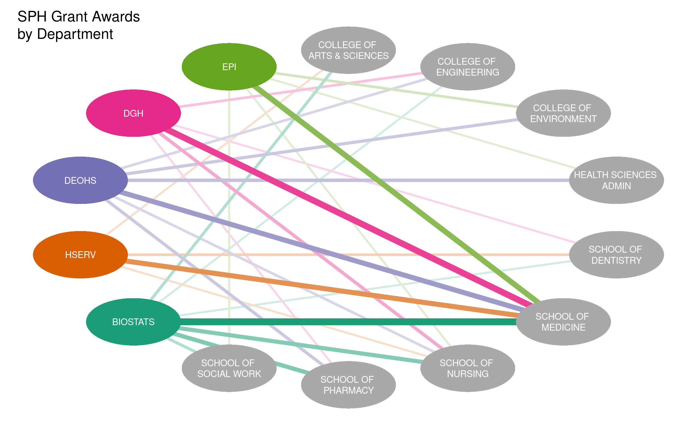

```{r setup, include=FALSE}
knitr::opts_chunk$set(echo = TRUE, message = FALSE)
```

## Research grant network graph

We will make a network graph showing collaboration between various organizations 
at the University of Washington (UW) and the UW School of Public Health (SPH).

The dataset is an aggregated summary of the number of collaborators from the 
UW School of Public Health (SPH) who receive some funding from research grants 
awarded to other organizations at the UW.

## Setup

```{r package_and_data_setup}
# Load packages, installing as needed
repo <- 'https://cloud.r-project.org'
if (!require(pacman)) install.packages('pacman', repos = repo)
pacman::p_load(readr, tidyr, dplyr, qgraph, BBmisc, purrr, RColorBrewer)

# Import summary data
summary_df <- read_csv(file.path('results', 'summary.csv'))
```

## View dataset

We will view the dataset as a table in wide form for better display on the screen.

```{r}
summary_df %>% 
  pivot_wider(id_cols = Org, names_from = `Partner Org Unit`, values_from = Count) %>% 
  mutate(across(where(is.numeric), replace_na, replace = 0)) %>% knitr::kable()
```

## Make the edge list

We will reshape our dataset to prepare for plotting with `qgraph`. The 
result is called the "edge list". Edges are the lines that connect the nodes 
in the graph. The counts are scaled into weights which will be used to set the 
relative line thickness and darkness of the edges.

```{r make_edgelist}
# Make edgelist for plotting
edgelist <- summary_df %>% 
  filter(Org != "SCH OF PUBLIC HEALTH") %>% 
  mutate(Org = gsub('COLL ', 'COLLEGE OF ', Org), 
         Org = gsub('(COLLEGE OF |SCHOOL OF |HEALTH SCIENCES )', '\\1\n', Org)) %>% 
  rename(origin = 'Org', destination = 'Partner Org Unit', weight = 'Count') %>% 
  mutate(weight = normalize(log(weight), method = 'range', range = c(.2, 1)))
```

## Configure colors

We will color the nodes and edges for the SPH departments and leave the other 
organizations with a default node color of grey. The color palette comes from 
the RColorBewer package. We use a dark palette to make the thinner edges easier 
to see.

```{r configure_colors}
# Define vectors or origin names and destination names
origins <- unique(edgelist$origin)
destinations <- unique(edgelist$destination)

# Set color palette
default_color <- 'darkgrey'
color_palette <- as.list(brewer.pal(6, "Dark2")[1:length(destinations)])
names(color_palette) <- destinations

# Set edge and node colors
colors_edge <- unlist(map(edgelist$destination, ~color_palette[[.x]]))
colors_node <- unlist(c(rep(default_color, length(origins)), 
                        map(destinations, ~color_palette[[.x]])))
```

## Plot the graph

We will plot the nodes in a circle and use non-directed edges (i.e., no 
arrowheads). The node shape will be equal-sized ellipses with equal-sized 
labels. The sizes of the various components have been adjusted for readability. 

```{r save_plot_as_png}
# Make plot and save as PNG
qgraph(edgelist, layout = 'circle', directed = FALSE, esize = 8, 
       shape = 'ellipse', node.width = 2, node.height = 1, 
       color = colors_node, edge.color = colors_edge, label.color = 'white', 
       label.scale.equal = TRUE, label.cex = 1.2, borders = FALSE, 
       title = 'SPH Grant Awards\nby Department', details = FALSE, 
       title.cex = 1, filetype = 'png', width = 8, height = 5,
       filename = file.path('figures', 'grant_awards_by_dept'))
```


