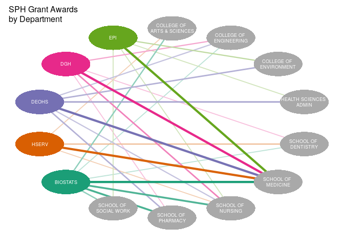

## Research grant network graph

We will make a network graph showing collaboration between various organizations 
at the University of Washington (UW) and the UW School of Public Health (SPH).

The dataset is an aggregated  summary of the number of collaborators from the 
UW School of Public Health (SPH) who receive some funding from research grants 
awarded to other organizations at the UW.

## Setup


```r
# Load packages, installing as needed
repo <- 'https://cloud.r-project.org'
if (!require(pacman)) install.packages('pacman', repos = repo)
pacman::p_load(readr, tidyr, dplyr, here, qgraph, BBmisc, purrr, RColorBrewer)

# Import summary data
summary_df <- read_csv(file.path('results', 'summary.csv'))
```

## View dataset


```r
knitr::kable(summary_df)
```


|Org                    |Partner Org Unit | Count|
|:----------------------|:----------------|-----:|
|COLL ARTS & SCIENCES   |BIOSTATS         |     3|
|COLL ARTS & SCIENCES   |HSERV            |     1|
|COLLEGE OF ENGINEERING |BIOSTATS         |     1|
|COLLEGE OF ENGINEERING |DEOHS            |     2|
|COLLEGE OF ENGINEERING |DGH              |     2|
|COLLEGE OF ENVIRONMENT |DEOHS            |     4|
|COLLEGE OF ENVIRONMENT |EPI              |     2|
|HEALTH SCIENCES ADMIN  |DEOHS            |     6|
|HEALTH SCIENCES ADMIN  |EPI              |     1|
|SCH OF PUBLIC HEALTH   |BIOSTATS         |  2433|
|SCH OF PUBLIC HEALTH   |DEOHS            |   514|
|SCH OF PUBLIC HEALTH   |DGH              |   296|
|SCH OF PUBLIC HEALTH   |EPI              |   362|
|SCH OF PUBLIC HEALTH   |HSERV            |   308|
|SCHOOL OF DENTISTRY    |BIOSTATS         |     1|
|SCHOOL OF DENTISTRY    |DGH              |     1|
|SCHOOL OF DENTISTRY    |HSERV            |     2|
|SCHOOL OF MEDICINE     |BIOSTATS         |   487|
|SCHOOL OF MEDICINE     |DEOHS            |    46|
|SCHOOL OF MEDICINE     |DGH              |   205|
|SCHOOL OF MEDICINE     |EPI              |    77|
|SCHOOL OF MEDICINE     |HSERV            |    43|
|SCHOOL OF NURSING      |BIOSTATS         |    14|
|SCHOOL OF NURSING      |DEOHS            |     2|
|SCHOOL OF NURSING      |DGH              |     5|
|SCHOOL OF NURSING      |EPI              |     1|
|SCHOOL OF NURSING      |HSERV            |     1|
|SCHOOL OF PHARMACY     |BIOSTATS         |    16|
|SCHOOL OF PHARMACY     |DEOHS            |     4|
|SCHOOL OF PHARMACY     |DGH              |     1|
|SCHOOL OF SOCIAL WORK  |BIOSTATS         |     3|
|SCHOOL OF SOCIAL WORK  |EPI              |     1|

## Set the scaling variables

To control line thickness and number of nodes represented, we will set three
variables to be used in the next section.


```r
# Set scaling factor and threshold values to control weights (edge thickness)
scaling_factor <- 5
upper_threshold <- 50
lower_threshold <- 0
```

## Make the edge list

We will reshape our dataset and scale the weights to prepare the data for 
use with `qgraph`. The result is called the "edge list". Edges are the lines
that connect the nodes in the graph.


```r
# Make edgelist for plotting
edgelist <- summary_df %>% filter(Org != "SCH OF PUBLIC HEALTH") %>% 
  mutate(Count = ifelse(Count > upper_threshold, upper_threshold, Count)) %>% 
  mutate(Count = ifelse(Count < lower_threshold, NA, Count)) %>% 
  drop_na(Count) %>% 
  mutate(Org = gsub('COLL ', 'COLLEGE OF ', Org), 
         Org = gsub('(COLLEGE OF |SCHOOL OF |HEALTH SCIENCES )', '\\1\n', Org)) %>% 
  rename(origin = 'Org', destination = 'Partner Org Unit', weight = 'Count') %>% 
  mutate(weight = normalize(log10(weight * scaling_factor), method = 'scale'))
```

## Configure colors

We will color the nodes and edges for the SPH departments and leave the other 
organizations with a default node color of grey.


```r
# Define vectors or origin names and destination names
origins <- unique(edgelist$origin)
destinations <- unique(edgelist$destination)

# Set color palette
default_color <- 'darkgrey'
color_palette <- as.list(brewer.pal(6, "Dark2")[1:length(destinations)])
names(color_palette) <- destinations

# Set edge and node colors
colors_edge <- unlist(map(edgelist$destination, ~color_palette[[.x]]))
colors_node <- unlist(c(rep(default_color, length(origins)), 
                        map(destinations, ~color_palette[[.x]])))
```

## Make the graph


```r
# Make plot
qgraph(edgelist, directed = FALSE, esize = 5, node.width = 2, 
       shape = 'ellipse', node.height = 1, edge.color = colors_edge,
       color = colors_node, label.color = 'white', 
       label.scale.equal = TRUE, label.cex = 1.2, layout = 'circle', 
       borders = FALSE, title = 'SPH Grant Awards\nby Department')
```

<!-- -->
