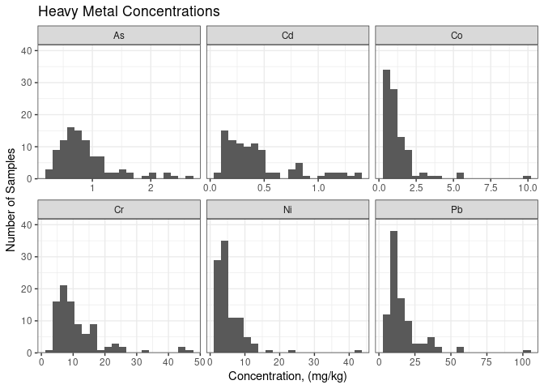
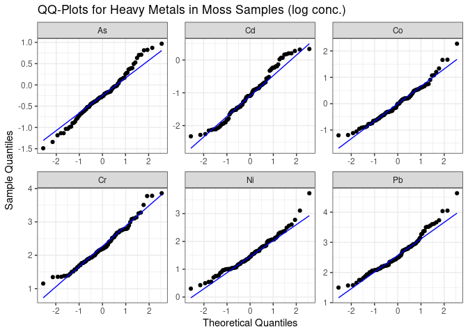
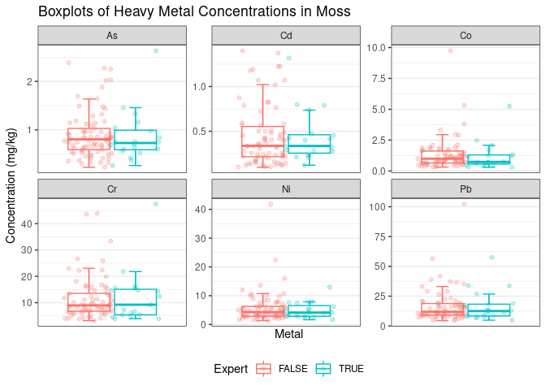
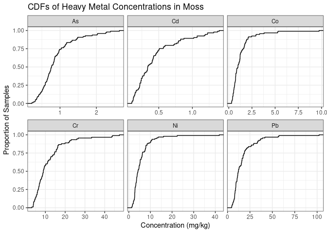
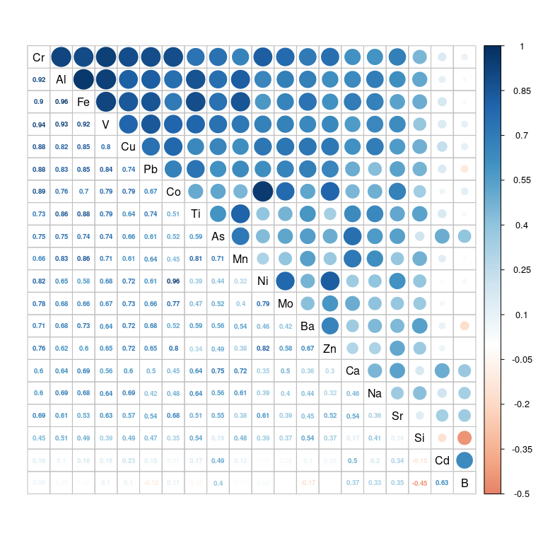
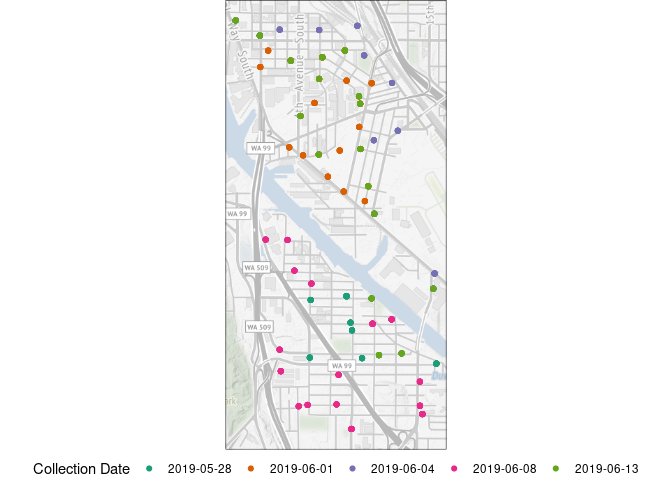
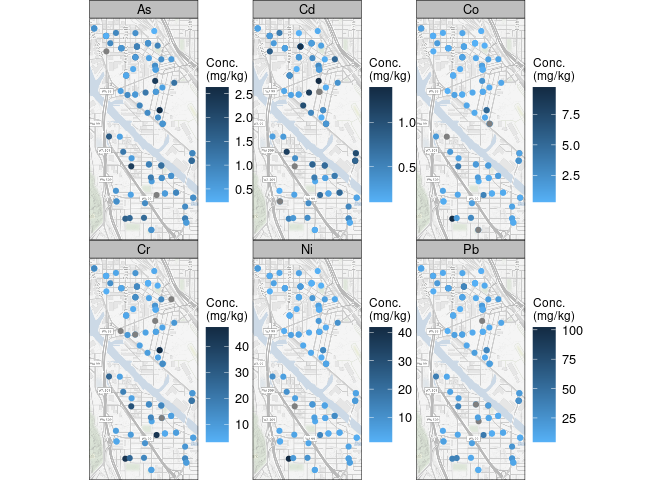

# Setup

Rmarkdown setup and directory organization, and data download.


```r
#-----directory organization and data-----

# set working directory
work_dir <- getwd()

# name and create output directory
output_dir <- file.path(work_dir, "output")
dir.create(output_dir, showWarnings = FALSE, recursive = TRUE)

# create "Datasets" directory if one does not already exist    
dir.create(file.path(work_dir,"data"), showWarnings=FALSE, recursive = TRUE)

# specify data path
data_dir <- file.path(work_dir,"data")

# specify the file name and path
file_name <- "moss.rds"
file_path <- file.path(data_dir, file_name)

# Download the file if it is not already present
if (!file.exists(file_path)) {
    url <- paste("https://staff.washington.edu/czuidema/data", 
                 file_name, sep = '/')
    download.file(url = url, destfile = file_path)
}

# Output a warning message if the file cannot be found
if (file.exists(file_path)) {
    all_data <- readRDS(file_path)
} else warning(paste("Can't find", file_name, "!"))

# remove temporary variables
rm(url, file_name, file_path, data_dir)
```

```
## Warning in rm(url, file_name, file_path, data_dir): object 'url' not found
```


```r
#-----housekeeping-----

# create list objects to hold tables and figures
figs <- list()
tbls <- list()

# create list of metals of interest, and all metals
metals <- c("As", "Cd", "Co", "Cr", "Ni", "Pb")
all_metals <- str_subset(string = names(all_data), pattern = "^[[:alpha:]]{1,2}$")

# create a smaller dataset to work with for most of our plots
moss <- all_data %>% select(-setdiff(all_metals, metals))

# print message
print(c("This document focuses on the following priority metals:", metals))
```

```
## [1] "This document focuses on the following priority metals:"
## [2] "As"                                                     
## [3] "Cd"                                                     
## [4] "Co"                                                     
## [5] "Cr"                                                     
## [6] "Ni"                                                     
## [7] "Pb"
```


# Introduction

## Exploratory data analysis

This script focuses on Exploratory Data Analysis (EDA) - an important step for
any data analysis project. EDA relies on visualization and transformation to
explore your data. This step happens after and in conjunction with data
"wrangling," which we've previously discussed, and before deeper statistical
analysis you'll undertake as your project progresses. EDA is a means to gain
general and broad understanding of a dataset, and explore and generate
preliminary hypotheses.

There are no strict rules for EDA - and you'll start many lines of inquiry that
won't make it through to your final analysis. Here are some questions to think
about as you approach EDA:

  * How many observations and variables do the data have?
  * What are the variable types?
  * What do the distributions look like? Are they normally or lognormally
    distributed?
  * Are variables correlated or do some variables covary? 
  * Are there measurements below the detection limits?
  * How much missingness is there?

The goal of this script is to provide ideas, suggestions, and examples of EDA
that may translate to other datasets. A great resource on EDA is 
[R for Data Science](https://r4ds.had.co.nz/exploratory-data-analysis.html).

## About this data

This data was collected as part of a moss bioindicator study of heavy metal air
pollution. Briefly, moss accumulates heavy metals from air pollution, and we can
learn about the relative differences in heavy metals (not their absolute
concentrations) in an area by quantifying the concentration of metals in moss
samples. 

I've added random error to the measurements and sampling locations of the
original data because they have not yet been published or made public.

# Data characteristics

Here we look at what the data type is, its dimensions, and other attributes. 


```r
#-----dimensions & variable classes-----

# show top of dataframe
head(moss)
```

```
## # A tibble: 6 x 14
##   LabNum     SampleName GridCellNu Expert Replicate Collection_date Field_Lat
##   <chr>      <chr>           <int> <lgl>  <lgl>     <date>              <dbl>
## 1 19-SYC-030 68                 68 FALSE  FALSE     2019-05-28           47.5
## 2 19-SYC-011 54                 54 FALSE  FALSE     2019-05-28           47.5
## 3 19-SYC-056 55a                55 FALSE  FALSE     2019-05-28           47.5
## 4 19-SYC-022 55b                55 FALSE  FALSE     2019-05-28           47.5
## 5 19-SYC-045 56                 56 FALSE  FALSE     2019-05-28           47.5
## 6 19-SYC-068 61                 61 FALSE  FALSE     2019-05-28           47.5
## # … with 7 more variables: Field_Long <dbl>, Ni <dbl>, Cr <dbl>, Co <dbl>,
## #   Cd <dbl>, Pb <dbl>, As <dbl>
```

```r
# show dimensions
dim(moss)
```

```
## [1] 99 14
```

```r
# show variable classes
lapply(moss, class) %>% bind_rows()
```

```
## # A tibble: 1 x 14
##   LabNum    SampleName GridCellNu Expert  Replicate Collection_date Field_Lat
##   <chr>     <chr>      <chr>      <chr>   <chr>     <chr>           <chr>    
## 1 character character  integer    logical logical   Date            numeric  
## # … with 7 more variables: Field_Long <chr>, Ni <chr>, Cr <chr>, Co <chr>,
## #   Cd <chr>, Pb <chr>, As <chr>
```

```r
# count data by a variable
count(moss, Expert)
```

```
## # A tibble: 2 x 2
##   Expert     n
##   <lgl>  <int>
## 1 FALSE     79
## 2 TRUE      20
```

```r
# use `glimpse` to provide another view
glimpse(moss)
```

```
## Rows: 99
## Columns: 14
## $ LabNum          <chr> "19-SYC-030", "19-SYC-011", "19-SYC-056", "19-SYC-022"…
## $ SampleName      <chr> "68", "54", "55a", "55b", "56", "61", "66", "67a", "67…
## $ GridCellNu      <int> 68, 54, 55, 55, 56, 61, 66, 67, 67, 69, 70, 70, 7, 8, …
## $ Expert          <lgl> FALSE, FALSE, FALSE, FALSE, FALSE, FALSE, FALSE, FALSE…
## $ Replicate       <lgl> FALSE, FALSE, FALSE, FALSE, FALSE, FALSE, FALSE, FALSE…
## $ Collection_date <date> 2019-05-28, 2019-05-28, 2019-05-28, 2019-05-28, 2019-…
## $ Field_Lat       <dbl> 47.52925, 47.53177, 47.53210, 47.53207, 47.53190, 47.5…
## $ Field_Long      <dbl> -122.3230, -122.3281, -122.3237, -122.3237, -122.3206,…
## $ Ni              <dbl> 3.430598, NA, 7.161781, 8.465356, 3.042101, 6.394777, …
## $ Cr              <dbl> 6.932598, 33.396307, 12.748623, 14.636759, 6.201848, 1…
## $ Co              <dbl> 0.5199853, 3.8066893, 1.2187047, 1.7634250, 0.6458802,…
## $ Cd              <dbl> 0.1681445, NA, 0.2167543, 0.8245584, 0.7888315, 0.5679…
## $ Pb              <dbl> NA, 34.931021, 16.228206, NA, NA, 15.863440, 11.403187…
## $ As              <dbl> 0.5655733, 2.2548039, 0.6543646, 1.0291790, 1.1456581,…
```

# Transforming data

From the steps above, we can see our data is "wide" meaning each variable is in
a separate column. Many data operations are easier when data are in "long"
format - where features, names, or data characteristics are presented in one
column and the values are in another column.

In this example, we're going to transform all of the metal concentration columns
in our original "wide" dataframe and put the metal names in one column and the
concentrations in another.


```r
#-----to long dataframe-----

# create long dataframe
moss_long <- moss %>% 
  pivot_longer(cols = all_of(metals), names_to = "Metal", values_to = "Conc") 

# show top of long dataframe
head(moss_long) %>% knitr::kable()
```


|LabNum     |SampleName | GridCellNu|Expert |Replicate |Collection_date | Field_Lat| Field_Long|Metal |      Conc|
|:----------|:----------|----------:|:------|:---------|:---------------|---------:|----------:|:-----|---------:|
|19-SYC-030 |68         |         68|FALSE  |FALSE     |2019-05-28      |  47.52925|   -122.323|As    | 0.5655733|
|19-SYC-030 |68         |         68|FALSE  |FALSE     |2019-05-28      |  47.52925|   -122.323|Cd    | 0.1681445|
|19-SYC-030 |68         |         68|FALSE  |FALSE     |2019-05-28      |  47.52925|   -122.323|Co    | 0.5199853|
|19-SYC-030 |68         |         68|FALSE  |FALSE     |2019-05-28      |  47.52925|   -122.323|Cr    | 6.9325977|
|19-SYC-030 |68         |         68|FALSE  |FALSE     |2019-05-28      |  47.52925|   -122.323|Ni    | 3.4305980|
|19-SYC-030 |68         |         68|FALSE  |FALSE     |2019-05-28      |  47.52925|   -122.323|Pb    |        NA|


# Descriptive statistics

A major task of EDA is calculating basic descriptive statistics. One way to do
this is by using (or transforming) your dataset to a "long" form, and then with
the `dplyr` `group_by()` and `summarise()` functions.


```r
#-----metal summary-----

tbls[["summary_tbl"]] <- moss_long %>% 
  
  # group by and calculate summary statistics
  group_by(Metal) %>%
  summarise(Min = min(Conc, na.rm = TRUE), 
            Max = max(Conc, na.rm = TRUE), 
            Mean = mean(Conc, na.rm = TRUE),
            Median = median(Conc, na.rm = TRUE), 
            missing = sum(is.na(Conc)), 
            .groups = "drop") %>% 
  
  # round by mutating on a predicate function
  mutate_if(is.numeric, round, 3)

tbls[["summary_tbl"]] %>% knitr::kable()
```


|Metal |   Min|     Max|   Mean| Median| missing|
|:-----|-----:|-------:|------:|------:|-------:|
|As    | 0.225|   2.634|  0.888|  0.766|       2|
|Cd    | 0.098|   1.399|  0.446|  0.336|       6|
|Co    | 0.300|   9.738|  1.301|  0.990|       7|
|Cr    | 3.169|  47.433| 11.687|  8.964|       9|
|Ni    | 1.351|  41.817|  5.619|  4.245|       2|
|Pb    | 4.478| 102.188| 16.688| 12.200|       6|


Similar calculations can be performed on a "wide" dataset using `dplyr` functions
`summarise()` and `across()`.


```r
#-----mutate across-----

# create a list of summary functions
summ_list <- list(
  
  mean = ~mean(.x, na.rm = TRUE),
  sd = ~sd(.x, na.rm = TRUE),
  min = ~min(.x, na.rm = TRUE),
  median = ~median(.x, na.rm = TRUE),
  max = ~max(.x, na.rm = TRUE)
  
)

# run summary functions across dataframe with function names 
# (can be done with or without groups)
moss %>%  
  select(Expert, all_of(metals)) %>%
  #group_by(Expert) %>%
  summarise(across(where(is.double), 
                   summ_list, 
                   .names = "{.col}_{.fn}") ) %>% 
  mutate_if(is.numeric, round, 3) %>%
  pivot_longer(cols = everything(), names_to = "var", values_to = "val") %>%
  separate(var, into = c('metal', 'stat'), sep = '_') %>% 
  pivot_wider(id_cols = c(metal), names_from = stat, values_from = val) %>%
  knitr::kable()
```


|metal |   mean|     sd|   min| median|     max|
|:-----|------:|------:|-----:|------:|-------:|
|As    |  0.888|  0.488| 0.225|  0.766|   2.634|
|Cd    |  0.446|  0.329| 0.098|  0.336|   1.399|
|Co    |  1.301|  1.275| 0.300|  0.990|   9.738|
|Cr    | 11.687|  8.539| 3.169|  8.964|  47.433|
|Ni    |  5.619|  5.016| 1.351|  4.245|  41.817|
|Pb    | 16.688| 13.822| 4.478| 12.200| 102.188|


# Describe data distributions

## Histograms

Histograms can help visualize the distribution of a continuous variable. Let's
look at histograms of the heavy metal concentrations.


```r
#-----histograms----

figs[["histograms"]] <- ggplot(data = moss_long, aes(x = Conc)) + 
  
  # specify histograms
  geom_histogram(bins = 20) + 
  
  # facet wrap by metal
  facet_wrap(~Metal, scales = "free_x") +
  
  # specify y axis lower limit equal to zero
  scale_y_continuous(expand = expansion(mult = c(0, .1))) +
  
  # plot labels
  labs(x = "Concentration, (mg/kg)", y = "Number of Samples ", 
       title = "Heavy Metal Concentrations") +
  
  # choose theme
  theme_bw()

# show plot
figs[["histograms"]]
```

<!-- -->


## Quantile-quantile (Q-Q) plots

The histograms indicate the metal distributions are log-normally distributed.
One method to investigate the normality of a variable is to plot it against the
the theoretical quantiles of a comparable normal distribution.

`ggplot` makes this easy, and to look at the log-normality of the heavy metal
concentrations we can simply plot the `log(Conc)`. This quick visualization help
you decide if further analysis steps should be conducted on log-transformed
data.


```r
#-----qq plot between experts and nonexperts------

figs[["qq"]] <- ggplot(data = moss_long, aes(sample = log(Conc)) ) + 
  stat_qq() +
  stat_qq_line(colour = "blue") + 
  facet_wrap(~Metal, scales = "free") +
  
  labs(x = "Theoretical Quantiles", 
       y = "Sample Quantiles", 
       title = "QQ-Plots for Heavy Metals in Moss Samples (log conc.)")+
  
  theme_bw()

figs[["qq"]]
```

```
## Warning: Removed 32 rows containing non-finite values (stat_qq).
```

```
## Warning: Removed 32 rows containing non-finite values (stat_qq_line).
```

<!-- -->


## Boxplots

Boxplots are a simple, yet effective means to visualize data distributions. Here
is an example comparing groups within the data. This also provides an example of
including all the points "within" the boxplot to gain a better understanding of
the spread of the data.


```r
#-----box plots-----

figs[["boxes"]] <- ggplot(data = moss_long, 
                          aes(x = as.factor(Metal), y = Conc, color = Expert) ) +
  
  # specify geoms
  stat_boxplot(geom = "errorbar", width = 0.2, position = position_dodge(0.75))+
  geom_boxplot(outlier.shape = NA) +  
  geom_point(position = position_jitterdodge(), alpha = 0.25, width = 0.35) +
  
  # facet wrap by metal
  facet_wrap(~Metal, scales = "free") +
  
  # specify x as discrete
  scale_x_discrete(breaks = NULL) +
  
  # labels
  labs(x = "Metal", y = "Concentration (mg/kg)", 
       title = "Boxplots of Heavy Metal Concentrations in Moss") +
  
  # choose theme
  theme_bw() +
  
  # legend position
  theme(legend.position = "bottom")

# show plot  
figs[["boxes"]]
```

<!-- -->


## Cumulative density function (CDF) plots

CDF plots display the the data values against the cumulative distribution. They
are popular among exposure scientists. It might take some practice interpreting
these types of figures, but they communicate a lot of information, and form the
basis for some non-parametric statistical tests (Kolmogorov–Smirnov, "K-S,"
test).


```r
#-----cumulative density plots------

figs[["ecdf"]] <- ggplot(data = moss_long, aes(x = Conc)) +
  # specify CDF
  stat_ecdf(geom = "step") + 
  
  # facet wrap by metal
  facet_wrap(~Metal, scales = "free_x") +
  
  # labels
  labs(x = "Concentration (mg/kg)", y = "Proportion of Samples ", 
       title = "CDFs of Heavy Metal Concentrations in Moss") +
  
  # choose theme
  theme_bw()

# show plot  
figs[["ecdf"]]
```

<!-- -->


## Pearson correlation

This dataset does not have a ton of varibales to investigate univariate
correlation, but we can take a look and see if all the metals in the samples are
correlated. We'll use the full dataset (`all_data`) to do this. The easiest way
to visualize a correlation I have found is with the `corrplot` package. The
[vingette page](https://cran.r-project.org/web/packages/corrplot/vignettes/corrplot-intro.html)
provides nice plot ideas and tricks. The drawback with `corrplot` is that the
plots have to be saved when they are made - the plots themselves cannot be
assigned to an object. To avoid calling the same `corrplot()` command more than
once, I've found making a simple wrapper then calling the wrapper function
simplifies things a bit, especially as you fiddle with the appearance.


```r
#-----correlation plots-----

# select all metals and calculate pearson correlation, with complete observations
pearson_corr <- all_data %>% 
    select(all_of(all_metals)) %>% 
    cor(use = "complete.obs")

# create wrapper function for corrplot for display and saving
corrplot_fn <- function(df = pearson_corr) {
  corrplot.mixed(df, 
                 
                 # order type (FPC: first principal component)
                 order = "FPC",
                 
                 # inner text (coefficients) size, & color
                 number.cex = .6, #lower.col = "black"),
                 
                 # outer text color
                 tl.col = "black", 
                 
                 # define color limits
                 cl.lim = c(-0.5, 1)
                 ) 
}


# display correlation plot 
corrplot_fn() 
```

<!-- -->

```r
# save correlation plot 
png(file=file.path(output_dir, "correlation.png"))
corrplot_fn()
dev.off()
```

```
## png 
##   2
```

## Sampling maps

Creating maps is topic all its own, and later in the term we will be taking a
deeper dive into spatial data and tools and methods to work with spatial data.
That said, here are a couple quick examples of maps that offer a relatively
simple way to visually represent some spatial features of data using the `ggmap`
package.


```r
#-----sampling map-----

# define the bounding box for the map
bbox <- with(moss_long, make_bbox(lon = Field_Long, lat = Field_Lat) )

# make a map of the base layer of stamen tiles 
map <- suppressMessages(get_stamenmap(bbox, zoom = 14, maptype = "terrain"))

# make the map image from the tiles
basemap <- ggmap(map, darken = c(0.5, "white")) + theme_void()


figs[["sampling_map"]] <- basemap +
      
  # locations with points colored by their sampling date
  geom_point(data = moss_long, 
             aes(x = Field_Long, y = Field_Lat, 
                 color = factor(Collection_date))) +
  
  # labels
  labs(color = "Collection Date") +
    
  # choose a color scale
  scale_color_brewer(palette = "Dark2") +
    
  # theme for legend and border
  theme(legend.position = "bottom",
        panel.border = element_rect(colour = "black", fill = NA)
        )

# show figure
figs[["sampling_map"]]
```

<!-- -->

## Concentration maps

To create some basic maps of the spatial distribution of moss metal
concentrations, we need to use somewhat convoluted code. The problem is that in
`ggplot` there is no `free_z` argument for `facet_wrap()`, meaning our metal
concentrations will be displayed on the same color scale.

That doesn't work out well when the different measurements we are displaying are
on different scales or have very different effective ranges, a reasonably common
problem for spatial data. To work around this, the approach below creates
separate plots for each variable (metal) of interest, then combines them into
one figure.


```r
#-----map concentrations-------

# make a function to run mapping code for each metal
map_fn <- function(metal){
  
  # start with basemap 
  basemap +
    
    # add locations with concentrations
    geom_point(data = moss_long %>% filter(Metal == metal), 
               aes(x = Field_Long, y = Field_Lat, color = Conc ) )+ 
    
    # this just adds the facet ribbon
    facet_wrap(~Metal) + 
    
    # color bar label
    labs(color = "Conc.\n(mg/kg)") +
    
    # color scale
    scale_color_continuous(low = "#56B1F7", high = "#132B43") +
  
    # theme (mostly text adjustment)
    theme(text = element_text(size = 12),
          legend.title = element_text(size = 9),
          strip.background = element_rect(fill = "grey"), 
          panel.border = element_rect(colour = "black", fill = NA),
          strip.text.x = element_text(margin = margin(2, 0, 2, 0)) 
          )
  }


# run map function over metals and set names
maps_list <- lapply(metals, map_fn) %>% set_names(paste0("map_", metals) )


# add combined maps to figs list
figs[["map_all_metals"]] <- egg::ggarrange(plots = maps_list, ncol = 3)
```

<!-- -->

```r
# remove temporary variables
#rm(bbox, map, maps_list)
```


# Save figures and tables

Save figures to `.png` files and tables to `.csv` files in `output` directory. 


# Code appendix

## Session information


```r
#-----session info: beginning of Code Appendix-----

sessionInfo()
```

```
## R version 3.6.3 (2020-02-29)
## Platform: x86_64-pc-linux-gnu (64-bit)
## Running under: Ubuntu 20.04.2 LTS
## 
## Matrix products: default
## BLAS:   /usr/lib/x86_64-linux-gnu/blas/libblas.so.3.9.0
## LAPACK: /usr/lib/x86_64-linux-gnu/lapack/liblapack.so.3.9.0
## 
## locale:
##  [1] LC_CTYPE=en_US.UTF-8       LC_NUMERIC=C              
##  [3] LC_TIME=en_US.UTF-8        LC_COLLATE=en_US.UTF-8    
##  [5] LC_MONETARY=en_US.UTF-8    LC_MESSAGES=en_US.UTF-8   
##  [7] LC_PAPER=en_US.UTF-8       LC_NAME=C                 
##  [9] LC_ADDRESS=C               LC_TELEPHONE=C            
## [11] LC_MEASUREMENT=en_US.UTF-8 LC_IDENTIFICATION=C       
## 
## attached base packages:
## [1] stats     graphics  grDevices utils     datasets  methods   base     
## 
## other attached packages:
##  [1] egg_0.4.5      gridExtra_2.3  ggmap_3.0.0    broom_0.7.5    ggrepel_0.9.1 
##  [6] corrplot_0.84  readr_1.4.0    magrittr_2.0.1 purrr_0.3.4    ggplot2_3.3.3 
## [11] stringr_1.4.0  tidyr_1.1.3    dplyr_1.0.5    knitr_1.31     pacman_0.5.1  
## 
## loaded via a namespace (and not attached):
##  [1] tidyselect_1.1.0    xfun_0.22           lattice_0.20-40    
##  [4] colorspace_2.0-0    vctrs_0.3.7         generics_0.1.0     
##  [7] htmltools_0.5.1.1   yaml_2.2.1          utf8_1.2.1         
## [10] rlang_0.4.10        pillar_1.5.1        glue_1.4.2         
## [13] withr_2.4.1         DBI_1.1.1           RColorBrewer_1.1-2 
## [16] sp_1.4-5            jpeg_0.1-8.1        lifecycle_1.0.0    
## [19] plyr_1.8.6          munsell_0.5.0       gtable_0.3.0       
## [22] RgoogleMaps_1.4.5.3 evaluate_0.14       labeling_0.4.2     
## [25] curl_4.3            fansi_0.4.2         highr_0.8          
## [28] Rcpp_1.0.6          scales_1.1.1        backports_1.2.1    
## [31] farver_2.1.0        rjson_0.2.20        hms_1.0.0          
## [34] png_0.1-7           digest_0.6.27       stringi_1.5.3      
## [37] grid_3.6.3          cli_2.3.1           tools_3.6.3        
## [40] bitops_1.0-6        tibble_3.1.0        crayon_1.4.1       
## [43] pkgconfig_2.0.3     ellipsis_0.3.1      assertthat_0.2.1   
## [46] rmarkdown_2.7       httr_1.4.2          rstudioapi_0.13    
## [49] R6_2.5.0            compiler_3.6.3
```

## Code in the R Markdown file


```r
#-----setup options-----

# knitr options:
knitr::opts_chunk$set(echo = TRUE)

#-----load libraries pacman-----

# load pacman, installing if needed
if (!require("pacman")) {install.packages("pacman")}

# load other packages, installing as needed
pacman::p_load(knitr, dplyr, tidyr, stringr, ggplot2, purrr, magrittr, readr,
               corrplot, ggrepel, broom, ggmap, egg)

#-----directory organization and data-----

# set working directory
work_dir <- getwd()

# name and create output directory
output_dir <- file.path(work_dir, "output")
dir.create(output_dir, showWarnings = FALSE, recursive = TRUE)

# create "Datasets" directory if one does not already exist    
dir.create(file.path(work_dir,"data"), showWarnings=FALSE, recursive = TRUE)

# specify data path
data_dir <- file.path(work_dir,"data")

# specify the file name and path
file_name <- "moss.rds"
file_path <- file.path(data_dir, file_name)

# Download the file if it is not already present
if (!file.exists(file_path)) {
    url <- paste("https://staff.washington.edu/czuidema/data", 
                 file_name, sep = '/')
    download.file(url = url, destfile = file_path)
}

# Output a warning message if the file cannot be found
if (file.exists(file_path)) {
    all_data <- readRDS(file_path)
} else warning(paste("Can't find", file_name, "!"))

# remove temporary variables
rm(url, file_name, file_path, data_dir)

#-----housekeeping-----

# create list objects to hold tables and figures
figs <- list()
tbls <- list()

# create list of metals of interest, and all metals
metals <- c("As", "Cd", "Co", "Cr", "Ni", "Pb")
all_metals <- str_subset(string = names(all_data), pattern = "^[[:alpha:]]{1,2}$")

# create a smaller dataset to work with for most of our plots
moss <- all_data %>% select(-setdiff(all_metals, metals))

# print message
print(c("This document focuses on the following priority metals:", metals))

#-----dimensions & variable classes-----

# show top of dataframe
head(moss)

# show dimensions
dim(moss)

# show variable classes
lapply(moss, class) %>% bind_rows()

# count data by a variable
count(moss, Expert)

# use `glimpse` to provide another view
glimpse(moss)

#-----to long dataframe-----

# create long dataframe
moss_long <- moss %>% 
  pivot_longer(cols = all_of(metals), names_to = "Metal", values_to = "Conc") 

# show top of long dataframe
head(moss_long) %>% knitr::kable()

#-----metal summary-----

tbls[["summary_tbl"]] <- moss_long %>% 
  
  # group by and calculate summary statistics
  group_by(Metal) %>%
  summarise(Min = min(Conc, na.rm = TRUE), 
            Max = max(Conc, na.rm = TRUE), 
            Mean = mean(Conc, na.rm = TRUE),
            Median = median(Conc, na.rm = TRUE), 
            missing = sum(is.na(Conc)), 
            .groups = "drop") %>% 
  
  # round by mutating on a predicate function
  mutate_if(is.numeric, round, 3)

tbls[["summary_tbl"]] %>% knitr::kable()

#-----mutate across-----

# create a list of summary functions
summ_list <- list(
  
  mean = ~mean(.x, na.rm = TRUE),
  sd = ~sd(.x, na.rm = TRUE),
  min = ~min(.x, na.rm = TRUE),
  median = ~median(.x, na.rm = TRUE),
  max = ~max(.x, na.rm = TRUE)
  
)

# run summary functions across dataframe with function names 
# (can be done with or without groups)
moss %>%  
  select(Expert, all_of(metals)) %>%
  #group_by(Expert) %>%
  summarise(across(where(is.double), 
                   summ_list, 
                   .names = "{.col}_{.fn}") ) %>% 
  mutate_if(is.numeric, round, 3) %>%
  pivot_longer(cols = everything(), names_to = "var", values_to = "val") %>%
  separate(var, into = c('metal', 'stat'), sep = '_') %>% 
  pivot_wider(id_cols = c(metal), names_from = stat, values_from = val) %>%
  knitr::kable()


#-----histograms----

figs[["histograms"]] <- ggplot(data = moss_long, aes(x = Conc)) + 
  
  # specify histograms
  geom_histogram(bins = 20) + 
  
  # facet wrap by metal
  facet_wrap(~Metal, scales = "free_x") +
  
  # specify y axis lower limit equal to zero
  scale_y_continuous(expand = expansion(mult = c(0, .1))) +
  
  # plot labels
  labs(x = "Concentration, (mg/kg)", y = "Number of Samples ", 
       title = "Heavy Metal Concentrations") +
  
  # choose theme
  theme_bw()

# show plot
figs[["histograms"]]

#-----qq plot between experts and nonexperts------

figs[["qq"]] <- ggplot(data = moss_long, aes(sample = log(Conc)) ) + 
  stat_qq() +
  stat_qq_line(colour = "blue") + 
  facet_wrap(~Metal, scales = "free") +
  
  labs(x = "Theoretical Quantiles", 
       y = "Sample Quantiles", 
       title = "QQ-Plots for Heavy Metals in Moss Samples (log conc.)")+
  
  theme_bw()

figs[["qq"]]

#-----box plots-----

figs[["boxes"]] <- ggplot(data = moss_long, 
                          aes(x = as.factor(Metal), y = Conc, color = Expert) ) +
  
  # specify geoms
  stat_boxplot(geom = "errorbar", width = 0.2, position = position_dodge(0.75))+
  geom_boxplot(outlier.shape = NA) +  
  geom_point(position = position_jitterdodge(), alpha = 0.25, width = 0.35) +
  
  # facet wrap by metal
  facet_wrap(~Metal, scales = "free") +
  
  # specify x as discrete
  scale_x_discrete(breaks = NULL) +
  
  # labels
  labs(x = "Metal", y = "Concentration (mg/kg)", 
       title = "Boxplots of Heavy Metal Concentrations in Moss") +
  
  # choose theme
  theme_bw() +
  
  # legend position
  theme(legend.position = "bottom")

# show plot  
figs[["boxes"]]

#-----cumulative density plots------

figs[["ecdf"]] <- ggplot(data = moss_long, aes(x = Conc)) +
  # specify CDF
  stat_ecdf(geom = "step") + 
  
  # facet wrap by metal
  facet_wrap(~Metal, scales = "free_x") +
  
  # labels
  labs(x = "Concentration (mg/kg)", y = "Proportion of Samples ", 
       title = "CDFs of Heavy Metal Concentrations in Moss") +
  
  # choose theme
  theme_bw()

# show plot  
figs[["ecdf"]]

#-----correlation plots-----

# select all metals and calculate pearson correlation, with complete observations
pearson_corr <- all_data %>% 
    select(all_of(all_metals)) %>% 
    cor(use = "complete.obs")

# create wrapper function for corrplot for display and saving
corrplot_fn <- function(df = pearson_corr) {
  corrplot.mixed(df, 
                 
                 # order type (FPC: first principal component)
                 order = "FPC",
                 
                 # inner text (coefficients) size, & color
                 number.cex = .6, #lower.col = "black"),
                 
                 # outer text color
                 tl.col = "black", 
                 
                 # define color limits
                 cl.lim = c(-0.5, 1)
                 ) 
}


# display correlation plot 
corrplot_fn() 

# save correlation plot 
png(file=file.path(output_dir, "correlation.png"))
corrplot_fn()
dev.off()

#-----sampling map-----

# define the bounding box for the map
bbox <- with(moss_long, make_bbox(lon = Field_Long, lat = Field_Lat) )

# make a map of the base layer of stamen tiles 
map <- suppressMessages(get_stamenmap(bbox, zoom = 14, maptype = "terrain"))

# make the map image from the tiles
basemap <- ggmap(map, darken = c(0.5, "white")) + theme_void()


figs[["sampling_map"]] <- basemap +
      
  # locations with points colored by their sampling date
  geom_point(data = moss_long, 
             aes(x = Field_Long, y = Field_Lat, 
                 color = factor(Collection_date))) +
  
  # labels
  labs(color = "Collection Date") +
    
  # choose a color scale
  scale_color_brewer(palette = "Dark2") +
    
  # theme for legend and border
  theme(legend.position = "bottom",
        panel.border = element_rect(colour = "black", fill = NA)
        )

# show figure
figs[["sampling_map"]]

#-----map concentrations-------

# make a function to run mapping code for each metal
map_fn <- function(metal){
  
  # start with basemap 
  basemap +
    
    # add locations with concentrations
    geom_point(data = moss_long %>% filter(Metal == metal), 
               aes(x = Field_Long, y = Field_Lat, color = Conc ) )+ 
    
    # this just adds the facet ribbon
    facet_wrap(~Metal) + 
    
    # color bar label
    labs(color = "Conc.\n(mg/kg)") +
    
    # color scale
    scale_color_continuous(low = "#56B1F7", high = "#132B43") +
  
    # theme (mostly text adjustment)
    theme(text = element_text(size = 12),
          legend.title = element_text(size = 9),
          strip.background = element_rect(fill = "grey"), 
          panel.border = element_rect(colour = "black", fill = NA),
          strip.text.x = element_text(margin = margin(2, 0, 2, 0)) 
          )
  }


# run map function over metals and set names
maps_list <- lapply(metals, map_fn) %>% set_names(paste0("map_", metals) )


# add combined maps to figs list
figs[["map_all_metals"]] <- egg::ggarrange(plots = maps_list, ncol = 3)

# remove temporary variables
#rm(bbox, map, maps_list)

#-----save figures to output directory------

# save figures as ".png", ".jpg", or ".pdf" (and more) using lapply and ggsave
# units can be specified as "in", "cm"
lapply(names(figs),function(x){
  ggsave(filename = file.path(output_dir, paste0(x,".png")), plot = figs[[x]], 
         width = 6, height = 4, units = "in", dpi = "print")
  })

#-----save tables to output directory-----

lapply(names(tbls), function(x){
  write_csv(tbls[[x]], path = file.path(output_dir, paste0(x,".csv")))
    })

#-----session info: beginning of Code Appendix-----

sessionInfo()

#-----appendix code-----

#-----functions used in this Rmd-----

# Show the names of all functions used (loaded in the current environment)
(fn_names <- lsf.str())

# Show the definitions of all functions loaded into the current environment 
map(fn_names, get, .GlobalEnv) %>% set_names(fn_names)
```

## User-written functions loaded in the R Markdown environment


```r
#-----functions used in this Rmd-----

# Show the names of all functions used (loaded in the current environment)
(fn_names <- lsf.str())
```

```
## corrplot_fn : function (df = pearson_corr)  
## map_fn : function (metal)
```

```r
# Show the definitions of all functions loaded into the current environment 
map(fn_names, get, .GlobalEnv) %>% set_names(fn_names)
```

```
## $corrplot_fn
## function(df = pearson_corr) {
##   corrplot.mixed(df, 
##                  
##                  # order type (FPC: first principal component)
##                  order = "FPC",
##                  
##                  # inner text (coefficients) size, & color
##                  number.cex = .6, #lower.col = "black"),
##                  
##                  # outer text color
##                  tl.col = "black", 
##                  
##                  # define color limits
##                  cl.lim = c(-0.5, 1)
##                  ) 
## }
## <bytecode: 0x55b7a617c600>
## 
## $map_fn
## function(metal){
##   
##   # start with basemap 
##   basemap +
##     
##     # add locations with concentrations
##     geom_point(data = moss_long %>% filter(Metal == metal), 
##                aes(x = Field_Long, y = Field_Lat, color = Conc ) )+ 
##     
##     # this just adds the facet ribbon
##     facet_wrap(~Metal) + 
##     
##     # color bar label
##     labs(color = "Conc.\n(mg/kg)") +
##     
##     # color scale
##     scale_color_continuous(low = "#56B1F7", high = "#132B43") +
##   
##     # theme (mostly text adjustment)
##     theme(text = element_text(size = 12),
##           legend.title = element_text(size = 9),
##           strip.background = element_rect(fill = "grey"), 
##           panel.border = element_rect(colour = "black", fill = NA),
##           strip.text.x = element_text(margin = margin(2, 0, 2, 0)) 
##           )
##   }
## <bytecode: 0x55b7a88aeb38>
```
