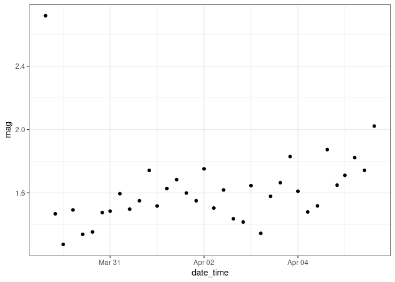
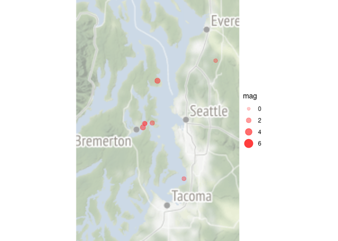

# Setup

Rmarkdown setup and directory organization, and data download.


```r
#-----directory organization and data-----

# set working directory
work_dir <- getwd()

# name and create output directory
output_dir <- file.path(work_dir, "output")
dir.create(output_dir, showWarnings = TRUE, recursive = TRUE)

# create "Datasets" directory if one does not already exist    
dir.create(file.path(work_dir,"data"), showWarnings=FALSE, recursive = TRUE)

# specify data path
data_dir <- file.path(work_dir,"data")

# specify the file name and path
file_name <- "all_week.csv"
file_path <- file.path(data_dir, file_name)

# Download the file if it is not already present
if (!file.exists(file_path)) {
    url <- paste("https://earthquake.usgs.gov/earthquakes/feed/v1.0/summary", 
                 file_name, sep = '/')
    download.file(url = url, destfile = file_path)
}

# Output a warning message if the file cannot be found
if (file.exists(file_path)) {
    all_data <- read_csv(file_path)
} else warning(paste("Can't find", file_name, "!"))

# remove temporary variables
rm(url, file_name, file_path, data_dir)
```


# Introduction

## Goal

The goal of this script is to provide ideas, suggestions, and examples of exploratory data analysis (EDA) for spatial and temporal data. For this exercise we will use publicly available data from the USGS earthquake hazards data feed. 

## Exploratory Analysis Part 2: Spatial and Temporal Data 

The goal of EDA is to get acquainted with data, to explore a data set to see what it might tell us, without being a set of specific techniques. EDA is an iterative cycle, where we 1) generate questions about data, 2) search for answers visualizing, transforming and modeling of data, and 3) refine your questions and/or generate new questions. (Hadley Wickham's definition)

Exploring multidimensional data, i.e. data with two or more referential components, for example space and time, can be more complex. The same space and time-referenced data can be viewed as a spatial arrangement of local behaviors over time and as a temporal sequence of momentary behaviors over space. The behavior of multidimensional data may be viewed from different perspectives. 

## Topics covered in Exploratory Data Analysis Part 1 

We will use some of these approaches for today's exercise as well. 

*Data Characteristics*
* head()
* dim()
* class()
* count()
* glimpse()
*Transforming data* 
* pivot_longer()
*Descriptive statistics*
* group_by()
* summarise()
* across()
*Describe data distributions*
* ggplot()
_Histograms_
* geom_histogram()
_Quantile-quantile (Q-Q) plots_
* stat_qq()
_Boxplots_
* stat_boxplot()
_Cumulative density function (CDF) plots_
* stat_ecdf()
_Pearson correlation_
* corrplot()
_Sampling maps_
* ggmap() 

 
## Acknowledgements  

Material adapted from: 

"Exploratory analysis of spatial and temporal data : a systematic approach" by  Natalia Andrienko and Gennady Andrienko
Springer e-book available for free on UW Library
https://link.springer.com/book/10.1007/3-540-31190-4 

"R for Data Science" written by Hadley Wickham and Garrett Grolemund.
https://r4ds.had.co.nz/exploratory-data-analysis.html 

"Week 9 Lab:  Time Series Data and Analysis Strategies" by Chris Zuidema and Elena Austin 
ENVH 556 (Dr. Sheppard's course)


## About this data

This data was collected United States Geological Survey. Information about the variables were obtained from https://earthquake.usgs.gov/data/comcat/data-eventterms.php


# Data characteristics

Here we look at what the data type is, its dimensions, and other attributes. 


```r
#-----dimensions & variable classes-----

# structure of the data, variables, class, first 5 observations 
str(all_data)
```

```
## spec_tbl_df[,22] [2,102 × 22] (S3: spec_tbl_df/tbl_df/tbl/data.frame)
##  $ time           : POSIXct[1:2102], format: "2021-04-05 19:02:40" "2021-04-05 18:43:22" ...
##  $ latitude       : num [1:2102] 19.2 47 34 36.6 35.6 ...
##  $ longitude      : num [1:2102] -155 -122 -118 -121 -117 ...
##  $ depth          : num [1:2102] 36.61 1.08 21.82 6.51 6.2 ...
##  $ mag            : num [1:2102] 1.78 1.28 1.79 2.16 1.89 ...
##  $ magType        : chr [1:2102] "md" "ml" "ml" "md" ...
##  $ nst            : num [1:2102] 38 24 29 19 29 40 NA 19 29 7 ...
##  $ gap            : num [1:2102] 144 73 90 137 89 163 NA 76 203 157 ...
##  $ dmin           : num [1:2102] NA 0.00675 0.03739 0.03694 0.06079 ...
##  $ rms            : num [1:2102] 0.14 0.13 0.25 0.05 0.13 ...
##  $ net            : chr [1:2102] "hv" "uw" "ci" "nc" ...
##  $ id             : chr [1:2102] "hv72413852" "uw61722436" "ci39839744" "nc73545815" ...
##  $ updated        : POSIXct[1:2102], format: "2021-04-05 19:05:47" "2021-04-05 19:04:35" ...
##  $ place          : chr [1:2102] "5 km E of Pāhala, Hawaii" "1 km E of Kapowsin, Washington" "2km WSW of Inglewood, CA" "10km NNW of Pinnacles, CA" ...
##  $ type           : chr [1:2102] "earthquake" "earthquake" "earthquake" "earthquake" ...
##  $ horizontalError: num [1:2102] 0.59 0.53 0.62 0.36 0.15 0.58 NA 0.43 0.73 0.45 ...
##  $ depthError     : num [1:2102] 0.73 0.41 0.68 0.63 0.42 ...
##  $ magError       : num [1:2102] 0.45 0.13 0.154 0.06 0.159 ...
##  $ magNst         : num [1:2102] 5 9 28 19 16 6 NA 12 6 7 ...
##  $ status         : chr [1:2102] "automatic" "reviewed" "automatic" "automatic" ...
##  $ locationSource : chr [1:2102] "hv" "uw" "ci" "nc" ...
##  $ magSource      : chr [1:2102] "hv" "uw" "ci" "nc" ...
##  - attr(*, "spec")=
##   .. cols(
##   ..   time = col_datetime(format = ""),
##   ..   latitude = col_double(),
##   ..   longitude = col_double(),
##   ..   depth = col_double(),
##   ..   mag = col_double(),
##   ..   magType = col_character(),
##   ..   nst = col_double(),
##   ..   gap = col_double(),
##   ..   dmin = col_double(),
##   ..   rms = col_double(),
##   ..   net = col_character(),
##   ..   id = col_character(),
##   ..   updated = col_datetime(format = ""),
##   ..   place = col_character(),
##   ..   type = col_character(),
##   ..   horizontalError = col_double(),
##   ..   depthError = col_double(),
##   ..   magError = col_double(),
##   ..   magNst = col_double(),
##   ..   status = col_character(),
##   ..   locationSource = col_character(),
##   ..   magSource = col_character()
##   .. )
```

```r
# use `glimpse` to provide another view 
glimpse(all_data)
```

```
## Rows: 2,102
## Columns: 22
## $ time            <dttm> 2021-04-05 19:02:40, 2021-04-05 18:43:22, 2021-04-05 …
## $ latitude        <dbl> 19.19533, 46.98500, 33.95317, 36.60600, 35.64733, 19.1…
## $ longitude       <dbl> -155.4317, -122.2095, -118.3653, -121.2027, -117.4663,…
## $ depth           <dbl> 36.61, 1.08, 21.82, 6.51, 6.20, 34.09, 0.00, 6.10, 13.…
## $ mag             <dbl> 1.78, 1.28, 1.79, 2.16, 1.89, 2.10, 3.00, 0.69, 2.26, …
## $ magType         <chr> "md", "ml", "ml", "md", "ml", "ml", "ml", "ml", "md", …
## $ nst             <dbl> 38, 24, 29, 19, 29, 40, NA, 19, 29, 7, NA, 37, 36, 15,…
## $ gap             <dbl> 144, 73, 90, 137, 89, 163, NA, 76, 203, 157, NA, 83, 1…
## $ dmin            <dbl> NA, 0.006749, 0.037390, 0.036940, 0.060790, NA, NA, 0.…
## $ rms             <dbl> 0.14, 0.13, 0.25, 0.05, 0.13, 0.12, 0.74, 0.16, 0.16, …
## $ net             <chr> "hv", "uw", "ci", "nc", "ci", "hv", "ak", "ci", "hv", …
## $ id              <chr> "hv72413852", "uw61722436", "ci39839744", "nc73545815"…
## $ updated         <dttm> 2021-04-05 19:05:47, 2021-04-05 19:04:35, 2021-04-05 …
## $ place           <chr> "5 km E of Pāhala, Hawaii", "1 km E of Kapowsin, Washi…
## $ type            <chr> "earthquake", "earthquake", "earthquake", "earthquake"…
## $ horizontalError <dbl> 0.59, 0.53, 0.62, 0.36, 0.15, 0.58, NA, 0.43, 0.73, 0.…
## $ depthError      <dbl> 0.73, 0.41, 0.68, 0.63, 0.42, 0.82, 0.40, 0.70, 0.53, …
## $ magError        <dbl> 0.4500000, 0.1299998, 0.1540000, 0.0600000, 0.1590000,…
## $ magNst          <dbl> 5, 9, 28, 19, 16, 6, NA, 12, 6, 7, NA, 21, 4, 19, 11, …
## $ status          <chr> "automatic", "reviewed", "automatic", "automatic", "re…
## $ locationSource  <chr> "hv", "uw", "ci", "nc", "ci", "hv", "ak", "ci", "hv", …
## $ magSource       <chr> "hv", "uw", "ci", "nc", "ci", "hv", "ak", "ci", "hv", …
```

```r
# show dimensions
dim(all_data)
```

```
## [1] 2102   22
```

```r
# variable names 
names(all_data)
```

```
##  [1] "time"            "latitude"        "longitude"       "depth"          
##  [5] "mag"             "magType"         "nst"             "gap"            
##  [9] "dmin"            "rms"             "net"             "id"             
## [13] "updated"         "place"           "type"            "horizontalError"
## [17] "depthError"      "magError"        "magNst"          "status"         
## [21] "locationSource"  "magSource"
```

```r
# first six rows of the data
head(all_data)
```

```
## # A tibble: 6 x 22
##   time                latitude longitude depth   mag magType   nst   gap
##   <dttm>                 <dbl>     <dbl> <dbl> <dbl> <chr>   <dbl> <dbl>
## 1 2021-04-05 19:02:40     19.2     -155. 36.6   1.78 md         38   144
## 2 2021-04-05 18:43:22     47.0     -122.  1.08  1.28 ml         24    73
## 3 2021-04-05 18:33:56     34.0     -118. 21.8   1.79 ml         29    90
## 4 2021-04-05 18:14:44     36.6     -121.  6.51  2.16 md         19   137
## 5 2021-04-05 17:59:35     35.6     -117.  6.2   1.89 ml         29    89
## 6 2021-04-05 17:47:48     19.2     -155. 34.1   2.1  ml         40   163
## # … with 14 more variables: dmin <dbl>, rms <dbl>, net <chr>, id <chr>,
## #   updated <dttm>, place <chr>, type <chr>, horizontalError <dbl>,
## #   depthError <dbl>, magError <dbl>, magNst <dbl>, status <chr>,
## #   locationSource <chr>, magSource <chr>
```

```r
# show variable classes
lapply(all_data, class) %>% bind_rows()
```

```
## # A tibble: 2 x 22
##   time   latitude longitude depth  mag    magType  nst   gap   dmin  rms   net  
##   <chr>  <chr>    <chr>     <chr>  <chr>  <chr>    <chr> <chr> <chr> <chr> <chr>
## 1 POSIX… numeric  numeric   numer… numer… charact… nume… nume… nume… nume… char…
## 2 POSIXt numeric  numeric   numer… numer… charact… nume… nume… nume… nume… char…
## # … with 11 more variables: id <chr>, updated <chr>, place <chr>, type <chr>,
## #   horizontalError <chr>, depthError <chr>, magError <chr>, magNst <chr>,
## #   status <chr>, locationSource <chr>, magSource <chr>
```

```r
# count data by a variable, ie. type of seismic event 
count(all_data, type)
```

```
## # A tibble: 4 x 2
##   type             n
##   <chr>        <int>
## 1 earthquake    2068
## 2 explosion       10
## 3 ice quake        1
## 4 quarry blast    23
```


# Transforming data

Managing dates and times is a common challenge because there are a variety of common date and time formats used to log instrument data. You could have encountered a variety of formats such as: 

   * 05 Apr, 2021
   * 04/05/2021
   * 2021-04-05

Converting your data to a standardized format, including the time zone, is a good approach.  Consistently using a standardized date and time format will make it less likely that you'll interpret a date and time incorrectly.

Date objects in `R` are of class `Date`, and compound date and time ("date_time") objects, are of class `POSIXct` (shown as `dttm` when a tibble is printed to the console). Let's take a look at  these object types and show their classes: 

The variable "date_time" was read in as time variable. This class format conveys the sequence, continuity, and passage of time. It also uses UTC or Coordinated Universal Time. UTC is the time standard for which the world regulates clocks and time. 


```r
# Format time variable 
 all_data <- all_data %>%
        mutate(date_time = ymd_hms(time, tz = "UTC")) %>% ### convert to dttm class
        mutate(date = date(date_time),                            ### separate date
               hr = hour(date_time),                              ### separate hour
               mins = minute(date_time),                          ### separate minutes
               secs = second(date_time))                          ### separate seconds


# Arrange data in time order 
 all_data <- all_data %>% 
   # arrange data in date order
   arrange(date) 
```

We can check variable class and change class type efficiently assigning names to a vector. 


```r
# Check columns classes
sapply(all_data, class)
```

```
## $time
## [1] "POSIXct" "POSIXt" 
## 
## $latitude
## [1] "numeric"
## 
## $longitude
## [1] "numeric"
## 
## $depth
## [1] "numeric"
## 
## $mag
## [1] "numeric"
## 
## $magType
## [1] "character"
## 
## $nst
## [1] "numeric"
## 
## $gap
## [1] "numeric"
## 
## $dmin
## [1] "numeric"
## 
## $rms
## [1] "numeric"
## 
## $net
## [1] "character"
## 
## $id
## [1] "character"
## 
## $updated
## [1] "POSIXct" "POSIXt" 
## 
## $place
## [1] "character"
## 
## $type
## [1] "character"
## 
## $horizontalError
## [1] "numeric"
## 
## $depthError
## [1] "numeric"
## 
## $magError
## [1] "numeric"
## 
## $magNst
## [1] "numeric"
## 
## $status
## [1] "character"
## 
## $locationSource
## [1] "character"
## 
## $magSource
## [1] "character"
## 
## $date_time
## [1] "POSIXct" "POSIXt" 
## 
## $date
## [1] "Date"
## 
## $hr
## [1] "integer"
## 
## $mins
## [1] "integer"
## 
## $secs
## [1] "numeric"
```

```r
# Create a vector of variables to be transformed 
cols.num <- c("magType", "net", "type", "status", "locationSource", "magSource")

# Apply as.factor to all variables in the vector 
all_data[cols.num] <- sapply(all_data[cols.num], as.factor)

# Check columns classes
sapply(all_data, class)
```

```
## $time
## [1] "POSIXct" "POSIXt" 
## 
## $latitude
## [1] "numeric"
## 
## $longitude
## [1] "numeric"
## 
## $depth
## [1] "numeric"
## 
## $mag
## [1] "numeric"
## 
## $magType
## [1] "character"
## 
## $nst
## [1] "numeric"
## 
## $gap
## [1] "numeric"
## 
## $dmin
## [1] "numeric"
## 
## $rms
## [1] "numeric"
## 
## $net
## [1] "character"
## 
## $id
## [1] "character"
## 
## $updated
## [1] "POSIXct" "POSIXt" 
## 
## $place
## [1] "character"
## 
## $type
## [1] "character"
## 
## $horizontalError
## [1] "numeric"
## 
## $depthError
## [1] "numeric"
## 
## $magError
## [1] "numeric"
## 
## $magNst
## [1] "numeric"
## 
## $status
## [1] "character"
## 
## $locationSource
## [1] "character"
## 
## $magSource
## [1] "character"
## 
## $date_time
## [1] "POSIXct" "POSIXt" 
## 
## $date
## [1] "Date"
## 
## $hr
## [1] "integer"
## 
## $mins
## [1] "integer"
## 
## $secs
## [1] "numeric"
```


In the first step of EDA we want to examine the data in general rather than only spatial or spatio-temporal data. 


```r
# view basic descriptive statistics for all variables 
summary(all_data)
```

```
##       time                        latitude        longitude     
##  Min.   :2021-03-29 19:06:38   Min.   :-60.44   Min.   :-179.3  
##  1st Qu.:2021-03-31 01:19:42   1st Qu.: 31.68   1st Qu.:-150.0  
##  Median :2021-04-01 15:28:09   Median : 35.95   Median :-118.2  
##  Mean   :2021-04-01 21:03:41   Mean   : 35.14   Mean   :-119.1  
##  3rd Qu.:2021-04-03 10:27:42   3rd Qu.: 38.84   3rd Qu.:-116.5  
##  Max.   :2021-04-05 19:02:40   Max.   : 72.30   Max.   : 179.7  
##                                                                 
##      depth              mag           magType               nst       
##  Min.   : -3.360   Min.   :-1.350   Length:2102        Min.   :  3.0  
##  1st Qu.:  3.900   1st Qu.: 0.900   Class :character   1st Qu.: 11.0  
##  Median :  7.145   Median : 1.400   Mode  :character   Median : 16.0  
##  Mean   : 17.014   Mean   : 1.564                      Mean   : 21.2  
##  3rd Qu.: 14.273   3rd Qu.: 1.910                      3rd Qu.: 27.0  
##  Max.   :630.930   Max.   : 6.600                      Max.   :188.0  
##                    NA's   :1                           NA's   :358    
##       gap             dmin              rms            net           
##  Min.   : 16.0   Min.   : 0.0000   Min.   :0.000   Length:2102       
##  1st Qu.: 73.0   1st Qu.: 0.0317   1st Qu.:0.110   Class :character  
##  Median :105.0   Median : 0.0642   Median :0.150   Mode  :character  
##  Mean   :114.6   Mean   : 0.3594   Mean   :0.243                     
##  3rd Qu.:140.2   3rd Qu.: 0.1227   3rd Qu.:0.260                     
##  Max.   :334.0   Max.   :21.3540   Max.   :2.100                     
##  NA's   :234     NA's   :634                                         
##       id               updated                       place          
##  Length:2102        Min.   :2021-03-29 19:31:41   Length:2102       
##  Class :character   1st Qu.:2021-03-31 12:52:40   Class :character  
##  Mode  :character   Median :2021-04-02 01:37:00   Mode  :character  
##                     Mean   :2021-04-02 07:13:29                     
##                     3rd Qu.:2021-04-03 22:11:26                     
##                     Max.   :2021-04-05 19:05:47                     
##                                                                     
##      type           horizontalError    depthError         magError     
##  Length:2102        Min.   : 0.080   Min.   :  0.000   Min.   :0.0000  
##  Class :character   1st Qu.: 0.310   1st Qu.:  0.570   1st Qu.:0.1000  
##  Mode  :character   Median : 0.460   Median :  0.830   Median :0.1560  
##                     Mean   : 1.173   Mean   :  2.505   Mean   :0.2859  
##                     3rd Qu.: 0.770   3rd Qu.:  1.460   3rd Qu.:0.2240  
##                     Max.   :17.840   Max.   :202.100   Max.   :5.9300  
##                     NA's   :547                        NA's   :426     
##      magNst          status          locationSource      magSource        
##  Min.   :  0.00   Length:2102        Length:2102        Length:2102       
##  1st Qu.:  6.00   Class :character   Class :character   Class :character  
##  Median : 10.00   Mode  :character   Mode  :character   Mode  :character  
##  Mean   : 15.42                                                           
##  3rd Qu.: 18.00                                                           
##  Max.   :630.00                                                           
##  NA's   :392                                                              
##    date_time                        date                  hr       
##  Min.   :2021-03-29 19:06:38   Min.   :2021-03-29   Min.   : 0.00  
##  1st Qu.:2021-03-31 01:19:42   1st Qu.:2021-03-31   1st Qu.: 6.00  
##  Median :2021-04-01 15:28:09   Median :2021-04-01   Median :12.00  
##  Mean   :2021-04-01 21:03:41   Mean   :2021-04-01   Mean   :11.77  
##  3rd Qu.:2021-04-03 10:27:41   3rd Qu.:2021-04-03   3rd Qu.:18.00  
##  Max.   :2021-04-05 19:02:40   Max.   :2021-04-05   Max.   :23.00  
##                                                                    
##       mins            secs      
##  Min.   : 0.00   Min.   : 0.00  
##  1st Qu.:14.00   1st Qu.:14.00  
##  Median :30.00   Median :29.00  
##  Mean   :29.44   Mean   :28.84  
##  3rd Qu.:44.00   3rd Qu.:43.00  
##  Max.   :59.00   Max.   :59.00  
## 
```


# Missing Data

Next we try to precisely determine how much missing data we have and what are the likely sources of missingness in our data. First we calculate the total and percent missing for every variable in the dataset. We observe that the presence of missing data in various distance measures.


```r
# missing 

lapply(all_data, function(i){ 
   
   tibble( 
          # sum missing
          n_miss = sum(is.na(i)), 
          
          # percent missing
          perc_miss = round(n_miss/length(i) * 100, 1)
          )
   }) %>% 
   
   # bind list
   bind_rows(.id = "variable")
```

```
## # A tibble: 27 x 3
##    variable  n_miss perc_miss
##    <chr>      <int>     <dbl>
##  1 time           0       0  
##  2 latitude       0       0  
##  3 longitude      0       0  
##  4 depth          0       0  
##  5 mag            1       0  
##  6 magType        1       0  
##  7 nst          358      17  
##  8 gap          234      11.1
##  9 dmin         634      30.2
## 10 rms            0       0  
## # … with 17 more rows
```


# Patterns 

Patterns provide one of the most useful tools for data scientists because they reveal covariation. If you think of variation as a phenomenon that creates uncertainty, covariation is a phenomenon that reduces it. If two variables covary, you can use the values of one variable to make better predictions about the values of the second. If the covariation is due to a causal relationship (a special case), then you can use the value of one variable to control the value of the second.

If a systematic relationship exists between two variables it will appear as a pattern in the data. If you spot a pattern, ask yourself:

* Could this pattern be due to coincidence (i.e. random chance)?

* How can you describe the relationship implied by the pattern?

* How strong is the relationship implied by the pattern?

* What other variables might affect the relationship?

* Does the relationship change if you look at individual subgroups of the data?

## Scatterplots 

We can examine the features of the data by subset or overall. We can create a separate data frame for geologic activity from earthquakes. 

First, we look at the relationship between magnitude and depth for all of the data. 

```r
ggplot(data = all_data) + 
  geom_point(mapping = aes(x = mag, y = depth))
```

<!-- -->


We create a separate data frame for earthquakes. 


```r
# earthquakes dataset
earthquakes <- all_data %>% filter(type == "earthquake")
```


Second, we look at the relationship between magnitude for only earthquake data. 

```r
ggplot(data = earthquakes) + 
  geom_point(mapping = aes(x = mag, y = depth))
```

<!-- -->

A scatterplot of magnitude versus depth can shows us a pattern: higher earthquake magnitude are associated with higher depth. 
We do not see much difference between the entire data set and the subset, as we did not loose many observations with our subset. 

## Pattterns in space and time 
 
With spatio-temporal data we can look at space and time being independent or dependent. 

For example, for a behavior with a base formed by a spatial and a temporal reference we can see:

1) The spatial behavior over time, i.e. how the spatial distribution changes over time.

2) The temporal behavior over space, i.e. how the local temporal behaviors (behaviors at individual locations) are distributed over space.


For example, with the USGS earthquakes data we can view the data in two different ways. 

References of the data 
* independent variables = earthquakes 

Characteristics of the data
* dependent variables  = location, time, magnitude, depth 

OR 

References of the data
* independent variables = time, location 

Characteristics of the data
* dependent variables: earthquakes, magnitude, depth 

On the other hand, it is possible to treat space and time as referrers and the earthquakes as a phenomenon existing in space and time. In this case, both space and time have continuous value sets with distances between elements. The earthquakes are discrete phenomena, both spatially and temporally: they exist only at specific locations and specific time moments. 


## Temporal data aspects

We can start by viewing all magnitude over time for the different types of geological events.  


```r
all_data %>% 
# pipe into ggplot
ggplot(aes(x = date_time, y = mag)) + 
  
  # specify type of plot
  geom_line() +
  
    
  # plot each location in a facet
  facet_wrap(~type) + 
  
  # specify theme
  theme_bw()
```

<!-- -->

 
Since we are interested in the spatial and temporal properties of earthquakes we can zoom in to this level of the data. Our facets are now differentiating by magnitude source network. 


```r
earthquakes %>% 
# pipe into ggplot
ggplot(aes(x = date_time, y = mag)) + 
  
  # plot each location in a facet
  facet_wrap(~magSource) + 
  
  # specify type of plot
  geom_line() +
  
  # specify theme
  theme_bw()
```

<!-- -->


Data availability plots can be a useful initial check to visualize what data we have across magnitude souces over time. We show one variable from each dataset. In this case the plot is not very informative because the data are fairly incomplete. The data does not appear to be logged in a continuous manner. 


```r
# data availability plot 

all_data %>% 

# make plot
ggplot(aes(x = date_time, y = mag, color = factor(mag)) ) +
  geom_line(size = 0.5) + 
  labs(x = "Time", y = "Magnitude") + 
  theme_bw() + 
  theme(legend.position = "none")
```

<!-- -->


```r
# data availability plot

 earthquakes %>% 

# make plot
ggplot(aes(x = date_time, y = mag, color = factor(mag)) ) +
  geom_line(size = 0.5) + 
  labs(x = "Time", y = "Magnitude") + 
  theme_bw() + 
  theme(legend.position = "none")
```

<!-- -->

# Timeseries Data

Time series data are marked by measurements that are indexed to a time component. There are many `R` standards for time series data: `ts`, `xts`, `data.frame`, `data.table`, `tibble`, `zoo`, `tsibble`, `tibbletime` or `timeSeries`. The package `tsbox` has many useful functions for converting between these time series formats.

We've focused most of our effort on `tidyverse` tools this term, so let's concentrate on the `tsibble`, `feasts`, and `slider` package functions.

First we want to turn our dataset into a `tsibble`. We use the function `try` so that knitting our document doesn't fail if this operation fails. We observe that it does fail because there were duplicates, so then we inspect them.


```r
# try tsibble 

# use "try" here so document knits
try( as_tsibble(all_data, index = date_time) )
```

```
## Error : A valid tsibble must have distinct rows identified by key and index.
## ℹ Please use `duplicates()` to check the duplicated rows.
```

```r
# inspect duplicate rows
duplicates(all_data, index = date_time)
```

```
## # A tibble: 12 x 27
##    time                latitude longitude depth   mag magType   nst   gap
##    <dttm>                 <dbl>     <dbl> <dbl> <dbl> <chr>   <dbl> <dbl>
##  1 2021-03-30 19:01:33     60.6     -153.  9.55 0.02  ml          6  282 
##  2 2021-03-30 19:01:33     60.6     -153.  9.8  0.02  ml          6  282 
##  3 2021-03-30 01:38:18     36.7     -116.  6.4  0.8   ml         26  110.
##  4 2021-03-30 01:38:18     19.2     -155. 34.8  2.22  md         49  135 
##  5 2021-03-31 17:59:29     33.7     -117. -0.63 0.570 ml         11  138 
##  6 2021-03-31 17:59:29     33.8     -116.  9.41 0.64  ml         14  113 
##  7 2021-03-31 14:19:53     65.1     -149. 20.3  0.7   ml         NA   NA 
##  8 2021-03-31 14:19:53     33.5     -117.  4.46 0.71  ml         17   62 
##  9 2021-04-01 07:20:41     34.0     -117. 14.0  1.49  ml         66   44 
## 10 2021-04-01 07:20:41     34.0     -117. 14.3  1.05  ml         62   46 
## 11 2021-04-04 04:56:46     34.3     -117.  7.68 1.07  ml         33   78 
## 12 2021-04-04 04:56:46     35.9     -118.  6.24 0.93  ml         14   92 
## # … with 19 more variables: dmin <dbl>, rms <dbl>, net <chr>, id <chr>,
## #   updated <dttm>, place <chr>, type <chr>, horizontalError <dbl>,
## #   depthError <dbl>, magError <dbl>, magNst <dbl>, status <chr>,
## #   locationSource <chr>, magSource <chr>, date_time <dttm>, date <date>,
## #   hr <int>, mins <int>, secs <dbl>
```

`tsibble` alerts us of our time issues and prompts us to deal with them, so let's remove the duplicates (you could average duplicates also). 


```r
# to tsibble 

# remove duplicate rows, and convert to `tsibble`
ts_data <- all_data %>% 
  distinct(date_time, .keep_all = TRUE) %>% 
  as_tsibble(index = date_time)
```


## Aggregating 

Temporal Smoothing with New Time Scales – Moving Averages

A common task with time series data is averaging to different time scales. So let’s convert our irregular spaced data to a longer time scales.  

 

```r
ts_new <- ts_data %>% 
  
  # get the "floor" of each datetime row (unfortunately `tsibble` doesn't let us
  # use "datetime" for this new variable name)
  index_by(datetime_new = floor_date(date_time, unit = "5hours")) %>%
  
  # summarise the mean of rows across all dataframe columns
  summarise(across(where(is.numeric), mean, na.rm = TRUE ), .groups = "drop") %>% 
  
  # rename to get "datetime" variable name back
  rename(datetime = datetime_new )
 
# glimpse
glimpse(ts_new)
```

```
## Rows: 36
## Columns: 16
## $ datetime        <dttm> 2021-03-29 15:00:00, 2021-03-29 20:00:00, 2021-03-30 …
## $ latitude        <dbl> 30.40496, 35.28075, 39.76300, 37.69754, 31.92985, 33.3…
## $ longitude       <dbl> -35.81452, -129.14505, -125.29828, -117.83017, -128.59…
## $ depth           <dbl> 9.361667, 17.644726, 12.439390, 9.854851, 9.701349, 6.…
## $ mag             <dbl> 2.719167, 1.467755, 1.274426, 1.492267, 1.337979, 1.35…
## $ nst             <dbl> 18.42857, 21.13158, 17.21569, 21.72727, 19.67901, 17.5…
## $ gap             <dbl> 118.90909, 116.57442, 118.87981, 107.10324, 113.77341,…
## $ dmin            <dbl> 2.72335625, 0.13329103, 0.20526953, 0.44838900, 0.5232…
## $ rms             <dbl> 0.4425000, 0.2712449, 0.2203393, 0.2186080, 0.2031596,…
## $ horizontalError <dbl> 3.6736364, 1.3420701, 0.9247881, 0.8295167, 0.8870190,…
## $ depthError      <dbl> 4.155000, 2.625305, 2.146023, 1.098429, 1.354275, 3.33…
## $ magError        <dbl> 0.1069507, 0.2727786, 0.3037792, 0.1967254, 0.1698466,…
## $ magNst          <dbl> 30.454545, 13.860465, 8.679245, 13.397059, 12.105882, …
## $ hr              <dbl> 19.000000, 21.387755, 1.967213, 7.226667, 12.000000, 1…
## $ mins            <dbl> 39.33333, 32.08163, 33.77049, 30.74667, 28.09574, 26.8…
## $ secs            <dbl> 34.41667, 24.57143, 29.45902, 29.60000, 28.22340, 29.4…
```

We can look at new timeseries plots with the new aggregated time scale. First, looking at all of the data. 

```r
ts_new %>% 
# pipe into ggplot
ggplot(aes(x = hr, y = mag)) + 
  
  # specify type of plot
  geom_point() +
 
  # specify theme
  theme_bw()
```

<!-- -->

## Spatial Data Aspects 

Just as we examined the data over time, we can look for patterns over space. Some questions we can ask are: 
 
* Describe the variation of the earthquakes over the entire US?
 
* What is the trend over the area during the whole time?


Questions that could also be classified as overall-level questions with respect to both space and time:

* How has the spatial distribution evolved over time? 

* Did any earthquakes happen within 48 hours before a given earthquake?

These type of relation questions can provide an overlap of the two features. 
 


# Mapping 

We can create use the `ggmap` package to create simple maps. Mapping the entire region would not load, but we can zoom in on an area of interest. In this case we can look at earthquakes in the Puget Sound region. 


```r
# map

# define the bounding box for the map 
#bbox <- with(earthquakes, make_bbox(lon = longitude, lat = latitude) )
## Note: This area is too large to render in the stamen map below 

# we define the bounding box as the greater Puget Sound region 
bbox <- c(-123,
          47.1,-122,
          48.1)


# make a map of the base layer of stamen tiles 

map <- suppressMessages(get_stamenmap(bbox, maptype = "terrain"))

# make the map image from the tiles
basemap <- ggmap(map, darken = c(0.5, "white")) + theme_void()

# add locations to map 
  basemap +
      
  # locations with points colored by their sampling date
  geom_point(data = earthquakes, 
             aes(x = longitude, y = latitude, 
                 color = factor(date))) +
  
  # labels
  labs(color = "Date") +
    
  # choose a color scale
  scale_color_brewer(palette = "Dark2") +
    
  # theme for legend and border
  theme(legend.position = "bottom",
        panel.border = element_rect(colour = "black", fill = NA)
        ) 
```

<!-- -->


```r
# map assigning size and color by magnitude 
basemap +
        geom_point(data = earthquakes,
                   aes(x = longitude,
                       y = latitude,
                       size = mag,
                       alpha = mag),
                   color = "firebrick1")  
```

<!-- -->


It looks good but the sizes of the points fail to convey the differences between the magnitude of the different aftershocks. Instead of using the function scale_size_continuous to scale the sizes of our points, we will try to use the scale_radius function.

Using the function "scale_radius" we can get a better understanding of the range of magnitude. 

```r
basemap +
        geom_point(data = all_data,
                   aes(x = longitude,
                       y = latitude,
                       size = mag,
                       alpha = mag),
                   color = "firebrick1") +
        scale_radius()
```

<!-- -->


 
# Session Information, Code, and Functions

The next three chunks should be included in the appendix of every R Markdown so  that you document your session information, code, and functions defined in the document. This supports the reproducibility of your work.


```r
#-----session information: beginning of Appendix -----------
# This promotes reproducibility by documenting the version of R and every package
# you used.
sessionInfo()
```

```
## R version 3.6.3 (2020-02-29)
## Platform: x86_64-pc-linux-gnu (64-bit)
## Running under: Ubuntu 20.04.2 LTS
## 
## Matrix products: default
## BLAS:   /usr/lib/x86_64-linux-gnu/blas/libblas.so.3.9.0
## LAPACK: /usr/lib/x86_64-linux-gnu/lapack/liblapack.so.3.9.0
## 
## locale:
##  [1] LC_CTYPE=en_US.UTF-8       LC_NUMERIC=C              
##  [3] LC_TIME=en_US.UTF-8        LC_COLLATE=en_US.UTF-8    
##  [5] LC_MONETARY=en_US.UTF-8    LC_MESSAGES=en_US.UTF-8   
##  [7] LC_PAPER=en_US.UTF-8       LC_NAME=C                 
##  [9] LC_ADDRESS=C               LC_TELEPHONE=C            
## [11] LC_MEASUREMENT=en_US.UTF-8 LC_IDENTIFICATION=C       
## 
## attached base packages:
## [1] stats     graphics  grDevices utils     datasets  methods   base     
## 
## other attached packages:
##  [1] feasts_0.2.1     fabletools_0.3.1 tsibble_1.0.0    lubridate_1.7.10
##  [5] ggmap_3.0.0      broom_0.7.5      readr_1.4.0      magrittr_2.0.1  
##  [9] purrr_0.3.4      ggplot2_3.3.3    stringr_1.4.0    tidyr_1.1.3     
## [13] dplyr_1.0.5      knitr_1.31       pacman_0.5.1    
## 
## loaded via a namespace (and not attached):
##  [1] tidyselect_1.1.0     xfun_0.22            lattice_0.20-40     
##  [4] colorspace_2.0-0     vctrs_0.3.7          generics_0.1.0      
##  [7] htmltools_0.5.1.1    yaml_2.2.1           utf8_1.2.1          
## [10] rlang_0.4.10         pillar_1.5.1         glue_1.4.2          
## [13] withr_2.4.1          DBI_1.1.1            RColorBrewer_1.1-2  
## [16] sp_1.4-5             distributional_0.2.2 jpeg_0.1-8.1        
## [19] lifecycle_1.0.0      plyr_1.8.6           munsell_0.5.0       
## [22] gtable_0.3.0         anytime_0.3.9        RgoogleMaps_1.4.5.3 
## [25] evaluate_0.14        labeling_0.4.2       curl_4.3            
## [28] fansi_0.4.2          highr_0.8            Rcpp_1.0.6          
## [31] scales_1.1.1         backports_1.2.1      farver_2.1.0        
## [34] rjson_0.2.20         hms_1.0.0            png_0.1-7           
## [37] digest_0.6.27        stringi_1.5.3        grid_3.6.3          
## [40] cli_2.3.1            tools_3.6.3          bitops_1.0-6        
## [43] tibble_3.1.0         crayon_1.4.1         pkgconfig_2.0.3     
## [46] ellipsis_0.3.1       rstudioapi_0.13      assertthat_0.2.1    
## [49] rmarkdown_2.7        httr_1.4.2           R6_2.5.0            
## [52] compiler_3.6.3
```


```r
#-----setup options-----

# Set knitr options
knitr::opts_chunk$set(
  echo = TRUE,
  cache = FALSE,
  cache.comments = FALSE,
  message = FALSE,
  warning = FALSE
)

# Clear workspace of all objects and unload all extra (non-base) packages
rm(list = ls(all = TRUE))

if (!is.null(sessionInfo()$otherPkgs)) {
  res <- suppressWarnings(lapply(
    paste('package:', names(sessionInfo()$otherPkgs), sep = ""),
    detach,
    character.only = TRUE,
    unload = TRUE,
    force = TRUE
  ))
  
}
#-----load libraries pacman-----

# load pacman, installing if needed
if (!require("pacman")) {install.packages("pacman")}

# load other packages, installing as needed
pacman::p_load(knitr, dplyr, tidyr, stringr, ggplot2, purrr, magrittr, readr,
               broom, ggmap,  lubridate, tsibble, stats, feasts)

#-----directory organization and data-----

# set working directory
work_dir <- getwd()

# name and create output directory
output_dir <- file.path(work_dir, "output")
dir.create(output_dir, showWarnings = TRUE, recursive = TRUE)

# create "Datasets" directory if one does not already exist    
dir.create(file.path(work_dir,"data"), showWarnings=FALSE, recursive = TRUE)

# specify data path
data_dir <- file.path(work_dir,"data")

# specify the file name and path
file_name <- "all_week.csv"
file_path <- file.path(data_dir, file_name)

# Download the file if it is not already present
if (!file.exists(file_path)) {
    url <- paste("https://earthquake.usgs.gov/earthquakes/feed/v1.0/summary", 
                 file_name, sep = '/')
    download.file(url = url, destfile = file_path)
}

# Output a warning message if the file cannot be found
if (file.exists(file_path)) {
    all_data <- read_csv(file_path)
} else warning(paste("Can't find", file_name, "!"))

# remove temporary variables
rm(url, file_name, file_path, data_dir)

#-----dimensions & variable classes-----

# structure of the data, variables, class, first 5 observations 
str(all_data)

# use `glimpse` to provide another view 
glimpse(all_data)

# show dimensions
dim(all_data)

# variable names 
names(all_data)

# first six rows of the data
head(all_data)

# show variable classes
lapply(all_data, class) %>% bind_rows()

# count data by a variable, ie. type of seismic event 
count(all_data, type)

# Format time variable 
 all_data <- all_data %>%
        mutate(date_time = ymd_hms(time, tz = "UTC")) %>% ### convert to dttm class
        mutate(date = date(date_time),                            ### separate date
               hr = hour(date_time),                              ### separate hour
               mins = minute(date_time),                          ### separate minutes
               secs = second(date_time))                          ### separate seconds


# Arrange data in time order 
 all_data <- all_data %>% 
   # arrange data in date order
   arrange(date) 
 
# Check columns classes
sapply(all_data, class)

# Create a vector of variables to be transformed 
cols.num <- c("magType", "net", "type", "status", "locationSource", "magSource")

# Apply as.factor to all variables in the vector 
all_data[cols.num] <- sapply(all_data[cols.num], as.factor)

# Check columns classes
sapply(all_data, class)
# view basic descriptive statistics for all variables 
summary(all_data)
# missing 

lapply(all_data, function(i){ 
   
   tibble( 
          # sum missing
          n_miss = sum(is.na(i)), 
          
          # percent missing
          perc_miss = round(n_miss/length(i) * 100, 1)
          )
   }) %>% 
   
   # bind list
   bind_rows(.id = "variable")

ggplot(data = all_data) + 
  geom_point(mapping = aes(x = mag, y = depth))
# earthquakes dataset
earthquakes <- all_data %>% filter(type == "earthquake")
ggplot(data = earthquakes) + 
  geom_point(mapping = aes(x = mag, y = depth))
all_data %>% 
# pipe into ggplot
ggplot(aes(x = date_time, y = mag)) + 
  
  # specify type of plot
  geom_line() +
  
    
  # plot each location in a facet
  facet_wrap(~type) + 
  
  # specify theme
  theme_bw()
earthquakes %>% 
# pipe into ggplot
ggplot(aes(x = date_time, y = mag)) + 
  
  # plot each location in a facet
  facet_wrap(~magSource) + 
  
  # specify type of plot
  geom_line() +
  
  # specify theme
  theme_bw()


# data availability plot 

all_data %>% 

# make plot
ggplot(aes(x = date_time, y = mag, color = factor(mag)) ) +
  geom_line(size = 0.5) + 
  labs(x = "Time", y = "Magnitude") + 
  theme_bw() + 
  theme(legend.position = "none")

# data availability plot

 earthquakes %>% 

# make plot
ggplot(aes(x = date_time, y = mag, color = factor(mag)) ) +
  geom_line(size = 0.5) + 
  labs(x = "Time", y = "Magnitude") + 
  theme_bw() + 
  theme(legend.position = "none")

# try tsibble 

# use "try" here so document knits
try( as_tsibble(all_data, index = date_time) )

# inspect duplicate rows
duplicates(all_data, index = date_time)

# to tsibble 

# remove duplicate rows, and convert to `tsibble`
ts_data <- all_data %>% 
  distinct(date_time, .keep_all = TRUE) %>% 
  as_tsibble(index = date_time)

ts_new <- ts_data %>% 
  
  # get the "floor" of each datetime row (unfortunately `tsibble` doesn't let us
  # use "datetime" for this new variable name)
  index_by(datetime_new = floor_date(date_time, unit = "5hours")) %>%
  
  # summarise the mean of rows across all dataframe columns
  summarise(across(where(is.numeric), mean, na.rm = TRUE ), .groups = "drop") %>% 
  
  # rename to get "datetime" variable name back
  rename(datetime = datetime_new )
 
# glimpse
glimpse(ts_new)

ts_new %>% 
# pipe into ggplot
ggplot(aes(x = hr, y = mag)) + 
  
  # specify type of plot
  geom_point() +
 
  # specify theme
  theme_bw()
# map

# define the bounding box for the map 
#bbox <- with(earthquakes, make_bbox(lon = longitude, lat = latitude) )
## Note: This area is too large to render in the stamen map below 

# we define the bounding box as the greater Puget Sound region 
bbox <- c(-123,
          47.1,-122,
          48.1)


# make a map of the base layer of stamen tiles 

map <- suppressMessages(get_stamenmap(bbox, maptype = "terrain"))

# make the map image from the tiles
basemap <- ggmap(map, darken = c(0.5, "white")) + theme_void()

# add locations to map 
  basemap +
      
  # locations with points colored by their sampling date
  geom_point(data = earthquakes, 
             aes(x = longitude, y = latitude, 
                 color = factor(date))) +
  
  # labels
  labs(color = "Date") +
    
  # choose a color scale
  scale_color_brewer(palette = "Dark2") +
    
  # theme for legend and border
  theme(legend.position = "bottom",
        panel.border = element_rect(colour = "black", fill = NA)
        ) 

# map assigning size and color by magnitude 
basemap +
        geom_point(data = earthquakes,
                   aes(x = longitude,
                       y = latitude,
                       size = mag,
                       alpha = mag),
                   color = "firebrick1")  
basemap +
        geom_point(data = all_data,
                   aes(x = longitude,
                       y = latitude,
                       size = mag,
                       alpha = mag),
                   color = "firebrick1") +
        scale_radius()

#-----session information: beginning of Appendix -----------
# This promotes reproducibility by documenting the version of R and every package
# you used.
sessionInfo()
#-----appendix------------
#-----functions defined in this Rmd ------------
# Show the names of all functions defined in the .Rmd
# (e.g. loaded in the environment)
lsf.str()
# Show the definitions of all functions loaded into the current environment  
lapply(c(lsf.str()), getAnywhere)
```


```r
#-----functions defined in this Rmd ------------
# Show the names of all functions defined in the .Rmd
# (e.g. loaded in the environment)
lsf.str()
# Show the definitions of all functions loaded into the current environment  
lapply(c(lsf.str()), getAnywhere)
```

```
## list()
```
