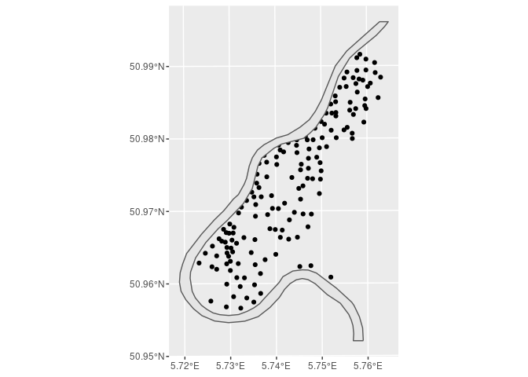
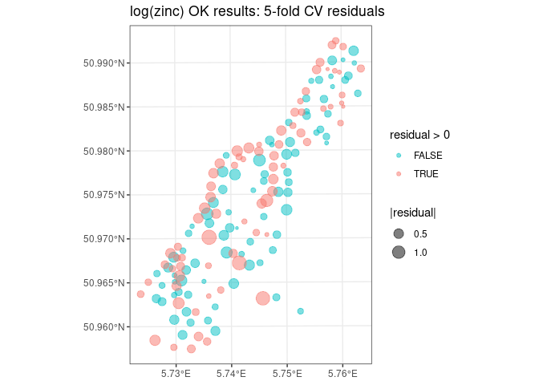
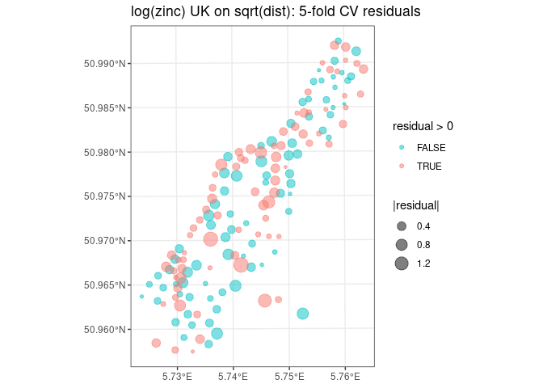
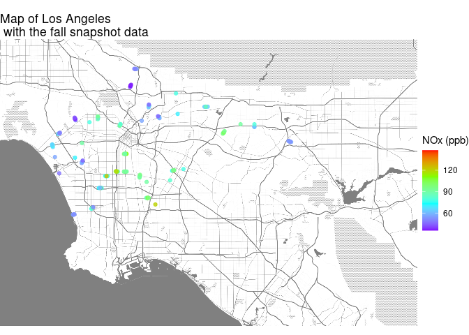

<!-- The reason for the changes on 3/5/19 had to do with needing lambert
coordinates and maybe using a smaller grid for the predictions.  This is no
longer necessary so the original .csv versions of the snapshot and la-grid
should work -->


# Introduction, Purpose, and Credit

The purpose of this lab is to learn about geostatistical models and further
solidify your understanding of regression for prediction.  We will use the same
MESA Air snapshot data described in [Mercer et al
2011](https://doi.org/10.1016/j.atmosenv.2011.05.043) that we used earlier in
the quarter.  As a side benefit you will also get exposure to the most modern
tools for handling spatial data in R and learn how to create maps and add your
data to them.  The secondary intent of this lab is to help you learn to use
geographic data in R as productively as possible while recognizing there is much
more to learn and develop.

**Credit**:  Brian High, Chris Zuidema, and Dave Slager have provided an
enormous amount of support in developing this lab.

**A brief history of the evolution of this lab**:  Originally developed in 2019,
this lab and its geostatistical examples were based on `geoR`.  The `geoR`
coordinate system is outdated, so in 2021 we switched the geostatistics package
to `gstat`.  This also meant adopting the `sp` system for spatial data.
However, the `sf` package is a better way to handle spatial data, so thanks to
support from Dave Slager, this lab now uses `sf` instead of `sp`.  See the
resources section below for links to information about `sf` vs. `sp`.

Also, this lab represents work in progress.  While it has undergone extensive
testing, it is possible some errors remain.  In addition, there are some ideas
that would benefit from further development.

# Getting Started

## Introductory comments 

### Resources for Spatial data in R

The use of spatial data in R is rapidly evolving.  Here are several useful
overview resources:

* A good and recently updated book is  [Geocomputation in
R](https://geocompr.robinlovelace.net/index.html) by Robin Lovelace.  Its
[introductory chapter](https://geocompr.robinlovelace.net/intro.html) gives a
great overview of the "what" and "why" of geocomputation.  It also has a good
overview of [R's spatial
ecosystem](https://geocompr.robinlovelace.net/intro.html#rs-spatial-ecosystem),
and a very nice overview of the history of spatial data in R, which Lovelace
calls [The history of
R-spatial](https://geocompr.robinlovelace.net/intro.html#the-history-of-r-spatial).
In particular, it puts into historical context the tools we are using in this
lab with the current state of the art.

* Roger Bivand was an early leader in developing tools to work with spatial data
in R. His book, [Spatial Data Analysis in R](https://asdar-book.org/) was
published in 2013.  (The link is actually to the scripts and datasets to
reproduce the examples in his book.)  The book is available for download from
the UW library and there is a copy on the course website. In particular, I
recommend Chapter 1 for an overview of ideas, Chapter 4 for the quickest start
to using spatial data (though the rest of Part I will also be helpful), and
Chapter 8 for methods for kriging.

* Pebesma & Bivand have a new book [Spatial Data
Science](https://keen-swartz-3146c4.netlify.app/) that explains the concepts
underlying spatial data, links it to many modern packages of theirs (e.g.
`sf`, `lwgeom`, and `stars`), and accompanies this with `tidyverse`.

* **Coordinate Reference Systems and Projections**:  These can be confusing to the uninitiated.  Here are a few resources:
    - [A brief and compact overview of coordinate reference
systems](https://www.nceas.ucsb.edu/sites/default/files/2020-04/OverviewCoordinateReferenceSystems.pdf).
    - Nick Eubank's overview of [Projections and Coordinate Reference Systems](http://www.nickeubank.com/wp-content/uploads/2018/02/CoordinateSystems_And_Projections.pdf).


### Spatial data in R:  `sf` and `sp`

The `sf` or "simple features" package is the more modern way to reference
spatial data in R.  We use `sf` in this lab.  The alternative is `sp` and we
include a few references to it for completeness.  See also the introduction to
the snapshot data section below for a discussion on distance calculations.

* Jesse Sadler gives a good overview in his [Introduction to GIS with R:
Spatial data with the sp and sf
packages](https://www.jessesadler.com/post/gis-with-r-intro/)

* R-bloggers post: [Should I learn sf or sp for spatial R
programming?](https://www.r-bloggers.com/2018/03/should-i-learn-sf-or-sp-for-spatial-r-programming/)

* Moving from `sp` to `sf`: See this [Nick Bearman
blog](https://www.nickbearman.me.uk/2019/04/spatial-r-moving-from-sp-to-sf/) for
some good perspective.

* `sp`: This RPub describes [Spatial Data
Objects](https://rpubs.com/NateByers/spatialobjects) including `Spatial`,
`SpatialPoints`, and `SpatialPointsDataFrame`.

* `sf`: See the very accessible Ed Pebesma overview of [Simple Features for
R](https://r-spatial.github.io/sf/articles/sf1.html#what-is-a-feature-) and to
dig further, [here](https://r-spatial.github.io/sf/articles/) is the index to
all his `sf` vignettes.

### R packages for geostatistics and spatial data

Packages for kriging include `geoR`, `automap`, and `gstat`.  The package `geoR`
has been around for some time and the original 2019 version of this lab used
this package.  The package `gstat` is newer and uses either the `sp` or `sf`
class.  `automap` calls `gstat`.  `geoR` and `gstat` have been documented to
give identical results, at least for a simple dataset example.  To verify this,
type `demo(gstat::comp_geoR)` in the console after loading both `gstat` and
`geoR`.  Because of its more modern implementation with `sf` and `sp`, we
discuss `gstat` in this lab. There are good examples online and in books (e.g.,
Bivand's) that show how to do kriging with `gstat`.

(Aside:  There is an interesting [stackoverflow
discussion](https://stackoverflow.com/questions/21970992/compare-variogram-and-variog-function)
of comparing empirical variograms in `geoR` vs. `sp` and `gstat` that addresses
coordinate transformations and binning.  It is worth a look if you want to
understand the details better.)

**Note on `rgdal`**:  If you are running your lab locally on a Mac, the `rgdal`
package doesn't load properly on newer Macs running Catalina.  You need to
install GDAL from the terminal.  See this
[link](https://medium.com/@egiron/how-to-install-gdal-and-qgis-on-macos-catalina-ca690dca4f91)
for how to do this.

### Some comments on universal kriging and prediction  

In kriging, you can't predict on the same locations that you used to estimate
the parameters.  As discussed on
[stackoverflow](https://stackoverflow.com/questions/45768516/why-does-the-kriging-give-the-same-values-as-the-observed),
"this is a well-known property of kriging; it comes from the fact that the model
underlying kriging assumes that a value is perfectly correlated with itself."
Thus predicting a known value always returns that value, with zero prediction
error.  This is also the cause of errors with duplicate observations at the same
location. Think of this property of kriging as an enforced need to do
cross-validation to evaluate your predictions.  Apparently with the `gstat`
package you can do smoothing instead of kriging by specifying an "Err" variogram
instead of a "Nug" nugget effect.

### Brief discussion of variograms

A semivariance is defined as one half of the average of all the squared
differences of all points that are a certain distance $h$ apart.  A variogram is
a plot of these squared differences as a function of distance, presented as
either all the points (a "cloud"), or as an average (typically called "binned").
Empirical variograms are useful for helping a data analyst see the spatial
structure in the data.  In many situations with spatial structure, the average
semivariance increases as distance increases until it eventually levels off.  In
geostatistics we use a model to approximate the structure we see in an empirical
variogram.  There are different variogram models depending upon the assumed
covariance model.  Examples of common assumed models are exponential, spherical,
Gaussian, and Matern.  This [link](http://www.kgs.ku.edu/Tis/surf3/s3krig2.html)
gives a brief summary of semivariance and variograms (which it calls
semivariograms; see the following link for discussion of terminology and the
confusing overlapping terms in the literature).

There is confusion about terminology and often variogram and semivariogram are
used interchangeably.  This paper, [Variogram or semivariogram? Understanding
the variances in a
variogram](https://link.springer.com/article/10.1007%2Fs11119-008-9056-2), gives
a nice overview of the terminology and notation.  It also links well-understood
estimates of variance with semivariance estimates, making the point that a
variance can be expressed either in the traditional way as the squared deviation
from the mean, or as 1/2 the average of squared differences between points,
averaged over all possible pairs of points.  This helps you see that the formula
for a variogram is a re-expression of a standard variance formula, though now
looking at each term that goes into the sum as a function of distance.


## Applications using `gstat`: Practice with the built-in `meuse` dataset

The purpose of this section is to show some `gstat` tools using the built-in
`meuse` dataset.  The dataset is part of the package `sp` and documentation of
this dataset can be found
[here](http://www.dpi.inpe.br/gilberto/tutorials/software/R-contrib/sp/html/meuse.html).

First we will go through the `meuse` dataset, a dataset of soil contamination
from The Netherlands.  Its location coordinates are `x` and `y`, and its
exposure measurements are concentrations of various metals in topsoil.  We will
focus on `zinc` in this lab.  There are also some potential covariates we could
consider in a universal kriging model such as elevation and distance from the
Meuse river.


### Summary & learn about the data

The following section was structured after the examples
[here](https://rpubs.com/liem/63374) as well as a more updated version that uses
`tidyverse` and `ggplot` commands called [Meuse
Tutorial](https://rstudio-pubs-static.s3.amazonaws.com/134781_28af3676f8b943749ebfa536b3897cac.html).
However, this implementation uses `sf`.


```r
#-----basics with meuse dataset - summary + EDA-----

# load the data
data(meuse)

# learn about this dataset
# currently it is just a raw data.frame
class(meuse)
```

```
## [1] "data.frame"
```

```r
head(meuse)
```

```
##        x      y cadmium copper lead zinc  elev       dist   om ffreq soil lime
## 1 181072 333611    11.7     85  299 1022 7.909 0.00135803 13.6     1    1    1
## 2 181025 333558     8.6     81  277 1141 6.983 0.01222430 14.0     1    1    1
## 3 181165 333537     6.5     68  199  640 7.800 0.10302900 13.0     1    1    1
## 4 181298 333484     2.6     81  116  257 7.655 0.19009400  8.0     1    2    0
## 5 181307 333330     2.8     48  117  269 7.480 0.27709000  8.7     1    2    0
## 6 181390 333260     3.0     61  137  281 7.791 0.36406700  7.8     1    2    0
##   landuse dist.m
## 1      Ah     50
## 2      Ah     30
## 3      Ah    150
## 4      Ga    270
## 5      Ah    380
## 6      Ga    470
```

```r
# glimpse and str are both useful to learn the structure.  I like glimpse from the `dplyr` package, particularly once this becomes converted to a spatial dataset
str(meuse)
```

```
## 'data.frame':	155 obs. of  14 variables:
##  $ x      : num  181072 181025 181165 181298 181307 ...
##  $ y      : num  333611 333558 333537 333484 333330 ...
##  $ cadmium: num  11.7 8.6 6.5 2.6 2.8 3 3.2 2.8 2.4 1.6 ...
##  $ copper : num  85 81 68 81 48 61 31 29 37 24 ...
##  $ lead   : num  299 277 199 116 117 137 132 150 133 80 ...
##  $ zinc   : num  1022 1141 640 257 269 ...
##  $ elev   : num  7.91 6.98 7.8 7.66 7.48 ...
##  $ dist   : num  0.00136 0.01222 0.10303 0.19009 0.27709 ...
##  $ om     : num  13.6 14 13 8 8.7 7.8 9.2 9.5 10.6 6.3 ...
##  $ ffreq  : Factor w/ 3 levels "1","2","3": 1 1 1 1 1 1 1 1 1 1 ...
##  $ soil   : Factor w/ 3 levels "1","2","3": 1 1 1 2 2 2 2 1 1 2 ...
##  $ lime   : Factor w/ 2 levels "0","1": 2 2 2 1 1 1 1 1 1 1 ...
##  $ landuse: Factor w/ 15 levels "Aa","Ab","Ag",..: 4 4 4 11 4 11 4 2 2 15 ...
##  $ dist.m : num  50 30 150 270 380 470 240 120 240 420 ...
```

```r
glimpse(meuse)
```

```
## Rows: 155
## Columns: 14
## $ x       <dbl> 181072, 181025, 181165, 181298, 181307, 181390, 181165, 181027…
## $ y       <dbl> 333611, 333558, 333537, 333484, 333330, 333260, 333370, 333363…
## $ cadmium <dbl> 11.7, 8.6, 6.5, 2.6, 2.8, 3.0, 3.2, 2.8, 2.4, 1.6, 1.4, 1.8, 1…
## $ copper  <dbl> 85, 81, 68, 81, 48, 61, 31, 29, 37, 24, 25, 25, 93, 31, 27, 86…
## $ lead    <dbl> 299, 277, 199, 116, 117, 137, 132, 150, 133, 80, 86, 97, 285, …
## $ zinc    <dbl> 1022, 1141, 640, 257, 269, 281, 346, 406, 347, 183, 189, 251, …
## $ elev    <dbl> 7.909, 6.983, 7.800, 7.655, 7.480, 7.791, 8.217, 8.490, 8.668,…
## $ dist    <dbl> 0.00135803, 0.01222430, 0.10302900, 0.19009400, 0.27709000, 0.…
## $ om      <dbl> 13.6, 14.0, 13.0, 8.0, 8.7, 7.8, 9.2, 9.5, 10.6, 6.3, 6.4, 9.0…
## $ ffreq   <fct> 1, 1, 1, 1, 1, 1, 1, 1, 1, 1, 1, 1, 1, 1, 1, 1, 1, 1, 1, 1, 1,…
## $ soil    <fct> 1, 1, 1, 2, 2, 2, 2, 1, 1, 2, 2, 1, 1, 1, 1, 1, 1, 1, 1, 1, 1,…
## $ lime    <fct> 1, 1, 1, 0, 0, 0, 0, 0, 0, 0, 0, 0, 1, 0, 0, 1, 1, 1, 1, 1, 1,…
## $ landuse <fct> Ah, Ah, Ah, Ga, Ah, Ga, Ah, Ab, Ab, W, Fh, Ag, W, Ah, Ah, W, W…
## $ dist.m  <dbl> 50, 30, 150, 270, 380, 470, 240, 120, 240, 420, 400, 300, 20, …
```

```r
# summary of the data
summary(meuse) 
```

```
##        x                y             cadmium           copper      
##  Min.   :178605   Min.   :329714   Min.   : 0.200   Min.   : 14.00  
##  1st Qu.:179371   1st Qu.:330762   1st Qu.: 0.800   1st Qu.: 23.00  
##  Median :179991   Median :331633   Median : 2.100   Median : 31.00  
##  Mean   :180005   Mean   :331635   Mean   : 3.246   Mean   : 40.32  
##  3rd Qu.:180630   3rd Qu.:332463   3rd Qu.: 3.850   3rd Qu.: 49.50  
##  Max.   :181390   Max.   :333611   Max.   :18.100   Max.   :128.00  
##                                                                     
##       lead            zinc             elev             dist        
##  Min.   : 37.0   Min.   : 113.0   Min.   : 5.180   Min.   :0.00000  
##  1st Qu.: 72.5   1st Qu.: 198.0   1st Qu.: 7.546   1st Qu.:0.07569  
##  Median :123.0   Median : 326.0   Median : 8.180   Median :0.21184  
##  Mean   :153.4   Mean   : 469.7   Mean   : 8.165   Mean   :0.24002  
##  3rd Qu.:207.0   3rd Qu.: 674.5   3rd Qu.: 8.955   3rd Qu.:0.36407  
##  Max.   :654.0   Max.   :1839.0   Max.   :10.520   Max.   :0.88039  
##                                                                     
##        om         ffreq  soil   lime       landuse       dist.m      
##  Min.   : 1.000   1:84   1:97   0:111   W      :50   Min.   :  10.0  
##  1st Qu.: 5.300   2:48   2:46   1: 44   Ah     :39   1st Qu.:  80.0  
##  Median : 6.900   3:23   3:12           Am     :22   Median : 270.0  
##  Mean   : 7.478                         Fw     :10   Mean   : 290.3  
##  3rd Qu.: 9.000                         Ab     : 8   3rd Qu.: 450.0  
##  Max.   :17.000                         (Other):25   Max.   :1000.0  
##  NA's   :2                              NA's   : 1
```

#### Comments about Simple Features

As summarized in this
[vignette](https://r-spatial.github.io/sf/articles/sf1.html), simple features is
formal standard used for geographic data and geographic information systems
(GIS) that has both geographic and non-geographic attributes.  It has a common
architecture and a geometry to indicate its location on Earth.  In R the package
`sf` represents simple features objects.  All operations from this package are
preceded by `st_` to refer to *spatial data type*.  There are 3 classes used to
represent simple features.  We will focus on the `sf` class which is a table or
`data.frame`.  It contains `sfc`, with the geometries for each record, which is
in turn made up of `sfg`, the geometry for a single feature such as a point or
polygon.

The next chunk turns `meuse` into an `sf` object.  Of note, there needs to be a
projection for the coordinates.  Projections are essential to know in order to
place maps in space correctly. Here are the links we will need to handle the
projection:

* Look up the projection of the `meuse` coordinates [here:
https://rdrr.io/cran/sp/man/meuse.html](https://rdrr.io/cran/sp/man/meuse.html).
Note this is dataset-specific.

* The proj4 string is a standardized way to describe a projection.  Get the
proj4string [here: https://epsg.io/28992](https://epsg.io/28992).


```r
# ---- meuse as an sf object ----

# So far, R does not know that this is spatial data.
# Now turn meuse into a spatial dataset
# We specify that the XY coordinates are in columns `x` and `y`
meuse <- st_as_sf(meuse, coords=c('x','y'))

# It is now both an sf object and a data.frame
class(meuse)
```

```
## [1] "sf"         "data.frame"
```

```r
# Although the xy columns are now recognized as the coordinates,
# they still have no explicit spatial meaning without a projection
st_crs(meuse)
```

```
## Coordinate Reference System: NA
```

```r
# Look up the projection of the meuse coordinates  and get the proj4string using the links above.

# Set the projection, in this case it is a projection commonly used in the Netherlands
st_crs(meuse) <- '+proj=sterea +lat_0=52.15616055555555 +lon_0=5.38763888888889 +k=0.9999079 +x_0=155000 +y_0=463000 +ellps=bessel +towgs84=565.417,50.3319,465.552,-0.398957,0.343988,-1.8774,4.0725 +units=m +no_defs'

# As an alternative, we can also just use the EPSG string.  While much simpler,
# this is harder to troubleshoot
#st_crs(meuse) <- 28992
```

The following chunk shows how to access various aspects of this `sf` object.  


```r
# ---- extract meuse data ----

# Confirm the coordinates are properly projected now:
st_crs(meuse)
```

```
## Coordinate Reference System:
##   User input: +proj=sterea +lat_0=52.15616055555555 +lon_0=5.38763888888889 +k=0.9999079 +x_0=155000 +y_0=463000 +ellps=bessel +towgs84=565.417,50.3319,465.552,-0.398957,0.343988,-1.8774,4.0725 +units=m +no_defs 
##   wkt:
## BOUNDCRS[
##     SOURCECRS[
##         PROJCRS["unknown",
##             BASEGEOGCRS["unknown",
##                 DATUM["Unknown based on Bessel 1841 ellipsoid",
##                     ELLIPSOID["Bessel 1841",6377397.155,299.1528128,
##                         LENGTHUNIT["metre",1,
##                             ID["EPSG",9001]]]],
##                 PRIMEM["Greenwich",0,
##                     ANGLEUNIT["degree",0.0174532925199433],
##                     ID["EPSG",8901]]],
##             CONVERSION["unknown",
##                 METHOD["Oblique Stereographic",
##                     ID["EPSG",9809]],
##                 PARAMETER["Latitude of natural origin",52.1561605555556,
##                     ANGLEUNIT["degree",0.0174532925199433],
##                     ID["EPSG",8801]],
##                 PARAMETER["Longitude of natural origin",5.38763888888889,
##                     ANGLEUNIT["degree",0.0174532925199433],
##                     ID["EPSG",8802]],
##                 PARAMETER["Scale factor at natural origin",0.9999079,
##                     SCALEUNIT["unity",1],
##                     ID["EPSG",8805]],
##                 PARAMETER["False easting",155000,
##                     LENGTHUNIT["metre",1],
##                     ID["EPSG",8806]],
##                 PARAMETER["False northing",463000,
##                     LENGTHUNIT["metre",1],
##                     ID["EPSG",8807]]],
##             CS[Cartesian,2],
##                 AXIS["(E)",east,
##                     ORDER[1],
##                     LENGTHUNIT["metre",1,
##                         ID["EPSG",9001]]],
##                 AXIS["(N)",north,
##                     ORDER[2],
##                     LENGTHUNIT["metre",1,
##                         ID["EPSG",9001]]]]],
##     TARGETCRS[
##         GEOGCRS["WGS 84",
##             DATUM["World Geodetic System 1984",
##                 ELLIPSOID["WGS 84",6378137,298.257223563,
##                     LENGTHUNIT["metre",1]]],
##             PRIMEM["Greenwich",0,
##                 ANGLEUNIT["degree",0.0174532925199433]],
##             CS[ellipsoidal,2],
##                 AXIS["latitude",north,
##                     ORDER[1],
##                     ANGLEUNIT["degree",0.0174532925199433]],
##                 AXIS["longitude",east,
##                     ORDER[2],
##                     ANGLEUNIT["degree",0.0174532925199433]],
##             ID["EPSG",4326]]],
##     ABRIDGEDTRANSFORMATION["Transformation from unknown to WGS84",
##         METHOD["Position Vector transformation (geog2D domain)",
##             ID["EPSG",9606]],
##         PARAMETER["X-axis translation",565.417,
##             ID["EPSG",8605]],
##         PARAMETER["Y-axis translation",50.3319,
##             ID["EPSG",8606]],
##         PARAMETER["Z-axis translation",465.552,
##             ID["EPSG",8607]],
##         PARAMETER["X-axis rotation",-0.398957,
##             ID["EPSG",8608]],
##         PARAMETER["Y-axis rotation",0.343988,
##             ID["EPSG",8609]],
##         PARAMETER["Z-axis rotation",-1.8774,
##             ID["EPSG",8610]],
##         PARAMETER["Scale difference",1.0000040725,
##             ID["EPSG",8611]]]]
```

```r
# View a summary description of our projected data frame
meuse
```

```
## Simple feature collection with 155 features and 12 fields
## Geometry type: POINT
## Dimension:     XY
## Bounding box:  xmin: 178605 ymin: 329714 xmax: 181390 ymax: 333611
## CRS:           +proj=sterea +lat_0=52.15616055555555 +lon_0=5.38763888888889 +k=0.9999079 +x_0=155000 +y_0=463000 +ellps=bessel +towgs84=565.417,50.3319,465.552,-0.398957,0.343988,-1.8774,4.0725 +units=m +no_defs
## First 10 features:
##    cadmium copper lead zinc  elev       dist   om ffreq soil lime landuse
## 1     11.7     85  299 1022 7.909 0.00135803 13.6     1    1    1      Ah
## 2      8.6     81  277 1141 6.983 0.01222430 14.0     1    1    1      Ah
## 3      6.5     68  199  640 7.800 0.10302900 13.0     1    1    1      Ah
## 4      2.6     81  116  257 7.655 0.19009400  8.0     1    2    0      Ga
## 5      2.8     48  117  269 7.480 0.27709000  8.7     1    2    0      Ah
## 6      3.0     61  137  281 7.791 0.36406700  7.8     1    2    0      Ga
## 7      3.2     31  132  346 8.217 0.19009400  9.2     1    2    0      Ah
## 8      2.8     29  150  406 8.490 0.09215160  9.5     1    1    0      Ab
## 9      2.4     37  133  347 8.668 0.18461400 10.6     1    1    0      Ab
## 10     1.6     24   80  183 9.049 0.30970200  6.3     1    2    0       W
##    dist.m              geometry
## 1      50 POINT (181072 333611)
## 2      30 POINT (181025 333558)
## 3     150 POINT (181165 333537)
## 4     270 POINT (181298 333484)
## 5     380 POINT (181307 333330)
## 6     470 POINT (181390 333260)
## 7     240 POINT (181165 333370)
## 8     120 POINT (181027 333363)
## 9     240 POINT (181060 333231)
## 10    420 POINT (181232 333168)
```

```r
# The original data.frame columns (except for X and Y, which are now `geometry`),
# can still be accessed in the usual way. (head() gives the same result as meuse above so is commented out.)
#head(meuse)
head(meuse$zinc)
```

```
## [1] 1022 1141  640  257  269  281
```

```r
colnames(meuse)
```

```
##  [1] "cadmium"  "copper"   "lead"     "zinc"     "elev"     "dist"    
##  [7] "om"       "ffreq"    "soil"     "lime"     "landuse"  "dist.m"  
## [13] "geometry"
```

```r
# bounding box
st_bbox(meuse)
```

```
##   xmin   ymin   xmax   ymax 
## 178605 329714 181390 333611
```

```r
# To extract the original XY coordinates
st_coordinates(meuse) %>% head()
```

```
##        X      Y
## 1 181072 333611
## 2 181025 333558
## 3 181165 333537
## 4 181298 333484
## 5 181307 333330
## 6 181390 333260
```


### Some meuse plots

Note that `geom_sf` plots in lat-long units by default, even though our data is
stored in a different projection. (As we will see later, it is trivial to
convert our points to a different projection once our points have a specific
projection in `sf`). We can check that map projections are working properly and
explore the study area on [Google
Maps](https://www.google.com/maps?q=50.97,5.74)


```r
# ---- meuse plots ----

# Read in the Meuse River polygon
data(meuse.riv)

# Look at the data and note that row 1 is the same as the last row (this closes
# the polygon)
head(meuse.riv,3)
```

```
##          [,1]     [,2]
## [1,] 182003.7 337678.6
## [2,] 182136.6 337569.6
## [3,] 182252.1 337413.6
```

```r
tail(meuse.riv,3)
```

```
##            [,1]     [,2]
## [174,] 181981.7 337587.3
## [175,] 181810.4 337684.8
## [176,] 182003.7 337678.6
```

```r
# Looking at its structure, we see the meuse.riv object is still just a matrix
# of raw XY values.
str(meuse.riv)
```

```
##  num [1:176, 1:2] 182004 182137 182252 182314 182332 ...
```

```r
# The following code specifies the columns containing the coordinates,
# specifies the projection of the coordinates as the same meuse projection,
# and explicitly combines the points into a polygon
meuse.riv <- st_as_sf(data.frame(meuse.riv), coords=1:2, crs=st_crs(meuse)) %>%
  st_combine() %>%
  st_cast('POLYGON')

# ggplot2 readily accepts sf objects for plotting via geom_sf()
# Let's make a map
ggplot(data=meuse) + geom_sf() + geom_sf(data=meuse.riv)
```

<!-- -->

```r
# The river is too long compared to the study area
# For prettier plotting, crop the river polygon to within 500m buffer of data
# This works because our projection is in meter units
# This code buffers the points of the measurements by 500 m,
# obtains the smallest possible rectangular bounding box around those buffers,
# and crops the river polygon to that rectangle
meuse.riv <- st_crop(meuse.riv, st_bbox(st_buffer(meuse, 500)))

# Much better!
ggplot(data=meuse) + geom_sf() + geom_sf(data=meuse.riv)
```

<!-- -->

```r
# Color the zinc data based on the native scale
# Plotting the river before the points ensures points are on top of the river
# Scale_color_gradients with rainbow(rev=TRUE) creates a heatmap

ggplot(data=meuse) +
  geom_sf(data=meuse.riv) +
  geom_sf(data=meuse, aes(color=zinc)) +
  scale_color_gradientn(colors=rainbow(4, rev=TRUE)) +
  ggtitle("Zinc Concentration (ppm)") +
  theme_bw()
```

<!-- -->

```r
# Color the zinc data based on the log scale

ggplot(data=meuse) +
  geom_sf(data=meuse.riv) +
  geom_sf(data=meuse, aes(color=log(zinc))) +
  scale_color_gradientn(colors=rainbow(4, rev=TRUE)) +
  ggtitle("Zinc Concentration in log(ppm)") +
  theme_bw()
```

<!-- -->

```r
# Make a bubble plot
# The alpha value adds transparency to plotting shapes

ggplot(data=meuse) +
  geom_sf(data=meuse.riv) +
  geom_sf(data=meuse, aes(size=zinc), color='blue', alpha=1/2) +
  ggtitle("Zinc Concentration (ppm)") +
  theme_bw()
```

<!-- -->

```r
# Put these ideas together:  Size and color based on native scale
ggplot(data=meuse) +
  geom_sf(data=meuse.riv) +
  geom_sf(data=meuse, aes(size=zinc, color=zinc)) +
  scale_color_gradientn(colors=rainbow(4, rev=TRUE)) +
  ggtitle("Zinc Concentration (ppm)") +
  theme_bw()
```

<!-- -->

### Estimating variograms

#### Empirical variograms

We use variograms to get an understanding on how our variable of interest varies
over space.  One of the variables in the `meuse` dataset is the concentration of
zinc.  We will focus on modeling the log-transformed value of zinc.

The following code gives empirical variograms plotted using two different
options:  a *variogram cloud* with all squared distances (`cloud = TRUE`), and
the default *binned variogram*.  The third plot is the binned variogram again;
this one shows the number of points that make up each bin.  The fourth plot is the cloud variogram with a smoother overlaid, this time plot using `ggplot`.

Note that while the `meuse` dataset has only 155 observations, in principle the
variogram is binning over all possible point pairs: 155 * 154 / 2 = 11,935.
However, only a subset of these pairs is used by `gstat`, according to the value
in the `cutoff` variable.  The variogram cloud dataset only has 6,833 data
points and in the binned variogram the sum of `np`, the number of points in each
bin, is also 6,833.  This is because the default distance in `gstat` is 1/3 of
the maximum distance.  We can change the default distance using the `cutoff =`
option.  We change the cutoff in the snapshot data example below.

The distance is Euclidean distance; gamma is the semi-variance estimate, as
described in this helpful document: [An introduction to (geo)statistics with
R](http://www.css.cornell.edu/faculty/dgr2/_static/files/R_PDF/gs_intro_20Mar2019.pdf),
also uploaded to the course Canvas site.


```r
# ---- meuse empirical variogram ----
# Note: We set warning=FALSE to omit warnings about the projection.  This is
# because newer standards for projection strings are becoming the norm and the
# current version of the packages we are using (Feb 2021) have not yet been
# fully updated to address this.  Packages are being conservative and spitting
# out warnings to let users know about this.  In the future this should be
# fixed.

# plot variogram cloud
plot(variogram(log(zinc)~1, meuse, cloud=TRUE))
```

<!-- -->

```r
# plot binned variogram (the default)
plot(variogram(log(zinc)~1, meuse))
```

<!-- -->

```r
# you can also show the number of points in each bin
plot(variogram(log(zinc)~1, meuse), pl=TRUE)
```

<!-- -->

```r
# save the variogram cloud 
vgm.meuse <- variogram(log(zinc)~1, meuse, cloud=TRUE)

# Now plot the cloud and overlay a smooth curve
# Note that the full scatter is misleading relative to the smooth curve
ggplot(data=vgm.meuse, aes(x = dist, y = gamma)) +
  geom_point(shape = "o", alpha = 0.6) +
  geom_smooth(se = FALSE, aes(linetype = "solid", color = "red")) +
  labs(x = "Distance in meters", 
       y = "Semi-variance",
       title = "Meuse semi-variogram cloud\nwith overlaid smooth curve") +
  theme_bw() + 
  theme(legend.position = "none")
```

```
## `geom_smooth()` using method = 'gam' and formula 'y ~ s(x, bs = "cs")'
```

<!-- -->


#### Modeled variogram

One can superimpose various modeled variograms onto empirical variograms. We
need a modeled variogram in order to parameterize the structured error in our
kriging model.  This is important because we need to have some idea of
appropriate variogram parameters because we need to supply the kriging
estimation fuctions with initial values of these parameters, specifically the
partial sill ($\sigma^2$) and range ($\phi$).  The following chunk offers 3
possible variogram model options and the best-fitting one was selected.


```r
# ---- meuse modeled variogram -----

# first estimate the variogram object and assign it a name
v <- variogram(log(zinc)~1, meuse)

# Then fit a variogram model, offering to the function several different model
# options (exponential, spherical, and Matern):
v.fit <- fit.variogram(v, vgm(c("Exp", "Sph", "Mat")))

# Find out which variogram model was selected
# Observe that it was the spherical with a range of 897 m, a partial sill of
# 0.59, and a nugget of 0.05.
v.fit
```

```
##   model      psill    range
## 1   Nug 0.05065971   0.0000
## 2   Sph 0.59060511 897.0011
```

```r
# Plot the empirical variogram with the overlaid fit
plot(v, v.fit)
```

<!-- -->

### Kriging

Credit:  The following examples were modified to use the `sf` package and
otherwise follows the code
[here](https://github.com/r-spatial/gstat/blob/master/demo/krige.R).

#### Ordinary Kriging (OK)

We use kriging to get predictions at *new* locations (not used in the model
fitting).  Use the function `krige` to accomplish this.  Give it locations where
it should predict in the `newdata = ` option.  You also need to pass it the
results of a fitted variogram model in the `model = ` option.  Note that in this
example we are estimating a common mean using ordinary kriging.


```r
# ---- meuse ordinary kriging ----

# read in the meuse grid to use for predictions
data(meuse.grid)

# convert to sf points
meuse.grid <- st_as_sf(meuse.grid,coords=c('x','y'),crs=st_crs(meuse))

# ordinary kriging of log(zinc)
# first two arguments are formula and data
lzn.kr <- krige(log(zinc)~1, meuse, newdata = meuse.grid, model = v.fit)
```

```
## [using ordinary kriging]
```

```r
# plot kriging predictions
pl1 <- plot(lzn.kr["var1.pred"], main = "OK prediction of log(zinc)")
```

<!-- -->

```r
# calculate then plot kriging standard errors
lzn.kr$se = sqrt(lzn.kr$var1.var)
pl2 <- plot(lzn.kr["se"], main = "OK prediction error")
```

<!-- -->

#### Universal kriging (UK)

To do universal kriging, we also need covariates for the fixed part of the
model.  As discussed in Mercer et al, ArcGIS doesn't (or didn't at the time that
paper was written) allow an arbitrary set of covariates to be included in UK.
ArcGIS only allows (or allowed) the mean function to be a function of latitude
and longitude, which is far too limiting in many applications.  The next chunk
demonstrates universal kriging with the `meuse` data using the square root of
the distance from the river as our covariate.   


```r
# ---- meuse universal kriging ----

# First we need to fit a new variogram model with the square root of distance
# from the Meuse River as a covariate.  And estimate its variogram model
v.uk <- variogram(log(zinc)~sqrt(dist), meuse)
m.uk <- fit.variogram(v.uk, vgm("Exp","Sph","Mat"))

# learn about the best-fitting variogram model and plot it
m.uk
```

```
##   model      psill    range
## 1   Nug 0.05712318   0.0000
## 2   Exp 0.17641581 340.3269
```

```r
plot(v.uk, model = m.uk)
```

<!-- -->

```r
# fit the universal kriging model, predicting on the meuse.grid
lzn.kr <- krige(log(zinc)~sqrt(dist), meuse, meuse.grid, model = m.uk)
```

```
## [using universal kriging]
```

```r
# calculate standard errors
lzn.kr$se = sqrt(lzn.kr$var1.var)

# plot the UK predictions and SEs
pl3 <- plot(lzn.kr["var1.pred"], main = "UK prediction of log-zinc")
```

<!-- -->

```r
pl4 <- plot(lzn.kr["se"], main = "UK prediction error")
```

<!-- -->

### Cross-validating the kriging model using the built-in CV function `krige.cv`

`gstat` uses the function `krige.cv` to do kriging with cross-validation. If you
pass it the number of folds as a scalar and then it randomly divides the data
into that number of folds.  The default is leave one out (LOO) which is a scalar
of the length of the data.  One can also pass to `nfolds` a vector of the length
the data with values to indicate the groups each observation belongs in (e.g.
the cluster variable in the snapshot dataset).

First we define two functions to use later:  `krige.cv.bubble` - a bubble plot
for kriging residuals, and `krige.cv.stats` - a function to produce prediction model
performance statistics.  Then we use ordinary kriging with cross-validation,
followed by universal kriging with cross-validation.  We first conduct 5-fold
cross-validation, followed by LOO.  We observe that for OK the LOO has better
performance.  For UK, the performance doesn't meaningfully change with the CV
approach.


```r
# ---- define CV functions ----

# Define a wrapper function krige.cv2() that does not drop the projection
# of the sf object. This repairs a bug in krige.cv()
# Bug has been reported on github to gstat maintainers and fixed,
# so this wrapper function probably won't be needed next time course is taught
# (should be able to change krige.cv2() calls to krige.cv() in all cases)
krige.cv2 <- function(formula, locations, model = NULL, ..., beta = NULL, 
	nmax = Inf, nmin = 0, maxdist = Inf, nfold = nrow(locations), 
	verbose = interactive(), debug.level = 0){
  # Repeating the exact arguments from krige.cv source code
  krige.cv1 <- krige.cv(formula = formula, locations = locations, model = model, ..., beta = beta,
	nmax = nmax, nmin = nmin, maxdist = maxdist, nfold = nfold,
	verbose = verbose, debug.level = debug.level)
  # force projection to that of the function input if projection is NA
  if (is.na(st_crs(krige.cv1))) {st_crs(krige.cv1) <- st_crs(locations)}
  return(krige.cv1)
}

# Define function to create a bubble plot for kriging residuals
krige.cv.bubble <- function(cv.out, plot_title){
  ggplot(data=cv.out) +
  geom_sf(aes(size=abs(residual), color=factor(residual>0)), alpha=1/2) +
  scale_color_discrete(name='residual > 0', direction=-1) +
  scale_size_continuous(name='|residual|') +
  ggtitle(plot_title) +
  theme_bw()
}

# Define function for calculating the MSE, RMSE, MSE-based R2 from krige.cv output
krige.cv.stats <- function(krige.cv.output, description){
  d <- krige.cv.output
  # mean of observations
  mean_observed <- mean(d$observed)
  # MSE of predictions
  MSE_pred <- mean((d$observed - d$var1.pred)^2)
  # MSE of observations (for R2 denominator)
  MSE_obs <- mean((d$observed - mean_observed)^2)
  # # print the results not rounded
  # cat(paste("RMSE:  ", sqrt(MSE_pred)),'\n')
  # cat(paste("MSE-based R2:  ", max(1 - MSE_pred/MSE_obs, 0)),'\n')
  
  # make dataframe of performance results
  tibble(Description = description, 
         RMSE = round(sqrt(MSE_pred), 4), 
         MSE_based_R2 = round(max(1 - MSE_pred/MSE_obs, 0), 4) )
}
```


```r
# ---- meuse cross-validation ----

# ordinary kriging, 5-fold cross-validation 
# nmax defaults to all observations used for kriging; this sets it at 40
meuse.CV5 <- krige.cv2(log(zinc)~1, meuse, model = v.fit, nmax = 40, nfold=5)

# plot the residuals
krige.cv.bubble(meuse.CV5,"log(zinc) OK results: 5-fold CV residuals")
```

<!-- -->

```r
# ordinary kriging, LOOCV
meuse.CVLOO <- krige.cv2(log(zinc)~1, meuse, model = v.fit, nmax = 40)

# plot the residuals
krige.cv.bubble(meuse.CVLOO, "log(zinc) OK results: LOO CV residuals")
```

<!-- -->

```r
# universal kriging, 5-fold cross-validation 
meuse.CV5uk <-
  krige.cv2( log(zinc) ~ sqrt(dist), meuse,
    model = m.uk, nmax = 40, nfold = 5 )

# plot the residuals
krige.cv.bubble(meuse.CV5uk,"log(zinc) UK on sqrt(dist): 5-fold CV residuals")
```

<!-- -->

```r
# universal kriging, LOOCV
meuse.CVLOOuk <- krige.cv2(log(zinc)~sqrt(dist), meuse, 
                        model = m.uk, nmax = 40)

# plot the residuals
krige.cv.bubble(meuse.CVLOOuk,"log(zinc) UK on sqrt(dist): LOO CV residuals")
```

<!-- -->

```r
# calculate and compare performance statistics across CVs
bind_rows(

  krige.cv.stats(meuse.CV5, "OK: 5-fold CV"),
  krige.cv.stats(meuse.CVLOO, "OK: LOO CV"),
  krige.cv.stats(meuse.CV5uk, "UK on sqrt(dist): 5-fold CV"),
  krige.cv.stats(meuse.CVLOOuk, "UK on sqrt(dist): LOO CV"),

) %>% 
  
  # put into table
  kable(caption = "Summary of kriging cross-validation results for log(zinc).")
```


Table: Summary of kriging cross-validation results for log(zinc).

|Description                 |   RMSE| MSE_based_R2|
|:---------------------------|------:|------------:|
|OK: 5-fold CV               | 0.4102|       0.6751|
|OK: LOO CV                  | 0.3869|       0.7109|
|UK on sqrt(dist): 5-fold CV | 0.4020|       0.6878|
|UK on sqrt(dist): LOO CV    | 0.3829|       0.7169|


## Geostatistical analysis using the Snapshot data

### Comments about geographic coordinates and conversions

It is important to know the projection used in order to correctly do distance
calculations.  Using distance calculations based on the Pythagorean theorem
won't give you correct distances on a sphere.  Thus we can't use latitude and
longitude directly.  The Mercer dataset we are using for this lab has three
location variables:

* `latitude` and `longitude` which is in decimal degrees 
* `lat_m` and `long_m`, which is not clearly documented and may be in UTM, and 
* `lambert_x` and `lambert_y` which is a Lambert projection and is in
meters. It is the USA_Continguous_Lambert_Conformal_Conic.

The `sf` package makes properly estimating distances easy as long as we input
the correct coordinate reference system into the object.  For distances,
[Lambert
coordinates](https://en.wikipedia.org/wiki/Lambert_conformal_conic_projection)
are useful because they are in meters and projected for a flat surface so
distance calculations can be done directly.  To see documentation of the Lambert
projection formulas, see this [New Zealand government
website](https://www.linz.govt.nz/data/geodetic-system/coordinate-conversion/projection-conversions/lambert-conformal-conic-geographic).  However, with the `sf` package, we can easily convert to Lambert coordinates within the package, as long as we get the initial projection correct.

Here are some examples of useful packages and functions for working with spatial data
and to get distances.  

* The `sp::SpatialPoints` function can is used to create objects of the spatial
points from lat/long data.

* The `sf` package is the modern replacement for package `sp`.

* The `rgeos::gWithinDistance` function is used to find if locations are the
same, or within a specified distance.

* The `rgeos::gDistance` function is used to find the Cartesian minimum distance
between two locations. This function can be used to create a distance matrix.

* The `geosphere` package has multiple distance formulas for two points with
latitude and longitude coordinates.  See this [stackoverflow
comment](https://stackoverflow.com/questions/31668163/geographic-geospatial-distance-between-2-lists-of-lat-lon-points-coordinates).


### Snapshot data set-up

First read in the snapshot data as a `sf` object.  Note we initially save the coordinate systems as variables for easy use later.  We are only
using the fall season for this example.  Summarize the data.  Take note of the
range of the data coordinates and other dataset features
(e.g. which covariates are included).


```r
#---- read fall snapshot as a sf -----

# save coordinate systems as variables
  # WGS84 latitude-longitude
latlong_proj <- "+proj=longlat +ellps=WGS84 +datum=WGS84 +no_defs"
  # Lambert Conic projection (meters)
lambert_proj <- "+proj=lcc +lat_1=33 +lat_2=45 +lat_0=39 +lon_0=-96 +x_0=0 +y_0=0 +datum=NAD83 +units=m +no_defs"

# focus only on the common model covariates, not importing redundant spatial
# covariates.  Thus we omit columns like lat_m, long_m, lambert_x, lambert_y,
# because with the `sf` package we can easily reproject the data however we like
# later
fall <- snapshot %>%
    filter(seasonfac == "2Fall") %>%
    select(ID, latitude, longitude, ln_nox, D2A1, A1_50, A23_400, Pop_5000, D2C, Int_3000, D2Comm, cluster, group_loc, FieldID) %>%
  as.data.frame

# now convert this to a sf object, indicating the coordinate reference system (CRS)
fall <- st_as_sf(fall, coords=c('longitude','latitude'), crs=latlong_proj)

# get summary information and column names
fall
```

```
## Simple feature collection with 152 features and 12 fields
## Geometry type: POINT
## Dimension:     XY
## Bounding box:  xmin: -118.4611 ymin: 33.8655 xmax: -117.7921 ymax: 34.204
## CRS:           +proj=longlat +ellps=WGS84 +datum=WGS84 +no_defs
## First 10 features:
##     ID   ln_nox     D2A1       A1_50    A23_400 Pop_5000        D2C  Int_3000
## 1  115 4.090885 3.667007 0.000000000 0.15459495 1.450194 0.00117531 0.1389744
## 2  114 3.958482 3.658159 0.000000000 0.18546583 1.485830 0.00224596 0.1453382
## 3  112 3.888660 3.644959 0.000000000 0.25308072 1.543852 0.00392796 0.1550307
## 4  113 3.928215 3.647981 0.000000000 0.21802194 1.527761 0.00349128 0.1525681
## 5  111 3.972750 3.635065 0.000000000 0.35227517 1.592584 0.00526450 0.1626672
## 6  121 4.362086 2.537895 0.000000000 0.15552800 2.906038 0.05123766 0.2654660
## 7  120 4.381691 1.878206 0.000000000 0.10671729 2.907382 0.05373047 0.2600416
## 8  119 4.394589 1.506329 0.007704811 0.08137483 2.904599 0.05420517 0.2592529
## 9  118 4.563537 1.707085 0.000000000 0.02626846 2.904547 0.05519852 0.2573964
## 10 117 4.437409 1.856009 0.000000000 0.03109334 2.906526 0.05535398 0.2570769
##       D2Comm cluster group_loc FieldID                  geometry
## 1  0.0537268       2        26     151  POINT (-118.403 33.8655)
## 2  0.0430847       2        26     150 POINT (-118.4019 33.8658)
## 3  0.0261000       2        26     148 POINT (-118.4001 33.8661)
## 4  0.0306580       2        26     149 POINT (-118.4006 33.8661)
## 5  0.0123465       2        26     147 POINT (-118.3986 33.8662)
## 6  0.0000000       3        27     141 POINT (-118.3515 33.8794)
## 7  0.0194984       3        27     142  POINT (-118.3493 33.881)
## 8  0.0241388       3        27     143 POINT (-118.3488 33.8811)
## 9  0.0325544       3        27     144 POINT (-118.3479 33.8817)
## 10 0.0335094       3        27     145 POINT (-118.3478 33.8819)
```

```r
# see the top of the raw XY (long-lat) coordinates
st_coordinates(fall) %>% head(10)
```

```
##            X       Y
## 1  -118.4030 33.8655
## 2  -118.4019 33.8658
## 3  -118.4001 33.8661
## 4  -118.4006 33.8661
## 5  -118.3986 33.8662
## 6  -118.3515 33.8794
## 7  -118.3493 33.8810
## 8  -118.3488 33.8811
## 9  -118.3479 33.8817
## 10 -118.3478 33.8819
```

For later use, we need to convert the Los Angeles grid to `sf` points.  We also
download a file to identify locations on land so that we can drop from the grid
locations in the ocean.


```r
#-----convert LA grid to sf-----

# first check class
class(la_grid)
```

```
## [1] "spec_tbl_df" "tbl_df"      "tbl"         "data.frame"
```

```r
# Remove redundant lambert columns, we only need one coordinate system
# also drop rows with -Inf values in D2A1 variable
la_grid <- la_grid %>%
  filter(D2A1 != -Inf) %>%
  select(-lambert_x,-lambert_y) %>%
  st_as_sf(coords=c('longitude','latitude'), crs=latlong_proj)

# check class again
class(la_grid)
```

```
## [1] "sf"         "tbl_df"     "tbl"        "data.frame"
```

```r
# get info
la_grid
```

```
## Simple feature collection with 18711 features and 8 fields
## Geometry type: POINT
## Dimension:     XY
## Bounding box:  xmin: -118.4985 ymin: 33.6969 xmax: -117.5485 ymax: 34.1819
## CRS:           +proj=longlat +ellps=WGS84 +datum=WGS84 +no_defs
## # A tibble: 18,711 x 9
##    native_id      D2A1 A1_50 A23_400 Pop_5000     D2C D2Comm Int_3000
##  * <chr>         <dbl> <dbl>   <dbl>    <dbl>   <dbl>  <dbl>    <dbl>
##  1 grid_la_4444   3.19     0  0.118     1.95  0.0388  0.132  0.247   
##  2 grid_la_8551   3.73     0  0         0.336 0.15    0.348  0.00344 
##  3 grid_la_9643   3.67     0  0.0976    1.99  0.15    0.0581 0.270   
##  4 grid_la_2319   3.85     0  0         0.626 0.0195  0.0236 0.154   
##  5 grid_la_10320  3.65     0  0         0.908 0.0114  0.184  0.0495  
##  6 grid_la_7622   2.88     0  0         0.399 0.15    0.241  0.0145  
##  7 grid_la_640    3.72     0  0         0     0.0281  0.547  0.000152
##  8 grid_la_423    3.67     0  0.0487    0.725 0.00323 0.03   0.0953  
##  9 grid_la_7870   3.30     0  0.171     3.01  0.0972  0      0.251   
## 10 grid_la_1972   2.88     0  0         1.38  0.00216 0.152  0.0866  
## # … with 18,701 more rows, and 1 more variable: geometry <POINT [°]>
```

```r
# Remove the water points from la_grid:  We don't have data from the water, so
# we do not want to predict there.

# specify url for a zip file for access to a shapefile
url <- "https://www.naturalearthdata.com/http//www.naturalearthdata.com/download/10m/physical/ne_10m_land.zip"

# download zip file
if (!file.exists(file.path('Datasets','ne_10m_land.zip'))){
  GET(url, add_headers(referer = "https://www.naturalearthdata.com"), 
      write_disk(file.path('Datasets','ne_10m_land.zip'), overwrite = TRUE))
}
```

```
## Response [https://naciscdn.org/naturalearth/10m/physical/ne_10m_land.zip]
##   Date: 2021-05-03 20:18
##   Status: 200
##   Content-Type: application/zip
##   Size: 3.02 MB
## <ON DISK>  Datasets/ne_10m_land.zip
```

```r
# unzip file
if (!file.exists(file.path('Datasets','ne_10m_land','ne_10m_land.shp'))){
  unzip(file.path('Datasets','ne_10m_land.zip'), 
        exdir = file.path('Datasets','ne_10m_land'))
}

# read shapefile as sf multipolygon
land <- st_read(file.path('Datasets','ne_10m_land','ne_10m_land.shp'))
```

```
## Reading layer `ne_10m_land' from data source `/home/NETID/high/git/coders/demos/geo/Datasets/ne_10m_land/ne_10m_land.shp' using driver `ESRI Shapefile'
## Simple feature collection with 10 features and 3 fields
## Geometry type: MULTIPOLYGON
## Dimension:     XY
## Bounding box:  xmin: -180 ymin: -90 xmax: 180 ymax: 83.6341
## Geodetic CRS:  WGS 84
```

```r
# crop world land multipolygon to that which overlaps la_grid
# to save time in next step
land <- suppressWarnings(st_crop(land,st_bbox(la_grid)))
```

```
## although coordinates are longitude/latitude, st_intersection assumes that they are planar
```

```r
# Show map of the cropped land object
ggplot(land) + geom_sf(aes(fill=featurecla))
```

<!-- -->

```r
# Remove water points from la_grid
la_grid <- la_grid[st_within(la_grid,land) %>% sapply(length) > 0,]
```

```
## although coordinates are longitude/latitude, st_within assumes that they are planar
```

Now plot the snapshot data using ggplot code similar to that applied
to the `meuse` data.  This is without any map outline.


```r
#-----plot fall snapshot-----

# Follows plotting options shown above

# log nox
ggplot(data=fall) +
  geom_sf(aes(color=ln_nox)) +
  scale_color_gradientn(colors=rainbow(4,rev=TRUE)) +
  ggtitle("ln(NOx) Concentrations (ln(ppb)") +
  theme_bw()
```

<!-- -->

```r
# we show a similar color and size varying bubble plot of the data
ggplot(data=fall) +
  geom_sf(data=fall, aes(size=ln_nox, color=ln_nox)) +
  scale_color_gradientn(colors=rainbow(4, rev=TRUE)) +
  ggtitle("ln(NOx) Concentrations (ln(ppb)") +
  theme_bw()
```

<!-- -->

### Mapping the data

R has many map options available now.  This seems to be evolving rapidly and
there appears to be a growing number of tools available.  Some maps require an
API key which adds a layer of complexity we won't address in ENVH 556.  Stamen
maps do not require API keys, at least not yet.

Here is code to use `ggmap` with a Stamen map in the background.  The steps are
to set the region for the map and then define the borders, call the Stamen map
after choosing from a variety of options, and then overlay our data onto this.
For some basic info on using these in R, see [Getting started with Stamen maps
with ggmap](https://www.r-bloggers.com/getting-started-stamen-maps-with-ggmap/).

Note 1:  the zoom option specifies the scaling on the map.  In `ggmap` zoom can
be an integer between 1 and 21.  The smallest zooms are global and
continent-level scales, the middle ones (~10-12) are city scale, and 21 is at a
building level.

Note 2:  Maps require access to the internet to load. 


```r
# ----LA Stamen map-----

# uses ggmap; initial version of code kindly provided by Brian High

# Obtain bounding box (left, bottom, right, top extremes of object) for la_grid
# Re-project to lambert (in meters) and extend out by 10 km
# Then convert back to lat-long, get the bounding box, convert bbox to vector
# We use this to specify how large of a basemap to download
map_bbox <- la_grid %>%
  st_transform(lambert_proj) %>%
  st_buffer(dist=10000) %>%
  st_transform(latlong_proj) %>%
  st_bbox() %>%
  as.vector()

# Download a basemap of "Stamen" tiles
map <- suppressMessages(get_stamenmap(map_bbox, zoom = 11,
                                     maptype = "toner-background"))

# Make a ggmap object from the tiles 
g <- ggmap(map, darken = c(0.5, "white")) + theme_void() 

# Plot the map
g + ggtitle("Sample Map of Los Angeles for \n the area covered by the snapshot data")
```

<!-- -->

```r
# Add snapshot locations to the map with colors for values
# Note: geom_sf() does not work below (bug?), so needed to use
# geom_point and manually add extracted XY coordinates
# https://stackoverflow.com/questions/60066424/how-to-align-ggmap-crs-of-google-map-longitude-latitude

# NOx on native scale
g + geom_point(data=fall, 
               aes(x = st_coordinates(fall)[,'X'],
                   y = st_coordinates(fall)[,'Y'],
                   col = exp(ln_nox)), alpha = 0.8) + 
    scale_color_gradientn(name = "NOx (ppb)", colors=rainbow(4,rev=TRUE)) + 
    ggtitle("Map of Los Angeles \n with the fall snapshot data")
```

<!-- -->

```r
# NOx on log scale
g + geom_point(data=fall, 
               aes(x = st_coordinates(fall)[,'X'],
                   y = st_coordinates(fall)[,'Y'],
                   col = ln_nox), alpha = 0.8) + 
  scale_color_gradientn(name='ln(NOx)', colors=rainbow(4,rev=TRUE)) +
  ggtitle("ln(NOx) Concentrations (ln(ppb))") +
  theme_bw()
```

<!-- -->

Note, in comparing the above map to the one displayed in Figure 2b of Mercer, a
few observations are in order:

* The gradient points in Mercer are spread out much more than in our map.  This
was done on purpose in the displays in Mercer et al to enable the viewer to see
the gradient values.  Our data have not been transformed this way.  (It would be
a good exercise to implement this...)

Now add the grid to the map.  This plot isn't particularly informative, other
than showing us the grid locations and that we successfully removed grid
locations in the ocean.


```r
# ----plot the grid on the map-----

# Note: we read the grid csv data above
# The map range is set above so no points are removed.

g + geom_point(data=la_grid,aes(x = st_coordinates(la_grid)[,'X'],
                           y = st_coordinates(la_grid)[,'Y']), alpha = 0.2) + 
  ggtitle("Map of Los Angeles \n with the grid locations overlaid") +
  theme_bw()
```

<!-- -->


### Estimation using the snapshot data: Kriging using the common model

Here we fit both OK and UK models using the snapshot data, evaluate the
prediction quality using cross-validation, and then produce predictions at the
grid locations for later use.

**Step 1**:  Estimate the variograms and geostatistical model parameters
(partial sill, range, nugget).  In the following chunk we also include an OK model
for didactic purposes only.  The models are an OK model with no trend (i.e. no covariates in a
LUR), and a UK model with trend (i.e. the covariates in the common model).  We
plot the variogram fits to both models for comparison.  (Note:  Scientifically we don't think an OK
model of these data is a sensible choice.)


```r
#-----fall estimate variogram-----

# first estimate the variogram object and assign it a name
# the default maximum distance (cutoff) is too short so set it to align w/
# values shown in Mercer
# Use the Lambert projection (meters) for the variogram
vf <- variogram(ln_nox~1, st_transform(fall,lambert_proj), cutoff = 31000)

# Then fit a variogram model, offering to the function several different model
# options (exponential, spherical, and Matern): 
vf.fit <- fit.variogram(vf, vgm(c("Exp", "Sph", "Mat")))

# Find out which variogram model was selected
# Observe that it was the spherical with a range of 27,984 m, a partial sill of
# 0.1163, and a nugget of 0.0194.
vf.fit
```

```
##   model      psill    range
## 1   Nug 0.01940224     0.00
## 2   Sph 0.11630332 27984.39
```

```r
# Plot the empirical variogram with the overlaid fit
plot(vf, vf.fit)
```

<!-- -->

```r
# now repeat for the UK model
# first estimate the variogram object and assign it a name
vfc <-
  variogram(ln_nox ~ D2A1 + A1_50 + A23_400 + Pop_5000 + D2C + Int_3000 + D2Comm,
            data = st_transform(fall,lambert_proj),
            cutoff = 31000)

# Then fit a variogram model, offering to the function several different model
# options (exponential, spherical, and Matern):
vfc.fit <- fit.variogram(vfc, vgm(c("Exp", "Sph", "Mat")))

# Find out which variogram model was selected
# Observe that it was the exponential with a range of 44,338 m, a partial sill of
# 0.0267, and a nugget of 0.0180.
vfc.fit 
```

```
##   model      psill    range
## 1   Nug 0.01799299     0.00
## 2   Sph 0.02666297 44337.54
```

```r
# Plot the empirical variogram with the overlaid fit
plot(vfc, vfc.fit)
```

<!-- -->

```r
# Mercer used an exponential variogram, so refit the variogram using that:
vfc.fit <- fit.variogram(vfc, vgm("Exp"))

# Observe that the exponential has a range of 79,356 m, a partial sill of
# 0.0749, and a nugget of 0.01798.  This differs from what was reported by
# Mercer.
vfc.fit 
```

```
##   model      psill    range
## 1   Nug 0.01797976     0.00
## 2   Exp 0.07491806 79355.77
```

```r
# Plot the empirical variogram with the overlaid fit.  
plot(vfc, vfc.fit)
```

<!-- -->

Observe the exponential and spherical fits are almost indistinguishable
visually.  They are also different from the Mercer paper.  This may be due to
the software or starting values of the estimation.  Another reason may be the
approach to binning.  Mercer et al used bins that reflected the design of the
snapshot campaign.  Given the gradient sampling, the binning was based on
irregular distance groups with shorter spacing in the shortest distances.
Ultimately the differences in the modeled variogram estimates don't impact the
kriging predictions, as summarized by the cross-validation performance
statistics shown in the next step.


**Step 2**:  Cross-validate the UK models to evaluate the quality of the
predictions.  


```r
#-----krige cv in LA-----

# clusterwise cross-validation of OK model with covariates
fall.CVcluster.ok <- krige.cv2(ln_nox~1,
    st_transform(fall,lambert_proj),
    model = vf.fit,
    nfold = fall$cluster)

# clusterwise cross-validation of UK model with covariates
fall.CVcluster.uk <- krige.cv2(ln_nox ~ D2A1 + A1_50 + A23_400 + Pop_5000 + D2C + Int_3000 + D2Comm,
    st_transform(fall,lambert_proj),
    model = vfc.fit,
    nfold = fall$cluster)

# bubble plots -- Note, this could be improved by having these plots as 2 panels
# of same plot, with bubble size and scale held constant
krige.cv.bubble(st_transform(fall.CVcluster.ok,latlong_proj),'ln(NOx) OK: clusterwise CV residuals')
```

<!-- -->

```r
# bubble plot of UK residuals
krige.cv.bubble(st_transform(fall.CVcluster.uk,latlong_proj),'ln(NOx) UK: clusterwise CV residuals')
```

<!-- -->

```r
# calculate and compile CV stats
# observe that the UK results match Mercer (Table 4) after rounding
kable(
  bind_rows(
  krige.cv.stats(fall.CVcluster.ok, "clusterwise CV of OK model with covariates:"),
  krige.cv.stats(fall.CVcluster.uk, "clusterwise CV of UK model with covariates:")
) )
```


|Description                                 |   RMSE| MSE_based_R2|
|:-------------------------------------------|------:|------------:|
|clusterwise CV of OK model with covariates: | 0.2512|       0.3693|
|clusterwise CV of UK model with covariates: | 0.1783|       0.6823|


**Step 3**:  Estimate the kriging predictions in the LA region.  


```r
#-----krige in LA-----

kc_la <-
  krige(ln_nox ~ D2A1 + A1_50 + A23_400 + Pop_5000 + D2C + Int_3000 + D2Comm,
        st_transform(fall,lambert_proj),
        st_transform(la_grid,lambert_proj),
        model = vfc.fit)
```

```
## [using universal kriging]
```

```r
# check out the results; predictions are in `var1.pred`
kc_la
```

```
## Simple feature collection with 17144 features and 2 fields
## Geometry type: POINT
## Dimension:     XY
## Bounding box:  xmin: -2053662 ymin: -350520.3 xmax: -1964323 ymax: -277553.5
## CRS:           +proj=lcc +lat_1=33 +lat_2=45 +lat_0=39 +lon_0=-96 +x_0=0 +y_0=0 +datum=NAD83 +units=m +no_defs
## First 10 features:
##    var1.pred   var1.var                   geometry
## 1   3.791771 0.04553436 POINT (-2036672 -322799.7)
## 2   2.477211 0.09774418 POINT (-1990826 -322145.8)
## 3   4.184025 0.03173788 POINT (-2014237 -312969.5)
## 4   3.797401 0.04154090   POINT (-2048919 -326012)
## 5   3.003522 0.07794632 POINT (-1979816 -327676.2)
## 6   4.312815 0.02339982 POINT (-2039631 -311783.4)
## 7   3.536859 0.06043092 POINT (-2033479 -331017.5)
## 8   4.402695 0.02572176 POINT (-2020431 -303447.3)
## 9   4.267097 0.02510023 POINT (-2018747 -289033.1)
## 10  4.244174 0.02955500 POINT (-2030265 -318119.6)
```

### Plotting the predictions

Display the predictions on a map.  First we need to join the predictions with
the original grid in order to get the longitude and latitude coordinates.  At
the end of the chunk we add our predictions to a Stamen map.  These are
restricted to the subset of the grid we created above.  The second plot shows
interpolated predictions.


```r
#-----plot the grid predictions on the map-----

# reproject predictions from labmert to to lat-long before plotting
kc_la <- st_transform(kc_la,latlong_proj)

# First we need to merge the predictions into the la_grid in order to use.
# We can verify that the coordinates are *almost* exactly the same
all.equal(st_coordinates(kc_la), st_coordinates(la_grid))
```

```
## [1] TRUE
```

```r
# But these are not *exactly* the same.  This is likely due to floating point /
# rounding issues during kriging
identical(st_coordinates(kc_la), st_coordinates(la_grid))
```

```
## [1] FALSE
```

```r
# The above emphasizes that we need to think precisely about how we want to
# compare values.  It also means that when we do a strict spatial join, all the
# predictions are NA:
st_join(la_grid, kc_la)
```

```
## although coordinates are longitude/latitude, st_intersects assumes that they are planar
```

```
## Simple feature collection with 17144 features and 10 fields
## Geometry type: POINT
## Dimension:     XY
## Bounding box:  xmin: -118.4985 ymin: 33.6969 xmax: -117.5485 ymax: 34.1819
## CRS:           +proj=longlat +ellps=WGS84 +datum=WGS84 +no_defs
## # A tibble: 17,144 x 11
##    native_id      D2A1 A1_50 A23_400 Pop_5000     D2C D2Comm Int_3000
##  * <chr>         <dbl> <dbl>   <dbl>    <dbl>   <dbl>  <dbl>    <dbl>
##  1 grid_la_4444   3.19     0  0.118     1.95  0.0388  0.132   0.247  
##  2 grid_la_8551   3.73     0  0         0.336 0.15    0.348   0.00344
##  3 grid_la_9643   3.67     0  0.0976    1.99  0.15    0.0581  0.270  
##  4 grid_la_2319   3.85     0  0         0.626 0.0195  0.0236  0.154  
##  5 grid_la_7622   2.88     0  0         0.399 0.15    0.241   0.0145 
##  6 grid_la_7870   3.30     0  0.171     3.01  0.0972  0       0.251  
##  7 grid_la_1972   2.88     0  0         1.38  0.00216 0.152   0.0866 
##  8 grid_la_12299  3.25     0  0.219     2.22  0.15    0       0.263  
##  9 grid_la_17261  2.71     0  0.277     1.99  0.15    0       0.264  
## 10 grid_la_6556   2.39     0  0         2.63  0.101   0.0796  0.260  
## # … with 17,134 more rows, and 3 more variables: geometry <POINT [°]>,
## #   var1.pred <dbl>, var1.var <dbl>
```

```r
# To circumvent this issue, let's join by the nearest feature (point)
new_grid <- st_join(la_grid, kc_la, join=st_nearest_feature)
```

```
## although coordinates are longitude/latitude, st_nearest_points assumes that they are planar
```

```r
# Here is another way to join, by specifying a very small tolerance, which takes longer
#new_grid <- st_join(la_grid, kc_la, join=st_equals_exact, par=1e-10)

# also transform the predicted NOx to the native scale
new_grid <- new_grid %>% mutate(NOx = exp(var1.pred))

# Take a look. The result still has the same number of features, and no NAs
new_grid
```

```
## Simple feature collection with 17144 features and 11 fields
## Geometry type: POINT
## Dimension:     XY
## Bounding box:  xmin: -118.4985 ymin: 33.6969 xmax: -117.5485 ymax: 34.1819
## CRS:           +proj=longlat +ellps=WGS84 +datum=WGS84 +no_defs
## # A tibble: 17,144 x 12
##    native_id      D2A1 A1_50 A23_400 Pop_5000     D2C D2Comm Int_3000
##  * <chr>         <dbl> <dbl>   <dbl>    <dbl>   <dbl>  <dbl>    <dbl>
##  1 grid_la_4444   3.19     0  0.118     1.95  0.0388  0.132   0.247  
##  2 grid_la_8551   3.73     0  0         0.336 0.15    0.348   0.00344
##  3 grid_la_9643   3.67     0  0.0976    1.99  0.15    0.0581  0.270  
##  4 grid_la_2319   3.85     0  0         0.626 0.0195  0.0236  0.154  
##  5 grid_la_7622   2.88     0  0         0.399 0.15    0.241   0.0145 
##  6 grid_la_7870   3.30     0  0.171     3.01  0.0972  0       0.251  
##  7 grid_la_1972   2.88     0  0         1.38  0.00216 0.152   0.0866 
##  8 grid_la_12299  3.25     0  0.219     2.22  0.15    0       0.263  
##  9 grid_la_17261  2.71     0  0.277     1.99  0.15    0       0.264  
## 10 grid_la_6556   2.39     0  0         2.63  0.101   0.0796  0.260  
## # … with 17,134 more rows, and 4 more variables: geometry <POINT [°]>,
## #   var1.pred <dbl>, var1.var <dbl>, NOx <dbl>
```

```r
all(!is.na(new_grid$var1.pred))
```

```
## [1] TRUE
```

```r
# make plot.  Note the relationship between NOx and highways
g + geom_point(data=new_grid,aes(x = st_coordinates(new_grid)[,'X'],
                           y = st_coordinates(new_grid)[,'Y'],
                           col = NOx), alpha = 0.2) + 
    scale_color_gradientn(name = "NOx (ppb)", colors=rainbow(4,rev=TRUE)) + 
    ggtitle("Map of Los Angeles \n with fall UK predictions overlaid as points")
```

<!-- -->


Now we show an example plotting smooth gridded predictions on the map with polygons.  The smoothing smudges the data back over the water.


```r
# ----plot smooth grid predictions on the map with polygons-----

# Interpolate to a regularly spaced grid and store as a list
  # we need to to back-transform the sf object to SpatialPointsDataFrame here 
  # (for `new_grid_interp()`)
new_grid_interp <- new_grid %>% as_Spatial() %>% interp(z='NOx')

# Expand grid into a data frame
new_grid_dens_expand<-
    with(new_grid_interp, expand.grid(x = x, y = y)) %>%
    mutate(z = as.vector(new_grid_interp$z),
           z = ifelse(is.na(z), 0, z))

# Note that the smoothing pattern smudges onto the water
g + stat_contour(aes(x = x, y = y, z = z, fill = ..level..), alpha = 0.07, 
                 data = new_grid_dens_expand, geom = "polygon", bins = 50) + 
    scale_fill_gradient(name = "NOx (ppb)", low = "yellow", high = "red", 
                        breaks = seq(0, 125, 25), limits = c(0, 125)) +  
    ggtitle("Map of Los Angeles \n with fall UK predictions overlaid, \n smoothed predictions with interpolation")
```

<!-- -->


#### Ordinary kriging using the residuals from a LUR

The idea is to use a traditional linear model to fit the common model, save the
residuals from this model, and then import the residuals into `gstat` and fit an OK
model.  This is a homework problem.

#### Variograms to compare with Mercer -- a future TODO

The idea is to try to produce the variograms like Mercer.  To accomplish this we
need to use variable breaks to allow for very fine scale short distances to
capture the gradient structure.  `geoR` has the breaks option to allow for this.
In `gstat` it appears that the only option is width which allows the user to
change the width of the intervals for binning.  This option does not appear to
take a vector, so it may not be possible to use `gstat` without modification to
accomplish this goal.

# Practice Session

During class we will review the output above.  Please come prepared to ask questions.

# Homework Exercises 

Use the snapshot data and focus on the winter season.

1.  Repeat the universal kriging model approach shown above, this time using the
winter season.  Also repeat the cross-validation.  Check whether your
performance statistics agree with those reported by Mercer et al.  Discuss.

2.  Fit a LUR model (using the common model covariates) to the winter season
snapshot data. Take the residuals from this model and evaluate them:
    a.  Estimate an empirical binned variogram to the residuals using default
    bins and the same cutoff we set above.  Overlay with a modeled variogram.
    Plot this and discuss, including similarities and differences with the
    variogram estimated for the UK model you fit in exercise 1.
    b.  Discuss what you have learned from plotting the variograms.  Is there
    evidence of spatial structure in the data?  Do you get different insights
    from each variogram?
    
3.  **Optional extra credit**:  Using 10-fold cross-validation with the cluster
variable to define the CV groups, estimate predictions from a 2-step model using
the common model covariates.  For this model you need to separately create
cross-validated predictions from the LUR model and from the OK model of the LUR
residuals (of the winter season dataset), and sum these to compare with
the observed ln_nox data.

4.	Write a basic summary of your understanding of how universal kriging differs
from land use regression.  What additional insights do you get from the Mercer
et al paper now that you have done some kriging analyses using the snapshot data?

5.	Discuss your thoughts on the most useful summaries to show from an exposure
prediction analysis.


# Appendix

## Session information


```r
#-----session information-----

# print R session information
sessionInfo()
```

```
## R version 3.6.3 (2020-02-29)
## Platform: x86_64-pc-linux-gnu (64-bit)
## Running under: Ubuntu 20.04.2 LTS
## 
## Matrix products: default
## BLAS:   /usr/lib/x86_64-linux-gnu/blas/libblas.so.3.9.0
## LAPACK: /usr/lib/x86_64-linux-gnu/lapack/liblapack.so.3.9.0
## 
## locale:
##  [1] LC_CTYPE=en_US.UTF-8       LC_NUMERIC=C              
##  [3] LC_TIME=en_US.UTF-8        LC_COLLATE=en_US.UTF-8    
##  [5] LC_MONETARY=en_US.UTF-8    LC_MESSAGES=en_US.UTF-8   
##  [7] LC_PAPER=en_US.UTF-8       LC_NAME=C                 
##  [9] LC_ADDRESS=C               LC_TELEPHONE=C            
## [11] LC_MEASUREMENT=en_US.UTF-8 LC_IDENTIFICATION=C       
## 
## attached base packages:
## [1] stats     graphics  grDevices utils     datasets  methods   base     
## 
## other attached packages:
##  [1] downloader_0.4    rgdal_1.5-23      sp_1.4-5          akima_0.6-2.1    
##  [5] scales_1.1.1      funModeling_1.9.4 Hmisc_4.5-0       Formula_1.2-4    
##  [9] survival_3.1-8    lattice_0.20-40   gstat_2.0-7       stars_0.5-2      
## [13] sf_0.9-8          abind_1.4-5       ggmap_3.0.0       maps_3.3.0       
## [17] httr_1.4.2        knitr_1.31        forcats_0.5.1     stringr_1.4.0    
## [21] dplyr_1.0.5       purrr_0.3.4       readr_1.4.0       tidyr_1.1.3      
## [25] tibble_3.1.0      ggplot2_3.3.3     tidyverse_1.3.0   pacman_0.5.1     
## 
## loaded via a namespace (and not attached):
##  [1] colorspace_2.0-0    rjson_0.2.20        ellipsis_0.3.1     
##  [4] class_7.3-15        htmlTable_2.1.0     base64enc_0.1-3    
##  [7] fs_1.5.0            rstudioapi_0.13     proxy_0.4-25       
## [10] farver_2.1.0        fansi_0.4.2         lubridate_1.7.10   
## [13] xml2_1.3.2          splines_3.6.3       jsonlite_1.7.2     
## [16] entropy_1.2.1       broom_0.7.5         cluster_2.1.0      
## [19] dbplyr_2.1.0        png_0.1-7           compiler_3.6.3     
## [22] backports_1.2.1     assertthat_0.2.1    Matrix_1.2-18      
## [25] lazyeval_0.2.2      cli_2.3.1           htmltools_0.5.1.1  
## [28] tools_3.6.3         gtable_0.3.0        glue_1.4.2         
## [31] reshape2_1.4.4      Rcpp_1.0.6          cellranger_1.1.0   
## [34] vctrs_0.3.7         nlme_3.1-144        lwgeom_0.2-5       
## [37] xfun_0.22           rvest_1.0.0         lifecycle_1.0.0    
## [40] zoo_1.8-9           hms_1.0.0           parallel_3.6.3     
## [43] RColorBrewer_1.1-2  curl_4.3            yaml_2.2.1         
## [46] gridExtra_2.3       pander_0.6.3        rpart_4.1-15       
## [49] latticeExtra_0.6-29 stringi_1.5.3       highr_0.8          
## [52] e1071_1.7-6         checkmate_2.0.0     intervals_0.15.2   
## [55] RgoogleMaps_1.4.5.3 rlang_0.4.10        pkgconfig_2.0.3    
## [58] moments_0.14        bitops_1.0-6        evaluate_0.14      
## [61] ROCR_1.0-11         labeling_0.4.2      htmlwidgets_1.5.3  
## [64] tidyselect_1.1.0    plyr_1.8.6          magrittr_2.0.1     
## [67] R6_2.5.0            generics_0.1.0      DBI_1.1.1          
## [70] mgcv_1.8-31         pillar_1.5.1        haven_2.3.1        
## [73] foreign_0.8-75      withr_2.4.1         units_0.7-1        
## [76] xts_0.12.1          nnet_7.3-13         spacetime_1.2-4    
## [79] modelr_0.1.8        crayon_1.4.1        KernSmooth_2.23-16 
## [82] utf8_1.2.1          rmarkdown_2.7       jpeg_0.1-8.1       
## [85] isoband_0.2.4       grid_3.6.3          readxl_1.3.1       
## [88] data.table_1.14.0   FNN_1.1.3           reprex_1.0.0       
## [91] digest_0.6.27       classInt_0.4-3      munsell_0.5.0
```

## Embedded code


```r
#-----setup-----

knitr::opts_chunk$set(echo = TRUE)

#-----clear workspace-----
# Clear the environment without clearing knitr
#
# This chunk is useful for code development because it simulates the knitr
# environment. Run it as a code chunk when testing. When knitr is run, it uses a
# fresh, clean environment, so we set eval=FALSE to disable this chunk when
# rendering.

# Clear workspace of all objects and unload all extra (non-base) packages
rm(list = ls(all = TRUE))
if (!is.null(sessionInfo()$otherPkgs)) {
    suppressWarnings(
        lapply(paste('package:', names(sessionInfo()$otherPkgs), sep=""),
               detach, character.only=TRUE, unload=TRUE, force=TRUE)
        )
}

#-----load libraries pacman-----

# Load pacman into memory, installing as needed
my_repo <- 'http://cran.r-project.org'
if (!require("pacman")) {install.packages("pacman", repos = my_repo)}

# Load the other packages, installing as needed.  Some reasons for packages:
  # knitr:  kable()
  # ggplot2: part of tidyverse
  # readr: file reading
  # dplyr: data wrangling
  # httr: downloading files from the web
  # Hmisc:  describe
  # gstat:  for kriging
  # maps: for maps
  # ggmap: to plot maps
  # stars:  for multidimensional data cubes with a spatial element
  # sf:  will eventually replace sp: spatial data methods, the modern "simpler"
  #   version (see
  #   https://www.nickbearman.me.uk/2019/04/spatial-r-moving-from-sp-to-sf/ for
  #   details)
  # funModeling:  for EDA
  # scales: muted and other color scale functions
  # akima: gridded bivariate interpolation for irregular data
  # sp: spatial data methods -- will eventually be superseded by `sf`
  # rgdal:  projections, coordinate systems
  # downloader: download files over HTTP and HTTPS
pacman::p_load(tidyverse, knitr, dplyr, httr, purrr, maps, ggmap, stars, gstat,
               funModeling, Hmisc, scales, akima, sp, rgdal, downloader, sf)

# Note: this lab will only knit if the latest version of ggmap is installed.  
  # The following line does this, but needs to be run at the console before
  # knitting.  (Note: Installation of ggmap takes a LONG time.)
#pacman::p_load(ggmap, install = TRUE, update = TRUE)

#-----read data from a directory-----

# specify working directory
project_path <- getwd()

# create "Datasets" directory if one does not already exist    
dir.create(file.path(project_path,"Datasets"), showWarnings=FALSE, recursive = TRUE)

# specify data path
data_path <- file.path(project_path,"Datasets")

# specify the file names and paths
snapshot.file <- "snapshot_3_5_19.csv"
snapshot.path <- file.path(data_path, snapshot.file)
grid.file <- "la_grid_3_5_19.csv"
grid.path <- file.path(data_path, grid.file)

# Download the file if it is not already present
if (!file.exists(snapshot.path)) {
    url <- paste("https://faculty.washington.edu/sheppard/envh556/Datasets", 
                 snapshot.file, sep = '/')
    download.file(url = url, destfile = snapshot.path)
}
if (!file.exists(grid.path)) {
    url <- paste("https://faculty.washington.edu/sheppard/envh556/Datasets", 
                 grid.file, sep = '/')
    download.file(url = url, destfile = grid.path)
}

# Output a warning message if the file cannot be found
if (file.exists(snapshot.path)) {
    snapshot <- read_csv(file = snapshot.path)
} else warning(paste("Can't find", snapshot.file, "!"))

if (file.exists(grid.path)) {
    la_grid <- read_csv(file = grid.path)
} else warning(paste("Can't find", grid.file, "!"))

# remove temporary variables
rm(url, file_name, file_path, data_path)

#-----basics with meuse dataset - summary + EDA-----

# load the data
data(meuse)

# learn about this dataset
# currently it is just a raw data.frame
class(meuse)
head(meuse)

# glimpse and str are both useful to learn the structure.  I like glimpse from the `dplyr` package, particularly once this becomes converted to a spatial dataset
str(meuse)
glimpse(meuse)

# summary of the data
summary(meuse) 

# ---- meuse as an sf object ----

# So far, R does not know that this is spatial data.
# Now turn meuse into a spatial dataset
# We specify that the XY coordinates are in columns `x` and `y`
meuse <- st_as_sf(meuse, coords=c('x','y'))

# It is now both an sf object and a data.frame
class(meuse)

# Although the xy columns are now recognized as the coordinates,
# they still have no explicit spatial meaning without a projection
st_crs(meuse)

# Look up the projection of the meuse coordinates  and get the proj4string using the links above.

# Set the projection, in this case it is a projection commonly used in the Netherlands
st_crs(meuse) <- '+proj=sterea +lat_0=52.15616055555555 +lon_0=5.38763888888889 +k=0.9999079 +x_0=155000 +y_0=463000 +ellps=bessel +towgs84=565.417,50.3319,465.552,-0.398957,0.343988,-1.8774,4.0725 +units=m +no_defs'

# As an alternative, we can also just use the EPSG string.  While much simpler,
# this is harder to troubleshoot
#st_crs(meuse) <- 28992

# ---- extract meuse data ----

# Confirm the coordinates are properly projected now:
st_crs(meuse)

# View a summary description of our projected data frame
meuse

# The original data.frame columns (except for X and Y, which are now `geometry`),
# can still be accessed in the usual way. (head() gives the same result as meuse above so is commented out.)
#head(meuse)
head(meuse$zinc)
colnames(meuse)

# bounding box
st_bbox(meuse)

# To extract the original XY coordinates
st_coordinates(meuse) %>% head()

# ---- meuse plots ----

# Read in the Meuse River polygon
data(meuse.riv)

# Look at the data and note that row 1 is the same as the last row (this closes
# the polygon)
head(meuse.riv,3)
tail(meuse.riv,3)
 

# Looking at its structure, we see the meuse.riv object is still just a matrix
# of raw XY values.
str(meuse.riv)

# The following code specifies the columns containing the coordinates,
# specifies the projection of the coordinates as the same meuse projection,
# and explicitly combines the points into a polygon
meuse.riv <- st_as_sf(data.frame(meuse.riv), coords=1:2, crs=st_crs(meuse)) %>%
  st_combine() %>%
  st_cast('POLYGON')

# ggplot2 readily accepts sf objects for plotting via geom_sf()
# Let's make a map
ggplot(data=meuse) + geom_sf() + geom_sf(data=meuse.riv)

# The river is too long compared to the study area
# For prettier plotting, crop the river polygon to within 500m buffer of data
# This works because our projection is in meter units
# This code buffers the points of the measurements by 500 m,
# obtains the smallest possible rectangular bounding box around those buffers,
# and crops the river polygon to that rectangle
meuse.riv <- st_crop(meuse.riv, st_bbox(st_buffer(meuse, 500)))

# Much better!
ggplot(data=meuse) + geom_sf() + geom_sf(data=meuse.riv)

# Color the zinc data based on the native scale
# Plotting the river before the points ensures points are on top of the river
# Scale_color_gradients with rainbow(rev=TRUE) creates a heatmap

ggplot(data=meuse) +
  geom_sf(data=meuse.riv) +
  geom_sf(data=meuse, aes(color=zinc)) +
  scale_color_gradientn(colors=rainbow(4, rev=TRUE)) +
  ggtitle("Zinc Concentration (ppm)") +
  theme_bw()

# Color the zinc data based on the log scale

ggplot(data=meuse) +
  geom_sf(data=meuse.riv) +
  geom_sf(data=meuse, aes(color=log(zinc))) +
  scale_color_gradientn(colors=rainbow(4, rev=TRUE)) +
  ggtitle("Zinc Concentration in log(ppm)") +
  theme_bw()

# Make a bubble plot
# The alpha value adds transparency to plotting shapes

ggplot(data=meuse) +
  geom_sf(data=meuse.riv) +
  geom_sf(data=meuse, aes(size=zinc), color='blue', alpha=1/2) +
  ggtitle("Zinc Concentration (ppm)") +
  theme_bw()

# Put these ideas together:  Size and color based on native scale
ggplot(data=meuse) +
  geom_sf(data=meuse.riv) +
  geom_sf(data=meuse, aes(size=zinc, color=zinc)) +
  scale_color_gradientn(colors=rainbow(4, rev=TRUE)) +
  ggtitle("Zinc Concentration (ppm)") +
  theme_bw()

# ---- meuse empirical variogram ----
# Note: We set warning=FALSE to omit warnings about the projection.  This is
# because newer standards for projection strings are becoming the norm and the
# current version of the packages we are using (Feb 2021) have not yet been
# fully updated to address this.  Packages are being conservative and spitting
# out warnings to let users know about this.  In the future this should be
# fixed.

# plot variogram cloud
plot(variogram(log(zinc)~1, meuse, cloud=TRUE))

# plot binned variogram (the default)
plot(variogram(log(zinc)~1, meuse))

# you can also show the number of points in each bin
plot(variogram(log(zinc)~1, meuse), pl=TRUE)

# save the variogram cloud 
vgm.meuse <- variogram(log(zinc)~1, meuse, cloud=TRUE)

# Now plot the cloud and overlay a smooth curve
# Note that the full scatter is misleading relative to the smooth curve
ggplot(data=vgm.meuse, aes(x = dist, y = gamma)) +
  geom_point(shape = "o", alpha = 0.6) +
  geom_smooth(se = FALSE, aes(linetype = "solid", color = "red")) +
  labs(x = "Distance in meters", 
       y = "Semi-variance",
       title = "Meuse semi-variogram cloud\nwith overlaid smooth curve") +
  theme_bw() + 
  theme(legend.position = "none")

# ---- meuse modeled variogram -----

# first estimate the variogram object and assign it a name
v <- variogram(log(zinc)~1, meuse)

# Then fit a variogram model, offering to the function several different model
# options (exponential, spherical, and Matern):
v.fit <- fit.variogram(v, vgm(c("Exp", "Sph", "Mat")))

# Find out which variogram model was selected
# Observe that it was the spherical with a range of 897 m, a partial sill of
# 0.59, and a nugget of 0.05.
v.fit

# Plot the empirical variogram with the overlaid fit
plot(v, v.fit)

# ---- meuse ordinary kriging ----

# read in the meuse grid to use for predictions
data(meuse.grid)

# convert to sf points
meuse.grid <- st_as_sf(meuse.grid,coords=c('x','y'),crs=st_crs(meuse))

# ordinary kriging of log(zinc)
# first two arguments are formula and data
lzn.kr <- krige(log(zinc)~1, meuse, newdata = meuse.grid, model = v.fit)

# plot kriging predictions
pl1 <- plot(lzn.kr["var1.pred"], main = "OK prediction of log(zinc)")

# calculate then plot kriging standard errors
lzn.kr$se = sqrt(lzn.kr$var1.var)
pl2 <- plot(lzn.kr["se"], main = "OK prediction error")

# ---- meuse universal kriging ----

# First we need to fit a new variogram model with the square root of distance
# from the Meuse River as a covariate.  And estimate its variogram model
v.uk <- variogram(log(zinc)~sqrt(dist), meuse)
m.uk <- fit.variogram(v.uk, vgm("Exp","Sph","Mat"))

# learn about the best-fitting variogram model and plot it
m.uk
plot(v.uk, model = m.uk)

# fit the universal kriging model, predicting on the meuse.grid
lzn.kr <- krige(log(zinc)~sqrt(dist), meuse, meuse.grid, model = m.uk)

# calculate standard errors
lzn.kr$se = sqrt(lzn.kr$var1.var)

# plot the UK predictions and SEs
pl3 <- plot(lzn.kr["var1.pred"], main = "UK prediction of log-zinc")
pl4 <- plot(lzn.kr["se"], main = "UK prediction error")

# ---- define CV functions ----

# Define a wrapper function krige.cv2() that does not drop the projection
# of the sf object. This repairs a bug in krige.cv()
# Bug has been reported on github to gstat maintainers and fixed,
# so this wrapper function probably won't be needed next time course is taught
# (should be able to change krige.cv2() calls to krige.cv() in all cases)
krige.cv2 <- function(formula, locations, model = NULL, ..., beta = NULL, 
	nmax = Inf, nmin = 0, maxdist = Inf, nfold = nrow(locations), 
	verbose = interactive(), debug.level = 0){
  # Repeating the exact arguments from krige.cv source code
  krige.cv1 <- krige.cv(formula = formula, locations = locations, model = model, ..., beta = beta,
	nmax = nmax, nmin = nmin, maxdist = maxdist, nfold = nfold,
	verbose = verbose, debug.level = debug.level)
  # force projection to that of the function input if projection is NA
  if (is.na(st_crs(krige.cv1))) {st_crs(krige.cv1) <- st_crs(locations)}
  return(krige.cv1)
}

# Define function to create a bubble plot for kriging residuals
krige.cv.bubble <- function(cv.out, plot_title){
  ggplot(data=cv.out) +
  geom_sf(aes(size=abs(residual), color=factor(residual>0)), alpha=1/2) +
  scale_color_discrete(name='residual > 0', direction=-1) +
  scale_size_continuous(name='|residual|') +
  ggtitle(plot_title) +
  theme_bw()
}

# Define function for calculating the MSE, RMSE, MSE-based R2 from krige.cv output
krige.cv.stats <- function(krige.cv.output, description){
  d <- krige.cv.output
  # mean of observations
  mean_observed <- mean(d$observed)
  # MSE of predictions
  MSE_pred <- mean((d$observed - d$var1.pred)^2)
  # MSE of observations (for R2 denominator)
  MSE_obs <- mean((d$observed - mean_observed)^2)
  # # print the results not rounded
  # cat(paste("RMSE:  ", sqrt(MSE_pred)),'\n')
  # cat(paste("MSE-based R2:  ", max(1 - MSE_pred/MSE_obs, 0)),'\n')
  
  # make dataframe of performance results
  tibble(Description = description, 
         RMSE = round(sqrt(MSE_pred), 4), 
         MSE_based_R2 = round(max(1 - MSE_pred/MSE_obs, 0), 4) )
}

# ---- meuse cross-validation ----

# ordinary kriging, 5-fold cross-validation 
# nmax defaults to all observations used for kriging; this sets it at 40
meuse.CV5 <- krige.cv2(log(zinc)~1, meuse, model = v.fit, nmax = 40, nfold=5)

# plot the residuals
krige.cv.bubble(meuse.CV5,"log(zinc) OK results: 5-fold CV residuals")


# ordinary kriging, LOOCV
meuse.CVLOO <- krige.cv2(log(zinc)~1, meuse, model = v.fit, nmax = 40)

# plot the residuals
krige.cv.bubble(meuse.CVLOO, "log(zinc) OK results: LOO CV residuals")


# universal kriging, 5-fold cross-validation 
meuse.CV5uk <-
  krige.cv2( log(zinc) ~ sqrt(dist), meuse,
    model = m.uk, nmax = 40, nfold = 5 )

# plot the residuals
krige.cv.bubble(meuse.CV5uk,"log(zinc) UK on sqrt(dist): 5-fold CV residuals")


# universal kriging, LOOCV
meuse.CVLOOuk <- krige.cv2(log(zinc)~sqrt(dist), meuse, 
                        model = m.uk, nmax = 40)

# plot the residuals
krige.cv.bubble(meuse.CVLOOuk,"log(zinc) UK on sqrt(dist): LOO CV residuals")


# calculate and compare performance statistics across CVs
bind_rows(

  krige.cv.stats(meuse.CV5, "OK: 5-fold CV"),
  krige.cv.stats(meuse.CVLOO, "OK: LOO CV"),
  krige.cv.stats(meuse.CV5uk, "UK on sqrt(dist): 5-fold CV"),
  krige.cv.stats(meuse.CVLOOuk, "UK on sqrt(dist): LOO CV"),

) %>% 
  
  # put into table
  kable(caption = "Summary of kriging cross-validation results for log(zinc).")

#---- read fall snapshot as a sf -----

# save coordinate systems as variables
  # WGS84 latitude-longitude
latlong_proj <- "+proj=longlat +ellps=WGS84 +datum=WGS84 +no_defs"
  # Lambert Conic projection (meters)
lambert_proj <- "+proj=lcc +lat_1=33 +lat_2=45 +lat_0=39 +lon_0=-96 +x_0=0 +y_0=0 +datum=NAD83 +units=m +no_defs"

# focus only on the common model covariates, not importing redundant spatial
# covariates.  Thus we omit columns like lat_m, long_m, lambert_x, lambert_y,
# because with the `sf` package we can easily reproject the data however we like
# later
fall <- snapshot %>%
    filter(seasonfac == "2Fall") %>%
    select(ID, latitude, longitude, ln_nox, D2A1, A1_50, A23_400, Pop_5000, D2C, Int_3000, D2Comm, cluster, group_loc, FieldID) %>%
  as.data.frame

# now convert this to a sf object, indicating the coordinate reference system (CRS)
fall <- st_as_sf(fall, coords=c('longitude','latitude'), crs=latlong_proj)

# get summary information and column names
fall

# see the top of the raw XY (long-lat) coordinates
st_coordinates(fall) %>% head(10)

#-----convert LA grid to sf-----

# first check class
class(la_grid)

# Remove redundant lambert columns, we only need one coordinate system
# also drop rows with -Inf values in D2A1 variable
la_grid <- la_grid %>%
  filter(D2A1 != -Inf) %>%
  select(-lambert_x,-lambert_y) %>%
  st_as_sf(coords=c('longitude','latitude'), crs=latlong_proj)

# check class again
class(la_grid)

# get info
la_grid

# Remove the water points from la_grid:  We don't have data from the water, so
# we do not want to predict there.

# specify url for a zip file for access to a shapefile
url <- "https://www.naturalearthdata.com/http//www.naturalearthdata.com/download/10m/physical/ne_10m_land.zip"

# download zip file
if (!file.exists(file.path('Datasets','ne_10m_land.zip'))){
  GET(url, add_headers(referer = "https://www.naturalearthdata.com"), 
      write_disk(file.path('Datasets','ne_10m_land.zip'), overwrite = TRUE))
}

# unzip file
if (!file.exists(file.path('Datasets','ne_10m_land','ne_10m_land.shp'))){
  unzip(file.path('Datasets','ne_10m_land.zip'), 
        exdir = file.path('Datasets','ne_10m_land'))
}

# read shapefile as sf multipolygon
land <- st_read(file.path('Datasets','ne_10m_land','ne_10m_land.shp'))

# crop world land multipolygon to that which overlaps la_grid
# to save time in next step
land <- suppressWarnings(st_crop(land,st_bbox(la_grid)))

# Show map of the cropped land object
ggplot(land) + geom_sf(aes(fill=featurecla))

# Remove water points from la_grid
la_grid <- la_grid[st_within(la_grid,land) %>% sapply(length) > 0,]

#-----plot fall snapshot-----

# Follows plotting options shown above

# log nox
ggplot(data=fall) +
  geom_sf(aes(color=ln_nox)) +
  scale_color_gradientn(colors=rainbow(4,rev=TRUE)) +
  ggtitle("ln(NOx) Concentrations (ln(ppb)") +
  theme_bw()

# we show a similar color and size varying bubble plot of the data
ggplot(data=fall) +
  geom_sf(data=fall, aes(size=ln_nox, color=ln_nox)) +
  scale_color_gradientn(colors=rainbow(4, rev=TRUE)) +
  ggtitle("ln(NOx) Concentrations (ln(ppb)") +
  theme_bw()

# ----LA Stamen map-----

# uses ggmap; initial version of code kindly provided by Brian High

# Obtain bounding box (left, bottom, right, top extremes of object) for la_grid
# Re-project to lambert (in meters) and extend out by 10 km
# Then convert back to lat-long, get the bounding box, convert bbox to vector
# We use this to specify how large of a basemap to download
map_bbox <- la_grid %>%
  st_transform(lambert_proj) %>%
  st_buffer(dist=10000) %>%
  st_transform(latlong_proj) %>%
  st_bbox() %>%
  as.vector()

# Download a basemap of "Stamen" tiles
map <- suppressMessages(get_stamenmap(map_bbox, zoom = 11,
                                     maptype = "toner-background"))

# Make a ggmap object from the tiles 
g <- ggmap(map, darken = c(0.5, "white")) + theme_void() 

# Plot the map
g + ggtitle("Sample Map of Los Angeles for \n the area covered by the snapshot data")

# Add snapshot locations to the map with colors for values
# Note: geom_sf() does not work below (bug?), so needed to use
# geom_point and manually add extracted XY coordinates
# https://stackoverflow.com/questions/60066424/how-to-align-ggmap-crs-of-google-map-longitude-latitude

# NOx on native scale
g + geom_point(data=fall, 
               aes(x = st_coordinates(fall)[,'X'],
                   y = st_coordinates(fall)[,'Y'],
                   col = exp(ln_nox)), alpha = 0.8) + 
    scale_color_gradientn(name = "NOx (ppb)", colors=rainbow(4,rev=TRUE)) + 
    ggtitle("Map of Los Angeles \n with the fall snapshot data")

# NOx on log scale
g + geom_point(data=fall, 
               aes(x = st_coordinates(fall)[,'X'],
                   y = st_coordinates(fall)[,'Y'],
                   col = ln_nox), alpha = 0.8) + 
  scale_color_gradientn(name='ln(NOx)', colors=rainbow(4,rev=TRUE)) +
  ggtitle("ln(NOx) Concentrations (ln(ppb))") +
  theme_bw()


# ----plot the grid on the map-----

# Note: we read the grid csv data above
# The map range is set above so no points are removed.

g + geom_point(data=la_grid,aes(x = st_coordinates(la_grid)[,'X'],
                           y = st_coordinates(la_grid)[,'Y']), alpha = 0.2) + 
  ggtitle("Map of Los Angeles \n with the grid locations overlaid") +
  theme_bw()

#-----fall estimate variogram-----

# first estimate the variogram object and assign it a name
# the default maximum distance (cutoff) is too short so set it to align w/
# values shown in Mercer
# Use the Lambert projection (meters) for the variogram
vf <- variogram(ln_nox~1, st_transform(fall,lambert_proj), cutoff = 31000)

# Then fit a variogram model, offering to the function several different model
# options (exponential, spherical, and Matern): 
vf.fit <- fit.variogram(vf, vgm(c("Exp", "Sph", "Mat")))

# Find out which variogram model was selected
# Observe that it was the spherical with a range of 27,984 m, a partial sill of
# 0.1163, and a nugget of 0.0194.
vf.fit

# Plot the empirical variogram with the overlaid fit
plot(vf, vf.fit)

# now repeat for the UK model
# first estimate the variogram object and assign it a name
vfc <-
  variogram(ln_nox ~ D2A1 + A1_50 + A23_400 + Pop_5000 + D2C + Int_3000 + D2Comm,
            data = st_transform(fall,lambert_proj),
            cutoff = 31000)

# Then fit a variogram model, offering to the function several different model
# options (exponential, spherical, and Matern):
vfc.fit <- fit.variogram(vfc, vgm(c("Exp", "Sph", "Mat")))

# Find out which variogram model was selected
# Observe that it was the exponential with a range of 44,338 m, a partial sill of
# 0.0267, and a nugget of 0.0180.
vfc.fit 

# Plot the empirical variogram with the overlaid fit
plot(vfc, vfc.fit)

# Mercer used an exponential variogram, so refit the variogram using that:
vfc.fit <- fit.variogram(vfc, vgm("Exp"))

# Observe that the exponential has a range of 79,356 m, a partial sill of
# 0.0749, and a nugget of 0.01798.  This differs from what was reported by
# Mercer.
vfc.fit 

# Plot the empirical variogram with the overlaid fit.  
plot(vfc, vfc.fit)

#-----krige cv in LA-----

# clusterwise cross-validation of OK model with covariates
fall.CVcluster.ok <- krige.cv2(ln_nox~1,
    st_transform(fall,lambert_proj),
    model = vf.fit,
    nfold = fall$cluster)

# clusterwise cross-validation of UK model with covariates
fall.CVcluster.uk <- krige.cv2(ln_nox ~ D2A1 + A1_50 + A23_400 + Pop_5000 + D2C + Int_3000 + D2Comm,
    st_transform(fall,lambert_proj),
    model = vfc.fit,
    nfold = fall$cluster)

# bubble plots -- Note, this could be improved by having these plots as 2 panels
# of same plot, with bubble size and scale held constant
krige.cv.bubble(st_transform(fall.CVcluster.ok,latlong_proj),'ln(NOx) OK: clusterwise CV residuals')

# bubble plot of UK residuals
krige.cv.bubble(st_transform(fall.CVcluster.uk,latlong_proj),'ln(NOx) UK: clusterwise CV residuals')

# calculate and compile CV stats
# observe that the UK results match Mercer (Table 4) after rounding
kable(
  bind_rows(
  krige.cv.stats(fall.CVcluster.ok, "clusterwise CV of OK model with covariates:"),
  krige.cv.stats(fall.CVcluster.uk, "clusterwise CV of UK model with covariates:")
) )

#-----krige in LA-----

kc_la <-
  krige(ln_nox ~ D2A1 + A1_50 + A23_400 + Pop_5000 + D2C + Int_3000 + D2Comm,
        st_transform(fall,lambert_proj),
        st_transform(la_grid,lambert_proj),
        model = vfc.fit)

# check out the results; predictions are in `var1.pred`
kc_la

#-----plot the grid predictions on the map-----

# reproject predictions from labmert to to lat-long before plotting
kc_la <- st_transform(kc_la,latlong_proj)

# First we need to merge the predictions into the la_grid in order to use.
# We can verify that the coordinates are *almost* exactly the same
all.equal(st_coordinates(kc_la), st_coordinates(la_grid))

# But these are not *exactly* the same.  This is likely due to floating point /
# rounding issues during kriging
identical(st_coordinates(kc_la), st_coordinates(la_grid))

# The above emphasizes that we need to think precisely about how we want to
# compare values.  It also means that when we do a strict spatial join, all the
# predictions are NA:
st_join(la_grid, kc_la)

# To circumvent this issue, let's join by the nearest feature (point)
new_grid <- st_join(la_grid, kc_la, join=st_nearest_feature)

# Here is another way to join, by specifying a very small tolerance, which takes longer
#new_grid <- st_join(la_grid, kc_la, join=st_equals_exact, par=1e-10)

# also transform the predicted NOx to the native scale
new_grid <- new_grid %>% mutate(NOx = exp(var1.pred))

# Take a look. The result still has the same number of features, and no NAs
new_grid
all(!is.na(new_grid$var1.pred))

# make plot.  Note the relationship between NOx and highways
g + geom_point(data=new_grid,aes(x = st_coordinates(new_grid)[,'X'],
                           y = st_coordinates(new_grid)[,'Y'],
                           col = NOx), alpha = 0.2) + 
    scale_color_gradientn(name = "NOx (ppb)", colors=rainbow(4,rev=TRUE)) + 
    ggtitle("Map of Los Angeles \n with fall UK predictions overlaid as points")

# ----plot smooth grid predictions on the map with polygons-----

# Interpolate to a regularly spaced grid and store as a list
  # we need to to back-transform the sf object to SpatialPointsDataFrame here 
  # (for `new_grid_interp()`)
new_grid_interp <- new_grid %>% as_Spatial() %>% interp(z='NOx')

# Expand grid into a data frame
new_grid_dens_expand<-
    with(new_grid_interp, expand.grid(x = x, y = y)) %>%
    mutate(z = as.vector(new_grid_interp$z),
           z = ifelse(is.na(z), 0, z))

# Note that the smoothing pattern smudges onto the water
g + stat_contour(aes(x = x, y = y, z = z, fill = ..level..), alpha = 0.07, 
                 data = new_grid_dens_expand, geom = "polygon", bins = 50) + 
    scale_fill_gradient(name = "NOx (ppb)", low = "yellow", high = "red", 
                        breaks = seq(0, 125, 25), limits = c(0, 125)) +  
    ggtitle("Map of Los Angeles \n with fall UK predictions overlaid, \n smoothed predictions with interpolation")

#-----session information-----

# print R session information
sessionInfo()

#-----code appendix-----
#-----functions-----

# Show the names of all functions defined in the .Rmd
# (e.g. loaded in the environment)
lsf.str()

# Show the definitions of all functions loaded into the current environment  
lapply(c(lsf.str()), getAnywhere)
```

## Functions defined 


```r
#-----functions-----

# Show the names of all functions defined in the .Rmd
# (e.g. loaded in the environment)
lsf.str()
```

```
## krige.cv.bubble : function (cv.out, plot_title)  
## krige.cv.stats : function (krige.cv.output, description)  
## krige.cv2 : function (formula, locations, model = NULL, ..., beta = NULL, nmax = Inf, 
##     nmin = 0, maxdist = Inf, nfold = nrow(locations), verbose = interactive(), 
##     debug.level = 0)
```

```r
# Show the definitions of all functions loaded into the current environment  
lapply(c(lsf.str()), getAnywhere)
```

```
## Warning in findGeneric(f, envir): 'krige' is a formal generic function; S3
## methods will not likely be found
```

```
## Warning in findGeneric(f, envir): 'krige.cv' is a formal generic function; S3
## methods will not likely be found
```

```
## Warning in findGeneric(f, envir): 'krige' is a formal generic function; S3
## methods will not likely be found
```

```
## Warning in findGeneric(f, envir): 'krige.cv' is a formal generic function; S3
## methods will not likely be found
```

```
## Warning in findGeneric(f, envir): 'krige' is a formal generic function; S3
## methods will not likely be found
```

```
## [[1]]
## A single object matching 'krige.cv.bubble' was found
## It was found in the following places
##   .GlobalEnv
## with value
## 
## function(cv.out, plot_title){
##   ggplot(data=cv.out) +
##   geom_sf(aes(size=abs(residual), color=factor(residual>0)), alpha=1/2) +
##   scale_color_discrete(name='residual > 0', direction=-1) +
##   scale_size_continuous(name='|residual|') +
##   ggtitle(plot_title) +
##   theme_bw()
## }
## <bytecode: 0x55ad659fac88>
## 
## [[2]]
## A single object matching 'krige.cv.stats' was found
## It was found in the following places
##   .GlobalEnv
## with value
## 
## function(krige.cv.output, description){
##   d <- krige.cv.output
##   # mean of observations
##   mean_observed <- mean(d$observed)
##   # MSE of predictions
##   MSE_pred <- mean((d$observed - d$var1.pred)^2)
##   # MSE of observations (for R2 denominator)
##   MSE_obs <- mean((d$observed - mean_observed)^2)
##   # # print the results not rounded
##   # cat(paste("RMSE:  ", sqrt(MSE_pred)),'\n')
##   # cat(paste("MSE-based R2:  ", max(1 - MSE_pred/MSE_obs, 0)),'\n')
##   
##   # make dataframe of performance results
##   tibble(Description = description, 
##          RMSE = round(sqrt(MSE_pred), 4), 
##          MSE_based_R2 = round(max(1 - MSE_pred/MSE_obs, 0), 4) )
## }
## <bytecode: 0x55ad690ae8d0>
## 
## [[3]]
## A single object matching 'krige.cv2' was found
## It was found in the following places
##   .GlobalEnv
## with value
## 
## function(formula, locations, model = NULL, ..., beta = NULL, 
## 	nmax = Inf, nmin = 0, maxdist = Inf, nfold = nrow(locations), 
## 	verbose = interactive(), debug.level = 0){
##   # Repeating the exact arguments from krige.cv source code
##   krige.cv1 <- krige.cv(formula = formula, locations = locations, model = model, ..., beta = beta,
## 	nmax = nmax, nmin = nmin, maxdist = maxdist, nfold = nfold,
## 	verbose = verbose, debug.level = debug.level)
##   # force projection to that of the function input if projection is NA
##   if (is.na(st_crs(krige.cv1))) {st_crs(krige.cv1) <- st_crs(locations)}
##   return(krige.cv1)
## }
## <bytecode: 0x55ad6c8698f0>
```


