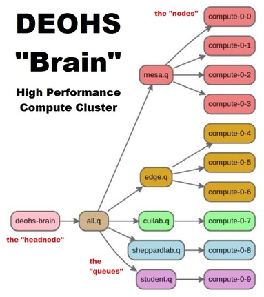
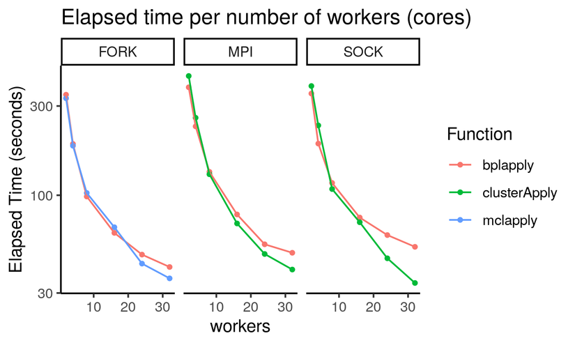
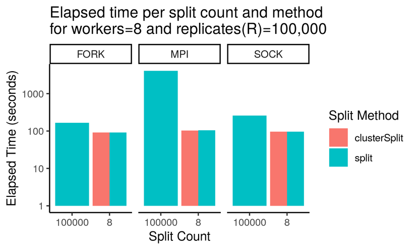
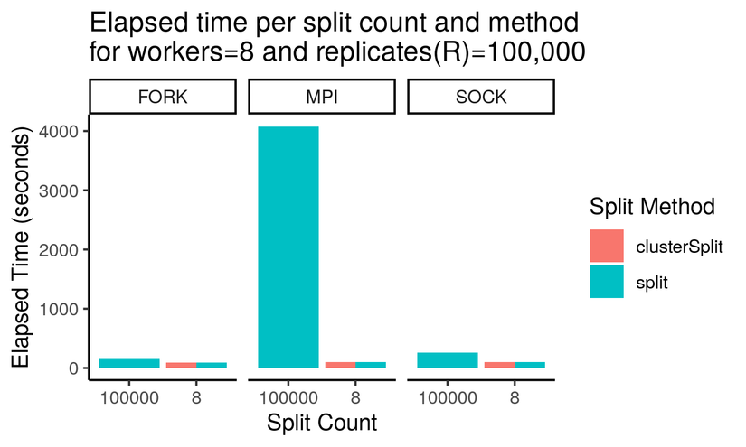

```{r set_knitr_options, echo = FALSE, message=FALSE, warning=FALSE}
suppressMessages(library(knitr))
opts_chunk$set(tidy = FALSE, cache = FALSE, echo = TRUE)
```


## Cluster Computing 

Today's presentation addresses these objectives: 

- Know what a **compute cluster** is and when you would use it
- Differentiate between a **compute node** and the **head node**
- Know the **resources** available on "deohs-brain"
- Know how to **connect** to the compute cluster "deohs-brain"
- Know how to start and **manage jobs** on the cluster
- Know how to use the cluster for **parallel processing**

## What is a compute cluster?

A **compute cluster** is a collection of computers configured with:

- One or more **compute nodes**
- A **head node** that runs a **job scheduler**
- **Access control** to limit access to the cluster

## When would you use compute cluster?

You will want to use a compute cluster when:

- Your work is too **resource intensive** for your other systems
- Your work would benefit from **more cores and memory**
- You can configure your software (code) to use more cores
- You want to use the resources of **multiple machines simultaneously**

## What are head and compute nodes?

The **head node** is where you:

- **Connect** to the cluster
- **Configure** your software environment (e.g., install packages)
- Configure, **launch**, and manage **batch jobs**
- Launch **interactive sessions**
- Transfer data into and out of the cluster

The **compute nodes** are where you **run** your jobs and interactive sessions.

## The DEOHS compute cluster

<div class="columns-2">


<br/>

|                    |             |
| :----------------- | -----------:|
| Head node          | deohs-brain |
| # Queues           |          5+ |
| Total # Cores      |        500+ |
| # Cores/node       |       24-32 |
| # Slots/node       |       48-64 |
| Total Memory (RAM) |       4+ TB |
| Memory/node        |      384 GB |
| Documentation      |       [wiki](https://github.com/deohs/ehbrain/wiki) |

</div>

## How to connect

You can connect to "deohs-brain" through:

- SSH via terminal app like [PuTTY](https://www.chiark.greenend.org.uk/~sgtatham/putty/) or from [command-line](https://www.ssh.com/ssh/command/#specifying-a-different-user-name)
- SCP, SFTP via terminal app or GUI app like [CyberDuck](https://github.com/deohs/ehbrain/wiki/Transferring-Data-to-Brain#desktop-or-laptop-initiated)
- [Remote Desktop](https://github.com/deohs/ehbrain/wiki/Connecting-to-Brain#xrdp) or [X2Go](https://github.com/deohs/ehbrain/wiki/Connecting-to-Brain#x2go) (for interactive "desktop" sessions)
  + X2Go will likely be preferred for Windows users, as it will be easier to configure
  + Mac users will have a better experience using Remote Desktop versus X2Go
    - Or you can run X2Go from within a Remote Desktop server session
- Documented in the [wiki](https://github.com/deohs/ehbrain/wiki/Connecting-to-Brain)

## How to manage jobs

You can launch either interactive sessions or batch jobs:

- Interactive sessions are launched with `qlogin`:
  + `qlogin -q QUEUE -pe smp NSLOTS`
  + Yes, you can [run RStudio Desktop on a compute node](https://github.com/deohs/ehbrain/wiki/Quick-Tutorial)
- Batch jobs are launched with `qsub`
- Batch jobs can use a single machine (**smp**) or more (**mpi**)
- You can view jobs with `qstat` (yours) or `qstat -f -u "*"` (all)
- You can delete jobs with `qdel`
- Batch jobs are often [launched](https://github.com/deohs/ehbrain/wiki/Running-a-Compute-Job#scheduling-a-job) using a **job file**:
  + [mpi example](mpi_demo/mpi_demo_2.sh) and [smp example](mpi_demo/smp_demo_2.sh)

## Parallel processing on the cluster

- Some software has multicore capabilities built-in. 
- For R, you can use packages like **parallel** and **BiocParallel**.
- Batch jobs run across multiple nodes also need **Rmpi**.

Installation of some packages may be a little tricky. See:

- [Rmpi install script](mpi_demo/install_rmpi_MPICH.sh)
- [BiocParallel install script](mpi_demo/install_BiocParallel.sh)

## Parallel R performance

- **MPI** is required for use across multiple nodes (Use: `-pe mpi`)
- **FORK** and **SOCK** only run on single nodes (Use: `-pe smp`)
- The incremental speedup from additional cores will diminish
- Test and tune your code before running full workload
- Performance varies with communications overhead
- With a test [script](mpi_demo/cluster_demo.R), we found:
   + Cluster types FORK, SOCK, and MPI are comparable
   + **BiocParallel** is slower when using many workers (> 16)
- **Your code may perform differently so do your own tests.**

## Parallel R performance plot



## Reducing "overhead"

It's like the benefits of mass transit and carpooling...


Each vehicle has overhead: fuel, maintenance, insurance, congestion, etc. So, 
you want to fit passengers taking the same route at the same time on as few
vehicles as possible.

## Splitting tasks by workers

You can **reduce overhead** by splitting the number of total replications 
("passengers") by the number of workers ("vehicles"). That way, each worker only 
gets initialized once.

```{r, eval=FALSE}
# Setup
workers <- 8
R <- 10000

# Total replicates (R) is much greater than the number of workers
ci_boot <- mclapply(1:R, f, mc.cores = workers)

# Splitting replicates by number of workers will speed up processing
X.split <- split(1:R, rep_len(1:workers, length(1:R)))
mclapply(X.split, f, mc.cores = workers)
```

Alternatives to using **split** are **clusterSplit** and **parLapply**.

## Splitting tasks by workers

In one [test](mpi_demo/split_test.md), using 8 workers and 10,000 total 
replications, splitting improved speed by 36-38%. 

| pkg           | fun           | splitlen  | elapsed |
| :------------ | :------------ | :-------- | ------: |
| base          | lapply        | R         |  94.321 |
| parallel      | mclapply      | R         |  14.648 |
| parallel      | mclapply      | workers   |   9.071 |
| BiocParallel  | bplapply      | R         |  15.696 |
| BiocParallel  | bplapply      | workers   |  10.001 |

## Splitting tasks by workers plot



## Splitting tasks by workers plot



## Splitting tasks by workers: Conclusions

- Without splitting, MPI can take over 6x longer than single core
  + With splitting, MPI can peform as well as FORK and SOCK
- Splitting will speed-up FORK ("mclapply") by up to 40%
- Splitting will speed-up SOCK ("clusterApply") by up to 65%
- "split" and "clusterSplit" methods perform equally well
  + "parLapply" does the splitting for you, but is slower

## Tips

- Keep track of your sessions and jobs
- Close any unused/idle sessions and jobs
- Verify that what you have closed has actually ended
- Install packages on the head node
- Run heavy-duty jobs on compute nodes 
- Use one more slot than the number of workers
- Number of parallel tasks should equal the number of workers
- Clean up your "home" and "scratch" folders regularly
- Use terminal sessions when you don't really need a GUI
- If you use a graphical desktop, **log out** when finished
