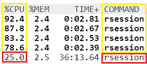

## Using Parallel Processing in R 

Today's example demonstrates these objectives: 

- Understand what parallel computing is and when it may be useful

- Understand how parallelism can work

- Understand and use the parallel package multicore functions

- Use parallel processing with bootstrap functions 

## What is parallel processing? 

CPUs, or Central Processing Units, are responsible for processing and executing instructions. Older CPUs had a single processing core, but modern CPUs have multiple cores making it possible to execute multiple processes simultaneously.  

Sequential (or serial) processing executes one process at a time and all other processes wait until the first one is completed. 

Parallel processing can start multiple processes simultaneously on their own. 

Breaking up a larger computation into smaller pieces that can be computed on multiple cores. 

## When to use parallel processing? 

Computations can:  

- Take up too much *cpu* time 
     _(cpu-bound)_

- Take up too much *memory* 
     _(memory-bound)_

- Take too much time to *read/write from disk* 
      _(I/O-bound)_


Parallel processing becomes useful when computation takes a long time. Assuming that the overhead of setting up additional resources (copying data to additional cores and creating new processes) does not drastically reduce efficiency. 


## Parallel Processing Packages

Packages will essentially a split a list across multiple cores of a processor and then the function can be applied to each subset of the list object on each of the cores. 

- Split list X across multiple cores

- Copy the supplied function (and associated environment) to each of the cores

- Apply the supplied function to each subset of the list X on each of the cores in parallel

- Assemble the results of all the function evaluations into a single list and return


 
## The Parallel Package    

Using the `parallel` package `mclapply()` function essentially parallelizes calls to `lapply()`

 
`mclapply(X, FUN, ..., mc.preschedule = TRUE, mc.set.seed = TRUE,
         mc.silent = FALSE, mc.cores = 1L,
         mc.cleanup = TRUE, mc.allow.recursive = TRUE)`

<font size="4">

`X` = a vector (atomic or list) or an object

`FUN` = the function to be applied to each element of X

`mc.cores` =  the number of cores to use, i.e.at most how many child processes will be run simultaneously. 

</font>

## The Parallel Package    

There are two main ways in which code can be parallelized, via sockets or via forking. The forking approach copies the entire current version of R and moves it to a new core.

The mclapply() function works via the fork mechanism on Unix-style operating systems. 

Your R session is the main process and when you call a function like mclapply(), you fork a series of sub-processes that operate independently from the main process. We will see this later in the terminal. 


## Example: Single Core Processing

`lapply()` is applies a function to a list element, while the other elements of the list are sitting in memory 
 


```r
# Load packages
library(lme4)
```

```
## Loading required package: Matrix
```

```r
# Load data
data("iris")

# Test function 
f <- function(i) {
  lmer(Petal.Width ~ . - Species + (1 | Species), data = iris)
}
```

## Example: Single Core Processing


```r
# Function to compare run times : system.time()  
system.time(lapply(1:100, f))
```

```
##    user  system elapsed 
##   3.578   0.002   3.595
```


## Example: Parallel Processing 


Sub-processes then execute your function on their subsets of the data, presumably on separate cores of your CPU.

Once the computation is complete, each sub-process returns its results and then the sub-process is killed. 

Don't use all your cores if you are running other operations or sharing a machine.  


```r
# Load packages
library(parallel)

# Check the number of cores you have access to 
detectCores()
```

```
## [1] 16
```

## Example: Parallel Processing 


```r
# Test function 
# Split this job across 4 cores
system.time(mclapply(1:100, f, mc.cores = 4))
```

```
##    user  system elapsed 
##   3.441   0.690   1.498
```

## Example: Parallel Processing 

Using terminal you can see the multiple sub-processes generated by `mclapply()` 

Terminal: `top -u $USER` 

For this example you should see 5 rows where the COMMAND is labelled rsession. 

One is the primary R session and the other 4 are the sub-processes.
 

 
##  The Boot Package 

Using the `boot` package `boot()` function to generate R bootstrap replicates of a statistic applied to data

`boot(data, statistic, R, sim = "ordinary", stype = c("i", "f", "w"),
strata = rep(1,n), L = NULL, m = 0, weights = NULL,
ran.gen = function(d, p) d, mle = NULL, simple = FALSE, ...,
parallel = c("no", "multicore", "snow"),
ncpus = getOption("boot.ncpus", 1L), cl = NULL)`

<font size="4">


`data` = data as a vector, matrix or data frame 

`statistic` = function which when applied to data returns a vector containing the statistic(s)
of interest

`R` = the number of bootstrap replicates

`parallel` = type of parallel operation to be used (if any)

`ncpus` =  integer: number of processes to be used in parallel operation

</font>

  
##  Using Bootstrapping 

*Example multicore bootstrapping using the "boot" package.*

The boot package provides extensive facilities for bootstrapping and related resampling methods.


```r
# Load packages
library(boot)
library(reshape2)
library(doBy)

# Load data
data("mtcars")
```

##  Using Bootstrapping 

*Example multicore bootstrapping using the "boot" package.*


```r
# Define variables
df <- mtcars
num_cores <- 4
nboot <- 10000
formulas <- c('mpg ~ cyl', 'mpg ~ cyl + disp', 'mpg ~ cyl + disp + hp')
formulas
```

```
## [1] "mpg ~ cyl"             "mpg ~ cyl + disp"      "mpg ~ cyl + disp + hp"
```


## Functions for example 

 

```r
# Define function to run model and return variables of interest
stat.fun <- function(data, ind, formula, model.fun, elem, cols, ...) {
  rand.ind <- sample(ind, replace = TRUE)
  do.call(model.fun, list(formula, data[rand.ind,], ...))[[elem]]
}
```

## Functions for example 


```r
# Define function to clean model output
clean.fun <- function(df, .formula) {
  df$boot <- row.names(df)
  df$formula <- .formula
  n <- ncol(df) - 2
  df <- df[, c('formula', 'boot', names(df)[1:n])]
  df <- melt(df, id.vars = c('formula', 'boot'))
  row.names(df) <- NULL
  names(df) <- c('formula', 'boot', 'variable', 'est')
  df
}
 
# Define function to calculate mean and confidence interval
mean.ci.fun <- function(x, alpha = 0.05) {
  c(mean = mean(x), quantile(x, probs = c(alpha / 2, 1 - alpha / 2)))
}
```

## Running Model on a Single Core 

First let's run the model on a single core. 


```r
# Run model for all formulas with bootstraps - single core
system.time(df.long <- do.call('rbind', lapply(formulas, function(f) {
  boot.res <- boot(data = df, statistic = stat.fun, R = nboot,
                   formula = f, model.fun = 'lm', elem = 'coefficients')
  out <- as.data.frame(boot.res$t)
  names(out) <- names(boot.res$t0)
  clean.fun(out, f)
})))
```

```
##    user  system elapsed 
##  54.111   0.054  54.206
```


## Running Model on Multiple Cores 

Running the model on a multiple core we see a lower elapsed time. 


```r
# Run model for all formulas with bootstraps - multicore for Linux/macOS
system.time(df.long <- do.call('rbind', lapply(formulas, function(f) {
  boot.res <- boot(data = df, statistic = stat.fun, R = nboot, 
                   parallel = 'multicore', ncpus = num_cores,
                   formula = f, model.fun = 'lm', elem = 'coefficients')
  out <- as.data.frame(boot.res$t)
  names(out) <- names(boot.res$t0)
  clean.fun(out, f)
})))
```

```
##    user  system elapsed 
##  55.573   3.346  15.476
```


## Summary 


```r
# Summarize results by formula and variable
summaryBy(est ~ formula + variable, data = df.long, FUN = mean.ci.fun)
```

```
##                 formula    variable    est.mean    est.2.5%    est.97.5%
## 1             mpg ~ cyl (Intercept) 37.86933283 31.17179687 45.039077650
## 2             mpg ~ cyl         cyl -2.87582495 -3.89750576 -1.911400462
## 3      mpg ~ cyl + disp (Intercept) 34.80400907 28.54288128 42.925086637
## 4      mpg ~ cyl + disp         cyl -1.65228890 -3.49348254 -0.117392388
## 5      mpg ~ cyl + disp        disp -0.01940062 -0.04485136  0.008888813
## 6 mpg ~ cyl + disp + hp (Intercept) 34.38218156 28.04787936 42.529270017
## 7 mpg ~ cyl + disp + hp         cyl -1.23348440 -3.30301392  0.688152415
## 8 mpg ~ cyl + disp + hp        disp -0.01711764 -0.04346891  0.011795279
## 9 mpg ~ cyl + disp + hp          hp -0.01881100 -0.07233116  0.016093373
```

## Exercises 

1. Implement `mcapply()` in your own code. Compare system time between single and multicore processing. 

2. Examine processing times for models with long vs. short computing time.  


## References 

[R Programming for Data Science - Roger D. Peng](https://bookdown.org/rdpeng/rprogdatascience/parallel-computation.html) 
 
[Parallel Processing in R - Josh Errickson](https://dept.stat.lsa.umich.edu/~jerrick/courses/stat701/notes/parallel.html) 

[Quick Intro to Parallel Computing in R - Matt Jones](https://nceas.github.io/oss-lessons/parallel-computing-in-r/parallel-computing-in-r.html)
