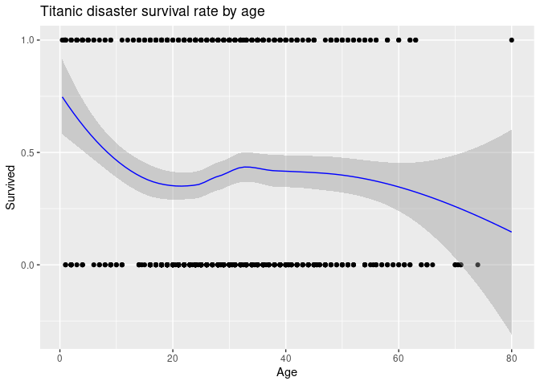
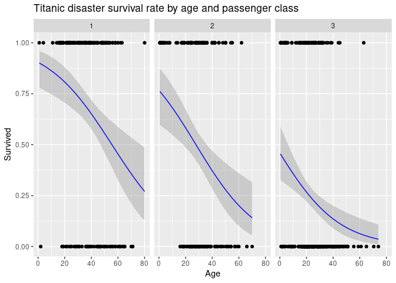
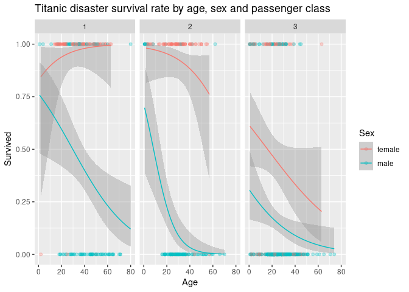

# Setup

Rmarkdown setup, directory organization, and data download.


# Goal

The goal of this exercise is to learn how to efficiently run many models and
extract results in a tidy manner.
 
# Acknowledgements 

Broom, https://broom.tidymodels.org/

Modeling tutorial, https://r4ds.had.co.nz/model-basics.html#model-basics 

 
# What is modeling? 

Models are a tool for extracting patterns out of data.  

In R, the `lm()`, or “linear model,” function can be used to create a simple
regression model. Ideally, the model will capture true “signals” (i.e. patterns
generated by the phenomenon of interest), and ignore “noise” (i.e. random
variation that you’re not interested in).

# Load and prepare data


```r
#load data from "titanic" package 
titanic <- as.data.frame(titanic_train) 

# Prepare dataset 
titanic <- titanic_train %>% drop_na()

# view names in the dataset 
names(titanic)
```

```
##  [1] "PassengerId" "Survived"    "Pclass"      "Name"        "Sex"        
##  [6] "Age"         "SibSp"       "Parch"       "Ticket"      "Fare"       
## [11] "Cabin"       "Embarked"
```

```r
# view structure of dataset
glimpse(titanic)
```

```
## Rows: 714
## Columns: 12
## $ PassengerId <int> 1, 2, 3, 4, 5, 7, 8, 9, 10, 11, 12, 13, 14, 15, 16, 17, 19…
## $ Survived    <int> 0, 1, 1, 1, 0, 0, 0, 1, 1, 1, 1, 0, 0, 0, 1, 0, 0, 0, 1, 1…
## $ Pclass      <int> 3, 1, 3, 1, 3, 1, 3, 3, 2, 3, 1, 3, 3, 3, 2, 3, 3, 2, 2, 3…
## $ Name        <chr> "Braund, Mr. Owen Harris", "Cumings, Mrs. John Bradley (Fl…
## $ Sex         <chr> "male", "female", "female", "female", "male", "male", "mal…
## $ Age         <dbl> 22, 38, 26, 35, 35, 54, 2, 27, 14, 4, 58, 20, 39, 14, 55, …
## $ SibSp       <int> 1, 1, 0, 1, 0, 0, 3, 0, 1, 1, 0, 0, 1, 0, 0, 4, 1, 0, 0, 0…
## $ Parch       <int> 0, 0, 0, 0, 0, 0, 1, 2, 0, 1, 0, 0, 5, 0, 0, 1, 0, 0, 0, 0…
## $ Ticket      <chr> "A/5 21171", "PC 17599", "STON/O2. 3101282", "113803", "37…
## $ Fare        <dbl> 7.2500, 71.2833, 7.9250, 53.1000, 8.0500, 51.8625, 21.0750…
## $ Cabin       <chr> "", "C85", "", "C123", "", "E46", "", "", "", "G6", "C103"…
## $ Embarked    <chr> "S", "C", "S", "S", "S", "S", "S", "S", "C", "S", "S", "S"…
```

# Typical regression modeling workflow

After preparing data, typical regression modeling steps might be:

  * fit a model (e.g. with `lm()`)
  * call `summary()` on the model fit object
  * extract values and parameters of interest by accessing pieces of the summary
    (e.g. with the `$` operator) 
  * build a table with extracted vales by one or a combination of the following:
    - assigning extracted pieces to objects 
    - extracting pieces within a dataframe or table call 
    - copying and pasting output into another program (e.g. MS word or excel)


```r
# fit model and assign for use in later calculations and analyses 
mod1 <- lm(Survived ~ Age, data = titanic)

# save model summary  
mod1_summary <- summary(mod1) 

# print summary 
mod1_summary
```

```
## 
## Call:
## lm(formula = Survived ~ Age, data = titanic)
## 
## Residuals:
##     Min      1Q  Median      3Q     Max 
## -0.4811 -0.4158 -0.3662  0.5789  0.7252 
## 
## Coefficients:
##              Estimate Std. Error t value Pr(>|t|)    
## (Intercept)  0.483753   0.041788  11.576   <2e-16 ***
## Age         -0.002613   0.001264  -2.067   0.0391 *  
## ---
## Signif. codes:  0 '***' 0.001 '**' 0.01 '*' 0.05 '.' 0.1 ' ' 1
## 
## Residual standard error: 0.4903 on 712 degrees of freedom
## Multiple R-squared:  0.005963,	Adjusted R-squared:  0.004567 
## F-statistic: 4.271 on 1 and 712 DF,  p-value: 0.03912
```

```r
# examine what elements are in the `summary.lm` object
names(mod1_summary)
```

```
##  [1] "call"          "terms"         "residuals"     "coefficients" 
##  [5] "aliased"       "sigma"         "df"            "r.squared"    
##  [9] "adj.r.squared" "fstatistic"    "cov.unscaled"
```

```r
# options to access coefficients 
coefficients(mod1_summary)
```

```
##                 Estimate Std. Error   t value     Pr(>|t|)
## (Intercept)  0.483752625 0.04178795 11.576367 1.619100e-28
## Age         -0.002612541 0.00126412 -2.066687 3.912465e-02
```

```r
mod1_summary$coefficients
```

```
##                 Estimate Std. Error   t value     Pr(>|t|)
## (Intercept)  0.483752625 0.04178795 11.576367 1.619100e-28
## Age         -0.002612541 0.00126412 -2.066687 3.912465e-02
```

```r
# access R2
mod1_summary$r.squared
```

```
## [1] 0.005963097
```

As you can see in the previous chunk, the `summary()` function provides us with
information, including t-test, F-test, R-squared, residuals, and significance
values. However, these values are not saved in a manner that we can easily use
the results as data. You can access data with the `$` operator like the example
above, and also copy and paste results out of the console, but if you had many
models you wanted to explore, this could quickly become time-consuming and
tedious. 

Constructing a summary table, such as the one below also becomes
daunting when the number of models gets larger. The example below isn't awful in
terms of best practices, but it is going to be impractical when the number of
models grows.


```r
# new models
mod2_summary <- summary(lm(Survived ~ Age + Sex, data = titanic))
mod3_summary <- summary(lm(Survived ~ Age + Sex + Pclass, data = titanic))
mod4_summary <- summary(lm(Survived ~ Age + Sex + Fare, data = titanic))

# you could construct a list, something like this to store the model results
coeffs <- list(
  mod1 = as_data_frame(mod1_summary$coefficients, rownames = "coefficient"),
  mod2 = as_data_frame(mod2_summary$coefficients, rownames = "coefficient"),
  mod3 = as_data_frame(mod3_summary$coefficients, rownames = "coefficient"),
  mod4 = as_data_frame(mod4_summary$coefficients, rownames = "coefficient")
) %>% 
  
  # then the models together 
  bind_rows(.id = "model") %>% 
  
  # round if needed...
  mutate_if(is.double, round, 3)

# show summary
coeffs
```

```
## # A tibble: 13 x 6
##    model coefficient Estimate `Std. Error` `t value` `Pr(>|t|)`
##    <chr> <chr>          <dbl>        <dbl>     <dbl>      <dbl>
##  1 mod1  (Intercept)    0.484        0.042    11.6        0    
##  2 mod1  Age           -0.003        0.001    -2.07       0.039
##  3 mod2  (Intercept)    0.78         0.039    19.8        0    
##  4 mod2  Age           -0.001        0.001    -0.858      0.391
##  5 mod2  Sexmale       -0.547        0.032   -16.9        0    
##  6 mod3  (Intercept)    1.33         0.063    21.2        0    
##  7 mod3  Age           -0.005        0.001    -5.04       0    
##  8 mod3  Sexmale       -0.479        0.031   -15.6        0    
##  9 mod3  Pclass        -0.203        0.019   -10.7        0    
## 10 mod4  (Intercept)    0.72         0.04     18.0        0    
## 11 mod4  Age           -0.002        0.001    -1.53       0.127
## 12 mod4  Sexmale       -0.511        0.032   -15.8        0    
## 13 mod4  Fare           0.002        0         5.69       0
```


# Extracting model fit using `broom` 

In the previous sections we saw that model results are stored in an object,
internally this is a list of values. The package `broom` has functions to help
summarize key information about models in tidy tibbles.

  * `tidy()` summarizes information about model components
  * `glance()` reports information about the entire model

Using `tidy()` on a model object produces a `tibble` where each row contains
information about an important component of the model. For regression models,
this corresponds to regression coefficients. This is can be useful if you want
to inspect a model or create custom visualizations.

We'll use the `tidy()` and `glance()` functions from the `broom` packages in
the next section, so let's first take a look at what they do, how they'll fit into
the many models framework, and how they can help us more easily summarize many
models. We use `kable` from the `knitr` package to create a table. 

* Note *

When using mixed models, i.e. running many models with `lme4::lmer()`, we
extract estimates using `broom.mixed::tidy()`.


```r
# tidy produces a dataframe of the model coefficients, which can be piped right
# into a table
tidy(mod1) %>% kable(digits = 3)
```


|term        | estimate| std.error| statistic| p.value|
|:-----------|--------:|---------:|---------:|-------:|
|(Intercept) |    0.484|     0.042|    11.576|   0.000|
|Age         |   -0.003|     0.001|    -2.067|   0.039|

```r
# glance provides a dataframe of the performace measures
glance(mod1)
```

```
## # A tibble: 1 x 12
##   r.squared adj.r.squared sigma statistic p.value    df logLik   AIC   BIC
##       <dbl>         <dbl> <dbl>     <dbl>   <dbl> <dbl>  <dbl> <dbl> <dbl>
## 1   0.00596       0.00457 0.490      4.27  0.0391     1  -503. 1013. 1026.
## # … with 3 more variables: deviance <dbl>, df.residual <int>, nobs <int>
```


# Programmatically specify regression models

While our 4 models isn't so difficult to handle, we hope to demonstrate some
useful techniques for times when there are many more models to run.

## Brute force method
 
Next, let's specify the formulas, run the regressions and organize the output
with `broom` functions programmatically. Once the parameters of interest are in
a dataframe, they can be manipulated easily with familiar `dplyr` functions.

We use `lapply()` from `base` to apply `glance()` and `tidy()` to many models. 


```r
# define formulas using `modelr::formulas()`
lm_formulas <- formulas(~Survived, 
                        mod1 = ~ Age, 
                        mod2 = ~ Age + Sex, 
                        mod3 = ~ Age + Sex + Pclass,
                        mod4 = ~ Age + Sex + Fare)

# fit models
mdls <- lapply(lm_formulas, lm, data = titanic)

# extract overall model parameters and coefficient summaries into lists
coeff_summ <- lapply(mdls, tidy, conf.int = TRUE)
model_summ <- lapply(mdls, glance)

# create overall model summary table
model_summ_tbl <- model_summ %>% 
  bind_rows(.id = "model") %>% 
  mutate(formula = as.character(lm_formulas)) %>% 
  select(model, formula, r.squared, p.value, AIC) %>% 
  mutate_if(is.double, round, 3)

# show tables
model_summ_tbl
```

```
## # A tibble: 4 x 5
##   model formula                       r.squared p.value   AIC
##   <chr> <chr>                             <dbl>   <dbl> <dbl>
## 1 mod1  Survived ~ Age                    0.006   0.039 1013.
## 2 mod2  Survived ~ Age + Sex              0.291   0      773.
## 3 mod3  Survived ~ Age + Sex + Pclass     0.39    0      668.
## 4 mod4  Survived ~ Age + Sex + Fare       0.322   0      743.
```

## Nested approach

Often we are faced with a dataset we'd like to run stratified models on. The
nesting workflow makes that pretty easy.

We need to use `lapply()` with `map()` because we are using many models and
`fit_with()` created `list` output like `lapply()` would have. We use `lapply()`
to get "inside" of the `list` output of `fit_with()`.


```r
# define formulas again 
# (this is unnecessary to repeat, but just here so this chunk is self-contained)
lm_formulas <- formulas(~Survived, 
                        mod1 = ~ Age, 
                        mod2 = ~ Age + Sex, 
                        mod3 = ~ Age + Sex + Pclass,
                        mod4 = ~ Age + Sex + Fare)

# run nested data pipeline
df_nested <- titanic %>% 
  
  # remove missing values (not marked `NA`)
  filter (Embarked != "") %>% 
  
  # group by variable of interest, then nest
  group_by(Embarked) %>% 
  nest() %>% 
  
  # use `mutate()` to fit models and extract parameters of interest
  mutate(
    
    # using `map` fit the linear models
    # `map` is from the purr package
    model = map(.x = data, .f = ~fit_with(lm, lm_formulas, data = .x)),
    
    # extract model summaries with `glance()`
    model_summ = map(model, ~lapply(.x, glance)),
    
    # extract model coefficient estimates with `tidy()`
    coeff_summ = map(model, ~lapply(.x, tidy))
    ) 

# at this point we still have a nested dataframe, let's take a look
df_nested
```

```
## # A tibble: 3 x 5
## # Groups:   Embarked [3]
##   Embarked data                   model          model_summ      coeff_summ     
##   <chr>    <list>                 <list>         <list>          <list>         
## 1 S        <tibble[,11] [554 × 1… <named list [… <named list [4… <named list [4…
## 2 C        <tibble[,11] [130 × 1… <named list [… <named list [4… <named list [4…
## 3 Q        <tibble[,11] [28 × 11… <named list [… <named list [4… <named list [4…
```

From here we have to `unnest()` the nested columns.


```r
# lets make a function to extract objects/columns of interest in the nested
# dataframe and rearrange with dplyr
extract_nested <- function(nested, variable, frmls){
  
  # define variable for use in non-standard evaluation in pipeline
  var <- enquo(variable)
  
  # start with nested dataframe
  nested %>%
    
    # select columns of interest (note use of `!!` indicating `var` should be evaluated)
    select(Embarked, !!var) %>% 
    
    # unnest 
    unnest(!!var) %>% 
    
    # add model formulas to dataframe
    mutate(formula = as.character(frmls)) %>% 
    
    # unnest
    unnest(!!var) %>% 
    
    # put formulas all the way to the left 
    relocate(formula) %>% 
    
    # round 
    mutate_if(is.double, round, 3)
  
}


# use function for coefficient summary 
extract_nested(nested = df_nested, variable = coeff_summ, frmls = lm_formulas)
```

```
## # A tibble: 39 x 7
## # Groups:   Embarked [3]
##    formula                Embarked term     estimate std.error statistic p.value
##    <chr>                  <chr>    <chr>       <dbl>     <dbl>     <dbl>   <dbl>
##  1 Survived ~ Age         S        (Interc…    0.434     0.047     9.20    0    
##  2 Survived ~ Age         S        Age        -0.002     0.001    -1.68    0.094
##  3 Survived ~ Age + Sex   S        (Interc…    0.741     0.046    16.2     0    
##  4 Survived ~ Age + Sex   S        Age        -0.001     0.001    -0.753   0.452
##  5 Survived ~ Age + Sex   S        Sexmale    -0.528     0.037   -14.2     0    
##  6 Survived ~ Age + Sex … S        (Interc…    1.27      0.075    17.1     0    
##  7 Survived ~ Age + Sex … S        Age        -0.005     0.001    -3.80    0    
##  8 Survived ~ Age + Sex … S        Sexmale    -0.472     0.035   -13.3     0    
##  9 Survived ~ Age + Sex … S        Pclass     -0.198     0.023    -8.74    0    
## 10 Survived ~ Age + Sex … S        (Interc…    0.676     0.048    14.1     0    
## # … with 29 more rows
```

```r
# let's assign the the model summary to an object
df_model_summ <- extract_nested(nested = df_nested, 
                                variable = model_summ, 
                                frmls = lm_formulas)

# show model summary
df_model_summ
```

```
## # A tibble: 12 x 14
## # Groups:   Embarked [3]
##    formula Embarked r.squared adj.r.squared sigma statistic p.value    df logLik
##    <chr>   <chr>        <dbl>         <dbl> <dbl>     <dbl>   <dbl> <dbl>  <dbl>
##  1 Surviv… S            0.005         0.003 0.48       2.81   0.094     1 -379. 
##  2 Surviv… S            0.272         0.269 0.411    103.     0         2 -292. 
##  3 Surviv… S            0.361         0.357 0.386    104.     0         3 -256. 
##  4 Surviv… S            0.293         0.289 0.406     75.9    0         3 -284. 
##  5 Surviv… C            0.022         0.015 0.487      2.91   0.091     1  -89.8
##  6 Surviv… C            0.325         0.314 0.406     30.5    0         2  -65.8
##  7 Surviv… C            0.403         0.389 0.383     28.3    0         3  -57.8
##  8 Surviv… C            0.359         0.344 0.397     23.6    0         3  -62.3
##  9 Surviv… Q            0.045         0.009 0.458      1.23   0.277     1  -16.8
## 10 Surviv… Q            0.336         0.283 0.39       6.32   0.006     2  -11.8
## 11 Surviv… Q            0.372         0.293 0.387      4.74   0.01      3  -11.0
## 12 Surviv… Q            0.337         0.254 0.397      4.07   0.018     3  -11.7
## # … with 5 more variables: AIC <dbl>, BIC <dbl>, deviance <dbl>,
## #   df.residual <int>, nobs <int>
```


# Plotting models in `ggplot`

We can visualize patterns in the data with `ggplot()` by plotting the
relationship between variables with `stat_smooth(formula = , family = )`.


```r
# simple lm plot
# Create plot.
ggplot(titanic, aes(x = Age, y = Survived)) + geom_point() + 
  stat_smooth(formula = "y ~ x", family = "binomial",
              color = "blue", size = 0.5) + 
   ggtitle('Titanic disaster survival rate by age')
```

<!-- -->

With facets we can view the relationship by categories. 


```r
# Create plot.
ggplot(titanic, aes(x = Age, y = Survived)) + geom_point() + 
  stat_smooth(formula = "y ~ x", method = "glm", 
              method.args = list(family = "binomial"), 
              color = "blue", size = 0.5) + 
  facet_wrap(~ Pclass) + 
  ggtitle('Titanic disaster survival rate by age and passenger class')
```

<!-- -->

We can also add additional variables to plot by color or facet.


```r
ggplot(titanic, aes(x = Age, y = Survived, color = Sex)) + 
  geom_point(alpha = 0.3) + 
  stat_smooth(formula = "y ~ x", size = 0.5, 
              method = "glm", method.args = list(family = "binomial")) + 
  facet_grid(cols = vars(Pclass)) + 
  ggtitle('Titanic disaster survival rate by age, sex and passenger class')
```

<!-- -->


# Session Information, Code, and Functions

The next three chunks should be included in the appendix of every R Markdown so 
that you document your session information, code, and functions defined in the 
document. This supports the reproducibility of your work.


```r
#-----session information: beginning of Appendix -----------

# This promotes reproducibility by documenting the version of R and every package
# you used.
sessionInfo()
```

```
## R version 3.6.3 (2020-02-29)
## Platform: x86_64-pc-linux-gnu (64-bit)
## Running under: Ubuntu 20.04.2 LTS
## 
## Matrix products: default
## BLAS:   /usr/lib/x86_64-linux-gnu/blas/libblas.so.3.9.0
## LAPACK: /usr/lib/x86_64-linux-gnu/lapack/liblapack.so.3.9.0
## 
## locale:
##  [1] LC_CTYPE=en_US.UTF-8       LC_NUMERIC=C              
##  [3] LC_TIME=en_US.UTF-8        LC_COLLATE=en_US.UTF-8    
##  [5] LC_MONETARY=en_US.UTF-8    LC_MESSAGES=en_US.UTF-8   
##  [7] LC_PAPER=en_US.UTF-8       LC_NAME=C                 
##  [9] LC_ADDRESS=C               LC_TELEPHONE=C            
## [11] LC_MEASUREMENT=en_US.UTF-8 LC_IDENTIFICATION=C       
## 
## attached base packages:
## [1] stats     graphics  grDevices utils     datasets  methods   base     
## 
## other attached packages:
##  [1] titanic_0.1.0    lubridate_1.7.10 broom_0.7.5      readr_1.4.0     
##  [5] purrr_0.3.4      ggplot2_3.3.3    stringr_1.4.0    modelr_0.1.8    
##  [9] tidyr_1.1.3      dplyr_1.0.5      knitr_1.31       pacman_0.5.1    
## 
## loaded via a namespace (and not attached):
##  [1] Rcpp_1.0.6        highr_0.8         pillar_1.5.1      compiler_3.6.3   
##  [5] tools_3.6.3       digest_0.6.27     lattice_0.20-40   nlme_3.1-144     
##  [9] evaluate_0.14     lifecycle_1.0.0   tibble_3.1.0      gtable_0.3.0     
## [13] mgcv_1.8-31       pkgconfig_2.0.3   rlang_0.4.10      Matrix_1.2-18    
## [17] rstudioapi_0.13   cli_2.3.1         DBI_1.1.1         yaml_2.2.1       
## [21] xfun_0.22         withr_2.4.1       hms_1.0.0         generics_0.1.0   
## [25] vctrs_0.3.7       grid_3.6.3        tidyselect_1.1.0  glue_1.4.2       
## [29] R6_2.5.0          fansi_0.4.2       rmarkdown_2.7     farver_2.1.0     
## [33] magrittr_2.0.1    splines_3.6.3     backports_1.2.1   scales_1.1.1     
## [37] ellipsis_0.3.1    htmltools_0.5.1.1 assertthat_0.2.1  colorspace_2.0-0 
## [41] labeling_0.4.2    utf8_1.2.1        stringi_1.5.3     munsell_0.5.0    
## [45] crayon_1.4.1
```


```r
#-----setup options-----

# Set knitr options
knitr::opts_chunk$set(
  echo = TRUE,
  cache = FALSE,
  cache.comments = FALSE,
  message = FALSE,
  warning = FALSE
)

# Clear workspace of all objects and unload all extra (non-base) packages
rm(list = ls(all = TRUE))

if (!is.null(sessionInfo()$otherPkgs)) {
  res <- suppressWarnings(lapply(
    paste('package:', names(sessionInfo()$otherPkgs), sep = ""),
    detach,
    character.only = TRUE,
    unload = TRUE,
    force = TRUE
  ))
  
}
#-----load libraries pacman-----

# load pacman, installing if needed
if (!require("pacman")) {install.packages("pacman")}

# load other packages, installing as needed
pacman::p_load(knitr, dplyr, tidyr, modelr, stringr, ggplot2, purrr, readr,
               broom, lubridate, stats, titanic)

 
#load data from "titanic" package 
titanic <- as.data.frame(titanic_train) 

# Prepare dataset 
titanic <- titanic_train %>% drop_na()

# view names in the dataset 
names(titanic)

# view structure of dataset
glimpse(titanic)


# fit model and assign for use in later calculations and analyses 
mod1 <- lm(Survived ~ Age, data = titanic)

# save model summary  
mod1_summary <- summary(mod1) 

# print summary 
mod1_summary

# examine what elements are in the `summary.lm` object
names(mod1_summary)

# options to access coefficients 
coefficients(mod1_summary)
mod1_summary$coefficients

# access R2
mod1_summary$r.squared


# new models
mod2_summary <- summary(lm(Survived ~ Age + Sex, data = titanic))
mod3_summary <- summary(lm(Survived ~ Age + Sex + Pclass, data = titanic))
mod4_summary <- summary(lm(Survived ~ Age + Sex + Fare, data = titanic))

# you could construct a list, something like this to store the model results
coeffs <- list(
  mod1 = as_data_frame(mod1_summary$coefficients, rownames = "coefficient"),
  mod2 = as_data_frame(mod2_summary$coefficients, rownames = "coefficient"),
  mod3 = as_data_frame(mod3_summary$coefficients, rownames = "coefficient"),
  mod4 = as_data_frame(mod4_summary$coefficients, rownames = "coefficient")
) %>% 
  
  # then the models together 
  bind_rows(.id = "model") %>% 
  
  # round if needed...
  mutate_if(is.double, round, 3)

# show summary
coeffs


# tidy produces a dataframe of the model coefficients, which can be piped right
# into a table
tidy(mod1) %>% kable(digits = 3)

# glance provides a dataframe of the performace measures
glance(mod1)


# define formulas using `modelr::formulas()`
lm_formulas <- formulas(~Survived, 
                        mod1 = ~ Age, 
                        mod2 = ~ Age + Sex, 
                        mod3 = ~ Age + Sex + Pclass,
                        mod4 = ~ Age + Sex + Fare)

# fit models
mdls <- lapply(lm_formulas, lm, data = titanic)

# extract overall model parameters and coefficient summaries into lists
coeff_summ <- lapply(mdls, tidy, conf.int = TRUE)
model_summ <- lapply(mdls, glance)

# create overall model summary table
model_summ_tbl <- model_summ %>% 
  bind_rows(.id = "model") %>% 
  mutate(formula = as.character(lm_formulas)) %>% 
  select(model, formula, r.squared, p.value, AIC) %>% 
  mutate_if(is.double, round, 3)

# show tables
model_summ_tbl


# define formulas again 
# (this is unnecessary to repeat, but just here so this chunk is self-contained)
lm_formulas <- formulas(~Survived, 
                        mod1 = ~ Age, 
                        mod2 = ~ Age + Sex, 
                        mod3 = ~ Age + Sex + Pclass,
                        mod4 = ~ Age + Sex + Fare)

# run nested data pipeline
df_nested <- titanic %>% 
  
  # remove missing values (not marked `NA`)
  filter (Embarked != "") %>% 
  
  # group by variable of interest, then nest
  group_by(Embarked) %>% 
  nest() %>% 
  
  # use `mutate()` to fit models and extract parameters of interest
  mutate(
    
    # using `map` fit the linear models
    # `map` is from the purr package
    model = map(.x = data, .f = ~fit_with(lm, lm_formulas, data = .x)),
    
    # extract model summaries with `glance()`
    model_summ = map(model, ~lapply(.x, glance)),
    
    # extract model coefficient estimates with `tidy()`
    coeff_summ = map(model, ~lapply(.x, tidy))
    ) 

# at this point we still have a nested dataframe, let's take a look
df_nested


# lets make a function to extract objects/columns of interest in the nested
# dataframe and rearrange with dplyr
extract_nested <- function(nested, variable, frmls){
  
  # define variable for use in non-standard evaluation in pipeline
  var <- enquo(variable)
  
  # start with nested dataframe
  nested %>%
    
    # select columns of interest (note use of `!!` indicating `var` should be evaluated)
    select(Embarked, !!var) %>% 
    
    # unnest 
    unnest(!!var) %>% 
    
    # add model formulas to dataframe
    mutate(formula = as.character(frmls)) %>% 
    
    # unnest
    unnest(!!var) %>% 
    
    # put formulas all the way to the left 
    relocate(formula) %>% 
    
    # round 
    mutate_if(is.double, round, 3)
  
}


# use function for coefficient summary 
extract_nested(nested = df_nested, variable = coeff_summ, frmls = lm_formulas)

# let's assign the the model summary to an object
df_model_summ <- extract_nested(nested = df_nested, 
                                variable = model_summ, 
                                frmls = lm_formulas)

# show model summary
df_model_summ

# simple lm plot
# Create plot.
ggplot(titanic, aes(x = Age, y = Survived)) + geom_point() + 
  stat_smooth(formula = "y ~ x", family = "binomial",
              color = "blue", size = 0.5) + 
   ggtitle('Titanic disaster survival rate by age')

# Create plot.
ggplot(titanic, aes(x = Age, y = Survived)) + geom_point() + 
  stat_smooth(formula = "y ~ x", method = "glm", 
              method.args = list(family = "binomial"), 
              color = "blue", size = 0.5) + 
  facet_wrap(~ Pclass) + 
  ggtitle('Titanic disaster survival rate by age and passenger class')
ggplot(titanic, aes(x = Age, y = Survived, color = Sex)) + 
  geom_point(alpha = 0.3) + 
  stat_smooth(formula = "y ~ x", size = 0.5, 
              method = "glm", method.args = list(family = "binomial")) + 
  facet_grid(cols = vars(Pclass)) + 
  ggtitle('Titanic disaster survival rate by age, sex and passenger class')
#-----session information: beginning of Appendix -----------

# This promotes reproducibility by documenting the version of R and every package
# you used.
sessionInfo()

#-----appendix------------
#-----functions defined in this Rmd ------------

# Show the names of all functions defined in the .Rmd
# (e.g. loaded in the environment)
lsf.str()

# Show the definitions of all functions loaded into the current environment  
lsf.str() %>% set_names() %>% map(get, .GlobalEnv)
```


```r
#-----functions defined in this Rmd ------------

# Show the names of all functions defined in the .Rmd
# (e.g. loaded in the environment)
lsf.str()
```

```
## extract_nested : function (nested, variable, frmls)
```

```r
# Show the definitions of all functions loaded into the current environment  
lsf.str() %>% set_names() %>% map(get, .GlobalEnv)
```

```
## $extract_nested
## function(nested, variable, frmls){
##   
##   # define variable for use in non-standard evaluation in pipeline
##   var <- enquo(variable)
##   
##   # start with nested dataframe
##   nested %>%
##     
##     # select columns of interest (note use of `!!` indicating `var` should be evaluated)
##     select(Embarked, !!var) %>% 
##     
##     # unnest 
##     unnest(!!var) %>% 
##     
##     # add model formulas to dataframe
##     mutate(formula = as.character(frmls)) %>% 
##     
##     # unnest
##     unnest(!!var) %>% 
##     
##     # put formulas all the way to the left 
##     relocate(formula) %>% 
##     
##     # round 
##     mutate_if(is.double, round, 3)
##   
## }
## <bytecode: 0x55ed0f952670>
```
