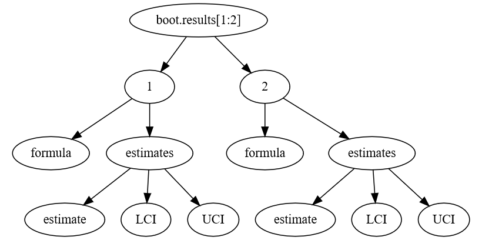

```{r header, include=FALSE}
# Filename: chicago_pollution.Rmd
# Copyright (c) University of Washington
# License: MIT https://opensource.org/licenses/MIT (See LICENSE file.)
# Repository: https://github.com/deohs/coders
```

## Objectives

Many models:

* Automate "many models" with base-R using Chicago pollution data.
* Produce a table of model estimates for various combinations of covariates.

Background processing:

* Demonstrate alternative ways to render (knit) Rmd files.
* Explore the use of the `screen` utility.

Modular programming:

* Demonstrate use of the `source` function to read code from other R scripts.
* Compare using `source` for functions to creating and using packages.

## Setup

```{r setup}
# Set knitr options
knitr::opts_chunk$set(echo = TRUE, cache = FALSE)
options("kableExtra.html.bsTable" = TRUE)
```

```{r load_packages}
# Load packages
pacman::p_load(dlnm, ThermIndex, kableExtra, data.tree)
```

## Get the data

Import the `chicagoNMMAPS` dataset from the `dlnm` package:

```{r get_data}
data(chicagoNMMAPS)
df <- chicagoNMMAPS
```

From `help('chicagoNMMAPS', dlnm)`:

```
date:   Date in the period 1987-2000.
time:   The sequence of observations
year:   Year
month:  Month (numeric)
doy:    Day of the year
dow:    Day of the week (factor)
death:  Counts of all cause mortality excluding accident
cvd:    Cardiovascular Deaths
resp:   Respiratory Deaths
temp:   Mean temperature (in Celsius degrees)
dptp:   Dew point temperature
rhum:   Mean relative humidity
pm10:   PM10
o3:     Ozone
```

## Prepare the base models

Create base model formulas from vectors of outcomes and exposures.

```{r prepare_base_model_formulas}
# Calculate humidex
df$hmdx <- with(df, humidex(temp, rhum))

# Make vector of outcomes
outcomes <- c("death", "cvd", "resp")

# Make vector of exposures
exposures <- c("pm10", "o3")

# Make formula of outcomes associated w/exposures for each possible combination
base_models <- paste0(outcomes, " ~ ", rep(exposures, each = length(outcomes)))
```

Here are the resulting base model formulas:

```{r view_base_models}
base_models
```

## Add the covariates to models

From a vector of covariates, create a vector of model formulas.

```{r add_covariates}
# Make a vector of model covariates expanded as "A", "A + B", "A + B + C", etc.
sep <- ' + '
covariate <- c("temp", "dptp", "rhum", "hmdx", "dow")
covariates <- sapply(seq_along(covariate), 
                     function(i) paste(covariate[1:i], collapse = sep))

# Develop all combinations of exposures, outcomes, covariates 
models <- paste0(rep(base_models, each = length(covariates)), sep, covariates)
```

## View the models

```{r view_models, echo = FALSE}
models_df <- data.frame(`Exposure = PM10` = models[grepl('pm10', models)], 
                        `Exposure = O3` = models[grepl('o3', models)],  
                        check.names = FALSE)
x_html <- knitr::kable(x = models_df, format = 'html')
kable_styling(x_html, full_width = TRUE, bootstrap_options = 'condensed')
```

## Create the bootstrap samples

Create `boot_samples` with `sample` function using `lapply`.

```{r create_boot_samples}
nBoot <- 10
set.seed(12345)
boot_samples <- lapply(1:nBoot, 
                       function(x) df[sample(1:nrow(df), replace = TRUE), ])
```

Examine the resulting list of dataframes.

```{r examine_boot_samples}
length(boot_samples)
dim(boot_samples[[1]])
```

## Define a function to run models

Define a function to run models and return a data frame of model results.

```{r define_get_model_results_function}
get_model_results <- function(.data, .formula, alpha = 0.05, weights = NULL) {
  # .data is a list of dataframes of bootstraps, .formula is model formula.
  # Credit: This function was modified from code by Cooper Schumacher.
  out <- list()
  out$formula <- .formula
  .formula <- as.formula(.formula)
  coefs <- as.data.frame(matrix(unlist(lapply(.data, function(y) {
        if (!is.null(weights)) lm(.formula, y, weights = weights)$coef
        else lm(.formula, y)$coef
      })), nrow = length(seq_along(.data)), byrow = TRUE))
  colnames(coefs) <- names(lm(.formula, .data[[1]])$coef)
  
  est <- sapply(coefs, mean)
  LCI <- sapply(coefs, function(z) quantile(z, alpha / 2))
  UCI <- sapply(coefs, function(z) quantile(z, 1 - alpha / 2))
  out$estimates <- data.frame(cbind(estimate = est, LCI = LCI, UCI = UCI))
  out
}
```

## Define functions to combine results

Define functions to combine the results into single dataframe with columns: 
model, variable, estimate, LCI, UCI.

```{r define_combine_model_results_functions}
model_result_to_df <- function(.data) {
  # .data is a list containing a dataframe of estimates for one model.
  df <- .data$estimates
  df$variable <- rownames(df)
  df$model <- .data$formula
  df[, c("model", "variable", "estimate", "LCI", "UCI")]
}

combine_model_results <- function(.data) {
  # .data is a list of models, each with a list with a dataframe of estimates.
  df <- do.call('rbind', lapply(.data, model_result_to_df))
  df[order(df$model, df$variable), ]
}
```

## Define functions to visualize lists

Define functions to use with the `data.tree` package to visualize lists.

```{r define_functions_to_visualize_lists}
# From: https://stackoverflow.com/questions/51608378

depth <- function(x) ifelse(is.list(x), 1 + max(sapply(x, depth)), 0)

toTree <- function(x) {
  d <- depth(x)
  if(d > 1) {
    lapply(x, toTree)
  } else {
    children <- lapply(names(x), function(nm) list(name = nm))
  }
}

plot_list_structure <- function(x) {
  plot(FromListSimple(toTree(x), nodeName = deparse(substitute(x))))
}
```

## Run the models

Run all models and extract the results into a list of lists of dataframes.

```{r get_results}
model_results <- lapply(models, 
                        function(model) get_model_results(boot_samples, model))
```

Visualize structure of first item of results list.

```{r visualize_model_results_structure, warning=FALSE, eval=FALSE}
plot_list_structure(model_results[[1]])
```



## Combine the results

Combine the results into a single dataframe.

```{r combine_results}
df_results <- combine_model_results(model_results)
```

View the structure of the results dataframe.

```{r view_str_results}
str(df_results, vec.len = 3)
```

## O3 exposure model estimates

```{r show_results_o3, echo = FALSE}
df_results_x <- df_results[df_results$variable == 'o3', ]
row.names(df_results_x) <- NULL
x_html <- knitr::kable(x = df_results_x, format = 'html')
kable_styling(x_html, full_width = TRUE, bootstrap_options = 'condensed')
```

## PM10 exposure model estimates

```{r show_results_pm10, echo = FALSE}
df_results_x <- df_results[df_results$variable == 'pm10', ]
row.names(df_results_x) <- NULL
x_html <- knitr::kable(x = df_results_x, format = 'html')
kable_styling(x_html, full_width = TRUE, bootstrap_options = 'condensed')
```

## Appendix A: Alternate ways to render

### In the R console:

```
rmarkdown::render("chicago_pollution.Rmd")
```

### In the Terminal (Bash):

```
Rscript -e 'rmarkdown::render("chicago_pollution.Rmd")'
```

### In the Jobs tab:

* Create a R script containing: `rmarkdown::render("chicago_pollution.Rmd")`
* In the Jobs tab, click "Start Local Job" and configure to run R script.

## Appendix B: The "screen" utility

With the "screen" utility you can run multiple shell processes simultaneously.

* `screen` creates a new screen. (Use Ctrl+A D to detach.)
* `screen -S "NAME"` creates a new screen named "NAME".
* `screen -dmS "NAME" CMD` creates a screen "NAME", runs CMD, and detaches.
* `screen -r` connects to a running screen. (Or use `screen -r "NAME"`.)
* `screen -list` or `screen -ls` shows running screens.


## Appendix C: Read code with "source"

As an alternative to defining the function in the Rmd file as we did above, we
can also save the function in a separate file and import it using the `source`
function.

```{r, eval=FALSE}
source('model_lib.R')
```

This might be useful if the Rmd was exceedingly long and unwieldy to work with.

However, storing code separately like this may make it harder for others to 
follow or to verify reproducibility. One school of thought favors modularity 
for managability and code reuse, while the other prefers a monolithic approach.

## Discussion: "source" versus packages

If your functions are generally useful independently of this project, it may 
be wise to share them as a package insted of using `source`. What do you think?
