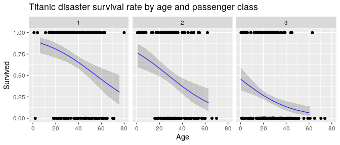

## Purpose

This document provides two methods of plotting a logistic regression using 
`glm()` and `ggplot()` with faceting.

## Method #1: Let ggplot() do all of the work

This version only uses the "training" dataset. Code was modified from this
Stackoverflow thread:

- [multiple log regression models ggplot2](https://stackoverflow.com/questions/42361672/)


```r
# Load pacman, installing if needed.
if (!require("pacman")) 
  install.packages("pacman", repos = "http://cran.r-project.org")

# Load other packages, installing as needed.
pacman::p_load(dplyr, tidyr, ggplot2, titanic)

# Prepare dataset.
train_df <- titanic_train %>% select(Survived, Age, Pclass) %>% drop_na()

# Create plot.
ggplot(train_df, aes(x = Age, y = Survived)) + geom_point() + 
  stat_smooth(formula = "y ~ x", method = "glm", 
              method.args = list(family = "binomial"), 
              color = "blue", size = 0.5) + 
  facet_wrap(~ Pclass) + 
  ggtitle('Titanic disaster survival rate by age and passenger class')
```


We can add additional variables to plot by color or facet.


```r
train_df <- titanic_train %>% select(Survived, Age, Sex, Pclass) %>% drop_na()

ggplot(train_df, aes(x = Age, y = Survived, color = Sex)) + 
  geom_point(alpha = 0.3) + 
  stat_smooth(formula = "y ~ x", size = 0.5, 
              method = "glm", method.args = list(family = "binomial")) + 
  facet_grid(cols = vars(Pclass)) + 
  ggtitle('Titanic disaster survival rate by age, sex and passenger class')
```


```r
ggplot(train_df, aes(x = Age, y = Survived)) + geom_point(alpha = 0.3) + 
  stat_smooth(formula = "y ~ x", color = "blue", size = 0.5, 
              method = "glm", method.args = list(family = "binomial")) + 
  facet_grid(cols = vars(Pclass), rows = vars(Sex)) + 
  ggtitle('Titanic disaster survival rate by age, sex and passenger class')
```


## Method #2: Perform calculations before plotting

This version uses both "training" and "testing" datasets. Code was modified 
from these Stackoverflow threads:

- [ggplot2: stat_smooth for logistic outcomes with facet_wrap returning 'full' or 'subset' glm models](https://stackoverflow.com/questions/8662018/) 
- [Confidence intervals for predictions from logistic regression](https://stackoverflow.com/questions/14423325/)

### Setup


```r
# Load pacman, installing if needed.
if (!require("pacman")) 
  install.packages("pacman", repos = "http://cran.r-project.org")

# Load other packages, installing as needed.
pacman::p_load(dplyr, tidyr, broom, purrr, ggplot2, titanic)
```

### Prepare the dataset


```r
train_df <- titanic_train %>% select(Survived, Age, Pclass) %>% drop_na()
train_df_nest <- train_df %>% group_by(Pclass) %>% nest() %>% rename(train = data)

# Note: Replace titanic_test with titanic_train to reproduce Figure 1 (Method #1).
test_df <- titanic_test %>% select(Age, Pclass) %>% drop_na()
test_df_nest <- test_df %>% group_by(Pclass) %>% nest() %>% rename(test = data)

df_nest <- train_df_nest %>% inner_join(test_df_nest, by = "Pclass")
```

### Model Estimates

Calculate estimates and predictions.


```r
# Run glm(), tidy(), and predict() to get estimates and predictions.
df <- df_nest %>% 
  mutate(model = map(train, ~glm("Survived ~ Age", "binomial", .x))) %>% 
  mutate(est = map(model, tidy, conf.int = TRUE, conf.level = 0.95)) %>%
  mutate(preds = map2(model, test, predict.glm, type = "link", se.fit = TRUE))

# Run unnest() to prepare a dataset of estimates.
res <- df %>% select(-train, -test, -model, -preds) %>% unnest(everything()) %>%
  arrange(Pclass, term)
```

View estimates.


```r
knitr::kable(res)
```


| Pclass|term        |   estimate| std.error|  statistic|   p.value|   conf.low|  conf.high|
|------:|:-----------|----------:|---------:|----------:|---------:|----------:|----------:|
|      1|(Intercept) |  2.2425170| 0.4912807|  4.5646345| 0.0000050|  1.3165251|  3.2500813|
|      1|Age         | -0.0404384| 0.0114339| -3.5367100| 0.0004051| -0.0636649| -0.0186515|
|      2|(Intercept) |  1.1892650| 0.3985280|  2.9841442| 0.0028437|  0.4326362|  2.0034998|
|      2|Age         | -0.0427987| 0.0124081| -3.4492572| 0.0005621| -0.0683326| -0.0194074|
|      3|(Intercept) | -0.1646439| 0.2788204| -0.5905017| 0.5548543| -0.7125944|  0.3834310|
|      3|Age         | -0.0421584| 0.0112630| -3.7430953| 0.0001818| -0.0648804| -0.0206502|

### Predictions and Confidence Intervals

Calculate confidence intervals (95%).


```r
# Calculate the value of the Gaussian distribution giving 95% coverage.
critval <- round(qnorm(0.975), 2)    # 1.96

# Use the "critval" (above) to calculate the 95% confidence intervals (lwr, upr).
preds_df <- df %>% 
  select(Pclass, test, model, preds) %>% 
  mutate(fit = map(preds, ~.x$fit), 
         se.fit = map(preds, ~.x$se.fit),
         lwr = map2(fit, se.fit, ~.x - (critval * .y)),
         upr = map2(fit, se.fit, ~.x + (critval * .y))) %>%
  mutate(linkinv = map(model, ~.x[['family']][['linkinv']]),
         fit = map(fit, linkinv),
         lwr = map(lwr, linkinv),
         upr = map(upr, linkinv)) %>%
  select(Pclass, test, fit, lwr, upr) %>%
  unnest(everything())
```

### Plot

Points and model are from the "training" data but the fit line and confidence 
intervals use the "testing" data.


```r
# Create plot.
ggplot(train_df, aes(x = Age, y = Survived)) + 
  geom_point() + 
  geom_ribbon(data = preds_df, 
              aes(y = fit, ymin = lwr, ymax = upr), alpha = 0.2) +
  geom_line(data = preds_df, aes(y = fit), 
            color = "blue", size = 0.5, alpha = 0.8) + 
  facet_wrap(~ Pclass) + 
  ggtitle('Titanic disaster survival rate by age and passenger class')
```



