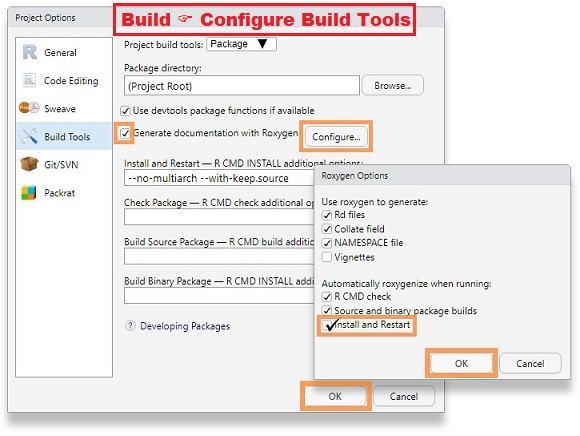

```{r header, include=FALSE}
# Filename: building_r_packages.Rmd
# Copyright (c) University of Washington
# License: MIT https://opensource.org/licenses/MIT (See LICENSE file.)
# Repository: https://github.com/deohs/coders
```

```{r setup, include=FALSE}
knitr::opts_chunk$set(echo = TRUE, cache = FALSE)
options(pillar.sigfig = 7)
```

```{r get_template, include=FALSE}
# Copy template from package folder to work around Pandoc bug on Windows.
# If file is missing from template_dir, then first rendering attempt may fail.
template_pkg <- file.path(system.file(package = 'rmarkdown'), 
                          'rmd', 'ioslides', 'default.html')
if (.Platform$OS.type == "windows" & length(grep(' ', template_pkg) > 0)) { 
  template_dir <- file.path('..', '..', '..', 'templates')
  dir.create(template_dir, showWarnings = FALSE)
  template_loc <- file.path(template_dir, 'ioslides_template.html')
  if (!file.exists(template_loc)) {
    file.copy(template_pkg, template_loc, copy.mode = FALSE)
  }
}
```

## Building R Packages

Today's example demonstrates these objectives:

* [Create an R package](https://hub.packtpub.com/how-to-create-your-own-r-package-with-rstudio-tutorial/) from some functions [using RStudio](https://support.rstudio.com/hc/en-us/articles/200486488-Developing-Packages-with-RStudio).
* Use [Roxygen comments](http://r-pkgs.had.co.nz/man.html) to generate package documentation.
* Include working examples for functions.
* Publish the package to Github.

The code and this presentation are free to share and modify according to the 
[MIT License](https://github.com/deohs/coders/blob/master/LICENSE).

## What's in an R package?

Normally, you will want to create a package from functions you find generally 
useful.

You may also include small data files for use in examples.

Some packages just offer data files, such as the `datasets` package.

All packages should have documentation for each function and dataset included.

## Requirements

You need to have the following packages installed to create R packages:

* `devtools`
* `roxygen2`

```{r install_packages, eval=FALSE}
install.packages(c('devtools', 'roxygen2'))
```

## Example: Many Models

We will build a package called `many.models` from two functions:

```{r many.models.functions}
extract.elem <- function(.data, .formula, .fun, elem, ...) {
  as.data.frame(do.call('rbind', lapply(.formula, function(f) {
    df <- as.data.frame(
      do.call(.fun, list(formula = quote(f), data = .data, ...))[[elem]])
    names(df) <- c('value')
    df$variable <- row.names(df)
    df$formula <- f
    row.names(df) <- NULL
    df
  })), optional = TRUE)
}

elem.to.wide <- function(.data) {
  df.wide <- stats::reshape(.data, 
                 timevar = 'variable', 
                 idvar = 'formula', 
                 direction = 'wide')
  names(df.wide) <- gsub('^value\\.', '', names(df.wide))
  row.names(df.wide) <- NULL
  df.wide
}
```

## Example usage: `extract.elem`

To see what these functions do, let's look at a simple example.

```{r example_usage_1}
library(datasets)
data(mtcars)

formulas <- c('mpg ~ cyl', 'mpg ~ cyl + disp', 'mpg ~ cyl + disp + hp')
df <- extract.elem(.data = mtcars, .formula = formulas, 
                   .fun = 'lm', elem = 'coefficients')
df
```

## Example usage: `elem.to.wide`

The second function is just for reshaping.

```{r example_usage_2}
df.wide <- elem.to.wide(df)
df.wide
```

## Equivalent with `tidyverse` ...

This is equivalent to the following `tidyverse` pipeline:

```{r tidyverse_setup, echo = FALSE}
if (! suppressPackageStartupMessages(require(pacman))) {
  install.packages('pacman', repos = 'http://cran.us.r-project.org')
}
pacman::p_load(dplyr, tidyr, purrr, broom)
```

```{r tidyverse_version}
tibble(.formula = formulas) %>% group_by(.formula) %>% nest() %>% 
  mutate(model = map(data, ~lm(.formula, mtcars))) %>% 
  mutate(result = map(model, tidy)) %>% unnest(cols = c(result)) %>% 
  select(-data, -model, -std.error, -statistic, -p.value) %>% 
  pivot_wider(names_from = 'term', values_from = estimate)
```

## More examples

These functions were written to be flexible. Here we see some variations on 
their use.

```{r more_examples}
df.residuals <- extract.elem(.data = mtcars, .formula = formulas, 
                             .fun = 'lm', elem = 'residuals')

set.seed(1)
weights <- c(abs(rnorm(nrow(mtcars))))

df.weighted <- extract.elem(.data = mtcars, .formula = formulas, 
                            .fun = 'lm', elem = 'coefficients',
                            weights = weights)

df.inv.gauss <- extract.elem(.data = mtcars, .formula = formulas, 
                             .fun = 'glm', elem = 'coefficients',
                             family = 'inverse.gaussian')
```

## Creating the package

Here are the steps we will take:

1. Save each function in it's own file.
2. Create a new RStudio project, selecting:

     "File" → "New Project" → "New Directory" → "R Package"

3. Type in the package name of "many.models".
4. Add the function files to the package.
5. Check the checkbox for "Create a git repository".
6. Click "Create Project".

## Configure build tools



## Adding documentation

We will add documention by:

1. Editing the DESCRIPTION file.
2. Adding a LICENSE file.
3. Adding Roxygen comments to the R files.
4. Include examples with Roxygen comments.
5. Add a `README.md` file (optional but recommended).

NOTE: Update the version number in the DESCRIPTION file with each revision of 
your package.

## Building the package

First, we will test the package with: 

     "Build" → "Check Package"

Then we will build the package with: 

     "Build" → "Clean and Rebuild"

Finally, we prepare documentation and install the package with: 

     "Build" → "Install and Restart"

NOTE: Repeat these steps whenever you make changes to your package.

## Testing the package

We can test the package by viewing the help and running the examples.

```{r testing_the_package, eval=FALSE}
?extract.elem
?elem.to.wide
example("elem.to.wide", "many.models")
```

## Posting to Github

We will post to Github by:

1. Creating an empty repository on Github
2. Adding files with the Terminal command `git add .`
3. Committing with `git commit -m 'First commit.'`
4. Adding an "origin" with: 

     `git remote add origin https://github.com/username/reponame`

5. Pushing the commit with: `git push origin master`

NOTE: Repeat steps 2-5 whenever you make changes to your package.

## Testing the package again

We can install the package to a different environment, like a different 
computer, and test as before:

```{r installing_and_testing_the_package, eval=FALSE}
pacman::p_load_gh("brianhigh/many.models")

# Or:
#devtools::install_github("brianhigh/many.models")
#library(many.models)

?extract.elem
?elem.to.wide
example("elem.to.wide", "many.models")
```

## Exercises

1. Create a package from one or more functions you have written. Include a LICENSE 
file. Post your package on Github. If you don't have any you would like to work with, you may also use the functions in the [plot_lib.R](https://github.com/deohs/coders/blob/master/demos/models/bootstrapping/plot_lib.R) from a previous session. For this, include the Coders [LICENSE](https://github.com/deohs/coders/blob/master/LICENSE) file.

2. Modify the `many.models` package to use refactored functions with 
`tidyverse` pipelines. Name the package `many_models` do differentiate it 
from the original version.
