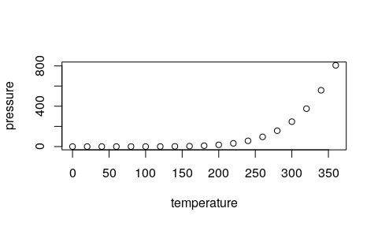

<!-- Note: Custom CSS changes title font and removes footer gradient. -->
<!-- Note: Custom HTML template replaces logo with banner on title page.-->

## R Markdown

This is an R Markdown presentation. Markdown is a simple formatting syntax for authoring HTML, PDF, and MS Word documents. For more details on using R Markdown see <http://rmarkdown.rstudio.com>.

When you click the **Knit** button a document will be generated that includes both content as well as the output of any embedded R code chunks within the document.

## Slide with Bullets

- Bullet 1
- Bullet 2
- Bullet 3

## Slide with R Output


```r
summary(cars)
```

```
##      speed           dist       
##  Min.   : 4.0   Min.   :  2.00  
##  1st Qu.:12.0   1st Qu.: 26.00  
##  Median :15.0   Median : 36.00  
##  Mean   :15.4   Mean   : 42.98  
##  3rd Qu.:19.0   3rd Qu.: 56.00  
##  Max.   :25.0   Max.   :120.00
```

## Slide with Table


```r
library(kableExtra)
knitr::kable(head(iris)) %>% kable_styling(font_size = 18)
```

<table class="table" style="font-size: 18px; margin-left: auto; margin-right: auto;">
 <thead>
  <tr>
   <th style="text-align:right;"> Sepal.Length </th>
   <th style="text-align:right;"> Sepal.Width </th>
   <th style="text-align:right;"> Petal.Length </th>
   <th style="text-align:right;"> Petal.Width </th>
   <th style="text-align:left;"> Species </th>
  </tr>
 </thead>
<tbody>
  <tr>
   <td style="text-align:right;"> 5.1 </td>
   <td style="text-align:right;"> 3.5 </td>
   <td style="text-align:right;"> 1.4 </td>
   <td style="text-align:right;"> 0.2 </td>
   <td style="text-align:left;"> setosa </td>
  </tr>
  <tr>
   <td style="text-align:right;"> 4.9 </td>
   <td style="text-align:right;"> 3.0 </td>
   <td style="text-align:right;"> 1.4 </td>
   <td style="text-align:right;"> 0.2 </td>
   <td style="text-align:left;"> setosa </td>
  </tr>
  <tr>
   <td style="text-align:right;"> 4.7 </td>
   <td style="text-align:right;"> 3.2 </td>
   <td style="text-align:right;"> 1.3 </td>
   <td style="text-align:right;"> 0.2 </td>
   <td style="text-align:left;"> setosa </td>
  </tr>
  <tr>
   <td style="text-align:right;"> 4.6 </td>
   <td style="text-align:right;"> 3.1 </td>
   <td style="text-align:right;"> 1.5 </td>
   <td style="text-align:right;"> 0.2 </td>
   <td style="text-align:left;"> setosa </td>
  </tr>
  <tr>
   <td style="text-align:right;"> 5.0 </td>
   <td style="text-align:right;"> 3.6 </td>
   <td style="text-align:right;"> 1.4 </td>
   <td style="text-align:right;"> 0.2 </td>
   <td style="text-align:left;"> setosa </td>
  </tr>
  <tr>
   <td style="text-align:right;"> 5.4 </td>
   <td style="text-align:right;"> 3.9 </td>
   <td style="text-align:right;"> 1.7 </td>
   <td style="text-align:right;"> 0.4 </td>
   <td style="text-align:left;"> setosa </td>
  </tr>
</tbody>
</table>

## Slide with Plot


```r
plot(pressure)
```

<!-- -->

## Slide with Crosstalk Elements {.smaller}

<!--html_preserve--><div class="form-group crosstalk-input crosstalk-input-slider js-range-slider" id="mag" style="width: 400px;">
<label class="control-label" for="mag">Magnitude</label>
<input data-type="double" data-min="4" data-max="5.7" data-from="4" data-to="5.7" data-step="0.1" data-grid="true" data-grid-num="8.5" data-grid-snap="false" data-prettify-separator="," data-keyboard="true" data-keyboard-step="5.88235294117647" data-drag-interval="true" data-data-type="number"/>
<script type="application/json" data-for="mag">{
  "values": [4, 4, 4, 4, 4, 4.1, 4.1, 4.1, 4.1, 4.1, 4.2, 4.2, 4.2, 4.2, 4.2, 4.2, 4.2, 4.2, 4.2, 4.3, 4.3, 4.3, 4.3, 4.3, 4.3, 4.3, 4.3, 4.3, 4.4, 4.4, 4.4, 4.4, 4.4, 4.4, 4.4, 4.4, 4.4, 4.4, 4.5, 4.5, 4.5, 4.5, 4.5, 4.5, 4.5, 4.5, 4.5, 4.5, 4.5, 4.5, 4.5, 4.6, 4.6, 4.6, 4.6, 4.6, 4.6, 4.6, 4.6, 4.6, 4.6, 4.6, 4.6, 4.7, 4.7, 4.7, 4.7, 4.7, 4.7, 4.7, 4.7, 4.8, 4.8, 4.8, 4.8, 4.8, 4.9, 4.9, 4.9, 4.9, 4.9, 5, 5, 5.1, 5.1, 5.1, 5.1, 5.1, 5.1, 5.1, 5.1, 5.3, 5.3, 5.3, 5.4, 5.4, 5.4, 5.5, 5.5, 5.7],
  "keys": ["772", "34", "26", "362", "85", "194", "776", "595", "895", "835", "217", "939", "274", "831", "387", "566", "140", "864", "287", "278", "582", "441", "824", "36", "619", "984", "182", "773", "301", "417", "48", "464", "323", "756", "469", "418", "804", "382", "475", "999", "898", "634", "339", "578", "491", "926", "755", "343", "422", "178", "901", "172", "476", "141", "527", "478", "309", "596", "428", "677", "350", "715", "246", "622", "513", "306", "156", "471", "990", "929", "169", "165", "661", "838", "969", "630", "320", "186", "272", "501", "980", "295", "398", "916", "381", "367", "137", "618", "378", "312", "385", "249", "758", "623", "965", "363", "214", "358", "948", "151"],
  "group": ["SharedData4412ca22"]
}</script>
</div><!--/html_preserve--><!--html_preserve--><div class="container-fluid crosstalk-bscols">
<div class="fluid-row">
<div class="col-xs-6">
<div id="htmlwidget-a5745c5846c73a1ae5d2" style="width:400px;height:300px;" class="leaflet html-widget"></div>
<script type="application/json" data-for="htmlwidget-a5745c5846c73a1ae5d2">{"x":{"options":{"crs":{"crsClass":"L.CRS.EPSG3857","code":null,"proj4def":null,"projectedBounds":null,"options":{}}},"calls":[{"method":"addSelect","args":["SharedData4412ca22"]},{"method":"addTiles","args":["//{s}.tile.openstreetmap.org/{z}/{x}/{y}.png",null,null,{"minZoom":0,"maxZoom":18,"tileSize":256,"subdomains":"abc","errorTileUrl":"","tms":false,"noWrap":false,"zoomOffset":0,"zoomReverse":false,"opacity":1,"zIndex":1,"detectRetina":false,"attribution":"&copy; <a href=\"http://openstreetmap.org\">OpenStreetMap<\/a> contributors, <a href=\"http://creativecommons.org/licenses/by-sa/2.0/\">CC-BY-SA<\/a>"}]},{"method":"addMarkers","args":[[-23.36,-13.09,-20.83,-22.04,-25.68,-21.13,-34.63,-24.78,-26.67,-16.4,-14.43,-20.57,-20.77,-21.52,-16.24,-12.59,-32.9,-24.08,-24.18,-20.43,-12.66,-15.24,-17.4,-16.14,-16.99,-23.3,-15.44,-35.48,-20.16,-29.09,-30.63,-23.55,-21.38,-11.77,-17.1,-17.67,-21.77,-12.66,-20.65,-23.34,-22.09,-21.48,-21.98,-22.2,-30.01,-21.79,-21.3,-25.82,-17.82,-17.74,-20.48,-27.89,-20.61,-18.05,-24.33,-19.92,-19.83,-27.27,-19.14,-18.07,-12.16,-20.49,-15.86,-18.84,-20.87,-20.47,-17.94,-20.06,-15.36,-30.24,-16,-19.4,-27.99,-17.68,-16.9,-16.51,-23,-20.99,-15.97,-32.7,-18.48,-12.93,-15.87,-24.41,-27.21,-12.93,-17.7,-20.04,-27.27,-24.6,-19.6,-13.47,-26.6,-17.42,-25.81,-23.43,-32.14,-22.16,-18.11,-19.3],[180.01,169.28,185.9,183.95,180.34,185.6,179.1,179.22,182.4,182.73,167.26,181.33,181.16,169.75,167.95,167.1,181.6,179.5,179.02,182.37,169.46,186.21,187.8,187.32,187,179.7,167.18,179.9,181.99,183.2,180.9,180.8,181.39,166.32,182.68,187.09,181,166.37,181.32,184.5,180.38,182.44,179.6,180.58,180.8,185,180.92,179.33,181.49,181.25,169.76,182.92,182.6,180.86,179.97,183.91,182.04,182.38,184.36,181.54,167.03,181.69,166.98,184.16,181.7,185.68,181.49,168.69,186.66,181.63,184.53,182.29,183.5,181.11,185.72,187.1,170.7,181.02,186.08,181.7,182.37,169.63,188.13,180.03,182.43,169.52,181.7,182.01,182.5,183.5,184.53,167.14,182.77,185.16,182.54,180,180,180.49,181.67,180.6],null,null,null,{"interactive":true,"draggable":false,"keyboard":true,"title":"","alt":"","zIndexOffset":0,"opacity":1,"riseOnHover":false,"riseOffset":250},null,null,null,null,null,{"interactive":false,"permanent":false,"direction":"auto","opacity":1,"offset":[0,0],"textsize":"10px","textOnly":false,"className":"","sticky":true},{"ctKey":["249","301","475","965","172","758","622","278","217","772","417","582","939","916","381","320","476","194","623","367","141","295","999","137","513","306","527","165","274","478","831","34","309","48","358","186","776","441","156","151","272","824","363","898","661","595","634","36","387","895","596","948","428","464","838","566","323","339","471","619","756","578","969","140","864","214","26","618","378","491","990","835","984","469","362","501","980","926","677","418","630","312","398","755","350","804","85","385","343","182","773","382","422","178","929","169","901","715","246","287"],"ctGroup":"SharedData4412ca22"}]}],"limits":{"lat":[-35.48,-11.77],"lng":[166.32,188.13]}},"evals":[],"jsHooks":[]}</script>
</div>
<div class="col-xs-6">
<div id="htmlwidget-2a3c96d23facd70d3952" style="width:100%;height:30%;" class="datatables html-widget"></div>
<script type="application/json" data-for="htmlwidget-2a3c96d23facd70d3952">{"x":{"crosstalkOptions":{"key":["249","301","475","965","172","758","622","278","217","772","417","582","939","916","381","320","476","194","623","367","141","295","999","137","513","306","527","165","274","478","831","34","309","48","358","186","776","441","156","151","272","824","363","898","661","595","634","36","387","895","596","948","428","464","838","566","323","339","471","619","756","578","969","140","864","214","26","618","378","491","990","835","984","469","362","501","980","926","677","418","630","312","398","755","350","804","85","385","343","182","773","382","422","178","929","169","901","715","246","287"],"group":"SharedData4412ca22"},"style":"bootstrap","filter":"none","extensions":["Scroller"],"data":[["249","301","475","965","172","758","622","278","217","772","417","582","939","916","381","320","476","194","623","367","141","295","999","137","513","306","527","165","274","478","831","34","309","48","358","186","776","441","156","151","272","824","363","898","661","595","634","36","387","895","596","948","428","464","838","566","323","339","471","619","756","578","969","140","864","214","26","618","378","491","990","835","984","469","362","501","980","926","677","418","630","312","398","755","350","804","85","385","343","182","773","382","422","178","929","169","901","715","246","287"],[-23.36,-13.09,-20.83,-22.04,-25.68,-21.13,-34.63,-24.78,-26.67,-16.4,-14.43,-20.57,-20.77,-21.52,-16.24,-12.59,-32.9,-24.08,-24.18,-20.43,-12.66,-15.24,-17.4,-16.14,-16.99,-23.3,-15.44,-35.48,-20.16,-29.09,-30.63,-23.55,-21.38,-11.77,-17.1,-17.67,-21.77,-12.66,-20.65,-23.34,-22.09,-21.48,-21.98,-22.2,-30.01,-21.79,-21.3,-25.82,-17.82,-17.74,-20.48,-27.89,-20.61,-18.05,-24.33,-19.92,-19.83,-27.27,-19.14,-18.07,-12.16,-20.49,-15.86,-18.84,-20.87,-20.47,-17.94,-20.06,-15.36,-30.24,-16,-19.4,-27.99,-17.68,-16.9,-16.51,-23,-20.99,-15.97,-32.7,-18.48,-12.93,-15.87,-24.41,-27.21,-12.93,-17.7,-20.04,-27.27,-24.6,-19.6,-13.47,-26.6,-17.42,-25.81,-23.43,-32.14,-22.16,-18.11,-19.3],[180.01,169.28,185.9,183.95,180.34,185.6,179.1,179.22,182.4,182.73,167.26,181.33,181.16,169.75,167.95,167.1,181.6,179.5,179.02,182.37,169.46,186.21,187.8,187.32,187,179.7,167.18,179.9,181.99,183.2,180.9,180.8,181.39,166.32,182.68,187.09,181,166.37,181.32,184.5,180.38,182.44,179.6,180.58,180.8,185,180.92,179.33,181.49,181.25,169.76,182.92,182.6,180.86,179.97,183.91,182.04,182.38,184.36,181.54,167.03,181.69,166.98,184.16,181.7,185.68,181.49,168.69,186.66,181.63,184.53,182.29,183.5,181.11,185.72,187.1,170.7,181.02,186.08,181.7,182.37,169.63,188.13,180.03,182.43,169.52,181.7,182.01,182.5,183.5,184.53,167.14,182.77,185.16,182.54,180,180,180.49,181.67,180.6],[553,654,104,109,434,85,278,492,186,391,151,605,568,61,188,325,169,605,550,502,658,158,40,42,70,500,140,59,504,54,334,349,501,70,403,45,618,165,597,56,590,364,583,594,286,74,617,600,573,559,134,87,488,632,510,264,575,45,269,546,264,559,60,210,560,93,537,49,112,80,108,326,71,568,135,62,43,626,143,211,376,641,52,500,55,663,450,605,51,67,199,226,119,206,201,553,331,586,597,671],[5.3,4.4,4.5,5.4,4.6,5.3,4.7,4.3,4.2,4,4.4,4.3,4.2,5.1,5.1,4.9,4.6,4.1,5.3,5.1,4.6,5,4.5,5.1,4.7,4.7,4.6,4.8,4.2,4.6,4.2,4,4.6,4.4,5.5,4.9,4.1,4.3,4.7,5.7,4.9,4.3,5.4,4.5,4.8,4.1,4.5,4.3,4.2,4.1,4.6,5.5,4.6,4.4,4.8,4.2,4.4,4.5,4.7,4.3,4.4,4.5,4.8,4.2,4.2,5.4,4,5.1,5.1,4.5,4.7,4.1,4.3,4.4,4,4.9,4.9,4.5,4.6,4.4,4.8,5.1,5,4.5,4.6,4.4,4,5.1,4.5,4.3,4.3,4.4,4.5,4.5,4.7,4.7,4.5,4.6,4.6,4.2],[61,22,19,61,41,86,24,16,17,16,17,18,12,40,68,26,27,21,86,48,43,57,14,68,30,29,44,35,11,23,28,10,36,18,82,62,10,18,39,106,35,20,67,45,43,15,26,13,14,16,33,67,12,15,44,23,23,16,31,28,14,24,25,17,13,85,15,49,57,17,33,15,22,22,22,46,20,36,41,40,57,57,30,34,10,30,11,49,13,25,21,26,29,22,40,41,27,13,28,16]],"container":"<table class=\"table table-condensed\">\n  <thead>\n    <tr>\n      <th> <\/th>\n      <th>lat<\/th>\n      <th>long<\/th>\n      <th>depth<\/th>\n      <th>mag<\/th>\n      <th>stations<\/th>\n    <\/tr>\n  <\/thead>\n<\/table>","options":{"deferRender":true,"scrollY":200,"scroller":true,"columnDefs":[{"className":"dt-right","targets":[1,2,3,4,5]},{"orderable":false,"targets":0}],"order":[],"autoWidth":false,"orderClasses":false},"selection":{"mode":"multiple","selected":null,"target":"row"}},"evals":[],"jsHooks":[]}</script>
</div>
</div>
</div><!--/html_preserve-->

