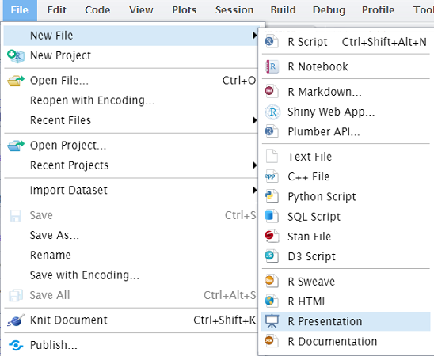
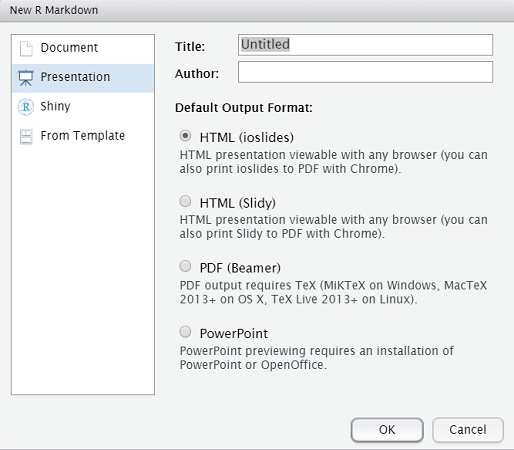

Presentations with R
========================================================
author: Brian High
date: 03 February, 2020
css: inc/deohs-rpres-theme.css
autosize: true

Why not use PowerPoint?
========================================================

- **Automation** - Generate slides from R with push of a button.
- **Markdown** - Easily convert Markdown documents into slides.
- **Web friendly** - Share as a web page or file. View in a browser.
- **Interactive** - Supports Shiny, Crosstalk, and HTML Widgets.
- **Customizable** - Create and modify themes with HTML/CSS.
- **Choice** - Multiple slide formats available to meet your needs.

And yes, PowerPoint output is an option if you really want that.

Create an R Presentation
========================================================

File → New File → R Presentation

Create an R Markdown Presentation
========================================================

File → New File → R Markdown → Presentation

What's the Difference?
========================================================

- **"R Presentation"**
  - The original (classic) presentation format in R Studio
  - In-line preview in R Studio "Presentation" tab
  - Markdown source file has `.Rpres` suffix and HTML output
- **"R Markdown Presentation"**
  - Uses YAML header
  - Markdown source file has `.Rmd` suffix
  - Produces HTML, PDF, or PowerPoint output
- **Both types use R Markdown syntax in the source document.**

Primary Format Choices
========================================================

- [R Presentation](https://support.rstudio.com/hc/en-us/articles/200486468-Authoring-R-Presentations) (Rpres): 
  - HTML slides with [remark.js](https://remarkjs.com/) (classic)
- R Markdown HTML [ioslides_presentation](https://bookdown.org/yihui/rmarkdown/ioslides-presentation.html): 
  - Nicer looking slides with interactive features
- R Markdown HTML [slidy_presentation](https://bookdown.org/yihui/rmarkdown/slidy-presentation.html): 
  - Plain looking slides with interactive features
- R Markdown PDF [beamer_presentation](https://bookdown.org/yihui/rmarkdown/beamer-presentation.html): 
  - PDF slides with templates and good LaTeX support
- R Markdown PowerPoint [powerpoint_presentation](https://bookdown.org/yihui/rmarkdown/powerpoint-presentation.html)

More R Markdown Presentation Formats
========================================================

- [xaringan::moon_reader](https://bookdown.org/yihui/rmarkdown/xaringan.html):
  - Uses [remark.js](https://remarkjs.com/) like Rpres but with a newer implementation
- [revealjs::revealjs_presentation](https://bookdown.org/yihui/rmarkdown/revealjs.html):
  - Uses [reveal.js](https://revealjs.com/), another Javascript presentation library
- Others: 
  - [Slidify](https://github.com/ramnathv/slidify)
  - [Shower](https://github.com/MangoTheCat/rmdshower)

The Basic Steps
========================================================

1. Select a slide format.
2. Create or modify an R Markdown document.
3. Divide content into slides by creating slide headings.
4. Adjust content to fit slide format.
5. Adjust slide transitions and other style features.

Examples
========================================================

Custom DEOHS theme:

- [R Presentation (remark.js)](RpresExample.Rpres)
- [xaringan (remark.js)](XaringanExample.Rpres) - with Crosstalk support
- [ioslides](IoslidesExample.Rmd) - with Crosstalk support
- [reveal.js](RevealjsExample.Rmd) - with Crosstalk support

Other:

- [slidy](SlidyExample.Rpres) - with Shiny support
- [beamer](BeamerExample.Rpres) - PDF output

Sample Templates with DEOHS Theme
========================================================

- [R Presentation (remark.js)](sample_templates/rpres_sample_template.Rpres)
- [xaringan (remark.js)](sample_templates/xaringan_sample_template.Rmd)
- [ioslides](sample_templates/ioslides_sample_template.Rmd)
- [reveal.js](sample_templates/revealjs_sample_template.Rmd)

Folder contents:

- **sample_templates** - Rmd/Rpres files using DEOHS theme
- **sample_templates/inc** - HTML and CSS theme files
- **sample_templates/img** - JPG and PNG theme files

Alternative Export Options
========================================================

If you have HTML slides, you may want to export to:

- **PDF** - **Knit** to PDF or **Save as** PDF from web browser.
- **Github** - Use **keep_md: true** and commit **md** and images.

Warning: When you export to non-HTML outputs, formatting and interactive content may be lost.

Ready to try it yourself?
========================================================

1. Make a presentation from R using the examples as a guide.
2. Use one of the provided custom templates.
3. Modify a template or theme to suit your preferences.
4. **Advanced:** Make your own custom templates and themes for:
   - [slidy_presentation](https://stackoverflow.com/questions/44381915)
   - [beamer_presentation](http://svmiller.com/blog/2019/08/r-markdown-template-beamer-presentations/)
   - [powerpoint_presentation](https://bookdown.org/yihui/rmarkdown/powerpoint-presentation.html#ppt-templates)
   
