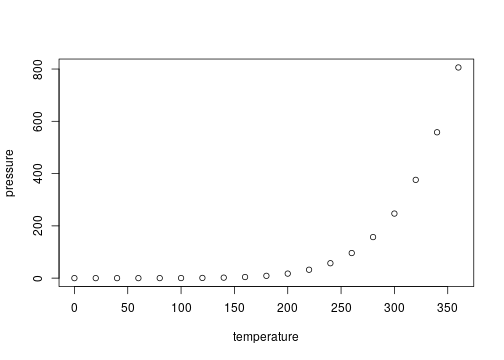

class: title-slide

<div style="text-align:left; padding-bottom: 125px;">
    
    <hr class="title-slide"/>
</div>

# Xaringan (Remark.js) Demo 

## Brian High

### 05 February, 2020

---
layout: true
<!-- Note: Footer interferes with heading rendering on the Crosstalk slide. -->
<div class="my-footer">
  
</div>
---

# Xaringan and Remark.js

[Remark.js](https://remarkjs.com/) is a Javascript library used for making 
slide presentations like this one. 

[xaringan](https://github.com/yihui/xaringan) ("Presentation Nina") is an R 
package for using Remark.js with R Markdown.

You can install the `xaringan` package like this:


```r
remotes::install_github('yihui/xaringan')
```

---

# R Markdown

This is an R Markdown presentation. Markdown is a simple formatting syntax for authoring HTML, PDF, and MS Word documents. For more details on using R Markdown see <http://rmarkdown.rstudio.com>.

When you click the **Knit** button a document will be generated that includes both content as well as the output of any embedded R code chunks within the document.

---

# Slide with Bullets

- Bullet 1
- Bullet 2
- Bullet 3

<aside class="notes">
Here are some notes.
</aside>

---

# Slide with Image and Link


- [DEOHS Website](https://deohs.washington.edu)

---

# Slide with R Output


```r
summary(cars)
```

```
##      speed           dist       
##  Min.   : 4.0   Min.   :  2.00  
##  1st Qu.:12.0   1st Qu.: 26.00  
##  Median :15.0   Median : 36.00  
##  Mean   :15.4   Mean   : 42.98  
##  3rd Qu.:19.0   3rd Qu.: 56.00  
##  Max.   :25.0   Max.   :120.00
```

---

# Slide with Table


```r
library(kableExtra)
knitr::kable(head(iris)) %>% kable_styling(font_size = 18)
```

<table class="table" style="font-size: 18px; margin-left: auto; margin-right: auto;">
 <thead>
  <tr>
   <th style="text-align:right;"> Sepal.Length </th>
   <th style="text-align:right;"> Sepal.Width </th>
   <th style="text-align:right;"> Petal.Length </th>
   <th style="text-align:right;"> Petal.Width </th>
   <th style="text-align:left;"> Species </th>
  </tr>
 </thead>
<tbody>
  <tr>
   <td style="text-align:right;"> 5.1 </td>
   <td style="text-align:right;"> 3.5 </td>
   <td style="text-align:right;"> 1.4 </td>
   <td style="text-align:right;"> 0.2 </td>
   <td style="text-align:left;"> setosa </td>
  </tr>
  <tr>
   <td style="text-align:right;"> 4.9 </td>
   <td style="text-align:right;"> 3.0 </td>
   <td style="text-align:right;"> 1.4 </td>
   <td style="text-align:right;"> 0.2 </td>
   <td style="text-align:left;"> setosa </td>
  </tr>
  <tr>
   <td style="text-align:right;"> 4.7 </td>
   <td style="text-align:right;"> 3.2 </td>
   <td style="text-align:right;"> 1.3 </td>
   <td style="text-align:right;"> 0.2 </td>
   <td style="text-align:left;"> setosa </td>
  </tr>
  <tr>
   <td style="text-align:right;"> 4.6 </td>
   <td style="text-align:right;"> 3.1 </td>
   <td style="text-align:right;"> 1.5 </td>
   <td style="text-align:right;"> 0.2 </td>
   <td style="text-align:left;"> setosa </td>
  </tr>
  <tr>
   <td style="text-align:right;"> 5.0 </td>
   <td style="text-align:right;"> 3.6 </td>
   <td style="text-align:right;"> 1.4 </td>
   <td style="text-align:right;"> 0.2 </td>
   <td style="text-align:left;"> setosa </td>
  </tr>
  <tr>
   <td style="text-align:right;"> 5.4 </td>
   <td style="text-align:right;"> 3.9 </td>
   <td style="text-align:right;"> 1.7 </td>
   <td style="text-align:right;"> 0.4 </td>
   <td style="text-align:left;"> setosa </td>
  </tr>
</tbody>
</table>

---

# Slide with Plot


```r
plot(pressure)
```

<!-- -->

---
layout: true
<!-- Removing the footer because it interferes with heading of next slide. -->
---

# Slide with Crosstalk Elements

## Fiji Earthquakes

<div class="smaller-font">


Magnitude
{
  "values": [4, 4, 4, 4, 4, 4, 4, 4.1, 4.1, 4.1, 4.1, 4.1, 4.1, 4.1, 4.1, 4.2, 4.2, 4.2, 4.2, 4.2, 4.3, 4.3, 4.3, 4.3, 4.3, 4.3, 4.3, 4.3, 4.3, 4.4, 4.4, 4.4, 4.4, 4.4, 4.4, 4.4, 4.4, 4.4, 4.4, 4.5, 4.5, 4.5, 4.5, 4.5, 4.5, 4.5, 4.5, 4.5, 4.5, 4.5, 4.5, 4.6, 4.6, 4.6, 4.6, 4.6, 4.6, 4.6, 4.6, 4.6, 4.7, 4.7, 4.7, 4.7, 4.7, 4.7, 4.7, 4.7, 4.7, 4.7, 4.7, 4.8, 4.8, 4.8, 4.9, 4.9, 4.9, 4.9, 4.9, 4.9, 5, 5, 5, 5, 5, 5.1, 5.1, 5.1, 5.2, 5.2, 5.3, 5.3, 5.4, 5.4, 5.4, 5.5, 5.6, 5.6, 5.7, 5.7],
  "keys": ["937", "6", "994", "299", "775", "483", "733", "793", "179", "185", "836", "820", "174", "954", "370", "628", "140", "327", "867", "779", "36", "215", "705", "992", "187", "206", "182", "800", "909", "768", "271", "880", "461", "913", "508", "977", "14", "301", "575", "813", "544", "626", "781", "72", "491", "270", "411", "886", "573", "737", "475", "641", "108", "64", "350", "658", "218", "164", "577", "197", "66", "719", "655", "627", "744", "511", "782", "957", "453", "929", "104", "609", "962", "866", "234", "395", "561", "148", "597", "974", "230", "398", "745", "63", "128", "764", "624", "312", "81", "568", "787", "191", "547", "459", "970", "952", "297", "167", "176", "376"],
  "group": ["SharedDatad1de4891"]
}


{"x":{"options":{"crs":{"crsClass":"L.CRS.EPSG3857","code":null,"proj4def":null,"projectedBounds":null,"options":{}}},"calls":[{"method":"addSelect","args":["SharedDatad1de4891"]},{"method":"addTiles","args":["//{s}.tile.openstreetmap.org/{z}/{x}/{y}.png",null,null,{"minZoom":0,"maxZoom":18,"tileSize":256,"subdomains":"abc","errorTileUrl":"","tms":false,"noWrap":false,"zoomOffset":0,"zoomReverse":false,"opacity":1,"zIndex":1,"detectRetina":false,"attribution":"&copy; <a href=\"http://openstreetmap.org\">OpenStreetMap<\/a> contributors, <a href=\"http://creativecommons.org/licenses/by-sa/2.0/\">CC-BY-SA<\/a>"}]},{"method":"addMarkers","args":[[-34.02,-15.83,-18.14,-17.1,-18.35,-19.85,-25.25,-16.2,-21.23,-19.62,-20.21,-19.76,-17.84,-20.24,-19.68,-17.95,-25.82,-24.5,-23.55,-19.45,-21.04,-23.97,-22.26,-17.99,-15.78,-14.28,-20.45,-22.34,-30.64,-19.86,-21.27,-18.1,-30.24,-35.94,-15.66,-11.49,-15.28,-21.6,-11.54,-15.85,-22.1,-11.76,-18.84,-15.2,-19.1,-21.04,-34.12,-24.57,-12.84,-23.53,-21.29,-38.59,-15.87,-27.21,-23.47,-20.77,-15.45,-27.6,-22.3,-22.85,-17.68,-18.13,-21.57,-32.22,-19.3,-26.54,-18.56,-21.97,-22.33,-17.71,-26,-23.95,-22.7,-13.82,-23.44,-14.12,-35.56,-24.6,-24.39,-17.02,-15.33,-21,-20.02,-13.09,-27.08,-16.96,-22.06,-10.8,-26.53,-18.18,-30.3,-25.81,-23.78,-18.11,-33,-19.17,-17.74,-23.85,-20.83,-12.93],[180.21,167.1,181.71,184.93,185.27,184.51,179.86,166.8,181.09,185.35,181.9,181.41,181.48,169.49,184.31,181.37,179.33,180.92,180.27,184.48,181.2,179.91,171.44,181.57,167.44,170.34,181.85,171.52,181.2,184.35,173.49,181.63,181.63,178.52,186.8,166.22,185.98,180.5,166.18,185.9,180.4,165.96,184.16,184.68,169.63,181.2,181.75,178.4,166.78,179.99,180.85,175.7,188.13,182.43,179.95,183.71,181.42,182.1,181.9,181.37,186.8,181.52,183.86,180.2,183,183.63,169.05,182.32,171.46,181.18,182.12,184.64,183.3,172.38,182.93,166.64,180.2,183.5,178.98,182.41,186.75,181.66,184.09,169.28,183.44,167.7,183.95,165.8,178.57,182.04,180.8,182.54,180.31,181.63,181.6,169.53,181.31,182.53,185.9,169.63],null,null,null,{"interactive":true,"draggable":false,"keyboard":true,"title":"","alt":"","zIndexOffset":0,"opacity":1,"riseOnHover":false,"riseOffset":250},null,null,null,null,null,{"interactive":false,"permanent":false,"direction":"auto","opacity":1,"offset":[0,0],"textsize":"10px","textOnly":false,"className":"","sticky":true},{"ctKey":["81","813","937","66","719","768","628","544","641","234","793","271","179","108","6","994","36","609","215","705","395","626","781","561","962","655","185","230","299","72","148","880","491","952","461","64","913","775","547","836","820","508","140","174","866","327","627","297","597","459","270","744","398","350","954","977","992","658","187","867","411","218","764","176","745","511","974","206","782","568","167","970","483","63","370","787","164","182","886","573","376","14","191","301","957","453","737","779","128","575","733","929","624","800","104","909","577","197","475","312"],"ctGroup":"SharedDatad1de4891"}]}],"limits":{"lat":[-38.59,-10.8],"lng":[165.8,188.13]}},"evals":[],"jsHooks":[]}


{"x":{"crosstalkOptions":{"key":["81","813","937","66","719","768","628","544","641","234","793","271","179","108","6","994","36","609","215","705","395","626","781","561","962","655","185","230","299","72","148","880","491","952","461","64","913","775","547","836","820","508","140","174","866","327","627","297","597","459","270","744","398","350","954","977","992","658","187","867","411","218","764","176","745","511","974","206","782","568","167","970","483","63","370","787","164","182","886","573","376","14","191","301","957","453","737","779","128","575","733","929","624","800","104","909","577","197","475","312"],"group":"SharedDatad1de4891"},"style":"bootstrap","filter":"none","extensions":["Scroller"],"data":[["81","813","937","66","719","768","628","544","641","234","793","271","179","108","6","994","36","609","215","705","395","626","781","561","962","655","185","230","299","72","148","880","491","952","461","64","913","775","547","836","820","508","140","174","866","327","627","297","597","459","270","744","398","350","954","977","992","658","187","867","411","218","764","176","745","511","974","206","782","568","167","970","483","63","370","787","164","182","886","573","376","14","191","301","957","453","737","779","128","575","733","929","624","800","104","909","577","197","475","312"],[-34.02,-15.83,-18.14,-17.1,-18.35,-19.85,-25.25,-16.2,-21.23,-19.62,-20.21,-19.76,-17.84,-20.24,-19.68,-17.95,-25.82,-24.5,-23.55,-19.45,-21.04,-23.97,-22.26,-17.99,-15.78,-14.28,-20.45,-22.34,-30.64,-19.86,-21.27,-18.1,-30.24,-35.94,-15.66,-11.49,-15.28,-21.6,-11.54,-15.85,-22.1,-11.76,-18.84,-15.2,-19.1,-21.04,-34.12,-24.57,-12.84,-23.53,-21.29,-38.59,-15.87,-27.21,-23.47,-20.77,-15.45,-27.6,-22.3,-22.85,-17.68,-18.13,-21.57,-32.22,-19.3,-26.54,-18.56,-21.97,-22.33,-17.71,-26,-23.95,-22.7,-13.82,-23.44,-14.12,-35.56,-24.6,-24.39,-17.02,-15.33,-21,-20.02,-13.09,-27.08,-16.96,-22.06,-10.8,-26.53,-18.18,-30.3,-25.81,-23.78,-18.11,-33,-19.17,-17.74,-23.85,-20.83,-12.93],[180.21,167.1,181.71,184.93,185.27,184.51,179.86,166.8,181.09,185.35,181.9,181.41,181.48,169.49,184.31,181.37,179.33,180.92,180.27,184.48,181.2,179.91,171.44,181.57,167.44,170.34,181.85,171.52,181.2,184.35,173.49,181.63,181.63,178.52,186.8,166.22,185.98,180.5,166.18,185.9,180.4,165.96,184.16,184.68,169.63,181.2,181.75,178.4,166.78,179.99,180.85,175.7,188.13,182.43,179.95,183.71,181.42,182.1,181.9,181.37,186.8,181.52,183.86,180.2,183,183.63,169.05,182.32,171.46,181.18,182.12,184.64,183.3,172.38,182.93,166.64,180.2,183.5,178.98,182.41,186.75,181.66,184.09,169.28,183.44,167.7,183.95,165.8,178.57,182.04,180.8,182.54,180.31,181.63,181.6,169.53,181.31,182.53,185.9,169.63],[75,43,574,286,201,184,491,98,613,57,576,105,542,100,195,642,600,377,535,246,591,518,83,579,40,642,534,106,175,201,48,592,80,138,45,84,162,595,89,121,603,45,210,99,266,483,75,562,150,538,607,162,52,55,543,251,409,154,309,397,112,618,156,216,302,66,217,261,119,574,205,43,180,613,158,63,42,67,562,420,48,600,234,654,63,45,134,175,600,609,275,201,518,568,72,268,575,204,104,641],[5.2,4.5,4,4.7,4.7,4.4,4.2,4.5,4.6,4.9,4.1,4.4,4.1,4.6,4,4,4.3,4.8,4.3,4.3,4.9,4.5,4.5,4.9,4.8,4.7,4.1,5,4,4.5,4.9,4.4,4.5,5.5,4.4,4.6,4.4,4,5.4,4.1,4.1,4.4,4.2,4.1,4.8,4.2,4.7,5.6,4.9,5.4,4.5,4.7,5,4.6,4.1,4.4,4.3,4.6,4.3,4.2,4.5,4.6,5.1,5.7,5,4.7,4.9,4.3,4.7,5.2,5.6,5.4,4,5,4.1,5.3,4.6,4.3,4.5,4.5,5.7,4.4,5.3,4.4,4.7,4.7,4.5,4.2,5,4.4,4,4.7,5.1,4.3,4.7,4.3,4.6,4.6,4.5,5.1],[65,19,20,25,57,26,23,21,18,31,16,15,20,22,12,17,13,43,22,15,45,23,25,49,42,29,14,43,16,30,42,28,17,78,11,32,36,22,80,17,11,51,17,14,31,10,41,80,35,87,23,36,30,10,21,47,27,22,11,15,35,41,70,90,65,34,35,13,32,67,98,45,13,61,20,69,32,25,30,29,123,10,71,22,27,23,17,12,69,26,14,40,71,36,22,21,42,27,19,57]],"container":"<table class=\"table table-condensed\">\n  <thead>\n    <tr>\n      <th> <\/th>\n      <th>lat<\/th>\n      <th>long<\/th>\n      <th>depth<\/th>\n      <th>mag<\/th>\n      <th>stations<\/th>\n    <\/tr>\n  <\/thead>\n<\/table>","options":{"deferRender":true,"scrollY":250,"scroller":true,"columnDefs":[{"className":"dt-right","targets":[1,2,3,4,5]},{"orderable":false,"targets":0}],"order":[],"autoWidth":false,"orderClasses":false},"selection":{"mode":"multiple","selected":null,"target":"row"}},"evals":[],"jsHooks":[]}


</div>
    
